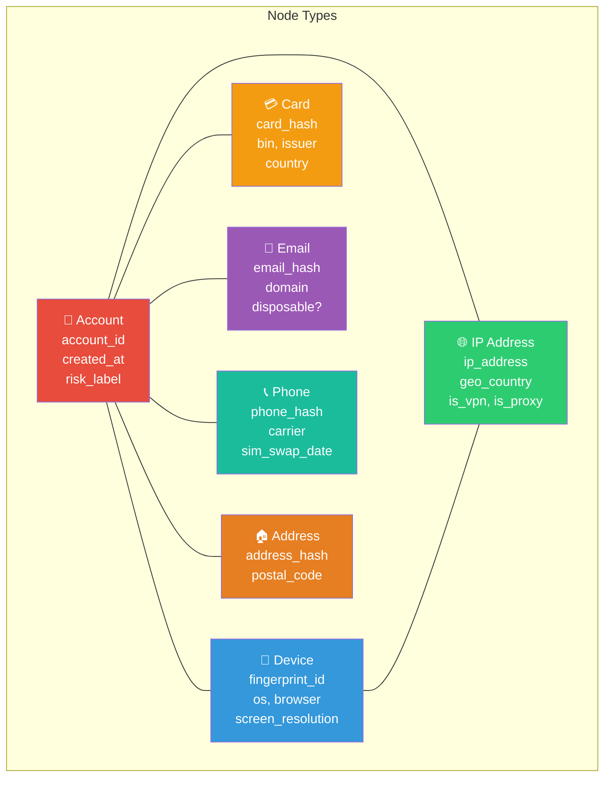
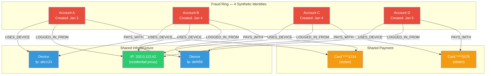
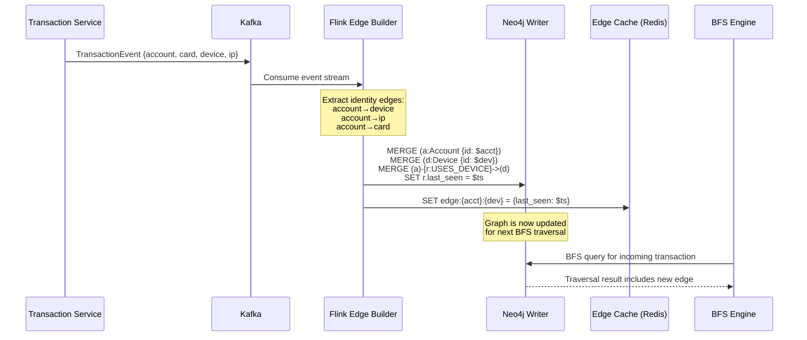

# Chapter 3: The Identity Graph Database 🔴

> **The Problem:** A single transaction looks innocent — $80 at an online electronics store. But the IP address behind it shares a device fingerprint with an account that was created yesterday from a SIM-swapped phone number, and that phone number was previously linked to an account that filed 7 chargebacks last month. Catching this requires not just scoring individual transactions, but **traversing a web of relationships** across accounts, devices, IPs, cards, emails, and phone numbers. You need a graph database — and you need to traverse it within **10 milliseconds**.

---

## Why Tabular Features Are Not Enough

Traditional fraud models operate on **flat feature vectors** — each row represents a single transaction with columns like `amount`, `card_txn_count_1m`, `merchant_category`. These features capture individual behavior patterns but are blind to **relational patterns**:

| Attack Pattern | Tabular Detection | Graph Detection |
|---|---|---|
| Single stolen card, rapid spending | ✅ Velocity features catch it | ✅ Also detected |
| 50 synthetic identities sharing 3 devices | ❌ Each identity looks new and clean | ✅ Device-sharing cluster is obvious |
| Account takeover via SIM swap, new device | ❌ New device → low history, looks like legitimate new customer | ✅ Phone number links to known compromised account |
| "Clean" mule account receives funds from 12 fraud victims | ❌ Mule's own transaction history is legitimate | ✅ Mule is 1 hop from known fraud nodes |
| Credential stuffing ring reusing residential proxies | ❌ IP reputation service may miss residential IPs | ✅ IP→device→account fanout reveals coordinated attack |

Organized fraud is fundamentally a **graph problem**. A graph database lets you answer questions that are computationally intractable with SQL JOINs:

- "How many distinct accounts have logged in from devices that share a fingerprint with this device?"
- "Is there a path of length ≤ 3 from this account to any account flagged for fraud?"
- "What is the fraud density of the 2-hop neighborhood around this IP address?"

---

## Graph Data Model

### Nodes (Entities)



### Edges (Relationships)

| Edge Type | From | To | Properties |
|---|---|---|---|
| `USES_DEVICE` | Account | Device | `first_seen`, `last_seen`, `session_count` |
| `LOGGED_IN_FROM` | Account | IP | `first_seen`, `last_seen`, `session_count` |
| `PAYS_WITH` | Account | Card | `added_at`, `is_primary` |
| `REGISTERED_WITH` | Account | Email | `verified`, `registered_at` |
| `VERIFIED_WITH` | Account | Phone | `verified_at`, `sim_swap_detected` |
| `SHIPS_TO` | Account | Address | `address_type`, `last_used` |
| `SEEN_ON` | Device | IP | `first_seen`, `last_seen` |

### Why This Model Works

The identity graph is **bipartite-like**: Account nodes connect to attribute nodes (Device, IP, Card, etc.), and attribute nodes implicitly connect accounts that share them. Two accounts sharing a device fingerprint are 2 hops apart: `Account_A → Device_X ← Account_B`.

This means:

- **1-hop**: Direct attributes of an account ("What devices has this account used?")
- **2-hop**: Shared-attribute neighbors ("What other accounts share a device with this account?")
- **3-hop**: Extended neighborhood ("What devices do *those* accounts use, and who else uses them?")

3-hop traversals are the sweet spot for fraud detection — deep enough to catch organized rings, shallow enough to compute within 10ms.

---

## Rust Graph Client Architecture

### The Graph Service Interface

```rust
use chrono::{DateTime, Utc};
use serde::{Deserialize, Serialize};
use std::collections::HashMap;
use uuid::Uuid;

/// Risk signal computed from graph traversal.
#[derive(Debug, Serialize, Deserialize)]
pub struct GraphRiskSignal {
    /// Unique request correlation ID.
    pub request_id: Uuid,
    /// The account being evaluated.
    pub account_id: String,
    /// Composite graph risk score (0.0 = safe, 1.0 = fraud).
    pub graph_risk_score: f64,
    /// Number of fraud-flagged accounts within N hops.
    pub fraud_neighbor_count: u32,
    /// Shortest path length to the nearest fraud node (-1 if none found).
    pub shortest_path_to_fraud: i32,
    /// Number of distinct accounts sharing at least one device.
    pub shared_device_account_count: u32,
    /// Number of distinct accounts sharing at least one IP.
    pub shared_ip_account_count: u32,
    /// Whether this account is part of a detected ring.
    pub is_ring_member: bool,
    /// Cluster density: edges / (nodes * (nodes - 1)) in the local subgraph.
    pub cluster_density: f64,
    /// Traversal latency in microseconds.
    pub traversal_latency_us: u64,
    /// Detailed per-hop breakdown.
    pub hop_details: Vec<HopDetail>,
}

#[derive(Debug, Serialize, Deserialize)]
pub struct HopDetail {
    pub hop: u8,
    pub nodes_visited: u32,
    pub fraud_nodes_found: u32,
    pub edge_types_traversed: Vec<String>,
    pub latency_us: u64,
}
```

### The Graph Traversal Trait

```rust
use async_trait::async_trait;

/// Trait abstracting the graph database backend.
/// Implementations exist for Neo4j (Bolt protocol), Amazon Neptune
/// (Gremlin/openCypher), and an in-memory test double.
#[async_trait]
pub trait GraphTraversal: Send + Sync {
    /// Perform a bounded BFS from the given account, computing risk signals.
    async fn compute_risk(
        &self,
        account_id: &str,
        max_hops: u8,
        timeout_ms: u64,
    ) -> Result<GraphRiskSignal, GraphError>;

    /// Ingest a new edge into the identity graph.
    async fn upsert_edge(
        &self,
        edge: IdentityEdge,
    ) -> Result<(), GraphError>;

    /// Mark an account as confirmed fraud (propagates label for training).
    async fn mark_fraud(
        &self,
        account_id: &str,
        reason: &str,
        confirmed_at: DateTime<Utc>,
    ) -> Result<(), GraphError>;
}

#[derive(Debug)]
pub struct IdentityEdge {
    pub from_type: NodeType,
    pub from_id: String,
    pub to_type: NodeType,
    pub to_id: String,
    pub edge_type: String,
    pub properties: HashMap<String, serde_json::Value>,
    pub observed_at: DateTime<Utc>,
}

#[derive(Debug, Clone, Copy)]
pub enum NodeType {
    Account,
    Device,
    IpAddress,
    Card,
    Email,
    Phone,
    Address,
}

#[derive(Debug, thiserror::Error)]
pub enum GraphError {
    #[error("graph traversal timed out after {0}ms")]
    Timeout(u64),
    #[error("graph database connection error: {0}")]
    Connection(String),
    #[error("node not found: {0}")]
    NodeNotFound(String),
    #[error("traversal exceeded budget: visited {visited} nodes, limit {limit}")]
    BudgetExceeded { visited: u32, limit: u32 },
}
```

---

## Neo4j Query Design: Cypher for Fraud

### The 3-Hop Fraud Neighbor Query

This is the core query that powers the graph risk signal. It starts from a given account, traverses up to 3 hops across identity edges, and collects fraud-related signals:

```cypher
// 3-hop BFS from the target account with pruning.
// Returns fraud neighbors, shared device/IP counts, and ring membership.
MATCH (target:Account {account_id: $account_id})

// Hop 1–3: traverse identity edges
CALL {
    WITH target
    MATCH path = (target)-[:USES_DEVICE|LOGGED_IN_FROM|PAYS_WITH|REGISTERED_WITH|VERIFIED_WITH*1..3]-(neighbor:Account)
    WHERE neighbor <> target
      AND neighbor.account_id <> $account_id
    WITH neighbor, min(length(path)) AS distance
    RETURN neighbor, distance
}

// Compute signals
WITH target,
     collect(DISTINCT neighbor) AS neighbors,
     [n IN collect({node: neighbor, dist: distance}) WHERE n.node.risk_label = 'fraud'] AS fraud_neighbors

// Shared device count
OPTIONAL MATCH (target)-[:USES_DEVICE]->(d:Device)<-[:USES_DEVICE]-(other:Account)
WHERE other <> target
WITH target, neighbors, fraud_neighbors,
     count(DISTINCT other) AS shared_device_accounts

// Shared IP count
OPTIONAL MATCH (target)-[:LOGGED_IN_FROM]->(ip:IpAddress)<-[:LOGGED_IN_FROM]-(other2:Account)
WHERE other2 <> target
WITH target, neighbors, fraud_neighbors, shared_device_accounts,
     count(DISTINCT other2) AS shared_ip_accounts

RETURN {
    total_neighbors: size(neighbors),
    fraud_neighbor_count: size(fraud_neighbors),
    shortest_path_to_fraud: CASE
        WHEN size(fraud_neighbors) > 0
        THEN min([fn IN fraud_neighbors | fn.dist])
        ELSE -1
    END,
    shared_device_account_count: shared_device_accounts,
    shared_ip_account_count: shared_ip_accounts
} AS signals
```

### Index Strategy

Graph traversal performance depends critically on how quickly you can find the starting node and fan out. These indexes are non-negotiable:

```cypher
-- Unique constraint + index on every entity's primary key.
CREATE CONSTRAINT account_id_unique IF NOT EXISTS
FOR (a:Account) REQUIRE a.account_id IS UNIQUE;

CREATE CONSTRAINT device_fingerprint_unique IF NOT EXISTS
FOR (d:Device) REQUIRE d.fingerprint_id IS UNIQUE;

CREATE CONSTRAINT ip_address_unique IF NOT EXISTS
FOR (ip:IpAddress) REQUIRE ip.ip_address IS UNIQUE;

CREATE CONSTRAINT card_hash_unique IF NOT EXISTS
FOR (c:Card) REQUIRE c.card_hash IS UNIQUE;

CREATE CONSTRAINT email_hash_unique IF NOT EXISTS
FOR (e:Email) REQUIRE e.email_hash IS UNIQUE;

CREATE CONSTRAINT phone_hash_unique IF NOT EXISTS
FOR (p:Phone) REQUIRE p.phone_hash IS UNIQUE;

-- Composite index for fast fraud neighbor filtering.
CREATE INDEX account_risk_label IF NOT EXISTS
FOR (a:Account) ON (a.risk_label);

-- Relationship property index for temporal filtering.
CREATE INDEX uses_device_last_seen IF NOT EXISTS
FOR ()-[r:USES_DEVICE]-() ON (r.last_seen);
```

### Query Performance: Why 3 Hops in 10ms Is Achievable

| Hop Depth | Typical Fanout per Node | Cumulative Nodes | Neo4j Traversal Time |
|---|---|---|---|
| 0 (start) | 1 | 1 | < 0.1ms (index lookup) |
| 1 | ~15 (devices, IPs, cards, etc.) | 16 | ~1ms |
| 2 | ~8 per attribute node | ~128 | ~3ms |
| 3 | ~8 per attribute node | ~1,024 | ~6ms |
| **Total** | — | ~1,024 | **~10ms** |

The key to staying within budget: **prune aggressively**.

---

## Pruning Strategies for Latency Control

Unconstrained graph traversal is dangerous. A single high-fanout node (e.g., a shared VPN IP used by 10,000 accounts) can blow up traversal time exponentially. We use three pruning strategies:

### 1. Fanout Limits

Cap the number of neighbors expanded per node:

```rust
/// Configuration for graph traversal pruning.
#[derive(Debug, Clone)]
pub struct TraversalConfig {
    /// Maximum hops from the starting account.
    pub max_hops: u8,
    /// Maximum neighbors to expand per node per hop.
    /// High-fanout nodes (shared IPs, popular devices) are capped here.
    pub max_fanout_per_node: u32,
    /// Maximum total nodes visited before aborting.
    pub max_total_nodes: u32,
    /// Hard timeout for the entire traversal.
    pub timeout_ms: u64,
    /// Edge types to traverse (empty = all).
    pub allowed_edge_types: Vec<String>,
    /// Minimum recency: ignore edges older than this.
    pub edge_recency_days: u32,
}

impl Default for TraversalConfig {
    fn default() -> Self {
        Self {
            max_hops: 3,
            max_fanout_per_node: 50,
            max_total_nodes: 2_000,
            timeout_ms: 10,
            allowed_edge_types: vec![],
            edge_recency_days: 90,
        }
    }
}
```

### 2. Temporal Pruning

Only traverse edges observed within the last N days. A device shared 3 years ago is irrelevant:

```cypher
MATCH (target:Account {account_id: $account_id})
      -[r:USES_DEVICE]->(d:Device)
WHERE r.last_seen > datetime() - duration({days: $recency_days})
RETURN d
```

### 3. High-Fanout Node Filtering

Some nodes are "toxic" for traversal — shared VPN endpoints, popular email domains, common device fingerprints. We maintain a **blacklist of high-fanout nodes** that are skipped during traversal:

```rust
use std::collections::HashSet;
use std::sync::Arc;
use tokio::sync::RwLock;

/// Maintains a set of node IDs that should be skipped during traversal
/// because they have excessively high fanout (e.g., a VPN IP used by
/// 50,000+ accounts).
pub struct HighFanoutFilter {
    blocked_nodes: Arc<RwLock<HashSet<String>>>,
    fanout_threshold: u32,
}

impl HighFanoutFilter {
    pub fn new(fanout_threshold: u32) -> Self {
        Self {
            blocked_nodes: Arc::new(RwLock::new(HashSet::new())),
            fanout_threshold,
        }
    }

    /// Check if a node should be skipped during traversal.
    pub async fn should_skip(&self, node_id: &str) -> bool {
        self.blocked_nodes.read().await.contains(node_id)
    }

    /// Periodically refresh the blocked set from the graph database.
    /// This runs as a background task, e.g., every 5 minutes.
    pub async fn refresh(&self, graph: &dyn GraphTraversal) -> Result<(), GraphError> {
        // Query: MATCH (n) WHERE size((n)--()) > $threshold RETURN n.id
        // In practice, this is a scheduled Cypher query.
        let _ = graph; // placeholder for actual query
        Ok(())
    }
}
```

---

## The BFS Traversal Engine

Here is the core Rust implementation of the bounded BFS that powers the graph risk computation:

```rust
use std::collections::{HashMap, HashSet, VecDeque};
use std::time::Instant;

/// A node discovered during BFS.
#[derive(Debug, Clone)]
struct DiscoveredNode {
    node_id: String,
    node_type: NodeType,
    hop_distance: u8,
    is_fraud: bool,
    parent_edge_type: String,
}

/// Result of a bounded BFS traversal.
struct BfsResult {
    nodes: Vec<DiscoveredNode>,
    fraud_nodes: Vec<DiscoveredNode>,
    visited_count: u32,
    max_hop_reached: u8,
    timed_out: bool,
}

/// Perform a bounded BFS from the given start node.
///
/// This is the algorithmic core of the graph risk engine. It uses a standard
/// BFS with three pruning mechanisms: fanout cap, total node budget, and
/// wall-clock timeout.
async fn bounded_bfs(
    start_account_id: &str,
    config: &TraversalConfig,
    graph: &dyn GraphTraversal,
    fanout_filter: &HighFanoutFilter,
) -> Result<BfsResult, GraphError> {
    let start = Instant::now();
    let mut visited: HashSet<String> = HashSet::new();
    let mut queue: VecDeque<(String, NodeType, u8, String)> = VecDeque::new();
    let mut discovered: Vec<DiscoveredNode> = Vec::new();
    let mut fraud_nodes: Vec<DiscoveredNode> = Vec::new();
    let mut timed_out = false;

    // Seed the BFS with the starting account.
    visited.insert(start_account_id.to_string());
    queue.push_back((
        start_account_id.to_string(),
        NodeType::Account,
        0,
        "ROOT".to_string(),
    ));

    while let Some((node_id, node_type, depth, edge_type)) = queue.pop_front() {
        // Check timeout.
        if start.elapsed().as_millis() as u64 >= config.timeout_ms {
            timed_out = true;
            break;
        }

        // Check hop limit.
        if depth > config.max_hops {
            continue;
        }

        // Check total node budget.
        if visited.len() as u32 >= config.max_total_nodes {
            break;
        }

        // Skip high-fanout nodes.
        if fanout_filter.should_skip(&node_id).await {
            continue;
        }

        // Fetch neighbors from the graph database.
        // In production, this is a batched Cypher/Gremlin query.
        let neighbors = fetch_neighbors(
            graph,
            &node_id,
            &node_type,
            config.max_fanout_per_node,
            config.edge_recency_days,
        ).await?;

        for neighbor in neighbors {
            if visited.contains(&neighbor.node_id) {
                continue;
            }
            visited.insert(neighbor.node_id.clone());

            let node = DiscoveredNode {
                node_id: neighbor.node_id.clone(),
                node_type: neighbor.node_type,
                hop_distance: depth + 1,
                is_fraud: neighbor.is_fraud,
                parent_edge_type: neighbor.edge_type.clone(),
            };

            if node.is_fraud {
                fraud_nodes.push(node.clone());
            }
            discovered.push(node);

            // Only continue BFS from non-leaf hops.
            if depth + 1 < config.max_hops {
                queue.push_back((
                    neighbor.node_id,
                    neighbor.node_type,
                    depth + 1,
                    neighbor.edge_type,
                ));
            }
        }
    }

    Ok(BfsResult {
        nodes: discovered,
        fraud_nodes,
        visited_count: visited.len() as u32,
        max_hop_reached: config.max_hops,
        timed_out,
    })
}

/// Placeholder: fetch neighbors from the graph database.
async fn fetch_neighbors(
    _graph: &dyn GraphTraversal,
    _node_id: &str,
    _node_type: &NodeType,
    _max_fanout: u32,
    _recency_days: u32,
) -> Result<Vec<NeighborInfo>, GraphError> {
    // In production: execute a Cypher query like
    //   MATCH (n {id: $node_id})-[r]-(m)
    //   WHERE r.last_seen > datetime() - duration({days: $recency})
    //   RETURN m, type(r) LIMIT $max_fanout
    Ok(vec![])
}

struct NeighborInfo {
    node_id: String,
    node_type: NodeType,
    edge_type: String,
    is_fraud: bool,
}
```

---

## Computing the Graph Risk Score

Raw BFS results need to be aggregated into a single **graph risk score** that the ML model can consume as a feature. We use a weighted scoring formula:

```rust
/// Compute a composite graph risk score from BFS results.
///
/// The score is a weighted combination of:
/// - Proximity to fraud: closer fraud nodes contribute more.
/// - Fraud density: what fraction of the neighborhood is fraud-flagged.
/// - Shared-attribute concentration: how many accounts share devices/IPs.
/// - Cluster density: how interconnected the local subgraph is.
fn compute_graph_risk_score(bfs: &BfsResult, config: &ScoringWeights) -> f64 {
    if bfs.nodes.is_empty() {
        return 0.0;
    }

    // 1. Proximity score: inverse-distance weighting of fraud nodes.
    let proximity_score = if bfs.fraud_nodes.is_empty() {
        0.0
    } else {
        let weighted_sum: f64 = bfs
            .fraud_nodes
            .iter()
            .map(|n| 1.0 / (n.hop_distance as f64))
            .sum();
        // Normalize by max possible (all nodes at hop 1 are fraud).
        let max_possible = bfs.nodes.len() as f64;
        (weighted_sum / max_possible).min(1.0)
    };

    // 2. Fraud density: fraction of discovered nodes that are fraud-flagged.
    let fraud_density = bfs.fraud_nodes.len() as f64 / bfs.nodes.len() as f64;

    // 3. Shared-attribute concentration.
    let shared_device_count = bfs
        .nodes
        .iter()
        .filter(|n| matches!(n.node_type, NodeType::Account)
            && n.parent_edge_type == "USES_DEVICE")
        .count() as f64;
    let concentration = (shared_device_count / 10.0).min(1.0); // normalize

    // 4. Cluster density: edges / possible edges in the discovered subgraph.
    //    Approximated by the ratio of edges to nodes.
    let cluster_density = if bfs.nodes.len() > 1 {
        let edges = bfs.nodes.len() as f64; // each node discovered via one edge
        let max_edges = (bfs.nodes.len() as f64) * (bfs.nodes.len() as f64 - 1.0) / 2.0;
        edges / max_edges
    } else {
        0.0
    };

    // Weighted combination.
    let score = config.proximity_weight * proximity_score
        + config.density_weight * fraud_density
        + config.concentration_weight * concentration
        + config.cluster_weight * cluster_density;

    score.clamp(0.0, 1.0)
}

#[derive(Debug, Clone)]
struct ScoringWeights {
    proximity_weight: f64,
    density_weight: f64,
    concentration_weight: f64,
    cluster_weight: f64,
}

impl Default for ScoringWeights {
    fn default() -> Self {
        Self {
            proximity_weight: 0.40,
            density_weight: 0.30,
            concentration_weight: 0.20,
            cluster_weight: 0.10,
        }
    }
}
```

---

## Ring Detection: Finding Organized Fraud

Beyond scoring individual accounts, the graph enables **ring detection** — identifying clusters of accounts that are likely operated by the same fraudster or fraud syndicate.

### What Makes a Ring?

A fraud ring is a tightly connected subgraph where:

1. Multiple accounts share a small number of devices and/or IPs.
2. The accounts were created within a similar time window.
3. The accounts exhibit coordinated transaction patterns (same merchant, same time).



All four accounts connected through two shared devices, one shared IP, and two shared stolen cards — this is a textbook fraud ring.

### The Ring Detection Algorithm

We use a **Union-Find (Disjoint Set)** approach combined with BFS clustering:

```rust
/// A detected fraud ring: a cluster of accounts linked by shared
/// devices, IPs, or other attributes.
#[derive(Debug, Serialize, Deserialize)]
pub struct FraudRing {
    pub ring_id: String,
    pub accounts: Vec<String>,
    pub shared_devices: Vec<String>,
    pub shared_ips: Vec<String>,
    pub shared_cards: Vec<String>,
    pub ring_size: usize,
    pub fraud_density: f64,
    pub earliest_account_created: DateTime<Utc>,
    pub latest_account_created: DateTime<Utc>,
    /// How tightly connected the ring is (0.0 to 1.0).
    pub cohesion_score: f64,
}

/// Union-Find data structure for clustering connected accounts.
struct UnionFind {
    parent: Vec<usize>,
    rank: Vec<usize>,
}

impl UnionFind {
    fn new(n: usize) -> Self {
        Self {
            parent: (0..n).collect(),
            rank: vec![0; n],
        }
    }

    fn find(&mut self, x: usize) -> usize {
        if self.parent[x] != x {
            self.parent[x] = self.find(self.parent[x]); // path compression
        }
        self.parent[x]
    }

    fn union(&mut self, x: usize, y: usize) {
        let rx = self.find(x);
        let ry = self.find(y);
        if rx == ry {
            return;
        }
        // Union by rank.
        match self.rank[rx].cmp(&self.rank[ry]) {
            std::cmp::Ordering::Less => self.parent[rx] = ry,
            std::cmp::Ordering::Greater => self.parent[ry] = rx,
            std::cmp::Ordering::Equal => {
                self.parent[ry] = rx;
                self.rank[rx] += 1;
            }
        }
    }
}

/// Detect fraud rings by clustering accounts that share devices or IPs.
///
/// Algorithm:
/// 1. For each attribute node (device, IP), find all connected accounts.
/// 2. Union those accounts together.
/// 3. Extract clusters of size ≥ min_ring_size.
/// 4. Compute cohesion and fraud density for each cluster.
fn detect_rings(
    shared_device_map: &HashMap<String, Vec<String>>,  // device_id → [account_ids]
    shared_ip_map: &HashMap<String, Vec<String>>,      // ip → [account_ids]
    fraud_accounts: &HashSet<String>,
    min_ring_size: usize,
) -> Vec<FraudRing> {
    // Build account index.
    let mut account_set: HashSet<String> = HashSet::new();
    for accounts in shared_device_map.values().chain(shared_ip_map.values()) {
        for acc in accounts {
            account_set.insert(acc.clone());
        }
    }
    let accounts: Vec<String> = account_set.into_iter().collect();
    let account_index: HashMap<String, usize> = accounts
        .iter()
        .enumerate()
        .map(|(i, a)| (a.clone(), i))
        .collect();

    let mut uf = UnionFind::new(accounts.len());

    // Union accounts sharing the same device.
    for device_accounts in shared_device_map.values() {
        if device_accounts.len() < 2 {
            continue;
        }
        let first = account_index[&device_accounts[0]];
        for acc in &device_accounts[1..] {
            let idx = account_index[acc];
            uf.union(first, idx);
        }
    }

    // Union accounts sharing the same IP.
    for ip_accounts in shared_ip_map.values() {
        if ip_accounts.len() < 2 {
            continue;
        }
        let first = account_index[&ip_accounts[0]];
        for acc in &ip_accounts[1..] {
            let idx = account_index[acc];
            uf.union(first, idx);
        }
    }

    // Extract clusters.
    let mut clusters: HashMap<usize, Vec<String>> = HashMap::new();
    for (i, acc) in accounts.iter().enumerate() {
        let root = uf.find(i);
        clusters.entry(root).or_default().push(acc.clone());
    }

    // Filter to rings above minimum size and compute signals.
    clusters
        .into_values()
        .filter(|cluster| cluster.len() >= min_ring_size)
        .map(|cluster| {
            let fraud_count = cluster
                .iter()
                .filter(|a| fraud_accounts.contains(*a))
                .count();
            let fraud_density = fraud_count as f64 / cluster.len() as f64;

            FraudRing {
                ring_id: uuid::Uuid::new_v4().to_string(),
                accounts: cluster.clone(),
                shared_devices: vec![], // populated from shared_device_map
                shared_ips: vec![],     // populated from shared_ip_map
                shared_cards: vec![],
                ring_size: cluster.len(),
                fraud_density,
                earliest_account_created: Utc::now(), // populated from graph
                latest_account_created: Utc::now(),
                cohesion_score: 0.0, // computed separately
            }
        })
        .collect()
}
```

---

## Graph Ingestion Pipeline

The identity graph must be kept **fresh**. Every transaction, login, and device event should update the graph within seconds. We use a **Kafka → Flink → Graph DB** pipeline:



### Edge Deduplication and Upsert

The graph must handle **upserts** — if an edge already exists, update its `last_seen` timestamp rather than creating a duplicate:

```rust
/// Build a Cypher MERGE query that upserts an edge.
/// MERGE is idempotent: creates the edge if it doesn't exist,
/// updates properties if it does.
fn build_upsert_query(edge: &IdentityEdge) -> String {
    let from_label = node_type_label(edge.from_type);
    let to_label = node_type_label(edge.to_type);

    format!(
        "MERGE (a:{from_label} {{id: $from_id}}) \
         MERGE (b:{to_label} {{id: $to_id}}) \
         MERGE (a)-[r:{edge_type}]->(b) \
         SET r.last_seen = $observed_at, \
             r += $properties",
        from_label = from_label,
        to_label = to_label,
        edge_type = edge.edge_type,
    )
}

fn node_type_label(nt: NodeType) -> &'static str {
    match nt {
        NodeType::Account => "Account",
        NodeType::Device => "Device",
        NodeType::IpAddress => "IpAddress",
        NodeType::Card => "Card",
        NodeType::Email => "Email",
        NodeType::Phone => "Phone",
        NodeType::Address => "Address",
    }
}
```

---

## Caching the Graph: Hot-Path Optimization

For the most frequently queried accounts (high-transaction merchants, repeat customers), executing a full BFS on every transaction is wasteful. We use a **two-tier caching strategy**:

### Tier 1: Redis Edge Cache

Cache the **1-hop neighborhood** of recently seen accounts in Redis. The BFS engine checks Redis first and only falls back to Neo4j for hops 2+:

```rust
use redis::AsyncCommands;

/// Cache the 1-hop neighborhood of an account in Redis.
/// TTL: 60 seconds — edges change infrequently within a minute.
async fn cache_one_hop(
    redis: &mut redis::aio::MultiplexedConnection,
    account_id: &str,
    neighbors: &[NeighborInfo],
) -> Result<(), redis::RedisError> {
    let key = format!("graph:1hop:{}", account_id);
    let serialized = serde_json::to_string(neighbors)
        .expect("neighbor serialization should not fail");
    redis.set_ex(&key, &serialized, 60).await?;
    Ok(())
}

/// Try to fetch 1-hop neighbors from cache before hitting Neo4j.
async fn get_cached_one_hop(
    redis: &mut redis::aio::MultiplexedConnection,
    account_id: &str,
) -> Option<Vec<NeighborInfo>> {
    let key = format!("graph:1hop:{}", account_id);
    let cached: Option<String> = redis.get(&key).await.ok()?;
    cached.and_then(|s| serde_json::from_str(&s).ok())
}
```

### Tier 2: Precomputed Graph Risk Scores

For the top 10% of accounts by transaction volume, precompute the graph risk score in a **background job** every 30 seconds and cache the result:

```rust
/// Background task: precompute graph risk scores for high-volume accounts.
async fn precompute_graph_scores(
    high_volume_accounts: &[String],
    graph: &dyn GraphTraversal,
    redis: &mut redis::aio::MultiplexedConnection,
    config: &TraversalConfig,
) -> Result<u32, GraphError> {
    let mut updated = 0;
    for account_id in high_volume_accounts {
        let signal = graph.compute_risk(account_id, config.max_hops, config.timeout_ms).await?;
        let key = format!("graph:risk:{}", account_id);
        let serialized = serde_json::to_string(&signal)
            .expect("signal serialization should not fail");
        let _: () = redis
            .set_ex(&key, &serialized, 60)
            .await
            .map_err(|e| GraphError::Connection(e.to_string()))?;
        updated += 1;
    }
    Ok(updated)
}
```

---

## Choosing a Graph Database

| Feature | Neo4j | Amazon Neptune | TigerGraph | JanusGraph |
|---|---|---|---|---|
| **Query Language** | Cypher | openCypher / Gremlin | GSQL | Gremlin |
| **Latency (3-hop, 1K nodes)** | ~8ms | ~12ms | ~5ms | ~15ms |
| **Max Graph Size** | 34B nodes (Enterprise) | Billions (managed) | Trillions | Billions |
| **ACID Transactions** | ✅ Full | ✅ | ✅ | ✅ (via backend) |
| **Managed Service** | Neo4j Aura | ✅ AWS-native | TigerGraph Cloud | Self-managed |
| **Rust Driver** | `neo4rs` crate | Bolt protocol / HTTP | HTTP REST | Gremlin-client |
| **Best For** | Rich Cypher queries, visualization | AWS-native teams | Extreme scale | Open-source flexibility |

### Our Recommendation

For fraud detection, **Neo4j** is the most pragmatic choice:

1. **Cypher** is the most expressive graph query language for fraud patterns.
2. The `neo4rs` Rust crate provides async, connection-pooled Bolt protocol access.
3. The visualization tools (Neo4j Bloom) are invaluable for analyst investigations.
4. Community and ecosystem support is unmatched.

For AWS-native shops, **Neptune** is a strong alternative with zero operational overhead.

---

## Integration with the Fraud Gateway

The graph risk signal is one of the five parallel subsystem calls from the fraud gateway (Chapter 1). Here's how it plugs in:

```rust
use std::time::Instant;
use tokio::time::{timeout, Duration};

/// Fetch graph risk signal with timeout and fallback.
///
/// This is called in parallel with the feature store, device fingerprint,
/// velocity service, and account history from the scatter-gather orchestrator.
pub async fn fetch_graph_risk(
    account_id: &str,
    graph: &dyn GraphTraversal,
    redis: &mut redis::aio::MultiplexedConnection,
    config: &TraversalConfig,
) -> GraphRiskSignal {
    let start = Instant::now();

    // Try precomputed cache first.
    let cache_key = format!("graph:risk:{}", account_id);
    if let Ok(Some(cached)) = redis.get::<_, Option<String>>(&cache_key).await {
        if let Ok(signal) = serde_json::from_str::<GraphRiskSignal>(&cached) {
            return signal;
        }
    }

    // Fall back to live BFS with timeout.
    let result = timeout(
        Duration::from_millis(config.timeout_ms),
        graph.compute_risk(account_id, config.max_hops, config.timeout_ms),
    )
    .await;

    match result {
        Ok(Ok(signal)) => signal,
        Ok(Err(_)) | Err(_) => {
            // Timeout or error: return a safe default.
            // We do NOT block the transaction because the graph is slow.
            GraphRiskSignal {
                request_id: uuid::Uuid::new_v4(),
                account_id: account_id.to_string(),
                graph_risk_score: 0.0, // assume safe on timeout
                fraud_neighbor_count: 0,
                shortest_path_to_fraud: -1,
                shared_device_account_count: 0,
                shared_ip_account_count: 0,
                is_ring_member: false,
                cluster_density: 0.0,
                traversal_latency_us: start.elapsed().as_micros() as u64,
                hop_details: vec![],
            }
        }
    }
}
```

---

## Graph Features for the ML Model

The graph risk signal is decomposed into individual features that the ML model consumes alongside tabular features from the feature store:

| Feature Name | Type | Description | Typical Range |
|---|---|---|---|
| `graph_risk_score` | f64 | Composite graph risk score | 0.0 – 1.0 |
| `fraud_neighbor_count` | u32 | Fraud-flagged accounts within 3 hops | 0 – 100+ |
| `shortest_path_to_fraud` | i32 | Hop distance to nearest fraud node | -1, 1, 2, 3 |
| `shared_device_account_count` | u32 | Accounts sharing a device with target | 0 – 50+ |
| `shared_ip_account_count` | u32 | Accounts sharing an IP with target | 0 – 1000+ |
| `is_ring_member` | bool | Whether account belongs to a detected ring | 0 or 1 |
| `cluster_density` | f64 | Interconnectedness of local subgraph | 0.0 – 1.0 |
| `hop1_fraud_ratio` | f64 | Fraction of 1-hop neighbors flagged as fraud | 0.0 – 1.0 |
| `hop2_fraud_ratio` | f64 | Fraction of 2-hop neighbors flagged as fraud | 0.0 – 1.0 |
| `account_creation_velocity` | f64 | Avg days between creation of accounts in cluster | 0.1 – 365+ |

These features are **extremely predictive**. In production systems, graph features alone can yield an AUC of 0.85+, and when combined with velocity and behavioral features, push total model AUC above 0.97.

---

## Operational Concerns

### Graph Size and Memory

| Entity | Estimated Count (large PSP) | Storage |
|---|---|---|
| Account nodes | 500M | ~50 GB |
| Device nodes | 200M | ~20 GB |
| IP nodes | 1B | ~80 GB |
| Card nodes | 300M | ~30 GB |
| Edges (all types) | 5B | ~400 GB |
| **Total graph** | — | **~580 GB** |

Neo4j Enterprise can handle this on a 3-node cluster with 256 GB RAM each, keeping the hot portion of the graph (recent 90 days of edges) in memory.

### Graph Compaction

Old edges decay in relevance. A nightly **compaction job** prunes edges older than the retention window:

```cypher
// Delete edges not seen in the last 180 days.
CALL apoc.periodic.iterate(
    "MATCH ()-[r]->() WHERE r.last_seen < datetime() - duration({days: 180}) RETURN r",
    "DELETE r",
    {batchSize: 10000}
)
```

### Monitoring

| Metric | Target | Alert Threshold |
|---|---|---|
| P99 BFS latency | ≤ 10ms | > 15ms |
| Cache hit rate (Tier 1) | ≥ 60% | < 40% |
| Graph write latency | ≤ 5ms | > 10ms |
| Nodes visited per query (avg) | < 500 | > 1,500 |
| Ring detection batch time | ≤ 30s | > 60s |

---

## Amazon Neptune Alternative: Gremlin Queries

For teams on AWS, here is the equivalent traversal in Gremlin:

```groovy
// 3-hop fraud neighbor traversal in Gremlin (Amazon Neptune)
g.V().has('Account', 'account_id', accountId)
  .repeat(
    both('USES_DEVICE', 'LOGGED_IN_FROM', 'PAYS_WITH', 'REGISTERED_WITH', 'VERIFIED_WITH')
    .simplePath()
  )
  .times(3)
  .hasLabel('Account')
  .has('risk_label', 'fraud')
  .path()
  .limit(100)
```

```groovy
// Shared device count
g.V().has('Account', 'account_id', accountId)
  .out('USES_DEVICE')
  .in('USES_DEVICE')
  .where(neq('start'))
  .dedup()
  .count()
```

---

## Testing the Graph Layer

### Property-Based Testing

Graph traversal is notoriously hard to test with unit tests alone. We use **property-based testing** (via the `proptest` crate) to assert invariants:

```rust
#[cfg(test)]
mod tests {
    use super::*;
    use proptest::prelude::*;

    proptest! {
        /// Invariant: the graph risk score is always in [0.0, 1.0].
        #[test]
        fn graph_risk_score_is_bounded(
            fraud_count in 0u32..100,
            total_count in 1u32..1000,
            max_hop in 1u8..4,
        ) {
            let bfs = BfsResult {
                nodes: (0..total_count)
                    .map(|i| DiscoveredNode {
                        node_id: format!("node_{}", i),
                        node_type: NodeType::Account,
                        hop_distance: (i as u8 % max_hop) + 1,
                        is_fraud: i < fraud_count,
                        parent_edge_type: "USES_DEVICE".to_string(),
                    })
                    .collect(),
                fraud_nodes: (0..fraud_count.min(total_count))
                    .map(|i| DiscoveredNode {
                        node_id: format!("node_{}", i),
                        node_type: NodeType::Account,
                        hop_distance: (i as u8 % max_hop) + 1,
                        is_fraud: true,
                        parent_edge_type: "USES_DEVICE".to_string(),
                    })
                    .collect(),
                visited_count: total_count,
                max_hop_reached: max_hop,
                timed_out: false,
            };

            let score = compute_graph_risk_score(&bfs, &ScoringWeights::default());
            prop_assert!(score >= 0.0 && score <= 1.0,
                "Score {} is out of bounds", score);
        }

        /// Invariant: more fraud neighbors → higher risk score.
        #[test]
        fn more_fraud_means_higher_score(
            fraud_count_a in 0u32..50,
            fraud_count_b in 51u32..100,
            total_count in 100u32..200,
        ) {
            let make_bfs = |fraud_count: u32| BfsResult {
                nodes: (0..total_count)
                    .map(|i| DiscoveredNode {
                        node_id: format!("node_{}", i),
                        node_type: NodeType::Account,
                        hop_distance: 2,
                        is_fraud: i < fraud_count,
                        parent_edge_type: "USES_DEVICE".to_string(),
                    })
                    .collect(),
                fraud_nodes: (0..fraud_count)
                    .map(|i| DiscoveredNode {
                        node_id: format!("node_{}", i),
                        node_type: NodeType::Account,
                        hop_distance: 2,
                        is_fraud: true,
                        parent_edge_type: "USES_DEVICE".to_string(),
                    })
                    .collect(),
                visited_count: total_count,
                max_hop_reached: 3,
                timed_out: false,
            };

            let weights = ScoringWeights::default();
            let score_a = compute_graph_risk_score(&make_bfs(fraud_count_a), &weights);
            let score_b = compute_graph_risk_score(&make_bfs(fraud_count_b), &weights);
            prop_assert!(score_b >= score_a,
                "More fraud ({}) should score ≥ less fraud ({}): {} vs {}",
                fraud_count_b, fraud_count_a, score_b, score_a);
        }
    }
}
```

---

## Summary

> **Key Takeaways**
>
> 1. **Fraud is a graph problem.** Individual transaction scoring misses organized crime rings that share devices, IPs, and stolen credentials across synthetic identities.
> 2. **The identity graph** models entities (Account, Device, IP, Card, Email, Phone, Address) as nodes and shared-attribute relationships as edges. Two accounts sharing a device are 2 hops apart.
> 3. **Bounded BFS** with aggressive pruning (fanout caps, temporal filtering, high-fanout node blacklists) keeps 3-hop traversals within a 10ms latency budget.
> 4. **Graph risk features** — proximity to fraud, fraud density, shared-attribute concentration, cluster density — are among the most predictive signals for ML models (AUC 0.85+ from graph features alone).
> 5. **Ring detection** uses Union-Find clustering over shared attributes to identify coordinated fraud operations.
> 6. **Two-tier caching** (Redis 1-hop cache + precomputed risk scores) reduces Neo4j load by 60%+ and ensures the graph subsystem respects the 10ms budget allocated by the scatter-gather orchestrator.
> 7. **Graph ingestion** via Kafka → Flink → Neo4j keeps the identity graph fresh within seconds of each transaction event.
> 8. **Graceful degradation**: if the graph times out, the fraud gateway proceeds with a safe default (score 0.0) — the ML model and rules engine provide defense in depth.
