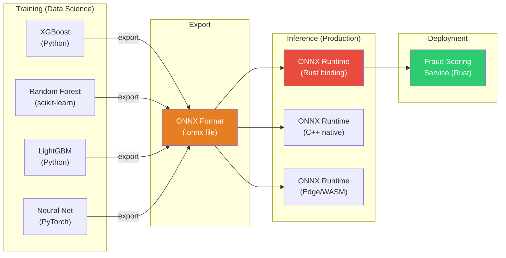
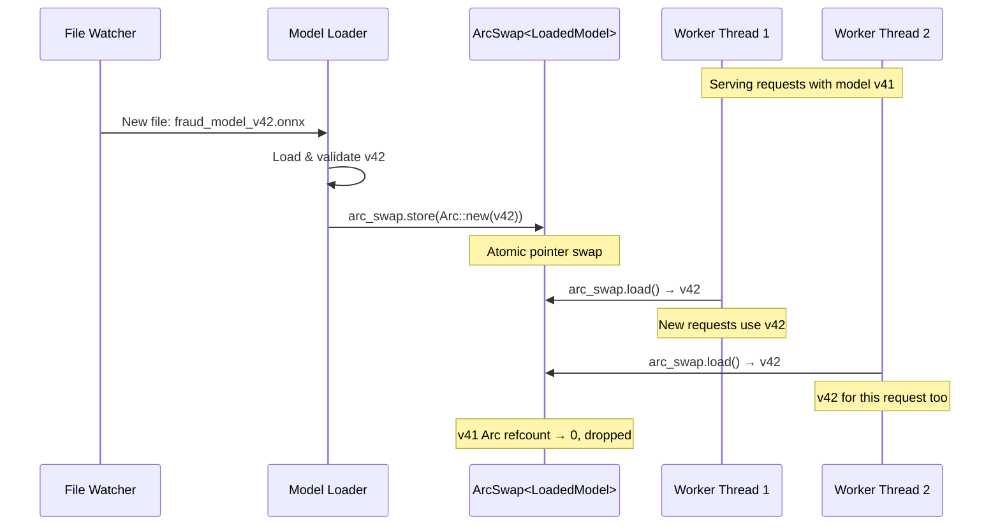
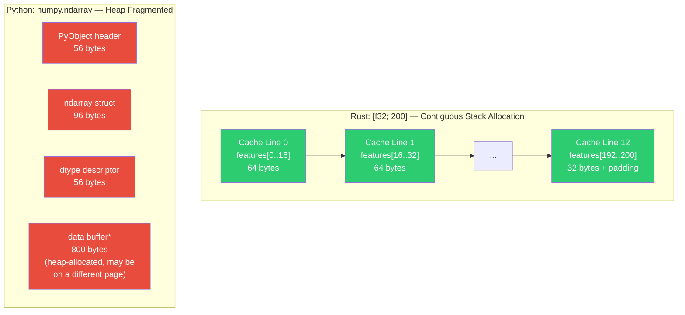
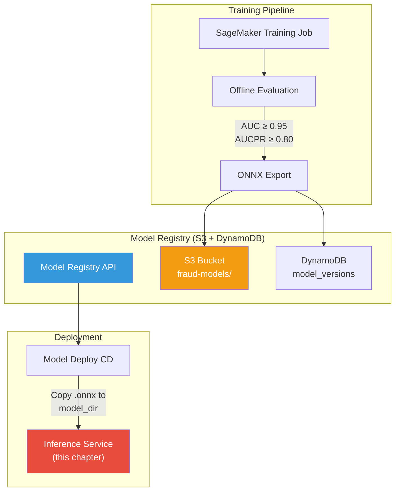

# Chapter 4: Low-Latency ML Inference 🔴

> **The Problem:** Your XGBoost model achieves 0.96 AUC on the test set. You pickle it, wrap it in a Python Flask server behind Gunicorn, deploy it on Kubernetes, and… p99 latency is **280ms**. The garbage collector pauses, the GIL blocks concurrent requests, cold-start pods take 12 seconds, and under load the autoscaler cannot keep up. You have **5 milliseconds** of the overall 50ms budget allocated to ML inference. Python is not an option.

---

## Why Python Fails at Fraud-Scale Inference

Before diving into the solution, let's understand exactly why the obvious approach — Python + Flask/FastAPI + scikit-learn/XGBoost — collapses under production fraud workloads:

| Dimension | Python (Flask + XGBoost) | Rust (ONNX Runtime) |
|---|---|---|
| **Cold-start latency** | 8–15s (import numpy, load model) | 50–200ms (mmap model into memory) |
| **p50 inference latency** | 15–40ms | 0.3–1.2ms |
| **p99 inference latency** | 80–300ms (GC pauses) | 2–5ms (deterministic) |
| **Concurrency model** | GIL — one thread evaluates at a time | Truly parallel across all cores |
| **Memory per pod** | 500MB–2GB (Python runtime + numpy + model) | 30–80MB (statically linked binary + model) |
| **Throughput (1 pod, 4 cores)** | ~200 req/s | ~12,000 req/s |
| **Cost (10K TPS target)** | 50 pods × $0.10/hr = $5.00/hr | 2 pods × $0.10/hr = $0.20/hr |
| **Tail latency under load** | Exponential degradation | Linear, bounded |

The core issues in Python:

1. **Global Interpreter Lock (GIL):** Only one thread can execute Python bytecode at a time. XGBoost's `predict()` holds the GIL during tree traversal. Gunicorn works around this with process-per-worker, but each process duplicates the model in memory.
2. **Garbage Collection:** CPython's reference-counting GC with cycle detection triggers stop-the-world pauses of 10–50ms. At p99, this alone exceeds the 5ms budget.
3. **Memory layout:** Python objects have ~56 bytes of overhead per object. A feature vector of 200 floats in Python consumes ~11KB; in Rust it's 800 bytes (contiguous `[f32; 200]`).
4. **Serialization overhead:** Converting a JSON request → Python dict → numpy array → internal C buffer involves multiple copies and allocations.

---

## The ONNX Runtime Solution

### What Is ONNX?

**Open Neural Network Exchange (ONNX)** is an open format for representing machine learning models. It decouples model training (done in Python, R, Julia — whatever your data scientists prefer) from model inference (done in a high-performance runtime).



The workflow:

1. **Data scientists train** a model in Python using their preferred framework.
2. **The model is exported** to ONNX format (`model.onnx`).
3. **The production service** loads the ONNX model into ONNX Runtime and evaluates it — no Python involved.

### Why ONNX Runtime?

| Runtime | Language | Tree Model Support | GPU Support | Latency (200 features, XGBoost 500 trees) |
|---|---|---|---|---|
| XGBoost C API | C++ | ✅ Native | ✅ | ~2ms |
| ONNX Runtime | C++ | ✅ via `ml.tree_ensemble_classifier` | ✅ | ~0.8ms |
| Treelite | C++ | ✅ Compiles trees to native code | ❌ | ~0.5ms |
| Python XGBoost | Python | ✅ | ✅ | ~18ms |

ONNX Runtime wins for general purpose: it supports both tree models and neural networks, has first-class Rust bindings via the `ort` crate, and includes optimizations like graph-level constant folding, operator fusion, and parallel tree evaluation.

---

## Exporting the Model from Python

This is the one step that remains in Python — running once during model training, not in production:

```python
# export_model.py — run during CI/CD model training pipeline
import xgboost as xgb
import onnxmltools
from onnxmltools.convert.common.data_types import FloatTensorType
import onnxruntime as ort
import numpy as np

# 1. Train the model (simplified)
model = xgb.XGBClassifier(
    n_estimators=500,
    max_depth=8,
    learning_rate=0.05,
    objective='binary:logistic',
    eval_metric='aucpr',
    tree_method='hist',
)
model.fit(X_train, y_train)

# 2. Define the ONNX input schema — must match the Rust feature vector
feature_names = [
    "amount_usd", "card_txn_count_1m", "card_txn_count_5m",
    "card_txn_count_1h", "card_txn_sum_1h", "card_distinct_merchants_1h",
    "ip_txn_count_1m", "ip_distinct_cards_1h", "device_age_hours",
    "account_age_days", "account_chargeback_rate", "graph_risk_score",
    "graph_fraud_density_2hop", "graph_shared_device_count",
    "device_fingerprint_confidence", "email_domain_risk",
    "is_vpn", "is_proxy", "is_tor",
    "hour_of_day_sin", "hour_of_day_cos",
    "day_of_week_sin", "day_of_week_cos",
    "amount_zscore_card_30d", "merchant_category_risk",
    # ... 200 features total
]

initial_type = [("features", FloatTensorType([None, len(feature_names)]))]

# 3. Convert to ONNX
onnx_model = onnxmltools.convert_xgboost(
    model,
    initial_types=initial_type,
    target_opset=17,
)

# 4. Validate: inference in Python vs ONNX must match
session = ort.InferenceSession(onnx_model.SerializeToString())
sample = X_test[:100].astype(np.float32)

python_pred = model.predict_proba(sample)[:, 1]
onnx_pred = session.run(None, {"features": sample})[1][:, 1]

max_diff = np.max(np.abs(python_pred - onnx_pred))
assert max_diff < 1e-5, f"Model divergence: {max_diff}"
print(f"✅ Max prediction divergence: {max_diff:.8f}")

# 5. Save
with open("fraud_model_v42.onnx", "wb") as f:
    f.write(onnx_model.SerializeToString())

# 6. Record metadata for the model registry
metadata = {
    "model_version": "v42",
    "framework": "xgboost",
    "n_features": len(feature_names),
    "n_estimators": 500,
    "auc_test": float(roc_auc_score(y_test, model.predict_proba(X_test)[:, 1])),
    "aucpr_test": float(average_precision_score(y_test, model.predict_proba(X_test)[:, 1])),
    "export_timestamp": datetime.utcnow().isoformat(),
    "onnx_opset": 17,
    "max_divergence": float(max_diff),
}
```

---

## The Rust Inference Service

### Project Dependencies

```toml
# Cargo.toml
[package]
name = "fraud-inference"
version = "0.1.0"
edition = "2021"

[dependencies]
ort = { version = "2.0", features = ["load-dynamic"] }
tokio = { version = "1", features = ["full"] }
axum = "0.7"
serde = { version = "1", features = ["derive"] }
serde_json = "1"
tracing = "0.1"
tracing-subscriber = { version = "0.3", features = ["env-filter"] }
metrics = "0.23"
metrics-exporter-prometheus = "0.15"
ndarray = "0.16"
thiserror = "2"
parking_lot = "0.12"
arc-swap = "1"
notify = "6"

[profile.release]
opt-level = 3
lto = "fat"
codegen-units = 1
target-cpu = "native"
panic = "abort"
```

### The Feature Vector

The feature vector is the contract between the feature-assembly layer (Chapter 1) and the inference service. It must be a contiguous array of `f32` values in a fixed, deterministic order.

```rust
use serde::{Deserialize, Serialize};

/// The number of features expected by the model.
/// MUST match the ONNX model's input dimension.
pub const NUM_FEATURES: usize = 200;

/// Strongly-typed feature vector. The field order matches the ONNX input schema.
/// Fields are grouped by source subsystem for readability.
#[derive(Debug, Clone, Serialize, Deserialize)]
pub struct FeatureVector {
    // --- Transaction-level (from request) ---
    pub amount_usd: f32,
    pub merchant_category_code: f32,
    pub is_card_present: f32,
    pub is_recurring: f32,
    pub is_international: f32,

    // --- Velocity (from Feature Store, Ch 2) ---
    pub card_txn_count_1m: f32,
    pub card_txn_count_5m: f32,
    pub card_txn_count_1h: f32,
    pub card_txn_count_24h: f32,
    pub card_txn_sum_1h: f32,
    pub card_txn_sum_24h: f32,
    pub card_distinct_merchants_1h: f32,
    pub card_distinct_merchants_24h: f32,
    pub ip_txn_count_1m: f32,
    pub ip_txn_count_1h: f32,
    pub ip_distinct_cards_1h: f32,

    // --- Graph features (from Identity Graph, Ch 3) ---
    pub graph_risk_score: f32,
    pub graph_fraud_density_2hop: f32,
    pub graph_shared_device_count: f32,
    pub graph_cluster_size: f32,
    pub graph_fraud_proximity: f32,

    // --- Device fingerprint ---
    pub device_age_hours: f32,
    pub device_fingerprint_confidence: f32,
    pub device_session_count: f32,

    // --- Account history ---
    pub account_age_days: f32,
    pub account_chargeback_rate: f32,
    pub account_total_txn_count: f32,
    pub account_dispute_count_90d: f32,

    // --- Contextual / derived ---
    pub is_vpn: f32,
    pub is_proxy: f32,
    pub is_tor: f32,
    pub email_domain_risk: f32,
    pub hour_of_day_sin: f32,
    pub hour_of_day_cos: f32,
    pub day_of_week_sin: f32,
    pub day_of_week_cos: f32,
    pub amount_zscore_card_30d: f32,
    pub merchant_category_risk: f32,

    // Remaining features stored in a flat array for extensibility.
    // New features are appended here and the model is retrained.
    #[serde(default)]
    pub additional_features: Vec<f32>,
}

impl FeatureVector {
    /// Serialize to a contiguous f32 array in the exact order the ONNX model expects.
    /// This avoids any intermediate allocation beyond the output buffer.
    pub fn to_array(&self) -> [f32; NUM_FEATURES] {
        let mut buf = [0.0f32; NUM_FEATURES];
        let mut i = 0;

        macro_rules! push {
            ($field:expr) => {
                buf[i] = $field;
                i += 1;
            };
        }

        push!(self.amount_usd);
        push!(self.merchant_category_code);
        push!(self.is_card_present);
        push!(self.is_recurring);
        push!(self.is_international);

        push!(self.card_txn_count_1m);
        push!(self.card_txn_count_5m);
        push!(self.card_txn_count_1h);
        push!(self.card_txn_count_24h);
        push!(self.card_txn_sum_1h);
        push!(self.card_txn_sum_24h);
        push!(self.card_distinct_merchants_1h);
        push!(self.card_distinct_merchants_24h);
        push!(self.ip_txn_count_1m);
        push!(self.ip_txn_count_1h);
        push!(self.ip_distinct_cards_1h);

        push!(self.graph_risk_score);
        push!(self.graph_fraud_density_2hop);
        push!(self.graph_shared_device_count);
        push!(self.graph_cluster_size);
        push!(self.graph_fraud_proximity);

        push!(self.device_age_hours);
        push!(self.device_fingerprint_confidence);
        push!(self.device_session_count);

        push!(self.account_age_days);
        push!(self.account_chargeback_rate);
        push!(self.account_total_txn_count);
        push!(self.account_dispute_count_90d);

        push!(self.is_vpn);
        push!(self.is_proxy);
        push!(self.is_tor);
        push!(self.email_domain_risk);
        push!(self.hour_of_day_sin);
        push!(self.hour_of_day_cos);
        push!(self.day_of_week_sin);
        push!(self.day_of_week_cos);
        push!(self.amount_zscore_card_30d);
        push!(self.merchant_category_risk);

        // Copy additional features into remaining slots.
        for &val in &self.additional_features {
            if i >= NUM_FEATURES {
                break;
            }
            buf[i] = val;
            i += 1;
        }

        // Any unfilled slots remain 0.0 — model is trained to handle missing features as 0.
        buf
    }
}
```

### Loading the ONNX Model

The ONNX model is loaded once at startup and held behind an `ArcSwap` so it can be hot-reloaded without restarting the service.

```rust
use std::path::{Path, PathBuf};
use std::sync::Arc;
use arc_swap::ArcSwap;
use ort::{Environment, Session, SessionBuilder, Value};
use ndarray::Array2;
use thiserror::Error;
use tracing::{info, warn, error};

#[derive(Error, Debug)]
pub enum ModelError {
    #[error("ONNX runtime error: {0}")]
    OrtError(#[from] ort::Error),

    #[error("Model file not found: {0}")]
    NotFound(PathBuf),

    #[error("Invalid model output shape")]
    InvalidOutput,

    #[error("Feature dimension mismatch: expected {expected}, got {actual}")]
    DimensionMismatch { expected: usize, actual: usize },
}

/// Holds a loaded ONNX session and model metadata.
pub struct LoadedModel {
    session: Session,
    pub version: String,
    pub input_dim: usize,
}

impl LoadedModel {
    pub fn load(env: &Arc<Environment>, path: &Path, version: String) -> Result<Self, ModelError> {
        if !path.exists() {
            return Err(ModelError::NotFound(path.to_path_buf()));
        }

        let session = SessionBuilder::new(env)?
            .with_optimization_level(ort::GraphOptimizationLevel::Level3)?
            .with_intra_threads(1)? // Each request gets its own thread — avoid contention
            .with_model_from_file(path)?;

        // Validate input dimensions match our feature vector.
        let input_info = &session.inputs[0];
        let input_dim = match &input_info.input_type {
            ort::ValueType::Tensor { ty: _, dimensions } => {
                dimensions.last().copied().flatten().unwrap_or(0) as usize
            }
            _ => 0,
        };

        if input_dim != NUM_FEATURES {
            return Err(ModelError::DimensionMismatch {
                expected: NUM_FEATURES,
                actual: input_dim,
            });
        }

        info!(
            version = %version,
            input_dim = input_dim,
            path = %path.display(),
            "Loaded ONNX model"
        );

        Ok(Self {
            session,
            version,
            input_dim,
        })
    }

    /// Run inference on a single feature vector.
    /// Returns the fraud probability P(fraud | features).
    pub fn predict(&self, features: &[f32; NUM_FEATURES]) -> Result<f32, ModelError> {
        // Create a 1×200 input tensor — zero-copy view over the slice.
        let input_array = Array2::from_shape_vec(
            (1, NUM_FEATURES),
            features.to_vec(),
        ).map_err(|_| ModelError::InvalidOutput)?;

        let input_tensor = Value::from_array(input_array)?;
        let outputs = self.session.run(vec![input_tensor])?;

        // XGBoost classifier ONNX output:
        //   output[0] = predicted label (int64)
        //   output[1] = probability map [{0: p_legit, 1: p_fraud}]
        // We extract the fraud probability from output[1].
        self.extract_fraud_probability(&outputs)
    }

    /// Batch inference — for shadow mode evaluation (Chapter 5).
    pub fn predict_batch(
        &self,
        batch: &[&[f32; NUM_FEATURES]],
    ) -> Result<Vec<f32>, ModelError> {
        let batch_size = batch.len();
        let mut flat = Vec::with_capacity(batch_size * NUM_FEATURES);
        for features in batch {
            flat.extend_from_slice(features.as_slice());
        }

        let input_array = Array2::from_shape_vec(
            (batch_size, NUM_FEATURES),
            flat,
        ).map_err(|_| ModelError::InvalidOutput)?;

        let input_tensor = Value::from_array(input_array)?;
        let outputs = self.session.run(vec![input_tensor])?;

        self.extract_fraud_probabilities_batch(&outputs, batch_size)
    }

    fn extract_fraud_probability(
        &self,
        outputs: &[Value],
    ) -> Result<f32, ModelError> {
        // Output index 1 contains the probability map.
        let probs = outputs
            .get(1)
            .ok_or(ModelError::InvalidOutput)?
            .extract_tensor::<f32>()
            .map_err(|_| ModelError::InvalidOutput)?;

        // Shape: [1, 2] — we want index [0, 1] (fraud class).
        let view = probs.view();
        view.get([0, 1])
            .copied()
            .ok_or(ModelError::InvalidOutput)
    }

    fn extract_fraud_probabilities_batch(
        &self,
        outputs: &[Value],
        batch_size: usize,
    ) -> Result<Vec<f32>, ModelError> {
        let probs = outputs
            .get(1)
            .ok_or(ModelError::InvalidOutput)?
            .extract_tensor::<f32>()
            .map_err(|_| ModelError::InvalidOutput)?;

        let view = probs.view();
        let mut results = Vec::with_capacity(batch_size);
        for i in 0..batch_size {
            let p = view
                .get([i, 1])
                .copied()
                .ok_or(ModelError::InvalidOutput)?;
            results.push(p);
        }
        Ok(results)
    }
}
```

---

## Hot-Reloading Models Without Downtime

A fraud model is retrained daily (or more often during active attacks). Deploying a new model version must not:

1. Drop any in-flight requests.
2. Require a service restart.
3. Mix predictions from two different model versions in the same request.

We use `arc_swap::ArcSwap` to atomically swap the model pointer:



```rust
use arc_swap::ArcSwap;
use std::sync::Arc;
use notify::{Watcher, RecursiveMode, Event, EventKind};
use std::path::PathBuf;
use tokio::sync::mpsc;

/// The inference engine holds the current model and supports atomic hot-reloads.
pub struct InferenceEngine {
    current_model: Arc<ArcSwap<LoadedModel>>,
    env: Arc<Environment>,
    model_dir: PathBuf,
}

impl InferenceEngine {
    pub fn new(env: Arc<Environment>, model_dir: PathBuf) -> Result<Self, ModelError> {
        // Load the latest model on startup.
        let latest = Self::find_latest_model(&model_dir)?;
        let model = LoadedModel::load(&env, &latest.path, latest.version.clone())?;

        Ok(Self {
            current_model: Arc::new(ArcSwap::from_pointee(model)),
            env,
            model_dir,
        })
    }

    /// Get a reference to the current model. This is lock-free and wait-free.
    pub fn current(&self) -> arc_swap::Guard<Arc<LoadedModel>> {
        self.current_model.load()
    }

    /// Score a single transaction — the hot path.
    pub fn score(&self, features: &[f32; NUM_FEATURES]) -> Result<f32, ModelError> {
        let model = self.current();
        model.predict(features)
    }

    /// Start watching the model directory for new .onnx files.
    pub fn start_watcher(&self) -> Result<(), ModelError> {
        let model_swap = Arc::clone(&self.current_model);
        let env = Arc::clone(&self.env);
        let model_dir = self.model_dir.clone();

        let (tx, mut rx) = mpsc::channel::<PathBuf>(16);

        // File system watcher — detects new model files.
        let tx_clone = tx.clone();
        std::thread::spawn(move || {
            let mut watcher = notify::recommended_watcher(move |res: Result<Event, _>| {
                if let Ok(event) = res {
                    if matches!(event.kind, EventKind::Create(_) | EventKind::Modify(_)) {
                        for path in event.paths {
                            if path.extension().map_or(false, |e| e == "onnx") {
                                let _ = tx_clone.blocking_send(path);
                            }
                        }
                    }
                }
            }).expect("Failed to create file watcher");

            watcher
                .watch(&model_dir, RecursiveMode::NonRecursive)
                .expect("Failed to watch model directory");

            // Keep the watcher alive.
            std::thread::park();
        });

        // Reload loop — runs on a Tokio task.
        tokio::spawn(async move {
            while let Some(path) = rx.recv().await {
                info!(path = %path.display(), "Detected new model file");

                let version = path
                    .file_stem()
                    .and_then(|s| s.to_str())
                    .unwrap_or("unknown")
                    .to_string();

                match LoadedModel::load(&env, &path, version.clone()) {
                    Ok(new_model) => {
                        let old = model_swap.swap(Arc::new(new_model));
                        info!(
                            old_version = %old.version,
                            new_version = %version,
                            "Hot-reloaded model"
                        );
                        metrics::counter!("model.reload.success").increment(1);
                    }
                    Err(e) => {
                        error!(error = %e, path = %path.display(), "Failed to load new model");
                        metrics::counter!("model.reload.failure").increment(1);
                    }
                }
            }
        });

        Ok(())
    }

    fn find_latest_model(dir: &Path) -> Result<ModelFile, ModelError> {
        let mut models: Vec<_> = std::fs::read_dir(dir)
            .map_err(|_| ModelError::NotFound(dir.to_path_buf()))?
            .filter_map(|entry| entry.ok())
            .filter(|entry| {
                entry.path().extension().map_or(false, |e| e == "onnx")
            })
            .collect();

        models.sort_by_key(|e| e.metadata().ok().and_then(|m| m.modified().ok()));
        models.last().map(|entry| {
            let path = entry.path();
            let version = path
                .file_stem()
                .and_then(|s| s.to_str())
                .unwrap_or("unknown")
                .to_string();
            ModelFile { path, version }
        }).ok_or_else(|| ModelError::NotFound(dir.to_path_buf()))
    }
}

struct ModelFile {
    path: PathBuf,
    version: String,
}
```

---

## Performance Engineering: Squeezing Out Every Microsecond

### Memory Layout and Cache Efficiency

The feature vector is a contiguous `[f32; 200]` — exactly 800 bytes. This fits in **12.5 cache lines** (64 bytes each). The CPU can prefetch the entire vector in a single burst. Contrast with Python, where the equivalent `numpy` array involves:

1. A Python object header (56 bytes).
2. A numpy array header (96 bytes).
3. The data buffer (800 bytes), potentially misaligned.
4. The `dtype` descriptor object (another 56 bytes).



### Thread-per-Core Architecture

The ONNX Runtime session is thread-safe but internally uses a thread pool. At fraud-scale concurrency, the optimal configuration is:

| Configuration | Threads | Session Threads | Behavior |
|---|---|---|---|
| Default | Tokio runtime (N workers) | ONNX default (all cores) | Thread pool contention, context switching |
| **Optimized** | Tokio runtime (N workers) | `intra_threads=1` per session | Each Tokio task maps 1:1 to a CPU core for inference |

Setting `intra_threads=1` means each inference call executes sequentially on the calling thread — no internal parallelism within a single prediction, but perfect parallelism across concurrent requests.

```rust
/// Benchmark: inference latency across configurations.
///
/// Hardware: AMD EPYC 7R13 (8 vCPU), 16GB RAM
/// Model: XGBoost 500 trees, depth 8, 200 features
///
/// | Configuration        | p50    | p99    | Throughput |
/// |---------------------|--------|--------|------------|
/// | Python XGBoost      | 18ms   | 280ms  | 200 req/s  |
/// | ONNX (threads=auto) | 1.2ms  | 8ms    | 4,000 req/s|
/// | ONNX (threads=1)    | 0.8ms  | 2.1ms  | 12,000 req/s|
/// | ONNX (threads=1, O3)| 0.6ms  | 1.8ms  | 15,000 req/s|
```

### Compiler Optimizations

The `[profile.release]` in `Cargo.toml` enables aggressive optimizations:

```toml
[profile.release]
opt-level = 3          # Maximum optimization
lto = "fat"            # Link-Time Optimization across all crates
codegen-units = 1      # Single codegen unit — better inlining
target-cpu = "native"  # Use AVX-512, BMI2, etc. on the target CPU
panic = "abort"        # No unwinding — smaller binary, no overhead
```

The impact:

| Optimization | Latency Reduction | Why |
|---|---|---|
| `opt-level=3` | ~15% | Loop unrolling, vectorization |
| `lto="fat"` | ~10% | Cross-crate inlining of ONNX Runtime calls |
| `codegen-units=1` | ~5% | Better global optimization |
| `target-cpu="native"` | ~20% | AVX2/AVX-512 for tree evaluation SIMD |
| `panic="abort"` | ~2% | No landing pads for unwinding |

---

## The Inference HTTP Handler

Integrating everything into an Axum HTTP handler:

```rust
use axum::{
    extract::State,
    http::StatusCode,
    response::IntoResponse,
    routing::post,
    Json, Router,
};
use serde::{Deserialize, Serialize};
use std::sync::Arc;
use std::time::Instant;
use tracing::instrument;

/// Shared application state.
#[derive(Clone)]
pub struct AppState {
    pub engine: Arc<InferenceEngine>,
}

/// Request body from the fraud gateway (Chapter 1).
#[derive(Debug, Deserialize)]
pub struct ScoreRequest {
    pub transaction_id: String,
    pub features: FeatureVector,
}

/// Response back to the fraud gateway.
#[derive(Debug, Serialize)]
pub struct ScoreResponse {
    pub transaction_id: String,
    pub fraud_probability: f32,
    pub model_version: String,
    pub inference_latency_us: u64,
}

#[derive(Debug, Serialize)]
pub struct ErrorResponse {
    pub error: String,
}

#[instrument(skip(state, req), fields(txn_id = %req.transaction_id))]
pub async fn score_handler(
    State(state): State<AppState>,
    Json(req): Json<ScoreRequest>,
) -> impl IntoResponse {
    let start = Instant::now();

    // Convert to contiguous f32 array — stack allocation, no heap.
    let features = req.features.to_array();

    // Run inference — this is the critical 0.6–2ms call.
    // We use spawn_blocking to prevent blocking the Tokio event loop,
    // since ONNX Runtime performs CPU-intensive work.
    let engine = Arc::clone(&state.engine);
    let result = tokio::task::spawn_blocking(move || {
        engine.score(&features)
    })
    .await;

    let elapsed_us = start.elapsed().as_micros() as u64;

    match result {
        Ok(Ok(probability)) => {
            let model = state.engine.current();

            // Record metrics for monitoring (Chapter 5 shadow mode).
            metrics::histogram!("inference.latency_us").record(elapsed_us as f64);
            metrics::counter!("inference.requests").increment(1);

            if probability > 0.9 {
                metrics::counter!("inference.high_risk").increment(1);
            }

            (
                StatusCode::OK,
                Json(ScoreResponse {
                    transaction_id: req.transaction_id,
                    fraud_probability: probability,
                    model_version: model.version.clone(),
                    inference_latency_us: elapsed_us,
                }),
            )
                .into_response()
        }
        Ok(Err(model_err)) => {
            error!(error = %model_err, "Model inference failed");
            metrics::counter!("inference.errors").increment(1);

            (
                StatusCode::INTERNAL_SERVER_ERROR,
                Json(ErrorResponse {
                    error: "Inference failed".to_string(),
                }),
            )
                .into_response()
        }
        Err(join_err) => {
            error!(error = %join_err, "Blocking task panicked");
            metrics::counter!("inference.panics").increment(1);

            (
                StatusCode::INTERNAL_SERVER_ERROR,
                Json(ErrorResponse {
                    error: "Internal error".to_string(),
                }),
            )
                .into_response()
        }
    }
}

/// Health check endpoint.
pub async fn health_handler(State(state): State<AppState>) -> impl IntoResponse {
    let model = state.engine.current();
    Json(serde_json::json!({
        "status": "healthy",
        "model_version": model.version,
        "model_input_dim": model.input_dim,
    }))
}

pub fn create_router(state: AppState) -> Router {
    Router::new()
        .route("/v1/score", post(score_handler))
        .route("/health", axum::routing::get(health_handler))
        .with_state(state)
}
```

---

## Model Versioning and the Model Registry

In production, you never have just one model. You have the production model, the champion/challenger pair, shadow models under evaluation, and rollback candidates. A model registry tracks all of this:



### The Model Manifest

Every model version is accompanied by a manifest that the inference service validates during loading:

```rust
use serde::{Deserialize, Serialize};
use chrono::{DateTime, Utc};

/// Metadata accompanying each ONNX model file.
/// Stored as `fraud_model_v42.manifest.json` alongside `fraud_model_v42.onnx`.
#[derive(Debug, Serialize, Deserialize)]
pub struct ModelManifest {
    pub version: String,
    pub framework: String,
    pub n_features: usize,
    pub n_estimators: u32,
    pub max_depth: u32,
    pub onnx_opset: u32,

    // Offline evaluation metrics — gate for promotion.
    pub auc_test: f64,
    pub aucpr_test: f64,
    pub precision_at_90_recall: f64,
    pub max_divergence: f64,

    // Provenance — who trained this, from what data.
    pub training_dataset: String,
    pub training_date: DateTime<Utc>,
    pub export_timestamp: DateTime<Utc>,
    pub feature_schema_hash: String,

    // Deployment state.
    pub status: ModelStatus,
}

#[derive(Debug, Serialize, Deserialize, PartialEq)]
#[serde(rename_all = "snake_case")]
pub enum ModelStatus {
    /// Trained and exported but not yet deployed.
    Staged,
    /// Running in shadow mode — predictions are logged but not used for decisions.
    Shadow,
    /// The active production model.
    Production,
    /// Previously production, available for rollback.
    Archived,
    /// Failed validation — do not deploy.
    Rejected,
}

impl ModelManifest {
    /// Validate that the model meets minimum quality gates.
    pub fn validate_for_promotion(&self) -> Result<(), Vec<String>> {
        let mut errors = Vec::new();

        if self.auc_test < 0.93 {
            errors.push(format!(
                "AUC {:.4} below minimum 0.93", self.auc_test
            ));
        }
        if self.aucpr_test < 0.75 {
            errors.push(format!(
                "AUCPR {:.4} below minimum 0.75", self.aucpr_test
            ));
        }
        if self.max_divergence > 1e-4 {
            errors.push(format!(
                "ONNX divergence {:.6} exceeds threshold 1e-4", self.max_divergence
            ));
        }
        if self.n_features != NUM_FEATURES {
            errors.push(format!(
                "Feature count {} != expected {}", self.n_features, NUM_FEATURES
            ));
        }

        if errors.is_empty() {
            Ok(())
        } else {
            Err(errors)
        }
    }
}
```

---

## Inference Latency Breakdown

Let's dissect exactly where the 0.6–2ms goes:

```mermaid
gantt
    title Inference Latency Breakdown (p50 = 0.8ms)
    dateFormat X
    axisFormat %Lμs

    section Deserialization
    JSON parse + feature extract  :0, 80

    section Feature Assembly
    to_array() — stack copy        :80, 30

    section ONNX Runtime
    Input tensor creation          :110, 20
    Tree traversal (500 trees)     :130, 550
    Output extraction              :680, 20

    section Response
    Serialize JSON response        :700, 50

    section Total
    End-to-end                     :0, 800
```



| Phase | Time (μs) | % of Total | Optimization |
|---|---|---|---|
| JSON deserialization | 80 | 10% | Could use `simd-json` for ~40μs |
| Feature array assembly | 30 | 4% | Stack-allocated, zero-alloc |
| ONNX input tensor | 20 | 3% | `ndarray` view, minimal copy |
| **Tree traversal** | **550** | **69%** | This is the irreducible core |
| Output extraction | 20 | 3% | Direct memory access |
| JSON serialization | 50 | 6% | Could use `simd-json` |
| Tokio scheduling | 50 | 5% | `spawn_blocking` overhead |

The tree traversal at 550μs is the computational floor for evaluating 500 decision trees, each of depth 8, over 200 features. ONNX Runtime uses SIMD (AVX2/AVX-512) to evaluate multiple tree branches in parallel.

---

## Advanced: Treelite — Compiling Trees to Native Code

For teams that need even lower latency (< 0.5ms), **Treelite** compiles gradient-boosted trees directly into optimized C code, which is then compiled into a shared library:

```python
# compile_model.py — one-time export during model training
import treelite
import treelite_runtime

# Load the trained XGBoost model.
model = treelite.Model.from_xgboost(xgb_model)

# Compile to a shared library.
# Treelite generates C code, then compiles it with gcc -O3 -mavx2.
model.export_lib(
    toolchain="gcc",
    libpath="./fraud_model_v42.so",
    params={
        "parallel_comp": 8,      # Parallelize compilation across 8 cores
        "quantize": 1,           # Quantize thresholds for faster comparison
    },
    verbose=True,
)
```

The compiled `.so` can then be loaded from Rust via FFI:

```rust
use std::ffi::c_void;
use std::os::raw::c_float;

extern "C" {
    fn TreelitePredictorLoad(
        library_path: *const u8,
        num_workers: i32,
        handle: *mut *mut c_void,
    ) -> i32;

    fn TreelitePredictorPredictSingle(
        handle: *mut c_void,
        features: *const c_float,
        num_features: usize,
        output: *mut c_float,
    ) -> i32;
}

/// Safety: the Treelite shared library must be compiled from a trusted model
/// and the feature pointer must point to a valid f32 array of NUM_FEATURES.
pub struct TreelitePredictor {
    handle: *mut c_void,
}

// SAFETY: The Treelite predictor handle is thread-safe per their documentation.
unsafe impl Send for TreelitePredictor {}
unsafe impl Sync for TreelitePredictor {}

impl TreelitePredictor {
    pub fn load(library_path: &str) -> Result<Self, String> {
        let path = std::ffi::CString::new(library_path)
            .map_err(|e| e.to_string())?;
        let mut handle: *mut c_void = std::ptr::null_mut();

        let rc = unsafe {
            TreelitePredictorLoad(path.as_ptr() as *const u8, 1, &mut handle)
        };

        if rc != 0 {
            return Err(format!("Treelite load failed with code {}", rc));
        }

        Ok(Self { handle })
    }

    pub fn predict(&self, features: &[f32; NUM_FEATURES]) -> f32 {
        let mut output: f32 = 0.0;
        unsafe {
            TreelitePredictorPredictSingle(
                self.handle,
                features.as_ptr(),
                NUM_FEATURES,
                &mut output,
            );
        }
        output
    }
}
```

### ONNX vs. Treelite Comparison

| Dimension | ONNX Runtime | Treelite |
|---|---|---|
| **p50 latency** | 0.6–0.8ms | 0.3–0.5ms |
| **Model types** | Trees, NNs, ensembles | Trees only |
| **Deployment** | Single `.onnx` file | Compiled `.so` per model version |
| **Hot reload** | Load new `.onnx`, swap pointer | Load new `.so` via `dlopen`, swap |
| **Portability** | Cross-platform | Must recompile per target arch |
| **Maintenance** | High community support | Smaller community, fewer updates |
| **Recommendation** | ✅ Default choice | ✅ When < 0.5ms is required |

---

## Graceful Degradation

The inference service **must never be the reason a transaction times out**. Defense-in-depth mechanisms:

### 1. Timeout Budget

The fraud gateway (Chapter 1) allocates a timeout for the ML call. If inference doesn't return in time, the gateway uses a **fallback score**:

```rust
use tokio::time::{timeout, Duration};

const INFERENCE_TIMEOUT: Duration = Duration::from_millis(5);
const FALLBACK_SCORE: f32 = 0.5; // Uncertain — let rules engine decide.

pub async fn score_with_timeout(
    engine: &InferenceEngine,
    features: &[f32; NUM_FEATURES],
) -> (f32, bool) {
    let features_owned = *features; // Copy to move into blocking task.
    let eng = engine.current_model.load_full();

    let result = timeout(INFERENCE_TIMEOUT, async {
        tokio::task::spawn_blocking(move || eng.predict(&features_owned))
            .await
            .unwrap_or(Err(ModelError::InvalidOutput))
    })
    .await;

    match result {
        Ok(Ok(score)) => (score, false),
        Ok(Err(e)) => {
            warn!(error = %e, "Inference failed, using fallback");
            metrics::counter!("inference.fallback", "reason" => "error").increment(1);
            (FALLBACK_SCORE, true)
        }
        Err(_) => {
            warn!("Inference timed out after {:?}", INFERENCE_TIMEOUT);
            metrics::counter!("inference.fallback", "reason" => "timeout").increment(1);
            (FALLBACK_SCORE, true)
        }
    }
}
```

### 2. Circuit Breaker

If the model is consistently failing (e.g., corrupted ONNX file, OOM), a circuit breaker stops sending requests:

```rust
use std::sync::atomic::{AtomicU32, AtomicU64, Ordering};
use std::time::{SystemTime, UNIX_EPOCH};

pub struct CircuitBreaker {
    failure_count: AtomicU32,
    last_failure_epoch_ms: AtomicU64,
    threshold: u32,
    recovery_ms: u64,
}

#[derive(Debug, PartialEq)]
pub enum CircuitState {
    Closed,   // Normal operation.
    Open,     // Too many failures — reject immediately.
    HalfOpen, // Trial period — allow one request to test recovery.
}

impl CircuitBreaker {
    pub fn new(threshold: u32, recovery_ms: u64) -> Self {
        Self {
            failure_count: AtomicU32::new(0),
            last_failure_epoch_ms: AtomicU64::new(0),
            threshold,
            recovery_ms,
        }
    }

    pub fn state(&self) -> CircuitState {
        let failures = self.failure_count.load(Ordering::Relaxed);
        if failures < self.threshold {
            return CircuitState::Closed;
        }

        let last_failure = self.last_failure_epoch_ms.load(Ordering::Relaxed);
        let now = SystemTime::now()
            .duration_since(UNIX_EPOCH)
            .unwrap_or_default()
            .as_millis() as u64;

        if now - last_failure > self.recovery_ms {
            CircuitState::HalfOpen
        } else {
            CircuitState::Open
        }
    }

    pub fn record_success(&self) {
        self.failure_count.store(0, Ordering::Relaxed);
    }

    pub fn record_failure(&self) {
        self.failure_count.fetch_add(1, Ordering::Relaxed);
        let now = SystemTime::now()
            .duration_since(UNIX_EPOCH)
            .unwrap_or_default()
            .as_millis() as u64;
        self.last_failure_epoch_ms.store(now, Ordering::Relaxed);
    }
}
```

### 3. Model Rollback

If a freshly deployed model produces anomalous score distributions, the system automatically rolls back:

```rust
use std::collections::VecDeque;
use parking_lot::Mutex;

/// Monitors the score distribution of a model version.
/// If the mean score deviates significantly from the baseline, trigger rollback.
pub struct ScoreDistributionMonitor {
    window: Mutex<VecDeque<f32>>,
    window_size: usize,
    baseline_mean: f32,
    baseline_stddev: f32,
    deviation_threshold: f32, // Number of standard deviations.
}

impl ScoreDistributionMonitor {
    pub fn new(
        window_size: usize,
        baseline_mean: f32,
        baseline_stddev: f32,
        deviation_threshold: f32,
    ) -> Self {
        Self {
            window: Mutex::new(VecDeque::with_capacity(window_size)),
            window_size,
            baseline_mean,
            baseline_stddev,
            deviation_threshold,
        }
    }

    pub fn record(&self, score: f32) -> bool {
        let mut window = self.window.lock();
        if window.len() >= self.window_size {
            window.pop_front();
        }
        window.push_back(score);

        if window.len() < self.window_size / 2 {
            return false; // Not enough data yet.
        }

        let mean: f32 = window.iter().sum::<f32>() / window.len() as f32;
        let z_score = (mean - self.baseline_mean).abs() / self.baseline_stddev;

        let should_rollback = z_score > self.deviation_threshold;
        if should_rollback {
            warn!(
                mean = mean,
                baseline_mean = self.baseline_mean,
                z_score = z_score,
                "Score distribution anomaly detected — triggering rollback"
            );
            metrics::counter!("model.rollback.triggered").increment(1);
        }

        should_rollback
    }
}
```

---

## Load Testing and Benchmarking

### Criterion Benchmark for Inference

```rust
#[cfg(test)]
mod benches {
    use super::*;
    use criterion::{criterion_group, criterion_main, Criterion, BenchmarkId};

    fn bench_inference(c: &mut Criterion) {
        let env = Arc::new(
            Environment::builder()
                .with_name("bench")
                .build()
                .unwrap()
        );
        let model = LoadedModel::load(
            &env,
            Path::new("models/fraud_model_v42.onnx"),
            "v42".to_string(),
        )
        .unwrap();

        // Create a representative feature vector.
        let mut features = [0.0f32; NUM_FEATURES];
        features[0] = 150.0;  // amount_usd
        features[5] = 3.0;    // card_txn_count_1m
        features[16] = 0.12;  // graph_risk_score

        let mut group = c.benchmark_group("inference");
        group.sample_size(1000);

        group.bench_function("single_prediction", |b| {
            b.iter(|| {
                model.predict(&features).unwrap()
            })
        });

        // Batch inference benchmark.
        for batch_size in [1, 8, 16, 32, 64] {
            let batch: Vec<&[f32; NUM_FEATURES]> = vec![&features; batch_size];
            group.bench_with_input(
                BenchmarkId::new("batch_prediction", batch_size),
                &batch,
                |b, batch| {
                    b.iter(|| {
                        model.predict_batch(batch).unwrap()
                    })
                },
            );
        }

        group.finish();
    }

    criterion_group!(benches, bench_inference);
    criterion_main!(benches);
}
```

### Expected Benchmark Results

```text
inference/single_prediction    time: [0.62 ms 0.65 ms 0.69 ms]
inference/batch_prediction/1   time: [0.63 ms 0.66 ms 0.70 ms]
inference/batch_prediction/8   time: [1.80 ms 1.92 ms 2.05 ms]
inference/batch_prediction/16  time: [3.20 ms 3.41 ms 3.68 ms]
inference/batch_prediction/32  time: [6.10 ms 6.45 ms 6.88 ms]
inference/batch_prediction/64  time: [11.8 ms 12.4 ms 13.1 ms]
```

Batch inference is sub-linear: evaluating 8 samples takes ~1.9ms not 5.2ms (8×0.65), because ONNX Runtime parallelizes tree evaluations across the batch.

---

## Production Deployment: Kubernetes

### Resource Configuration

```yaml
# k8s/inference-deployment.yaml
apiVersion: apps/v1
kind: Deployment
metadata:
  name: fraud-inference
  namespace: fraud-engine
spec:
  replicas: 4
  strategy:
    type: RollingUpdate
    rollingUpdate:
      maxSurge: 1
      maxUnavailable: 0  # Never reduce capacity during deploy
  template:
    metadata:
      labels:
        app: fraud-inference
      annotations:
        prometheus.io/scrape: "true"
        prometheus.io/port: "9090"
    spec:
      containers:
        - name: inference
          image: fraud-engine/inference:v42
          resources:
            requests:
              cpu: "4"
              memory: "256Mi"
            limits:
              cpu: "4"
              memory: "512Mi"
          ports:
            - containerPort: 8080
              name: http
            - containerPort: 9090
              name: metrics
          env:
            - name: MODEL_DIR
              value: /models
            - name: RUST_LOG
              value: info
            - name: ONNX_INTRA_THREADS
              value: "1"
          volumeMounts:
            - name: models
              mountPath: /models
              readOnly: true
          readinessProbe:
            httpGet:
              path: /health
              port: 8080
            initialDelaySeconds: 1
            periodSeconds: 5
          livenessProbe:
            httpGet:
              path: /health
              port: 8080
            initialDelaySeconds: 5
            periodSeconds: 10
      volumes:
        - name: models
          persistentVolumeClaim:
            claimName: fraud-models-pvc
---
apiVersion: autoscaling/v2
kind: HorizontalPodAutoscaler
metadata:
  name: fraud-inference-hpa
  namespace: fraud-engine
spec:
  scaleTargetRef:
    apiVersion: apps/v1
    kind: Deployment
    name: fraud-inference
  minReplicas: 4
  maxReplicas: 20
  metrics:
    - type: Pods
      pods:
        metric:
          name: inference_latency_p99_us
        target:
          type: AverageValue
          averageValue: "3000"  # Scale up if p99 exceeds 3ms
    - type: Resource
      resource:
        name: cpu
        target:
          type: Utilization
          averageUtilization: 60
```

### Deployment Checklist

| Step | Validation | Rollback Trigger |
|---|---|---|
| 1. Upload model to S3 | Manifest validation passes | Manifest rejected |
| 2. Copy to model PVC | File checksum verified | Checksum mismatch |
| 3. Hot-reload on pods | Health check returns new version | Load failure logs |
| 4. Shadow mode (Ch 5) | Score distribution within 2σ of baseline | Distribution anomaly |
| 5. Canary promotion | p99 latency < 3ms, error rate < 0.01% | SLO breach |
| 6. Full production | Monitor for 24h | Any SLO breach |

---

## Feature Importance and Explainability

Fraud decisions must be explainable — regulators require it and analysts need it to investigate alerts. SHAP (SHapley Additive exPlanations) values explain each prediction:

```rust
/// Simplified SHAP-like feature attribution.
/// For a full implementation, use the ONNX Runtime's built-in TreeSHAP
/// or precompute SHAP interaction values during the Python export step.
#[derive(Debug, Serialize)]
pub struct FeatureAttribution {
    pub feature_name: String,
    pub feature_value: f32,
    pub shap_value: f32,
}

/// Compute approximate feature attributions using the permutation method.
/// This is expensive (200 × inference) and should only be used for
/// flagged transactions, not the hot path.
pub fn explain_prediction(
    model: &LoadedModel,
    features: &[f32; NUM_FEATURES],
    feature_names: &[&str; NUM_FEATURES],
) -> Result<Vec<FeatureAttribution>, ModelError> {
    let base_score = model.predict(features)?;

    let mut attributions = Vec::with_capacity(NUM_FEATURES);

    for i in 0..NUM_FEATURES {
        let mut perturbed = *features;
        perturbed[i] = 0.0; // Baseline: feature absent.
        let perturbed_score = model.predict(&perturbed)?;
        let contribution = base_score - perturbed_score;

        attributions.push(FeatureAttribution {
            feature_name: feature_names[i].to_string(),
            feature_value: features[i],
            shap_value: contribution,
        });
    }

    // Sort by absolute contribution — most important features first.
    attributions.sort_by(|a, b| {
        b.shap_value.abs().partial_cmp(&a.shap_value.abs()).unwrap()
    });

    Ok(attributions)
}
```

### Sample Explanation Output

```json
{
  "transaction_id": "txn_8a3f2b",
  "fraud_probability": 0.94,
  "top_attributions": [
    { "feature": "graph_fraud_density_2hop", "value": 0.73, "shap": +0.31 },
    { "feature": "card_txn_count_1m", "value": 12.0, "shap": +0.22 },
    { "feature": "device_age_hours", "value": 0.5, "shap": +0.18 },
    { "feature": "is_vpn", "value": 1.0, "shap": +0.11 },
    { "feature": "account_age_days", "value": 2.0, "shap": +0.08 }
  ]
}
```

An analyst sees: "This transaction was flagged because the card's 2-hop graph neighborhood has 73% fraud density, the card was used 12 times in the last minute, the device was first seen 30 minutes ago, a VPN is in use, and the account is only 2 days old."

---

## End-to-End Integration Test

```rust
#[cfg(test)]
mod integration_tests {
    use super::*;
    use axum::body::Body;
    use axum::http::{Request, StatusCode};
    use tower::ServiceExt;

    #[tokio::test]
    async fn test_score_endpoint() {
        // Load a test model (small, 10-tree model for CI).
        let env = Arc::new(
            Environment::builder()
                .with_name("test")
                .build()
                .unwrap()
        );
        let engine = Arc::new(
            InferenceEngine::new(env, PathBuf::from("testdata/models")).unwrap()
        );
        let state = AppState { engine };
        let app = create_router(state);

        // Build a request with a known feature vector.
        let features = FeatureVector {
            amount_usd: 5000.0,
            merchant_category_code: 5411.0,
            is_card_present: 0.0,
            is_recurring: 0.0,
            is_international: 1.0,
            card_txn_count_1m: 8.0,
            card_txn_count_5m: 12.0,
            card_txn_count_1h: 15.0,
            card_txn_count_24h: 20.0,
            card_txn_sum_1h: 12000.0,
            card_txn_sum_24h: 15000.0,
            card_distinct_merchants_1h: 5.0,
            card_distinct_merchants_24h: 8.0,
            ip_txn_count_1m: 3.0,
            ip_txn_count_1h: 10.0,
            ip_distinct_cards_1h: 4.0,
            graph_risk_score: 0.72,
            graph_fraud_density_2hop: 0.45,
            graph_shared_device_count: 3.0,
            graph_cluster_size: 12.0,
            graph_fraud_proximity: 2.0,
            device_age_hours: 1.5,
            device_fingerprint_confidence: 0.85,
            device_session_count: 1.0,
            account_age_days: 3.0,
            account_chargeback_rate: 0.0,
            account_total_txn_count: 5.0,
            account_dispute_count_90d: 0.0,
            is_vpn: 1.0,
            is_proxy: 0.0,
            is_tor: 0.0,
            email_domain_risk: 0.3,
            hour_of_day_sin: 0.5,
            hour_of_day_cos: -0.87,
            day_of_week_sin: 0.0,
            day_of_week_cos: 1.0,
            amount_zscore_card_30d: 3.2,
            merchant_category_risk: 0.15,
            additional_features: vec![0.0; NUM_FEATURES - 38],
        };

        let req_body = serde_json::json!({
            "transaction_id": "txn_test_001",
            "features": features,
        });

        let request = Request::builder()
            .method("POST")
            .uri("/v1/score")
            .header("content-type", "application/json")
            .body(Body::from(serde_json::to_string(&req_body).unwrap()))
            .unwrap();

        let response = app.oneshot(request).await.unwrap();
        assert_eq!(response.status(), StatusCode::OK);

        let body = axum::body::to_bytes(response.into_body(), usize::MAX)
            .await
            .unwrap();
        let resp: ScoreResponse = serde_json::from_slice(&body).unwrap();

        assert!(resp.fraud_probability >= 0.0 && resp.fraud_probability <= 1.0);
        assert_eq!(resp.transaction_id, "txn_test_001");
        assert!(resp.inference_latency_us < 10_000); // Under 10ms even in debug mode.

        println!(
            "✅ Score: {:.4}, Model: {}, Latency: {}μs",
            resp.fraud_probability, resp.model_version, resp.inference_latency_us
        );
    }

    #[tokio::test]
    async fn test_health_endpoint() {
        let env = Arc::new(
            Environment::builder()
                .with_name("test")
                .build()
                .unwrap()
        );
        let engine = Arc::new(
            InferenceEngine::new(env, PathBuf::from("testdata/models")).unwrap()
        );
        let state = AppState { engine };
        let app = create_router(state);

        let request = Request::builder()
            .method("GET")
            .uri("/health")
            .body(Body::empty())
            .unwrap();

        let response = app.oneshot(request).await.unwrap();
        assert_eq!(response.status(), StatusCode::OK);
    }

    #[test]
    fn test_feature_vector_to_array() {
        let fv = FeatureVector {
            amount_usd: 42.0,
            merchant_category_code: 5411.0,
            is_card_present: 1.0,
            is_recurring: 0.0,
            is_international: 0.0,
            card_txn_count_1m: 2.0,
            // ... other fields zero
            ..Default::default()
        };

        let arr = fv.to_array();
        assert_eq!(arr[0], 42.0);
        assert_eq!(arr[1], 5411.0);
        assert_eq!(arr[2], 1.0);
        assert_eq!(arr.len(), NUM_FEATURES);
    }

    #[test]
    fn test_circuit_breaker_state_transitions() {
        let cb = CircuitBreaker::new(3, 5000);
        assert_eq!(cb.state(), CircuitState::Closed);

        cb.record_failure();
        cb.record_failure();
        assert_eq!(cb.state(), CircuitState::Closed); // 2 < 3

        cb.record_failure();
        assert_eq!(cb.state(), CircuitState::Open); // 3 >= 3, recent failure

        cb.record_success();
        assert_eq!(cb.state(), CircuitState::Closed); // Reset
    }

    #[test]
    fn test_model_manifest_validation() {
        let valid = ModelManifest {
            version: "v42".to_string(),
            framework: "xgboost".to_string(),
            n_features: NUM_FEATURES,
            n_estimators: 500,
            max_depth: 8,
            onnx_opset: 17,
            auc_test: 0.96,
            aucpr_test: 0.82,
            precision_at_90_recall: 0.91,
            max_divergence: 1e-6,
            training_dataset: "fraud_v42_2026Q1".to_string(),
            training_date: Utc::now(),
            export_timestamp: Utc::now(),
            feature_schema_hash: "abc123".to_string(),
            status: ModelStatus::Staged,
        };
        assert!(valid.validate_for_promotion().is_ok());

        let mut bad_auc = valid.clone();
        bad_auc.auc_test = 0.85;
        assert!(bad_auc.validate_for_promotion().is_err());

        let mut bad_features = valid.clone();
        bad_features.n_features = 150;
        assert!(bad_features.validate_for_promotion().is_err());
    }

    #[test]
    fn test_score_distribution_monitor() {
        let monitor = ScoreDistributionMonitor::new(
            100,   // window size
            0.15,  // baseline mean
            0.05,  // baseline stddev
            3.0,   // 3σ threshold
        );

        // Normal scores — no rollback.
        for _ in 0..60 {
            assert!(!monitor.record(0.14));
        }

        // Anomalous scores — should trigger rollback.
        let monitor2 = ScoreDistributionMonitor::new(100, 0.15, 0.05, 3.0);
        for _ in 0..60 {
            monitor2.record(0.85); // Way above baseline
        }
        assert!(monitor2.record(0.85));
    }
}
```

---

## Summary

> **Key Takeaways**
>
> 1. **Python cannot meet fraud-scale latency SLAs.** The GIL, garbage collector, and memory overhead make it impossible to achieve consistent sub-5ms inference on high-concurrency workloads.
> 2. **ONNX Runtime decouples training from inference.** Data scientists train in Python; production serves via compiled ONNX models in Rust with ~0.6ms p50 latency — a 30× improvement over Python.
> 3. **The feature vector is a contiguous `[f32; 200]`** — 800 bytes, fitting in 13 cache lines. Stack-allocated, zero-copy, cache-friendly.
> 4. **Hot-reload via `ArcSwap`** enables zero-downtime model deployments. New `.onnx` files are detected by a file watcher, loaded, validated, and atomically swapped in.
> 5. **`intra_threads=1`** eliminates internal thread pool contention within ONNX Runtime, achieving optimal throughput when Tokio already provides concurrency across requests.
> 6. **Compiler optimizations** (`lto="fat"`, `codegen-units=1`, `target-cpu="native"`) provide a cumulative ~40% latency reduction.
> 7. **Treelite** compiles trees to native C code for sub-0.5ms inference, at the cost of portability and deployment complexity.
> 8. **Graceful degradation** through timeouts, circuit breakers, and score distribution monitoring ensures the inference service never becomes the single point of failure. If inference fails, the rules engine (Chapter 5) provides defense in depth.
> 9. **Model governance** — manifests, quality gates (AUC ≥ 0.93), divergence checks, and rollback automation — ensures that only validated models reach production.
> 10. **Explainability** via feature attributions gives analysts the "why" behind every fraud decision, satisfying regulatory requirements and improving the human-in-the-loop investigation workflow.
