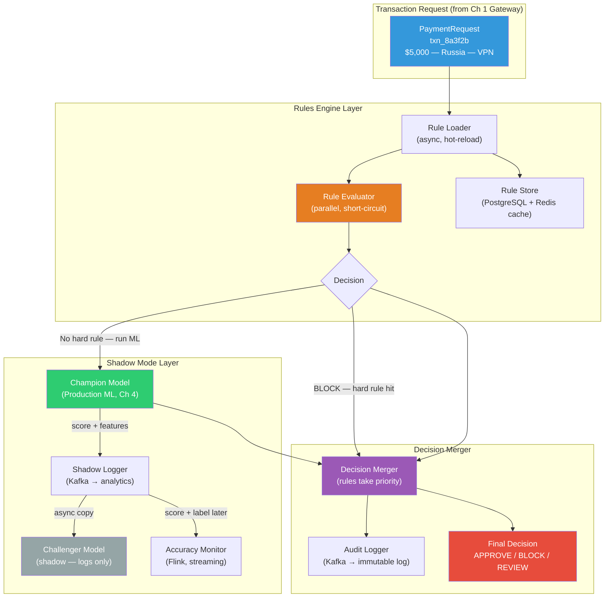
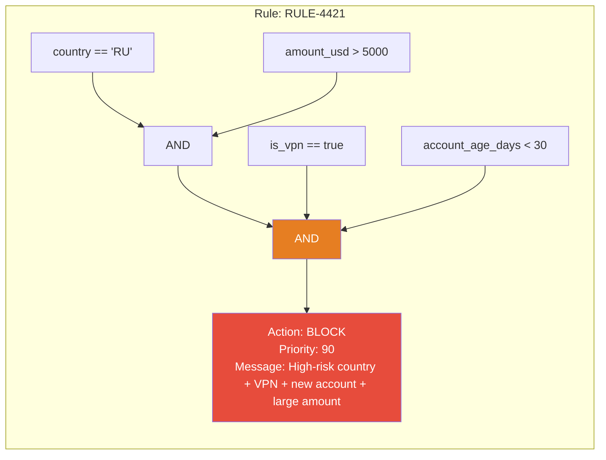
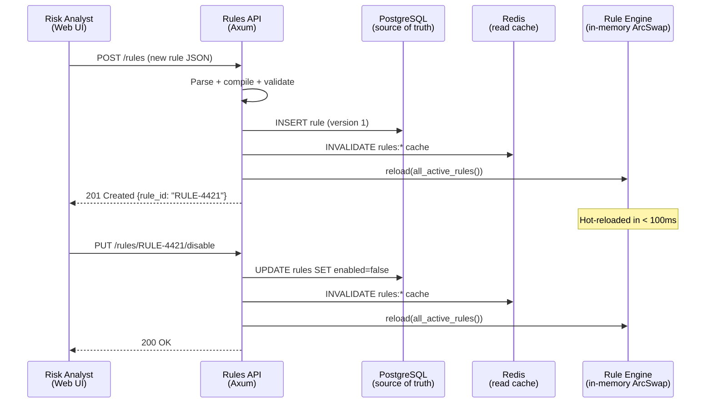
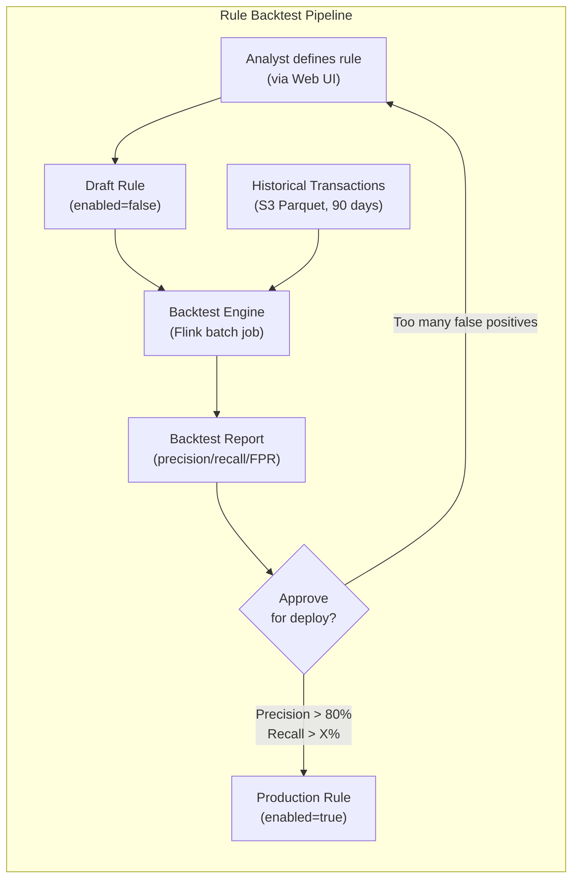
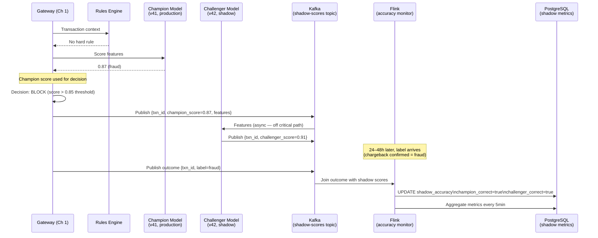
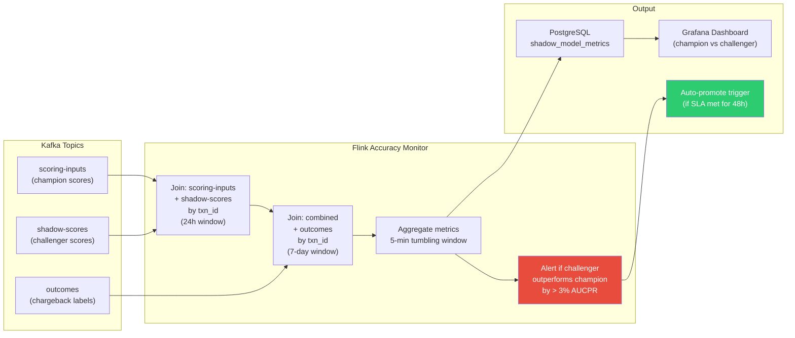
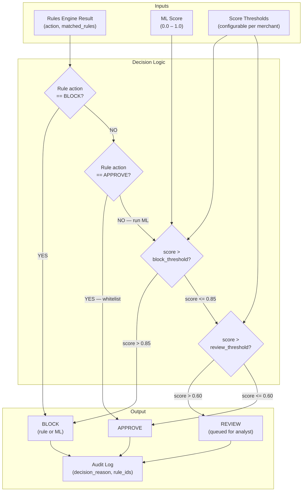
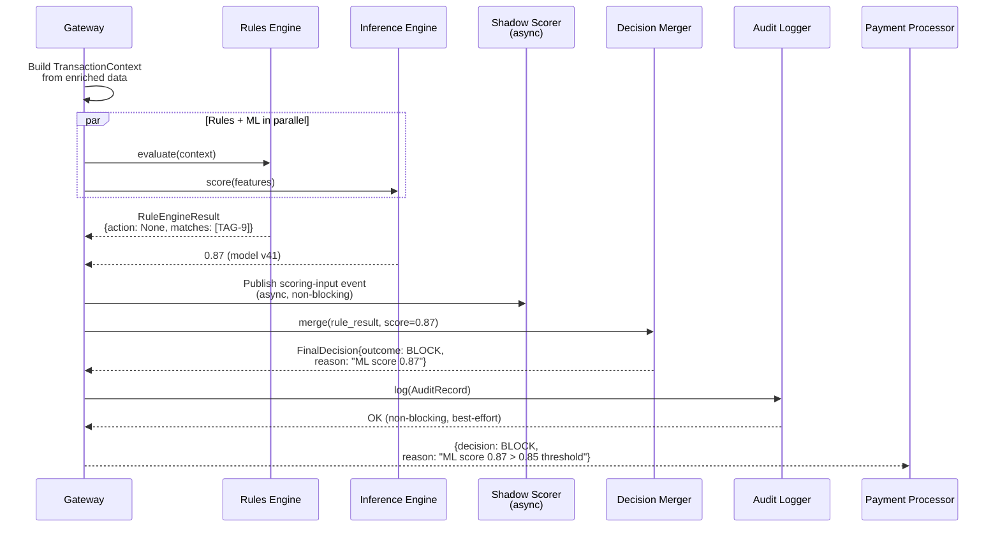
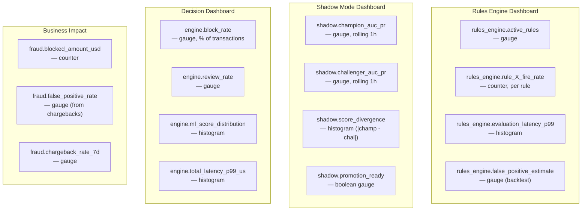
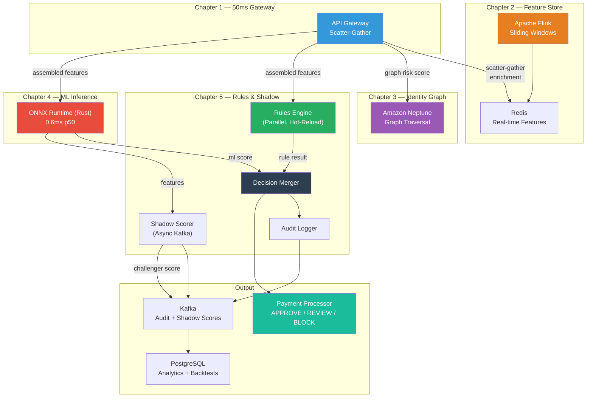

# Chapter 5: The Shadow Mode & Rules Engine 🟡

> **The Problem:** Your ML model achieves 0.96 AUC in offline evaluation. But the moment you deploy it to production, fraud analysts revolt. They can't explain *why* a transaction was blocked to a customer on the phone. The compliance team needs a paper trail that regulators can audit. The business team needs to react to an emerging fraud pattern *today* — not after the next model retrain in two weeks. And when a data pipeline bug corrupts 30% of the incoming feature vectors, you need to know your *last* model was better before you burned down the override queue. You need two things Python-Flask architectures can't give you: a **dynamic rules engine** for human-authored logic that deploys in seconds, and a **shadow mode framework** that lets you prove a new model is better before it decides on a single live transaction.

---

## The Operator's Dilemma

Fraud is adversarial. When a new attack vector emerges — a synthetic identity ring in a specific country, a compromised merchant terminal, a spike in account takeovers on a particular device OS — the fraud team's reaction time is measured in minutes, not model-retraining cycles.

A machine learning model, no matter how accurate, cannot absorb this requirement alone:

| Requirement | ML Model | Rules Engine |
|---|---|---|
| **React to new fraud pattern in < 5 minutes** | ❌ Requires retraining (hours/days) | ✅ Deploy a new rule instantly |
| **Auditable, human-readable decision trail** | ❌ Tree traversal is opaque | ✅ `IF country=='RU' AND amount>5000 THEN BLOCK` |
| **Regulatory compliance (PCI-DSS 10.x audit logs)** | ❌ Black-box probability | ✅ Named rule ID in audit log |
| **Override a specific merchant or card range** | ❌ Not possible without feature | ✅ Exact string/CIDR match in a rule |
| **Business logic** (e.g., block all crypto merchants) | ❌ Model learns from data, not policy | ✅ Hard policy enforcement |
| **New fraud type not in training data** | ❌ No signal to learn from | ✅ Risk analyst writes the rule |
| **Explain a block decision to a customer** | ❌ "The model scored you 0.91" | ✅ "Your transaction triggered rule RULE-4421" |

The correct architecture is not **ML vs. Rules** but **ML + Rules**, where:

1. The **Rules Engine** handles hard policy, known-bad signals, and business overrides.
2. The **ML model** handles probabilistic, context-rich scoring for the millions of transactions that don't trigger hard rules.
3. **Shadow Mode** provides a safe runway for new models and rules to prove their accuracy before going live.

---

## System Architecture Overview



The key insight: **rules are evaluated before the ML model** for hard blocks. The ML model runs in parallel for soft-score decisions. Shadow models run *after* the champion, asynchronously, so they never add latency to the critical path.

---

## Part 1: The Dynamic Rules Engine

### What a Rule Looks Like

A rule is a declarative boolean expression over the transaction context. Risk analysts write these in a Web UI or via API — no code deployment required.



Rules are stored as structured JSON/YAML, not raw code. This prevents injection attacks and allows safe serialization:

```json
{
  "rule_id": "RULE-4421",
  "name": "High-value transaction from sanctioned country via VPN — new account",
  "version": 3,
  "priority": 90,
  "enabled": true,
  "action": "BLOCK",
  "expression": {
    "op": "AND",
    "conditions": [
      { "field": "country_code", "op": "EQ", "value": "RU" },
      { "field": "amount_usd", "op": "GT", "value": 5000.0 },
      { "field": "is_vpn", "op": "EQ", "value": true },
      { "field": "account_age_days", "op": "LT", "value": 30.0 }
    ]
  },
  "metadata": {
    "author": "alice@risk.io",
    "created_at": "2026-03-15T09:22:00Z",
    "expires_at": null,
    "tags": ["geo-block", "vpn", "new-account"],
    "jira_ticket": "FRAUD-1882"
  }
}
```

### The Rule Data Model in Rust

```rust
use serde::{Deserialize, Serialize};
use chrono::{DateTime, Utc};
use std::collections::HashSet;

/// The action taken when a rule fires.
#[derive(Debug, Clone, PartialEq, Serialize, Deserialize)]
#[serde(rename_all = "SCREAMING_SNAKE_CASE")]
pub enum RuleAction {
    /// Block the transaction outright.
    Block,
    /// Route to human review queue.
    Review,
    /// Force-approve, overriding ML score (for whitelisting).
    Approve,
    /// Add a risk score penalty and continue evaluation.
    PenalizeScore { delta: f32 },
    /// Tag the transaction without affecting the decision.
    Tag { label: String },
}

/// A comparison operator for a condition.
#[derive(Debug, Clone, PartialEq, Serialize, Deserialize)]
#[serde(rename_all = "SCREAMING_SNAKE_CASE")]
pub enum ComparisonOp {
    Eq,
    Ne,
    Gt,
    Gte,
    Lt,
    Lte,
    /// Field value is in a set: `country IN ['RU', 'NK', 'IR']`
    In,
    /// Field value is NOT in a set.
    NotIn,
    /// String prefix match: `bin_prefix STARTS_WITH '447852'`
    StartsWith,
    /// CIDR check: `ip_address CIDR_MATCH '10.0.0.0/8'`
    CidrMatch,
    /// Regex match (whitelist of safe patterns, pre-compiled).
    RegexMatch,
}

/// The value side of a comparison.
#[derive(Debug, Clone, PartialEq, Serialize, Deserialize)]
#[serde(untagged)]
pub enum ConditionValue {
    Bool(bool),
    Float(f64),
    Str(String),
    Set(HashSet<String>),
    Regex(String),
}

/// A single condition: `field OP value`.
#[derive(Debug, Clone, Serialize, Deserialize)]
pub struct Condition {
    pub field: String,
    pub op: ComparisonOp,
    pub value: ConditionValue,
}

/// A boolean expression — can be a leaf condition or a compound AND/OR/NOT.
#[derive(Debug, Clone, Serialize, Deserialize)]
#[serde(tag = "op", rename_all = "SCREAMING_SNAKE_CASE")]
pub enum Expression {
    /// Leaf node: a single condition.
    Condition(Condition),
    /// All sub-expressions must be true.
    And { conditions: Vec<Expression> },
    /// At least one sub-expression must be true.
    Or { conditions: Vec<Expression> },
    /// Inverts the result of the sub-expression.
    Not { condition: Box<Expression> },
}

/// A complete rule with metadata.
#[derive(Debug, Clone, Serialize, Deserialize)]
pub struct Rule {
    pub rule_id: String,
    pub name: String,
    pub version: u32,
    /// Rules are evaluated in descending priority order. Higher = earlier.
    pub priority: u8,
    pub enabled: bool,
    pub action: RuleAction,
    pub expression: Expression,
    pub author: String,
    pub created_at: DateTime<Utc>,
    pub expires_at: Option<DateTime<Utc>>,
    pub tags: Vec<String>,
}

impl Rule {
    /// Check if the rule has expired.
    pub fn is_active(&self) -> bool {
        self.enabled
            && self
                .expires_at
                .map_or(true, |exp| exp > Utc::now())
    }
}
```

### The Transaction Context

The rule engine evaluates rules against a typed transaction context. This is the **resolved** view of the transaction at evaluation time — all the data assembled by the scatter-gather in Chapter 1 and the feature store in Chapter 2:

```rust
use std::collections::HashMap;
use std::net::IpAddr;

/// A dynamically-typed context over which rules are evaluated.
/// Uses a flat `HashMap<String, ContextValue>` so new fields can be added
/// to rules without schema migrations.
#[derive(Debug, Clone)]
pub struct TransactionContext {
    fields: HashMap<String, ContextValue>,
}

#[derive(Debug, Clone, PartialEq)]
pub enum ContextValue {
    Bool(bool),
    Float(f64),
    Str(String),
    /// Special type for CIDR matching.
    Ip(IpAddr),
}

impl TransactionContext {
    pub fn builder() -> TransactionContextBuilder {
        TransactionContextBuilder::default()
    }

    pub fn get(&self, field: &str) -> Option<&ContextValue> {
        self.fields.get(field)
    }
}

#[derive(Default)]
pub struct TransactionContextBuilder {
    fields: HashMap<String, ContextValue>,
}

impl TransactionContextBuilder {
    pub fn field(mut self, key: impl Into<String>, value: ContextValue) -> Self {
        self.fields.insert(key.into(), value);
        self
    }

    pub fn build(self) -> TransactionContext {
        TransactionContext { fields: self.fields }
    }
}

/// Construct a context from an incoming transaction request.
pub fn build_context(
    txn: &PaymentRequest,
    enriched: &EnrichedData,
) -> TransactionContext {
    TransactionContext::builder()
        // Transaction fields
        .field("amount_usd", ContextValue::Float(txn.amount_usd as f64))
        .field("currency", ContextValue::Str(txn.currency.clone()))
        .field("country_code", ContextValue::Str(enriched.country_code.clone()))
        .field("merchant_mcc", ContextValue::Float(txn.merchant_mcc as f64))
        .field("is_card_present", ContextValue::Bool(txn.is_card_present))
        .field("is_international", ContextValue::Bool(enriched.is_international))
        // Device & network
        .field("is_vpn", ContextValue::Bool(enriched.is_vpn))
        .field("is_proxy", ContextValue::Bool(enriched.is_proxy))
        .field("is_tor", ContextValue::Bool(enriched.is_tor))
        .field("ip_address", ContextValue::Ip(enriched.ip_address))
        .field("device_age_hours", ContextValue::Float(enriched.device_age_hours as f64))
        // Account
        .field("account_age_days", ContextValue::Float(enriched.account_age_days as f64))
        .field("account_chargeback_rate", ContextValue::Float(enriched.account_chargeback_rate as f64))
        // Velocity (from Ch 2 feature store)
        .field("card_txn_count_1m", ContextValue::Float(enriched.card_txn_count_1m as f64))
        .field("card_txn_count_5m", ContextValue::Float(enriched.card_txn_count_5m as f64))
        .field("card_txn_sum_1h", ContextValue::Float(enriched.card_txn_sum_1h as f64))
        // Card BIN
        .field("card_bin", ContextValue::Str(enriched.card_bin.clone()))
        .field("card_country_code", ContextValue::Str(enriched.card_country_code.clone()))
        // Graph (from Ch 3)
        .field("graph_risk_score", ContextValue::Float(enriched.graph_risk_score as f64))
        .field("graph_fraud_density_2hop", ContextValue::Float(enriched.graph_fraud_density_2hop as f64))
        .build()
}
```

### The Rule Evaluator

The evaluator recursively descends the expression tree. Short-circuit evaluation (AND fails fast on first false, OR succeeds fast on first true) minimizes CPU work:

```rust
use ipnet::IpNet;
use regex::Regex;
use std::collections::HashMap;
use std::sync::Arc;
use parking_lot::RwLock;
use tracing::{debug, warn};

/// Pre-compiled artifacts for a rule — avoids recompiling on every evaluation.
pub struct CompiledRule {
    pub rule: Rule,
    compiled_regexes: HashMap<String, Regex>,
    compiled_cidrs: HashMap<String, IpNet>,
}

impl CompiledRule {
    /// Compile a rule — validates and pre-compiles all regex and CIDR patterns.
    pub fn compile(rule: Rule) -> Result<Self, RuleCompileError> {
        let mut compiled_regexes = HashMap::new();
        let mut compiled_cidrs = HashMap::new();

        Self::compile_expression(
            &rule.expression,
            &mut compiled_regexes,
            &mut compiled_cidrs,
        )?;

        Ok(Self {
            rule,
            compiled_regexes,
            compiled_cidrs,
        })
    }

    fn compile_expression(
        expr: &Expression,
        regexes: &mut HashMap<String, Regex>,
        cidrs: &mut HashMap<String, IpNet>,
    ) -> Result<(), RuleCompileError> {
        match expr {
            Expression::Condition(cond) => {
                match &cond.op {
                    ComparisonOp::RegexMatch => {
                        if let ConditionValue::Regex(pattern) = &cond.value {
                            let re = Regex::new(pattern)
                                .map_err(|e| RuleCompileError::InvalidRegex {
                                    field: cond.field.clone(),
                                    pattern: pattern.clone(),
                                    error: e.to_string(),
                                })?;
                            regexes.insert(pattern.clone(), re);
                        }
                    }
                    ComparisonOp::CidrMatch => {
                        if let ConditionValue::Str(cidr) = &cond.value {
                            let net: IpNet = cidr.parse()
                                .map_err(|e: ipnet::AddrParseError| {
                                    RuleCompileError::InvalidCidr {
                                        field: cond.field.clone(),
                                        cidr: cidr.clone(),
                                        error: e.to_string(),
                                    }
                                })?;
                            cidrs.insert(cidr.clone(), net);
                        }
                    }
                    _ => {}
                }
                Ok(())
            }
            Expression::And { conditions } | Expression::Or { conditions } => {
                for c in conditions {
                    Self::compile_expression(c, regexes, cidrs)?;
                }
                Ok(())
            }
            Expression::Not { condition } => {
                Self::compile_expression(condition, regexes, cidrs)
            }
        }
    }

    /// Evaluate the rule against a transaction context.
    pub fn evaluate(&self, ctx: &TransactionContext) -> RuleEvalResult {
        if !self.rule.is_active() {
            return RuleEvalResult::NoMatch;
        }

        let matches = self.eval_expression(&self.rule.expression, ctx);

        if matches {
            debug!(rule_id = %self.rule.rule_id, "Rule matched");
            RuleEvalResult::Match {
                rule_id: self.rule.rule_id.clone(),
                action: self.rule.action.clone(),
                priority: self.rule.priority,
            }
        } else {
            RuleEvalResult::NoMatch
        }
    }

    fn eval_expression(&self, expr: &Expression, ctx: &TransactionContext) -> bool {
        match expr {
            Expression::Condition(cond) => self.eval_condition(cond, ctx),
            Expression::And { conditions } => {
                // Short-circuit: return false on first false.
                conditions.iter().all(|c| self.eval_expression(c, ctx))
            }
            Expression::Or { conditions } => {
                // Short-circuit: return true on first true.
                conditions.iter().any(|c| self.eval_expression(c, ctx))
            }
            Expression::Not { condition } => {
                !self.eval_expression(condition, ctx)
            }
        }
    }

    fn eval_condition(&self, cond: &Condition, ctx: &TransactionContext) -> bool {
        let field_val = match ctx.get(&cond.field) {
            Some(v) => v,
            None => {
                // A missing field never matches a positive condition.
                // This is intentional: if we don't have the data, we don't block.
                warn!(field = %cond.field, "Missing field in transaction context");
                return false;
            }
        };

        match (&cond.op, field_val, &cond.value) {
            // Numeric comparisons.
            (ComparisonOp::Eq, ContextValue::Float(fv), ConditionValue::Float(cv)) => {
                (fv - cv).abs() < f64::EPSILON
            }
            (ComparisonOp::Ne, ContextValue::Float(fv), ConditionValue::Float(cv)) => {
                (fv - cv).abs() >= f64::EPSILON
            }
            (ComparisonOp::Gt, ContextValue::Float(fv), ConditionValue::Float(cv)) => fv > cv,
            (ComparisonOp::Gte, ContextValue::Float(fv), ConditionValue::Float(cv)) => fv >= cv,
            (ComparisonOp::Lt, ContextValue::Float(fv), ConditionValue::Float(cv)) => fv < cv,
            (ComparisonOp::Lte, ContextValue::Float(fv), ConditionValue::Float(cv)) => fv <= cv,

            // Boolean comparisons.
            (ComparisonOp::Eq, ContextValue::Bool(bv), ConditionValue::Bool(cv)) => bv == cv,
            (ComparisonOp::Ne, ContextValue::Bool(bv), ConditionValue::Bool(cv)) => bv != cv,

            // String comparisons.
            (ComparisonOp::Eq, ContextValue::Str(sv), ConditionValue::Str(cv)) => sv == cv,
            (ComparisonOp::Ne, ContextValue::Str(sv), ConditionValue::Str(cv)) => sv != cv,
            (ComparisonOp::StartsWith, ContextValue::Str(sv), ConditionValue::Str(cv)) => {
                sv.starts_with(cv.as_str())
            }

            // Set membership.
            (ComparisonOp::In, ContextValue::Str(sv), ConditionValue::Set(set)) => {
                set.contains(sv.as_str())
            }
            (ComparisonOp::NotIn, ContextValue::Str(sv), ConditionValue::Set(set)) => {
                !set.contains(sv.as_str())
            }

            // Regex match — uses pre-compiled Regex.
            (ComparisonOp::RegexMatch, ContextValue::Str(sv), ConditionValue::Regex(pattern)) => {
                self.compiled_regexes
                    .get(pattern.as_str())
                    .map_or(false, |re| re.is_match(sv))
            }

            // CIDR match — uses pre-compiled IpNet.
            (ComparisonOp::CidrMatch, ContextValue::Ip(ip), ConditionValue::Str(cidr)) => {
                self.compiled_cidrs
                    .get(cidr.as_str())
                    .map_or(false, |net| net.contains(ip))
            }

            _ => {
                warn!(
                    field = %cond.field,
                    op = ?cond.op,
                    "Type mismatch in rule condition — returning false"
                );
                false
            }
        }
    }
}

#[derive(Debug, Clone)]
pub enum RuleEvalResult {
    NoMatch,
    Match {
        rule_id: String,
        action: RuleAction,
        priority: u8,
    },
}

#[derive(Debug, thiserror::Error)]
pub enum RuleCompileError {
    #[error("Invalid regex in rule field '{field}': pattern '{pattern}' — {error}")]
    InvalidRegex { field: String, pattern: String, error: String },
    #[error("Invalid CIDR in rule field '{field}': '{cidr}' — {error}")]
    InvalidCidr { field: String, cidr: String, error: String },
}
```

### The Rule Engine — Parallel Evaluation

In production, you can have hundreds of active rules. Evaluating them one by one would be wasteful — rules are independent and can be evaluated in parallel:

```rust
use rayon::prelude::*;
use std::sync::Arc;
use arc_swap::ArcSwap;
use tokio::sync::watch;

/// The live rule set, hot-reloadable via ArcSwap.
pub struct RuleEngine {
    rules: Arc<ArcSwap<Vec<CompiledRule>>>,
}

/// The result of running the full rule engine against one transaction.
#[derive(Debug)]
pub struct RuleEngineResult {
    /// All rules that matched, sorted by priority descending.
    pub matches: Vec<RuleMatch>,
    /// The winning action: highest-priority match, or None if no match.
    pub action: Option<RuleAction>,
    pub evaluation_time_us: u64,
}

#[derive(Debug, Clone)]
pub struct RuleMatch {
    pub rule_id: String,
    pub action: RuleAction,
    pub priority: u8,
}

impl RuleEngine {
    pub fn new(initial_rules: Vec<CompiledRule>) -> Self {
        Self {
            rules: Arc::new(ArcSwap::from_pointee(initial_rules)),
        }
    }

    /// Evaluate all active rules against a transaction context.
    /// Uses Rayon for CPU-parallel evaluation across rules.
    pub fn evaluate(&self, ctx: &TransactionContext) -> RuleEngineResult {
        let start = std::time::Instant::now();
        let rules = self.rules.load();

        // Parallel evaluation using Rayon — each rule is independent.
        let mut matches: Vec<RuleMatch> = rules
            .par_iter()
            .filter_map(|compiled_rule| {
                match compiled_rule.evaluate(ctx) {
                    RuleEvalResult::Match { rule_id, action, priority } => {
                        Some(RuleMatch { rule_id, action, priority })
                    }
                    RuleEvalResult::NoMatch => None,
                }
            })
            .collect();

        // Sort by priority descending — highest priority rule wins.
        matches.sort_by(|a, b| b.priority.cmp(&a.priority));

        // The winning action is the highest-priority match.
        // Block > Review > Approve > PenalizeScore > Tag (enforced by priority values in rules).
        let action = matches.first().map(|m| m.action.clone());

        RuleEngineResult {
            matches,
            action,
            evaluation_time_us: start.elapsed().as_micros() as u64,
        }
    }

    /// Atomically replace the rule set — no downtime, no dropped requests.
    pub fn reload(&self, new_rules: Vec<CompiledRule>) {
        let count = new_rules.len();
        self.rules.store(Arc::new(new_rules));
        tracing::info!(count = count, "Rule set reloaded");
        metrics::gauge!("rules_engine.active_rules").set(count as f64);
    }

    pub fn rule_count(&self) -> usize {
        self.rules.load().len()
    }
}
```

---

## Part 2: The Rule Management API

Risk analysts interact with the rules engine through a REST API. This is a CRUD API backed by PostgreSQL (durable storage) and a Redis cache (hot path read cache):



```rust
use axum::{
    extract::{Path, State},
    http::StatusCode,
    response::IntoResponse,
    routing::{delete, get, post, put},
    Json, Router,
};
use serde::{Deserialize, Serialize};
use sqlx::PgPool;
use std::sync::Arc;

#[derive(Clone)]
pub struct ApiState {
    pub db: PgPool,
    pub redis: redis::aio::ConnectionManager,
    pub rule_engine: Arc<RuleEngine>,
}

/// Request body for creating or updating a rule.
#[derive(Debug, Deserialize)]
pub struct CreateRuleRequest {
    pub name: String,
    pub priority: u8,
    pub action: RuleAction,
    pub expression: Expression,
    pub expires_at: Option<DateTime<Utc>>,
    pub tags: Vec<String>,
}

/// Response for a rule resource.
#[derive(Debug, Serialize)]
pub struct RuleResponse {
    pub rule_id: String,
    pub name: String,
    pub priority: u8,
    pub enabled: bool,
    pub action: RuleAction,
    pub expression: Expression,
    pub version: u32,
    pub author: String,
    pub created_at: DateTime<Utc>,
    pub expires_at: Option<DateTime<Utc>>,
    pub tags: Vec<String>,
}

/// POST /v1/rules — Create a new rule.
pub async fn create_rule(
    State(state): State<ApiState>,
    // In production, extract the authenticated user from a JWT/session.
    // Here we use a simplified header for illustration.
    headers: axum::http::HeaderMap,
    Json(req): Json<CreateRuleRequest>,
) -> impl IntoResponse {
    let author = headers
        .get("X-Analyst-ID")
        .and_then(|v| v.to_str().ok())
        .unwrap_or("unknown")
        .to_string();

    // Validate the expression by attempting a compile.
    let expression_json = match serde_json::to_value(&req.expression) {
        Ok(v) => v,
        Err(e) => {
            return (
                StatusCode::BAD_REQUEST,
                Json(serde_json::json!({ "error": format!("Invalid expression: {}", e) })),
            ).into_response();
        }
    };

    // Try compiling to catch regex/CIDR errors early.
    let test_rule = Rule {
        rule_id: "test".to_string(),
        name: req.name.clone(),
        version: 1,
        priority: req.priority,
        enabled: true,
        action: req.action.clone(),
        expression: req.expression.clone(),
        author: author.clone(),
        created_at: Utc::now(),
        expires_at: req.expires_at,
        tags: req.tags.clone(),
    };
    if let Err(e) = CompiledRule::compile(test_rule) {
        return (
            StatusCode::BAD_REQUEST,
            Json(serde_json::json!({ "error": format!("Rule compilation failed: {}", e) })),
        ).into_response();
    }

    // Persist to PostgreSQL.
    let rule_id = match sqlx::query_scalar!(
        r#"
        INSERT INTO rules (name, priority, action, expression, author, expires_at, tags, enabled)
        VALUES ($1, $2, $3, $4, $5, $6, $7, true)
        RETURNING rule_id
        "#,
        req.name,
        req.priority as i32,
        serde_json::to_string(&req.action).unwrap(),
        expression_json,
        author,
        req.expires_at,
        &req.tags,
    )
    .fetch_one(&state.db)
    .await {
        Ok(id) => id,
        Err(e) => {
            tracing::error!(error = %e, "Failed to insert rule");
            return (
                StatusCode::INTERNAL_SERVER_ERROR,
                Json(serde_json::json!({ "error": "Database error" })),
            ).into_response();
        }
    };

    // Reload the engine with the updated rule set.
    if let Err(e) = reload_engine_from_db(&state).await {
        tracing::error!(error = %e, "Failed to reload rule engine after insert");
    }

    metrics::counter!("rules_engine.rules_created").increment(1);

    (
        StatusCode::CREATED,
        Json(serde_json::json!({ "rule_id": rule_id })),
    ).into_response()
}

/// PUT /v1/rules/{rule_id}/disable — Disable a rule immediately.
pub async fn disable_rule(
    State(state): State<ApiState>,
    Path(rule_id): Path<String>,
) -> impl IntoResponse {
    let rows = sqlx::query!(
        "UPDATE rules SET enabled = false, updated_at = NOW() WHERE rule_id = $1",
        rule_id
    )
    .execute(&state.db)
    .await;

    match rows {
        Ok(r) if r.rows_affected() == 1 => {
            let _ = reload_engine_from_db(&state).await;
            metrics::counter!("rules_engine.rules_disabled").increment(1);
            (StatusCode::OK, Json(serde_json::json!({ "status": "disabled" }))).into_response()
        }
        Ok(_) => (StatusCode::NOT_FOUND, Json(serde_json::json!({ "error": "Rule not found" }))).into_response(),
        Err(e) => {
            tracing::error!(error = %e, rule_id = %rule_id, "Failed to disable rule");
            StatusCode::INTERNAL_SERVER_ERROR.into_response()
        }
    }
}

/// GET /v1/rules/{rule_id}/simulate — Test a rule against a transaction without committing.
/// This is the most important safety feature: analysts can test rules on historical data before enabling.
pub async fn simulate_rule(
    State(state): State<ApiState>,
    Path(rule_id): Path<String>,
    Json(ctx): Json<SimulateRequest>,
) -> impl IntoResponse {
    // Load the draft rule (may not be enabled yet).
    let rule = match load_rule_by_id(&state.db, &rule_id).await {
        Ok(r) => r,
        Err(_) => {
            return (
                StatusCode::NOT_FOUND,
                Json(serde_json::json!({ "error": "Rule not found" })),
            ).into_response();
        }
    };

    let compiled = match CompiledRule::compile(rule) {
        Ok(c) => c,
        Err(e) => {
            return (
                StatusCode::BAD_REQUEST,
                Json(serde_json::json!({ "error": format!("Compile error: {}", e) })),
            ).into_response();
        }
    };

    let context = ctx.into_transaction_context();
    let result = compiled.evaluate(&context);

    let response = match result {
        RuleEvalResult::Match { rule_id, action, priority } => {
            serde_json::json!({
                "matched": true,
                "rule_id": rule_id,
                "action": action,
                "priority": priority,
            })
        }
        RuleEvalResult::NoMatch => {
            serde_json::json!({ "matched": false })
        }
    };

    (StatusCode::OK, Json(response)).into_response()
}

/// Reload all active rules from PostgreSQL and push to the in-memory engine.
async fn reload_engine_from_db(state: &ApiState) -> Result<(), sqlx::Error> {
    let rows = sqlx::query!(
        r#"
        SELECT rule_id, name, version, priority, enabled, action, expression,
               author, created_at, expires_at, tags
        FROM rules
        WHERE enabled = true
          AND (expires_at IS NULL OR expires_at > NOW())
        ORDER BY priority DESC
        "#
    )
    .fetch_all(&state.db)
    .await?;

    let compiled_rules: Vec<CompiledRule> = rows
        .into_iter()
        .filter_map(|row| {
            let action: RuleAction = serde_json::from_str(&row.action).ok()?;
            let expression: Expression = serde_json::from_value(row.expression).ok()?;
            let rule = Rule {
                rule_id: row.rule_id,
                name: row.name,
                version: row.version as u32,
                priority: row.priority as u8,
                enabled: row.enabled,
                action,
                expression,
                author: row.author,
                created_at: row.created_at,
                expires_at: row.expires_at,
                tags: row.tags,
            };
            CompiledRule::compile(rule).ok()
        })
        .collect();

    state.rule_engine.reload(compiled_rules);
    Ok(())
}
```

---

## Part 3: Rule Backtesting

Before deploying a new rule to production, analysts run it against historical transactions to measure precision and recall. This prevents rules that would have caught yesterday's fraud but would also block thousands of legitimate transactions:



### Backtest Result Schema

```rust
#[derive(Debug, Serialize, Deserialize)]
pub struct BacktestResult {
    pub rule_id: String,
    pub evaluated_at: DateTime<Utc>,
    pub window_days: u32,

    // Transaction counts.
    pub total_transactions: u64,
    pub true_positives: u64,   // Fraud caught by rule.
    pub false_positives: u64,  // Legit blocked by rule.
    pub true_negatives: u64,   // Legit correctly passed.
    pub false_negatives: u64,  // Fraud missed by rule.

    // Derived metrics.
    pub precision: f64,           // TP / (TP + FP)
    pub recall: f64,              // TP / (TP + FN)
    pub false_positive_rate: f64, // FP / (FP + TN)
    pub f1_score: f64,

    // Business impact.
    pub estimated_fraud_saved_usd: f64,
    pub estimated_revenue_blocked_usd: f64,

    // Breakdown by day (spot drift).
    pub daily_precision: Vec<(String, f64)>,
    pub daily_false_positive_rate: Vec<(String, f64)>,
}

impl BacktestResult {
    /// Decision: recommend deployment if metrics meet thresholds.
    pub fn recommendation(&self) -> BacktestRecommendation {
        if self.precision >= 0.80 && self.false_positive_rate <= 0.002 {
            BacktestRecommendation::Approve
        } else if self.precision >= 0.60 && self.false_positive_rate <= 0.005 {
            BacktestRecommendation::ReviewRequired
        } else {
            BacktestRecommendation::Reject {
                reason: format!(
                    "Precision {:.1}% < 80% or FPR {:.3}% > 0.2%",
                    self.precision * 100.0,
                    self.false_positive_rate * 100.0,
                ),
            }
        }
    }
}

#[derive(Debug, Serialize)]
pub enum BacktestRecommendation {
    Approve,
    ReviewRequired,
    Reject { reason: String },
}
```

---

## Part 4: Shadow Mode for ML Models

Shadow mode is the practice of running a **new model version in parallel with the production model** — it receives the same inputs and produces scores, but those scores are logged, not acted upon. This is how you safely validate a new model before promoting it.



### The Shadow Scorer

The shadow scorer runs asynchronously — it never touches the critical path. It consumes transaction features from a Kafka topic populated by the main scoring path:

```rust
use rdkafka::consumer::{Consumer, StreamConsumer};
use rdkafka::message::Message;
use rdkafka::ClientConfig;
use serde::{Deserialize, Serialize};
use std::sync::Arc;
use tokio::select;

/// A message published to the `scoring-input` topic by the production path.
#[derive(Debug, Serialize, Deserialize)]
pub struct ScoringInputEvent {
    pub transaction_id: String,
    pub champion_score: f32,
    pub champion_model_version: String,
    pub features: FeatureVector,
    pub timestamp_ms: i64,
}

/// A shadow score produced by the challenger model.
#[derive(Debug, Serialize, Deserialize)]
pub struct ShadowScoreEvent {
    pub transaction_id: String,
    pub challenger_score: f32,
    pub challenger_model_version: String,
    pub inference_latency_us: u64,
    pub timestamp_ms: i64,
}

/// The shadow scorer service — consumes scoring inputs and produces shadow scores.
pub struct ShadowScorer {
    consumer: StreamConsumer,
    challenger: Arc<InferenceEngine>,
    producer: rdkafka::producer::FutureProducer,
}

impl ShadowScorer {
    pub fn new(
        kafka_brokers: &str,
        consumer_group: &str,
        challenger: Arc<InferenceEngine>,
    ) -> Self {
        let consumer: StreamConsumer = ClientConfig::new()
            .set("bootstrap.servers", kafka_brokers)
            .set("group.id", consumer_group)
            .set("auto.offset.reset", "earliest")
            .set("enable.auto.commit", "true")
            .create()
            .expect("Failed to create shadow scorer consumer");

        consumer
            .subscribe(&["scoring-inputs"])
            .expect("Failed to subscribe to scoring-inputs");

        let producer = ClientConfig::new()
            .set("bootstrap.servers", kafka_brokers)
            .create()
            .expect("Failed to create producer");

        Self { consumer, challenger, producer }
    }

    /// Main loop — run until the shutdown signal fires.
    pub async fn run(&self, mut shutdown: tokio::sync::oneshot::Receiver<()>) {
        loop {
            select! {
                _ = &mut shutdown => {
                    tracing::info!("Shadow scorer shutting down");
                    break;
                }
                msg = self.consumer.recv() => {
                    match msg {
                        Err(e) => {
                            tracing::error!(error = %e, "Kafka receive error");
                            metrics::counter!("shadow.kafka_errors").increment(1);
                        }
                        Ok(borrowed) => {
                            if let Some(payload) = borrowed.payload() {
                                if let Ok(event) = serde_json::from_slice::<ScoringInputEvent>(payload) {
                                    self.score_shadow(&event).await;
                                }
                            }
                        }
                    }
                }
            }
        }
    }

    async fn score_shadow(&self, event: &ScoringInputEvent) {
        let start = std::time::Instant::now();
        let features = event.features.to_array();

        let score = match self.challenger.score(&features) {
            Ok(s) => s,
            Err(e) => {
                tracing::error!(
                    error = %e,
                    txn_id = %event.transaction_id,
                    "Shadow inference failed"
                );
                metrics::counter!("shadow.inference_errors").increment(1);
                return;
            }
        };

        let elapsed_us = start.elapsed().as_micros() as u64;
        let model = self.challenger.current();

        let shadow_event = ShadowScoreEvent {
            transaction_id: event.transaction_id.clone(),
            challenger_score: score,
            challenger_model_version: model.version.clone(),
            inference_latency_us: elapsed_us,
            timestamp_ms: chrono::Utc::now().timestamp_millis(),
        };

        // Publish shadow score to Kafka — Flink will join with outcome labels.
        let payload = serde_json::to_string(&shadow_event).unwrap();
        let record = rdkafka::producer::FutureRecord::to("shadow-scores")
            .key(&event.transaction_id)
            .payload(payload.as_bytes());

        let _ = self.producer.send(record, std::time::Duration::from_secs(1)).await;

        metrics::counter!("shadow.scores_produced").increment(1);
        metrics::histogram!("shadow.inference_latency_us").record(elapsed_us as f64);
    }
}
```

---

## Part 5: Shadow Mode Accuracy Monitoring

The accuracy monitor is a Flink job that joins shadow scores with outcome labels (chargebacks, confirmed fraud) and computes live accuracy metrics for both champion and challenger:



### The Shadow Metrics Store

```rust
use sqlx::PgPool;
use chrono::{DateTime, Utc};

/// Per-window accuracy metrics for one model version.
#[derive(Debug, sqlx::FromRow, Serialize)]
pub struct ShadowMetricsWindow {
    pub model_version: String,
    pub is_champion: bool,
    pub window_start: DateTime<Utc>,
    pub window_end: DateTime<Utc>,

    // Volume.
    pub total_scored: i64,
    pub labeled_count: i64, // How many have chargeback outcomes yet.

    // Confusion matrix (at default 0.5 threshold).
    pub true_positives: i64,
    pub false_positives: i64,
    pub true_negatives: i64,
    pub false_negatives: i64,

    // Metrics.
    pub auc_roc: f64,
    pub auc_pr: f64,
    pub precision: f64,
    pub recall: f64,
    pub f1_score: f64,

    // Latency.
    pub p50_inference_us: f64,
    pub p99_inference_us: f64,
}
```

### The Promotion Decision Engine

When a challenger model has proven itself in shadow mode for a sufficient period with sufficient volume, the system can automatically promote it:

```rust
#[derive(Debug)]
pub struct PromotionDecision {
    pub challenger_version: String,
    pub champion_version: String,
    pub should_promote: bool,
    pub reason: String,
    pub metrics_window: u32, // hours of shadow data
    pub volume: i64,
}

/// Evaluate whether the challenger model should replace the champion.
pub async fn evaluate_promotion_readiness(
    db: &PgPool,
    challenger_version: &str,
    champion_version: &str,
) -> Result<PromotionDecision, sqlx::Error> {
    // Aggregate metrics over the last 48 hours.
    let challenger_metrics = sqlx::query_as!(
        ShadowMetricsWindow,
        r#"
        SELECT * FROM shadow_model_metrics
        WHERE model_version = $1
          AND window_start >= NOW() - INTERVAL '48 hours'
          AND is_champion = false
        ORDER BY window_start ASC
        "#,
        challenger_version,
    )
    .fetch_all(db)
    .await?;

    let champion_metrics = sqlx::query_as!(
        ShadowMetricsWindow,
        r#"
        SELECT * FROM shadow_model_metrics
        WHERE model_version = $1
          AND window_start >= NOW() - INTERVAL '48 hours'
          AND is_champion = true
        ORDER BY window_start ASC
        "#,
        champion_version,
    )
    .fetch_all(db)
    .await?;

    if challenger_metrics.is_empty() || champion_metrics.is_empty() {
        return Ok(PromotionDecision {
            challenger_version: challenger_version.to_string(),
            champion_version: champion_version.to_string(),
            should_promote: false,
            reason: "Insufficient shadow data — minimum 48 hours required".to_string(),
            metrics_window: 0,
            volume: 0,
        });
    }

    let challenger_auc_pr: f64 = challenger_metrics.iter().map(|m| m.auc_pr).sum::<f64>()
        / challenger_metrics.len() as f64;
    let champion_auc_pr: f64 = champion_metrics.iter().map(|m| m.auc_pr).sum::<f64>()
        / champion_metrics.len() as f64;

    let challenger_volume: i64 = challenger_metrics.iter().map(|m| m.labeled_count).sum();
    let challenger_p99: f64 = challenger_metrics.iter().map(|m| m.p99_inference_us).sum::<f64>()
        / challenger_metrics.len() as f64;

    // Promotion criteria:
    // 1. At least 10,000 labeled transactions observed (statistical significance).
    // 2. Challenger AUCPR >= champion AUCPR (not worse).
    // 3. Challenger p99 inference < 5ms.
    // 4. No distribution anomaly flags in any window.
    let volume_ok = challenger_volume >= 10_000;
    let accuracy_ok = challenger_auc_pr >= champion_auc_pr;
    let latency_ok = challenger_p99 < 5_000.0; // 5ms in μs.
    let no_anomalies = challenger_metrics.iter().all(|m| m.auc_pr > 0.60);

    let should_promote = volume_ok && accuracy_ok && latency_ok && no_anomalies;

    let reason = if !volume_ok {
        format!("Insufficient volume: {} < 10,000 labeled samples", challenger_volume)
    } else if !accuracy_ok {
        format!(
            "Challenger AUCPR {:.4} < champion AUCPR {:.4}",
            challenger_auc_pr, champion_auc_pr
        )
    } else if !latency_ok {
        format!("Challenger p99 {:.0}μs exceeds 5,000μs", challenger_p99)
    } else if !no_anomalies {
        "Distribution anomaly detected in shadow data".to_string()
    } else {
        format!(
            "All criteria met: AUCPR {:.4} vs {:.4}, volume {}, p99 {:.0}μs",
            challenger_auc_pr, champion_auc_pr, challenger_volume, challenger_p99
        )
    };

    Ok(PromotionDecision {
        challenger_version: challenger_version.to_string(),
        champion_version: champion_version.to_string(),
        should_promote,
        reason,
        metrics_window: 48,
        volume: challenger_volume,
    })
}
```

---

## Part 6: The Decision Merger

The decision merger combines the rule engine result and the ML score into a final `Decision`. Rules always take priority over ML scores:



```rust
use serde::Serialize;

#[derive(Debug, Clone, Serialize, PartialEq)]
#[serde(rename_all = "SCREAMING_SNAKE_CASE")]
pub enum DecisionOutcome {
    Approve,
    Review,
    Block,
}

#[derive(Debug, Serialize)]
pub struct FinalDecision {
    pub transaction_id: String,
    pub outcome: DecisionOutcome,
    pub ml_score: f32,
    pub model_version: String,

    /// The rule that triggered a BLOCK or APPROVE, if any.
    pub triggering_rule: Option<String>,
    /// All rules that matched (for audit log).
    pub matched_rules: Vec<String>,
    /// Human-readable reason.
    pub reason: String,
    /// Was the ML score computed? (false if a hard rule short-circuited)
    pub ml_evaluated: bool,
    pub total_latency_us: u64,
}

/// Decision thresholds — can vary by merchant category or risk profile.
#[derive(Debug, Clone)]
pub struct DecisionThresholds {
    /// score >= block_threshold → BLOCK
    pub block_threshold: f32,
    /// block_threshold > score >= review_threshold → REVIEW
    pub review_threshold: f32,
}

impl Default for DecisionThresholds {
    fn default() -> Self {
        Self {
            block_threshold: 0.85,
            review_threshold: 0.60,
        }
    }
}

pub struct DecisionMerger {
    thresholds: DecisionThresholds,
}

impl DecisionMerger {
    pub fn new(thresholds: DecisionThresholds) -> Self {
        Self { thresholds }
    }

    pub fn merge(
        &self,
        transaction_id: &str,
        rule_result: &RuleEngineResult,
        ml_score: f32,
        model_version: &str,
        total_latency_us: u64,
    ) -> FinalDecision {
        let matched_rule_ids: Vec<String> = rule_result
            .matches
            .iter()
            .map(|m| m.rule_id.clone())
            .collect();

        // Rules take absolute priority.
        if let Some(action) = &rule_result.action {
            match action {
                RuleAction::Block => {
                    let rule_id = rule_result.matches.first()
                        .map(|m| m.rule_id.clone())
                        .unwrap_or_default();
                    return FinalDecision {
                        transaction_id: transaction_id.to_string(),
                        outcome: DecisionOutcome::Block,
                        ml_score,
                        model_version: model_version.to_string(),
                        triggering_rule: Some(rule_id.clone()),
                        matched_rules: matched_rule_ids,
                        reason: format!("Blocked by rule {}", rule_id),
                        ml_evaluated: true,
                        total_latency_us,
                    };
                }
                RuleAction::Approve => {
                    let rule_id = rule_result.matches.first()
                        .map(|m| m.rule_id.clone())
                        .unwrap_or_default();
                    return FinalDecision {
                        transaction_id: transaction_id.to_string(),
                        outcome: DecisionOutcome::Approve,
                        ml_score,
                        model_version: model_version.to_string(),
                        triggering_rule: Some(rule_id.clone()),
                        matched_rules: matched_rule_ids,
                        reason: format!("Whitelisted by rule {}", rule_id),
                        ml_evaluated: true,
                        total_latency_us,
                    };
                }
                RuleAction::Review => {
                    let rule_id = rule_result.matches.first()
                        .map(|m| m.rule_id.clone())
                        .unwrap_or_default();
                    return FinalDecision {
                        transaction_id: transaction_id.to_string(),
                        outcome: DecisionOutcome::Review,
                        ml_score,
                        model_version: model_version.to_string(),
                        triggering_rule: Some(rule_id.clone()),
                        matched_rules: matched_rule_ids,
                        reason: format!("Flagged for review by rule {}", rule_id),
                        ml_evaluated: true,
                        total_latency_us,
                    };
                }
                RuleAction::PenalizeScore { delta } => {
                    // Penalize and fall through to ML threshold evaluation.
                    let adjusted = (ml_score + delta).clamp(0.0, 1.0);
                    return self.ml_decision(
                        transaction_id,
                        adjusted,
                        model_version,
                        matched_rule_ids,
                        total_latency_us,
                        format!("ML score {:.3} adjusted by rule penalty +{:.3}", ml_score, delta),
                    );
                }
                RuleAction::Tag { .. } => {
                    // Tag only — fall through to ML evaluation normally.
                }
            }
        }

        // Fall through to ML-only decision.
        self.ml_decision(
            transaction_id,
            ml_score,
            model_version,
            matched_rule_ids,
            total_latency_us,
            format!("ML score {:.3}", ml_score),
        )
    }

    fn ml_decision(
        &self,
        transaction_id: &str,
        score: f32,
        model_version: &str,
        matched_rules: Vec<String>,
        total_latency_us: u64,
        reason: String,
    ) -> FinalDecision {
        let outcome = if score >= self.thresholds.block_threshold {
            DecisionOutcome::Block
        } else if score >= self.thresholds.review_threshold {
            DecisionOutcome::Review
        } else {
            DecisionOutcome::Approve
        };

        FinalDecision {
            transaction_id: transaction_id.to_string(),
            outcome,
            ml_score: score,
            model_version: model_version.to_string(),
            triggering_rule: None,
            matched_rules,
            reason,
            ml_evaluated: true,
            total_latency_us,
        }
    }
}
```

---

## Part 7: The Immutable Audit Log

Every decision — and the full decision trace — is written to an immutable audit log in Kafka before any response is returned to the payment processor:

```rust
use rdkafka::producer::{FutureProducer, FutureRecord};
use serde::Serialize;

/// Complete audit record for a single transaction decision.
/// This record is the source of truth for compliance and incident investigation.
#[derive(Debug, Serialize)]
pub struct AuditRecord {
    /// Correlation ID — link all events for this transaction.
    pub transaction_id: String,
    /// Unique ID for this specific decision event.
    pub audit_id: String,
    /// ISO 8601 timestamp.
    pub decided_at: String,

    // Decision.
    pub outcome: DecisionOutcome,
    pub ml_score: f32,
    pub model_version: String,

    // Rules.
    pub rules_evaluated_count: usize,
    pub rules_matched_count: usize,
    pub triggering_rule: Option<String>,
    pub matched_rule_ids: Vec<String>,

    // Feature evidence (for ML explainability).
    pub top_feature_attributions: Vec<FeatureAttribution>,

    // Latency breakdown.
    pub rules_evaluation_us: u64,
    pub ml_inference_us: u64,
    pub total_latency_us: u64,

    // Metadata.
    pub service_version: String,
    pub datacenter: String,
}

pub struct AuditLogger {
    producer: FutureProducer,
    topic: String,
}

impl AuditLogger {
    pub async fn log(&self, record: &AuditRecord) {
        let payload = serde_json::to_string(record).unwrap_or_default();

        let kafka_record = FutureRecord::to(&self.topic)
            // Partition by transaction_id — all events for a transaction go to the same partition.
            .key(&record.transaction_id)
            .payload(payload.as_bytes());

        match self.producer.send(kafka_record, std::time::Duration::from_millis(100)).await {
            Ok(_) => {
                metrics::counter!("audit.records_written").increment(1);
            }
            Err((e, _)) => {
                // This is a critical failure in a compliance context.
                // Alert and consider whether to fail the transaction or continue.
                tracing::error!(
                    error = %e,
                    txn_id = %record.transaction_id,
                    "CRITICAL: Failed to write audit record"
                );
                metrics::counter!("audit.write_failures").increment(1);
            }
        }
    }
}
```

---

## The Complete Request Flow

Putting it all together — a single transaction from the gateway (Chapter 1) through the full pipeline:



### The Complete Handler

```rust
use std::sync::Arc;
use std::time::Instant;

pub struct FraudEngine {
    pub rule_engine: Arc<RuleEngine>,
    pub inference_engine: Arc<InferenceEngine>,
    pub shadow_producer: Arc<dyn ShadowEventPublisher>,
    pub decision_merger: DecisionMerger,
    pub audit_logger: Arc<AuditLogger>,
}

impl FraudEngine {
    pub async fn evaluate_transaction(
        &self,
        txn: &PaymentRequest,
        enriched: &EnrichedData,
    ) -> FinalDecision {
        let start = Instant::now();
        let txn_id = txn.transaction_id.clone();

        // Build the structured context once — shared between rules and logging.
        let context = build_context(txn, enriched);
        let features = build_feature_vector(txn, enriched).to_array();

        // Run rules and ML inference in parallel.
        let rule_engine = Arc::clone(&self.rule_engine);
        let inference_engine = Arc::clone(&self.inference_engine);

        let (rule_result, ml_result) = tokio::join!(
            tokio::task::spawn_blocking(move || rule_engine.evaluate(&context)),
            tokio::task::spawn_blocking(move || inference_engine.score(&features))
        );

        let rule_result = rule_result.unwrap_or_else(|_| RuleEngineResult {
            matches: vec![],
            action: None,
            evaluation_time_us: 0,
        });

        let (ml_score, model_version, ml_latency_us) = match ml_result {
            Ok(Ok(score)) => {
                let model = self.inference_engine.current();
                let latency = start.elapsed().as_micros() as u64;
                (score, model.version.clone(), latency)
            }
            _ => {
                // ML inference failed — use a conservative fallback score.
                // The rules engine can still block obvious fraud.
                (0.5f32, "fallback".to_string(), 0)
            }
        };

        let total_latency_us = start.elapsed().as_micros() as u64;

        // Merge rules + ML into a final decision.
        let decision = self.decision_merger.merge(
            &txn_id,
            &rule_result,
            ml_score,
            &model_version,
            total_latency_us,
        );

        // Publish to shadow scorer — non-blocking, fire-and-forget.
        let shadow_event = ScoringInputEvent {
            transaction_id: txn_id.clone(),
            champion_score: ml_score,
            champion_model_version: model_version.clone(),
            features: build_feature_vector(txn, enriched),
            timestamp_ms: chrono::Utc::now().timestamp_millis(),
        };
        self.shadow_producer.publish(shadow_event);

        // Write audit record — non-blocking.
        let audit = AuditRecord {
            transaction_id: txn_id,
            audit_id: uuid::Uuid::new_v4().to_string(),
            decided_at: chrono::Utc::now().to_rfc3339(),
            outcome: decision.outcome.clone(),
            ml_score,
            model_version: model_version.clone(),
            rules_evaluated_count: self.rule_engine.rule_count(),
            rules_matched_count: rule_result.matches.len(),
            triggering_rule: decision.triggering_rule.clone(),
            matched_rule_ids: decision.matched_rules.clone(),
            top_feature_attributions: vec![], // computed async for flagged txns
            rules_evaluation_us: rule_result.evaluation_time_us,
            ml_inference_us: ml_latency_us,
            total_latency_us,
            service_version: env!("CARGO_PKG_VERSION").to_string(),
            datacenter: std::env::var("DATACENTER").unwrap_or_default(),
        };

        let audit_logger = Arc::clone(&self.audit_logger);
        tokio::spawn(async move {
            audit_logger.log(&audit).await;
        });

        // Record metrics.
        metrics::histogram!("engine.total_latency_us").record(total_latency_us as f64);
        metrics::counter!(
            "engine.decisions",
            "outcome" => format!("{:?}", decision.outcome)
        ).increment(1);

        decision
    }
}
```

---

## Monitoring Dashboard Design

### Key Metrics to Track



### Alerting Rules

| Alert | Condition | Severity | Action |
|---|---|---|---|
| **High false-positive rate** | block_rate > 2.0% for 5min | P1 | Page on-call, review recent rule deploys |
| **Rule engine reload failure** | rules_engine.reload_failures > 0 | P2 | Alert — engine running stale rules |
| **Challenger score divergence** | mean(\|champ - chal\|) > 0.15 | P2 | Investigate data pipeline |
| **Audit log write failures** | audit.write_failures > 0 | P1 | Critical compliance breach |
| **ML fallback rate elevated** | inference.fallback > 1% | P2 | Check inference service health |
| **Latency SLO breach** | p99(total_latency_us) > 45,000 | P1 | Page on-call |
| **Rule fire rate spike** | rule_X_fire_rate > 5× baseline | P3 | Notify rule author |

---

## Testing the Full Stack

```rust
#[cfg(test)]
mod tests {
    use super::*;
    use std::collections::HashSet;

    fn make_context(amount: f64, country: &str, is_vpn: bool, account_age: f64) -> TransactionContext {
        TransactionContext::builder()
            .field("amount_usd", ContextValue::Float(amount))
            .field("country_code", ContextValue::Str(country.to_string()))
            .field("is_vpn", ContextValue::Bool(is_vpn))
            .field("account_age_days", ContextValue::Float(account_age))
            .field("is_proxy", ContextValue::Bool(false))
            .field("is_tor", ContextValue::Bool(false))
            .field("card_txn_count_1m", ContextValue::Float(1.0))
            .build()
    }

    fn make_rule_4421() -> CompiledRule {
        let rule = Rule {
            rule_id: "RULE-4421".to_string(),
            name: "High-value RU + VPN + new account".to_string(),
            version: 1,
            priority: 90,
            enabled: true,
            action: RuleAction::Block,
            expression: Expression::And {
                conditions: vec![
                    Expression::Condition(Condition {
                        field: "country_code".to_string(),
                        op: ComparisonOp::Eq,
                        value: ConditionValue::Str("RU".to_string()),
                    }),
                    Expression::Condition(Condition {
                        field: "amount_usd".to_string(),
                        op: ComparisonOp::Gt,
                        value: ConditionValue::Float(5000.0),
                    }),
                    Expression::Condition(Condition {
                        field: "is_vpn".to_string(),
                        op: ComparisonOp::Eq,
                        value: ConditionValue::Bool(true),
                    }),
                    Expression::Condition(Condition {
                        field: "account_age_days".to_string(),
                        op: ComparisonOp::Lt,
                        value: ConditionValue::Float(30.0),
                    }),
                ],
            },
            author: "alice@risk.io".to_string(),
            created_at: Utc::now(),
            expires_at: None,
            tags: vec!["geo-block".to_string()],
        };
        CompiledRule::compile(rule).unwrap()
    }

    #[test]
    fn rule_matches_exact_conditions() {
        let rule = make_rule_4421();
        let ctx = make_context(10000.0, "RU", true, 5.0);
        assert!(matches!(rule.evaluate(&ctx), RuleEvalResult::Match { .. }));
    }

    #[test]
    fn rule_misses_when_amount_below_threshold() {
        let rule = make_rule_4421();
        let ctx = make_context(100.0, "RU", true, 5.0);
        assert!(matches!(rule.evaluate(&ctx), RuleEvalResult::NoMatch));
    }

    #[test]
    fn rule_misses_when_no_vpn() {
        let rule = make_rule_4421();
        let ctx = make_context(10000.0, "RU", false, 5.0);
        assert!(matches!(rule.evaluate(&ctx), RuleEvalResult::NoMatch));
    }

    #[test]
    fn rule_misses_when_account_old() {
        let rule = make_rule_4421();
        let ctx = make_context(10000.0, "RU", true, 60.0); // 60 days old
        assert!(matches!(rule.evaluate(&ctx), RuleEvalResult::NoMatch));
    }

    #[test]
    fn rule_misses_different_country() {
        let rule = make_rule_4421();
        let ctx = make_context(10000.0, "US", true, 5.0);
        assert!(matches!(rule.evaluate(&ctx), RuleEvalResult::NoMatch));
    }

    #[test]
    fn set_membership_rule() {
        let blocked_countries: HashSet<String> = ["RU", "NK", "IR", "CU", "SY"]
            .iter()
            .map(|s| s.to_string())
            .collect();

        let rule = Rule {
            rule_id: "RULE-OFAC".to_string(),
            name: "OFAC sanctioned country block".to_string(),
            version: 1,
            priority: 100,
            enabled: true,
            action: RuleAction::Block,
            expression: Expression::Condition(Condition {
                field: "country_code".to_string(),
                op: ComparisonOp::In,
                value: ConditionValue::Set(blocked_countries),
            }),
            author: "compliance@bank.io".to_string(),
            created_at: Utc::now(),
            expires_at: None,
            tags: vec!["ofac".to_string(), "compliance".to_string()],
        };
        let compiled = CompiledRule::compile(rule).unwrap();

        let sanctioned = make_context(100.0, "NK", false, 365.0);
        assert!(matches!(compiled.evaluate(&sanctioned), RuleEvalResult::Match { .. }));

        let allowed = make_context(100.0, "US", false, 365.0);
        assert!(matches!(compiled.evaluate(&allowed), RuleEvalResult::NoMatch));
    }

    #[test]
    fn rule_engine_parallel_evaluation() {
        let engine = RuleEngine::new(vec![make_rule_4421()]);
        let ctx = make_context(10000.0, "RU", true, 5.0);
        let result = engine.evaluate(&ctx);

        assert_eq!(result.matches.len(), 1);
        assert_eq!(result.matches[0].rule_id, "RULE-4421");
        assert!(matches!(result.action, Some(RuleAction::Block)));
    }

    #[test]
    fn decision_merger_rule_overrides_ml() {
        let merger = DecisionMerger::new(DecisionThresholds::default());
        let rule_result = RuleEngineResult {
            matches: vec![RuleMatch {
                rule_id: "RULE-4421".to_string(),
                action: RuleAction::Block,
                priority: 90,
            }],
            action: Some(RuleAction::Block),
            evaluation_time_us: 100,
        };

        // Even with a low ML score (0.1), the rule forces a BLOCK.
        let decision = merger.merge("txn_001", &rule_result, 0.1, "v41", 5000);
        assert_eq!(decision.outcome, DecisionOutcome::Block);
        assert_eq!(decision.triggering_rule, Some("RULE-4421".to_string()));
    }

    #[test]
    fn decision_merger_ml_block_above_threshold() {
        let merger = DecisionMerger::new(DecisionThresholds::default());
        let rule_result = RuleEngineResult {
            matches: vec![],
            action: None,
            evaluation_time_us: 100,
        };

        let decision = merger.merge("txn_002", &rule_result, 0.92, "v41", 5000);
        assert_eq!(decision.outcome, DecisionOutcome::Block);
        assert!(decision.triggering_rule.is_none());
    }

    #[test]
    fn decision_merger_ml_review_in_middle_band() {
        let merger = DecisionMerger::new(DecisionThresholds::default());
        let rule_result = RuleEngineResult {
            matches: vec![],
            action: None,
            evaluation_time_us: 100,
        };

        let decision = merger.merge("txn_003", &rule_result, 0.70, "v41", 5000);
        assert_eq!(decision.outcome, DecisionOutcome::Review);
    }

    #[test]
    fn decision_merger_ml_approve_low_score() {
        let merger = DecisionMerger::new(DecisionThresholds::default());
        let rule_result = RuleEngineResult {
            matches: vec![],
            action: None,
            evaluation_time_us: 100,
        };

        let decision = merger.merge("txn_004", &rule_result, 0.12, "v41", 5000);
        assert_eq!(decision.outcome, DecisionOutcome::Approve);
    }

    #[test]
    fn whitelist_rule_overrides_high_ml_score() {
        let merger = DecisionMerger::new(DecisionThresholds::default());
        let rule_result = RuleEngineResult {
            matches: vec![RuleMatch {
                rule_id: "RULE-WHITELIST-CORP".to_string(),
                action: RuleAction::Approve,
                priority: 100,
            }],
            action: Some(RuleAction::Approve),
            evaluation_time_us: 50,
        };

        // Even with a very high ML score (0.99), the whitelist overrides.
        let decision = merger.merge("txn_005", &rule_result, 0.99, "v41", 5000);
        assert_eq!(decision.outcome, DecisionOutcome::Approve);
        assert_eq!(decision.triggering_rule, Some("RULE-WHITELIST-CORP".to_string()));
    }

    #[test]
    fn penalty_rule_elevates_borderline_score_to_block() {
        let merger = DecisionMerger::new(DecisionThresholds::default());
        let rule_result = RuleEngineResult {
            matches: vec![RuleMatch {
                rule_id: "RULE-VPN-PENALTY".to_string(),
                action: RuleAction::PenalizeScore { delta: 0.30 },
                priority: 50,
            }],
            action: Some(RuleAction::PenalizeScore { delta: 0.30 }),
            evaluation_time_us: 80,
        };

        // Score 0.60 alone would be REVIEW. With +0.30 penalty → 0.90 → BLOCK.
        let decision = merger.merge("txn_006", &rule_result, 0.60, "v41", 5000);
        assert_eq!(decision.outcome, DecisionOutcome::Block);
    }

    #[test]
    fn expired_rule_is_inactive() {
        use chrono::Duration;
        let mut rule = make_rule_4421().rule;
        rule.expires_at = Some(Utc::now() - Duration::hours(1)); // Expired 1 hour ago.
        let compiled = CompiledRule::compile(rule).unwrap();

        let ctx = make_context(10000.0, "RU", true, 5.0);
        assert!(matches!(compiled.evaluate(&ctx), RuleEvalResult::NoMatch));
    }

    #[test]
    fn promotion_decision_rejects_insufficient_volume() {
        let decision = PromotionDecision {
            challenger_version: "v42".to_string(),
            champion_version: "v41".to_string(),
            should_promote: false,
            reason: "Insufficient volume: 500 < 10,000 labeled samples".to_string(),
            metrics_window: 48,
            volume: 500,
        };
        assert!(!decision.should_promote);
    }

    #[test]
    fn backtest_recommendation_low_precision() {
        let result = BacktestResult {
            rule_id: "RULE-TEST".to_string(),
            evaluated_at: Utc::now(),
            window_days: 90,
            total_transactions: 1_000_000,
            true_positives: 1_000,
            false_positives: 5_000,
            true_negatives: 990_000,
            false_negatives: 4_000,
            precision: 0.167,      // 1000 / 6000 — too low
            recall: 0.20,
            false_positive_rate: 0.005,
            f1_score: 0.182,
            estimated_fraud_saved_usd: 50_000.0,
            estimated_revenue_blocked_usd: 200_000.0,
            daily_precision: vec![],
            daily_false_positive_rate: vec![],
        };

        assert!(matches!(result.recommendation(), BacktestRecommendation::Reject { .. }));
    }
}
```

---

## Operational Runbooks

### Runbook: Emergency Rule Deployment (< 5 Minutes)

When a new fraud pattern is detected and needs an immediate block:

```bash
# 1. Identify the pattern
# Example: BIN range 447852xx is being used for card testing attacks.
# 10 transactions in 1 minute from different merchant accounts.

# 2. Create the rule via the API
curl -X POST https://fraud-engine.internal/v1/rules \
  -H "Content-Type: application/json" \
  -H "X-Analyst-ID: alice@risk.io" \
  -d '{
    "name": "Card testing attack — BIN 447852",
    "priority": 95,
    "action": "BLOCK",
    "expression": {
      "op": "AND",
      "conditions": [
        { "field": "card_bin", "op": "STARTS_WITH", "value": "447852" },
        { "field": "card_txn_count_1m", "op": "GT", "value": 3 }
      ]
    },
    "expires_at": "2026-04-02T00:00:00Z",
    "tags": ["card-testing", "incident-2026-04-01"]
  }'

# Response: {"rule_id": "RULE-5501"}

# 3. Verify the engine has reloaded (within 100ms)
curl https://fraud-engine.internal/v1/admin/rules/status
# {"active_rules": 142, "last_reload_ms_ago": 45}

# 4. Test using the simulate endpoint before declaring victory
curl -X GET https://fraud-engine.internal/v1/rules/RULE-5501/simulate \
  -H "Content-Type: application/json" \
  -d '{
    "card_bin": "447852xx",
    "card_txn_count_1m": 5.0,
    "amount_usd": 1.0
  }'
# {"matched": true, "action": "BLOCK", "priority": 95}

# 5. Monitor the rule fire rate in Grafana
# rules_engine.rule_RULE-5501_fire_rate should spike immediately
# and then plateau after the attack pattern is neutralized.
```

### Runbook: Model Rollback (< 2 Minutes)

When the challenger model that was just promoted is showing anomalous score distributions:

```bash
# 1. Detect: Grafana alert fires — score distribution mean shifted from 0.15 to 0.42
# 2. Get the last stable version from the model registry
curl https://model-registry.internal/v1/models/fraud/history | \
  jq '.versions[] | select(.status=="archived") | {version, auc_pr, promoted_at}' | head -5

# 3. Trigger rollback — copy previous model to the watched model directory
kubectl exec -n fraud-engine deploy/fraud-inference -- \
  cp /models/archive/fraud_model_v41.onnx /models/current/fraud_model_current.onnx

# The file watcher detects the new file and hot-reloads within 200ms.

# 4. Verify via health endpoint
curl https://fraud-inference.internal/health
# {"status":"healthy","model_version":"v41","model_input_dim":200}

# 5. Update the model registry to mark v42 as rejected
curl -X PUT https://model-registry.internal/v1/models/fraud/v42/status \
  -d '{"status":"rejected","reason":"score_distribution_anomaly_2026-04-01"}'
```

---

## Summary: The Complete Fraud Engine Architecture

This final chapter completes the five-chapter architecture. The full system, from ingress to decision:



| Chapter | Component | Latency Budget | Technology |
|---|---|---|---|
| 1 | API Gateway + Scatter-Gather | 50ms end-to-end | Axum, Tokio, gRPC |
| 2 | Feature Store | < 2ms read | Redis, Apache Flink |
| 3 | Identity Graph | < 8ms | Amazon Neptune, Cypher |
| 4 | ML Inference | < 2ms | ONNX Runtime, Rust |
| 5 | Rules Engine | < 1ms | Rayon, ArcSwap |
| **Total** | **End-to-end p99** | **< 50ms** | |

---

> **Key Takeaways**
>
> 1. **Rules and ML are complementary, not competing.** Hard rules handle policy and known-bad signals instantly; ML handles probabilistic scoring for the vast middle ground. Neither alone is sufficient.
>
> 2. **A dynamic rules engine is a product feature.** The ability for a risk analyst to deploy a new block rule in under 5 minutes — without opening a Jira ticket or waiting for a deployment — is a competitive differentiator. The implementation is a CRUD API backed by PostgreSQL and an in-memory `ArcSwap` for atomic, zero-downtime hot reloads.
>
> 3. **Shadow mode is the scientific method applied to ML deployments.** Never promote a model to production without proving it is at least as accurate as the champion on live data. The cost of a bad model promotion — a surge in false positives blocking millions in legitimate revenue, or a surge in false negatives enabling millions in fraud — is far greater than the engineering investment in shadow infrastructure.
>
> 4. **The audit log is a first-class citizen.** Regulatory compliance (PCI-DSS, GDPR, SCAs) requires that every decision be traceable, explainable, and immutable. Kafka provides the durable, ordered, append-only audit trail that postgres alone cannot.
>
> 5. **Rule backtesting prevents well-intentioned disasters.** A rule that would have caught yesterday's fraud attack may also block 0.5% of legitimate traffic. At 10 million transactions per day, that is 50,000 blocked customers per day. Always backtest on 90 days of historical data before enabling a rule.
>
> 6. **Graceful degradation at every layer.** The rules engine has no external dependencies and evaluates in memory. The ML engine has a fallback score (0.5) and a circuit breaker. The audit logger is non-blocking. Each layer is designed to fail independently without cascading failures.
>
> 7. **Promotion criteria must be quantitative, not subjective.** "The new model looks good on the offline benchmark" is not a promotion policy. "48 hours of shadow data, ≥ 10,000 labeled transactions, challenger AUCPR ≥ champion AUCPR, p99 inference < 5ms, no distribution anomaly" is a promotion policy.
