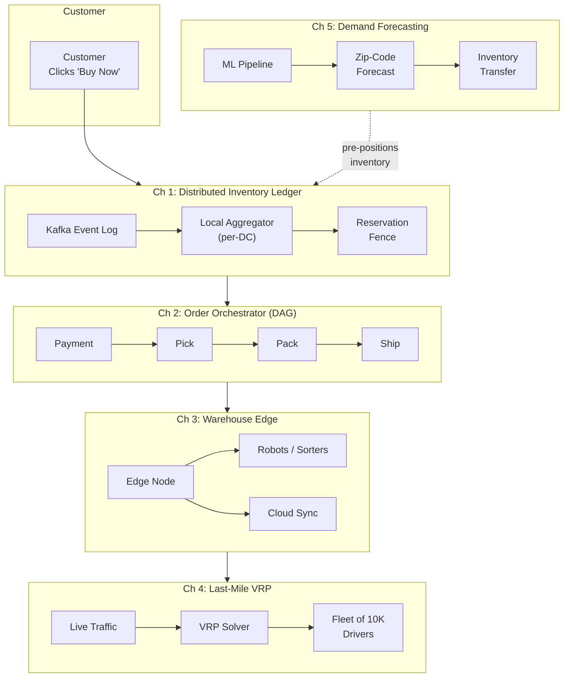

# System Design: The Global Fulfillment & Routing Engine

## Speaker Intro

This handbook is written from the perspective of a **Principal Operations Architect** who has spent a decade building the invisible machinery behind "Your package will arrive by Thursday." Before that phrase reaches a customer, an astounding chain of distributed systems must cooperate: inventory must be reserved without locking a global database, orders must flow through a multi-step DAG of payment-pick-pack-ship, warehouse robots must operate at the edge with millisecond latency, delivery trucks must solve NP-hard routing problems in real time, and an ML pipeline must predict _where_ products should be sitting before a customer even clicks "Buy Now."

This is the engineering behind global fulfillment — the system that turns a click into a cardboard box on your doorstep.

---

## Who This Is For

- **Backend engineers** who have built CRUD APIs but want to understand the event-driven, eventually-consistent architectures behind large-scale commerce.
- **Infrastructure engineers** designing Kafka-backed ledgers, Temporal/Step-Function workflows, or edge-computing topologies for physical operations.
- **Data/ML engineers** interested in how demand-forecasting models integrate into inventory placement pipelines at continental scale.
- **Systems architects** evaluating trade-offs between strong consistency (slow) and eventual consistency (fast but complex) in high-throughput order systems.
- Anyone who has ever wondered: _"How does a single warehouse fulfill 50,000 orders per hour without losing track of a single item?"_

---

## Prerequisites

| Concept | Where to Learn |
|---|---|
| Rust fundamentals (ownership, traits, async) | [Rust Patterns](../rust-patterns-book/src/SUMMARY.md) |
| Distributed systems basics (CAP, consensus) | [Distributed Systems](../distributed-systems-book/src/SUMMARY.md) |
| Event-driven architecture (Kafka, event sourcing) | [Streaming Data Lakehouse](../streaming-data-lakehouse-book/src/SUMMARY.md) |
| Async Rust and Tokio | [Async Rust](../async-book/src/SUMMARY.md) |
| Basic graph theory (DAGs, shortest paths) | Any algorithms textbook or the Algorithms & Concurrency book |

---

## How to Use This Book

| Emoji | Meaning |
|---|---|
| 🟢 | **Architecture** — Foundational data models and system topology. Start here. |
| 🟡 | **Event-Driven** — Stateful workflows, compensation logic, and edge sync. Requires Ch 1. |
| 🔴 | **Optimization / Graph** — NP-hard solvers, ML pipelines, and mathematical modeling. Deep material. |

Each chapter opens with a **`> The Problem:`** blockquote that frames the real-world constraint. Chapters include comparative tables, production Rust code, mermaid diagrams, and close with **`> Key Takeaways`**.

---

## The Problem We Are Solving

> Build a **Global Fulfillment & Routing Engine** capable of:
> 1. Maintaining a real-time inventory view across 200+ warehouses without global locks.
> 2. Orchestrating multi-step order workflows with automatic compensation on failure.
> 3. Running warehouse picking/sorting logic at the edge with offline resilience.
> 4. Solving the Vehicle Routing Problem for 10,000+ drivers in under 30 seconds.
> 5. Predicting demand by zip code and pre-positioning inventory to enable next-day delivery.

| Requirement | Target |
|---|---|
| Inventory read latency (local DC) | < 5 ms p99 |
| Order state-machine transitions | < 200 ms p99 |
| Warehouse edge offline tolerance | ≥ 4 hours |
| Route optimization (10K drivers) | < 30 s wall-clock |
| Demand forecast accuracy (7-day) | ≥ 85% WMAPE |
| Oversell rate | < 0.01% |

---

## Pacing Guide

| Chapter | Topic | Time | Checkpoint |
|---|---|---|---|
| 0 | Introduction & Architecture Overview | 1–2 hours | Can draw the end-to-end system on a whiteboard |
| 1 | The Distributed Inventory Ledger 🟢 | 6–8 hours | Event-sourced ledger with local read replicas running |
| 2 | The Order Orchestrator (DAG Workflow) 🟡 | 6–8 hours | DAG workflow engine with compensation logic tested |
| 3 | Warehouse Robotics and Edge Computing 🟡 | 5–7 hours | Edge node syncing state to cloud with offline mode |
| 4 | The Last-Mile Routing Algorithm (VRP) 🔴 | 8–10 hours | VRP solver optimizing routes for 1,000+ stops |
| 5 | Demand Forecasting and Inventory Placement 🔴 | 7–9 hours | ML pipeline producing per-zip-code placement plans |

---

## Table of Contents

### Part I: Inventory & Order Pipeline

**Chapter 1 — The Distributed Inventory Ledger 🟢**
You can't sell what you don't have, but locking one global database kills checkout throughput. We architect an eventually-consistent inventory ledger using Event Sourcing over Kafka, with localized aggregations that guarantee sub-5ms reads while preventing overselling through reservation fencing.

**Chapter 2 — The Order Orchestrator (DAG Workflow) 🟡**
Fulfilling an order is a multi-day, multi-step process. We build a distributed state machine modeled as a Directed Acyclic Graph: Payment → Pick → Pack → Ship → Deliver. When any step fails, the system must unwind with compensating actions — refunds, re-stocking, carrier cancellation.

### Part II: Warehouse & Edge

**Chapter 3 — Warehouse Robotics and Edge Computing 🟡**
The cloud is 50–200 ms away; a robot arm needs a response in 5 ms. We architect local Edge nodes inside the warehouse that run sorting and picking logic autonomously, syncing state back to the cloud asynchronously. Workers keep packing even if the internet goes down.

### Part III: Routing & Intelligence

**Chapter 4 — The Last-Mile Routing Algorithm (VRP) 🔴**
The Traveling Salesman Problem on steroids. We build a Vehicle Routing Problem engine using heuristics and optimization solvers (Google OR-Tools concepts) to calculate routes for 10,000 drivers, factoring in live traffic, delivery windows, and van capacity constraints.

**Chapter 5 — Demand Forecasting and Inventory Placement 🔴**
Don't ship an item cross-country if you can predict it'll be needed locally. We architect the ML pipeline that forecasts demand by zip code and pre-emptively shifts inventory during off-peak hours to guarantee next-day delivery without last-minute air freight.

---

## Architecture Overview

---

## Companion Guides

| Book | Relevance |
|---|---|
| [Distributed Systems](../distributed-systems-book/src/SUMMARY.md) | Consensus, replication, and partition tolerance fundamentals |
| [Streaming Data Lakehouse](../streaming-data-lakehouse-book/src/SUMMARY.md) | Kafka internals and event-sourcing patterns |
| [Async Rust](../async-book/src/SUMMARY.md) | Tokio runtime, futures, and async I/O for all network code |
| [Microservices](../microservices-book/src/SUMMARY.md) | Service decomposition, gRPC, and sidecar patterns |
| [Observability Platform](../observability-platform-book/src/SUMMARY.md) | Distributed tracing across the fulfillment pipeline |
| [Ride Dispatch](../ride-dispatch-book/src/SUMMARY.md) | Related vehicle dispatch and real-time assignment algorithms |
