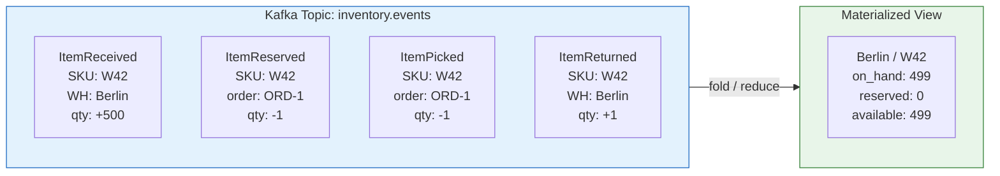
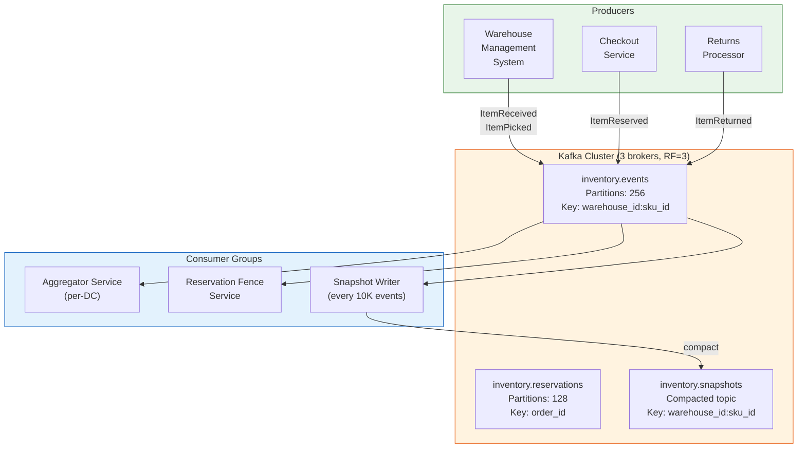
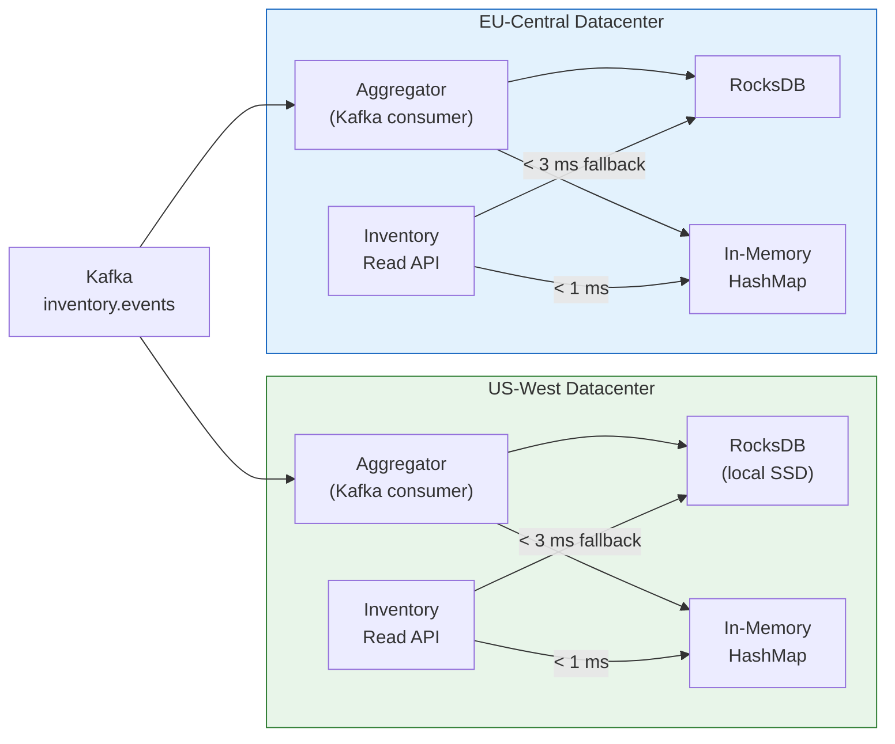
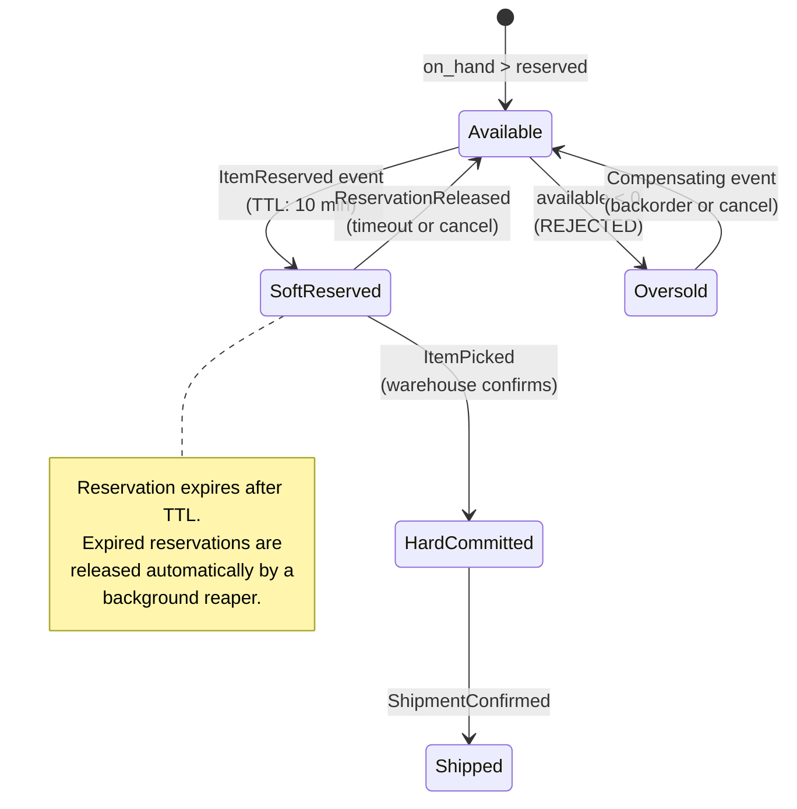
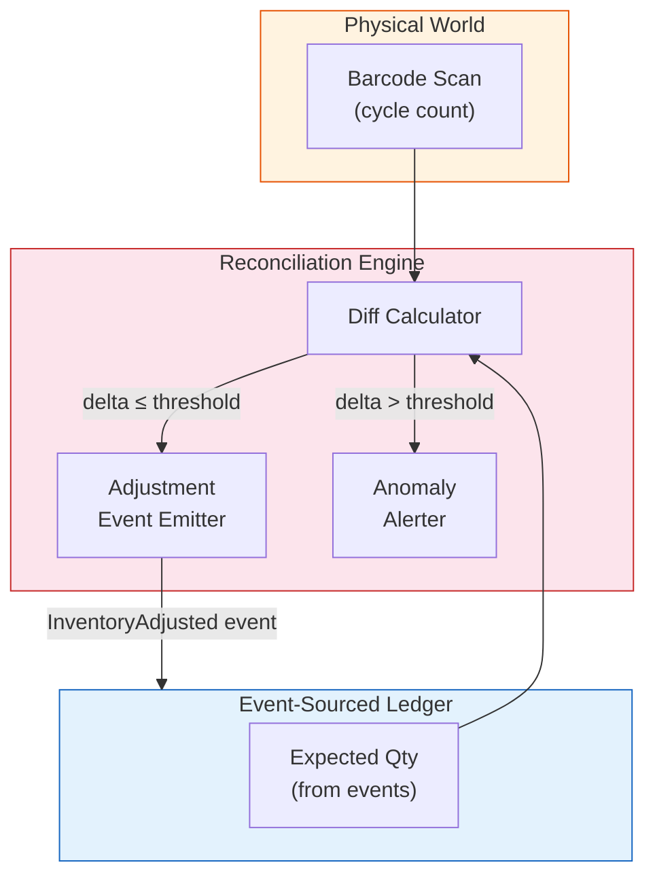

# Chapter 1: The Distributed Inventory Ledger 🟢

> **The Problem:** A global fulfillment network operates 200+ warehouses across 12 countries. Every warehouse maintains tens of thousands of SKUs with quantities that change hundreds of times per second — picks, receives, returns, damage write-offs. A customer in Berlin clicks "Buy Now" and the checkout service must answer *"Do we have this item?"* in under 5 ms. But if we lock a single global database row for every inventory check, checkout throughput collapses to a fraction of what's needed during a flash sale. We need an architecture that gives every datacenter a fast, local inventory view while making it *mathematically impossible* to sell more units than physically exist.

---

## 1.1 Why Traditional RDBMS Inventory Fails at Scale

Let's start with the naïve approach everyone tries first: a single Postgres table.

```sql
CREATE TABLE inventory (
    sku_id      TEXT NOT NULL,
    warehouse_id TEXT NOT NULL,
    quantity    INT NOT NULL CHECK (quantity >= 0),
    PRIMARY KEY (sku_id, warehouse_id)
);

-- Decrement on sale
UPDATE inventory
SET quantity = quantity - 1
WHERE sku_id = 'WIDGET-42' AND warehouse_id = 'WH-BERLIN'
  AND quantity > 0;
```

This works perfectly at small scale. But consider the failure modes:

| Scenario | Impact on single-DB approach |
|---|---|
| 50K concurrent checkout requests | Row-level locks serialize all writes — p99 latency > 2 s |
| US datacenter reads from EU primary | Cross-Atlantic round-trip adds 80–120 ms per read |
| Primary DB failover | 10–30 s of write unavailability during leader election |
| Flash sale on one SKU | Single row becomes a global mutex — throughput collapses |
| Audit / reconciliation | No history — only the current count exists |

The fundamental tension: **reads must be local and fast**, but **writes must be globally consistent to prevent overselling**. These two requirements are in direct conflict under the CAP theorem.

Our solution: **Event Sourcing** with **localized read aggregations** and **reservation fencing**.

---

## 1.2 Event Sourcing: The Inventory Event Log

Instead of storing the *current quantity* and mutating it, we store every *event* that changes quantity. The current count is a **derived materialized view** — a left fold over the event stream.



### The event schema

```rust,ignore
use chrono::{DateTime, Utc};
use serde::{Deserialize, Serialize};
use uuid::Uuid;

#[derive(Debug, Clone, Serialize, Deserialize)]
pub struct InventoryEvent {
    pub event_id: Uuid,
    pub timestamp: DateTime<Utc>,
    pub sku_id: String,
    pub warehouse_id: String,
    pub payload: InventoryPayload,
}

#[derive(Debug, Clone, Serialize, Deserialize)]
#[serde(tag = "type")]
pub enum InventoryPayload {
    /// Goods received at the warehouse dock
    ItemReceived { quantity: u32, po_number: String },
    /// Soft reservation during checkout (TTL-based)
    ItemReserved { quantity: u32, order_id: String, expires_at: DateTime<Utc> },
    /// Reservation released (timeout or cancellation)
    ReservationReleased { quantity: u32, order_id: String },
    /// Physical pick confirmed by warehouse scanner
    ItemPicked { quantity: u32, order_id: String },
    /// Customer return processed
    ItemReturned { quantity: u32, return_id: String },
    /// Damaged / written off during audit
    ItemWrittenOff { quantity: u32, reason: String },
}
```

### Why events, not state mutations?

| Property | State-mutation (RDBMS) | Event Sourcing |
|---|---|---|
| Audit trail | Must add triggers or CDC | Built-in — the log *is* the audit |
| Temporal queries ("what was stock at 3pm?") | Not possible without snapshots | Replay events up to timestamp |
| Multi-DC replication | Complex conflict resolution | Kafka handles replication natively |
| Schema evolution | ALTER TABLE + backfill | Add new event types; old consumers ignore |
| Debugging oversells | "The number was wrong" (no context) | Inspect the exact event sequence |

---

## 1.3 The Kafka Topology

We partition the `inventory.events` topic by `(warehouse_id, sku_id)`. This guarantees that **all events for a given SKU in a given warehouse land on the same partition**, preserving causal ordering.



### Partition count reasoning

With 200 warehouses × ~50,000 active SKUs, we have ~10M unique keys. But Zipf's law means 90% of traffic hits the top 1% of SKUs. We use **256 partitions** as a balance between parallelism and overhead — each partition handles ~40K unique keys but only ~500 hot keys.

### Compacted snapshot topic

Replaying millions of events on startup is prohibitively slow. Every 10,000 events per key, the Snapshot Writer publishes the current aggregated state to `inventory.snapshots`, a **log-compacted** topic. On restart, a consumer reads the latest snapshot and then replays only events after the snapshot's offset.

```rust,ignore
use std::collections::HashMap;

#[derive(Debug, Clone, Serialize, Deserialize)]
pub struct InventorySnapshot {
    pub sku_id: String,
    pub warehouse_id: String,
    /// Physical units on the shelf
    pub on_hand: i64,
    /// Units reserved but not yet picked
    pub reserved: i64,
    /// on_hand - reserved
    pub available: i64,
    /// Kafka offset this snapshot was computed from
    pub as_of_offset: i64,
    /// Monotonic version counter for optimistic concurrency
    pub version: u64,
}

/// The aggregator: a left fold over events starting from the last snapshot.
pub struct InventoryAggregator {
    state: HashMap<(String, String), InventorySnapshot>,
}

impl InventoryAggregator {
    pub fn apply(&mut self, event: &InventoryEvent) {
        let key = (event.warehouse_id.clone(), event.sku_id.clone());
        let snap = self.state.entry(key).or_insert_with(|| InventorySnapshot {
            sku_id: event.sku_id.clone(),
            warehouse_id: event.warehouse_id.clone(),
            on_hand: 0,
            reserved: 0,
            available: 0,
            as_of_offset: 0,
            version: 0,
        });

        match &event.payload {
            InventoryPayload::ItemReceived { quantity, .. } => {
                snap.on_hand += *quantity as i64;
                snap.available += *quantity as i64;
            }
            InventoryPayload::ItemReserved { quantity, .. } => {
                snap.reserved += *quantity as i64;
                snap.available -= *quantity as i64;
            }
            InventoryPayload::ReservationReleased { quantity, .. } => {
                snap.reserved -= *quantity as i64;
                snap.available += *quantity as i64;
            }
            InventoryPayload::ItemPicked { quantity, .. } => {
                snap.on_hand -= *quantity as i64;
                snap.reserved -= *quantity as i64;
            }
            InventoryPayload::ItemReturned { quantity, .. } => {
                snap.on_hand += *quantity as i64;
                snap.available += *quantity as i64;
            }
            InventoryPayload::ItemWrittenOff { quantity, .. } => {
                snap.on_hand -= *quantity as i64;
                snap.available -= *quantity as i64;
            }
        }

        snap.version += 1;
    }
}
```

---

## 1.4 Localized Read Replicas: Sub-5ms Inventory Reads

Each datacenter runs its own **Aggregator Service** that consumes the full `inventory.events` topic and materializes the current state into a local, in-memory store backed by an embedded **RocksDB** for persistence across restarts.



### The read path

```rust,ignore
use axum::{extract::Path, Json};
use std::sync::Arc;

pub struct InventoryReadService {
    /// Hot SKUs in memory — handles 95% of reads
    cache: Arc<dashmap::DashMap<(String, String), InventorySnapshot>>,
    /// Cold SKUs on local SSD
    rocks: Arc<rocksdb::DB>,
}

impl InventoryReadService {
    pub async fn get_available(
        &self,
        warehouse_id: &str,
        sku_id: &str,
    ) -> Option<InventorySnapshot> {
        let key = (warehouse_id.to_string(), sku_id.to_string());

        // L1: in-memory DashMap — sub-microsecond
        if let Some(snap) = self.cache.get(&key) {
            return Some(snap.clone());
        }

        // L2: local RocksDB — ~1-2 ms on NVMe
        let rocks_key = format!("{}:{}", warehouse_id, sku_id);
        if let Ok(Some(bytes)) = self.rocks.get(rocks_key.as_bytes()) {
            let snap: InventorySnapshot = bincode::deserialize(&bytes).ok()?;
            // Promote to L1 for future reads
            self.cache.insert(key, snap.clone());
            return Some(snap);
        }

        None // SKU not tracked at this warehouse
    }
}
```

### Consumer lag = staleness

The read replica is **eventually consistent** with the event log. Consumer lag is typically 50–200 ms. This means a Berlin customer might see a product as "in stock" for up to 200 ms after the last unit was reserved in Frankfurt. This is acceptable because:

1. The **reservation fence** (§1.5) prevents actual overselling.
2. The worst case is showing "in stock" and then returning a "sold out" error at checkout — a ~0.01% event rate.
3. Showing "sold out" when stock actually exists (the reverse lag) costs more in lost revenue than the occasional false positive.

| Consistency Model | Staleness | Oversell Risk | User Experience |
|---|---|---|---|
| Strong (single leader) | 0 ms | None | High latency, frequent timeouts |
| **Eventual (our approach)** | **50–200 ms** | **Fenced at write** | **Fast reads, rare soft failures** |
| No consistency (cached) | Seconds–minutes | High | Fast but dangerous |

---

## 1.5 The Reservation Fence: Preventing Overselling

This is the critical piece. Fast local reads are useless if we oversell. The **Reservation Fence Service** is a single-leader, strongly-consistent component that processes all `ItemReserved` events.

### How reservation fencing works



### The fencing algorithm

```rust,ignore
use std::sync::atomic::{AtomicI64, Ordering};
use dashmap::DashMap;
use tokio::time::{Duration, Instant};

pub struct ReservationFence {
    /// Strongly consistent available count per (warehouse, sku)
    available: DashMap<(String, String), AtomicI64>,
    /// Active reservations with expiry — reaped every 30s
    reservations: DashMap<String, ReservationEntry>,
}

struct ReservationEntry {
    warehouse_id: String,
    sku_id: String,
    quantity: u32,
    expires_at: Instant,
}

impl ReservationFence {
    /// Attempt to reserve `quantity` units. Returns Ok(()) or Err if insufficient stock.
    pub fn try_reserve(
        &self,
        warehouse_id: &str,
        sku_id: &str,
        order_id: &str,
        quantity: u32,
    ) -> Result<(), ReservationError> {
        let key = (warehouse_id.to_string(), sku_id.to_string());
        let counter = self.available
            .entry(key)
            .or_insert_with(|| AtomicI64::new(0));

        // Atomic decrement with check — no locks needed
        loop {
            let current = counter.load(Ordering::SeqCst);
            let new_val = current - quantity as i64;
            if new_val < 0 {
                return Err(ReservationError::InsufficientStock {
                    available: current as u32,
                    requested: quantity,
                });
            }
            if counter
                .compare_exchange(current, new_val, Ordering::SeqCst, Ordering::SeqCst)
                .is_ok()
            {
                // CAS succeeded — record the reservation for TTL reaping
                self.reservations.insert(order_id.to_string(), ReservationEntry {
                    warehouse_id: warehouse_id.to_string(),
                    sku_id: sku_id.to_string(),
                    quantity,
                    expires_at: Instant::now() + Duration::from_secs(600), // 10 min TTL
                });
                return Ok(());
            }
            // CAS failed — another thread changed the value; retry
        }
    }

    /// Background task: release expired reservations
    pub async fn reap_expired(&self) {
        let mut expired = Vec::new();
        for entry in self.reservations.iter() {
            if Instant::now() > entry.value().expires_at {
                expired.push(entry.key().clone());
            }
        }
        for order_id in expired {
            if let Some((_, entry)) = self.reservations.remove(&order_id) {
                let key = (entry.warehouse_id, entry.sku_id);
                if let Some(counter) = self.available.get(&key) {
                    counter.fetch_add(entry.quantity as i64, Ordering::SeqCst);
                }
            }
        }
    }
}

#[derive(Debug)]
pub enum ReservationError {
    InsufficientStock { available: u32, requested: u32 },
}
```

### Why CAS (Compare-And-Swap) instead of locks?

| Approach | Throughput (single SKU) | Contention behavior | Deadlock risk |
|---|---|---|---|
| Mutex per SKU | ~2M ops/s | Threads block and queue | Possible if ordering inverts |
| **CAS loop (lock-free)** | **~8M ops/s** | **Threads retry on conflict** | **Impossible** |
| Database row lock | ~50K ops/s | Serialized at DB layer | Timeout-based |

For a flash sale where 100,000 customers try to reserve the same SKU in 10 seconds, lock-free CAS is the only approach that doesn't create a global bottleneck.

---

## 1.6 Handling the Flash Sale: The Reservation Queue

During extreme spikes (e.g., iPhone launch day), even CAS loops can degrade due to excessive retries. We add a **bounded reservation queue** per hot SKU:

```rust,ignore
use tokio::sync::mpsc;

pub struct HotSkuReservationQueue {
    tx: mpsc::Sender<ReservationRequest>,
}

struct ReservationRequest {
    order_id: String,
    quantity: u32,
    response: tokio::sync::oneshot::Sender<Result<(), ReservationError>>,
}

/// Single-threaded drain loop — processes requests sequentially.
/// This is intentionally NOT parallel for a hot SKU: serial processing
/// eliminates CAS contention entirely.
async fn drain_loop(
    mut rx: mpsc::Receiver<ReservationRequest>,
    available: &AtomicI64,
) {
    while let Some(req) = rx.recv().await {
        let current = available.load(Ordering::SeqCst);
        if current >= req.quantity as i64 {
            available.fetch_sub(req.quantity as i64, Ordering::SeqCst);
            let _ = req.response.send(Ok(()));
        } else {
            let _ = req.response.send(Err(ReservationError::InsufficientStock {
                available: current as u32,
                requested: req.quantity,
            }));
        }
    }
}
```

For 99% of SKUs, the CAS path handles load easily. For the top 0.1% "hot" SKUs detected by a rate counter, we route through the serial queue. This hybrid approach gives us:

- **8M ops/s** on normal SKUs (CAS path)
- **1.5M ops/s** on hot SKUs (sequential, zero contention)
- **Zero oversells** (both paths are linearized)

---

## 1.7 Cross-Warehouse Inventory Aggregation

A customer doesn't care *which* warehouse has the item — they want to know if it's *available for delivery to their zip code*. The **Global Availability Service** aggregates inventory across all eligible warehouses:

```rust,ignore
use std::collections::HashMap;

pub struct GlobalAvailabilityService {
    /// Per-DC aggregator read API clients
    dc_clients: HashMap<String, InventoryReadClient>,
    /// Warehouse-to-delivery-zone mapping
    zone_map: HashMap<String, Vec<String>>, // zip_prefix -> [warehouse_ids]
}

impl GlobalAvailabilityService {
    /// Returns the total available quantity for a SKU deliverable to a zip code,
    /// along with the best warehouse (closest / fastest).
    pub async fn check_availability(
        &self,
        sku_id: &str,
        zip_code: &str,
    ) -> AvailabilityResult {
        let zip_prefix = &zip_code[..3]; // Coarse zone grouping
        let warehouses = match self.zone_map.get(zip_prefix) {
            Some(whs) => whs,
            None => return AvailabilityResult::unavailable(),
        };

        let mut total_available: i64 = 0;
        let mut best_warehouse: Option<(String, i64)> = None;

        // Fan out reads to all eligible warehouses in parallel
        let futures: Vec<_> = warehouses.iter().map(|wh_id| {
            let client = &self.dc_clients[&self.warehouse_to_dc(wh_id)];
            client.get_available(wh_id, sku_id)
        }).collect();

        let results = futures::future::join_all(futures).await;

        for (wh_id, result) in warehouses.iter().zip(results) {
            if let Some(snap) = result {
                if snap.available > 0 {
                    total_available += snap.available;
                    match &best_warehouse {
                        None => best_warehouse = Some((wh_id.clone(), snap.available)),
                        Some((_, best_qty)) if snap.available > *best_qty => {
                            best_warehouse = Some((wh_id.clone(), snap.available));
                        }
                        _ => {}
                    }
                }
            }
        }

        AvailabilityResult {
            sku_id: sku_id.to_string(),
            total_available,
            best_warehouse: best_warehouse.map(|(wh, _)| wh),
            eligible_warehouses: warehouses.len(),
        }
    }

    fn warehouse_to_dc(&self, _wh_id: &str) -> String {
        // Maps warehouse to its nearest datacenter
        "us-west".to_string() // simplified
    }
}

pub struct AvailabilityResult {
    pub sku_id: String,
    pub total_available: i64,
    pub best_warehouse: Option<String>,
    pub eligible_warehouses: usize,
}

impl AvailabilityResult {
    fn unavailable() -> Self {
        Self {
            sku_id: String::new(),
            total_available: 0,
            best_warehouse: None,
            eligible_warehouses: 0,
        }
    }
}
```

---

## 1.8 Reconciliation: Healing the Ledger

Event-sourced systems can drift from physical reality. A warehouse worker drops a box and doesn't scan it. A return gets placed on the wrong shelf. We run **daily reconciliation** to detect and correct drift:



### Reconciliation rules

| Scenario | Delta | Action |
|---|---|---|
| Minor shrinkage | 1–5 units | Auto-emit `InventoryAdjusted` event, log for audit |
| Significant discrepancy | 6–50 units | Emit adjustment + alert warehouse manager |
| Major anomaly | > 50 units or > 10% | **Halt automated adjustment**, escalate for manual investigation |
| Negative physical count | Impossible | Reject scan, flag scanner malfunction |

---

## 1.9 Operational Metrics and Monitoring

| Metric | Target | Alert Threshold |
|---|---|---|
| Kafka consumer lag (p99) | < 500 ms | > 2 s |
| Reservation fence CAS retries/s | < 1,000 | > 10,000 |
| Oversell rate (daily) | < 0.01% | > 0.05% |
| Reconciliation drift (daily) | < 0.1% of total units | > 0.5% |
| Read API latency (p99) | < 5 ms | > 15 ms |
| Snapshot compaction interval | Every 10K events/key | Backlog > 50K |

### The health check

```rust,ignore
use axum::{routing::get, Json, Router};
use serde::Serialize;

#[derive(Serialize)]
struct HealthResponse {
    status: &'static str,
    kafka_lag_ms: u64,
    cached_skus: usize,
    oversell_rate_24h: f64,
}

async fn health_check(
    aggregator: axum::extract::State<Arc<InventoryAggregator>>,
) -> Json<HealthResponse> {
    Json(HealthResponse {
        status: "ok",
        kafka_lag_ms: aggregator.current_lag_ms(),
        cached_skus: aggregator.cached_count(),
        oversell_rate_24h: aggregator.oversell_rate(),
    })
}
```

---

## 1.10 Exercises

### Exercise 1: Implement Reservation TTL Reaping

<details>
<summary>Problem Statement</summary>

Implement a background Tokio task that runs every 30 seconds, iterates over all active reservations, and releases any that have exceeded their 10-minute TTL. Emit a `ReservationReleased` event for each expired reservation.

</details>

<details>
<summary>Hint</summary>

Use `tokio::time::interval` and iterate over the `DashMap` entries. Remember that releasing a reservation must atomically increment the available counter.

</details>

<details>
<summary>Solution</summary>

```rust,ignore
use tokio::time::{interval, Duration, Instant};

async fn reservation_reaper(fence: Arc<ReservationFence>, event_tx: mpsc::Sender<InventoryEvent>) {
    let mut tick = interval(Duration::from_secs(30));
    loop {
        tick.tick().await;
        let mut expired = Vec::new();

        for entry in fence.reservations.iter() {
            if Instant::now() > entry.value().expires_at {
                expired.push(entry.key().clone());
            }
        }

        for order_id in expired {
            if let Some((_, entry)) = fence.reservations.remove(&order_id) {
                let key = (entry.warehouse_id.clone(), entry.sku_id.clone());
                if let Some(counter) = fence.available.get(&key) {
                    counter.fetch_add(entry.quantity as i64, Ordering::SeqCst);
                }
                // Emit compensation event
                let event = InventoryEvent {
                    event_id: Uuid::new_v4(),
                    timestamp: Utc::now(),
                    sku_id: entry.sku_id,
                    warehouse_id: entry.warehouse_id,
                    payload: InventoryPayload::ReservationReleased {
                        quantity: entry.quantity,
                        order_id,
                    },
                };
                let _ = event_tx.send(event).await;
            }
        }
    }
}
```

</details>

### Exercise 2: Build a Snapshot Writer

<details>
<summary>Problem Statement</summary>

Implement a Kafka consumer that tracks the event count per `(warehouse_id, sku_id)` key. Every 10,000 events per key, serialize the current `InventorySnapshot` and produce it to the compacted `inventory.snapshots` topic.

</details>

---

> **Key Takeaways**
>
> 1. **Event Sourcing** turns inventory from mutable state into an immutable log. The current count is a derived view, not the source of truth.
> 2. **Localized aggregators** in each datacenter give sub-5ms reads by consuming the global Kafka topic into an in-memory store backed by RocksDB.
> 3. **Reservation fencing** with lock-free CAS prevents overselling without introducing a global lock. Hot SKUs fall back to a single-threaded serial queue.
> 4. **Consumer lag is the staleness budget.** 50–200 ms of eventual consistency is acceptable when the write path is strongly fenced.
> 5. **Reconciliation** heals the event log against physical reality — the last line of defense against real-world entropy.
> 6. The architecture separates the **read path** (fast, local, eventually consistent) from the **write path** (fenced, linearized, globally correct) — a textbook CQRS split.
