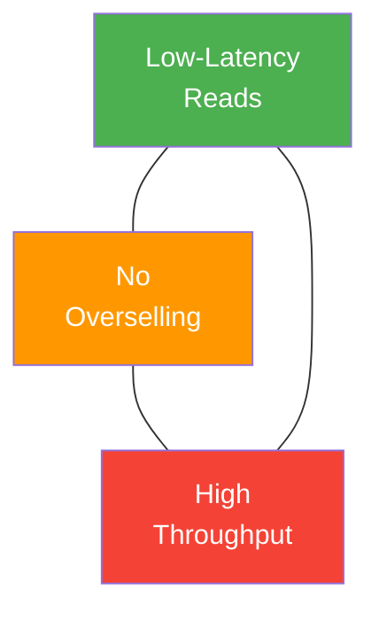
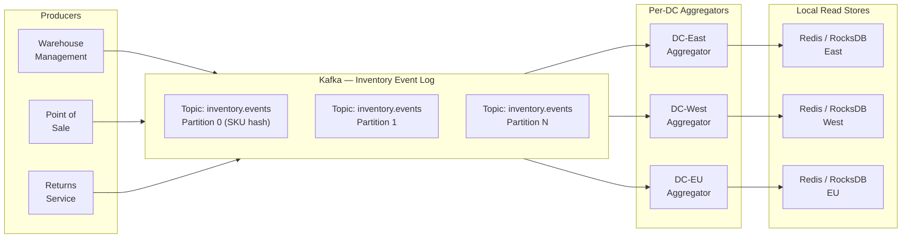
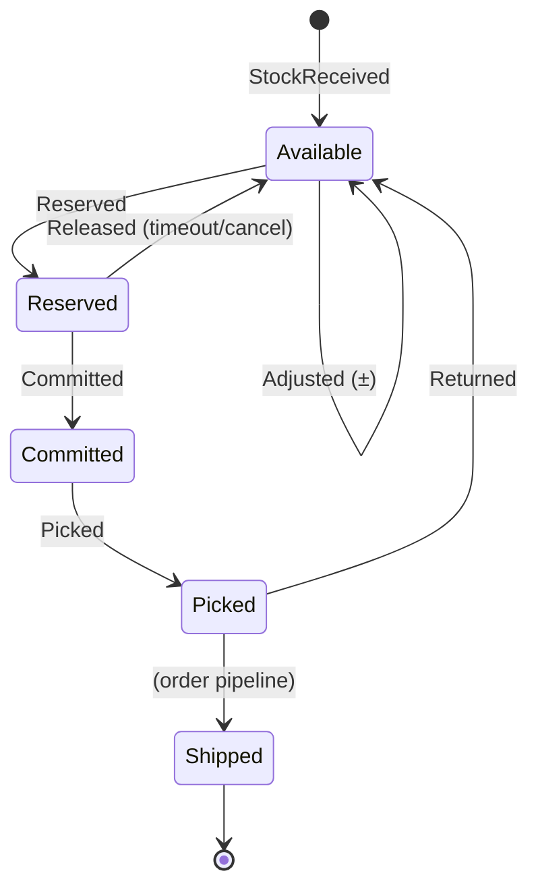
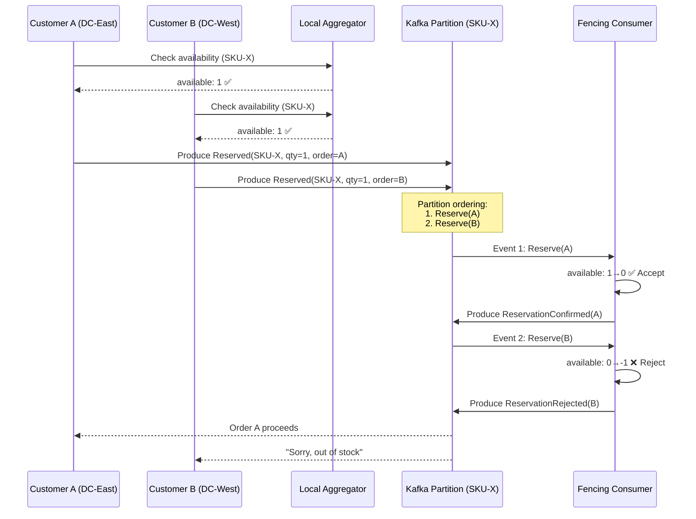

# 1. The Distributed Inventory Ledger 🟢

> **The Problem:** Every e-commerce system faces the same paradox — you need a _single source of truth_ for inventory to prevent overselling, but querying a single global database for every "Add to Cart" click across 200 data centers and 50,000 requests per second is a recipe for latency spikes and checkout failures. A global lock is correct but slow; no lock is fast but wrong. We need a third path.

---

## The Inventory Trilemma

Inventory systems must balance three competing goals. You can optimize for two, but the third suffers:

| Goal | Description | Tension |
|---|---|---|
| **Low-latency reads** | Sub-5 ms local inventory checks for "Add to Cart" | Requires local replicas — introduces staleness |
| **No overselling** | Never confirm an order for an item that doesn't exist | Requires coordination — adds latency |
| **High throughput** | Handle 50K+ concurrent checkouts per second globally | Locks and two-phase commits destroy throughput |



Traditional approaches pick a side:

| Approach | Reads | Oversell Risk | Throughput |
|---|---|---|---|
| Single DB with row locks | ~20–80 ms | ✅ None | ❌ ~5K TPS |
| Read replicas (async) | ~2–5 ms | ❌ High (stale reads) | ✅ ~100K TPS |
| Distributed lock (Redis/ZK) | ~10–30 ms | ✅ Low | 🟡 ~20K TPS |
| **Event-sourced ledger** | **~2–5 ms** | **✅ < 0.01%** | **✅ ~80K TPS** |

Our design chooses the event-sourced ledger: fast local reads, fenced reservations to prevent overselling, and Kafka-backed event streaming for throughput.

---

## Architecture: The Event-Sourced Inventory Ledger

The core idea is simple: **never update inventory in place.** Instead, every mutation is an _event_ appended to an immutable log. Local aggregators consume the log and maintain materialized views optimized for read queries.



### Event Schema

Every inventory mutation becomes a typed event:

```rust,ignore
use chrono::{DateTime, Utc};
use serde::{Deserialize, Serialize};
use uuid::Uuid;

#[derive(Debug, Clone, Serialize, Deserialize)]
pub struct InventoryEvent {
    pub event_id: Uuid,
    pub sku: String,
    pub warehouse_id: String,
    pub timestamp: DateTime<Utc>,
    pub payload: InventoryPayload,
}

#[derive(Debug, Clone, Serialize, Deserialize)]
pub enum InventoryPayload {
    /// Goods received at warehouse dock
    StockReceived { quantity: u32, po_number: String },
    /// Item reserved during checkout (soft hold)
    Reserved { quantity: u32, order_id: Uuid },
    /// Reservation confirmed after payment
    Committed { quantity: u32, order_id: Uuid },
    /// Reservation released (payment failed, timeout)
    Released { quantity: u32, order_id: Uuid },
    /// Physical item picked from shelf
    Picked { quantity: u32, order_id: Uuid },
    /// Item returned by customer
    Returned { quantity: u32, return_id: Uuid },
    /// Inventory adjustment (shrinkage, audit)
    Adjusted { delta: i32, reason: String },
}
```

### The Inventory State Machine

Each SKU-warehouse pair has a clear lifecycle. Events drive transitions:



---

## The Local Aggregator

Each data center runs an **aggregator** that consumes the Kafka event stream and maintains a materialized view of current inventory. This is a left-fold over the event log:

```
current_state = fold(initial_state, events)
```

```rust,ignore
use std::collections::HashMap;

/// Materialized inventory view for a single SKU at one warehouse.
#[derive(Debug, Default, Clone)]
pub struct SkuInventory {
    pub on_hand: u32,      // physically in warehouse
    pub reserved: u32,     // soft-held for in-progress checkouts
    pub committed: u32,    // payment confirmed, awaiting pick
    pub available: u32,    // on_hand - reserved - committed
}

pub struct InventoryAggregator {
    /// (sku, warehouse_id) -> current state
    state: HashMap<(String, String), SkuInventory>,
}

impl InventoryAggregator {
    pub fn new() -> Self {
        Self {
            state: HashMap::new(),
        }
    }

    pub fn apply(&mut self, event: &InventoryEvent) {
        let key = (event.sku.clone(), event.warehouse_id.clone());
        let inv = self.state.entry(key).or_default();

        match &event.payload {
            InventoryPayload::StockReceived { quantity, .. } => {
                inv.on_hand += quantity;
            }
            InventoryPayload::Reserved { quantity, .. } => {
                inv.reserved += quantity;
            }
            InventoryPayload::Committed { quantity, .. } => {
                // Move from reserved to committed
                inv.reserved = inv.reserved.saturating_sub(*quantity);
                inv.committed += quantity;
            }
            InventoryPayload::Released { quantity, .. } => {
                inv.reserved = inv.reserved.saturating_sub(*quantity);
            }
            InventoryPayload::Picked { quantity, .. } => {
                inv.committed = inv.committed.saturating_sub(*quantity);
                inv.on_hand = inv.on_hand.saturating_sub(*quantity);
            }
            InventoryPayload::Returned { quantity, .. } => {
                inv.on_hand += quantity;
            }
            InventoryPayload::Adjusted { delta, .. } => {
                if *delta >= 0 {
                    inv.on_hand += *delta as u32;
                } else {
                    inv.on_hand = inv.on_hand.saturating_sub(delta.unsigned_abs());
                }
            }
        }

        // Recompute derived field
        inv.available = inv.on_hand.saturating_sub(inv.reserved + inv.committed);
    }

    pub fn get(&self, sku: &str, warehouse_id: &str) -> Option<&SkuInventory> {
        self.state.get(&(sku.to_string(), warehouse_id.to_string()))
    }
}
```

The aggregator writes the computed `SkuInventory` to a **local read store** (Redis or RocksDB). "Add to Cart" queries hit this local store — never Kafka, never the source database.

---

## Reservation Fencing: Preventing Overselling

Fast local reads solve latency, but they introduce a window of staleness. Two customers in different DCs could both see `available: 1` and both reserve the last item. This is the **oversell problem**.

### The Reservation Fence

We solve this with a **fenced reservation** protocol. The local aggregator is optimistic — it lets the cart proceed — but the actual reservation is serialized through Kafka partitioning:

1. **Cart checks local aggregator** — fast, optimistic read.
2. **Checkout produces a `Reserved` event** — keyed by SKU, so all reservations for the same SKU land on the **same Kafka partition** (total order guarantee).
3. **The fencing consumer** on that partition applies events in order and **rejects** the reservation if `available` would go negative.
4. **Rejection event** published back, triggering a "Sorry, out of stock" response.



### The Fencing Consumer in Rust

```rust,ignore
use rdkafka::consumer::{Consumer, StreamConsumer};
use rdkafka::producer::FutureProducer;
use rdkafka::Message;
use std::collections::HashMap;

pub struct FencingConsumer {
    /// Authoritative count: sku -> available quantity
    ledger: HashMap<String, i64>,
    producer: FutureProducer,
}

impl FencingConsumer {
    /// Process a single reservation request from the partition.
    /// This runs single-threaded per partition — total ordering guaranteed.
    pub async fn process_reservation(
        &mut self,
        event: &InventoryEvent,
    ) -> Result<(), FencingError> {
        match &event.payload {
            InventoryPayload::Reserved { quantity, order_id } => {
                let available = self.ledger.entry(event.sku.clone()).or_insert(0);

                if *available >= *quantity as i64 {
                    // ✅ Accept: decrement and publish confirmation
                    *available -= *quantity as i64;
                    self.publish_confirmation(&event.sku, *order_id).await?;
                } else {
                    // ❌ Reject: publish rejection, do NOT decrement
                    self.publish_rejection(&event.sku, *order_id).await?;
                }
            }
            InventoryPayload::Released { quantity, .. } => {
                // Return quantity to available pool
                let available = self.ledger.entry(event.sku.clone()).or_insert(0);
                *available += *quantity as i64;
            }
            InventoryPayload::StockReceived { quantity, .. } => {
                let available = self.ledger.entry(event.sku.clone()).or_insert(0);
                *available += *quantity as i64;
            }
            _ => {} // Other events handled by general aggregator
        }
        Ok(())
    }

    async fn publish_confirmation(
        &self,
        sku: &str,
        order_id: uuid::Uuid,
    ) -> Result<(), FencingError> {
        // Publish ReservationConfirmed to Kafka
        todo!("serialize and produce to inventory.confirmations topic")
    }

    async fn publish_rejection(
        &self,
        sku: &str,
        order_id: uuid::Uuid,
    ) -> Result<(), FencingError> {
        // Publish ReservationRejected to Kafka
        todo!("serialize and produce to inventory.rejections topic")
    }
}

#[derive(Debug, thiserror::Error)]
pub enum FencingError {
    #[error("Kafka produce failed: {0}")]
    Kafka(#[from] rdkafka::error::KafkaError),
}
```

**Why this works:** Kafka guarantees that all events for the same SKU (same partition key) arrive at the fencing consumer strictly in order. This gives us **serializability for a single SKU** without any distributed lock.

---

## Kafka Topic Design

Partitioning strategy is critical. We hash by SKU to ensure ordering:

```
Topic: inventory.events
  Key: SHA256(sku)[0..4] → partition
  Partitions: 256  (allows up to 256 parallel fencing consumers)
  Retention: 30 days (enables replaying to rebuild aggregators)
  Replication factor: 3
  min.insync.replicas: 2
```

| Topic | Purpose | Key | Partitions |
|---|---|---|---|
| `inventory.events` | All inventory mutations | SKU | 256 |
| `inventory.confirmations` | Accepted reservations | Order ID | 64 |
| `inventory.rejections` | Rejected reservations | Order ID | 64 |
| `inventory.snapshots` | Periodic full-state checkpoints | SKU | 256 |

### Snapshot Compaction

The event log grows unbounded. Periodically, the aggregator writes a **snapshot** — a full `SkuInventory` record — to the `inventory.snapshots` topic with **log compaction** enabled. On restart, the aggregator loads the latest snapshot and replays only subsequent events:

```rust,ignore
pub struct AggregatorRecovery {
    pub snapshot_offset: u64,
    pub snapshot_state: HashMap<(String, String), SkuInventory>,
}

impl AggregatorRecovery {
    /// Recover by loading the last snapshot, then replaying events after it.
    pub async fn recover(
        snapshot_consumer: &StreamConsumer,
        event_consumer: &StreamConsumer,
    ) -> Self {
        // 1. Read latest snapshot from compacted topic
        let (offset, state) = Self::load_latest_snapshot(snapshot_consumer).await;

        // 2. Seek event consumer to snapshot offset + 1
        // 3. Replay all events from that point forward
        // This turns a potentially hours-long replay into seconds.

        Self {
            snapshot_offset: offset,
            snapshot_state: state,
        }
    }

    async fn load_latest_snapshot(
        consumer: &StreamConsumer,
    ) -> (u64, HashMap<(String, String), SkuInventory>) {
        todo!("consume compacted snapshot topic to latest offsets")
    }
}
```

---

## Handling Multi-Warehouse Availability

A customer in San Francisco searches for a product. It's available in both the Oakland warehouse (5 miles away) and the Dallas warehouse (1,500 miles away). The system must:

1. Show "In Stock" (aggregated view).
2. Choose the **optimal warehouse** at checkout time (closest, cheapest shipping, most inventory).

```rust,ignore
/// Given a customer location and a list of warehouse inventories,
/// select the best warehouse to fulfill from.
pub fn select_fulfillment_warehouse(
    customer_zip: &str,
    sku: &str,
    warehouse_inventories: &[(WarehouseInfo, SkuInventory)],
) -> Option<&WarehouseInfo> {
    warehouse_inventories
        .iter()
        .filter(|(_, inv)| inv.available > 0)
        .min_by_key(|(wh, _)| {
            // Score = distance_miles * 10 + shipping_cost_cents
            // Lower is better
            let distance = wh.distance_to_zip(customer_zip);
            let cost = wh.shipping_cost_cents(customer_zip);
            distance * 10 + cost
        })
        .map(|(wh, _)| wh)
}

pub struct WarehouseInfo {
    pub id: String,
    pub lat: f64,
    pub lng: f64,
    pub region: String,
}

impl WarehouseInfo {
    pub fn distance_to_zip(&self, zip: &str) -> u32 {
        // Haversine distance lookup from zip centroid
        todo!()
    }

    pub fn shipping_cost_cents(&self, zip: &str) -> u32 {
        // Rate table lookup by carrier and zone
        todo!()
    }
}
```

---

## Consistency Guarantees and Trade-offs

| Guarantee | Mechanism | Cost |
|---|---|---|
| **No overselling** | Fencing consumer serialized per-SKU partition | Adds ~50–200 ms to reservation confirmation |
| **Fast reads** | Local RocksDB/Redis materialized view per DC | Staleness window of 1–5 seconds |
| **Durability** | Kafka replication factor 3, min ISR 2 | 3x storage, cross-AZ network |
| **Exactly-once processing** | Kafka transactions + idempotent producer | ~10% throughput overhead |
| **Disaster recovery** | Snapshot compaction + event replay | Minutes to rebuild from scratch |

### The Staleness Window

The gap between an event being produced and the local aggregator consuming it is the **staleness window**. In practice:

```
┌──────────────┐     ┌─────────┐     ┌──────────────┐
│  Producer     │────▶│  Kafka  │────▶│  Aggregator  │
│  (warehouse)  │     │  (3 ms) │     │  (2 ms apply)│
└──────────────┘     └─────────┘     └──────────────┘
                  Total staleness: ~5–50 ms (same region)
                                   ~100–300 ms (cross-region)
```

For most SKUs with healthy stock levels, this staleness is invisible. The fencing consumer is the safety net for the race conditions it creates on low-stock items.

---

## Production Checklist

- [ ] **Partition key = SKU**: All events for a SKU must land on the same partition.
- [ ] **Idempotent producer**: Enable `enable.idempotence=true` to prevent duplicate events on Kafka retries.
- [ ] **Consumer group per DC**: Each data center has its own consumer group for independent offset tracking.
- [ ] **Snapshot frequency**: Checkpoint every 10 minutes or 100,000 events (whichever comes first).
- [ ] **Dead letter queue**: Events that fail deserialization go to a DLQ, not silently dropped.
- [ ] **Monitoring**: Alert on consumer lag > 10,000 events (staleness risk) and fencing rejection rate > 1% (stock level issue).
- [ ] **Backpressure**: If the aggregator falls behind, temporarily redirect reads to a stale-but-safe fallback (e.g., check fencing consumer directly).

---

> **Key Takeaways**
>
> 1. **Event sourcing turns inventory into an append-only log** — no row locks, no UPDATE statements, just immutable facts that can be replayed to rebuild state.
> 2. **Local aggregators give you sub-5ms reads** by maintaining materialized views in each data center, while Kafka handles cross-region replication.
> 3. **The fencing consumer prevents overselling** by serializing reservations per-SKU through Kafka's partition ordering — achieving serializability without distributed locks.
> 4. **Snapshot compaction bounds recovery time** — instead of replaying millions of events, load the last snapshot and replay only the delta.
> 5. **The staleness window is the fundamental trade-off** — you accept 5–300 ms of stale reads in exchange for 10x throughput, and the fencing layer is your safety net.
