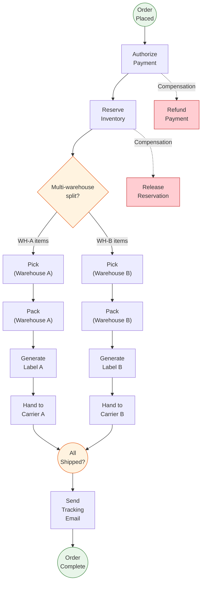
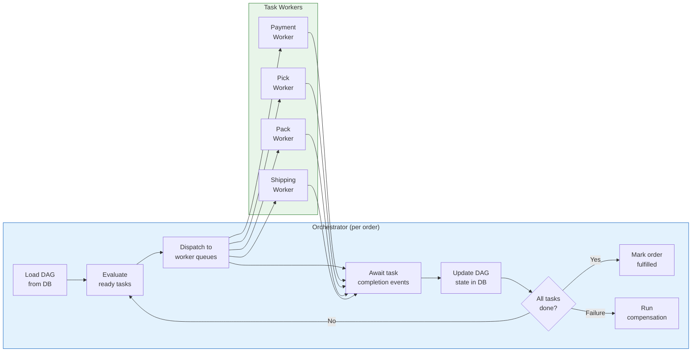
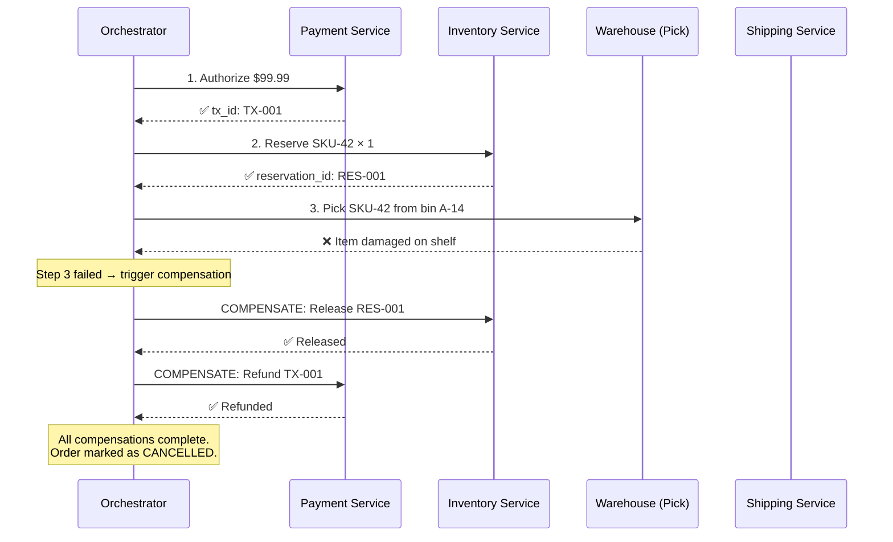
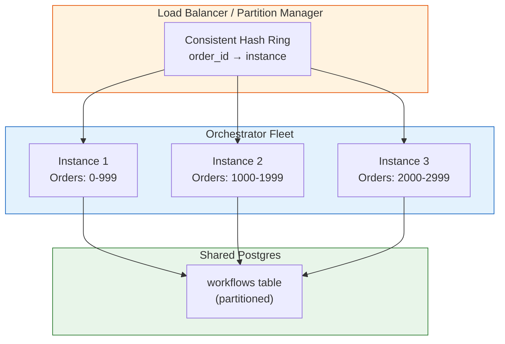

# Chapter 2: The Order Orchestrator (DAG Workflow) 🟡

> **The Problem:** A customer clicks "Place Order" and expects a package at their door in 48 hours. Behind that single click, a complex chain of distributed operations must execute in precise order: authorize payment, allocate inventory, pick items from shelves, pack them into a box, generate a shipping label, hand off to a carrier, and send tracking notifications. Each step can fail — the payment processor times out, the warehouse discovers the item is damaged, the carrier rejects an overweight parcel. When step 4 of 7 fails, the system must *undo* steps 1–3 in reverse order (refund payment, release inventory, cancel pick assignment) without human intervention. This is the Saga pattern executed over a Directed Acyclic Graph — an **Order Orchestrator**.

---

## 2.1 Why a Linear Pipeline Isn't Enough

The naïve approach models fulfillment as a linear sequence:

```
Payment → Inventory → Pick → Pack → Ship → Notify
```

This breaks immediately in the real world:

| Real-world scenario | Why linear breaks |
|---|---|
| Multi-warehouse split shipment | One order spawns parallel pick→pack→ship subgraphs per warehouse |
| Gift wrapping + insurance | Parallel optional steps that must join before shipping |
| Hazmat items requiring special handling | Conditional branch that inserts extra compliance steps |
| Pre-order with delayed fulfillment | The DAG must pause at a timer node for days/weeks |
| Partial failure (1 of 3 items out of stock) | Must compensate only the failed branch, not the whole order |

What we actually need is a **Directed Acyclic Graph (DAG)** where nodes are tasks and edges are dependencies. The orchestrator walks the DAG, executing tasks when all upstream dependencies are satisfied.



---

## 2.2 The DAG Data Model

We model the workflow as a first-class data structure — not buried in imperative code, but as a serializable, inspectable, versionable graph.

```rust,ignore
use chrono::{DateTime, Utc};
use serde::{Deserialize, Serialize};
use std::collections::{HashMap, HashSet};
use uuid::Uuid;

/// A single step in the fulfillment DAG.
#[derive(Debug, Clone, Serialize, Deserialize)]
pub struct TaskNode {
    pub task_id: String,
    pub task_type: TaskType,
    /// IDs of tasks that must complete before this one can start.
    pub depends_on: Vec<String>,
    /// The compensation task to run if this task succeeds but a
    /// downstream task fails and we need to roll back.
    pub compensation: Option<String>,
    pub status: TaskStatus,
    pub assigned_worker: Option<String>,
    pub started_at: Option<DateTime<Utc>>,
    pub completed_at: Option<DateTime<Utc>>,
    pub retry_count: u32,
    pub max_retries: u32,
    pub output: Option<serde_json::Value>,
    pub error: Option<String>,
}

#[derive(Debug, Clone, Serialize, Deserialize, PartialEq)]
pub enum TaskStatus {
    Pending,
    Ready,     // All dependencies satisfied — eligible for execution
    Running,
    Completed,
    Failed,
    Compensating,
    Compensated,
    Skipped,
}

#[derive(Debug, Clone, Serialize, Deserialize)]
pub enum TaskType {
    AuthorizePayment { amount_cents: u64, currency: String },
    ReserveInventory { items: Vec<OrderItem> },
    Pick { warehouse_id: String, items: Vec<OrderItem> },
    Pack { warehouse_id: String },
    GenerateLabel { carrier: String },
    ShipHandoff { carrier: String },
    SendNotification { channel: NotificationChannel },
    WaitForTimer { until: DateTime<Utc> },
    ConditionalBranch { condition: String },
    CompensatePayment { original_tx_id: String },
    ReleaseInventory { reservation_ids: Vec<String> },
}

#[derive(Debug, Clone, Serialize, Deserialize)]
pub struct OrderItem {
    pub sku_id: String,
    pub quantity: u32,
}

#[derive(Debug, Clone, Serialize, Deserialize)]
pub enum NotificationChannel {
    Email,
    Sms,
    Push,
}

/// The full DAG for one order.
#[derive(Debug, Clone, Serialize, Deserialize)]
pub struct OrderWorkflow {
    pub order_id: String,
    pub workflow_id: Uuid,
    pub version: u64,
    pub tasks: HashMap<String, TaskNode>,
    pub created_at: DateTime<Utc>,
    pub updated_at: DateTime<Utc>,
}
```

### Why store the DAG as data?

| Approach | Visibility | Versioning | Replay | Debugging |
|---|---|---|---|---|
| Hard-coded `if/else` chains | None — read the code | Git only | Impossible | Print statements |
| Workflow-as-code (Temporal style) | Partial — via SDK | Requires code versioning | Complex migration | Step-through debugger |
| **DAG-as-data (our approach)** | **Full JSON/DB inspection** | **Schema versioned** | **Re-execute any version** | **Visualize the graph** |

---

## 2.3 The DAG Scheduler: Topological Execution

The core scheduler performs a **topological walk** of the DAG, executing tasks whose dependencies are all `Completed`:

```rust,ignore
use std::collections::VecDeque;

impl OrderWorkflow {
    /// Returns the set of tasks that are ready to execute right now.
    pub fn ready_tasks(&self) -> Vec<&TaskNode> {
        self.tasks
            .values()
            .filter(|task| {
                task.status == TaskStatus::Pending
                    && task.depends_on.iter().all(|dep_id| {
                        self.tasks
                            .get(dep_id)
                            .map(|dep| dep.status == TaskStatus::Completed)
                            .unwrap_or(false)
                    })
            })
            .collect()
    }

    /// Validates the DAG has no cycles (required invariant).
    pub fn validate_acyclic(&self) -> Result<Vec<String>, DagError> {
        let mut in_degree: HashMap<&str, usize> = HashMap::new();
        let mut adj: HashMap<&str, Vec<&str>> = HashMap::new();

        for (id, task) in &self.tasks {
            in_degree.entry(id.as_str()).or_insert(0);
            for dep in &task.depends_on {
                adj.entry(dep.as_str()).or_default().push(id.as_str());
                *in_degree.entry(id.as_str()).or_insert(0) += 1;
            }
        }

        let mut queue: VecDeque<&str> = in_degree
            .iter()
            .filter(|(_, &deg)| deg == 0)
            .map(|(&id, _)| id)
            .collect();

        let mut order = Vec::new();
        while let Some(node) = queue.pop_front() {
            order.push(node.to_string());
            if let Some(neighbors) = adj.get(node) {
                for &neighbor in neighbors {
                    if let Some(deg) = in_degree.get_mut(neighbor) {
                        *deg -= 1;
                        if *deg == 0 {
                            queue.push_back(neighbor);
                        }
                    }
                }
            }
        }

        if order.len() == self.tasks.len() {
            Ok(order)
        } else {
            Err(DagError::CycleDetected)
        }
    }
}

#[derive(Debug)]
pub enum DagError {
    CycleDetected,
    MissingDependency(String),
}
```

---

## 2.4 The Orchestrator Loop

The orchestrator is a long-running process that polls the DAG state, dispatches ready tasks to workers, and processes completions. It is designed for **crash resilience** — all state is persisted in a durable store (Postgres + event log), so the orchestrator can restart and resume from exactly where it left off.



```rust,ignore
use tokio::sync::mpsc;
use tokio::time::{timeout, Duration};

pub struct Orchestrator {
    db: Arc<WorkflowDb>,
    task_queue: Arc<TaskQueue>,
    event_rx: mpsc::Receiver<TaskEvent>,
}

#[derive(Debug, Clone)]
pub struct TaskEvent {
    pub workflow_id: Uuid,
    pub task_id: String,
    pub result: TaskResult,
}

#[derive(Debug, Clone)]
pub enum TaskResult {
    Completed { output: serde_json::Value },
    Failed { error: String, retryable: bool },
}

impl Orchestrator {
    pub async fn run_workflow(&mut self, workflow_id: Uuid) -> Result<(), OrchError> {
        loop {
            // 1. Load current DAG state from durable store
            let mut workflow = self.db.load_workflow(workflow_id).await?;

            // 2. Check terminal conditions
            if self.is_all_completed(&workflow) {
                self.db.mark_order_fulfilled(workflow_id).await?;
                return Ok(());
            }
            if self.has_unrecoverable_failure(&workflow) {
                self.run_compensation(&mut workflow).await?;
                return Err(OrchError::WorkflowFailed);
            }

            // 3. Find and dispatch ready tasks
            let ready = workflow.ready_tasks();
            for task in &ready {
                self.task_queue.enqueue(workflow_id, task).await?;
                self.db.update_task_status(
                    workflow_id,
                    &task.task_id,
                    TaskStatus::Running,
                ).await?;
            }

            // 4. Wait for any task completion event (with timeout)
            match timeout(Duration::from_secs(300), self.event_rx.recv()).await {
                Ok(Some(event)) => {
                    self.handle_task_event(&mut workflow, event).await?;
                    self.db.save_workflow(&workflow).await?;
                }
                Ok(None) => return Err(OrchError::ChannelClosed),
                Err(_) => {
                    // Timeout — check for stuck tasks
                    self.detect_stuck_tasks(&mut workflow).await?;
                }
            }
        }
    }

    async fn handle_task_event(
        &self,
        workflow: &mut OrderWorkflow,
        event: TaskEvent,
    ) -> Result<(), OrchError> {
        let task = workflow.tasks.get_mut(&event.task_id)
            .ok_or(OrchError::TaskNotFound)?;

        match event.result {
            TaskResult::Completed { output } => {
                task.status = TaskStatus::Completed;
                task.completed_at = Some(Utc::now());
                task.output = Some(output);
            }
            TaskResult::Failed { error, retryable } => {
                if retryable && task.retry_count < task.max_retries {
                    task.retry_count += 1;
                    task.status = TaskStatus::Pending; // Will be re-dispatched
                    task.error = Some(format!(
                        "Retry {}/{}: {}",
                        task.retry_count, task.max_retries, error
                    ));
                } else {
                    task.status = TaskStatus::Failed;
                    task.error = Some(error);
                }
            }
        }
        Ok(())
    }

    fn is_all_completed(&self, workflow: &OrderWorkflow) -> bool {
        workflow.tasks.values().all(|t| {
            t.status == TaskStatus::Completed || t.status == TaskStatus::Skipped
        })
    }

    fn has_unrecoverable_failure(&self, workflow: &OrderWorkflow) -> bool {
        workflow.tasks.values().any(|t| t.status == TaskStatus::Failed)
    }

    async fn detect_stuck_tasks(&self, workflow: &mut OrderWorkflow) -> Result<(), OrchError> {
        let now = Utc::now();
        for task in workflow.tasks.values_mut() {
            if task.status == TaskStatus::Running {
                if let Some(started) = task.started_at {
                    let elapsed = now - started;
                    if elapsed > chrono::Duration::minutes(30) {
                        task.status = TaskStatus::Failed;
                        task.error = Some("Task timed out after 30 minutes".into());
                    }
                }
            }
        }
        Ok(())
    }
}

#[derive(Debug)]
pub enum OrchError {
    WorkflowFailed,
    TaskNotFound,
    ChannelClosed,
    DbError(String),
}
```

---

## 2.5 The Saga Pattern: Compensation Logic

When a downstream task fails, we must undo the effects of all upstream tasks that already completed. This is the **Saga pattern** — each forward step has a corresponding compensation step, and compensations execute in **reverse topological order**.



### The compensation engine

```rust,ignore
impl Orchestrator {
    /// Run compensations in reverse topological order for all completed tasks
    /// that have a compensation definition.
    async fn run_compensation(
        &self,
        workflow: &mut OrderWorkflow,
    ) -> Result<(), OrchError> {
        // Get topological order, then reverse it
        let topo_order = workflow.validate_acyclic()
            .map_err(|_| OrchError::WorkflowFailed)?;

        let reverse_order: Vec<String> = topo_order.into_iter().rev().collect();

        for task_id in &reverse_order {
            let task = match workflow.tasks.get(task_id) {
                Some(t) => t.clone(),
                None => continue,
            };

            // Only compensate tasks that actually completed
            if task.status != TaskStatus::Completed {
                continue;
            }

            // Only compensate tasks that have a compensation defined
            let comp_id = match &task.compensation {
                Some(id) => id.clone(),
                None => continue,
            };

            // Mark original task as compensating
            if let Some(t) = workflow.tasks.get_mut(task_id) {
                t.status = TaskStatus::Compensating;
            }

            // Execute the compensation task
            if let Some(comp_task) = workflow.tasks.get(&comp_id) {
                self.task_queue.enqueue(workflow.workflow_id, comp_task).await?;

                // Wait for compensation result
                match timeout(Duration::from_secs(60), self.event_rx.recv()).await {
                    Ok(Some(event)) if event.task_id == comp_id => {
                        match event.result {
                            TaskResult::Completed { .. } => {
                                if let Some(t) = workflow.tasks.get_mut(task_id) {
                                    t.status = TaskStatus::Compensated;
                                }
                            }
                            TaskResult::Failed { error, .. } => {
                                // Compensation failed — log to dead letter queue
                                // for manual intervention
                                tracing::error!(
                                    order_id = %workflow.order_id,
                                    task_id = %task_id,
                                    error = %error,
                                    "Compensation failed — manual intervention required"
                                );
                            }
                        }
                    }
                    _ => {
                        tracing::error!(
                            "Compensation timed out for task {}",
                            comp_id
                        );
                    }
                }
            }
        }

        self.db.save_workflow(workflow).await?;
        Ok(())
    }
}
```

### Compensation guarantees

| Property | Guarantee | How |
|---|---|---|
| **At-least-once compensation** | Every completed step gets its compensation attempted | Reverse topological walk persisted in DB |
| **Idempotent compensations** | Running the same compensation twice is safe | Each compensation checks if already applied |
| **Dead letter for failures** | Compensation failures don't block the saga | Failed compensations go to DLQ for manual review |
| **Ordering** | Compensations run in reverse dependency order | Reversed topological sort |

---

## 2.6 Idempotency: The Foundation of Reliability

Every task worker **must** be idempotent. The orchestrator may dispatch the same task twice (after a crash, timeout, or network partition). If the worker isn't idempotent, we get double charges, duplicate shipments, or phantom inventory holds.

### The idempotency Key pattern

```rust,ignore
use std::collections::HashSet;

/// Wraps any task executor with idempotency protection.
pub struct IdempotentExecutor<E: TaskExecutor> {
    inner: E,
    /// Stores idempotency keys that have already been processed.
    /// In production, this is backed by Redis or a DB table.
    processed: HashSet<String>,
}

pub trait TaskExecutor {
    async fn execute(&self, task: &TaskNode) -> Result<serde_json::Value, String>;
}

impl<E: TaskExecutor> IdempotentExecutor<E> {
    pub async fn execute(
        &mut self,
        idempotency_key: &str,
        task: &TaskNode,
    ) -> Result<serde_json::Value, String> {
        // If we've already processed this exact request, return cached result
        if self.processed.contains(idempotency_key) {
            return Ok(serde_json::json!({"status": "already_processed"}));
        }

        let result = self.inner.execute(task).await?;
        self.processed.insert(idempotency_key.to_string());
        Ok(result)
    }
}
```

### Idempotency key construction

| Task type | Idempotency key | Why |
|---|---|---|
| Payment authorization | `pay:{order_id}:{amount}:{currency}` | Same order, same amount = same charge |
| Inventory reservation | `reserve:{order_id}:{sku_id}:{warehouse_id}` | One reservation per SKU per order per warehouse |
| Pick task | `pick:{order_id}:{sku_id}:{warehouse_id}` | Can't double-pick the same item for the same order |
| Shipping label | `label:{order_id}:{shipment_id}` | One label per shipment |
| Notification | `notify:{order_id}:{channel}:{template}` | Don't email the customer twice about the same event |

---

## 2.7 Persistence: The Workflow State Machine in Postgres

The DAG must survive process crashes. We store it in Postgres with optimistic concurrency control:

```sql
CREATE TABLE workflows (
    workflow_id UUID PRIMARY KEY,
    order_id    TEXT NOT NULL UNIQUE,
    version     BIGINT NOT NULL DEFAULT 0,
    dag_json    JSONB NOT NULL,
    status      TEXT NOT NULL DEFAULT 'running',
    created_at  TIMESTAMPTZ NOT NULL DEFAULT now(),
    updated_at  TIMESTAMPTZ NOT NULL DEFAULT now()
);

CREATE INDEX idx_workflows_status ON workflows (status)
    WHERE status = 'running';

CREATE TABLE workflow_events (
    event_id    UUID PRIMARY KEY DEFAULT gen_random_uuid(),
    workflow_id UUID NOT NULL REFERENCES workflows(workflow_id),
    task_id     TEXT NOT NULL,
    event_type  TEXT NOT NULL, -- 'started', 'completed', 'failed', 'compensated'
    payload     JSONB,
    created_at  TIMESTAMPTZ NOT NULL DEFAULT now()
);

CREATE INDEX idx_wf_events_wf ON workflow_events (workflow_id, created_at);
```

### Optimistic concurrency

```rust,ignore
impl WorkflowDb {
    pub async fn save_workflow(&self, workflow: &OrderWorkflow) -> Result<(), OrchError> {
        let dag_json = serde_json::to_value(&workflow.tasks)
            .map_err(|e| OrchError::DbError(e.to_string()))?;

        let rows = sqlx::query(
            "UPDATE workflows
             SET dag_json = $1, version = version + 1, updated_at = now()
             WHERE workflow_id = $2 AND version = $3"
        )
        .bind(&dag_json)
        .bind(workflow.workflow_id)
        .bind(workflow.version as i64)
        .execute(&self.pool)
        .await
        .map_err(|e| OrchError::DbError(e.to_string()))?;

        if rows.rows_affected() == 0 {
            // Another process updated the workflow — reload and retry
            return Err(OrchError::DbError(
                "Optimistic concurrency conflict".into()
            ));
        }

        Ok(())
    }
}
```

---

## 2.8 Split Shipments: Dynamic DAG Expansion

When the inventory reservation step discovers that items must come from multiple warehouses, the orchestrator **dynamically expands the DAG** at runtime:

```rust,ignore
impl Orchestrator {
    /// Called when inventory reservation returns a split allocation.
    fn expand_for_split_shipment(
        &self,
        workflow: &mut OrderWorkflow,
        allocations: Vec<WarehouseAllocation>,
    ) {
        // Remove the single pick/pack/ship chain
        // and replace with parallel chains per warehouse
        let join_task_id = format!("join-{}", workflow.order_id);

        for (i, alloc) in allocations.iter().enumerate() {
            let suffix = format!("{}-wh{}", workflow.order_id, i);

            let pick = TaskNode {
                task_id: format!("pick-{}", suffix),
                task_type: TaskType::Pick {
                    warehouse_id: alloc.warehouse_id.clone(),
                    items: alloc.items.clone(),
                },
                depends_on: vec!["reserve-inventory".into()],
                compensation: None, // Physical pick can't be compensated easily
                status: TaskStatus::Pending,
                assigned_worker: None,
                started_at: None,
                completed_at: None,
                retry_count: 0,
                max_retries: 2,
                output: None,
                error: None,
            };

            let pack = TaskNode {
                task_id: format!("pack-{}", suffix),
                task_type: TaskType::Pack {
                    warehouse_id: alloc.warehouse_id.clone(),
                },
                depends_on: vec![pick.task_id.clone()],
                compensation: None,
                status: TaskStatus::Pending,
                assigned_worker: None,
                started_at: None,
                completed_at: None,
                retry_count: 0,
                max_retries: 1,
                output: None,
                error: None,
            };

            let ship = TaskNode {
                task_id: format!("ship-{}", suffix),
                task_type: TaskType::ShipHandoff {
                    carrier: alloc.preferred_carrier.clone(),
                },
                depends_on: vec![pack.task_id.clone()],
                compensation: None,
                status: TaskStatus::Pending,
                assigned_worker: None,
                started_at: None,
                completed_at: None,
                retry_count: 0,
                max_retries: 3,
                output: None,
                error: None,
            };

            // The join node depends on all ship tasks
            workflow.tasks.insert(pick.task_id.clone(), pick);
            workflow.tasks.insert(pack.task_id.clone(), pack);

            // Add ship ID as dependency of join
            if let Some(join) = workflow.tasks.get_mut(&join_task_id) {
                join.depends_on.push(ship.task_id.clone());
            }

            workflow.tasks.insert(ship.task_id.clone(), ship);
        }

        // The join node already exists; it gates the notification step
        workflow.version += 1;
    }
}

pub struct WarehouseAllocation {
    pub warehouse_id: String,
    pub items: Vec<OrderItem>,
    pub preferred_carrier: String,
}
```

---

## 2.9 Observability: Tracing the Order Journey

Every task transition emits a structured event. Combined with distributed tracing, this gives us a full timeline of every order:

```rust,ignore
use tracing::{info_span, instrument, Instrument};

impl Orchestrator {
    #[instrument(
        skip(self),
        fields(
            order_id = %workflow.order_id,
            workflow_id = %workflow.workflow_id,
        )
    )]
    async fn dispatch_task(
        &self,
        workflow: &OrderWorkflow,
        task: &TaskNode,
    ) -> Result<(), OrchError> {
        let span = info_span!(
            "dispatch_task",
            task_id = %task.task_id,
            task_type = ?task.task_type,
            retry = task.retry_count,
        );

        async {
            tracing::info!("Dispatching task");
            self.task_queue.enqueue(workflow.workflow_id, task).await?;
            tracing::info!("Task enqueued");
            Ok(())
        }
        .instrument(span)
        .await
    }
}
```

### Operational dashboard metrics

| Metric | Target | Alert |
|---|---|---|
| Order end-to-end latency (p50) | < 4 hours | > 8 hours |
| Order end-to-end latency (p99) | < 24 hours | > 48 hours |
| Task failure rate | < 2% | > 5% |
| Compensation success rate | > 99% | < 95% |
| Stuck workflows (running > 48h) | 0 | > 10 |
| DAG validation failures | 0 | > 0 |
| Split shipment rate | Informational | > 30% (inventory placement issue) |

---

## 2.10 Production Concerns: Scaling the Orchestrator

### Partitioning by order

Each orchestrator instance owns a shard of orders, partitioned by `order_id % N`. If an instance crashes, its partition is reassigned (like Kafka consumer group rebalancing).



### Comparison with existing workflow engines

| Feature | Our DAG Orchestrator | AWS Step Functions | Temporal |
|---|---|---|---|
| Data model | Explicit DAG (JSONB) | Amazon States Language | Code-first (workflows as code) |
| Dynamic DAG expansion | ✅ Native | ❌ Static definition | ⚠️ Via child workflows |
| Split shipment support | ✅ Parallel branches | ✅ Parallel state | ✅ Via goroutines |
| Compensation (Sagas) | ✅ Built-in | ⚠️ Manual error handling | ✅ Via interceptors |
| Persistence | Postgres + event log | AWS managed | Cassandra/MySQL |
| Max execution time | Unlimited | 1 year | Unlimited |
| Vendor lock-in | None | AWS | None |
| Cost at 1M orders/day | ~$2K (infra) | ~$25K (state transitions) | ~$3K (infra) |

---

## 2.11 Exercises

### Exercise 1: Implement a DAG Validator

<details>
<summary>Problem Statement</summary>

Write a function that validates an `OrderWorkflow` before execution:
1. No cycles (already implemented in `validate_acyclic`).
2. Every `depends_on` reference points to an existing task.
3. Every `compensation` reference points to an existing task.
4. There is exactly one root node (no dependencies) and at least one leaf node (no dependents).

</details>

<details>
<summary>Hint</summary>

Build an adjacency list and check in-degree. The root has in-degree 0. Leaf nodes have out-degree 0 in the forward graph.

</details>

### Exercise 2: Add Timeout per Task Type

<details>
<summary>Problem Statement</summary>

Extend `TaskNode` with a `timeout: Duration` field. Modify the orchestrator loop to detect tasks that have been `Running` longer than their timeout and mark them as `Failed` with a `retryable: true` error so they can be retried up to `max_retries`.

</details>

---

> **Key Takeaways**
>
> 1. **Model the workflow as a DAG, not a pipeline.** Real fulfillment has parallelism (split shipments), conditional branching (hazmat handling), and fan-in joins (wait for all parcels to ship).
> 2. **The Saga pattern** provides compensation logic for distributed transactions. Each forward step has a reverse step, executed in reverse topological order on failure.
> 3. **Idempotency** is non-negotiable. Every task worker must tolerate duplicate dispatch, because the orchestrator will retry after crashes and timeouts.
> 4. **DAG-as-data** (stored as JSONB) enables dynamic expansion at runtime (split shipments), full auditability, and visual debugging of every order's journey.
> 5. **Optimistic concurrency control** on the workflow row prevents split-brain updates from concurrent orchestrator instances.
> 6. **Partition the orchestrator fleet** by order ID for horizontal scaling. Crash recovery is just partition reassignment — the DAG state is fully persistent.
