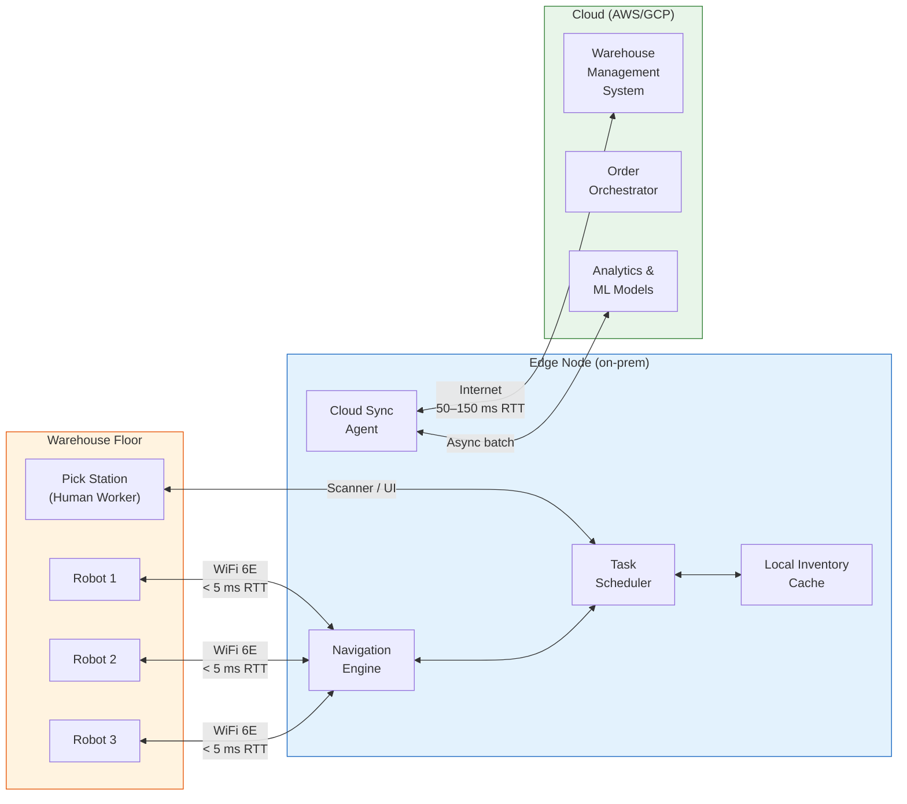
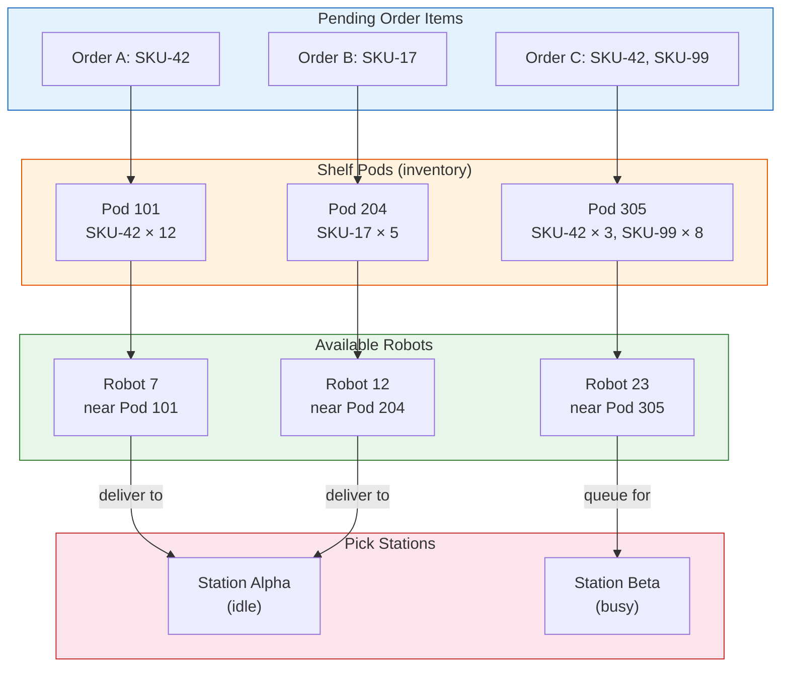
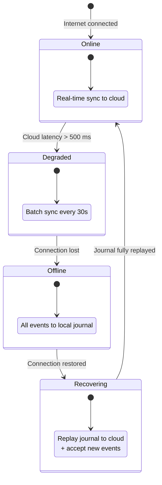
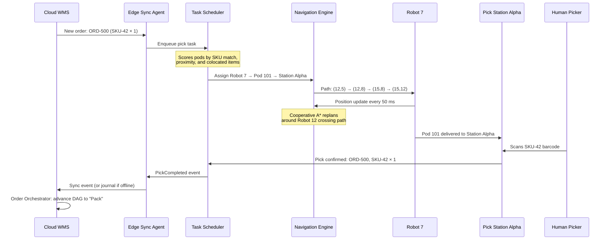

# Chapter 3: Warehouse Robotics and Edge Computing 🟡

> **The Problem:** A modern fulfillment warehouse runs hundreds of autonomous mobile robots (AMRs) that transport shelving pods to human pick stations. Each robot makes navigation decisions every 50 milliseconds — pathfinding, collision avoidance, and task reassignment. A round trip to the cloud takes 80–150 ms. By the time the cloud responds, the robot has already rolled 2 meters and collided with another bot. The cloud is too slow for real-time robotic control. But the warehouse management system in the cloud owns the source of truth: order queues, inventory positions, and shift schedules. We need an **Edge Computing** architecture where local nodes in the warehouse handle real-time robot control while syncing state back to the cloud asynchronously — and warehouse operations must continue even if the internet goes down entirely.

---

## 3.1 The Latency Wall: Why Robots Can't Wait for the Cloud

Consider the timing requirements for a warehouse AMR fleet:

| Decision | Latency budget | Why |
|---|---|---|
| Collision avoidance | < 20 ms | Robot travels ~0.5 m/s; 20 ms = 1 cm of drift |
| Path replanning (local obstacle) | < 50 ms | New shelf pod appeared in corridor |
| Task assignment (which pod to fetch) | < 200 ms | Idle robot should start moving within 200 ms |
| Inventory count update | 1–5 s | Not time-critical; can batch |
| Order priority recalculation | 5–30 s | Business logic, not real-time |
| Shift reporting / analytics | Minutes | Offline processing |

The first three decisions happen at frequencies that demand **on-premises compute** — an edge node physically located inside the warehouse, connected to robots over local WiFi 6E or 5G private networks with < 5 ms round-trip latency.



---

## 3.2 Edge Node Architecture

The edge node is a ruggedized server (or small cluster) deployed inside each warehouse. It runs a stripped-down version of the fulfillment stack focused on real-time operations.

### Hardware profile

| Component | Specification | Why |
|---|---|---|
| CPU | 32-core ARM or x86 (e.g., NVIDIA Jetson AGX Orin) | Path planning is CPU-heavy |
| RAM | 64 GB | In-memory grid map + task queue for 500 robots |
| Storage | 1 TB NVMe SSD | Local RocksDB for inventory + event journal |
| Network | Dual 10 GbE + WiFi 6E AP controller | Low-latency bot comms + cloud uplink |
| UPS | 4-hour battery backup | Must survive power outages |
| Redundancy | Active-passive pair with shared SSD | Edge node failure can't halt the warehouse |

### Software stack

```rust,ignore
use std::sync::Arc;
use tokio::sync::RwLock;

/// The edge runtime — all services share the same process for minimal IPC overhead.
pub struct EdgeRuntime {
    /// Real-time navigation engine (50 Hz control loop)
    pub navigation: Arc<NavigationEngine>,
    /// Task scheduler — assigns pods to robots and robots to pick stations
    pub scheduler: Arc<TaskScheduler>,
    /// Local inventory mirror — updated from cloud + local picks/puts
    pub inventory: Arc<RwLock<LocalInventoryCache>>,
    /// Bidirectional cloud sync agent
    pub cloud_sync: Arc<CloudSyncAgent>,
    /// Journal of all local events — replayed to cloud when connection restores
    pub event_journal: Arc<EventJournal>,
}
```

---

## 3.3 The Navigation Engine: Real-Time Pathfinding

The navigation engine runs a **control loop at 20 Hz** (50 ms per tick), processing position updates from every robot and issuing movement commands.

### The warehouse grid

The warehouse floor is discretized into a 2D occupancy grid. Each cell (50 cm × 50 cm) is either free, occupied by a shelf pod, occupied by a robot, or a permanent obstacle (wall, pillar, conveyor).

```rust,ignore
use std::collections::BinaryHeap;
use std::cmp::Reverse;

#[derive(Debug, Clone, Copy, PartialEq, Eq, Hash)]
pub struct GridPos {
    pub row: u16,
    pub col: u16,
}

#[derive(Debug, Clone, Copy, PartialEq)]
pub enum CellState {
    Free,
    ShelfPod { pod_id: u32 },
    Robot { robot_id: u32 },
    Obstacle,
    PickStation { station_id: u16 },
}

pub struct WarehouseGrid {
    pub rows: u16,
    pub cols: u16,
    /// Flattened 2D grid — cells[row * cols + col]
    pub cells: Vec<CellState>,
}

impl WarehouseGrid {
    pub fn get(&self, pos: GridPos) -> CellState {
        self.cells[pos.row as usize * self.cols as usize + pos.col as usize]
    }

    pub fn set(&mut self, pos: GridPos, state: CellState) {
        self.cells[pos.row as usize * self.cols as usize + pos.col as usize] = state;
    }

    /// A* pathfinding on the grid — returns ordered list of positions.
    pub fn find_path(&self, start: GridPos, goal: GridPos) -> Option<Vec<GridPos>> {
        let mut open_set = BinaryHeap::new();
        let mut came_from = std::collections::HashMap::new();
        let mut g_score = std::collections::HashMap::new();

        g_score.insert(start, 0u32);
        open_set.push(Reverse((self.heuristic(start, goal), start)));

        while let Some(Reverse((_, current))) = open_set.pop() {
            if current == goal {
                return Some(self.reconstruct_path(&came_from, current));
            }

            let current_g = g_score[&current];

            for neighbor in self.neighbors(current) {
                match self.get(neighbor) {
                    CellState::Free | CellState::PickStation { .. } => {}
                    _ => continue, // Can't traverse occupied cells
                }

                let tentative_g = current_g + 1;
                if tentative_g < *g_score.get(&neighbor).unwrap_or(&u32::MAX) {
                    came_from.insert(neighbor, current);
                    g_score.insert(neighbor, tentative_g);
                    let f = tentative_g + self.heuristic(neighbor, goal);
                    open_set.push(Reverse((f, neighbor)));
                }
            }
        }

        None // No path found
    }

    fn heuristic(&self, a: GridPos, b: GridPos) -> u32 {
        // Manhattan distance — admissible for 4-connected grid
        a.row.abs_diff(b.row) as u32 + a.col.abs_diff(b.col) as u32
    }

    fn neighbors(&self, pos: GridPos) -> Vec<GridPos> {
        let mut result = Vec::with_capacity(4);
        if pos.row > 0 {
            result.push(GridPos { row: pos.row - 1, col: pos.col });
        }
        if pos.row < self.rows - 1 {
            result.push(GridPos { row: pos.row + 1, col: pos.col });
        }
        if pos.col > 0 {
            result.push(GridPos { row: pos.row, col: pos.col - 1 });
        }
        if pos.col < self.cols - 1 {
            result.push(GridPos { row: pos.row, col: pos.col + 1 });
        }
        result
    }

    fn reconstruct_path(
        &self,
        came_from: &std::collections::HashMap<GridPos, GridPos>,
        mut current: GridPos,
    ) -> Vec<GridPos> {
        let mut path = vec![current];
        while let Some(&prev) = came_from.get(&current) {
            path.push(prev);
            current = prev;
        }
        path.reverse();
        path
    }
}
```

### Collision avoidance: Cooperative A*

With 200+ robots on the same floor, naïve A* isn't enough — robots will plan conflicting paths. We use **Cooperative A\*** (CA*), which plans in a time-space graph where each dimension is (x, y, t):

```rust,ignore
#[derive(Debug, Clone, Copy, PartialEq, Eq, Hash)]
pub struct SpaceTimePos {
    pub row: u16,
    pub col: u16,
    pub timestep: u32,
}

/// Reservation table — tracks which cells are claimed at which timesteps.
pub struct ReservationTable {
    /// (row, col, timestep) → robot_id
    reserved: std::collections::HashSet<SpaceTimePos>,
}

impl ReservationTable {
    pub fn is_reserved(&self, pos: SpaceTimePos) -> bool {
        self.reserved.contains(&pos)
    }

    pub fn reserve_path(&mut self, robot_id: u32, path: &[(GridPos, u32)]) {
        for &(pos, t) in path {
            self.reserved.insert(SpaceTimePos {
                row: pos.row,
                col: pos.col,
                timestep: t,
            });
        }
    }
}

impl NavigationEngine {
    /// Plans paths for all robots, ordered by priority.
    /// Higher-priority robots plan first; lower-priority robots
    /// route around the reserved cells.
    pub fn plan_all_paths(
        &self,
        robots: &mut [RobotState],
        grid: &WarehouseGrid,
    ) -> Vec<Vec<GridPos>> {
        let mut table = ReservationTable {
            reserved: std::collections::HashSet::new(),
        };

        // Sort by priority: robots carrying pods > idle robots
        robots.sort_by_key(|r| std::cmp::Reverse(r.priority()));

        let mut all_paths = Vec::new();
        for robot in robots.iter() {
            if let Some(goal) = robot.current_goal {
                let path = self.cooperative_a_star(
                    robot.position,
                    goal,
                    robot.id,
                    grid,
                    &table,
                );
                if let Some(ref p) = path {
                    let timed_path: Vec<(GridPos, u32)> = p
                        .iter()
                        .enumerate()
                        .map(|(t, &pos)| (pos, t as u32))
                        .collect();
                    table.reserve_path(robot.id, &timed_path);
                }
                all_paths.push(path.unwrap_or_default());
            } else {
                all_paths.push(vec![]);
            }
        }

        all_paths
    }

    fn cooperative_a_star(
        &self,
        start: GridPos,
        goal: GridPos,
        _robot_id: u32,
        grid: &WarehouseGrid,
        reservations: &ReservationTable,
    ) -> Option<Vec<GridPos>> {
        // Similar to A* but checks reservation table at each (pos, timestep)
        // A node is only expandable if the cell is free AND not reserved
        // at that timestep. The robot can also "wait" (stay in place for
        // one timestep) if the next cell is temporarily blocked.
        grid.find_path(start, goal) // Simplified — full CA* adds time dimension
    }
}

pub struct RobotState {
    pub id: u32,
    pub position: GridPos,
    pub current_goal: Option<GridPos>,
    pub carrying_pod: Option<u32>,
    pub battery_pct: f32,
}

impl RobotState {
    fn priority(&self) -> u8 {
        if self.carrying_pod.is_some() { 2 } else { 1 }
    }
}
```

### Navigation engine performance budget

| Operation | Target | Actual (200 robots, 1000×500 grid) |
|---|---|---|
| Single A* pathfind | < 2 ms | ~0.8 ms |
| Cooperative A* (full fleet) | < 40 ms | ~25 ms |
| Collision detection check | < 0.1 ms | ~0.05 ms |
| Grid state update | < 0.5 ms | ~0.2 ms |
| **Total control loop** | **< 50 ms** | **~30 ms** |

---

## 3.4 The Task Scheduler: Assigning Pods to Robots

The task scheduler decides **which shelf pod** each robot should fetch and which **pick station** to deliver it to. This is a bipartite matching problem — matching pending order items to shelf pods and then pods to available robots.



```rust,ignore
use std::collections::BinaryHeap;

pub struct TaskScheduler {
    /// Queue of pending tasks scored by priority and proximity
    task_queue: BinaryHeap<ScoredTask>,
    /// Current robot states
    robots: Vec<RobotState>,
    /// Pod-to-location mapping
    pod_locations: std::collections::HashMap<u32, GridPos>,
    /// Pick station states
    stations: Vec<StationState>,
}

#[derive(Debug, Clone)]
pub struct ScoredTask {
    pub score: i64,
    pub pod_id: u32,
    pub target_station: u16,
    pub order_items: Vec<(String, u32)>, // (sku_id, quantity)
}

impl PartialEq for ScoredTask {
    fn eq(&self, other: &Self) -> bool {
        self.score == other.score
    }
}
impl Eq for ScoredTask {}
impl PartialOrd for ScoredTask {
    fn partial_cmp(&self, other: &Self) -> Option<std::cmp::Ordering> {
        Some(self.cmp(other))
    }
}
impl Ord for ScoredTask {
    fn cmp(&self, other: &Self) -> std::cmp::Ordering {
        self.score.cmp(&other.score)
    }
}

pub struct StationState {
    pub station_id: u16,
    pub position: GridPos,
    pub queue_depth: u8,   // Pods waiting to be presented
    pub max_queue: u8,     // Typically 3-5
}

impl TaskScheduler {
    /// Assigns the best available robot to the highest-priority task.
    pub fn assign_next(&mut self, grid: &WarehouseGrid) -> Option<Assignment> {
        let task = self.task_queue.peek()?;

        // Find the station with the shortest queue
        let best_station = self.stations.iter()
            .filter(|s| s.queue_depth < s.max_queue)
            .min_by_key(|s| s.queue_depth)?;

        // Find the closest idle robot to the pod
        let pod_pos = self.pod_locations.get(&task.pod_id)?;
        let best_robot = self.robots.iter()
            .filter(|r| r.carrying_pod.is_none() && r.battery_pct > 15.0)
            .min_by_key(|r| {
                manhattan_distance(r.position, *pod_pos)
            })?;

        let task = self.task_queue.pop().unwrap();

        Some(Assignment {
            robot_id: best_robot.id,
            pod_id: task.pod_id,
            pickup_pos: *pod_pos,
            delivery_station: best_station.station_id,
            delivery_pos: best_station.position,
        })
    }
}

fn manhattan_distance(a: GridPos, b: GridPos) -> u32 {
    a.row.abs_diff(b.row) as u32 + a.col.abs_diff(b.col) as u32
}

pub struct Assignment {
    pub robot_id: u32,
    pub pod_id: u32,
    pub pickup_pos: GridPos,
    pub delivery_station: u16,
    pub delivery_pos: GridPos,
}
```

### Pod selection scoring

The scheduler scores each candidate pod by combining multiple factors:

| Factor | Weight | Rationale |
|---|---|---|
| Order priority (SLA urgency) | 40% | Same-day orders go first |
| Pod co-location (multiple SKUs on one pod) | 25% | Reduces total robot trips |
| Robot proximity to pod | 20% | Shorter travel = higher throughput |
| Station queue balance | 15% | Even out work across stations |

---

## 3.5 Offline Resilience: The Event Journal

The most critical requirement: **the warehouse must keep operating if the internet goes down**. Orders arriving before the outage must continue being picked and packed. The edge node uses an **Event Journal** — a local, append-only log of all warehouse events that replays to the cloud once connectivity restores.



### The event journal implementation

```rust,ignore
use std::fs::{File, OpenOptions};
use std::io::{BufWriter, Write, BufRead, BufReader};
use std::path::PathBuf;
use chrono::{DateTime, Utc};
use serde::{Deserialize, Serialize};

#[derive(Debug, Clone, Serialize, Deserialize)]
pub struct WarehouseEvent {
    pub event_id: uuid::Uuid,
    pub timestamp: DateTime<Utc>,
    pub event_type: WarehouseEventType,
    /// True if this event has been successfully synced to cloud
    pub synced: bool,
}

#[derive(Debug, Clone, Serialize, Deserialize)]
pub enum WarehouseEventType {
    PickCompleted {
        order_id: String,
        sku_id: String,
        quantity: u32,
        bin_location: String,
        picker_id: String,
    },
    PackCompleted {
        order_id: String,
        box_dimensions: (f32, f32, f32),
        weight_kg: f32,
    },
    RobotTaskCompleted {
        robot_id: u32,
        pod_id: u32,
        task_type: String,
        duration_ms: u64,
    },
    InventoryAdjustment {
        sku_id: String,
        bin_location: String,
        delta: i32,
        reason: String,
    },
    RobotBatteryLow {
        robot_id: u32,
        battery_pct: f32,
    },
}

pub struct EventJournal {
    /// Append-only file on local NVMe
    writer: BufWriter<File>,
    /// Path to the journal directory
    journal_dir: PathBuf,
    /// Current segment number (rolls over every 100MB)
    segment: u64,
    /// Number of unsynced events
    unsynced_count: u64,
}

impl EventJournal {
    pub fn new(journal_dir: PathBuf) -> std::io::Result<Self> {
        std::fs::create_dir_all(&journal_dir)?;
        let segment = 0;
        let path = journal_dir.join(format!("segment-{:06}.journal", segment));
        let file = OpenOptions::new().create(true).append(true).open(&path)?;
        Ok(Self {
            writer: BufWriter::new(file),
            journal_dir,
            segment,
            unsynced_count: 0,
        })
    }

    /// Append an event to the local journal. Returns immediately.
    pub fn append(&mut self, event: &WarehouseEvent) -> std::io::Result<()> {
        let line = serde_json::to_string(event)
            .map_err(|e| std::io::Error::new(std::io::ErrorKind::Other, e))?;
        writeln!(self.writer, "{}", line)?;
        self.writer.flush()?; // fsync for durability
        self.unsynced_count += 1;
        Ok(())
    }

    /// Read all unsynced events for replay to cloud.
    pub fn unsynced_events(&self) -> std::io::Result<Vec<WarehouseEvent>> {
        let mut events = Vec::new();
        for seg in 0..=self.segment {
            let path = self.journal_dir.join(format!("segment-{:06}.journal", seg));
            if !path.exists() {
                continue;
            }
            let reader = BufReader::new(File::open(&path)?);
            for line in reader.lines() {
                let line = line?;
                if let Ok(event) = serde_json::from_str::<WarehouseEvent>(&line) {
                    if !event.synced {
                        events.push(event);
                    }
                }
            }
        }
        Ok(events)
    }
}
```

---

## 3.6 Cloud Sync Agent: Bidirectional Replication

The sync agent handles two directions of data flow:

| Direction | Data | Frequency | Priority |
|---|---|---|---|
| **Cloud → Edge** | New orders, priority changes, inventory corrections | Real-time (push) or 30s poll | High |
| **Edge → Cloud** | Pick confirmations, pack completions, robot telemetry | Real-time or journal replay | Critical |

```rust,ignore
use tokio::time::{interval, Duration};

pub struct CloudSyncAgent {
    cloud_client: CloudApiClient,
    journal: Arc<tokio::sync::Mutex<EventJournal>>,
    local_inventory: Arc<tokio::sync::RwLock<LocalInventoryCache>>,
    connection_state: std::sync::atomic::AtomicU8,
}

#[repr(u8)]
enum ConnState {
    Online = 0,
    Degraded = 1,
    Offline = 2,
    Recovering = 3,
}

impl CloudSyncAgent {
    pub async fn run(&self) {
        let mut sync_interval = interval(Duration::from_secs(5));
        let mut health_interval = interval(Duration::from_secs(10));

        loop {
            tokio::select! {
                _ = sync_interval.tick() => {
                    self.sync_to_cloud().await;
                }
                _ = health_interval.tick() => {
                    self.check_connection_health().await;
                }
            }
        }
    }

    async fn sync_to_cloud(&self) {
        let state = self.connection_state.load(
            std::sync::atomic::Ordering::Relaxed
        );

        match state {
            0 => {
                // Online — sync in real-time
                let journal = self.journal.lock().await;
                if let Ok(events) = journal.unsynced_events() {
                    for batch in events.chunks(100) {
                        if self.cloud_client.send_events(batch).await.is_err() {
                            self.transition_to_degraded();
                            break;
                        }
                    }
                }
            }
            1 => {
                // Degraded — batch sync with larger chunks
                let journal = self.journal.lock().await;
                if let Ok(events) = journal.unsynced_events() {
                    if self.cloud_client.send_events(&events).await.is_err() {
                        self.transition_to_offline();
                    }
                }
            }
            2 => {
                // Offline — do nothing, events accumulate in journal
            }
            3 => {
                // Recovering — replay journal in order
                self.replay_journal().await;
            }
            _ => {}
        }
    }

    async fn replay_journal(&self) {
        let journal = self.journal.lock().await;
        match journal.unsynced_events() {
            Ok(events) => {
                tracing::info!(
                    count = events.len(),
                    "Replaying journal events to cloud"
                );
                for batch in events.chunks(500) {
                    if self.cloud_client.send_events(batch).await.is_err() {
                        tracing::warn!("Replay interrupted — will retry");
                        return; // Will retry on next tick
                    }
                }
                // All caught up
                self.connection_state.store(
                    0, // Online
                    std::sync::atomic::Ordering::Relaxed,
                );
                tracing::info!("Journal replay complete — back online");
            }
            Err(e) => {
                tracing::error!("Failed to read journal: {}", e);
            }
        }
    }

    async fn check_connection_health(&self) {
        match self.cloud_client.health_check().await {
            Ok(latency_ms) if latency_ms < 200 => {
                let prev = self.connection_state.load(
                    std::sync::atomic::Ordering::Relaxed
                );
                if prev == 2 {
                    // Was offline, now connected — enter recovery
                    self.connection_state.store(
                        3, // Recovering
                        std::sync::atomic::Ordering::Relaxed,
                    );
                } else if prev != 3 {
                    self.connection_state.store(
                        0, // Online
                        std::sync::atomic::Ordering::Relaxed,
                    );
                }
            }
            Ok(_) => self.transition_to_degraded(),
            Err(_) => self.transition_to_offline(),
        }
    }

    fn transition_to_degraded(&self) {
        self.connection_state.store(
            1, std::sync::atomic::Ordering::Relaxed,
        );
        tracing::warn!("Cloud connection degraded — switching to batch sync");
    }

    fn transition_to_offline(&self) {
        self.connection_state.store(
            2, std::sync::atomic::Ordering::Relaxed,
        );
        tracing::error!("Cloud connection lost — operating in offline mode");
    }
}

/// Placeholder for the actual cloud API client
pub struct CloudApiClient;

impl CloudApiClient {
    pub async fn send_events(&self, _events: &[WarehouseEvent]) -> Result<(), String> {
        Ok(()) // HTTP POST to cloud WMS
    }
    pub async fn health_check(&self) -> Result<u64, String> {
        Ok(50) // latency in ms
    }
}
```

---

## 3.7 Conflict Resolution: What Happens When the Journal Replays

After an offline period, the edge journal may contain events that conflict with cloud state updates received during recovery. For example:

| Edge event (during offline) | Cloud event (same time) | Conflict |
|---|---|---|
| Pick SKU-42 for order ORD-100 | ORD-100 cancelled by customer | Picked an item for a cancelled order |
| Inventory count: 50 units of SKU-99 | Cloud received new shipment: +200 units | No conflict — additive |
| Robot 7 completed task T-500 | Cloud reassigned T-500 to robot 12 | Duplicate completion |

### Resolution strategy: Event timestamps + idempotency

```rust,ignore
pub struct ConflictResolver {
    /// Cloud's authoritative event stream
    cloud_events: Vec<CloudEvent>,
}

#[derive(Debug)]
pub enum Resolution {
    /// Accept the edge event — no conflict
    Accept,
    /// Merge: apply both events (additive)
    Merge,
    /// Compensate: edge event needs to be undone
    Compensate { compensation: WarehouseEventType },
    /// Discard: edge event is a duplicate
    Discard,
}

impl ConflictResolver {
    pub fn resolve(
        &self,
        edge_event: &WarehouseEvent,
        cloud_state: &CloudState,
    ) -> Resolution {
        match &edge_event.event_type {
            WarehouseEventType::PickCompleted { order_id, sku_id, quantity, .. } => {
                if cloud_state.is_order_cancelled(order_id) {
                    // Order was cancelled while warehouse was offline
                    Resolution::Compensate {
                        compensation: WarehouseEventType::InventoryAdjustment {
                            sku_id: sku_id.clone(),
                            bin_location: String::new(),
                            delta: *quantity as i32, // Put it back
                            reason: format!(
                                "Order {} cancelled during offline period",
                                order_id
                            ),
                        },
                    }
                } else {
                    Resolution::Accept
                }
            }
            WarehouseEventType::RobotTaskCompleted { robot_id, .. } => {
                if cloud_state.is_task_already_completed(edge_event.event_id) {
                    Resolution::Discard
                } else {
                    Resolution::Accept
                }
            }
            WarehouseEventType::InventoryAdjustment { .. } => {
                // Inventory adjustments are always additive
                Resolution::Merge
            }
            _ => Resolution::Accept,
        }
    }
}

/// Placeholder
pub struct CloudState;
pub struct CloudEvent;
impl CloudState {
    pub fn is_order_cancelled(&self, _id: &str) -> bool { false }
    pub fn is_task_already_completed(&self, _id: uuid::Uuid) -> bool { false }
}
```

---

## 3.8 Robot Fleet Telemetry and Monitoring

Each robot reports telemetry to the edge node every 500 ms. The edge aggregates this locally and forwards summaries to the cloud.

```rust,ignore
use std::collections::HashMap;

#[derive(Debug, Clone, Serialize, Deserialize)]
pub struct RobotTelemetry {
    pub robot_id: u32,
    pub timestamp: DateTime<Utc>,
    pub position: GridPos,
    pub velocity_mps: f32,
    pub battery_pct: f32,
    pub carrying_pod: Option<u32>,
    pub motor_temps_c: [f32; 4],
    pub wifi_rssi_dbm: i8,
    pub error_codes: Vec<u16>,
}

pub struct FleetMonitor {
    latest: HashMap<u32, RobotTelemetry>,
}

impl FleetMonitor {
    pub fn ingest(&mut self, telemetry: RobotTelemetry) {
        // Check for critical conditions
        if telemetry.battery_pct < 10.0 {
            tracing::warn!(
                robot_id = telemetry.robot_id,
                battery = telemetry.battery_pct,
                "Robot battery critically low — routing to charger"
            );
        }

        if telemetry.motor_temps_c.iter().any(|&t| t > 80.0) {
            tracing::error!(
                robot_id = telemetry.robot_id,
                temps = ?telemetry.motor_temps_c,
                "Motor overheating — halting robot"
            );
        }

        if !telemetry.error_codes.is_empty() {
            tracing::warn!(
                robot_id = telemetry.robot_id,
                errors = ?telemetry.error_codes,
                "Robot reporting errors"
            );
        }

        self.latest.insert(telemetry.robot_id, telemetry);
    }

    /// Fleet summary for cloud reporting (sent every 30s)
    pub fn fleet_summary(&self) -> FleetSummary {
        let robots: Vec<&RobotTelemetry> = self.latest.values().collect();
        FleetSummary {
            total_robots: robots.len() as u32,
            active: robots.iter().filter(|r| r.velocity_mps > 0.01).count() as u32,
            idle: robots.iter().filter(|r| {
                r.velocity_mps <= 0.01 && r.carrying_pod.is_none()
            }).count() as u32,
            charging: robots.iter().filter(|r| r.battery_pct < 20.0).count() as u32,
            errored: robots.iter().filter(|r| !r.error_codes.is_empty()).count() as u32,
            avg_battery_pct: robots.iter().map(|r| r.battery_pct).sum::<f32>()
                / robots.len().max(1) as f32,
        }
    }
}

#[derive(Debug, Serialize)]
pub struct FleetSummary {
    pub total_robots: u32,
    pub active: u32,
    pub idle: u32,
    pub charging: u32,
    pub errored: u32,
    pub avg_battery_pct: f32,
}
```

---

## 3.9 End-to-End Pick Flow: Putting It All Together



---

## 3.10 Operational Metrics

| Metric | Target | Alert |
|---|---|---|
| Robot utilization rate | > 80% | < 60% |
| Navigation loop frequency | 20 Hz (50 ms) | < 15 Hz |
| Pick station idle time | < 10% | > 25% |
| Average picks per hour per station | > 300 | < 200 |
| Cloud sync lag (online mode) | < 5 s | > 30 s |
| Journal depth (offline mode) | Informational | > 100K events |
| Robot collision events | 0 per day | > 0 |
| Battery-related robot downtime | < 5% fleet | > 15% |

---

## 3.11 Exercises

### Exercise 1: Implement a Battery-Aware Scheduler

<details>
<summary>Problem Statement</summary>

Extend the `TaskScheduler` to factor in robot battery level. If a robot's battery is below 20%, it should not be assigned new tasks and instead should be routed to the nearest charging station. Add a `charging_stations: Vec<GridPos>` field and modify the assignment logic.

</details>

<details>
<summary>Hint</summary>

Add a pre-pass that filters robots into "available" and "needs charging" groups. Route charging robots to their nearest charger using `manhattan_distance`. Only assign tasks from the available pool.

</details>

### Exercise 2: Implement Journal Segment Rotation

<details>
<summary>Problem Statement</summary>

Extend `EventJournal` to rotate to a new segment file when the current segment exceeds 100 MB. Implement garbage collection that deletes fully-synced segments older than 7 days.

</details>

---

> **Key Takeaways**
>
> 1. **Edge computing is mandatory for warehouse robotics.** Sub-50ms control loops cannot tolerate cloud round-trips. The edge node runs pathfinding, collision avoidance, and task scheduling locally.
> 2. **Cooperative A\*** solves multi-robot pathfinding by planning in a space-time graph with a reservation table, preventing collisions at the planning layer rather than reacting to them.
> 3. **The Event Journal** is the offline resilience mechanism. All warehouse events are appended locally and replayed to the cloud on reconnection, ensuring zero data loss even during prolonged outages.
> 4. **Connection state machine** (Online → Degraded → Offline → Recovering → Online) governs sync behavior, progressively reducing sync frequency as connectivity degrades.
> 5. **Conflict resolution** on journal replay handles the gap between edge-local decisions and cloud-authoritative state using timestamps, idempotency keys, and compensation events.
> 6. The architecture **separates concerns by latency tier**: real-time control (edge, < 50 ms), operational sync (seconds), and analytics/planning (cloud, minutes).
