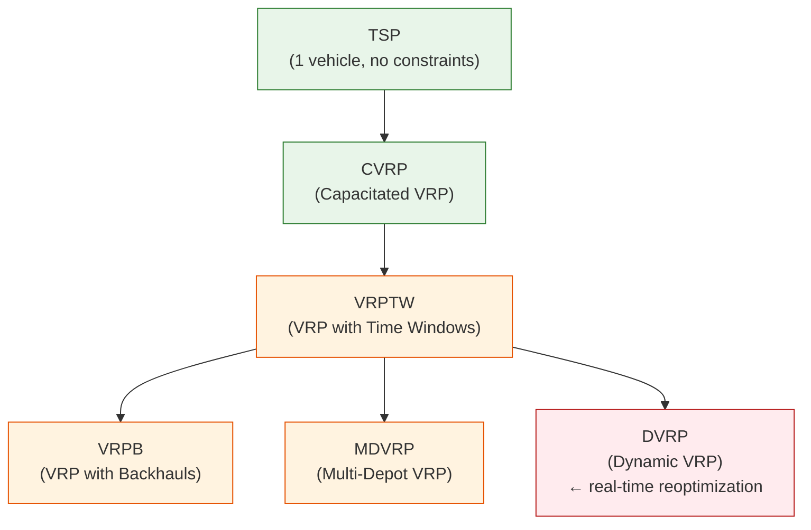
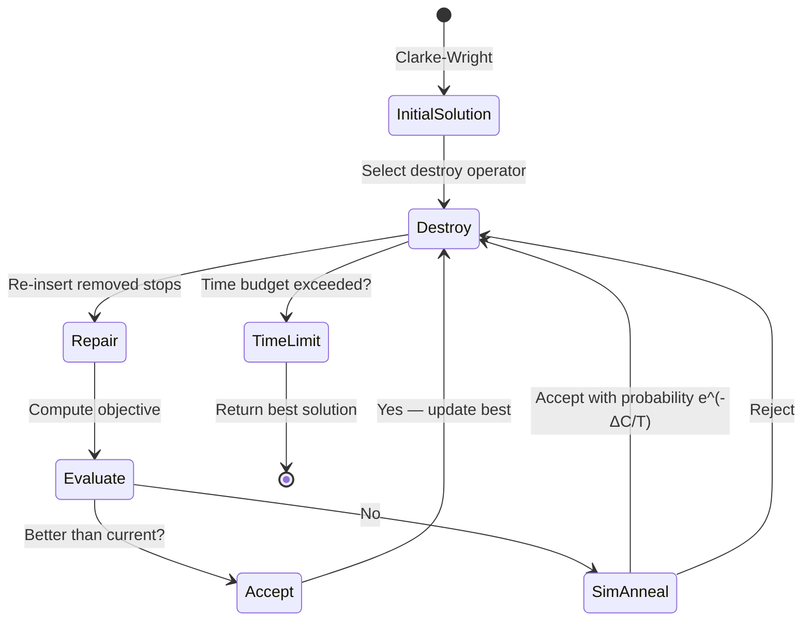
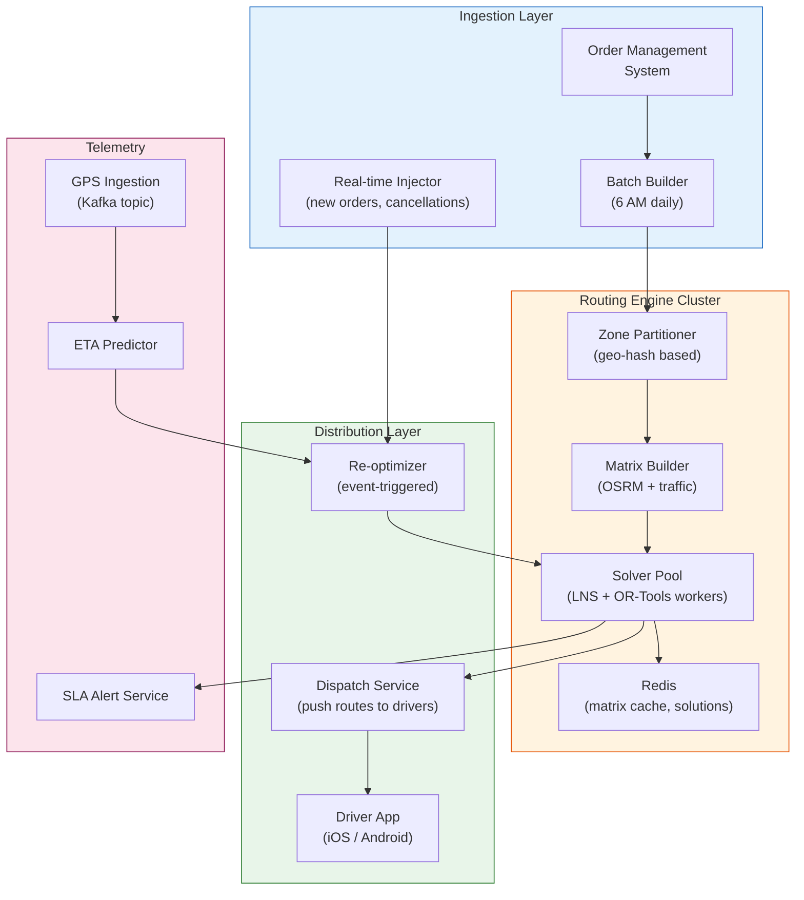
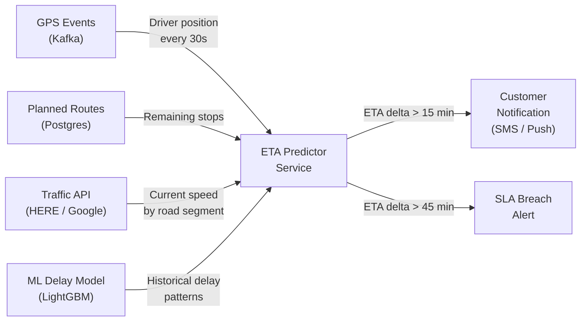
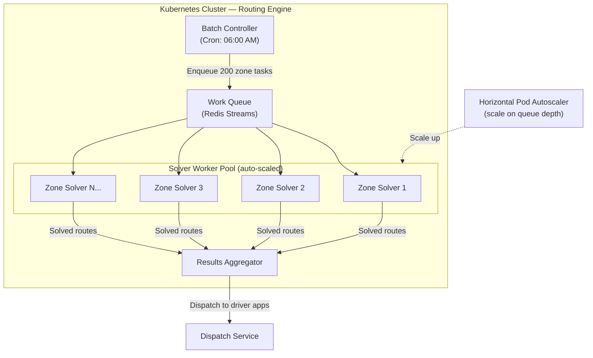

# Chapter 4: The Last-Mile Routing Algorithm (VRP) 🔴

> **The Problem:** You have 10,000 delivery drivers fanning out across a metropolitan area each morning. Each driver's van has a capacity of 150 packages. Each package has a customer-promised delivery window of one, two, or four hours. Traffic is changing minute by minute. A package that misses its window triggers a customer refund. Fuel is expensive. Driver overtime costs twice the base rate. The naive solution — assign deliveries geographically then sort by address — wastes 20–35% of driving distance and causes 15% of time-window failures. The correct solution is the **Vehicle Routing Problem (VRP)**: a combinatorial optimization problem proven to be NP-hard. You cannot solve it exactly for 10,000 drivers. You solve it well enough, fast enough, using heuristics, metaheuristics, and modern constraint programming solvers like **Google OR-Tools** — and you re-solve it in real time as traffic events arrive.

---

## 4.1 Why Routing is NP-Hard: The Travelling Salesman Foundation

The Travelling Salesman Problem (TSP) asks: given _N_ cities, find the shortest route that visits all of them exactly once and returns to the start. The number of possible routes is _(N-1)! / 2_. For just 20 stops, that is over 60 trillion routes.

| Cities (N) | Possible routes | Brute-force time at 10⁹/s |
|---|---|---|
| 10 | 181,440 | < 1 ms |
| 15 | 43 billion | ~43 seconds |
| 20 | 60 trillion | ~694 days |
| 30 | 4.4 × 10³⁰ | Heat death of universe |
| 150 (1 van) | Astronomically large | Never |

The VRP extends TSP in the ways that make e-commerce delivery hard:

* **Multiple vehicles** with individual capacity constraints
* **Time windows** — each stop has an earliest and latest arrival time
* **Depot** — routes start and end at a warehouse hub
* **Heterogeneous fleet** — cargo vans, motorcycles, electric bikes
* **Traffic-dependent travel times** — the same road takes 4 minutes at 8 AM and 18 minutes at 8:30 AM
* **Driver breaks** — regulations mandate a 30-minute break after 4.5 hours



---

## 4.2 Defining the Problem: Data Model

Before we optimize, we formalize. The VRP solver consumes a structured problem instance:

```rust
use std::collections::HashMap;

/// A delivery stop to be assigned to a vehicle.
#[derive(Debug, Clone)]
pub struct DeliveryStop {
    pub id: u64,
    pub lat: f64,
    pub lon: f64,
    /// Package weight in kg
    pub demand_kg: f32,
    /// Package volume in litres
    pub demand_l: f32,
    /// Earliest arrival (seconds from route start)
    pub time_window_open: u32,
    /// Latest arrival — miss this and trigger SLA breach
    pub time_window_close: u32,
    /// Expected service time at the door (seconds)
    pub service_time_s: u32,
    pub priority: DeliveryPriority,
}

#[derive(Debug, Clone, PartialEq, Eq)]
pub enum DeliveryPriority {
    /// Same-day premium — maximum penalty for late delivery
    SameDay,
    /// Next-day standard
    Standard,
    /// Economy — flexible window
    Economy,
}

/// A delivery vehicle.
#[derive(Debug, Clone)]
pub struct Vehicle {
    pub id: u64,
    pub depot_lat: f64,
    pub depot_lon: f64,
    pub max_weight_kg: f32,
    pub max_volume_l: f32,
    pub max_stops: u16,
    pub shift_end_s: u32,
}

/// Pre-computed travel time matrix (seconds) between all locations.
/// Indexed as matrix[from_idx][to_idx].
pub struct TravelTimeMatrix {
    pub indices: HashMap<u64, usize>,
    pub data: Vec<Vec<u32>>,
}

impl TravelTimeMatrix {
    pub fn travel_time(&self, from: u64, to: u64) -> u32 {
        let i = self.indices[&from];
        let j = self.indices[&to];
        self.data[i][j]
    }
}

/// The complete VRP problem instance.
pub struct VrpInstance {
    pub vehicles: Vec<Vehicle>,
    pub stops: Vec<DeliveryStop>,
    pub matrix: TravelTimeMatrix,
    /// Cost per second of driver time (dollars)
    pub driver_cost_per_s: f64,
    /// Cost per meter of driving (fuel + depreciation)
    pub fuel_cost_per_m: f64,
    /// Penalty per second a delivery is late
    pub late_penalty_per_s: f64,
}
```

The **objective function** to minimize:

$$\text{Total Cost} = \sum_{v} \left( C_{\text{driver}} \cdot T_v + C_{\text{fuel}} \cdot D_v \right) + \sum_{s \in \text{late}} C_{\text{penalty}} \cdot \max(0, t_s^{\text{arrival}} - t_s^{\text{window\_close}})$$

---

## 4.3 Travel Time Matrix: The Foundation of All Optimization

The solver needs to know how long it takes to drive between every pair of locations. With 1,500 stops per routing zone, the matrix is 1,500 × 1,500 = 2.25 million values. You cannot query a routing API 2.25 million times per solve.

### Strategy 1: OSRM (Open Source Routing Machine)

Run a self-hosted OSRM instance on the road network for the metro. Call its `/table` endpoint once with all coordinates:

```bash
# OSRM table service — returns N×N matrix in ~200ms for N=1500
curl "http://osrm-internal:5000/table/v1/driving/\
  -73.99,40.75;-74.01,40.72;-73.98,40.78?annotations=duration"
```

### Strategy 2: Traffic-Adjusted Times from HERE/Google Maps

Real-time traffic data adjusts the matrix every 15 minutes during peak hours. Cache the matrix per routing zone in Redis with a 15-minute TTL:

```rust
pub struct MatrixCache {
    redis: redis::aio::ConnectionManager,
}

impl MatrixCache {
    const TTL_SECS: u64 = 900; // 15 minutes

    pub async fn get_or_compute(
        &self,
        zone_id: &str,
        stops: &[DeliveryStop],
    ) -> anyhow::Result<TravelTimeMatrix> {
        let key = format!("vrp:matrix:{zone_id}");
        
        if let Some(cached) = self.redis.get::<_, Option<Vec<u8>>>(&key).await? {
            return Ok(bincode::deserialize(&cached)?);
        }

        let matrix = self.compute_from_osrm(stops).await?;
        let encoded = bincode::serialize(&matrix)?;
        
        self.redis
            .set_ex(&key, encoded, Self::TTL_SECS)
            .await?;
        
        Ok(matrix)
    }

    async fn compute_from_osrm(&self, stops: &[DeliveryStop]) -> anyhow::Result<TravelTimeMatrix> {
        // Build coordinate string and call OSRM /table endpoint
        let coords: String = stops
            .iter()
            .map(|s| format!("{},{}", s.lon, s.lat))
            .collect::<Vec<_>>()
            .join(";");
        
        // Parse response and build matrix...
        todo!("parse OSRM JSON response into TravelTimeMatrix")
    }
}
```

---

## 4.4 Heuristic Phase 1: Clarke-Wright Savings Algorithm

Before running the heavy solver, we use the **Clarke-Wright Savings Algorithm** to generate an initial feasible solution in O(N² log N) time. The intuition: instead of sending every driver individually to one stop and back to depot, find pairs of stops where merging routes saves distance.

The **savings value** for combining stops _i_ and _j_ into one route is:

$$S_{ij} = d_{0i} + d_{0j} - d_{ij}$$

where _d₀ᵢ_ is the depot-to-stop distance and _d_{ij}_ is the stop-to-stop distance.

```rust
/// Generates an initial VRP solution using the Clarke-Wright Savings algorithm.
pub fn clarke_wright_savings(instance: &VrpInstance) -> Vec<Route> {
    let depot_id = 0u64; // sentinel for depot
    let stops = &instance.stops;
    let matrix = &instance.matrix;

    // Step 1: Compute all savings values S(i,j) = d(0,i) + d(0,j) - d(i,j)
    let mut savings: Vec<(f64, usize, usize)> = Vec::new();
    for i in 0..stops.len() {
        for j in (i + 1)..stops.len() {
            let d0i = matrix.travel_time(depot_id, stops[i].id) as f64;
            let d0j = matrix.travel_time(depot_id, stops[j].id) as f64;
            let dij = matrix.travel_time(stops[i].id, stops[j].id) as f64;
            let s = d0i + d0j - dij;
            savings.push((s, i, j));
        }
    }

    // Step 2: Sort savings descending
    savings.sort_unstable_by(|a, b| b.0.partial_cmp(&a.0).unwrap());

    // Step 3: Greedily merge routes if constraints allow
    // Each stop starts as its own route: depot -> stop -> depot
    let mut routes: Vec<Route> = stops
        .iter()
        .map(|s| Route::single_stop(s.clone(), instance))
        .collect();
    let mut stop_to_route: Vec<usize> = (0..stops.len()).collect();

    for (_, i, j) in savings {
        let ri = stop_to_route[i];
        let rj = stop_to_route[j];

        if ri == rj {
            continue; // Already on same route
        }

        // Attempt merge: check capacity and time-window feasibility
        if let Some(merged) = routes[ri].try_merge(&routes[rj], instance) {
            let new_idx = routes.len();
            // Update stop-to-route mapping for all stops in rj
            for &stop_idx in routes[rj].stop_indices() {
                stop_to_route[stop_idx] = new_idx;
            }
            for &stop_idx in routes[ri].stop_indices() {
                stop_to_route[stop_idx] = new_idx;
            }
            routes.push(merged);
        }
    }

    // Collect non-empty, non-superseded routes
    routes.into_iter().filter(|r| r.is_active()).collect()
}
```

Clarke-Wright typically achieves within **10–20%** of optimal for unconstrained instances. With tight time windows, quality degrades — this is why we use it as a *starting point*, not the final answer.

---

## 4.5 Metaheuristic Phase 2: Large Neighbourhood Search (LNS)

**Large Neighbourhood Search** improves the initial solution by repeatedly destroying part of it and rebuilding it. The key insight: a random subset of stops, removed and re-inserted optimally, can escape local optima that simple 2-opt swaps cannot.



```rust
use rand::Rng;

pub struct LnsConfig {
    /// Maximum wall-clock time to spend optimizing
    pub time_budget_ms: u64,
    /// Number of stops to remove per iteration (fraction of total)
    pub destroy_fraction: f64,
    /// Initial temperature for simulated annealing acceptance
    pub initial_temp: f64,
    /// Cooling rate per iteration
    pub cooling_rate: f64,
}

pub fn large_neighbourhood_search(
    initial: Vec<Route>,
    instance: &VrpInstance,
    config: &LnsConfig,
) -> Vec<Route> {
    let mut rng = rand::thread_rng();
    let mut current = initial.clone();
    let mut best = initial;
    let mut current_cost = total_cost(&current, instance);
    let mut best_cost = current_cost;
    let mut temperature = config.initial_temp;

    let deadline = std::time::Instant::now()
        + std::time::Duration::from_millis(config.time_budget_ms);

    while std::time::Instant::now() < deadline {
        // --- Destroy Phase ---
        let n_remove = ((instance.stops.len() as f64) * config.destroy_fraction) as usize;
        let n_remove = n_remove.max(3).min(50);

        // Randomly pick a destroy operator
        let (destroyed, removed_stops) = match rng.gen_range(0..3) {
            0 => destroy_random(&current, n_remove, &mut rng),
            1 => destroy_worst(&current, n_remove, instance),
            _ => destroy_related(&current, n_remove, instance, &mut rng),
        };

        // --- Repair Phase: Regret-2 insertion ---
        let repaired = regret_insertion(destroyed, removed_stops, instance);
        let repaired_cost = total_cost(&repaired, instance);

        // --- Acceptance Criterion (Simulated Annealing) ---
        let delta = repaired_cost - current_cost;
        let accept = delta < 0.0
            || rng.gen::<f64>() < (-delta / temperature).exp();

        if accept {
            current_cost = repaired_cost;
            current = repaired;

            if current_cost < best_cost {
                best_cost = current_cost;
                best = current.clone();
            }
        }

        temperature *= config.cooling_rate;
    }

    tracing::info!(
        best_cost = best_cost,
        "LNS complete"
    );
    best
}

/// Remove the N stops that individually contribute the most cost.
fn destroy_worst(
    routes: &[Route],
    n: usize,
    instance: &VrpInstance,
) -> (Vec<Route>, Vec<DeliveryStop>) {
    // Compute marginal cost of each stop, sort descending, remove top N
    todo!()
}

/// Remove N stops that are geographically or temporally related,
/// so reinserting them together is more likely to improve the solution.
fn destroy_related(
    routes: &[Route],
    n: usize,
    instance: &VrpInstance,
    rng: &mut impl Rng,
) -> (Vec<Route>, Vec<DeliveryStop>) {
    // Pick a random seed stop, then remove N nearest neighbours
    todo!()
}
```

---

## 4.6 Google OR-Tools: Constraint Programming for Exactness

For zones with fewer than 500 stops (e.g., rural routes), we invoke Google OR-Tools' CP-SAT or routing solver for a tighter optimum. OR-Tools can typically find near-optimal solutions for ~200-stop problems in under 10 seconds.

```python
# Python — OR-Tools VRP with time windows
from ortools.constraint_solver import routing_enums_pb2
from ortools.constraint_solver import pywrapcp

def solve_vrp(data: dict) -> dict:
    """
    data keys: distance_matrix, time_matrix, time_windows,
               vehicle_capacities, demands, num_vehicles, depot
    """
    manager = pywrapcp.RoutingIndexManager(
        len(data["time_matrix"]),
        data["num_vehicles"],
        data["depot"],
    )
    routing = pywrapcp.RoutingModel(manager)

    # --- Travel time callback ---
    def time_callback(from_index, to_index):
        from_node = manager.IndexToNode(from_index)
        to_node = manager.IndexToNode(to_index)
        return data["time_matrix"][from_node][to_node]

    transit_cb_idx = routing.RegisterTransitCallback(time_callback)
    routing.SetArcCostEvaluatorOfAllVehicles(transit_cb_idx)

    # --- Capacity constraint ---
    def demand_callback(index):
        node = manager.IndexToNode(index)
        return data["demands"][node]

    demand_cb_idx = routing.RegisterUnaryTransitCallback(demand_callback)
    routing.AddDimensionWithVehicleCapacity(
        demand_cb_idx,
        0,                              # null capacity slack
        data["vehicle_capacities"],     # maximum capacities
        True,                           # start cumul to zero
        "Capacity",
    )

    # --- Time window constraint ---
    routing.AddDimension(
        transit_cb_idx,
        30 * 60,      # allow 30-min waiting at a stop
        12 * 3600,    # maximum time per vehicle (12-hour shift)
        False,        # don't force start cumul to zero
        "Time",
    )
    time_dimension = routing.GetDimensionOrDie("Time")

    for location_idx, (open_t, close_t) in enumerate(data["time_windows"]):
        if location_idx == data["depot"]:
            continue
        index = manager.NodeToIndex(location_idx)
        time_dimension.CumulVar(index).SetRange(open_t, close_t)

    # --- Solver parameters ---
    search_params = pywrapcp.DefaultRoutingSearchParameters()
    search_params.first_solution_strategy = (
        routing_enums_pb2.FirstSolutionStrategy.PATH_CHEAPEST_ARC
    )
    search_params.local_search_metaheuristic = (
        routing_enums_pb2.LocalSearchMetaheuristic.GUIDED_LOCAL_SEARCH
    )
    search_params.time_limit.seconds = 30

    solution = routing.SolveWithParameters(search_params)
    return extract_solution(manager, routing, solution, data)
```

---

## 4.7 The VRP Microservice Architecture

The routing engine is not a monolith — it is a pipeline of services working in concert:



### Zone Partitioner: Divide and Conquer at Scale

10,000 drivers across a nation cannot be solved as one VRP — it would be computationally infeasible. We partition by geo-hash zone (roughly 25 km × 25 km cells) and assign an independent solver worker per zone:

```rust
use geohash::Coord;

pub struct ZonePartitioner {
    /// Geo-hash precision (level 4 ≈ 40×20 km cell)
    precision: usize,
}

impl ZonePartitioner {
    pub fn partition(
        &self,
        stops: Vec<DeliveryStop>,
        vehicles: Vec<Vehicle>,
    ) -> HashMap<String, VrpInstance> {
        // Assign each stop to its geo-hash zone
        let mut zone_stops: HashMap<String, Vec<DeliveryStop>> = HashMap::new();
        for stop in stops {
            let zone = geohash::encode(
                Coord { x: stop.lon, y: stop.lat },
                self.precision,
            ).expect("valid coordinates");
            zone_stops.entry(zone).or_default().push(stop);
        }

        // Assign vehicles to zones by their depot location
        let mut zone_vehicles: HashMap<String, Vec<Vehicle>> = HashMap::new();
        for vehicle in vehicles {
            let zone = geohash::encode(
                Coord { x: vehicle.depot_lon, y: vehicle.depot_lat },
                self.precision,
            ).expect("valid coordinates");
            zone_vehicles.entry(zone).or_default().push(vehicle);
        }

        // Build per-zone VRP instances
        zone_stops
            .into_iter()
            .filter_map(|(zone, stops)| {
                let vehicles = zone_vehicles.remove(&zone).unwrap_or_default();
                if vehicles.is_empty() {
                    tracing::warn!(zone, "No vehicles for zone, stops will overflow");
                    return None;
                }
                Some((zone, VrpInstance { vehicles, stops, ..Default::default() }))
            })
            .collect()
    }
}
```

---

## 4.8 Real-Time Re-Optimization: Handling Live Events

The morning route plan is stale the moment a driver leaves the depot. Traffic incidents, failed deliveries, and same-day orders require continuous re-optimization throughout the day.

| Event type | Response SLA | Action |
|---|---|---|
| Traffic incident on route | < 60 s | Reroute affected drivers (partial re-solve) |
| Delivery failed — customer not home | < 30 s | Reschedule or reassign to another driver |
| New same-day order injected | < 120 s | Insert into nearest feasible route |
| Driver calls in sick | < 5 min | Redistribute their stops to available drivers |
| Van breaks down | < 10 min | Emergency stop reassignment, dispatch recovery vehicle |

```rust
pub struct ReoptimizationEvent {
    pub kind: EventKind,
    pub zone_id: String,
    pub timestamp: chrono::DateTime<chrono::Utc>,
}

pub enum EventKind {
    TrafficIncident {
        affected_edge: (u64, u64),
        new_travel_time_s: u32,
    },
    DeliveryFailed {
        stop_id: u64,
        reason: FailureReason,
        reschedule_window: Option<(u32, u32)>,
    },
    NewOrder {
        stop: DeliveryStop,
    },
    DriverUnavailable {
        vehicle_id: u64,
    },
}

pub struct ReoptimizationService {
    solver: Arc<SolverPool>,
    current_solutions: Arc<tokio::sync::RwLock<HashMap<String, Vec<Route>>>>,
    event_rx: tokio::sync::mpsc::Receiver<ReoptimizationEvent>,
}

impl ReoptimizationService {
    pub async fn run(mut self) {
        while let Some(event) = self.event_rx.recv().await {
            let zone_id = event.zone_id.clone();
            
            // Only re-optimize the affected zone, not the whole country
            let mut solutions = self.current_solutions.write().await;
            if let Some(current_routes) = solutions.get_mut(&zone_id) {
                let patch = self.apply_event(current_routes, &event);
                
                // Short re-optimization budget for real-time events
                let config = LnsConfig {
                    time_budget_ms: 5_000, // 5 seconds max
                    destroy_fraction: 0.15,
                    initial_temp: 100.0,
                    cooling_rate: 0.995,
                };
                
                let improved = large_neighbourhood_search(patch, &self.get_instance(&zone_id), &config);
                *current_routes = improved;
                
                self.push_updated_routes(&zone_id, current_routes).await;
            }
        }
    }

    fn apply_event(&self, routes: &[Route], event: &ReoptimizationEvent) -> Vec<Route> {
        match &event.kind {
            EventKind::NewOrder { stop } => {
                // Greedy cheapest insertion as warm start
                cheapest_insertion(routes.to_vec(), stop.clone())
            }
            EventKind::DriverUnavailable { vehicle_id } => {
                redistribute_vehicle_stops(routes.to_vec(), *vehicle_id)
            }
            EventKind::TrafficIncident { affected_edge, new_travel_time_s } => {
                // Update local matrix snapshot and re-evaluate affected routes
                patch_travel_time(routes.to_vec(), *affected_edge, *new_travel_time_s)
            }
            EventKind::DeliveryFailed { stop_id, reschedule_window, .. } => {
                remove_or_reschedule(routes.to_vec(), *stop_id, *reschedule_window)
            }
        }
    }
}
```

---

## 4.9 ETA Prediction: Beyond the Route Plan

The route plan says a driver will arrive at stop 47 at 2:45 PM. The customer receives that ETA. But if traffic worsens and the driver is running 20 minutes late, we need to detect and communicate that *proactively* — not when the customer complains.



The ML model learns from historical delivery data: for this zip code, on a Tuesday, in rain, with 8 remaining stops, delays average 12%. That signal — combined with current GPS position and live traffic — produces better ETAs than pure route-distance math.

---

## 4.10 Scaling to 10,000 Drivers: Infrastructure

| Metric | Value |
|---|---|
| Total stops per morning batch | ~1.5 million |
| Geo-hash zones (precision 4) | ~200 active zones |
| Average stops per zone | ~7,500 |
| Solver workers (Kubernetes pods) | 200 (one per zone) |
| Matrix build time per zone (OSRM) | 150–400 ms |
| LNS solve time per zone | 30–90 s |
| OR-Tools solve time (zones < 500 stops) | 5–20 s |
| Total morning batch completion | < 6 minutes |
| Re-optimization latency (real-time event) | < 10 s |
| Redis matrix cache hit rate (peak) | > 80% |



---

## 4.11 Observability and KPIs

### Key Performance Indicators

| KPI | Target (green) | Warning (yellow) | Alert (red) |
|---|---|---|---|
| On-time delivery rate | > 96% | 93–96% | < 93% |
| Average driving distance per stop | < 3.5 km | 3.5–4.5 km | > 4.5 km |
| Solver optimality gap (vs. lower bound) | < 8% | 8–15% | > 15% |
| Batch solve completion time | < 6 min | 6–12 min | > 12 min |
| Re-opt latency (P95) | < 10 s | 10–30 s | > 30 s |
| Driver overtime incidents | < 2% of routes | 2–5% | > 5% |
| ETA accuracy (within 15 min) | > 90% of deliveries | 80–90% | < 80% |

### Prometheus Metrics

```rust
use prometheus::{register_histogram_vec, register_gauge, HistogramVec, Gauge};

lazy_static::lazy_static! {
    static ref SOLVE_DURATION: HistogramVec = register_histogram_vec!(
        "vrp_solve_duration_seconds",
        "Time to compute VRP solution per zone",
        &["zone_id", "solver_type"],
        vec![1.0, 5.0, 10.0, 30.0, 60.0, 120.0],
    ).unwrap();

    static ref OBJECTIVE_GAP: HistogramVec = register_histogram_vec!(
        "vrp_objective_gap_percent",
        "Percentage gap between achieved cost and lower bound",
        &["zone_id"],
        vec![1.0, 5.0, 10.0, 15.0, 20.0],
    ).unwrap();

    static ref ACTIVE_REOPTIMIZATIONS: Gauge = register_gauge!(
        "vrp_active_reoptimizations",
        "Number of in-flight real-time re-optimizations"
    ).unwrap();
}
```

---

## 4.12 Exercises

### Exercise 1: Implement 2-Opt Local Search

<details>
<summary>Problem Statement</summary>

Implement the classic **2-opt** improvement heuristic for a single route. The algorithm finds two edges in the route and swaps them if the reversal of the segment between the edges reduces total travel time. Run it as a post-processing step after Clark-Wright to improve individual route quality.

Signature:
```rust
fn two_opt_improve(route: &mut Route, matrix: &TravelTimeMatrix) -> bool;
```
Return `true` if an improvement was found.

</details>

<details>
<summary>Hint</summary>

For a route with N stops, iterate over all pairs (i, j) where i < j. The reversal cost is: `d[i-1][j] + d[i][j+1] - d[i-1][i] - d[j][j+1]`. If negative, apply the reversal. Repeat until no improvement is found (convergence).

</details>

### Exercise 2: Time-Window Feasibility Check

<details>
<summary>Problem Statement</summary>

Implement a function that, given a route (ordered list of stops), computes whether the route is feasible with respect to all time windows. The function should return a `FeasibilityResult` that includes the first violated stop (if any) and the slack time at each stop.

```rust
pub struct FeasibilityResult {
    pub is_feasible: bool,
    pub first_violation: Option<usize>,
    pub arrival_times: Vec<u32>,
    pub slack_times: Vec<i32>,
}

fn check_time_window_feasibility(
    route: &[DeliveryStop],
    matrix: &TravelTimeMatrix,
    depot_id: u64,
    route_start_time_s: u32,
) -> FeasibilityResult;
```

</details>

---

> **Key Takeaways**
>
> 1. **VRP is NP-hard** — exact solutions for 150+ stops are computationally infeasible. Production systems use a cascade: fast heuristics (Clarke-Wright) generate a warm start, then metaheuristics (LNS with simulated annealing) improve it within a time budget.
> 2. **The travel time matrix is the foundation.** Pre-compute it once per zone per 15 minutes using self-hosted OSRM for cost efficiency. Cache aggressively in Redis.
> 3. **Divide and Conquer at national scale.** Partition the country into geo-hash zones and run independent solver workers per zone in parallel. A 10,000-driver fleet is tractable as 200 independent 50-driver problems.
> 4. **Re-optimization is a first-class feature**, not an afterthought. Traffic incidents, failed deliveries, and same-day orders arrive continuously. Design the solver to accept partial patches and re-solve within 5–10 seconds for real-time events.
> 5. **Google OR-Tools** provides production-grade constraint programming for smaller zones (< 500 stops) where optimality gap matters most (high-density urban routes with tight time windows).
> 6. **ETA prediction** requires a ML layer on top of route math. Historical delay patterns, weather, and current GPS position together beat pure distance-based ETAs by 15–20% accuracy.
