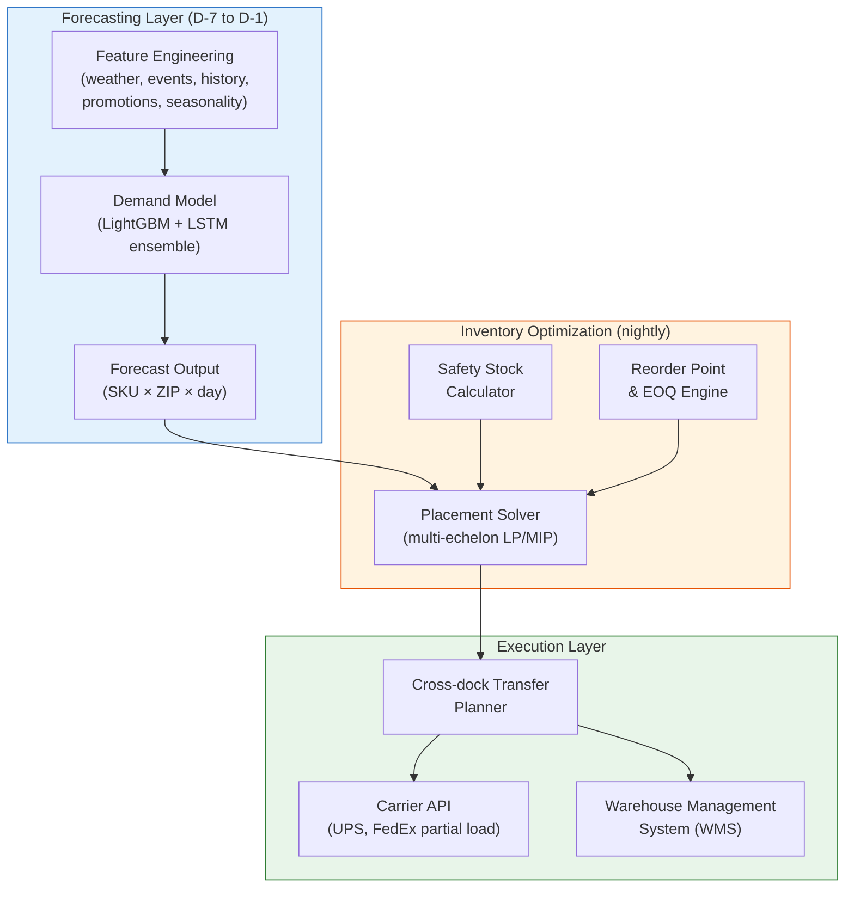
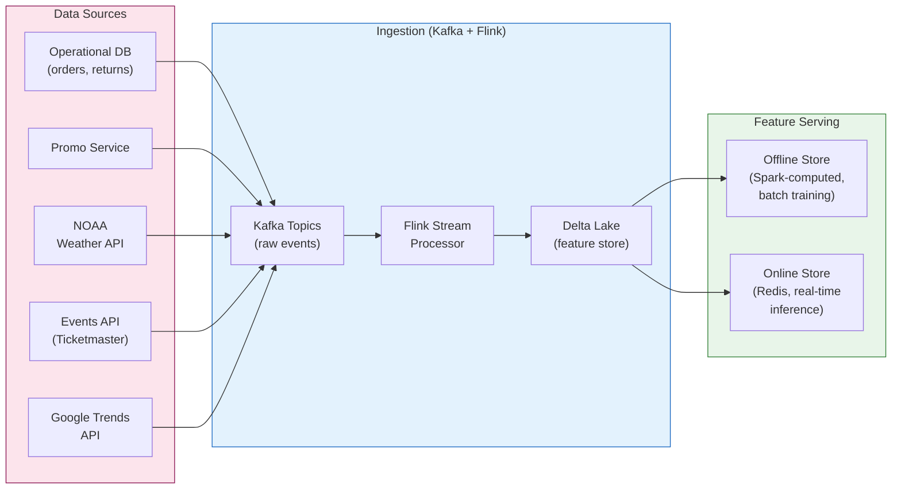
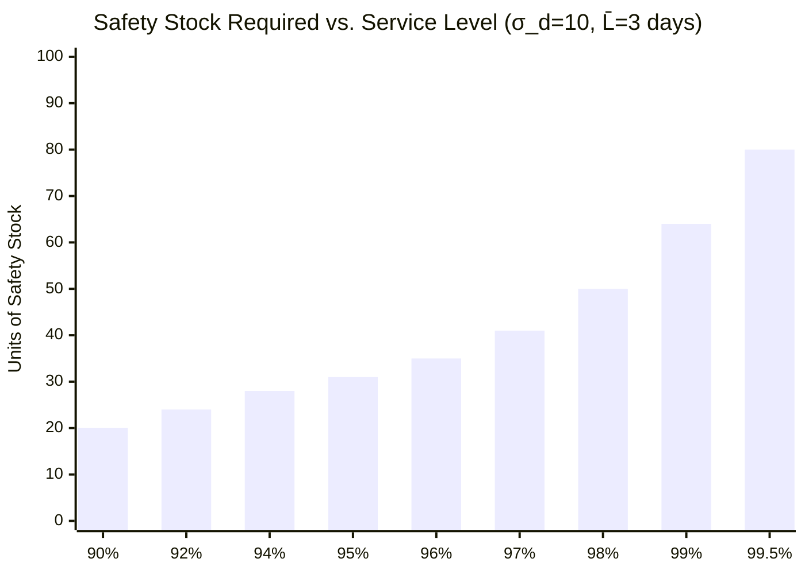
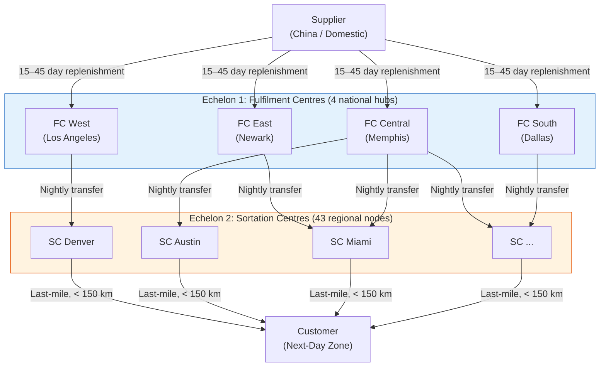
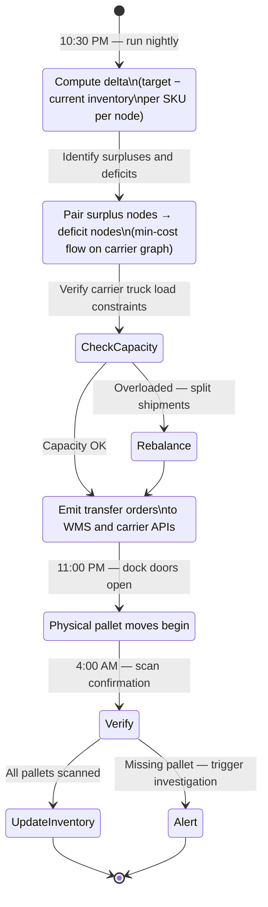
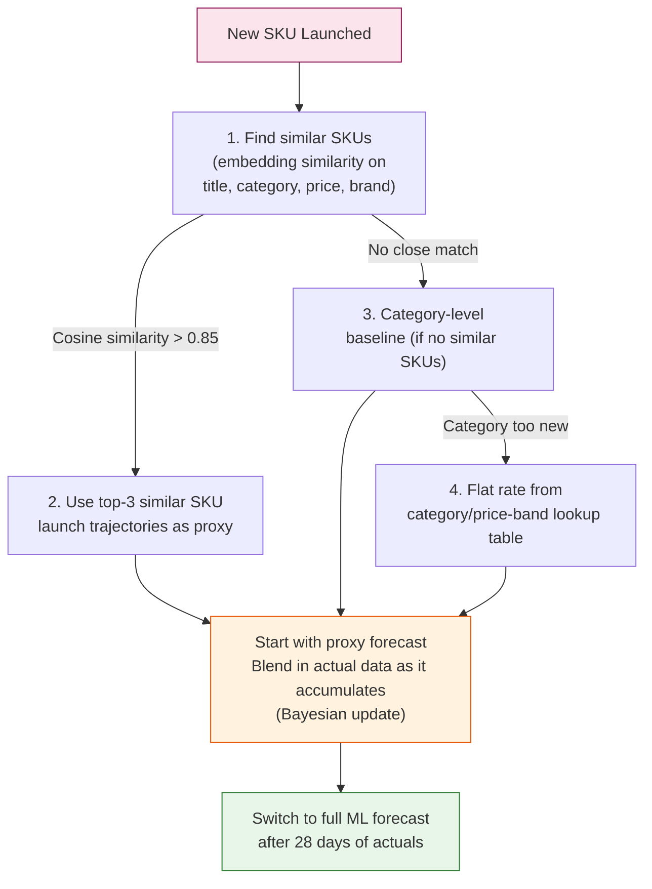
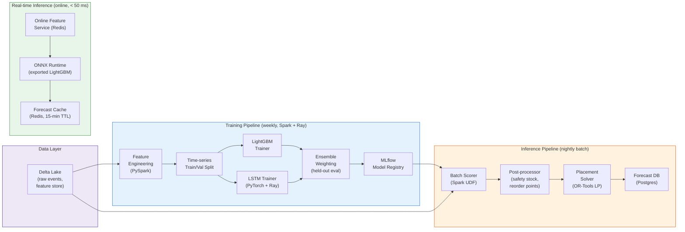
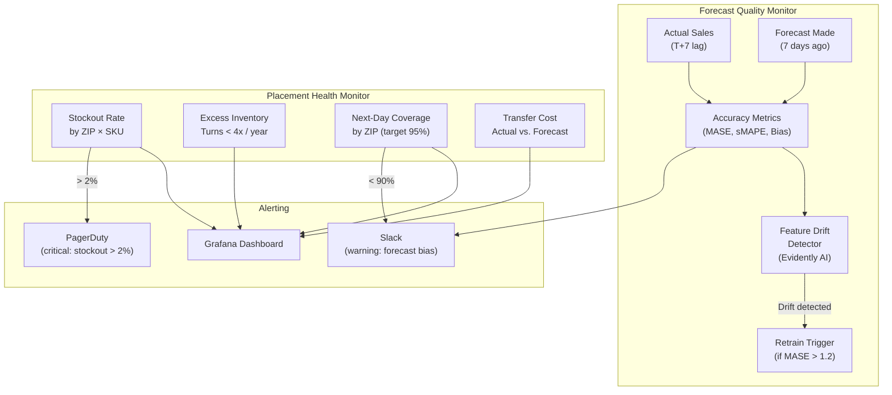

# Chapter 5: Demand Forecasting and Inventory Placement 🔴

> **The Problem:** A customer in Austin, TX orders a Sony WH-1000XM5 headset and expects next-day delivery. Your nearest warehouse is in Memphis, TN — 658 km away. A two-day ground shipment is unavoidable, and you offer a $20 credit as an apology. Meanwhile, your Dallas, TX warehouse has zero units because nobody forecasted the Austin tech-worker holiday surge. Demand forecasting is not a nice-to-have analytics project — it is the operational backbone of competitive fulfilment. The correct architecture: an ML pipeline that predicts weekly demand at the **SKU × ZIP-code level**, feeds a **multi-echelon inventory optimizer** that decides how many units to pre-position in which of 47 warehouses, and executes nightly cross-dock transfers to rebalance stock during off-peak carrier windows — all before the customer ever clicks "Buy."

---

## 5.1 Why Next-Day Delivery is Really a Positioning Problem

The physics are immutable: a package that starts within 150 km of the customer can almost always reach them the next day via ground shipping. One that starts 1,000 km away cannot, regardless of how fast your warehouse picks and packs it. **Next-day coverage is won in the warehouse, not at checkout.**

| Scenario | Distance | Feasible for next-day? | Shipping cost |
|---|---|---|---|
| Same metro (< 50 km) | 40 km | ✅ Yes, even same-day | $3.20 |
| Regional hub (< 200 km) | 165 km | ✅ Yes, ground | $4.80 |
| Adjacent state (< 500 km) | 410 km | ⚠️ Marginal, depends on cutoff | $7.50 |
| Cross-country | 2,800 km | ❌ No, requires 2-day air | $18.40 |
| Cross-country, repositioned | 175 km | ✅ Yes (pre-positioned correctly) | $5.10 |

The difference between the last two rows is the value of good inventory placement. At $13.30 per order saved in shipping, repositioning one pallet of 120 units saves **$1,596** — far more than the $200 cost of the inter-warehouse transfer.



---

## 5.2 The Data Foundation: Feature Engineering at Zip-Code Granularity

The best model on bad features produces bad forecasts. Before touching any algorithm, we must curate a rich feature set for every SKU × ZIP × day training sample.

### Feature Taxonomy

| Feature category | Examples | Source | Lag |
|---|---|---|---|
| Historical demand | 7-day, 14-day, 28-day, 52-week rolling average | Internal DWH | D-1 to D-365 |
| Seasonality | Day of week, month, week of year, holiday proximity | Calendar | Current |
| Promotions | Coupon active flag, discount %, lightning deal | Promotions DB | D-7 to D+7 |
| External events | Local sports events, concerts, graduations | Ticketmaster API | D-7 to D+14 |
| Weather | Temperature, precipitation, storm forecast | NOAA API | D-1 to D+5 |
| Price elasticity | Price vs. category average, competitor price index | Pricing service | Daily |
| Product lifecycle | Days since launch, days until end-of-life | Product catalog | Current |
| Market basket | Co-purchase rate with top-5 companion SKUs | Basket analysis | Weekly |
| Economic signals | Local unemployment rate, consumer confidence | BLS / FRED | Monthly |
| Digital signals | Search volume trends (Google Trends), social mentions | External APIs | Weekly |

### Data Pipeline Architecture



### Feature Engineering in PySpark

```python
from pyspark.sql import functions as F
from pyspark.sql.window import Window

def build_demand_features(orders_df, promo_df, weather_df):
    """
    Constructs a training dataset at the (sku_id, zip_code, date) grain.
    """
    # Aggregate daily demand per SKU × ZIP
    daily = (
        orders_df
        .filter(F.col("status") == "DELIVERED")
        .groupBy("sku_id", "zip_code", F.to_date("ordered_at").alias("date"))
        .agg(F.sum("quantity").alias("units_sold"))
    )

    # Rolling window features — past demand signals
    w7  = Window.partitionBy("sku_id", "zip_code").orderBy("date").rowsBetween(-7, -1)
    w28 = Window.partitionBy("sku_id", "zip_code").orderBy("date").rowsBetween(-28, -1)
    w52w = Window.partitionBy("sku_id", "zip_code").orderBy("date").rowsBetween(-364, -358)

    daily = daily.withColumns({
        "demand_lag1":      F.lag("units_sold", 1).over(Window.partitionBy("sku_id", "zip_code").orderBy("date")),
        "demand_roll7":     F.avg("units_sold").over(w7),
        "demand_roll28":    F.avg("units_sold").over(w28),
        "demand_yoy_same_week": F.avg("units_sold").over(w52w),   # same week last year
        "demand_std7":      F.stddev("units_sold").over(w7),
    })

    # Calendar features
    daily = daily.withColumns({
        "day_of_week":   F.dayofweek("date"),
        "week_of_year":  F.weekofyear("date"),
        "month":         F.month("date"),
        "is_weekend":    (F.dayofweek("date").isin([1, 7])).cast("int"),
        "days_to_holiday": compute_holiday_proximity("date"),   # UDF
    })

    # Join promotions (left join — not every SKU is on promo every day)
    daily = daily.join(
        promo_df.select("sku_id", "date", "discount_pct", "is_lightning_deal"),
        on=["sku_id", "date"],
        how="left",
    ).fillna({"discount_pct": 0.0, "is_lightning_deal": 0})

    # Join weather (by zip prefix → weather station mapping)
    daily = daily.join(
        weather_df.select("zip_prefix", "date",
                          "temp_max_f", "precipitation_in", "storm_flag"),
        on=[daily["zip_code"].substr(1, 3) == weather_df["zip_prefix"], "date"],
        how="left",
    )

    return daily.dropna(subset=["demand_lag1", "demand_roll7"])
```

---

## 5.3 The Forecasting Model: LightGBM + LSTM Ensemble

No single model wins across all SKUs. Fast-moving, promotional SKUs benefit from gradient-boosted trees (LightGBM) that can absorb tabular feature interactions. Slow-moving, seasonal SKUs benefit from sequence models (LSTM) that model temporal autocorrelation. The production system uses a **stacked ensemble**.

### Model Architecture Comparison

| Property | LightGBM | LSTM | Ensemble |
|---|---|---|---|
| Handles tabular features | ✅ Excellent | ⚠️ Requires embedding | ✅ Both |
| Captures long-range seasonality | ⚠️ Lag features needed | ✅ Native | ✅ Both |
| Training time (per SKU group) | Minutes | Hours | Hours |
| Inference latency | < 1 ms | 5–20 ms | 10–25 ms |
| Handles cold-start (new SKU) | ⚠️ Needs fallback | ❌ Poor | ⚠️ With fallback |
| Feature engineering requirement | High | Medium | High |
| Interpretability | ✅ SHAP values | ❌ Opaque | ⚠️ Partial via SHAP |

### LightGBM Demand Forecaster

```python
import lightgbm as lgb
import numpy as np
import pandas as pd
from sklearn.model_selection import TimeSeriesSplit

FEATURE_COLS = [
    "demand_lag1", "demand_roll7", "demand_roll28", "demand_yoy_same_week",
    "demand_std7", "day_of_week", "week_of_year", "month", "is_weekend",
    "days_to_holiday", "discount_pct", "is_lightning_deal",
    "temp_max_f", "precipitation_in", "storm_flag",
    "price_vs_category_avg", "days_since_launch",
]
TARGET_COL = "units_sold"

def train_lgbm_forecaster(df: pd.DataFrame) -> lgb.Booster:
    """
    Trains a LightGBM model for 7-day-ahead demand forecasting.
    Uses time-series cross-validation to prevent leakage.
    """
    tscv = TimeSeriesSplit(n_splits=5, gap=7)
    
    params = {
        "objective":        "tweedie",       # handles zero-inflated demand well
        "tweedie_variance_power": 1.5,
        "metric":           "rmse",
        "learning_rate":    0.05,
        "num_leaves":       127,
        "min_data_in_leaf": 50,
        "feature_fraction": 0.8,
        "bagging_fraction": 0.8,
        "bagging_freq":     5,
        "lambda_l1":        0.1,
        "lambda_l2":        1.0,
        "verbose":          -1,
    }

    X = df[FEATURE_COLS].values
    y = df[TARGET_COL].values

    # Final training on all data using best iteration from CV
    best_iterations = []
    for fold, (train_idx, val_idx) in enumerate(tscv.split(X)):
        dtrain = lgb.Dataset(X[train_idx], label=y[train_idx])
        dval   = lgb.Dataset(X[val_idx],   label=y[val_idx], reference=dtrain)
        
        model = lgb.train(
            params,
            dtrain,
            num_boost_round=2000,
            valid_sets=[dval],
            callbacks=[lgb.early_stopping(50), lgb.log_evaluation(200)],
        )
        best_iterations.append(model.best_iteration)

    final_model = lgb.train(
        params,
        lgb.Dataset(X, label=y),
        num_boost_round=int(np.mean(best_iterations)),
    )
    return final_model
```

### LSTM Sequence Forecaster

```python
import torch
import torch.nn as nn

class DemandLSTM(nn.Module):
    """
    LSTM that takes a 56-day historical demand sequence and outputs
    a 7-day probabilistic forecast (mean + quantiles).
    """
    def __init__(
        self,
        input_size: int = 16,
        hidden_size: int = 256,
        num_layers: int = 3,
        dropout: float = 0.2,
        forecast_horizon: int = 7,
    ):
        super().__init__()
        self.lstm = nn.LSTM(
            input_size=input_size,
            hidden_size=hidden_size,
            num_layers=num_layers,
            dropout=dropout,
            batch_first=True,
        )
        self.layer_norm = nn.LayerNorm(hidden_size)
        # Output heads: median (p50), p10, p90 quantiles
        self.head_p50 = nn.Linear(hidden_size, forecast_horizon)
        self.head_p10 = nn.Linear(hidden_size, forecast_horizon)
        self.head_p90 = nn.Linear(hidden_size, forecast_horizon)

    def forward(self, x: torch.Tensor):
        # x: (batch, seq_len=56, input_size)
        lstm_out, _ = self.lstm(x)
        # Use the last hidden state as context vector
        context = self.layer_norm(lstm_out[:, -1, :])
        return {
            "p10": torch.relu(self.head_p10(context)),  # demand ≥ 0
            "p50": torch.relu(self.head_p50(context)),
            "p90": torch.relu(self.head_p90(context)),
        }

def quantile_loss(pred: torch.Tensor, target: torch.Tensor, q: float) -> torch.Tensor:
    """Pinball loss for quantile regression."""
    error = target - pred
    return torch.mean(torch.max(q * error, (q - 1) * error))

def training_step(model, batch, optimizer):
    x, y_true = batch  # y_true: (batch, 7)
    preds = model(x)
    
    loss = (
        quantile_loss(preds["p10"], y_true, 0.10) +
        quantile_loss(preds["p50"], y_true, 0.50) +
        quantile_loss(preds["p90"], y_true, 0.90)
    )
    optimizer.zero_grad()
    loss.backward()
    torch.nn.utils.clip_grad_norm_(model.parameters(), 1.0)
    optimizer.step()
    return loss.item()
```

### Ensemble Strategy

```python
def ensemble_forecast(
    lgbm_pred: np.ndarray,   # shape: (n_samples, 7)
    lstm_p50:  np.ndarray,   # shape: (n_samples, 7)
    lstm_p10:  np.ndarray,
    lstm_p90:  np.ndarray,
    sku_category: np.ndarray,  # categorical: "fast_moving" | "seasonal" | "long_tail"
) -> dict:
    """
    Weighted ensemble: LightGBM dominates promotional/fast-moving SKUs,
    LSTM dominates seasonal/long-tail SKUs.
    """
    # Category weights: [lgbm_weight, lstm_weight]
    weights = {
        "fast_moving": (0.75, 0.25),
        "seasonal":    (0.35, 0.65),
        "long_tail":   (0.50, 0.50),
    }

    lgbm_w = np.array([weights[cat][0] for cat in sku_category])[:, None]
    lstm_w  = np.array([weights[cat][1] for cat in sku_category])[:, None]

    blended_p50 = lgbm_w * lgbm_pred + lstm_w * lstm_p50

    # Prediction intervals from LSTM quantiles, widened by LightGBM residual variance
    return {
        "forecast_p50": blended_p50,
        "forecast_p10": lstm_p10 * lstm_w + lgbm_pred * 0.7 * lgbm_w,
        "forecast_p90": lstm_p90 * lstm_w + lgbm_pred * 1.3 * lgbm_w,
    }
```

---

## 5.4 Forecast Accuracy and Error Metrics

Not all forecast errors are equal. Being wrong by 100 units on a $2 notebook is trivial. Being wrong by 100 units on a $2,000 GPU causes $200,000 in misplaced inventory. We weight errors by SKU value and penalize **over-forecasting** differently than **under-forecasting**: over-forecasting causes excess inventory costs, under-forecasting causes stockouts and lost revenue.

### Metric Reference

| Metric | Formula | Good for | Bad for |
|---|---|---|---|
| RMSE | $\sqrt{\frac{1}{n}\sum(y - \hat{y})^2}$ | Overall magnitude | Skewed distributions |
| MAPE | $\frac{1}{n}\sum\frac{\|y - \hat{y}\|}{y}$ | Scale-free comparison | Zero demand periods |
| sMAPE | $\frac{2\|y - \hat{y}\|}{y + \hat{y}}$ | Zero-safe MAPE | Asymmetric bias |
| Bias | $\frac{1}{n}\sum(y - \hat{y})$ | Detecting systematic over/under | Hides random error |
| Quantile loss | $\max(q(y-\hat{y}), (q-1)(y-\hat{y}))$ | Probabilistic forecasts | Requires quantile output |
| Weighted MASE | MASE × (unit_value / avg_unit_value) | Business-impact weighting | Requires item metadata |

$$\text{MASE} = \frac{\frac{1}{n}\sum_{t=1}^{n}|y_t - \hat{y}_t|}{\frac{1}{n-m}\sum_{t=m+1}^{n}|y_t - y_{t-m}|}$$

where _m_ is the seasonal period (7 for weekly, 365 for annual). A MASE < 1.0 means the model beats the seasonal naïve baseline.

### Rust Metrics Service

```rust
/// Computes forecast accuracy metrics for a batch of SKU-level predictions.
pub struct ForecastEvaluator;

impl ForecastEvaluator {
    pub fn evaluate(
        actuals: &[f64],
        forecasts: &[f64],
        unit_values: &[f64],
    ) -> ForecastMetrics {
        assert_eq!(actuals.len(), forecasts.len());
        let n = actuals.len() as f64;

        let rmse = (actuals.iter().zip(forecasts)
            .map(|(a, f)| (a - f).powi(2))
            .sum::<f64>() / n)
            .sqrt();

        let bias = actuals.iter().zip(forecasts)
            .map(|(a, f)| a - f)
            .sum::<f64>() / n;

        // sMAPE — symmetric MAPE, handles zero actuals gracefully
        let smape = actuals.iter().zip(forecasts)
            .map(|(a, f)| {
                let denom = a.abs() + f.abs();
                if denom < 1e-9 { 0.0 } else { 2.0 * (a - f).abs() / denom }
            })
            .sum::<f64>() / n * 100.0;

        // Value-weighted RMSE: weight error by SKU value
        let total_value: f64 = unit_values.iter().sum();
        let weighted_rmse = (actuals.iter()
            .zip(forecasts)
            .zip(unit_values)
            .map(|((a, f), v)| (v / total_value) * (a - f).powi(2))
            .sum::<f64>())
            .sqrt();

        // Stockout risk: fraction of cases where forecast < actual
        let under_forecast_rate = actuals.iter().zip(forecasts)
            .filter(|(a, f)| f < a)
            .count() as f64 / n;

        ForecastMetrics { rmse, bias, smape, weighted_rmse, under_forecast_rate }
    }
}

#[derive(Debug)]
pub struct ForecastMetrics {
    pub rmse:                f64,
    pub bias:                f64,
    /// Symmetric MAPE in percent
    pub smape:               f64,
    /// RMSE weighted by SKU value
    pub weighted_rmse:       f64,
    /// Fraction of forecasts that under-estimated actual demand
    pub under_forecast_rate: f64,
}
```

---

## 5.5 Safety Stock: Translating Forecasts into Inventory Targets

A forecast is a point estimate. Reality is a distribution. The gap between the two — **forecast error** — is the enemy of perfect fill rates. Safety stock is the buffer inventory we hold to absorb that uncertainty.

The classical safety stock formula for normally distributed demand error:

$$SS = z_\alpha \cdot \sigma_L$$

where:
- $z_\alpha$ is the service-level z-score (1.28 for 90%, 1.65 for 95%, 2.05 for 98%)
- $\sigma_L$ is the standard deviation of demand over the lead time

For variable lead times (supplier reliability is not constant), the combined formula:

$$SS = z_\alpha \cdot \sqrt{\bar{L} \cdot \sigma_d^2 + \bar{d}^2 \cdot \sigma_L^2}$$

where $\bar{L}$ is mean lead time, $\bar{d}$ is mean daily demand, $\sigma_d$ is daily demand std, and $\sigma_L$ is lead time std.

```rust
pub struct SafetyStockCalculator {
    /// Target service level (e.g., 0.95 for 95%)
    service_level: f64,
}

impl SafetyStockCalculator {
    /// Normal distribution inverse CDF (Wilson-Hilferty approximation for z-score).
    fn z_score(&self) -> f64 {
        // Rational approximation (Abramowitz & Stegun 26.2.17)
        let p = self.service_level;
        assert!((0.5..1.0).contains(&p), "service level must be in (0.5, 1.0)");

        let t = (-2.0 * (1.0 - p).ln()).sqrt();
        let c = [2.515517, 0.802853, 0.010328];
        let d = [1.432788, 0.189269, 0.001308];

        t - (c[0] + c[1] * t + c[2] * t.powi(2))
            / (1.0 + d[0] * t + d[1] * t.powi(2) + d[2] * t.powi(3))
    }

    /// Compute safety stock for one SKU at one warehouse node.
    pub fn compute(
        &self,
        mean_daily_demand: f64,
        daily_demand_std: f64,
        mean_lead_time_days: f64,
        lead_time_std_days: f64,
    ) -> u32 {
        let z = self.z_score();
        let variance_demand   = mean_lead_time_days * daily_demand_std.powi(2);
        let variance_leadtime = mean_daily_demand.powi(2) * lead_time_std_days.powi(2);
        let safety = z * (variance_demand + variance_leadtime).sqrt();
        safety.ceil() as u32
    }

    /// Reorder point: when inventory drops to this level, trigger a replenishment order.
    pub fn reorder_point(
        &self,
        mean_daily_demand: f64,
        mean_lead_time_days: f64,
        safety_stock: u32,
    ) -> u32 {
        let cycle_demand = mean_daily_demand * mean_lead_time_days;
        (cycle_demand.ceil() as u32).saturating_add(safety_stock)
    }
}
```

### Service Level vs. Inventory Cost Trade-off



The curve is non-linear: moving from 95% to 99% service level costs 2× as much safety stock inventory. This is the engineering trade-off at the heart of every fulfilment operation.

---

## 5.6 Multi-Echelon Inventory Optimization: Where to Put What

Safety stock per warehouse tells us the *buffer* needed at each node. Placement optimization tells us *how many total units* to position across the warehouse network to satisfy a demand forecast at minimum total supply chain cost.

### The Two-Echelon Network



### Linear Programming Formulation

Let $x_{ij}$ = units of SKU $s$ to stock at node $j$ to serve demand in zip cluster $i$.

**Objective (minimize total supply chain cost):**

$$\min \sum_{j} \left( h_j \cdot \sum_{i} x_{ij} \right) + \sum_{i,j} c_{ij} \cdot x_{ij} \cdot \mathbf{1}[j \notin \text{next-day-zone}(i)]$$

where $h_j$ is the holding cost per unit-day at node $j$, and $c_{ij}$ is the penalty for serving customer $i$ from node $j$ outside their next-day zone.

**Constraints:**
- **Demand coverage:** $\sum_{j} x_{ij} \geq D_i \quad \forall i$ (forecast demand must be covered)
- **Capacity:** $\sum_{i} x_{ij} \leq \text{CAP}_j \quad \forall j$ (warehouse capacity limits)
- **Non-negativity:** $x_{ij} \geq 0 \quad \forall i, j$
- **Next-day coverage target:** $\sum_{j \in \text{NDZ}(i)} x_{ij} \geq 0.95 \cdot D_i \quad \forall i$ (95% of forecast must be serveable next-day)

### Python OR-Tools LP Solver

```python
from ortools.linear_solver import pywraplp
import numpy as np

def solve_inventory_placement(
    demand: np.ndarray,          # shape: (n_zips,) — weekly units forecast
    holding_cost: np.ndarray,    # shape: (n_nodes,) — $/unit/week
    shipping_penalty: np.ndarray,# shape: (n_zips, n_nodes) — penalty if not next-day
    capacity: np.ndarray,        # shape: (n_nodes,) — max units per node
    next_day_mask: np.ndarray,   # shape: (n_zips, n_nodes) — 1 if node covers zip next-day
    next_day_target: float = 0.95,
) -> np.ndarray:
    """
    Returns x[zip_i, node_j] = units of the SKU to position at node j for zip i.
    """
    n_zips, n_nodes = len(demand), len(capacity)
    solver = pywraplp.Solver.CreateSolver("GLOP")   # GLOP = LP relaxation
    solver.SetTimeLimit(60_000)                      # 60-second limit

    INF = solver.infinity()

    # Decision variables: x[i][j] = units at node j serving zip i
    x = [[solver.NumVar(0.0, INF, f"x_{i}_{j}")
          for j in range(n_nodes)]
         for i in range(n_zips)]

    # Objective: minimize holding cost + shipping penalty
    objective = solver.Objective()
    for i in range(n_zips):
        for j in range(n_nodes):
            coef = holding_cost[j] + shipping_penalty[i, j]
            objective.SetCoefficient(x[i][j], coef)
    objective.SetMinimization()

    # Constraint 1: total supply for each zip ≥ forecast demand
    for i in range(n_zips):
        ct = solver.Constraint(demand[i], INF)
        for j in range(n_nodes):
            ct.SetCoefficient(x[i][j], 1.0)

    # Constraint 2: warehouse capacity
    for j in range(n_nodes):
        ct = solver.Constraint(0.0, float(capacity[j]))
        for i in range(n_zips):
            ct.SetCoefficient(x[i][j], 1.0)

    # Constraint 3: next-day coverage target per zip
    for i in range(n_zips):
        ct = solver.Constraint(next_day_target * demand[i], INF)
        for j in range(n_nodes):
            ct.SetCoefficient(x[i][j], float(next_day_mask[i, j]))

    status = solver.Solve()
    if status not in (pywraplp.Solver.OPTIMAL, pywraplp.Solver.FEASIBLE):
        raise RuntimeError(f"Placement LP infeasible or unbounded (status={status})")

    result = np.array([[x[i][j].solution_value() for j in range(n_nodes)]
                       for i in range(n_zips)])

    return np.ceil(result).astype(int)   # round up to whole units
```

---

## 5.7 Nightly Transfer Planner: Moving Inventory at Scale

The optimizer outputs a *target* inventory position for each SKU at each node. The current inventory position is already there. The **transfer planner** computes the delta and schedules physical pallet movements via carriers between 11 PM and 5 AM, when carrier capacity is cheap and warehouse dock doors are free.



### Min-Cost Flow for Transfer Routing

Matching surplus warehouses to deficit warehouses is a **minimum cost flow** problem on the carrier transportation graph:

```rust
use std::collections::{BinaryHeap, HashMap};
use std::cmp::Reverse;

/// A directed edge in the carrier transportation network.
#[derive(Debug, Clone)]
pub struct CarrierLane {
    pub from_node: usize,
    pub to_node:   usize,
    /// Cost per pallet to ship on this lane tonight
    pub cost_per_pallet: f64,
    /// Maximum pallets available on this lane tonight
    pub capacity_pallets: u32,
    /// Transit time in hours
    pub transit_hours: f32,
}

/// Computes the minimum-cost set of transfers to close the inventory gap.
/// Uses successive shortest path (SSP) algorithm on the residual graph.
pub fn min_cost_flow_transfers(
    surpluses: &[(usize, u32)],   // (node_id, surplus_pallets)
    deficits:  &[(usize, u32)],   // (node_id, deficit_pallets)
    lanes:     &[CarrierLane],
) -> Vec<TransferOrder> {
    // Build adjacency list with residual edges
    let mut graph: Vec<Vec<(usize, u32, f64, usize)>> = Vec::new(); // (to, cap, cost, rev_idx)
    // ... SSP implementation (Bellman-Ford for shortest path on each augmenting step) ...
    // Returns list of (from, to, pallets) transfer orders
    todo!()
}

#[derive(Debug)]
pub struct TransferOrder {
    pub from_warehouse: usize,
    pub to_warehouse:   usize,
    pub skus:           Vec<(u64, u32)>,  // (sku_id, units)
    pub carrier:        String,
    pub scheduled_pickup: chrono::DateTime<chrono::Utc>,
    pub estimated_arrival: chrono::DateTime<chrono::Utc>,
}
```

### Transfer Planner Microservice

```rust
use tokio::time::{self, Duration};

pub struct TransferPlannerService {
    inventory_db: Arc<dyn InventoryRepository>,
    placement_solver: Arc<PlacementSolver>,
    carrier_api: Arc<dyn CarrierApiClient>,
    wms_client: Arc<dyn WmsClient>,
}

impl TransferPlannerService {
    /// Runs nightly at 22:30 to produce the next night's transfer manifest.
    pub async fn run_nightly_planning(&self) -> anyhow::Result<()> {
        tracing::info!("Starting nightly inventory transfer planning");

        // 1. Pull current inventory positions across all nodes
        let current = self.inventory_db.snapshot_all_nodes().await?;

        // 2. Pull placement targets from the optimizer (already computed from forecast)
        let targets = self.placement_solver.latest_targets().await?;

        // 3. Compute deltas: what needs to move where
        let transfers = self.compute_transfer_plan(&current, &targets).await?;

        // 4. Book carrier capacity for each transfer
        let manifests = self.book_carrier_capacity(&transfers).await?;

        // 5. Emit pick lists to each origin warehouse WMS
        for manifest in &manifests {
            self.wms_client.create_transfer_picklist(manifest).await?;
        }

        tracing::info!(
            transfer_orders = manifests.len(),
            "Nightly transfer plan committed"
        );
        Ok(())
    }

    async fn compute_transfer_plan(
        &self,
        current: &InventorySnapshot,
        targets: &PlacementTargets,
    ) -> anyhow::Result<Vec<TransferOrder>> {
        let mut surpluses = Vec::new();
        let mut deficits = Vec::new();

        for (node_id, sku_targets) in &targets.by_node {
            for (sku_id, target_units) in sku_targets {
                let current_units = current.get(*node_id, *sku_id).unwrap_or(0);
                let delta = *target_units as i64 - current_units as i64;

                if delta > 0 {
                    deficits.push((*node_id, *sku_id, delta as u32));
                } else if delta < -20 {
                    // Only transfer if surplus > 20 units (avoid micro-movements)
                    surpluses.push((*node_id, *sku_id, (-delta) as u32));
                }
            }
        }

        // Match surpluses to deficits via min-cost flow
        self.match_transfers(surpluses, deficits).await
    }
}
```

---

## 5.8 Cold-Start: Forecasting for New SKUs

New products have no history. The LSTM and LightGBM models both require historical demand — so what do we do for Week 1?

### Cold-Start Strategy Hierarchy



### SKU Similarity via Product Embeddings

```python
import numpy as np
from sentence_transformers import SentenceTransformer
from sklearn.metrics.pairwise import cosine_similarity

class SkuEmbedder:
    """
    Embeds product metadata into a dense vector for similarity search.
    Used to find historical proxy SKUs for cold-start forecasting.
    """
    def __init__(self):
        self.text_model = SentenceTransformer("sentence-transformers/all-MiniLM-L6-v2")

    def embed_sku(self, sku: dict) -> np.ndarray:
        # Text embedding of product title + category path
        text = f"{sku['title']} | {sku['category_path']} | {sku['brand']}"
        text_vec = self.text_model.encode(text)   # shape: (384,)

        # Numeric features: price, weight, dimensions
        numeric = np.array([
            np.log1p(sku["price_usd"]),
            np.log1p(sku["weight_kg"]),
            sku["is_fragile"],
            sku["is_perishable"],
            sku["review_count_at_launch"],
            sku["ad_spend_day1_usd"] / 1000.0,
        ])

        return np.concatenate([text_vec, numeric])   # shape: (390,)

    def find_proxy_skus(
        self,
        new_sku: dict,
        historical_skus: list[dict],
        top_k: int = 3,
    ) -> list[dict]:
        new_vec = self.embed_sku(new_sku).reshape(1, -1)
        hist_vecs = np.vstack([self.embed_sku(s) for s in historical_skus])
        
        similarities = cosine_similarity(new_vec, hist_vecs)[0]
        top_indices = np.argsort(similarities)[::-1][:top_k]
        
        return [
            {**historical_skus[i], "similarity": float(similarities[i])}
            for i in top_indices
        ]
```

---

## 5.9 The Full ML Pipeline Architecture



### Serving Infrastructure

| Layer | Tech | Latency | When used |
|---|---|---|---|
| Nightly batch forecast | Spark on EMR / Databricks | N/A (batch) | Overnight planning |
| Near-real-time (15 min) | Flink + Kafka | < 1 s | Inventory alerts during peak |
| On-demand API | ONNX Runtime + FastAPI | < 50 ms | Checkout "next-day eligible" badge |
| Cold-start fallback | Rule-based lookup table | < 5 ms | New SKUs, model failures |

### FastAPI Inference Endpoint

```python
import onnxruntime as ort
import numpy as np
from fastapi import FastAPI
from pydantic import BaseModel
import redis.asyncio as aioredis

app = FastAPI()
session = ort.InferenceSession("demand_lgbm.onnx", providers=["CPUExecutionProvider"])
cache = aioredis.from_url("redis://forecast-cache:6379")

FEATURE_NAMES = [
    "demand_lag1", "demand_roll7", "demand_roll28", "demand_yoy_same_week",
    "demand_std7", "day_of_week", "week_of_year", "month", "is_weekend",
    "days_to_holiday", "discount_pct", "is_lightning_deal",
    "temp_max_f", "precipitation_in", "storm_flag",
    "price_vs_category_avg", "days_since_launch",
]

class ForecastRequest(BaseModel):
    sku_id: str
    zip_code: str
    horizon_days: int = 7

class ForecastResponse(BaseModel):
    sku_id: str
    zip_code: str
    forecast_p50: list[float]
    forecast_p10: list[float]
    forecast_p90: list[float]
    from_cache: bool

@app.post("/forecast", response_model=ForecastResponse)
async def get_forecast(req: ForecastRequest):
    cache_key = f"forecast:{req.sku_id}:{req.zip_code}"
    
    if cached := await cache.get(cache_key):
        import json
        data = json.loads(cached)
        return ForecastResponse(**data, from_cache=True)

    # Fetch live features from online feature store
    features = await fetch_online_features(req.sku_id, req.zip_code)
    x = np.array([[features[f] for f in FEATURE_NAMES]], dtype=np.float32)

    preds = session.run(None, {"input": x})[0]   # shape: (1, 7)

    response = ForecastResponse(
        sku_id=req.sku_id,
        zip_code=req.zip_code,
        forecast_p50=preds[0].tolist(),
        forecast_p10=(preds[0] * 0.7).tolist(),   # approximation from model training
        forecast_p90=(preds[0] * 1.4).tolist(),
        from_cache=False,
    )

    import json
    await cache.setex(cache_key, 900, json.dumps(response.model_dump(exclude={"from_cache"})))
    return response
```

---

## 5.10 Observability: Monitoring Forecast & Placement Health



### Key Performance Indicators

| KPI | Definition | Target | Alert threshold |
|---|---|---|---|
| Next-day coverage rate | % of orders shipped from next-day-eligible warehouse | ≥ 95% | < 90% |
| Stockout rate | % of SKU-ZIP-days with zero inventory | < 0.5% | > 2% |
| Inventory turnover | Annual revenue / average inventory value | ≥ 8× | < 4× |
| Forecast MASE | vs. seasonal naïve baseline | < 0.80 | > 1.20 (model worse than naïve) |
| Forecast bias | Systematic over/under-forecast | ± 2% | ± 8% |
| Transfer plan accuracy | Actual units moved vs. plan | > 95% | < 85% |
| Placement solver runtime | Time to solve LP for all SKUs | < 30 min | > 90 min |
| Carrier on-time transfer | % transfers arriving within window | ≥ 98% | < 93% |

### Prometheus Metrics in Rust

```rust
use prometheus::{
    register_gauge_vec, register_histogram_vec,
    GaugeVec, HistogramVec,
};

lazy_static::lazy_static! {
    static ref STOCKOUT_RATE: GaugeVec = register_gauge_vec!(
        "inventory_stockout_rate",
        "Fraction of SKU-ZIP combinations with zero stock",
        &["warehouse_region", "sku_category"],
    ).unwrap();

    static ref NEXTDAY_COVERAGE: GaugeVec = register_gauge_vec!(
        "inventory_nextday_coverage_ratio",
        "Fraction of demand zips with next-day-eligible stock",
        &["warehouse_region"],
    ).unwrap();

    static ref FORECAST_MASE: GaugeVec = register_gauge_vec!(
        "forecast_mase",
        "Mean Absolute Scaled Error of weekly forecasts",
        &["model_version", "sku_category"],
    ).unwrap();

    static ref PLACEMENT_SOLVE_DURATION: HistogramVec = register_histogram_vec!(
        "inventory_placement_solve_duration_seconds",
        "Time to solve the nightly placement LP",
        &["scope"],
        vec![30.0, 60.0, 120.0, 300.0, 600.0, 1800.0],
    ).unwrap();

    static ref TRANSFER_COST_DOLLARS: GaugeVec = register_gauge_vec!(
        "inventory_transfer_cost_dollars",
        "Total nightly transfer spend in USD",
        &["carrier"],
    ).unwrap();
}

/// Called nightly after solving to publish metrics to Prometheus.
pub fn publish_placement_metrics(report: &PlacementReport) {
    STOCKOUT_RATE
        .with_label_values(&[&report.region, &report.sku_category])
        .set(report.stockout_rate);

    NEXTDAY_COVERAGE
        .with_label_values(&[&report.region])
        .set(report.nextday_coverage);

    FORECAST_MASE
        .with_label_values(&[&report.model_version, &report.sku_category])
        .set(report.mase);

    PLACEMENT_SOLVE_DURATION
        .with_label_values(&["global"])
        .observe(report.solve_duration_s);

    for (carrier, cost) in &report.transfer_cost_by_carrier {
        TRANSFER_COST_DOLLARS
            .with_label_values(&[carrier])
            .set(*cost);
    }
}
```

---

## 5.11 Putting It All Together: End-to-End Timeline

```mermaid
gantt
    title Nightly Inventory Planning Timeline
    dateFormat HH:mm
    axisFormat %H:%M

    section Data Ingestion
    Kafka consumer lag drain       :done, 20:00, 30m
    Flink feature aggregation      :done, 20:30, 60m

    section Forecasting
    PySpark feature build          :active, 21:30, 45m
    LightGBM batch scoring         :22:15, 30m
    LSTM batch scoring             :22:15, 45m
    Ensemble blending              :23:00, 15m

    section Optimization
    Safety stock computation       :23:00, 15m
    Placement LP solve             :23:15, 30m
    Transfer plan generation       :23:45, 15m

    section Execution
    WMS pick-list emission         :00:00, 20m
    Carrier API booking            :00:00, 30m
    Physical transfers begin       :00:30, 270m
    Scan confirmation window       :04:00, 60m
    Inventory records updated      :05:00, 30m
```



The entire pipeline — from raw Kafka events to pallets on the move — completes in under 6 hours, finishing before the 5 AM warehouse shift starts. When the first picker arrives at work, the shelves already reflect last night's rebalancing.

---

## 5.12 Exercises

### Exercise 1: Bayesian Demand Update for New SKUs

<details>
<summary>Problem Statement</summary>

Implement a Bayesian update function that starts with a proxy forecast from a similar SKU and updates it as actual sales data accumulates over 28 days.

Use a Gamma-Poisson conjugate model (appropriate for count demand data): the prior is a Gamma distribution parameterised by $(\alpha_0, \beta_0)$ from the proxy SKU's historical mean and variance. Each day of actuals updates the posterior analytically.

```python
def bayesian_demand_update(
    prior_alpha: float,    # shape parameter from proxy SKU
    prior_beta: float,     # rate parameter from proxy SKU
    actuals: list[int],    # observed units sold each day so far
) -> tuple[float, float]: # returns (posterior_alpha, posterior_beta)
    """Returns updated (alpha, beta) parameters of the posterior Gamma distribution."""
    ...
```

**Hint:** For a Gamma(α, β) prior with Poisson likelihood, the posterior after observing data $y_1, \ldots, y_n$ is Gamma$(\alpha + \sum y_i, \beta + n)$.

</details>

<details>
<summary>Solution</summary>

```python
def bayesian_demand_update(
    prior_alpha: float,
    prior_beta: float,
    actuals: list[int],
) -> tuple[float, float]:
    posterior_alpha = prior_alpha + sum(actuals)
    posterior_beta  = prior_beta  + len(actuals)
    # Posterior mean = posterior_alpha / posterior_beta
    # Posterior variance = posterior_alpha / posterior_beta^2
    return posterior_alpha, posterior_beta
```

</details>

---

### Exercise 2: Reorder Point Simulation

<details>
<summary>Problem Statement</summary>

Write a Monte Carlo simulator that validates the analytical safety stock formula from Section 5.5. Simulate 10,000 replenishment cycles for a SKU with:
- Mean daily demand: 20 units, std: 6 units (normal)
- Mean lead time: 5 days, std: 1.5 days (normal)
- Target service level: 95%

Measure the empirical stockout rate and confirm it matches the 5% target.

```rust
fn simulate_service_level(
    mean_demand: f64,
    std_demand: f64,
    mean_lead: f64,
    std_lead: f64,
    safety_stock: u32,
    cycles: usize,
) -> f64; // Returns empirical stockout rate
```

</details>

<details>
<summary>Hint</summary>

For each simulated cycle:
1. Draw lead time $L \sim \mathcal{N}(\bar{L}, \sigma_L^2)$, clipped to ≥ 1.
2. Draw daily demands $d_t \sim \mathcal{N}(\bar{d}, \sigma_d^2)$ for $t = 1 \ldots \lceil L \rceil$ days, clipped to ≥ 0.
3. Total demand over lead time = $\sum d_t$.
4. A stockout occurs if total demand > reorder point (where reorder\_point = mean demand × mean lead + safety\_stock).
5. Count stockout fraction over all cycles.

</details>

---

### Exercise 3: Design a Multi-Region Placement Policy

<details>
<summary>Problem Statement</summary>

You discover that your LP placement solver is producing solutions that concentrate 90% of a SKU's inventory in a single warehouse (the cheapest holding cost node), violating a business rule that no single warehouse should hold more than 40% of national stock for any SKU (to hedge against warehouse outages).

Extend the LP formulation from Section 5.6 with a constraint that enforces this concentration limit. Write the constraint in mathematical form and add it to the Python OR-Tools code.

</details>

<details>
<summary>Solution</summary>

**Mathematical constraint:** for each node $j$ and SKU $s$:

$$\sum_{i} x_{ij} \leq 0.40 \cdot \sum_{i,k} x_{ik}$$

In code, add before calling `solver.Solve()`:

```python
# Constraint 4: no single node holds > 40% of total national stock
# Since total is sum of all x[i][j], rearrange: 0.6 * sum_j x[ij] <= 0.4 * sum over other nodes
total_vars = [x[i][j] for i in range(n_zips) for j in range(n_nodes)]
for j in range(n_nodes):
    # sum_i x[i][j] <= 0.40 * sum_{i,k} x[i][k]
    # => 0.60 * sum_i x[i][j] <= 0.40 * sum_{i, k!=j} x[i][k]
    # Simpler: sum_i x[i][j] - 0.40 * sum_{i,k} x[i][k] <= 0
    ct = solver.Constraint(-solver.infinity(), 0.0)
    for i in range(n_zips):
        ct.SetCoefficient(x[i][j], 0.60)   # coefficient for node j's share
        for k in range(n_nodes):
            if k != j:
                ct.SetCoefficient(x[i][k], -0.40)  # subtract other nodes' share
```

</details>

---

> **Key Takeaways**
>
> - **Next-day delivery is won in the warehouse, not at checkout.** Pre-positioning inventory within 150 km of the customer is the only physics-compliant path to next-day fulfilment at scale.
> - **No single model wins.** Gradient-boosted trees handle promotional and feature-rich SKUs; LSTMs capture long-range seasonality. An ensemble weighted by SKU category outperforms either alone.
> - **Forecast errors are not symmetric.** Over-forecasting causes inventory holding costs; under-forecasting causes stockouts and lost revenue. Use quantile loss and asymmetric penalties to align model training with business cost structure.
> - **Safety stock is a function of uncertainty, not just demand.** Variable lead times from suppliers can dominate demand variance. Both must be included in the safety stock formula.
> - **Placement is an LP, not intuition.** The multi-echelon inventory optimizer solves a constrained linear program every night. Gut-feel heuristics ("put it in the biggest warehouse") leave tens of millions of dollars of shipping cost on the table annually.
> - **Cold-start is solvable with embeddings.** Product similarity search via sentence embeddings finds historical proxy SKUs in milliseconds, enabling a Bayesian warm-start before any actual demand data exists.
> - **The pipeline must complete before the first shift.** Every minute of delay in the nightly planning pipeline is inventory that isn't where it needs to be when the warehouse opens. Design for < 6 hours end-to-end, with observability at every stage.
