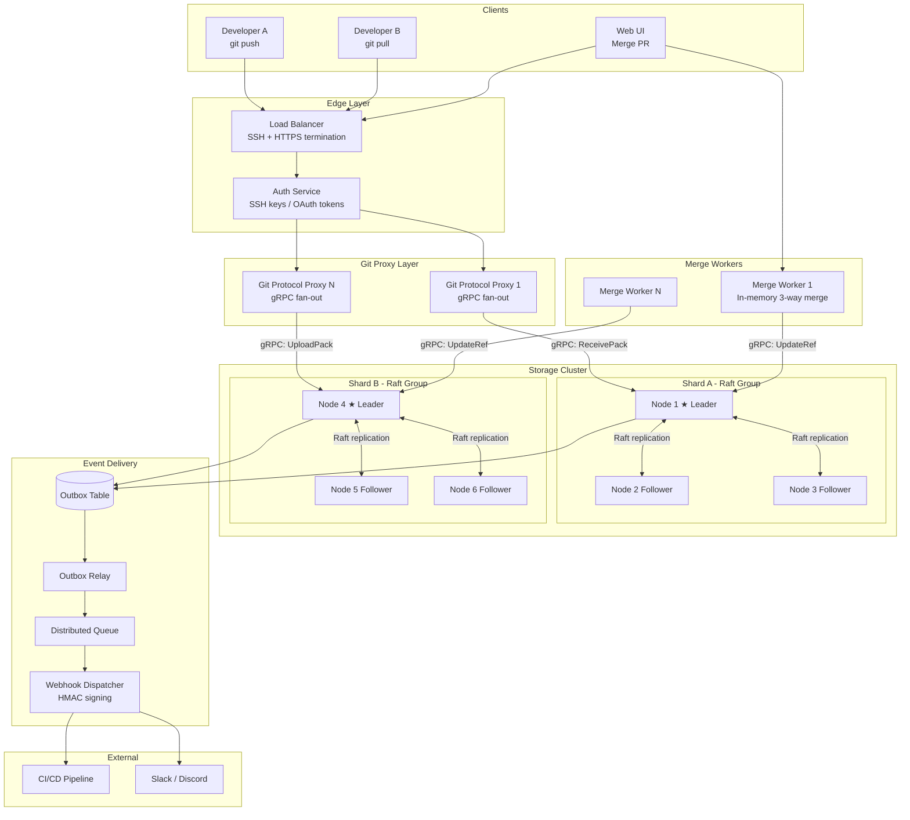

# System Design: The Distributed Git Hosting Platform

## Speaker Intro

This handbook is written from the perspective of a **Principal Infrastructure Architect** who has designed, operated, and debugged distributed source-control systems serving millions of repositories and billions of Git objects in production. The content draws from first-hand experience building platforms at the intersection of the Git wire protocol, content-addressable storage, distributed consensus, and high-throughput event delivery.

## Who This Is For

- **Backend engineers** who use GitHub, GitLab, or Bitbucket daily and want to understand the infrastructure layer beneath `git push`.
- **Systems programmers** who want a concrete, end-to-end project (a Git hosting platform) instead of isolated toy examples.
- **Architects evaluating Rust** for latency-critical developer infrastructure and who need proof that the language can replace Go or Java in the storage and compute layer.
- **Anyone who has *operated* a self-hosted Git server** and been mystified by Gitaly, Spokes, or DGit internals—and wants to understand why those mechanisms exist by designing one from scratch.

## Prerequisites

| Concept | Where to Learn |
|---|---|
| Intermediate Rust (ownership, traits, `async`) | [Async Rust](../async-book/src/SUMMARY.md) |
| Basic networking (TCP, SSH, HTTP/2) | [Tokio Internals](../tokio-internals-book/src/SUMMARY.md) |
| What Git does (commits, branches, merges) | Pro Git book (git-scm.com) |
| Familiarity with gRPC and Protocol Buffers | [Microservices Book](../microservices-book/src/SUMMARY.md) |
| Distributed systems fundamentals (CAP, replication) | [Distributed Systems](../distributed-systems-book/src/SUMMARY.md) |

## How to Use This Book

| Emoji | Meaning |
|---|---|
| 🟢 | **Architecture** — foundational design decisions and protocol deep-dives |
| 🟡 | **Storage / Git Internals** — content-addressable storage, packfiles, event delivery |
| 🔴 | **Consensus** — distributed coordination, Raft replication, in-memory merge |

Each chapter solves **one specific bottleneck or failure mode** in the lifecycle of a Git operation—from the moment `git push` opens a TCP connection to the moment a webhook fires at an external CI/CD service. Read them in order—later chapters assume the protocol and storage layers from earlier chapters exist.

## The Problem We Are Solving

> Design a **distributed Git hosting platform** (like GitHub, GitLab, or Bitbucket) capable of hosting **100 million repositories** across a fleet of storage nodes with **zero data loss**, **sub-second push latency**, and **automatic failover**.

The system we will build has these non-negotiable requirements:

| Requirement | Target |
|---|---|
| Repositories hosted | ≥ 100 M |
| Push latency (p99) | < 500 ms for average-size pushes |
| Durability | Zero data loss — every acknowledged push survives node failure |
| Replication | 3-node Raft groups per repository shard |
| Merge throughput | ≥ 10,000 merge operations/min across the fleet |
| Webhook delivery | At-least-once, < 30 s from push to first delivery attempt |
| Recovery time (node crash) | < 5 seconds to re-elect storage leader |

## Pacing Guide

| Chapter | Topic | Time | Checkpoint |
|---|---|---|---|
| Ch 0 | Introduction & Problem Statement | 30 min | Understand the design canvas |
| Ch 1 | The Git Protocol and RPC | 6–8 hours | SSH/HTTP termination → gRPC pipeline working |
| Ch 2 | Object Storage and Delta Compression | 6–8 hours | Packfile fan-out, delta chains, GC policy |
| Ch 3 | High Availability and Raft Consensus | 8–10 hours | 3-node cluster replicating refs without split-brain |
| Ch 4 | The Merge Engine and Conflict Resolution | 6–8 hours | In-memory three-way merge worker pool |
| Ch 5 | Webhooks and Guaranteed Delivery | 5–7 hours | Outbox pattern, exponential backoff, HMAC signing |

**Total: ~32–42 hours** of focused study.

## Table of Contents

### Part I: The Wire
- **Chapter 1 — The Git Protocol and RPC 🟢** — How `git push` actually works. Terminating SSH and Smart HTTP at the load balancer layer, authenticating the user, and converting the raw Git protocol into internal gRPC calls (similar to GitHub's Spokes or GitLab's Gitaly).

### Part II: The Storage Engine
- **Chapter 2 — Object Storage and Delta Compression 🟡** — Git is a content-addressable file system. Why you don't store repositories in a relational database. Deep dive into Git Packfiles, loose objects, and how the backend uses delta compression to store 10,000 commits of a file in just a few megabytes.

### Part III: Distributed Coordination
- **Chapter 3 — High Availability and Raft Consensus 🔴** — A single server holding a repo is a single point of failure. Architecting a replication system using the Raft consensus algorithm to synchronously replicate Git references (branch pointers) across three physical storage nodes, preventing split-brain scenarios during network partitions.
- **Chapter 4 — The Merge Engine and Conflict Resolution 🔴** — What happens when you click "Merge Pull Request"? Architecting a background worker pool in Rust that clones the repo into memory, performs a three-way Git merge algorithm, detects conflicts, and pushes the new commit hash back to the storage layer—all without touching disk I/O.

### Part IV: Event Delivery
- **Chapter 5 — Webhooks and Guaranteed Delivery 🟡** — Triggering CI/CD pipelines. Building a highly reliable webhook dispatcher using an Outbox Pattern and a distributed queue. Handling exponential backoff, retry storms, and cryptographically signing webhook payloads so external servers can verify the source.

## Architecture Overview

## Companion Guides

This handbook builds on concepts from several other books in the Rust Training curriculum:

- [Distributed Systems](../distributed-systems-book/src/SUMMARY.md) — Consensus, clocks, replication theory
- [Microservices](../microservices-book/src/SUMMARY.md) — Axum, Tonic, Tower, gRPC patterns
- [Tokio Internals](../tokio-internals-book/src/SUMMARY.md) — Reactor, wakers, work-stealing scheduler
- [Hardware Sympathy](../hardware-sympathy-book/src/SUMMARY.md) — CPU caches, MESI, `mmap`, I/O paths
- [Enterprise Rust](../enterprise-rust-book/src/SUMMARY.md) — OpenTelemetry, security, supply chain hygiene
- [System Design: Distributed Message Broker](../system-design-book/src/SUMMARY.md) — Append-only logs, `io_uring`, Raft consensus
