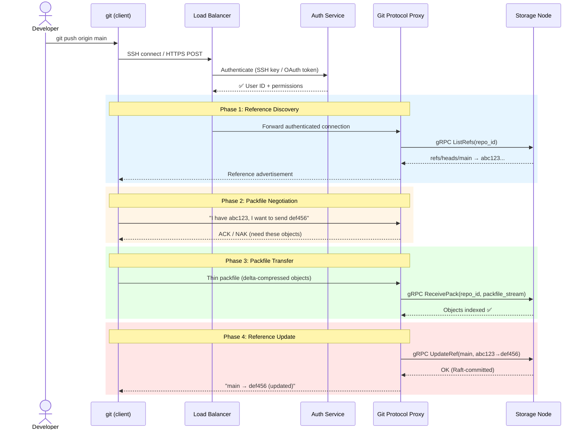
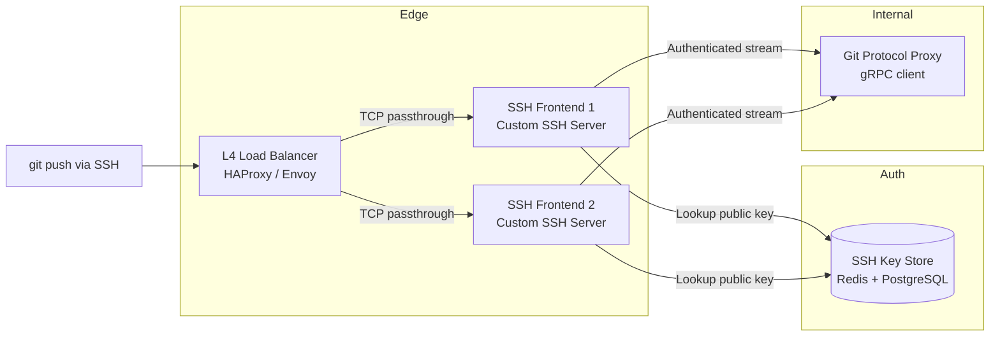
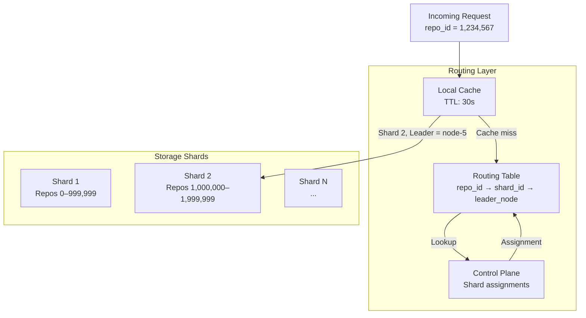
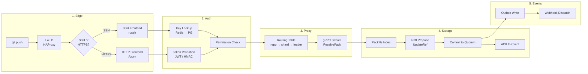

# 1. The Git Protocol and RPC 🟢

> **The Problem:** When a developer types `git push origin main`, a surprisingly complex chain of events unfolds. The client negotiates capabilities, computes a minimal packfile, streams binary data over SSH or HTTPS, and expects an atomic reference update on the server. A hosting platform serving 100 million repositories must terminate those connections at a load-balancer tier, authenticate the user in single-digit milliseconds, route the request to the correct storage node, and translate the raw Git wire protocol into internal gRPC calls—all without the developer noticing any latency. Getting any step wrong means corrupted pushes, orphaned objects, or authentication bypasses.

---

## How `git push` Actually Works

Most engineers treat `git push` as a black box. Under the hood, the Git client and server execute a precise, multi-phase protocol. Understanding this protocol is non-negotiable for building a hosting platform.

### The Four Phases of a Push



### Phase 1: Reference Discovery

The server advertises all known references (branches, tags) and their current commit hashes. This lets the client compute **what the server already has** so it can send only the missing objects.

Wire format (v2 protocol with `ls-refs` command):

```
# Client requests
command=ls-refs
0001
peel
symrefs
ref-prefix refs/heads/
ref-prefix refs/tags/
0000

# Server responds
abc123def456... refs/heads/main
789abc012345... refs/heads/feature/auth
0000
```

### Phase 2: Packfile Negotiation

The client and server negotiate a minimal set of objects to transfer. The client sends `have` lines (commits it already knows the server has) and `want` lines (commits it needs to push). The server responds with `ACK` (I have that) or `NAK` (send me everything).

This negotiation is critical for performance—without it, every push would re-upload the entire repository history.

### Phase 3: Packfile Transfer

The client computes a **thin packfile**—a delta-compressed binary blob containing only the objects the server is missing. This packfile is streamed directly into the connection. We will explore packfile internals deeply in Chapter 2.

### Phase 4: Reference Update

After the server has indexed all objects, the client requests an atomic reference update: "move `refs/heads/main` from `abc123` to `def456`." This is a compare-and-swap operation—if another push moved `main` in the meantime, the update is rejected and the client must pull and retry.

---

## Terminating SSH and Smart HTTP

A Git hosting platform supports two transport protocols. Both must terminate at the edge before reaching internal services.

### Transport Comparison

| Property | SSH (`git@host:repo.git`) | Smart HTTP (`https://host/repo.git`) |
|---|---|---|
| Authentication | SSH public key | OAuth token / password |
| Encryption | SSH channel | TLS 1.3 |
| Multiplexing | One repo per connection | HTTP/2 streams |
| Firewall friendliness | Port 22 (often blocked) | Port 443 (universally open) |
| Protocol overhead | Minimal | HTTP headers per request |
| Client caching | None | HTTP cache headers for info/refs |
| Corporate proxy support | Poor | Excellent |

### SSH Termination Architecture



The SSH frontend is **not** OpenSSH. It is a purpose-built SSH server (in Rust, using the `russh` crate) that:

1. **Accepts the TCP connection** and performs the SSH handshake.
2. **Extracts the public key** from the client's authentication request.
3. **Looks up the key** in a key store (Redis cache backed by PostgreSQL) to find the user ID.
4. **Parses the SSH command** (`git-receive-pack 'user/repo.git'`) to extract the repository path.
5. **Checks authorization** — does this user have push access to this repository?
6. **Forwards the authenticated byte stream** to the Git Protocol Proxy as a gRPC bidirectional stream.

```rust,ignore
use russh::server::{Auth, Handler, Session};
use russh::ChannelId;
use std::sync::Arc;

struct GitSshHandler {
    user_id: Option<u64>,
    repo_path: Option<String>,
    auth_service: Arc<dyn AuthService>,
    proxy_client: Arc<dyn GitProxyClient>,
}

#[async_trait::async_trait]
impl Handler for GitSshHandler {
    type Error = anyhow::Error;

    /// Called when the client presents a public key for authentication.
    async fn auth_publickey(
        &mut self,
        user: &str,
        public_key: &russh_keys::key::PublicKey,
    ) -> Result<Auth, Self::Error> {
        // Fingerprint the key and look it up in the key store.
        let fingerprint = public_key.fingerprint();

        match self.auth_service.lookup_ssh_key(&fingerprint).await? {
            Some(user_id) => {
                self.user_id = Some(user_id);
                Ok(Auth::Accept)
            }
            None => Ok(Auth::Reject {
                proceed_with_methods: None,
            }),
        }
    }

    /// Called when the client sends an exec request (e.g., `git-receive-pack 'repo.git'`).
    async fn exec_request(
        &mut self,
        channel: ChannelId,
        data: &[u8],
        session: &mut Session,
    ) -> Result<(), Self::Error> {
        let command = std::str::from_utf8(data)?;

        // Parse: "git-receive-pack '/user/repo.git'"
        let (git_command, repo_path) = parse_git_command(command)?;

        let user_id = self
            .user_id
            .ok_or_else(|| anyhow::anyhow!("not authenticated"))?;

        // Authorization check: does this user have push access?
        let permission = self
            .auth_service
            .check_repo_access(user_id, &repo_path, git_command.required_permission())
            .await?;

        if !permission.allowed {
            session.channel_failure(channel)?;
            return Ok(());
        }

        self.repo_path = Some(repo_path.clone());

        // Open a bidirectional gRPC stream to the Git Protocol Proxy.
        // The proxy will handle reference discovery, packfile transfer, etc.
        let stream = self
            .proxy_client
            .open_git_stream(user_id, &repo_path, git_command)
            .await?;

        // Bridge the SSH channel ↔ gRPC stream.
        // Bytes flow: SSH client → this process → gRPC → storage node → gRPC → here → SSH client.
        tokio::spawn(bridge_ssh_to_grpc(session.handle(), channel, stream));

        Ok(())
    }
}

/// Parse a Git SSH command into the operation type and repository path.
fn parse_git_command(command: &str) -> anyhow::Result<(GitCommand, String)> {
    // Expected formats:
    //   git-receive-pack '/user/repo.git'     (push)
    //   git-upload-pack '/user/repo.git'      (pull/fetch)
    let parts: Vec<&str> = command.splitn(2, ' ').collect();
    if parts.len() != 2 {
        anyhow::bail!("invalid git command: {command}");
    }

    let git_cmd = match parts[0] {
        "git-receive-pack" => GitCommand::ReceivePack,
        "git-upload-pack" => GitCommand::UploadPack,
        _ => anyhow::bail!("unsupported command: {}", parts[0]),
    };

    // Strip surrounding quotes and leading slash.
    let repo_path = parts[1].trim_matches('\'').trim_start_matches('/');

    Ok((git_cmd, repo_path.to_string()))
}
```

### Smart HTTP Termination

For HTTPS, the flow is different. The load balancer terminates TLS and routes based on the HTTP path:

```
POST /user/repo.git/git-receive-pack   → Push
POST /user/repo.git/git-upload-pack    → Fetch
GET  /user/repo.git/info/refs?service=git-receive-pack  → Ref discovery
```

```rust,ignore
use axum::{
    extract::{Path, State},
    http::StatusCode,
    body::Body,
    response::Response,
};

/// Smart HTTP endpoint for git-receive-pack (push).
async fn git_receive_pack(
    Path((owner, repo)): Path<(String, String)>,
    State(state): State<AppState>,
    auth: AuthenticatedUser, // Extracted from Authorization header via middleware
    body: Body,
) -> Result<Response, StatusCode> {
    let repo_path = format!("{owner}/{repo}");

    // Authorization: does this user have push access?
    state
        .auth_service
        .check_repo_access(auth.user_id, &repo_path, Permission::Push)
        .await
        .map_err(|_| StatusCode::FORBIDDEN)?;

    // Stream the HTTP body (packfile) to the storage layer via gRPC.
    let grpc_response = state
        .proxy_client
        .receive_pack(auth.user_id, &repo_path, body.into_data_stream())
        .await
        .map_err(|_| StatusCode::INTERNAL_SERVER_ERROR)?;

    // Return the Git protocol response (updated refs, status lines).
    Ok(Response::builder()
        .status(200)
        .header("Content-Type", "application/x-git-receive-pack-result")
        .body(Body::from_stream(grpc_response))
        .unwrap())
}
```

---

## The gRPC Service Layer: Converting Git to RPC

The raw Git protocol is a stateful byte stream. Internally, we decompose it into discrete, well-typed gRPC calls. This is the approach used by GitLab's Gitaly and GitHub's Spokes.

### Why gRPC Instead of Raw Git Internally?

| Concern | Raw Git Protocol | gRPC Service |
|---|---|---|
| Observability | Opaque byte stream | Per-RPC metrics, traces, deadlines |
| Load balancing | Sticky L4 connections | Per-request L7 routing |
| Retries | Impossible (stateful stream) | Idempotent RPCs are retryable |
| Schema evolution | Pack format versioning | Protobuf backward compatibility |
| Authorization | Once at connection start | Per-RPC middleware (Tower) |
| Rate limiting | Per-connection only | Per-user, per-repo, per-RPC |

### The Gitaly-Style Service Definition

```protobuf
syntax = "proto3";
package git.storage.v1;

service GitStorage {
    // Reference management
    rpc ListRefs(ListRefsRequest) returns (ListRefsResponse);
    rpc UpdateRef(UpdateRefRequest) returns (UpdateRefResponse);
    rpc DeleteRef(DeleteRefRequest) returns (DeleteRefResponse);

    // Object transfer — bidirectional streaming
    rpc ReceivePack(stream ReceivePackRequest) returns (stream ReceivePackResponse);
    rpc UploadPack(stream UploadPackRequest) returns (stream UploadPackResponse);

    // Repository lifecycle
    rpc CreateRepository(CreateRepositoryRequest) returns (CreateRepositoryResponse);
    rpc DeleteRepository(DeleteRepositoryRequest) returns (DeleteRepositoryResponse);
    rpc GetRepositorySize(GetRepositorySizeRequest) returns (GetRepositorySizeResponse);

    // Merge operations (Chapter 4)
    rpc MergeTree(MergeTreeRequest) returns (MergeTreeResponse);
}

message ListRefsRequest {
    string repository_id = 1;
    repeated string ref_prefixes = 2; // e.g., ["refs/heads/", "refs/tags/"]
}

message ListRefsResponse {
    repeated Reference references = 1;
}

message Reference {
    string name = 1;        // e.g., "refs/heads/main"
    bytes target_oid = 2;   // 20-byte SHA-1 or 32-byte SHA-256
    string symbolic_target = 3; // For HEAD → refs/heads/main
}

message UpdateRefRequest {
    string repository_id = 1;
    string ref_name = 2;
    bytes old_oid = 3;      // Expected current value (CAS)
    bytes new_oid = 4;      // Desired new value
}

message UpdateRefResponse {
    bool success = 1;
    string error_message = 2;
}

// Streaming packfile upload (push)
message ReceivePackRequest {
    oneof payload {
        ReceivePackHeader header = 1;
        bytes packfile_chunk = 2;
    }
}

message ReceivePackHeader {
    string repository_id = 1;
    repeated RefUpdate ref_updates = 2;
}

message RefUpdate {
    string ref_name = 1;
    bytes old_oid = 2;
    bytes new_oid = 3;
}

message ReceivePackResponse {
    oneof payload {
        RefUpdateResult result = 1;
        bytes sideband_data = 2; // Progress messages for the client
    }
}

message RefUpdateResult {
    string ref_name = 1;
    bool success = 2;
    string error_message = 3;
}
```

### The Tonic gRPC Server

```rust,ignore
use tonic::{Request, Response, Status, Streaming};
use tokio_stream::wrappers::ReceiverStream;

pub struct GitStorageService {
    repo_store: Arc<RepositoryStore>,
    raft_node: Arc<RaftNode>,
}

#[tonic::async_trait]
impl git_storage_server::GitStorage for GitStorageService {
    async fn list_refs(
        &self,
        request: Request<ListRefsRequest>,
    ) -> Result<Response<ListRefsResponse>, Status> {
        let req = request.into_inner();
        let repo = self
            .repo_store
            .get(&req.repository_id)
            .await
            .map_err(|e| Status::not_found(e.to_string()))?;

        let refs = repo
            .list_refs(&req.ref_prefixes)
            .await
            .map_err(|e| Status::internal(e.to_string()))?;

        Ok(Response::new(ListRefsResponse {
            references: refs
                .into_iter()
                .map(|r| Reference {
                    name: r.name,
                    target_oid: r.oid.as_bytes().to_vec(),
                    symbolic_target: r.symref.unwrap_or_default(),
                })
                .collect(),
        }))
    }

    async fn update_ref(
        &self,
        request: Request<UpdateRefRequest>,
    ) -> Result<Response<UpdateRefResponse>, Status> {
        let req = request.into_inner();

        // The reference update MUST go through Raft consensus (Chapter 3).
        // This ensures the update is replicated to a quorum before acknowledgment.
        let result = self
            .raft_node
            .propose_ref_update(
                &req.repository_id,
                &req.ref_name,
                &req.old_oid,
                &req.new_oid,
            )
            .await;

        match result {
            Ok(()) => Ok(Response::new(UpdateRefResponse {
                success: true,
                error_message: String::new(),
            })),
            Err(e) => Ok(Response::new(UpdateRefResponse {
                success: false,
                error_message: e.to_string(),
            })),
        }
    }

    type ReceivePackStream = ReceiverStream<Result<ReceivePackResponse, Status>>;

    async fn receive_pack(
        &self,
        request: Request<Streaming<ReceivePackRequest>>,
    ) -> Result<Response<Self::ReceivePackStream>, Status> {
        let mut stream = request.into_inner();
        let (tx, rx) = tokio::sync::mpsc::channel(64);

        tokio::spawn(async move {
            // Phase 1: Read the header to get repo ID and expected ref updates.
            let header = match stream.message().await {
                Ok(Some(msg)) => match msg.payload {
                    Some(receive_pack_request::Payload::Header(h)) => h,
                    _ => {
                        let _ = tx.send(Err(Status::invalid_argument("expected header"))).await;
                        return;
                    }
                },
                _ => return,
            };

            // Phase 2: Stream packfile chunks into the storage engine.
            let mut packfile_writer = PackfileWriter::new(&header.repository_id);

            while let Ok(Some(msg)) = stream.message().await {
                if let Some(receive_pack_request::Payload::PackfileChunk(chunk)) = msg.payload {
                    if let Err(e) = packfile_writer.write_chunk(&chunk).await {
                        let _ = tx
                            .send(Err(Status::internal(format!("packfile error: {e}"))))
                            .await;
                        return;
                    }

                    // Send progress sideband data back to the client.
                    let progress = format!(
                        "Receiving objects: {}\n",
                        packfile_writer.objects_received()
                    );
                    let _ = tx
                        .send(Ok(ReceivePackResponse {
                            payload: Some(receive_pack_response::Payload::SidebandData(
                                progress.into_bytes(),
                            )),
                        }))
                        .await;
                }
            }

            // Phase 3: Index the packfile (verify checksums, build object index).
            if let Err(e) = packfile_writer.finalize().await {
                let _ = tx
                    .send(Err(Status::internal(format!("index error: {e}"))))
                    .await;
                return;
            }

            // Phase 4: Apply reference updates (via Raft).
            for ref_update in &header.ref_updates {
                let result = ReceivePackResponse {
                    payload: Some(receive_pack_response::Payload::Result(RefUpdateResult {
                        ref_name: ref_update.ref_name.clone(),
                        success: true, // Simplified — real impl goes through Raft
                        error_message: String::new(),
                    })),
                };
                let _ = tx.send(Ok(result)).await;
            }
        });

        Ok(Response::new(ReceiverStream::new(rx)))
    }
}
```

---

## Request Routing: Finding the Right Storage Node

With 100 million repositories spread across thousands of storage nodes, the proxy must route each request to the correct Raft group leader. This requires a **routing table** that maps repository IDs to storage shards.

### The Routing Table



```rust,ignore
use dashmap::DashMap;
use std::sync::Arc;
use std::time::{Duration, Instant};

#[derive(Clone, Debug)]
struct ShardInfo {
    shard_id: u64,
    leader_addr: String,
    follower_addrs: Vec<String>,
    cached_at: Instant,
}

struct RoutingTable {
    /// repo_id → shard info (with leader address)
    cache: DashMap<String, ShardInfo>,
    /// Control plane client for cache misses
    control_plane: Arc<dyn ControlPlaneClient>,
    /// Cache entries expire after this duration
    ttl: Duration,
}

impl RoutingTable {
    async fn resolve(&self, repository_id: &str) -> anyhow::Result<ShardInfo> {
        // Check local cache first.
        if let Some(entry) = self.cache.get(repository_id) {
            if entry.cached_at.elapsed() < self.ttl {
                return Ok(entry.clone());
            }
        }

        // Cache miss — ask the control plane.
        let shard_info = self
            .control_plane
            .lookup_repository(repository_id)
            .await?;

        self.cache
            .insert(repository_id.to_string(), shard_info.clone());

        Ok(shard_info)
    }

    /// Called when a gRPC call fails with "not leader" — invalidate and re-resolve.
    fn invalidate(&self, repository_id: &str) {
        self.cache.remove(repository_id);
    }
}
```

### Leader Forwarding

When a Raft follower receives a write request, it rejects it with a "not leader" error containing the current leader's address. The proxy must:

1. Invalidate the cached routing entry.
2. Retry the request against the new leader.
3. Update the cache with the new leader.

```rust,ignore
async fn route_with_retry(
    routing: &RoutingTable,
    repo_id: &str,
    max_retries: u32,
) -> anyhow::Result<GitStorageClient<tonic::transport::Channel>> {
    let mut attempts = 0;

    loop {
        let shard = routing.resolve(repo_id).await?;
        let endpoint = tonic::transport::Endpoint::from_shared(shard.leader_addr.clone())?;

        match GitStorageClient::connect(endpoint).await {
            Ok(client) => return Ok(client),
            Err(e) if attempts < max_retries => {
                // Leader may have changed — invalidate and retry.
                routing.invalidate(repo_id);
                attempts += 1;
                tracing::warn!(
                    repo_id,
                    attempt = attempts,
                    error = %e,
                    "retrying after routing failure"
                );
            }
            Err(e) => return Err(e.into()),
        }
    }
}
```

---

## Authentication Pipeline

Every Git operation must be authenticated before it reaches the storage layer. The platform supports two authentication methods, and both must resolve to a canonical user ID within **5 ms** (p99).

### SSH Key Authentication

```
┌───────────────────────────────────────────────────────────┐
│  SSH Key Authentication Pipeline                          │
│                                                           │
│  1. Client sends public key                               │
│  2. Server computes SHA-256 fingerprint                   │
│  3. Look up fingerprint in Redis (hot cache)              │
│     ├─ HIT  → user_id returned in < 1 ms                 │
│     └─ MISS → Query PostgreSQL ssh_keys table             │
│              ├─ FOUND → cache in Redis (TTL: 5 min)       │
│              └─ NOT FOUND → reject connection             │
│  4. Return user_id to SSH handler                         │
└───────────────────────────────────────────────────────────┘
```

### OAuth Token Authentication (Smart HTTP)

```
┌───────────────────────────────────────────────────────────┐
│  OAuth Token Authentication Pipeline                      │
│                                                           │
│  1. Extract Bearer token from Authorization header        │
│  2. Validate token signature (HMAC-SHA256 or RS256 JWT)   │
│     ├─ Invalid signature → 401 Unauthorized               │
│     └─ Valid → extract user_id and scopes from claims     │
│  3. Check token expiry                                    │
│     ├─ Expired → 401 Unauthorized                         │
│     └─ Valid → proceed                                    │
│  4. Check scope includes `repo:write` (for push)          │
│     ├─ Insufficient → 403 Forbidden                       │
│     └─ Valid → return user_id                             │
└───────────────────────────────────────────────────────────┘
```

### Authorization: The Permission Model

```rust,ignore
#[derive(Debug, Clone, Copy, PartialEq, Eq)]
enum Permission {
    Read,
    Write,
    Admin,
}

#[derive(Debug, Clone, Copy, PartialEq, Eq)]
enum RepoVisibility {
    Public,
    Internal,
    Private,
}

struct AuthorizationService {
    db: sqlx::PgPool,
    cache: Arc<DashMap<(u64, String), PermissionGrant>>,
}

#[derive(Debug, Clone)]
struct PermissionGrant {
    permission: Permission,
    granted_at: Instant,
}

impl AuthorizationService {
    async fn check_access(
        &self,
        user_id: u64,
        repo_path: &str,
        required: Permission,
    ) -> Result<bool, anyhow::Error> {
        let cache_key = (user_id, repo_path.to_string());

        // Check cache (permissions don't change frequently).
        if let Some(grant) = self.cache.get(&cache_key) {
            if grant.granted_at.elapsed() < Duration::from_secs(60) {
                return Ok(grant.permission >= required);
            }
        }

        // Query the database: check org membership, team access, direct collaborator.
        let row = sqlx::query!(
            r#"
            SELECT COALESCE(
                -- Direct collaborator permission
                (SELECT permission FROM repository_collaborators
                 WHERE user_id = $1 AND repository_path = $2),
                -- Team-based permission
                (SELECT MAX(rt.permission) FROM repository_teams rt
                 JOIN team_members tm ON tm.team_id = rt.team_id
                 WHERE tm.user_id = $1 AND rt.repository_path = $2),
                -- Public repo read access
                (SELECT 'read' FROM repositories
                 WHERE path = $2 AND visibility = 'public')
            ) AS "permission?"
            "#,
            user_id as i64,
            repo_path,
        )
        .fetch_optional(&self.db)
        .await?;

        let granted = row
            .and_then(|r| r.permission)
            .map(|p| parse_permission(&p))
            .unwrap_or(Permission::Read);

        self.cache.insert(
            cache_key,
            PermissionGrant {
                permission: granted,
                granted_at: Instant::now(),
            },
        );

        Ok(granted >= required)
    }
}

fn parse_permission(s: &str) -> Permission {
    match s {
        "admin" => Permission::Admin,
        "write" => Permission::Write,
        _ => Permission::Read,
    }
}
```

---

## Putting It All Together: The Full Push Pipeline



### Latency Budget

| Stage | Budget | Notes |
|---|---|---|
| TLS/SSH handshake | ~50 ms | Amortized across session |
| Authentication | < 5 ms | Redis hot path |
| Authorization | < 5 ms | Cached permission check |
| Routing resolution | < 1 ms | Local cache hit |
| Packfile transfer | Variable | Dominated by payload size |
| Packfile indexing | ~10–100 ms | Depends on object count |
| Raft commit | ~5–15 ms | Quorum write (2 of 3 nodes) |
| Client ACK | < 1 ms | gRPC response |
| **Total (excluding transfer)** | **~75–175 ms** | Well within 500 ms target |

---

> **Key Takeaways**
>
> 1. **`git push` is a four-phase protocol:** reference discovery, packfile negotiation, packfile transfer, and atomic reference update. Each phase maps cleanly to a discrete gRPC call.
> 2. **Never expose raw Git internally.** Convert the stateful byte-stream protocol into typed gRPC RPCs at the edge. This unlocks per-RPC observability, load balancing, retries, and authorization.
> 3. **SSH and HTTPS are just transport.** Both resolve to the same canonical `(user_id, repo_path, operation)` tuple before reaching the proxy layer. Build a purpose-built SSH server—don't use OpenSSH.
> 4. **Authentication must be sub-5 ms.** Use a Redis-backed cache for SSH key lookups and stateless JWT validation for OAuth tokens. Never hit the database on the hot path.
> 5. **Routing tables must handle leader changes.** Cache aggressively, but invalidate on "not leader" errors and retry against the new leader address.
