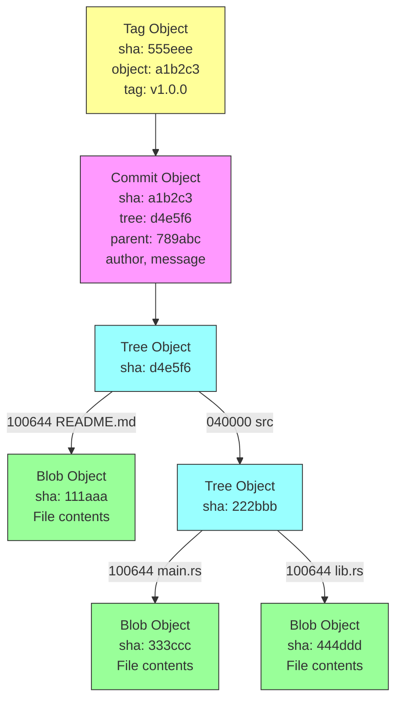
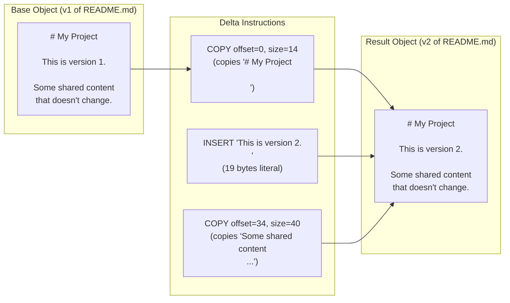
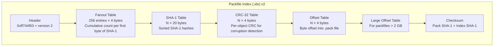
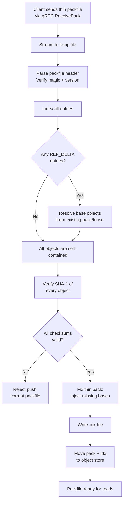
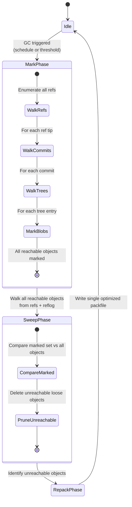

# 2. Object Storage and Delta Compression 🟡

> **The Problem:** A Git repository is not a list of diffs. It is a **content-addressable file system** — every file, directory tree, and commit is an immutable object identified by its SHA-1 hash. A naïve backend that stores each object individually would consume terabytes of disk for a large monorepo. Git solves this with **packfiles** — a binary format that uses delta compression to store 10,000 versions of a file in just a few megabytes. A hosting platform must understand packfile internals deeply: receiving thin packfiles from clients, indexing them for random access, running garbage collection, and repacking for optimal read performance. Get this wrong and you'll either waste 10× the disk space or serve fetches 100× slower than necessary.

---

## Git Is a Content-Addressable File System

Before diving into packfiles, we must understand the four fundamental Git object types. Every object in Git is stored as:

```
[type] [size]\0[content]
```

The SHA-1 hash of this byte sequence is the object's address. Two objects with identical content always have the same hash — deduplication is automatic and free.

### The Four Object Types



| Object Type | Content | Hash Input |
|---|---|---|
| **Blob** | Raw file contents | `blob {size}\0{bytes}` |
| **Tree** | List of `(mode, name, child_hash)` entries | `tree {size}\0{entries}` |
| **Commit** | Tree hash, parent hash(es), author, committer, message | `commit {size}\0{fields}` |
| **Tag** | Object hash, tag name, tagger, message | `tag {size}\0{fields}` |

### Why Not a Relational Database?

A common question from engineers new to Git internals: "Why not store everything in PostgreSQL?"

| Concern | Relational DB | Content-Addressable FS |
|---|---|---|
| Deduplication | Requires explicit dedup logic | Automatic (same content = same hash) |
| Integrity verification | Application-level checksums | Hash IS the address — corruption = missing object |
| Cross-repo sharing (forks) | Complex foreign keys | Trivial — objects are global by hash |
| Atomic snapshots | Transaction isolation | Commit hash = frozen snapshot of entire tree |
| Delta compression | Custom, per-table | Built into packfile format |
| Garbage collection | `DELETE` with cascading FK | Mark-and-sweep from reachable refs |
| Backup / replication | `pg_dump`, streaming replication | Copy object files, replicate refs |

The killer feature is **fork deduplication**. When a user forks a repository, zero objects are copied. The fork shares the same object pool and only diverges when the fork adds new commits. On a platform with millions of forks, this saves petabytes of storage.

---

## Loose Objects vs. Packfiles

Git stores objects in two formats:

### Loose Objects

Each object is stored as a single zlib-compressed file under `.git/objects/`:

```
.git/objects/
├── a1/
│   └── b2c3d4e5...   (commit)
├── d4/
│   └── e5f6a7b8...   (tree)
├── 11/
│   └── 1aaa2bbb...   (blob)
```

The first two hex characters of the SHA-1 hash are the directory name (fanout), and the remaining 38 characters are the filename.

```rust,ignore
use flate2::read::ZlibDecoder;
use flate2::write::ZlibEncoder;
use flate2::Compression;
use sha1::{Digest, Sha1};
use std::io::{Read, Write};
use std::path::PathBuf;

#[derive(Debug, Clone, Copy)]
enum ObjectType {
    Blob,
    Tree,
    Commit,
    Tag,
}

impl ObjectType {
    fn as_str(&self) -> &'static str {
        match self {
            ObjectType::Blob => "blob",
            ObjectType::Tree => "tree",
            ObjectType::Commit => "commit",
            ObjectType::Tag => "tag",
        }
    }
}

/// Write a loose object to the object store.
/// Returns the 20-byte SHA-1 hash.
fn write_loose_object(
    objects_dir: &std::path::Path,
    obj_type: ObjectType,
    content: &[u8],
) -> std::io::Result<[u8; 20]> {
    // Construct the header: "blob 1234\0"
    let header = format!("{} {}\0", obj_type.as_str(), content.len());

    // Hash the header + content to get the object ID.
    let mut hasher = Sha1::new();
    hasher.update(header.as_bytes());
    hasher.update(content);
    let hash: [u8; 20] = hasher.finalize().into();

    let hex = hex::encode(hash);
    let (dir_name, file_name) = hex.split_at(2);

    let dir_path = objects_dir.join(dir_name);
    std::fs::create_dir_all(&dir_path)?;

    let file_path = dir_path.join(file_name);

    // Compress with zlib and write atomically (write to temp, then rename).
    let temp_path = dir_path.join(format!("tmp_{file_name}"));
    {
        let file = std::fs::File::create(&temp_path)?;
        let mut encoder = ZlibEncoder::new(file, Compression::default());
        encoder.write_all(header.as_bytes())?;
        encoder.write_all(content)?;
        encoder.finish()?;
    }

    std::fs::rename(&temp_path, &file_path)?;

    Ok(hash)
}

/// Read a loose object from the object store.
fn read_loose_object(
    objects_dir: &std::path::Path,
    hash: &[u8; 20],
) -> std::io::Result<(ObjectType, Vec<u8>)> {
    let hex = hex::encode(hash);
    let (dir_name, file_name) = hex.split_at(2);
    let file_path = objects_dir.join(dir_name).join(file_name);

    let compressed = std::fs::read(&file_path)?;
    let mut decoder = ZlibDecoder::new(&compressed[..]);
    let mut decompressed = Vec::new();
    decoder.read_to_end(&mut decompressed)?;

    // Parse header: "blob 1234\0..."
    let null_pos = decompressed
        .iter()
        .position(|&b| b == 0)
        .ok_or_else(|| std::io::Error::new(std::io::ErrorKind::InvalidData, "missing null"))?;

    let header = std::str::from_utf8(&decompressed[..null_pos])
        .map_err(|e| std::io::Error::new(std::io::ErrorKind::InvalidData, e))?;

    let (type_str, _size_str) = header
        .split_once(' ')
        .ok_or_else(|| std::io::Error::new(std::io::ErrorKind::InvalidData, "bad header"))?;

    let obj_type = match type_str {
        "blob" => ObjectType::Blob,
        "tree" => ObjectType::Tree,
        "commit" => ObjectType::Commit,
        "tag" => ObjectType::Tag,
        _ => return Err(std::io::Error::new(std::io::ErrorKind::InvalidData, "unknown type")),
    };

    let content = decompressed[null_pos + 1..].to_vec();
    Ok((obj_type, content))
}
```

**Loose object problems at scale:**

- 1 million small files = 1 million inodes, 1 million directory entries.
- File-per-object storage wastes space on filesystem overhead (4 KB block minimum).
- Each object read requires: `open()` → `read()` → `zlib decompress` → `close()`.
- On spinning disks, random reads across millions of tiny files are catastrophically slow.

### Packfiles: The Solution

A packfile combines thousands of objects into a single binary file with an accompanying index for O(1) random access.

---

## Packfile Binary Format

A packfile (`.pack`) has three sections:

```
┌──────────────────────────────────────────────────────────┐
│  Header (12 bytes)                                       │
│  ┌──────────────┬────────────────┬─────────────────┐     │
│  │ "PACK"       │ Version (4B)   │ Num Objects (4B)│     │
│  │ 0x5041434b   │ 0x00000002     │ e.g., 47,231    │     │
│  └──────────────┴────────────────┴─────────────────┘     │
├──────────────────────────────────────────────────────────┤
│  Object Entries (variable length, repeated)               │
│  ┌────────────────────────────────────────────────┐      │
│  │ Entry 1: [type+size varint] [compressed data]  │      │
│  │ Entry 2: [type+size varint] [compressed data]  │      │
│  │ Entry 3: [OFS_DELTA] [base offset] [delta]     │      │
│  │ Entry 4: [REF_DELTA] [base SHA-1] [delta]      │      │
│  │ ...                                             │      │
│  └────────────────────────────────────────────────┘      │
├──────────────────────────────────────────────────────────┤
│  Trailer (20 bytes)                                      │
│  SHA-1 checksum of all preceding bytes                   │
└──────────────────────────────────────────────────────────┘
```

### Object Entry Types

There are six entry types, encoded in a variable-length integer:

| Type ID | Name | Description |
|---|---|---|
| 1 | `OBJ_COMMIT` | Full commit object (zlib-compressed) |
| 2 | `OBJ_TREE` | Full tree object (zlib-compressed) |
| 3 | `OBJ_BLOB` | Full blob object (zlib-compressed) |
| 4 | `OBJ_TAG` | Full tag object (zlib-compressed) |
| 6 | `OFS_DELTA` | Delta against an object at a byte offset within this packfile |
| 7 | `REF_DELTA` | Delta against an object identified by SHA-1 (used in thin packs) |

### The Variable-Length Integer Encoding

The type and uncompressed size are packed into a variable-length integer. The first byte encodes:

```
┌─┬───┬────────┐
│C│TTT│SSSS    │  C = continuation bit
└─┴───┴────────┘  T = object type (3 bits)
                   S = size bits (4 bits, then 7 bits per continuation byte)
```

```rust,ignore
/// Decode the type and size from a packfile entry header.
fn decode_pack_entry_header(data: &[u8]) -> (ObjectType, u64, usize) {
    let first = data[0];
    let type_id = (first >> 4) & 0x07;
    let mut size = (first & 0x0f) as u64;
    let mut shift = 4;
    let mut offset = 1;

    // Continuation bytes: MSB set means more bytes follow.
    let mut byte = first;
    while byte & 0x80 != 0 {
        byte = data[offset];
        size |= ((byte & 0x7f) as u64) << shift;
        shift += 7;
        offset += 1;
    }

    let obj_type = match type_id {
        1 => ObjectType::Commit,
        2 => ObjectType::Tree,
        3 => ObjectType::Blob,
        4 => ObjectType::Tag,
        // 6 and 7 are delta types — handled separately
        _ => panic!("unexpected type_id: {type_id}"),
    };

    (obj_type, size, offset)
}
```

---

## Delta Compression: The Heart of Packfile Efficiency

Delta compression is how Git stores 10,000 versions of a file in a few megabytes. Instead of storing each version in full, Git stores one **base object** and a chain of **delta instructions** that transform the base into derived versions.

### Delta Instruction Format

A delta is a sequence of **copy** and **insert** instructions:



| Instruction | Encoding | Meaning |
|---|---|---|
| **COPY** | MSB = 1, followed by offset and size bytes | Copy `size` bytes starting at `offset` from the base object |
| **INSERT** | MSB = 0, followed by `N` literal bytes | Insert the next `N` bytes literally into the output |

### Delta Application in Rust

```rust,ignore
/// Apply a Git delta to a base object, producing the result object.
fn apply_delta(base: &[u8], delta: &[u8]) -> anyhow::Result<Vec<u8>> {
    let mut pos = 0;

    // Decode base object size (varint).
    let (base_size, consumed) = decode_varint(&delta[pos..]);
    pos += consumed;
    anyhow::ensure!(
        base_size as usize == base.len(),
        "base size mismatch: expected {base_size}, got {}",
        base.len()
    );

    // Decode result object size (varint).
    let (result_size, consumed) = decode_varint(&delta[pos..]);
    pos += consumed;

    let mut result = Vec::with_capacity(result_size as usize);

    while pos < delta.len() {
        let cmd = delta[pos];
        pos += 1;

        if cmd & 0x80 != 0 {
            // ── COPY instruction ──
            // The lower 7 bits indicate which of the next bytes encode offset and size.
            let mut offset: u32 = 0;
            let mut size: u32 = 0;

            if cmd & 0x01 != 0 { offset |= (delta[pos] as u32); pos += 1; }
            if cmd & 0x02 != 0 { offset |= (delta[pos] as u32) << 8; pos += 1; }
            if cmd & 0x04 != 0 { offset |= (delta[pos] as u32) << 16; pos += 1; }
            if cmd & 0x08 != 0 { offset |= (delta[pos] as u32) << 24; pos += 1; }

            if cmd & 0x10 != 0 { size |= (delta[pos] as u32); pos += 1; }
            if cmd & 0x20 != 0 { size |= (delta[pos] as u32) << 8; pos += 1; }
            if cmd & 0x40 != 0 { size |= (delta[pos] as u32) << 16; pos += 1; }

            if size == 0 { size = 0x10000; } // Special case: size 0 means 65536.

            let start = offset as usize;
            let end = start + size as usize;
            anyhow::ensure!(end <= base.len(), "COPY out of bounds");
            result.extend_from_slice(&base[start..end]);
        } else if cmd > 0 {
            // ── INSERT instruction ──
            // cmd is the number of literal bytes to insert.
            let n = cmd as usize;
            anyhow::ensure!(pos + n <= delta.len(), "INSERT out of bounds");
            result.extend_from_slice(&delta[pos..pos + n]);
            pos += n;
        } else {
            anyhow::bail!("unexpected delta command byte: 0x00");
        }
    }

    anyhow::ensure!(
        result.len() == result_size as usize,
        "result size mismatch: expected {result_size}, got {}",
        result.len()
    );

    Ok(result)
}

/// Decode a Git-style variable-length integer.
fn decode_varint(data: &[u8]) -> (u64, usize) {
    let mut value = 0u64;
    let mut shift = 0;
    let mut pos = 0;

    loop {
        let byte = data[pos];
        value |= ((byte & 0x7f) as u64) << shift;
        pos += 1;
        if byte & 0x80 == 0 {
            break;
        }
        shift += 7;
    }

    (value, pos)
}
```

### Delta Chains

Deltas can be chained: object A is a delta against B, which is a delta against C, which is a full base object. To reconstruct A, you must:

1. Read C (full object).
2. Apply B's delta to get B.
3. Apply A's delta to get A.

**Chain depth limits are critical.** Git defaults to a maximum chain depth of 50. Deeper chains mean slower reads because each reconstruction requires traversing the entire chain. A hosting platform enforcing aggressive repacking should target chain depths of 10–20 for frequently-accessed repositories.

```
Delta Chain:  obj_A → obj_B → obj_C → obj_D (base)
Depth:          3       2       1       0

To read obj_A:
  1. Read obj_D (base)         → decompress
  2. Apply obj_C delta to D    → decompress + apply
  3. Apply obj_B delta to C    → decompress + apply
  4. Apply obj_A delta to B    → decompress + apply
  Total: 4 decompressions + 3 delta applications
```

---

## The Packfile Index (.idx)

A packfile without an index requires a linear scan to find any object. The `.idx` file provides O(1) lookups:



### Fanout Table Lookup

The fanout table has 256 entries. Entry `i` contains the total number of objects whose SHA-1 starts with a byte ≤ `i`. This enables binary search within a narrow range:

```rust,ignore
struct PackIndex {
    fanout: [u32; 256],
    sha1_table: Vec<[u8; 20]>,   // Sorted by SHA-1
    crc32_table: Vec<u32>,
    offset_table: Vec<u32>,       // 4-byte offsets (MSB set → use large offset table)
    large_offsets: Vec<u64>,      // For packfiles > 2 GB
}

impl PackIndex {
    /// Look up an object by SHA-1 hash. Returns the byte offset in the packfile.
    fn find_offset(&self, hash: &[u8; 20]) -> Option<u64> {
        let first_byte = hash[0] as usize;

        // Fanout narrows the binary search range.
        let lo = if first_byte == 0 { 0 } else { self.fanout[first_byte - 1] as usize };
        let hi = self.fanout[first_byte] as usize;

        // Binary search within [lo, hi) in the sorted SHA-1 table.
        let idx = self.sha1_table[lo..hi]
            .binary_search(hash)
            .ok()
            .map(|i| lo + i)?;

        let raw_offset = self.offset_table[idx];
        if raw_offset & 0x80000000 != 0 {
            // MSB set → index into large offset table.
            let large_idx = (raw_offset & 0x7fffffff) as usize;
            Some(self.large_offsets[large_idx])
        } else {
            Some(raw_offset as u64)
        }
    }
}
```

### Lookup Performance

| Step | Time |
|---|---|
| Fanout table lookup | O(1) — single array index |
| Binary search in SHA-1 range | O(log N) where N ≈ total_objects / 256 |
| Offset table read | O(1) — single array index |
| **Total** | **O(log N)** — typically 3–5 comparisons for 1M objects |

For a repository with 1 million objects:

```
Fanout narrows to: ~1M / 256 ≈ 3,906 entries
Binary search: log₂(3906) ≈ 12 comparisons
Each comparison: 20-byte memcmp
Total: ~240 bytes compared — fits in a single cache line burst
```

---

## Thin Packfiles and the Receive Pipeline

When a client pushes via `git push`, it sends a **thin packfile** — a packfile that contains `REF_DELTA` entries referencing base objects that exist on the server but are not included in the packfile itself. This dramatically reduces push payload size.

### The Receive Pipeline



```rust,ignore
/// Process an incoming thin packfile from a client push.
struct PackfileReceiver {
    repo_path: PathBuf,
    existing_packs: Vec<PackIndex>,
    temp_dir: PathBuf,
}

impl PackfileReceiver {
    /// Receive, validate, and index an incoming packfile.
    async fn receive(
        &self,
        mut stream: impl tokio::io::AsyncRead + Unpin,
    ) -> anyhow::Result<PackfileReceipt> {
        // 1. Stream the packfile to a temp file (never hold entire pack in memory).
        let temp_pack = self.temp_dir.join(format!("incoming-{}.pack", uuid::Uuid::new_v4()));
        let mut file = tokio::fs::File::create(&temp_pack).await?;
        let bytes_written = tokio::io::copy(&mut stream, &mut file).await?;
        file.sync_all().await?;

        // 2. Parse and index the packfile.
        let entries = parse_pack_entries(&temp_pack).await?;
        let mut objects_added = 0u64;
        let mut deltas_resolved = 0u64;

        for entry in &entries {
            match entry {
                PackEntry::Full { hash, .. } => {
                    // Full object — just verify the hash.
                    verify_object_hash(entry)?;
                    objects_added += 1;
                }
                PackEntry::RefDelta { base_hash, delta, .. } => {
                    // Thin pack delta — resolve base from existing storage.
                    let base = self.resolve_existing_object(base_hash)?;
                    let result = apply_delta(&base, delta)?;
                    verify_object_hash_from_content(&result)?;
                    deltas_resolved += 1;
                    objects_added += 1;
                }
                PackEntry::OfsDelta { .. } => {
                    // Offset delta — base is within this packfile.
                    objects_added += 1;
                }
            }
        }

        // 3. "Thicken" the pack: append missing base objects so the pack is self-contained.
        let thickened_pack = thicken_packfile(&temp_pack, &entries, &self.existing_packs).await?;

        // 4. Generate the .idx file.
        let idx_path = generate_pack_index(&thickened_pack).await?;

        // 5. Atomically move into the object store.
        let final_pack = self.repo_path.join("objects/pack").join(
            thickened_pack.file_name().unwrap(),
        );
        let final_idx = self.repo_path.join("objects/pack").join(
            idx_path.file_name().unwrap(),
        );

        tokio::fs::rename(&thickened_pack, &final_pack).await?;
        tokio::fs::rename(&idx_path, &final_idx).await?;

        Ok(PackfileReceipt {
            objects_added,
            deltas_resolved,
            pack_size: bytes_written,
        })
    }

    fn resolve_existing_object(&self, hash: &[u8; 20]) -> anyhow::Result<Vec<u8>> {
        for pack_idx in &self.existing_packs {
            if let Some(offset) = pack_idx.find_offset(hash) {
                return read_object_at_offset(&pack_idx.pack_path, offset);
            }
        }
        anyhow::bail!("base object {} not found", hex::encode(hash))
    }
}
```

---

## Garbage Collection and Repacking

Over time, a repository accumulates many small packfiles (one per push) and loose objects. Garbage collection (GC) consolidates them into a single optimized packfile.

### The GC Pipeline



### Reachability Walk

```rust,ignore
use std::collections::HashSet;

struct GarbageCollector {
    object_store: Arc<ObjectStore>,
    ref_store: Arc<RefStore>,
}

impl GarbageCollector {
    /// Mark all reachable objects starting from all references.
    async fn mark_reachable(&self) -> anyhow::Result<HashSet<[u8; 20]>> {
        let mut reachable = HashSet::new();
        let mut queue = Vec::new();

        // Seed the queue with all ref targets.
        let refs = self.ref_store.list_all_refs().await?;
        for reference in refs {
            queue.push(reference.target_oid);
        }

        // Also include reflog entries (protects recently-dereferenced commits).
        let reflog_entries = self.ref_store.list_reflog_entries().await?;
        for entry in reflog_entries {
            queue.push(entry.new_oid);
            if entry.old_oid != [0u8; 20] {
                queue.push(entry.old_oid);
            }
        }

        // BFS walk through the object graph.
        while let Some(oid) = queue.pop() {
            if !reachable.insert(oid) {
                continue; // Already visited.
            }

            let (obj_type, content) = self.object_store.read_object(&oid).await?;

            match obj_type {
                ObjectType::Commit => {
                    let commit = parse_commit(&content)?;
                    queue.push(commit.tree_oid);
                    for parent in commit.parent_oids {
                        queue.push(parent);
                    }
                }
                ObjectType::Tree => {
                    let entries = parse_tree(&content)?;
                    for entry in entries {
                        queue.push(entry.oid);
                    }
                }
                ObjectType::Tag => {
                    let tag = parse_tag(&content)?;
                    queue.push(tag.target_oid);
                }
                ObjectType::Blob => {
                    // Blobs are leaf nodes — nothing to traverse.
                }
            }
        }

        Ok(reachable)
    }

    /// Run full garbage collection.
    async fn run_gc(&self) -> anyhow::Result<GcStats> {
        // Phase 1: Mark all reachable objects.
        let reachable = self.mark_reachable().await?;

        // Phase 2: Enumerate all known objects.
        let all_objects = self.object_store.list_all_object_ids().await?;
        let total = all_objects.len();

        // Phase 3: Prune unreachable loose objects.
        let mut pruned = 0;
        for oid in &all_objects {
            if !reachable.contains(oid) {
                self.object_store.delete_loose_object(oid).await?;
                pruned += 1;
            }
        }

        // Phase 4: Repack all reachable objects into a single optimized packfile.
        let pack_stats = self.object_store.repack_all(&reachable).await?;

        Ok(GcStats {
            reachable_objects: reachable.len(),
            total_objects: total,
            pruned_objects: pruned,
            final_pack_size: pack_stats.pack_size,
            delta_chains_optimized: pack_stats.deltas,
        })
    }
}
```

### Repacking Strategy: Choosing Delta Bases

The quality of delta compression depends on choosing good base objects. Git's heuristic for finding good delta pairs:

| Heuristic | Rationale |
|---|---|
| Same filename, different version | Consecutive versions of `main.rs` delta well against each other |
| Similar file size | Objects of vastly different sizes rarely produce small deltas |
| Recency bias | Newer objects should be full bases; older objects should be deltas (new objects are accessed more often) |
| Type matching | Only delta blobs against blobs, trees against trees |

```rust,ignore
/// Sort objects for delta compression candidate selection.
/// Git sorts by: (type, basename, size descending)
fn sort_for_delta_selection(objects: &mut Vec<ObjectInfo>) {
    objects.sort_by(|a, b| {
        a.obj_type
            .cmp(&b.obj_type)
            .then_with(|| a.basename.cmp(&b.basename))
            .then_with(|| b.size.cmp(&a.size)) // Larger objects first (better bases)
    });
}

/// Try to delta-compress `target` against `base`.
/// Returns None if the delta is larger than a threshold.
fn try_delta(base: &[u8], target: &[u8], max_delta_size: usize) -> Option<Vec<u8>> {
    let delta = compute_delta(base, target);
    if delta.len() < max_delta_size && delta.len() < target.len() {
        Some(delta)
    } else {
        None // Not worth storing as a delta.
    }
}
```

---

## Storage Layout for a Hosting Platform

A single server might host 100,000 repositories. The storage layout must support efficient per-repository access and cross-repository object sharing (for forks).

```
/data/git/
├── repos/
│   ├── ab/                          # Fanout by first 2 chars of repo hash
│   │   ├── cd1234.../               # Repository directory (hashed path)
│   │   │   ├── objects/
│   │   │   │   ├── pack/
│   │   │   │   │   ├── pack-abc123.pack
│   │   │   │   │   └── pack-abc123.idx
│   │   │   │   └── info/
│   │   │   ├── refs/
│   │   │   │   ├── heads/
│   │   │   │   │   └── main
│   │   │   │   └── tags/
│   │   │   └── HEAD
│   │   └── ...
│   └── ...
├── alternates/                       # Shared object pools for fork networks
│   └── network-789abc/
│       └── objects/
│           └── pack/
│               ├── pack-shared.pack
│               └── pack-shared.idx
└── quarantine/                       # Incoming objects before verification
    └── tmp-push-uuid/
        └── objects/
```

### Fork Networks and Alternates

When user B forks user A's repository, the platform:

1. Creates a new repository directory for B's fork.
2. Writes an `objects/info/alternates` file pointing to A's object store (or the shared network pool).
3. B's fork has **zero objects** initially — all reads fall through to the alternate.
4. When B pushes new commits, only the new objects are stored in B's repository.

```rust,ignore
/// Create a fork by setting up an alternates file.
async fn create_fork(
    source_repo: &std::path::Path,
    fork_repo: &std::path::Path,
) -> anyhow::Result<()> {
    // Create the fork's directory structure.
    tokio::fs::create_dir_all(fork_repo.join("objects/pack")).await?;
    tokio::fs::create_dir_all(fork_repo.join("refs/heads")).await?;

    // Point the fork's alternates to the source's object store.
    let alternates_path = fork_repo.join("objects/info/alternates");
    let source_objects = source_repo.join("objects").canonicalize()?;
    tokio::fs::write(&alternates_path, source_objects.to_str().unwrap()).await?;

    // Copy refs (branches and tags) — these are tiny files.
    copy_refs(source_repo, fork_repo).await?;

    // Copy HEAD.
    tokio::fs::copy(source_repo.join("HEAD"), fork_repo.join("HEAD")).await?;

    Ok(())
}
```

---

## Space Savings: A Real-World Example

Consider a repository with 10,000 commits, each modifying a single 100 KB source file:

| Storage Method | Size | Ratio |
|---|---|---|
| 10,000 full copies | 1,000 MB | 1.0× |
| 10,000 zlib-compressed loose objects | ~300 MB | 0.3× |
| Single packfile with delta compression | ~15 MB | 0.015× |
| Packfile + aggressive repack (depth 50) | ~8 MB | 0.008× |

Delta compression achieves **~125× compression** because consecutive versions of a file differ by only a few lines. Each delta instruction is typically a few hundred bytes (COPY most of the file, INSERT the changed lines).

---

> **Key Takeaways**
>
> 1. **Git is a content-addressable file system, not a diff tracker.** Every object is immutable and identified by its SHA-1 hash. This gives you automatic deduplication and integrity verification for free.
> 2. **Packfiles are the production storage format.** Loose objects are fine for a developer's laptop but catastrophic at scale. A single packfile with an index provides O(log N) lookups and delta compression ratios of 100×+.
> 3. **Delta compression turns 10,000 file versions into megabytes.** The COPY/INSERT instruction format exploits the fact that consecutive versions of a file share >95% of their content.
> 4. **Thin packfiles minimize push bandwidth.** Clients only send objects the server is missing, using REF_DELTA entries that reference objects already on the server.
> 5. **Fork networks share object pools.** Using Git's alternates mechanism, a million forks of a popular repository add near-zero storage overhead. Only divergent commits consume new space.
> 6. **Garbage collection is essential.** Unreachable objects (from force-pushes, rebases, deleted branches) must be identified via reachability walk and pruned. Repacking consolidates fragmented packfiles into a single optimized file.
