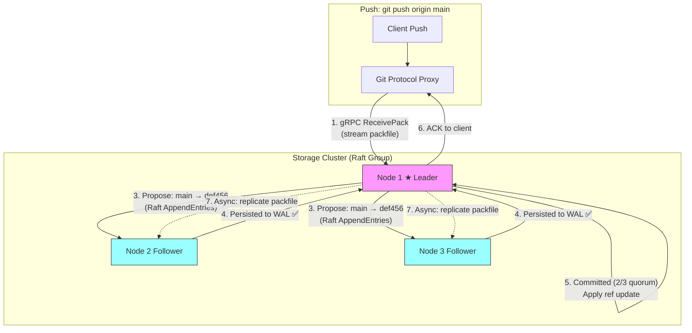
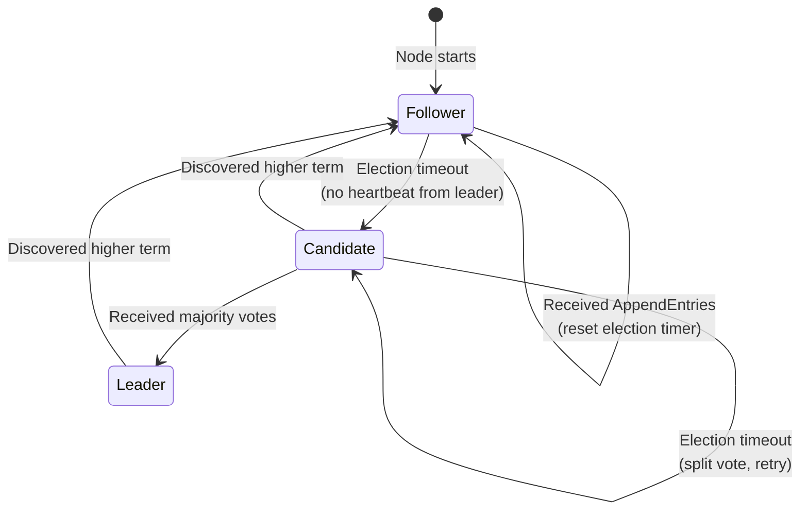
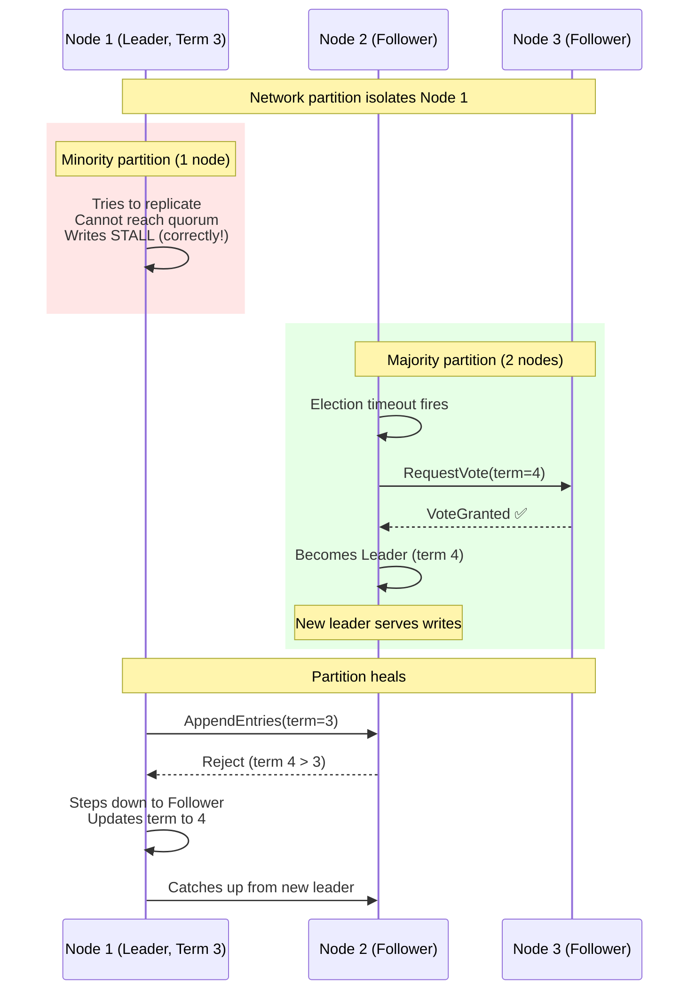
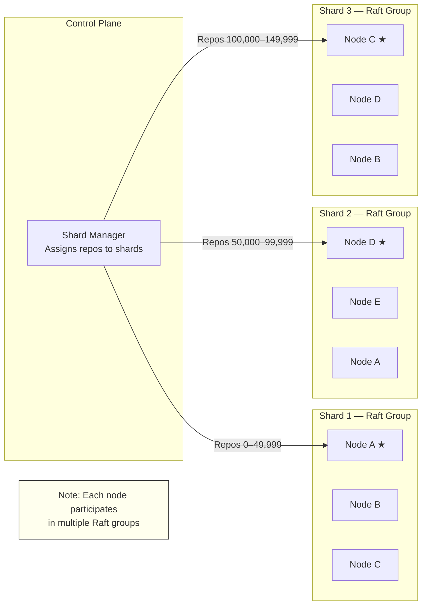

# 3. High Availability and Raft Consensus 🔴

> **The Problem:** A single storage node holding a repository is a single point of failure. When that node dies — disk failure, kernel panic, power supply explosion — every repository it hosts becomes unavailable. For a platform serving 100 million repositories, even a 0.1% failure rate means 100,000 repositories down simultaneously. We need a replication system that synchronously copies Git reference updates to multiple physical nodes, guarantees that an acknowledged push survives any single-node failure, and automatically elects a new leader within seconds — all without introducing split-brain scenarios where two nodes both think they're the leader and accept conflicting writes.

---

## Why Replication Is Non-Negotiable

| Scenario | Single Node | 3-Node Replication |
|---|---|---|
| Disk failure | **Total data loss** for all repos on that disk | Automatic failover, zero data loss |
| Node reboot | Minutes of downtime | Sub-second failover to follower |
| Network partition | Node unreachable = repos unavailable | Majority partition continues serving |
| Datacenter outage | All repos in that DC are down | Cross-DC replicas serve traffic |
| Corrupted packfile | Silent data corruption | CRC mismatch detected, read from healthy replica |

### What Exactly Do We Replicate?

A Git repository has two categories of data with very different replication requirements:

| Data | Size | Mutation Frequency | Consistency Requirement |
|---|---|---|---|
| **Objects** (blobs, trees, commits) | GBs per repo | Append-only (immutable once written) | Eventual — objects are content-addressed, can't conflict |
| **References** (branch pointers, tags) | Bytes per ref | Every push | **Strong** — a CAS update on `refs/heads/main` must be linearizable |

This distinction drives our architecture:

- **Objects** are replicated asynchronously — stream packfiles to followers after the push is acknowledged.
- **References** are replicated synchronously through Raft — a reference update is only acknowledged after a quorum (2 of 3) nodes have persisted it.



---

## Raft Consensus: The 30,000-Foot View

Raft is a consensus algorithm that ensures a replicated log of commands is applied in the same order on all nodes. It decomposes consensus into three sub-problems:

1. **Leader Election** — At most one leader at a time.
2. **Log Replication** — The leader replicates entries to followers.
3. **Safety** — If any node has applied an entry at a given index, no other node will apply a different entry at that index.

### Raft State Machine for Git Refs

In our system, the "replicated log" contains reference update commands:

```
Log Index | Term | Command
----------|------|----------------------------------------
1         | 1    | UpdateRef(repo:42, main, 000000→abc123)
2         | 1    | UpdateRef(repo:42, main, abc123→def456)
3         | 1    | UpdateRef(repo:99, dev,  000000→789abc)
4         | 2    | UpdateRef(repo:42, main, def456→fedcba)
```

When an entry is **committed** (replicated to a quorum), the state machine applies it: the in-memory ref map is updated, and the ref file on disk is overwritten.

### Node States



---

## Implementing Raft for Git Reference Replication

### The Raft Node

```rust,ignore
use std::collections::BTreeMap;
use std::sync::Arc;
use tokio::sync::{mpsc, Mutex, RwLock};
use tokio::time::{Duration, Instant};

#[derive(Debug, Clone, Copy, PartialEq, Eq)]
enum NodeRole {
    Follower,
    Candidate,
    Leader,
}

#[derive(Debug, Clone)]
struct LogEntry {
    index: u64,
    term: u64,
    command: RefUpdateCommand,
}

#[derive(Debug, Clone)]
struct RefUpdateCommand {
    repository_id: String,
    ref_name: String,
    old_oid: [u8; 20],
    new_oid: [u8; 20],
}

struct RaftState {
    // Persistent state (must survive restarts).
    current_term: u64,
    voted_for: Option<u64>,          // Node ID we voted for in current term
    log: Vec<LogEntry>,               // The replicated log

    // Volatile state.
    commit_index: u64,                 // Highest log index known to be committed
    last_applied: u64,                 // Highest log index applied to state machine
    role: NodeRole,
    leader_id: Option<u64>,

    // Leader-only volatile state.
    next_index: BTreeMap<u64, u64>,    // For each follower: next log index to send
    match_index: BTreeMap<u64, u64>,   // For each follower: highest replicated index
}

struct RaftNode {
    node_id: u64,
    peers: Vec<PeerInfo>,
    state: Arc<RwLock<RaftState>>,
    wal: Arc<WriteAheadLog>,           // Persistent log storage
    ref_store: Arc<RefStore>,          // Git reference state machine
    transport: Arc<dyn RaftTransport>, // gRPC client to peers
    election_timeout: Duration,
    heartbeat_interval: Duration,
}

#[derive(Debug, Clone)]
struct PeerInfo {
    node_id: u64,
    addr: String,
}
```

### Leader Election

```rust,ignore
impl RaftNode {
    /// Run the election timeout loop. If no heartbeat is received,
    /// transition to Candidate and start an election.
    async fn run_election_timer(&self) {
        loop {
            let timeout = self.randomized_election_timeout();
            tokio::time::sleep(timeout).await;

            let state = self.state.read().await;
            if state.role == NodeRole::Leader {
                continue; // Leaders don't time out.
            }
            drop(state);

            self.start_election().await;
        }
    }

    /// Randomized timeout to prevent split votes.
    /// Base: 150ms, jitter: 0–150ms → range [150ms, 300ms].
    fn randomized_election_timeout(&self) -> Duration {
        use rand::Rng;
        let jitter = rand::thread_rng().gen_range(0..150);
        Duration::from_millis(150 + jitter)
    }

    async fn start_election(&self) {
        let mut state = self.state.write().await;

        // Transition to Candidate.
        state.current_term += 1;
        state.role = NodeRole::Candidate;
        state.voted_for = Some(self.node_id);
        state.leader_id = None;

        let term = state.current_term;
        let last_log_index = state.log.last().map(|e| e.index).unwrap_or(0);
        let last_log_term = state.log.last().map(|e| e.term).unwrap_or(0);

        // Persist vote before sending RPCs.
        self.wal
            .persist_vote(term, self.node_id)
            .await
            .expect("WAL write failed");

        drop(state);

        // Request votes from all peers in parallel.
        let mut vote_count = 1u32; // Vote for self.
        let majority = (self.peers.len() as u32 + 1) / 2 + 1;

        let mut vote_futures = Vec::new();
        for peer in &self.peers {
            let transport = self.transport.clone();
            let peer_id = peer.node_id;
            let addr = peer.addr.clone();

            vote_futures.push(tokio::spawn(async move {
                transport
                    .request_vote(
                        &addr,
                        RequestVoteArgs {
                            term,
                            candidate_id: peer_id,
                            last_log_index,
                            last_log_term,
                        },
                    )
                    .await
            }));
        }

        for future in vote_futures {
            if let Ok(Ok(reply)) = future.await {
                let mut state = self.state.write().await;

                if reply.term > state.current_term {
                    // Discovered a higher term — step down.
                    state.current_term = reply.term;
                    state.role = NodeRole::Follower;
                    state.voted_for = None;
                    return;
                }

                if reply.vote_granted {
                    vote_count += 1;
                }

                if vote_count >= majority && state.role == NodeRole::Candidate {
                    // Won the election!
                    state.role = NodeRole::Leader;
                    state.leader_id = Some(self.node_id);

                    // Initialize next_index for each follower.
                    let next = state.log.last().map(|e| e.index + 1).unwrap_or(1);
                    for peer in &self.peers {
                        state.next_index.insert(peer.node_id, next);
                        state.match_index.insert(peer.node_id, 0);
                    }

                    tracing::info!(
                        node_id = self.node_id,
                        term,
                        "elected leader"
                    );
                    return;
                }
            }
        }
    }
}
```

### Log Replication

When the leader receives a `UpdateRef` proposal:

```rust,ignore
impl RaftNode {
    /// Propose a reference update. Only the leader can propose.
    /// Blocks until the entry is committed to a quorum.
    async fn propose_ref_update(
        &self,
        repo_id: &str,
        ref_name: &str,
        old_oid: &[u8; 20],
        new_oid: &[u8; 20],
    ) -> anyhow::Result<()> {
        let (commit_tx, commit_rx) = tokio::sync::oneshot::channel();

        {
            let mut state = self.state.write().await;

            if state.role != NodeRole::Leader {
                anyhow::bail!(
                    "not leader; current leader is {:?}",
                    state.leader_id
                );
            }

            let index = state.log.last().map(|e| e.index + 1).unwrap_or(1);
            let entry = LogEntry {
                index,
                term: state.current_term,
                command: RefUpdateCommand {
                    repository_id: repo_id.to_string(),
                    ref_name: ref_name.to_string(),
                    old_oid: *old_oid,
                    new_oid: *new_oid,
                },
            };

            // Persist to local WAL first.
            self.wal.append(&entry).await?;
            state.log.push(entry);
        }

        // Replicate to followers (done by the replication loop).
        // Wait for commit notification.
        self.replicate_to_followers().await;

        // Block until the commit index advances past our entry.
        commit_rx
            .await
            .map_err(|_| anyhow::anyhow!("commit notification dropped"))?;

        Ok(())
    }

    /// Send AppendEntries RPCs to all followers.
    async fn replicate_to_followers(&self) {
        let state = self.state.read().await;
        if state.role != NodeRole::Leader {
            return;
        }

        let term = state.current_term;
        let commit_index = state.commit_index;

        for peer in &self.peers {
            let next_idx = *state.next_index.get(&peer.node_id).unwrap_or(&1);
            let entries: Vec<LogEntry> = state
                .log
                .iter()
                .filter(|e| e.index >= next_idx)
                .cloned()
                .collect();

            let prev_log_index = next_idx.saturating_sub(1);
            let prev_log_term = state
                .log
                .iter()
                .find(|e| e.index == prev_log_index)
                .map(|e| e.term)
                .unwrap_or(0);

            let transport = self.transport.clone();
            let addr = peer.addr.clone();
            let peer_id = peer.node_id;
            let state_ref = self.state.clone();

            tokio::spawn(async move {
                let result = transport
                    .append_entries(
                        &addr,
                        AppendEntriesArgs {
                            term,
                            leader_id: 0, // self.node_id
                            prev_log_index,
                            prev_log_term,
                            entries: entries.clone(),
                            leader_commit: commit_index,
                        },
                    )
                    .await;

                match result {
                    Ok(reply) if reply.success => {
                        let mut state = state_ref.write().await;
                        if let Some(last) = entries.last() {
                            state.next_index.insert(peer_id, last.index + 1);
                            state.match_index.insert(peer_id, last.index);
                        }
                    }
                    Ok(reply) if reply.term > term => {
                        let mut state = state_ref.write().await;
                        state.current_term = reply.term;
                        state.role = NodeRole::Follower;
                    }
                    Ok(_) => {
                        // Log inconsistency — decrement next_index and retry.
                        let mut state = state_ref.write().await;
                        let next = state.next_index.entry(peer_id).or_insert(1);
                        *next = next.saturating_sub(1).max(1);
                    }
                    Err(e) => {
                        tracing::warn!(peer_id, error = %e, "AppendEntries failed");
                    }
                }
            });
        }
    }

    /// Advance the commit index based on quorum acknowledgment.
    async fn advance_commit_index(&self) {
        let mut state = self.state.write().await;
        if state.role != NodeRole::Leader {
            return;
        }

        let total_nodes = self.peers.len() + 1; // Peers + self
        let majority = total_nodes / 2 + 1;

        // Find the highest index replicated to a majority.
        let last_log_index = state.log.last().map(|e| e.index).unwrap_or(0);

        for n in (state.commit_index + 1..=last_log_index).rev() {
            // Count how many nodes have this entry.
            let mut count = 1; // Leader always has it.
            for peer in &self.peers {
                if *state.match_index.get(&peer.node_id).unwrap_or(&0) >= n {
                    count += 1;
                }
            }

            // Only commit entries from the current term (Raft safety property).
            let entry_term = state.log.iter().find(|e| e.index == n).map(|e| e.term);
            if count >= majority && entry_term == Some(state.current_term) {
                state.commit_index = n;
                break;
            }
        }
    }
}
```

### Applying Committed Entries to the State Machine

```rust,ignore
impl RaftNode {
    /// Apply all committed but not-yet-applied entries to the Git ref store.
    async fn apply_committed_entries(&self) -> anyhow::Result<()> {
        let mut state = self.state.write().await;

        while state.last_applied < state.commit_index {
            state.last_applied += 1;
            let entry = state
                .log
                .iter()
                .find(|e| e.index == state.last_applied)
                .cloned()
                .ok_or_else(|| anyhow::anyhow!("missing log entry {}", state.last_applied))?;

            let cmd = &entry.command;

            // Apply the reference update to the Git ref store.
            // This is a compare-and-swap: if old_oid doesn't match, the update fails.
            self.ref_store
                .compare_and_swap(
                    &cmd.repository_id,
                    &cmd.ref_name,
                    &cmd.old_oid,
                    &cmd.new_oid,
                )
                .await?;

            tracing::info!(
                index = entry.index,
                repo = %cmd.repository_id,
                ref_name = %cmd.ref_name,
                "applied ref update"
            );
        }

        Ok(())
    }
}
```

---

## Preventing Split-Brain During Network Partitions

The most dangerous failure mode in a distributed system is **split-brain**: two nodes both believe they are the leader and accept conflicting writes. Raft prevents this through the **term** mechanism and **quorum requirement**.

### Scenario: Network Partition



### Why Split-Brain Is Impossible

1. **Term monotonicity:** Terms only increase. A leader in term 3 can never accept a write once any node has moved to term 4.
2. **Quorum overlap:** In a 3-node cluster, a quorum is 2. Any two quorums must share at least one node. This node will reject the old leader's writes because it has already voted for the new term.
3. **Log safety:** A candidate can only win an election if its log is at least as up-to-date as the majority. This prevents electing a node that missed committed entries.

### The Fencing Token Pattern

For extra safety, every reference update carries a **fencing token** — the Raft term and log index at which the update was committed. Storage nodes reject writes with stale fencing tokens:

```rust,ignore
#[derive(Debug, Clone)]
struct FencedRefUpdate {
    ref_name: String,
    old_oid: [u8; 20],
    new_oid: [u8; 20],
    /// Fencing token: (term, log_index) at which this update was committed.
    committed_term: u64,
    committed_index: u64,
}

struct RefStore {
    /// (repo_id, ref_name) → (current_oid, last_committed_term, last_committed_index)
    refs: DashMap<(String, String), RefState>,
}

#[derive(Debug, Clone)]
struct RefState {
    oid: [u8; 20],
    last_term: u64,
    last_index: u64,
}

impl RefStore {
    fn apply_fenced_update(&self, repo_id: &str, update: &FencedRefUpdate) -> anyhow::Result<()> {
        let key = (repo_id.to_string(), update.ref_name.clone());

        let mut entry = self.refs.entry(key).or_insert(RefState {
            oid: [0u8; 20],
            last_term: 0,
            last_index: 0,
        });

        // Reject stale updates (from a deposed leader).
        if update.committed_term < entry.last_term
            || (update.committed_term == entry.last_term
                && update.committed_index <= entry.last_index)
        {
            anyhow::bail!(
                "stale fencing token: update({}, {}) <= current({}, {})",
                update.committed_term,
                update.committed_index,
                entry.last_term,
                entry.last_index,
            );
        }

        // CAS check: old_oid must match.
        if entry.oid != update.old_oid {
            anyhow::bail!(
                "CAS failure: expected {}, got {}",
                hex::encode(update.old_oid),
                hex::encode(entry.oid),
            );
        }

        entry.oid = update.new_oid;
        entry.last_term = update.committed_term;
        entry.last_index = update.committed_index;

        Ok(())
    }
}
```

---

## Shard Assignment and Raft Group Management

With 100 million repositories, we cannot have one Raft group per repository — that would be 100 million Raft groups, each requiring independent leader elections and heartbeats. Instead, we shard repositories into **Raft groups** that each manage thousands of repositories.

### Sharding Strategy



| Parameter | Value | Rationale |
|---|---|---|
| Repos per shard | 10,000–50,000 | Balance between granularity and Raft overhead |
| Nodes per Raft group | 3 (or 5 for critical shards) | 3 tolerates 1 failure; 5 tolerates 2 |
| Raft groups per node | 100–500 | Multi-Raft: one node participates in many groups |
| Heartbeat interval | 100 ms | Fast failure detection |
| Election timeout | 300–500 ms (randomized) | Must be > 2× heartbeat for stability |

### Multi-Raft: Batching Heartbeats

A node participating in 500 Raft groups would send 500 × 2 = 1,000 heartbeat RPCs every 100 ms. This is wasteful. Multi-Raft batches heartbeats from multiple groups into a single network round-trip:

```rust,ignore
/// Batched heartbeat for all Raft groups on this node destined for a single peer.
struct BatchedHeartbeat {
    /// Source node ID.
    from_node: u64,
    /// One heartbeat per Raft group where this node is leader.
    groups: Vec<GroupHeartbeat>,
}

struct GroupHeartbeat {
    shard_id: u64,
    term: u64,
    leader_commit: u64,
}

/// Send batched heartbeats to each peer.
async fn send_batched_heartbeats(
    node_id: u64,
    groups: &[Arc<RaftNode>],
    transport: &dyn RaftTransport,
) {
    // Group heartbeats by destination peer.
    let mut by_peer: BTreeMap<u64, Vec<GroupHeartbeat>> = BTreeMap::new();

    for group in groups {
        let state = group.state.read().await;
        if state.role != NodeRole::Leader {
            continue;
        }

        for peer in &group.peers {
            by_peer.entry(peer.node_id).or_default().push(GroupHeartbeat {
                shard_id: group.node_id, // shard_id reuses node_id field here
                term: state.current_term,
                leader_commit: state.commit_index,
            });
        }
    }

    // Send one batched RPC per peer (not per group).
    for (peer_id, groups) in by_peer {
        let batch = BatchedHeartbeat {
            from_node: node_id,
            groups,
        };
        // Single RPC carries heartbeats for all groups.
        let _ = transport.send_batched_heartbeat(peer_id, batch).await;
    }
}
```

---

## Asynchronous Object Replication

While reference updates go through Raft (synchronous), the actual Git objects (packfiles, loose objects) are replicated asynchronously. This is safe because:

1. Objects are immutable and content-addressed — there are no update conflicts.
2. A follower that is missing objects can always fetch them from the leader before serving reads.
3. Object replication can be done in bulk, using the efficient packfile transfer protocol.

```rust,ignore
/// Background task that replicates new packfiles from leader to followers.
struct ObjectReplicator {
    leader_client: Arc<dyn GitStorageClient>,
    local_store: Arc<ObjectStore>,
    shard_id: u64,
}

impl ObjectReplicator {
    async fn run(&self) {
        loop {
            // Check which packfiles the leader has that we don't.
            let leader_packs = self
                .leader_client
                .list_packfiles(self.shard_id)
                .await
                .unwrap_or_default();

            let local_packs = self.local_store.list_packfiles().await.unwrap_or_default();

            let missing: Vec<_> = leader_packs
                .into_iter()
                .filter(|p| !local_packs.contains(p))
                .collect();

            for pack_hash in missing {
                tracing::info!(
                    shard = self.shard_id,
                    pack = %hex::encode(&pack_hash),
                    "replicating packfile from leader"
                );

                match self.leader_client.fetch_packfile(self.shard_id, &pack_hash).await {
                    Ok(pack_data) => {
                        if let Err(e) = self.local_store.store_packfile(&pack_hash, &pack_data).await {
                            tracing::error!(error = %e, "failed to store replicated packfile");
                        }
                    }
                    Err(e) => {
                        tracing::error!(error = %e, "failed to fetch packfile from leader");
                    }
                }
            }

            // Poll interval.
            tokio::time::sleep(Duration::from_secs(5)).await;
        }
    }
}
```

---

## Write-Ahead Log for Durability

The Raft WAL must survive process crashes. When a node restarts, it replays the WAL to recover committed state.

```rust,ignore
use std::fs::{File, OpenOptions};
use std::io::{BufReader, BufWriter, Read, Write};

const WAL_MAGIC: &[u8; 4] = b"RWAL";
const WAL_VERSION: u32 = 1;

/// A durable, append-only Write-Ahead Log for Raft entries.
struct WriteAheadLog {
    path: std::path::PathBuf,
    writer: tokio::sync::Mutex<BufWriter<File>>,
}

impl WriteAheadLog {
    /// Append a log entry and fsync.
    async fn append(&self, entry: &LogEntry) -> std::io::Result<()> {
        let mut writer = self.writer.lock().await;

        // Encode: [entry_size: u32][term: u64][index: u64][command_bytes...]
        let cmd_bytes = bincode::serialize(&entry.command)
            .map_err(|e| std::io::Error::new(std::io::ErrorKind::Other, e))?;

        let entry_size = 8 + 8 + cmd_bytes.len(); // term + index + command
        writer.write_all(&(entry_size as u32).to_le_bytes())?;
        writer.write_all(&entry.term.to_le_bytes())?;
        writer.write_all(&entry.index.to_le_bytes())?;
        writer.write_all(&cmd_bytes)?;

        // CRC-32 of the entry for corruption detection.
        let mut crc_input = Vec::with_capacity(entry_size);
        crc_input.extend_from_slice(&entry.term.to_le_bytes());
        crc_input.extend_from_slice(&entry.index.to_le_bytes());
        crc_input.extend_from_slice(&cmd_bytes);
        let crc = crc32fast::hash(&crc_input);
        writer.write_all(&crc.to_le_bytes())?;

        // fsync: ensure the entry is durable before returning.
        writer.get_ref().sync_all()?;

        Ok(())
    }

    /// Replay all entries from the WAL (used on startup).
    fn replay(path: &std::path::Path) -> std::io::Result<Vec<LogEntry>> {
        let file = File::open(path)?;
        let mut reader = BufReader::new(file);
        let mut entries = Vec::new();

        // Skip header.
        let mut magic = [0u8; 4];
        if reader.read_exact(&mut magic).is_err() {
            return Ok(entries); // Empty WAL.
        }
        let mut version = [0u8; 4];
        reader.read_exact(&mut version)?;

        loop {
            let mut size_buf = [0u8; 4];
            if reader.read_exact(&mut size_buf).is_err() {
                break; // End of WAL.
            }
            let entry_size = u32::from_le_bytes(size_buf) as usize;

            let mut term_buf = [0u8; 8];
            reader.read_exact(&mut term_buf)?;
            let term = u64::from_le_bytes(term_buf);

            let mut index_buf = [0u8; 8];
            reader.read_exact(&mut index_buf)?;
            let index = u64::from_le_bytes(index_buf);

            let cmd_size = entry_size - 16; // minus term + index
            let mut cmd_bytes = vec![0u8; cmd_size];
            reader.read_exact(&mut cmd_bytes)?;

            let mut crc_buf = [0u8; 4];
            reader.read_exact(&mut crc_buf)?;
            let stored_crc = u32::from_le_bytes(crc_buf);

            // Verify CRC.
            let mut crc_input = Vec::with_capacity(entry_size);
            crc_input.extend_from_slice(&term_buf);
            crc_input.extend_from_slice(&index_buf);
            crc_input.extend_from_slice(&cmd_bytes);
            let computed_crc = crc32fast::hash(&crc_input);

            if stored_crc != computed_crc {
                tracing::warn!(index, "WAL entry CRC mismatch — truncating");
                break; // Truncate at corruption point.
            }

            let command: RefUpdateCommand = bincode::deserialize(&cmd_bytes)
                .map_err(|e| std::io::Error::new(std::io::ErrorKind::InvalidData, e))?;

            entries.push(LogEntry {
                index,
                term,
                command,
            });
        }

        Ok(entries)
    }
}
```

---

## Failure Scenarios and Recovery

| Failure | Detection | Recovery | Data Loss? |
|---|---|---|---|
| Follower crash | Leader's AppendEntries timeout | Follower restarts, replays WAL, catches up from leader | No |
| Leader crash | Followers' election timeout fires | New election, new leader elected from up-to-date follower | No (committed entries survived on quorum) |
| Network partition (minority) | Leader can't reach quorum | Writes stall until partition heals | No — stall, not loss |
| Network partition (majority) | Old leader isolated | New leader elected in majority partition | No — old leader cannot commit |
| Disk corruption on one node | CRC check on WAL replay | Node rejoins as empty follower, catches up from leader | No (other replicas have data) |
| All 3 nodes lose power simultaneously | On restart, all replay WAL | All nodes recover from WAL; elect new leader | No (fsync guarantees) |

---

> **Key Takeaways**
>
> 1. **Replicate references synchronously, objects asynchronously.** References are tiny (commit hashes) but must be linearizable — they go through Raft. Objects are large (packfiles) but immutable and content-addressed — they can replicate in the background.
> 2. **Raft prevents split-brain through term monotonicity and quorum overlap.** A leader in term 3 cannot accept writes once any node has moved to term 4. Any two quorums share at least one node, making conflicting leaders impossible.
> 3. **Multi-Raft batches heartbeats across thousands of Raft groups.** Instead of one RPC per group per heartbeat interval, batch all heartbeats destined for a single peer into one network round-trip.
> 4. **Fencing tokens provide defense-in-depth.** Even if Raft has a bug, the storage layer rejects writes with stale (term, index) tokens.
> 5. **The WAL is the foundation of durability.** Every state change is persisted to disk with `fsync` before being acknowledged. On crash recovery, replay the WAL to reconstruct the Raft log and state machine.
