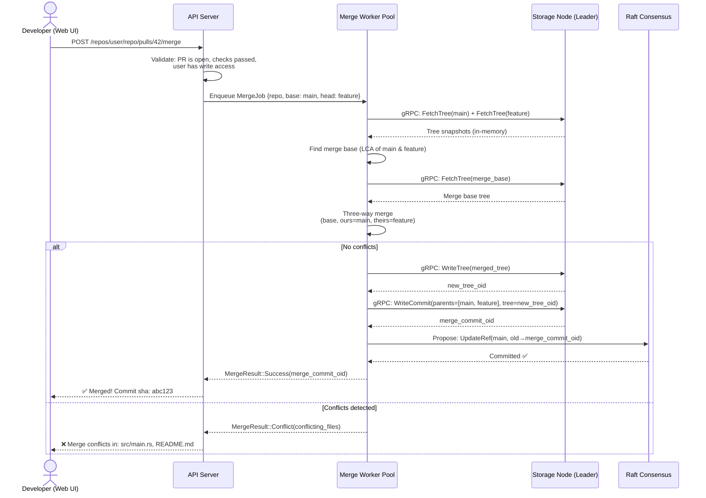
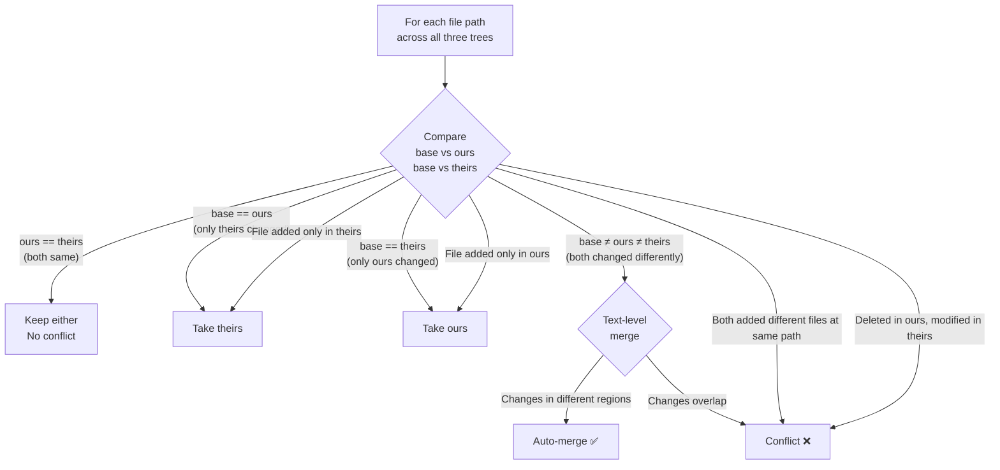
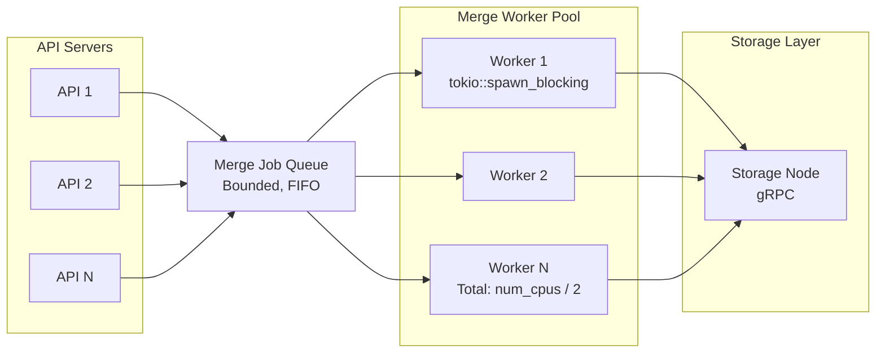

# 4. The Merge Engine and Conflict Resolution 🔴

> **The Problem:** When a developer clicks "Merge Pull Request" on the web UI, the platform must perform a Git merge entirely on the server side — the developer's laptop is not involved. This means the backend must clone the repository's tree into memory, run a **three-way merge algorithm** (the same algorithm `git merge` uses locally), detect textual conflicts, produce a new merge commit, and atomically update the target branch — all within a tight latency budget. A naïve approach would write the repository to a temp directory on disk, shell out to `git merge`, and read back the result. At 10,000 merges per minute across the fleet, this disk I/O becomes a bottleneck. We need an in-memory merge engine backed by a worker pool in Rust.

---

## What Happens When You Click "Merge PR"

The merge operation decomposes into five discrete steps, each with its own failure mode:



### The Five Steps

| Step | Operation | Where It Runs | I/O |
|---|---|---|---|
| 1. Tree Fetch | Load the tree objects for base, ours, theirs | Storage node → merge worker | gRPC streaming |
| 2. Merge Base | Find the Lowest Common Ancestor (LCA) commit | Merge worker (in-memory) | None (commit graph in memory) |
| 3. Three-Way Merge | Compare trees and blobs | Merge worker (in-memory) | None |
| 4. Object Write | Write new blobs, trees, and commit | Merge worker → storage node | gRPC |
| 5. Ref Update | Atomically advance `refs/heads/main` | Storage node → Raft | Raft consensus |

---

## The Three-Way Merge Algorithm

A three-way merge compares three versions of every file:

- **Base:** The merge base (the most recent common ancestor of the two branches).
- **Ours:** The current state of the target branch (e.g., `main`).
- **Theirs:** The state of the source branch (e.g., `feature/auth`).

### Decision Matrix



| Base | Ours | Theirs | Action |
|---|---|---|---|
| A | A | A | No change — keep A |
| A | A | B | Take B (only theirs changed) |
| A | B | A | Take B (only ours changed) |
| A | B | B | Take B (both made same change) |
| A | B | C | **Text merge** — attempt auto-merge, flag conflict if overlapping |
| ∅ | A | ∅ | Take A (added in ours) |
| ∅ | ∅ | A | Take A (added in theirs) |
| ∅ | A | B | **Conflict** — both added different content |
| A | ∅ | B | **Conflict** — deleted in ours, modified in theirs |
| A | B | ∅ | **Conflict** — modified in ours, deleted in theirs |
| A | ∅ | ∅ | Delete (both deleted) |

### Tree-Level Merge

```rust,ignore
use std::collections::{BTreeMap, HashMap};

#[derive(Debug, Clone, PartialEq, Eq)]
struct TreeEntry {
    mode: u32,         // 100644 (file), 040000 (dir), 100755 (executable), 120000 (symlink)
    oid: [u8; 20],     // SHA-1 of the blob or subtree
}

#[derive(Debug)]
enum MergeAction {
    /// Keep this entry unchanged.
    Keep(TreeEntry),
    /// A new or modified entry (write the blob/tree to the object store).
    Write(TreeEntry),
    /// Delete this entry from the merged tree.
    Delete,
    /// Conflict — both sides changed the file differently.
    Conflict {
        base: Option<TreeEntry>,
        ours: Option<TreeEntry>,
        theirs: Option<TreeEntry>,
    },
}

/// Perform a tree-level three-way merge.
fn merge_trees(
    base: &BTreeMap<String, TreeEntry>,
    ours: &BTreeMap<String, TreeEntry>,
    theirs: &BTreeMap<String, TreeEntry>,
) -> BTreeMap<String, MergeAction> {
    let mut result = BTreeMap::new();

    // Collect all unique paths across all three trees.
    let all_paths: std::collections::BTreeSet<&String> = base
        .keys()
        .chain(ours.keys())
        .chain(theirs.keys())
        .collect();

    for path in all_paths {
        let b = base.get(path);
        let o = ours.get(path);
        let t = theirs.get(path);

        let action = match (b, o, t) {
            // No change — all three are identical.
            (Some(b), Some(o), Some(t)) if b == o && o == t => MergeAction::Keep(o.clone()),

            // Only theirs changed.
            (Some(b), Some(o), Some(t)) if b == o && o != t => MergeAction::Write(t.clone()),

            // Only ours changed.
            (Some(b), Some(o), Some(t)) if b == t && o != t => MergeAction::Write(o.clone()),

            // Both changed to the same thing.
            (Some(_b), Some(o), Some(t)) if o == t => MergeAction::Write(o.clone()),

            // Both changed differently — need text-level merge.
            (Some(b), Some(o), Some(t)) => {
                // Both modified the same file differently.
                // For binary files: conflict. For text files: try text merge.
                MergeAction::Conflict {
                    base: Some(b.clone()),
                    ours: Some(o.clone()),
                    theirs: Some(t.clone()),
                }
            }

            // Added only in ours.
            (None, Some(o), None) => MergeAction::Write(o.clone()),

            // Added only in theirs.
            (None, None, Some(t)) => MergeAction::Write(t.clone()),

            // Both added — conflict.
            (None, Some(o), Some(t)) if o != t => MergeAction::Conflict {
                base: None,
                ours: Some(o.clone()),
                theirs: Some(t.clone()),
            },

            // Both added the same content.
            (None, Some(o), Some(_t)) => MergeAction::Write(o.clone()),

            // Deleted in ours, modified in theirs — conflict.
            (Some(b), None, Some(t)) if b != t => MergeAction::Conflict {
                base: Some(b.clone()),
                ours: None,
                theirs: Some(t.clone()),
            },

            // Deleted in ours, unchanged in theirs — delete.
            (Some(_b), None, Some(_t)) => MergeAction::Delete,

            // Modified in ours, deleted in theirs — conflict.
            (Some(b), Some(o), None) if b != o => MergeAction::Conflict {
                base: Some(b.clone()),
                ours: Some(o.clone()),
                theirs: None,
            },

            // Unchanged in ours, deleted in theirs — delete.
            (Some(_b), Some(_o), None) => MergeAction::Delete,

            // Both deleted.
            (Some(_b), None, None) => MergeAction::Delete,

            // Only in base, missing in both — already deleted.
            (None, None, None) => unreachable!("path in no tree"),

            // Remaining edge cases.
            _ => MergeAction::Keep(
                o.or(t)
                    .cloned()
                    .unwrap_or_else(|| b.cloned().expect("at least one tree has the entry")),
            ),
        };

        result.insert(path.clone(), action);
    }

    result
}
```

### Text-Level Merge (Line-by-Line)

When both sides modify the same file, we attempt a text-level merge by diffing at the line level:

```rust,ignore
use similar::{ChangeTag, TextDiff};

#[derive(Debug)]
struct TextMergeResult {
    /// The merged content (if successful).
    content: Option<String>,
    /// Human-readable conflict markers (if conflicted).
    conflicts: Vec<ConflictRegion>,
    /// Whether the merge was clean.
    is_clean: bool,
}

#[derive(Debug)]
struct ConflictRegion {
    ours_lines: Vec<String>,
    theirs_lines: Vec<String>,
    start_line: usize,
}

/// Three-way text merge.
/// Diffs base→ours and base→theirs, then interleaves non-overlapping changes.
fn three_way_text_merge(base: &str, ours: &str, theirs: &str) -> TextMergeResult {
    let diff_ours = TextDiff::from_lines(base, ours);
    let diff_theirs = TextDiff::from_lines(base, theirs);

    // Convert diffs to region-based change sets.
    let ours_changes = extract_change_regions(&diff_ours);
    let theirs_changes = extract_change_regions(&diff_theirs);

    // Check for overlapping regions.
    let mut conflicts = Vec::new();
    let mut merged_lines: Vec<String> = Vec::new();
    let mut is_clean = true;

    let base_lines: Vec<&str> = base.lines().collect();
    let ours_lines: Vec<&str> = ours.lines().collect();
    let theirs_lines: Vec<&str> = theirs.lines().collect();

    let mut base_idx = 0;

    // Simplified merge: walk through base lines, applying changes from both sides.
    while base_idx < base_lines.len() {
        let ours_change = find_change_at(&ours_changes, base_idx);
        let theirs_change = find_change_at(&theirs_changes, base_idx);

        match (ours_change, theirs_change) {
            (None, None) => {
                // No change on either side — keep base.
                merged_lines.push(base_lines[base_idx].to_string());
                base_idx += 1;
            }
            (Some(oc), None) => {
                // Only ours changed this region.
                for line in &oc.new_lines {
                    merged_lines.push(line.clone());
                }
                base_idx = oc.base_end;
            }
            (None, Some(tc)) => {
                // Only theirs changed this region.
                for line in &tc.new_lines {
                    merged_lines.push(line.clone());
                }
                base_idx = tc.base_end;
            }
            (Some(oc), Some(tc)) => {
                if oc.new_lines == tc.new_lines {
                    // Both made the same change.
                    for line in &oc.new_lines {
                        merged_lines.push(line.clone());
                    }
                } else {
                    // Conflict!
                    is_clean = false;
                    conflicts.push(ConflictRegion {
                        ours_lines: oc.new_lines.clone(),
                        theirs_lines: tc.new_lines.clone(),
                        start_line: merged_lines.len(),
                    });

                    // Write conflict markers.
                    merged_lines.push("<<<<<<< ours".to_string());
                    merged_lines.extend(oc.new_lines.iter().cloned());
                    merged_lines.push("=======".to_string());
                    merged_lines.extend(tc.new_lines.iter().cloned());
                    merged_lines.push(">>>>>>> theirs".to_string());
                }
                base_idx = oc.base_end.max(tc.base_end);
            }
        }
    }

    TextMergeResult {
        content: if is_clean {
            Some(merged_lines.join("\n"))
        } else {
            None
        },
        conflicts,
        is_clean,
    }
}
```

---

## The Merge Worker Pool

Merges are CPU-intensive (diffing, hashing) and memory-intensive (holding three versions of every modified file). We run them in a dedicated worker pool, isolated from the request-handling threads.



### Worker Implementation

```rust,ignore
use tokio::sync::mpsc;

#[derive(Debug)]
struct MergeJob {
    repository_id: String,
    base_ref: String,         // e.g., "refs/heads/main"
    head_ref: String,         // e.g., "refs/heads/feature/auth"
    merge_message: String,
    author: CommitAuthor,
    response_tx: tokio::sync::oneshot::Sender<MergeResult>,
}

#[derive(Debug)]
enum MergeResult {
    Success {
        merge_commit_oid: [u8; 20],
    },
    Conflict {
        conflicting_files: Vec<String>,
    },
    Error {
        message: String,
    },
}

#[derive(Debug, Clone)]
struct CommitAuthor {
    name: String,
    email: String,
}

struct MergeWorkerPool {
    job_tx: mpsc::Sender<MergeJob>,
}

impl MergeWorkerPool {
    fn new(
        worker_count: usize,
        storage_client: Arc<dyn GitStorageClient>,
    ) -> Self {
        let (tx, rx) = mpsc::channel::<MergeJob>(1024);
        let rx = Arc::new(tokio::sync::Mutex::new(rx));

        for worker_id in 0..worker_count {
            let rx = rx.clone();
            let client = storage_client.clone();

            tokio::spawn(async move {
                loop {
                    let job = {
                        let mut rx = rx.lock().await;
                        match rx.recv().await {
                            Some(job) => job,
                            None => break, // Channel closed.
                        }
                    };

                    tracing::info!(
                        worker = worker_id,
                        repo = %job.repository_id,
                        base = %job.base_ref,
                        head = %job.head_ref,
                        "starting merge"
                    );

                    let result = execute_merge(&client, &job).await;

                    // Send result back to the API handler.
                    let _ = job.response_tx.send(result);
                }
            });
        }

        MergeWorkerPool { job_tx: tx }
    }

    async fn submit(&self, job: MergeJob) -> anyhow::Result<()> {
        self.job_tx
            .send(job)
            .await
            .map_err(|_| anyhow::anyhow!("merge worker pool shut down"))
    }
}
```

### The Core Merge Execution

```rust,ignore
async fn execute_merge(
    client: &Arc<dyn GitStorageClient>,
    job: &MergeJob,
) -> MergeResult {
    // Step 1: Resolve refs to commit OIDs.
    let base_oid = match client.resolve_ref(&job.repository_id, &job.base_ref).await {
        Ok(oid) => oid,
        Err(e) => return MergeResult::Error { message: e.to_string() },
    };
    let head_oid = match client.resolve_ref(&job.repository_id, &job.head_ref).await {
        Ok(oid) => oid,
        Err(e) => return MergeResult::Error { message: e.to_string() },
    };

    // Step 2: Find the merge base (Lowest Common Ancestor).
    let merge_base_oid = match find_merge_base(client, &job.repository_id, &base_oid, &head_oid).await {
        Ok(oid) => oid,
        Err(e) => return MergeResult::Error { message: e.to_string() },
    };

    // Step 3: Fetch the three tree snapshots into memory.
    let base_tree = match client.fetch_tree_recursive(&job.repository_id, &merge_base_oid).await {
        Ok(t) => t,
        Err(e) => return MergeResult::Error { message: e.to_string() },
    };
    let ours_tree = match client.fetch_tree_recursive(&job.repository_id, &base_oid).await {
        Ok(t) => t,
        Err(e) => return MergeResult::Error { message: e.to_string() },
    };
    let theirs_tree = match client.fetch_tree_recursive(&job.repository_id, &head_oid).await {
        Ok(t) => t,
        Err(e) => return MergeResult::Error { message: e.to_string() },
    };

    // Step 4: Three-way merge.
    let merge_actions = merge_trees(&base_tree, &ours_tree, &theirs_tree);

    // Check for conflicts.
    let conflicts: Vec<String> = merge_actions
        .iter()
        .filter_map(|(path, action)| {
            if matches!(action, MergeAction::Conflict { .. }) {
                Some(path.clone())
            } else {
                None
            }
        })
        .collect();

    if !conflicts.is_empty() {
        return MergeResult::Conflict {
            conflicting_files: conflicts,
        };
    }

    // Step 5: For files that both sides modified (text merge), resolve them.
    let mut merged_tree = BTreeMap::new();
    for (path, action) in &merge_actions {
        match action {
            MergeAction::Keep(entry) | MergeAction::Write(entry) => {
                merged_tree.insert(path.clone(), entry.clone());
            }
            MergeAction::Delete => {
                // Omit from merged tree.
            }
            MergeAction::Conflict { .. } => unreachable!("conflicts already checked"),
        }
    }

    // Step 6: Write the merged tree to the object store.
    let new_tree_oid = match client
        .write_tree(&job.repository_id, &merged_tree)
        .await
    {
        Ok(oid) => oid,
        Err(e) => return MergeResult::Error { message: e.to_string() },
    };

    // Step 7: Write the merge commit.
    let merge_commit_oid = match client
        .write_commit(
            &job.repository_id,
            &new_tree_oid,
            &[base_oid, head_oid], // Two parents = merge commit
            &job.author,
            &job.merge_message,
        )
        .await
    {
        Ok(oid) => oid,
        Err(e) => return MergeResult::Error { message: e.to_string() },
    };

    // Step 8: Atomically update the base ref via Raft.
    match client
        .update_ref(
            &job.repository_id,
            &job.base_ref,
            &base_oid,        // CAS: expected current value
            &merge_commit_oid, // New value
        )
        .await
    {
        Ok(()) => MergeResult::Success { merge_commit_oid },
        Err(e) => MergeResult::Error {
            message: format!("ref update failed (concurrent push?): {e}"),
        },
    }
}
```

---

## Finding the Merge Base: Lowest Common Ancestor

The merge base is the most recent commit that is an ancestor of both branches. Finding it requires traversing the commit graph.

```mermaid
gitgraph
    commit id: "A"
    commit id: "B"
    branch feature
    commit id: "C"
    commit id: "D"
    checkout main
    commit id: "E"
    commit id: "F"
```

In this graph, commit **B** is the merge base of `main` (at **F**) and `feature` (at **D**).

```rust,ignore
use std::collections::{HashSet, VecDeque};

/// Find the merge base (LCA) of two commits using a bidirectional BFS.
async fn find_merge_base(
    client: &Arc<dyn GitStorageClient>,
    repo_id: &str,
    oid_a: &[u8; 20],
    oid_b: &[u8; 20],
) -> anyhow::Result<[u8; 20]> {
    let mut ancestors_a: HashSet<[u8; 20]> = HashSet::new();
    let mut ancestors_b: HashSet<[u8; 20]> = HashSet::new();
    let mut queue_a: VecDeque<[u8; 20]> = VecDeque::new();
    let mut queue_b: VecDeque<[u8; 20]> = VecDeque::new();

    queue_a.push_back(*oid_a);
    queue_b.push_back(*oid_b);
    ancestors_a.insert(*oid_a);
    ancestors_b.insert(*oid_b);

    // Alternate BFS from both sides.
    loop {
        // Expand from side A.
        if let Some(current) = queue_a.pop_front() {
            let commit = client.fetch_commit(repo_id, &current).await?;
            for parent in &commit.parent_oids {
                if ancestors_b.contains(parent) {
                    return Ok(*parent); // Found LCA!
                }
                if ancestors_a.insert(*parent) {
                    queue_a.push_back(*parent);
                }
            }
        }

        // Expand from side B.
        if let Some(current) = queue_b.pop_front() {
            let commit = client.fetch_commit(repo_id, &current).await?;
            for parent in &commit.parent_oids {
                if ancestors_a.contains(parent) {
                    return Ok(*parent); // Found LCA!
                }
                if ancestors_b.insert(*parent) {
                    queue_b.push_back(*parent);
                }
            }
        }

        // Check if one side reached the other.
        if ancestors_a.contains(oid_b) {
            return Ok(*oid_b);
        }
        if ancestors_b.contains(oid_a) {
            return Ok(*oid_a);
        }

        if queue_a.is_empty() && queue_b.is_empty() {
            anyhow::bail!("no common ancestor found");
        }
    }
}
```

---

## In-Memory Operation: Why No Disk I/O?

The merge engine is designed to operate **entirely in memory** — no temporary directories, no disk clones, no shelling out to `git merge`. This is a deliberate architectural choice:

| Concern | Disk-Based Merge | In-Memory Merge |
|---|---|---|
| Latency | ~500 ms–2 s (clone + merge + cleanup) | ~10–50 ms (fetched trees are already decoded) |
| Disk I/O | Writes temp repo, reads result, deletes temp | Zero |
| Concurrent merges | Limited by disk throughput and temp space | Limited by RAM (trees are small) |
| Cleanup on failure | Must delete temp directory (leak risk) | Rust `Drop` frees memory automatically |
| Security | Temp files visible to other processes | No filesystem surface area |

### Memory Budget

For a typical PR modifying 50 files:

```
Tree objects: ~50 entries × 3 versions × 30 bytes/entry = ~4.5 KB
Modified blobs: ~50 files × 3 versions × 10 KB avg = ~1.5 MB
Diff working memory: ~2× blob size = ~3 MB
────────────────────────────────────────────────────
Total per merge: ~5 MB

At 100 concurrent merges: ~500 MB (well within a single node's RAM)
```

For monorepo PRs modifying 5,000 files, the memory budget increases to ~500 MB per merge. The worker pool limits concurrency to prevent OOM:

```rust,ignore
struct MergeWorkerConfig {
    /// Maximum concurrent merges.
    max_concurrent: usize,
    /// Maximum memory per merge (bytes). Merges exceeding this are rejected.
    max_memory_per_merge: usize,
    /// Maximum files touched per merge. Over this triggers "too large" error.
    max_files_per_merge: usize,
}

impl Default for MergeWorkerConfig {
    fn default() -> Self {
        Self {
            max_concurrent: num_cpus::get() / 2,
            max_memory_per_merge: 512 * 1024 * 1024, // 512 MB
            max_files_per_merge: 10_000,
        }
    }
}
```

---

## Merge Strategies

The platform supports multiple merge strategies, matching what users expect from `git merge`:

### Strategy Comparison

| Strategy | Result | History | Use Case |
|---|---|---|---|
| **Merge Commit** | New commit with two parents | Preserves full branch topology | Default for most PRs |
| **Squash** | Single new commit (one parent) | Flattens branch into one commit | Clean history for small features |
| **Rebase** | Replayed commits on top of base | Linear history, no merge commits | Teams that prefer linear history |
| **Fast-Forward** | Move ref pointer (no new commit) | Linear, only if base is ancestor | Only possible when base hasn't diverged |

```rust,ignore
#[derive(Debug, Clone, Copy)]
enum MergeStrategy {
    MergeCommit,
    Squash,
    Rebase,
    FastForward,
}

async fn execute_strategy(
    client: &Arc<dyn GitStorageClient>,
    repo_id: &str,
    base_ref: &str,
    base_oid: &[u8; 20],
    head_oid: &[u8; 20],
    strategy: MergeStrategy,
    author: &CommitAuthor,
    message: &str,
) -> MergeResult {
    match strategy {
        MergeStrategy::FastForward => {
            // Check if base_oid is an ancestor of head_oid.
            if is_ancestor(client, repo_id, base_oid, head_oid).await.unwrap_or(false) {
                // Just move the ref pointer — no new commit needed.
                match client.update_ref(repo_id, base_ref, base_oid, head_oid).await {
                    Ok(()) => MergeResult::Success {
                        merge_commit_oid: *head_oid,
                    },
                    Err(e) => MergeResult::Error { message: e.to_string() },
                }
            } else {
                MergeResult::Error {
                    message: "fast-forward not possible: branches have diverged".to_string(),
                }
            }
        }
        MergeStrategy::Squash => {
            // Perform the three-way merge but create a single-parent commit.
            // The parent is only base_oid (not head_oid), so the branch history is discarded.
            // ... (merge logic same as above, but write_commit with parents = [base_oid])
            todo!("squash implementation")
        }
        MergeStrategy::Rebase => {
            // Cherry-pick each commit from head branch onto base.
            // For each commit C in (merge_base..head]:
            //   1. Compute diff(C.parent, C)
            //   2. Apply diff on top of current base tip
            //   3. Create new commit with single parent = previous rebased commit
            // Finally, update base_ref to point to the last rebased commit.
            todo!("rebase implementation")
        }
        MergeStrategy::MergeCommit => {
            // Standard three-way merge (as implemented above).
            todo!("standard merge — see execute_merge()")
        }
    }
}
```

---

## Optimistic Concurrency: Handling Race Conditions

Two developers might click "Merge" on different PRs targeting `main` at the same time. The CAS (compare-and-swap) semantics of `UpdateRef` ensure correctness:

```
Time    Merge A                           Merge B
────    ───────                           ───────
t0      Read main = abc123                Read main = abc123
t1      Compute merge → commit_A          Compute merge → commit_B
t2      UpdateRef(main, abc123→A)         ...
t3      ✅ Success (CAS matches)          UpdateRef(main, abc123→B)
t4                                        ❌ CAS failure: main is now commit_A
```

Merge B fails because `main` was concurrently updated. The API returns an error, and the developer can retry (which will trigger a new merge with the updated base).

```rust,ignore
/// Retry-aware merge submission.
async fn merge_with_retry(
    pool: &MergeWorkerPool,
    client: &Arc<dyn GitStorageClient>,
    repo_id: &str,
    base_ref: &str,
    head_ref: &str,
    author: &CommitAuthor,
    message: &str,
    max_retries: u32,
) -> MergeResult {
    for attempt in 0..=max_retries {
        let (tx, rx) = tokio::sync::oneshot::channel();

        let job = MergeJob {
            repository_id: repo_id.to_string(),
            base_ref: base_ref.to_string(),
            head_ref: head_ref.to_string(),
            merge_message: message.to_string(),
            author: author.clone(),
            response_tx: tx,
        };

        if pool.submit(job).await.is_err() {
            return MergeResult::Error {
                message: "merge pool unavailable".to_string(),
            };
        }

        match rx.await {
            Ok(result @ MergeResult::Success { .. }) => return result,
            Ok(result @ MergeResult::Conflict { .. }) => return result,
            Ok(MergeResult::Error { message }) if message.contains("CAS") && attempt < max_retries => {
                tracing::info!(
                    attempt,
                    repo_id,
                    "merge CAS failure, retrying"
                );
                tokio::time::sleep(Duration::from_millis(50 * (attempt as u64 + 1))).await;
                continue;
            }
            Ok(result) => return result,
            Err(_) => {
                return MergeResult::Error {
                    message: "merge worker dropped response".to_string(),
                }
            }
        }
    }

    MergeResult::Error {
        message: "max retries exceeded".to_string(),
    }
}
```

---

> **Key Takeaways**
>
> 1. **The three-way merge is a tree-level operation first, text-level second.** Walk all paths across three trees (base, ours, theirs), determine the action for each path, and only invoke the text merge engine when both sides modified the same file differently.
> 2. **In-memory merges eliminate disk I/O.** Fetching tree snapshots over gRPC and merging in RAM is 10–50× faster than cloning to a temp directory, and eliminates temp-file cleanup risks.
> 3. **The merge base (LCA) is found via bidirectional BFS on the commit graph.** Alternating expansion from both sides guarantees the first intersection is the most recent common ancestor.
> 4. **CAS semantics on `UpdateRef` provide optimistic concurrency.** Two concurrent merges targeting the same branch will never produce a corrupt result — the second one fails the compare-and-swap and can be retried.
> 5. **Bound the worker pool by CPU and memory.** Merges are CPU and memory intensive. Limiting concurrent merges to `num_cpus / 2` with a per-merge memory cap prevents OOM and keeps the system responsive.
