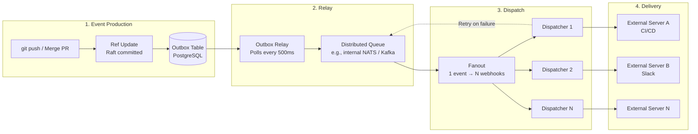
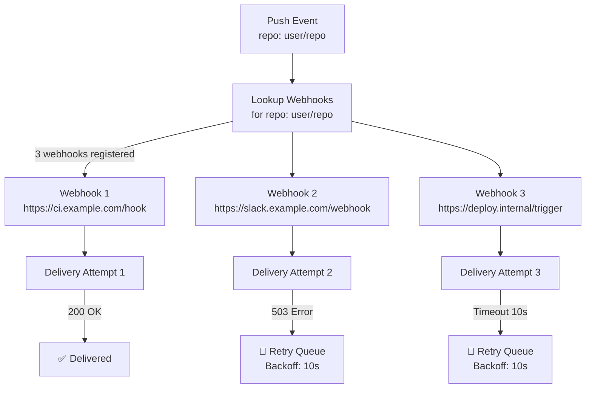
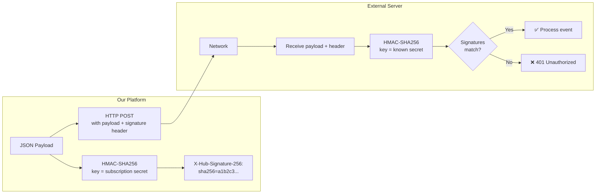

# 5. Webhooks and Guaranteed Delivery 🟡

> **The Problem:** Every push, merge, and tag creation must trigger external systems — CI/CD pipelines, Slack notifications, deployment controllers, security scanners. A webhook is an HTTP POST to an external URL with a JSON payload describing the event. The challenge is **guaranteed delivery**: the external server might be down, slow, or returning errors. If we lose a webhook, a CI pipeline never runs and a critical deployment is missed. We need at-least-once delivery semantics, meaning every event is delivered to every registered webhook at least once, even in the face of crashes, network partitions, and slow consumers. At the same time, we must sign payloads cryptographically so external servers can verify the webhook came from us and wasn't tampered with.

---

## The Webhook Delivery Pipeline

The pipeline has four stages, each designed to decouple the critical push path from the unreliable external HTTP delivery:



### Why an Outbox Pattern?

The naïve approach is to fire webhooks directly from the push handler:

```
push handler:
    1. Index packfile
    2. Raft commit ref update
    3. HTTP POST to every webhook endpoint  ← DANGEROUS
    4. Return success to client
```

**Problems with the naïve approach:**

| Problem | Impact |
|---|---|
| Slow webhook endpoint blocks the push response | Developer waits 30s for CI server to respond |
| Webhook HTTP call fails → retry in the push handler? | Push latency becomes unbounded |
| Server crashes between ref update and webhook | Event is permanently lost |
| 50 registered webhooks × 10ms each = 500ms added latency | Unacceptable for every push |

The **Outbox Pattern** solves all of these by writing the event to a database table in the same transaction as the ref update:

```
push handler:
    BEGIN TRANSACTION;
    1. Index packfile
    2. Apply ref update (state machine)
    3. INSERT INTO outbox (event_id, payload, ...) VALUES (...)
    COMMIT;
    4. Return success to client immediately

outbox relay (async background process):
    SELECT * FROM outbox WHERE delivered = FALSE ORDER BY created_at LIMIT 100;
    For each event: publish to distributed queue
    UPDATE outbox SET delivered = TRUE WHERE event_id = ...;
```

The event write is **atomic** with the ref update. If the server crashes after step 2 but before the webhook fires, the outbox relay picks it up on the next poll.

---

## The Outbox Table Schema

```sql
CREATE TABLE webhook_outbox (
    event_id      UUID PRIMARY KEY DEFAULT gen_random_uuid(),
    event_type    TEXT NOT NULL,          -- 'push', 'pull_request.merged', 'tag.created'
    repository_id TEXT NOT NULL,
    payload       JSONB NOT NULL,         -- Full event payload
    created_at    TIMESTAMPTZ NOT NULL DEFAULT NOW(),
    delivered     BOOLEAN NOT NULL DEFAULT FALSE,
    delivered_at  TIMESTAMPTZ,
    attempts      INT NOT NULL DEFAULT 0,
    -- Prevents the relay from processing the same event concurrently
    locked_until  TIMESTAMPTZ
);

CREATE INDEX idx_outbox_undelivered ON webhook_outbox (created_at)
    WHERE delivered = FALSE;
```

### Writing to the Outbox

```rust,ignore
use sqlx::PgPool;
use uuid::Uuid;

#[derive(Debug, Clone, serde::Serialize)]
struct PushEvent {
    event_type: String,
    repository: RepositoryInfo,
    #[serde(rename = "ref")]
    ref_name: String,
    before: String,
    after: String,
    commits: Vec<CommitInfo>,
    pusher: UserInfo,
}

#[derive(Debug, Clone, serde::Serialize)]
struct RepositoryInfo {
    id: String,
    full_name: String,
    clone_url: String,
}

#[derive(Debug, Clone, serde::Serialize)]
struct CommitInfo {
    id: String,
    message: String,
    author: UserInfo,
    timestamp: String,
}

#[derive(Debug, Clone, serde::Serialize)]
struct UserInfo {
    name: String,
    email: String,
}

/// Write a webhook event to the outbox within the same transaction as the ref update.
async fn write_to_outbox(
    tx: &mut sqlx::Transaction<'_, sqlx::Postgres>,
    event: &PushEvent,
) -> anyhow::Result<Uuid> {
    let event_id = Uuid::new_v4();
    let payload = serde_json::to_value(event)?;

    sqlx::query!(
        r#"
        INSERT INTO webhook_outbox (event_id, event_type, repository_id, payload)
        VALUES ($1, $2, $3, $4)
        "#,
        event_id,
        event.event_type,
        event.repository.id,
        payload,
    )
    .execute(&mut **tx)
    .await?;

    Ok(event_id)
}
```

---

## The Outbox Relay

The relay is a background process that polls the outbox table and publishes events to the distributed queue.

```rust,ignore
use std::time::Duration;

struct OutboxRelay {
    db: PgPool,
    queue: Arc<dyn EventQueue>,
    poll_interval: Duration,
    batch_size: i64,
}

impl OutboxRelay {
    async fn run(&self) {
        loop {
            match self.process_batch().await {
                Ok(count) if count > 0 => {
                    tracing::debug!(count, "relayed outbox events");
                    // If we got a full batch, immediately poll again (more may be waiting).
                    continue;
                }
                Ok(_) => {
                    // No events — sleep until next poll.
                    tokio::time::sleep(self.poll_interval).await;
                }
                Err(e) => {
                    tracing::error!(error = %e, "outbox relay error");
                    tokio::time::sleep(self.poll_interval).await;
                }
            }
        }
    }

    async fn process_batch(&self) -> anyhow::Result<usize> {
        // Lock a batch of undelivered events (prevents concurrent relays from
        // processing the same events).
        let events = sqlx::query_as!(
            OutboxEvent,
            r#"
            UPDATE webhook_outbox
            SET locked_until = NOW() + INTERVAL '30 seconds',
                attempts = attempts + 1
            WHERE event_id IN (
                SELECT event_id FROM webhook_outbox
                WHERE delivered = FALSE
                  AND (locked_until IS NULL OR locked_until < NOW())
                ORDER BY created_at
                LIMIT $1
                FOR UPDATE SKIP LOCKED
            )
            RETURNING event_id, event_type, repository_id, payload, attempts
            "#,
            self.batch_size,
        )
        .fetch_all(&self.db)
        .await?;

        let count = events.len();

        for event in &events {
            // Publish to the distributed queue.
            if let Err(e) = self.queue.publish(&event.event_type, &event.payload).await {
                tracing::warn!(
                    event_id = %event.event_id,
                    error = %e,
                    "failed to publish event to queue"
                );
                // Will be retried on next poll (lock expires in 30s).
                continue;
            }

            // Mark as delivered.
            sqlx::query!(
                r#"
                UPDATE webhook_outbox
                SET delivered = TRUE, delivered_at = NOW()
                WHERE event_id = $1
                "#,
                event.event_id,
            )
            .execute(&self.db)
            .await?;
        }

        Ok(count)
    }
}

#[derive(Debug)]
struct OutboxEvent {
    event_id: Uuid,
    event_type: String,
    repository_id: String,
    payload: serde_json::Value,
    attempts: i32,
}
```

---

## Webhook Fanout and Dispatch

Each repository can have multiple webhook subscriptions. The dispatcher fans out each event to all matching webhooks:



### The Webhook Subscription Table

```sql
CREATE TABLE webhook_subscriptions (
    subscription_id UUID PRIMARY KEY DEFAULT gen_random_uuid(),
    repository_id   TEXT NOT NULL,
    url             TEXT NOT NULL,
    secret          TEXT NOT NULL,       -- HMAC signing secret (encrypted at rest)
    events          TEXT[] NOT NULL,     -- e.g., {'push', 'pull_request.*'}
    active          BOOLEAN NOT NULL DEFAULT TRUE,
    created_at      TIMESTAMPTZ NOT NULL DEFAULT NOW(),
    -- Disable after too many consecutive failures
    consecutive_failures INT NOT NULL DEFAULT 0,
    disabled_at     TIMESTAMPTZ
);

CREATE INDEX idx_webhook_subs_repo ON webhook_subscriptions (repository_id)
    WHERE active = TRUE;
```

### The Dispatcher

```rust,ignore
use reqwest::Client;

struct WebhookDispatcher {
    http_client: Client,
    db: PgPool,
    retry_queue: Arc<dyn RetryQueue>,
    max_retries: u32,
}

#[derive(Debug, Clone)]
struct WebhookDelivery {
    delivery_id: Uuid,
    subscription_id: Uuid,
    url: String,
    secret: String,
    payload: serde_json::Value,
    attempt: u32,
}

impl WebhookDispatcher {
    async fn dispatch_event(
        &self,
        event_type: &str,
        repository_id: &str,
        payload: &serde_json::Value,
    ) -> anyhow::Result<()> {
        // Look up all active webhook subscriptions for this repo + event type.
        let subscriptions = sqlx::query_as!(
            WebhookSubscription,
            r#"
            SELECT subscription_id, url, secret, events
            FROM webhook_subscriptions
            WHERE repository_id = $1
              AND active = TRUE
              AND ($2 = ANY(events) OR '*' = ANY(events))
            "#,
            repository_id,
            event_type,
        )
        .fetch_all(&self.db)
        .await?;

        for sub in subscriptions {
            let delivery = WebhookDelivery {
                delivery_id: Uuid::new_v4(),
                subscription_id: sub.subscription_id,
                url: sub.url.clone(),
                secret: sub.secret.clone(),
                payload: payload.clone(),
                attempt: 1,
            };

            self.deliver(delivery).await;
        }

        Ok(())
    }

    async fn deliver(&self, delivery: WebhookDelivery) {
        let payload_bytes = serde_json::to_vec(&delivery.payload).unwrap_or_default();

        // Sign the payload with HMAC-SHA256.
        let signature = compute_hmac_signature(&delivery.secret, &payload_bytes);

        let result = self
            .http_client
            .post(&delivery.url)
            .header("Content-Type", "application/json")
            .header("X-Hub-Signature-256", format!("sha256={signature}"))
            .header("X-Webhook-Event", "push")
            .header("X-Webhook-Delivery", delivery.delivery_id.to_string())
            .body(payload_bytes.clone())
            .timeout(Duration::from_secs(10))
            .send()
            .await;

        match result {
            Ok(response) if response.status().is_success() => {
                tracing::info!(
                    delivery_id = %delivery.delivery_id,
                    url = %delivery.url,
                    status = %response.status(),
                    "webhook delivered"
                );

                // Reset consecutive failure counter.
                let _ = sqlx::query!(
                    "UPDATE webhook_subscriptions SET consecutive_failures = 0 WHERE subscription_id = $1",
                    delivery.subscription_id,
                )
                .execute(&self.db)
                .await;

                self.record_delivery(&delivery, true, response.status().as_u16())
                    .await;
            }
            Ok(response) => {
                tracing::warn!(
                    delivery_id = %delivery.delivery_id,
                    url = %delivery.url,
                    status = %response.status(),
                    attempt = delivery.attempt,
                    "webhook delivery failed (HTTP error)"
                );
                self.handle_failure(delivery).await;
            }
            Err(e) => {
                tracing::warn!(
                    delivery_id = %delivery.delivery_id,
                    url = %delivery.url,
                    error = %e,
                    attempt = delivery.attempt,
                    "webhook delivery failed (network error)"
                );
                self.handle_failure(delivery).await;
            }
        }
    }

    async fn handle_failure(&self, mut delivery: WebhookDelivery) {
        // Increment consecutive failure counter.
        let failures = sqlx::query_scalar!(
            r#"
            UPDATE webhook_subscriptions
            SET consecutive_failures = consecutive_failures + 1
            RETURNING consecutive_failures
            "#,
        )
        .fetch_optional(&self.db)
        .await
        .ok()
        .flatten()
        .unwrap_or(0);

        // Disable webhook after too many consecutive failures.
        if failures >= 100 {
            let _ = sqlx::query!(
                r#"
                UPDATE webhook_subscriptions
                SET active = FALSE, disabled_at = NOW()
                WHERE subscription_id = $1
                "#,
                delivery.subscription_id,
            )
            .execute(&self.db)
            .await;

            tracing::warn!(
                subscription_id = %delivery.subscription_id,
                url = %delivery.url,
                "webhook disabled after 100 consecutive failures"
            );
            return;
        }

        // Retry with exponential backoff.
        if delivery.attempt < self.max_retries {
            delivery.attempt += 1;
            let backoff = compute_backoff(delivery.attempt);

            self.retry_queue
                .schedule(delivery, backoff)
                .await
                .unwrap_or_else(|e| {
                    tracing::error!(error = %e, "failed to schedule retry");
                });
        }

        self.record_delivery(&delivery, false, 0).await;
    }

    async fn record_delivery(&self, delivery: &WebhookDelivery, success: bool, status_code: u16) {
        let _ = sqlx::query!(
            r#"
            INSERT INTO webhook_deliveries (delivery_id, subscription_id, success, status_code, attempt)
            VALUES ($1, $2, $3, $4, $5)
            "#,
            delivery.delivery_id,
            delivery.subscription_id,
            success,
            status_code as i32,
            delivery.attempt as i32,
        )
        .execute(&self.db)
        .await;
    }
}

#[derive(Debug)]
struct WebhookSubscription {
    subscription_id: Uuid,
    url: String,
    secret: String,
    events: Vec<String>,
}
```

---

## Cryptographic Payload Signing

Every webhook payload is signed with HMAC-SHA256 using a per-subscription secret. The external server can verify the signature to ensure:

1. The payload was sent by us (authenticity).
2. The payload was not tampered with in transit (integrity).



### HMAC-SHA256 Implementation

```rust,ignore
use hmac::{Hmac, Mac};
use sha2::Sha256;

type HmacSha256 = Hmac<Sha256>;

/// Compute the HMAC-SHA256 signature of a payload.
fn compute_hmac_signature(secret: &str, payload: &[u8]) -> String {
    let mut mac =
        HmacSha256::new_from_slice(secret.as_bytes()).expect("HMAC can take key of any size");
    mac.update(payload);
    let result = mac.finalize();
    hex::encode(result.into_bytes())
}

/// Verify an HMAC-SHA256 signature (used by the external server).
/// Uses constant-time comparison to prevent timing attacks.
fn verify_hmac_signature(secret: &str, payload: &[u8], expected_hex: &str) -> bool {
    let mut mac =
        HmacSha256::new_from_slice(secret.as_bytes()).expect("HMAC can take key of any size");
    mac.update(payload);

    let expected_bytes = match hex::decode(expected_hex) {
        Ok(b) => b,
        Err(_) => return false,
    };

    // Constant-time comparison prevents timing side-channel attacks.
    mac.verify_slice(&expected_bytes).is_ok()
}
```

### Why Not RSA or Ed25519 Signatures?

| Approach | Performance | Key Management | Verification |
|---|---|---|---|
| HMAC-SHA256 (shared secret) | ~500 ns per signature | One secret per subscription | Requires the subscriber to know the secret |
| RSA-SHA256 (asymmetric) | ~1 ms per signature | Platform holds private key | Subscriber only needs public key |
| Ed25519 (asymmetric) | ~50 µs per signature | Platform holds private key | Subscriber only needs public key |

HMAC is the industry standard for webhooks (GitHub, Stripe, Shopify all use it) because:

1. **Simplicity:** One shared secret per subscription, no PKI infrastructure.
2. **Performance:** HMAC-SHA256 is 2–20× faster than asymmetric signatures.
3. **The threat model fits:** The secret is exchanged once during webhook registration (over HTTPS). The goal is to verify the sender and payload integrity, not to provide non-repudiation.

---

## Exponential Backoff and Retry Storms

When an external server goes down, all pending deliveries to that endpoint will fail simultaneously. Without careful backoff, we'll create a **retry storm** that hammers the server the moment it comes back up, potentially knocking it down again.

### Backoff Strategy

```rust,ignore
/// Compute the backoff duration for a given attempt number.
/// Uses exponential backoff with full jitter.
fn compute_backoff(attempt: u32) -> Duration {
    // Base: 10 seconds, max: 1 hour
    let base_secs = 10u64;
    let max_secs = 3600u64;

    // Exponential: 10, 20, 40, 80, 160, 320, 640, 1280, 2560, 3600 (capped)
    let exponential = base_secs.saturating_mul(1u64 << (attempt - 1).min(20));
    let capped = exponential.min(max_secs);

    // Full jitter: uniform random in [0, capped]
    // This prevents thundering herd when many retries fire at the same time.
    use rand::Rng;
    let jittered = rand::thread_rng().gen_range(0..=capped);

    Duration::from_secs(jittered)
}
```

### Retry Schedule

| Attempt | Base Backoff | With Jitter (avg) | Cumulative Time |
|---|---|---|---|
| 1 | 10 s | ~5 s | 5 s |
| 2 | 20 s | ~10 s | 15 s |
| 3 | 40 s | ~20 s | 35 s |
| 4 | 80 s | ~40 s | 75 s |
| 5 | 160 s | ~80 s | ~2.5 min |
| 6 | 320 s | ~160 s | ~5 min |
| 7 | 640 s | ~320 s | ~10 min |
| 8 | 1280 s | ~640 s | ~21 min |
| 9 | 2560 s | ~1280 s | ~42 min |
| 10 | 3600 s (cap) | ~1800 s | ~72 min |

After 10 failed attempts (~72 minutes), we stop retrying for that specific delivery. The webhook is not disabled (other events may succeed), but the delivery is marked as permanently failed.

### The Retry Queue

```rust,ignore
struct RetryEntry {
    delivery: WebhookDelivery,
    scheduled_at: Instant,
}

struct InMemoryRetryQueue {
    entries: tokio::sync::Mutex<std::collections::BinaryHeap<std::cmp::Reverse<RetryEntry>>>,
}

impl InMemoryRetryQueue {
    async fn schedule(&self, delivery: WebhookDelivery, backoff: Duration) -> anyhow::Result<()> {
        let entry = RetryEntry {
            delivery,
            scheduled_at: Instant::now() + backoff,
        };

        self.entries
            .lock()
            .await
            .push(std::cmp::Reverse(entry));

        Ok(())
    }

    /// Drain all entries whose scheduled_at has passed.
    async fn drain_ready(&self) -> Vec<WebhookDelivery> {
        let mut entries = self.entries.lock().await;
        let mut ready = Vec::new();
        let now = Instant::now();

        while let Some(std::cmp::Reverse(entry)) = entries.peek() {
            if entry.scheduled_at <= now {
                let std::cmp::Reverse(entry) = entries.pop().unwrap();
                ready.push(entry.delivery);
            } else {
                break;
            }
        }

        ready
    }
}

impl PartialEq for RetryEntry {
    fn eq(&self, other: &Self) -> bool {
        self.scheduled_at == other.scheduled_at
    }
}

impl Eq for RetryEntry {}

impl PartialOrd for RetryEntry {
    fn partial_cmp(&self, other: &Self) -> Option<std::cmp::Ordering> {
        Some(self.cmp(other))
    }
}

impl Ord for RetryEntry {
    fn cmp(&self, other: &Self) -> std::cmp::Ordering {
        self.scheduled_at.cmp(&other.scheduled_at)
    }
}
```

---

## Delivery Guarantees: At-Least-Once vs. Exactly-Once

| Guarantee | How It Works | Trade-off |
|---|---|---|
| **At-most-once** | Fire and forget — no retries | Events can be lost |
| **At-least-once** | Retry until acknowledged — events may be delivered multiple times | Subscribers must handle duplicates (idempotent) |
| **Exactly-once** | Requires two-phase commit with subscriber | Impractical for external HTTP endpoints |

Our platform provides **at-least-once** delivery. Subscribers are responsible for deduplication using the `X-Webhook-Delivery` header (a UUID that is stable across retries).

### Idempotency on the Subscriber Side

```
# Subscriber pseudocode:
on_webhook_received(request):
    delivery_id = request.headers["X-Webhook-Delivery"]

    # Check if we've already processed this delivery.
    if redis.exists(f"webhook:{delivery_id}"):
        return 200  # Already processed — acknowledge to stop retries.

    # Process the event.
    process_event(request.body)

    # Mark as processed (with TTL to avoid unbounded growth).
    redis.set(f"webhook:{delivery_id}", "1", ex=86400)  # 24-hour TTL

    return 200
```

---

## Observability: Webhook Delivery Dashboard

A production webhook system needs comprehensive observability:

```sql
-- Delivery log table
CREATE TABLE webhook_deliveries (
    delivery_id     UUID NOT NULL,
    subscription_id UUID NOT NULL REFERENCES webhook_subscriptions(subscription_id),
    event_id        UUID NOT NULL,
    attempt         INT NOT NULL,
    success         BOOLEAN NOT NULL,
    status_code     INT,
    response_time_ms INT,
    error_message   TEXT,
    created_at      TIMESTAMPTZ NOT NULL DEFAULT NOW(),
    PRIMARY KEY (delivery_id, attempt)
);

-- Useful queries for the dashboard:

-- Success rate per webhook (last 24 hours)
SELECT
    ws.url,
    COUNT(*) FILTER (WHERE wd.success) AS successes,
    COUNT(*) FILTER (WHERE NOT wd.success) AS failures,
    ROUND(
        100.0 * COUNT(*) FILTER (WHERE wd.success) / NULLIF(COUNT(*), 0),
        1
    ) AS success_rate_pct,
    PERCENTILE_CONT(0.99) WITHIN GROUP (ORDER BY wd.response_time_ms) AS p99_ms
FROM webhook_deliveries wd
JOIN webhook_subscriptions ws ON ws.subscription_id = wd.subscription_id
WHERE wd.created_at > NOW() - INTERVAL '24 hours'
GROUP BY ws.url
ORDER BY success_rate_pct ASC;
```

### Metrics to Export (Prometheus)

```rust,ignore
use prometheus::{IntCounterVec, HistogramVec};

lazy_static::lazy_static! {
    static ref WEBHOOK_DELIVERIES: IntCounterVec = IntCounterVec::new(
        prometheus::opts!("webhook_deliveries_total", "Total webhook delivery attempts"),
        &["status", "event_type"],
    ).unwrap();

    static ref WEBHOOK_LATENCY: HistogramVec = HistogramVec::new(
        prometheus::opts!("webhook_delivery_duration_seconds", "Webhook delivery latency"),
        &["url_host"],
    ).unwrap();

    static ref WEBHOOK_RETRY_QUEUE_SIZE: prometheus::IntGauge = prometheus::IntGauge::new(
        "webhook_retry_queue_size",
        "Number of webhook deliveries waiting for retry",
    ).unwrap();
}
```

---

## Rate Limiting Outbound Webhooks

Without rate limiting, a single repository receiving a burst of pushes could generate thousands of webhook deliveries per second, overwhelming external servers.

```rust,ignore
use governor::{Quota, RateLimiter};
use std::num::NonZeroU32;

struct RateLimitedDispatcher {
    inner: WebhookDispatcher,
    /// Per-URL rate limiter: max 30 requests per minute per endpoint.
    limiters: DashMap<String, Arc<RateLimiter<governor::state::NotKeyed, governor::state::InMemoryState, governor::clock::DefaultClock>>>,
}

impl RateLimitedDispatcher {
    fn get_limiter(&self, url: &str) -> Arc<RateLimiter<governor::state::NotKeyed, governor::state::InMemoryState, governor::clock::DefaultClock>> {
        // Extract the host from the URL to group rate limits by endpoint server.
        let host = url::Url::parse(url)
            .map(|u| u.host_str().unwrap_or("unknown").to_string())
            .unwrap_or_else(|_| "unknown".to_string());

        self.limiters
            .entry(host)
            .or_insert_with(|| {
                Arc::new(RateLimiter::direct(
                    Quota::per_minute(NonZeroU32::new(30).unwrap()),
                ))
            })
            .clone()
    }

    async fn deliver_rate_limited(&self, delivery: WebhookDelivery) {
        let limiter = self.get_limiter(&delivery.url);

        // Wait until the rate limiter allows us to proceed.
        limiter.until_ready().await;

        self.inner.deliver(delivery).await;
    }
}
```

---

## End-to-End Event Flow Summary

| Stage | Component | Durability | Latency Contribution |
|---|---|---|---|
| Event production | Ref update + outbox INSERT (same tx) | PostgreSQL WAL + fsync | ~2–5 ms |
| Outbox relay | Poll + publish to queue | Queue persistence | ~500 ms (poll interval) |
| Fanout | Lookup subscriptions + create delivery tasks | In-memory | < 1 ms |
| Delivery | HTTP POST + HMAC signature | External server | 50–10,000 ms |
| **Total (push to first delivery attempt)** | | | **~500 ms – 10 s** |

The dominant latency is the outbox poll interval (500 ms). For latency-sensitive use cases, we can switch to a **change-data-capture (CDC) relay** that streams the PostgreSQL WAL directly, reducing the relay latency to ~10 ms. For most webhook use cases, 500 ms is more than acceptable.

---

> **Key Takeaways**
>
> 1. **Never fire webhooks synchronously from the push path.** Use the Outbox Pattern to atomically record the event in the same database transaction as the ref update. A background relay publishes events to a queue asynchronously.
> 2. **Sign every payload with HMAC-SHA256.** Use a per-subscription secret and include the signature in the `X-Hub-Signature-256` header. This lets external servers verify authenticity and integrity without PKI infrastructure.
> 3. **Exponential backoff with full jitter prevents retry storms.** Without jitter, all failed deliveries to a down server retry at exactly the same time, creating a thundering herd. Full jitter spreads retries uniformly over the backoff window.
> 4. **At-least-once is the practical guarantee.** Exactly-once delivery to external HTTP endpoints is impossible without two-phase commit. Provide a stable `X-Webhook-Delivery` UUID so subscribers can deduplicate.
> 5. **Disable webhooks after sustained failures.** A webhook endpoint that has failed 100 consecutive times is likely decommissioned. Auto-disable it to stop wasting dispatch resources, and notify the repository owner.
> 6. **Rate-limit outbound deliveries per endpoint.** A burst of pushes should not DDoS an external CI server. Cap deliveries at 30/minute per host and queue the overflow.
