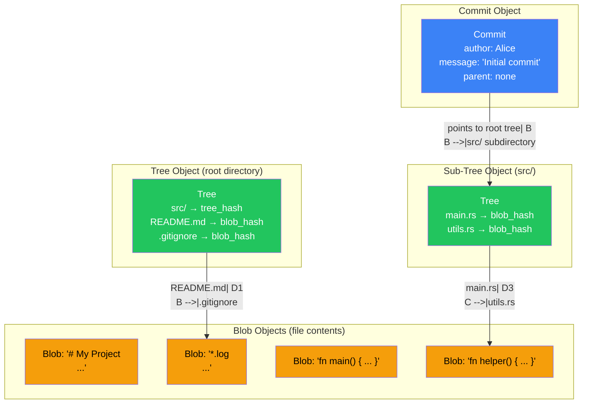
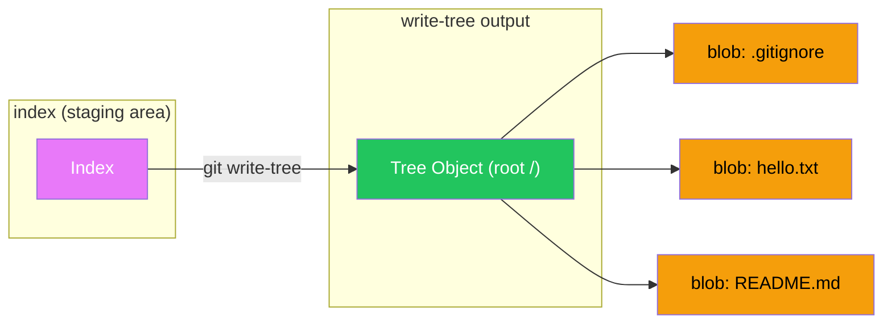
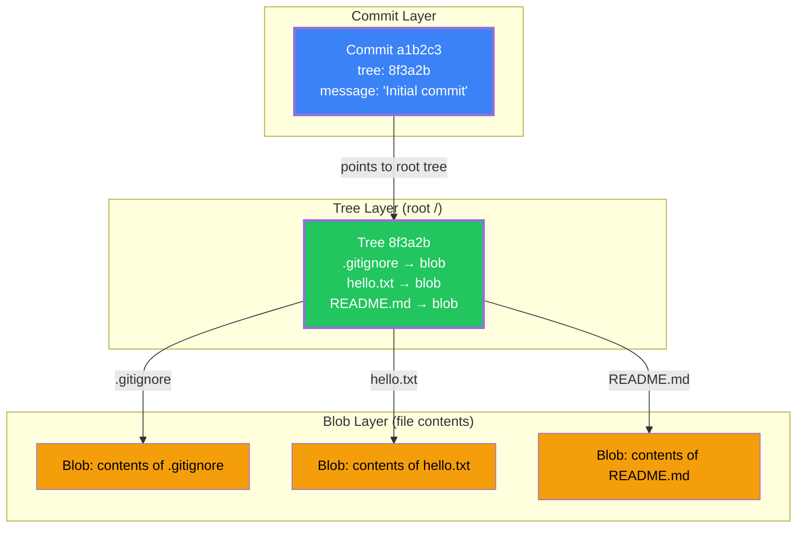
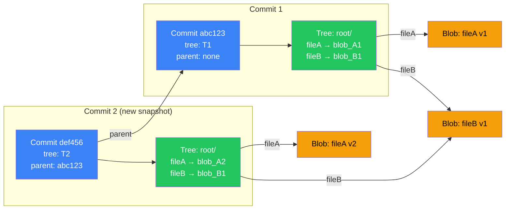

# Ch 01: Blobs, Trees, and Commits 🟢

> **What you'll learn:**
> - Git is **not** a diff engine — it is a content-addressable filesystem that takes snapshots
> - How SHA-1 hashing creates a content-addressed store where identical files produce identical objects
> - The three object types: **Blobs** (file contents), **Trees** (directory listings), **Commits** (metadata snapshots)
> - How to explore `.git/objects` directly and manually construct Git objects using plumbing commands

---

## The Myth: Git Stores Diffs

Most developers believe Git works like this:

```
Commit 1: "file.txt" = "Hello, World"
Commit 2: "file.txt" = "Hello, World\nNew line added"
Commit 3: "file.txt" = "Hello, World\nNew line added\nAnother line"
```

They imagine Git stores "what changed" between each commit — a series of patches or diffs. This is how Subversion, CVS, and Perforce work. This is **not** how Git works.

## The Truth: Git Is a Content-Addressable Filesystem

Git is a **content-addressable filesystem**. This means:

1. When you `git add` a file, Git reads the **entire contents** of that file.
2. Git compresses those contents using zlib.
3. Git computes the SHA-1 hash of the compressed data.
4. Git stores the compressed data in `.git/objects/` using the first 2 characters of the hash as the directory name and the remaining 38 characters as the filename.

```
.git/objects/
├── ab/
│   └── cdef1234567890...  <-- This filename IS the hash of the content
├── ef/
│   └── 5678901234abcd...
└── ...
```

The hash **is the address** of your file's content. If the content changes, the hash changes. If the content is identical, the hash is identical. This is why Git deduplicates files automatically: if two files have the same content, they share the same object.

## The Three Object Types

Git stores exactly three types of objects. Understanding these three types is understanding Git.

| Object Type | What It Stores | Analogy |
|---|---|---|
| **Blob** | The raw bytes of a single file's content | A file on disk (but with no name — just content) |
| **Tree** | A list of filenames with their blob hashes and file modes | A directory listing |
| **Commit** | A reference to a root tree, plus metadata (author, message, parent commits) | A snapshot label with a message |



## Exploring `.git/objects` with Your Own Hands

Let's prove this. Open a terminal and follow along. We'll create a repository from scratch and inspect every object Git creates.

### Step 1: Create a Repository

```bash
$ mkdir demo-repo && cd demo-repo
$ git init
Initialized empty Git repository in /Users/you/demo-repo/.git/
```

At this point, `.git/objects/` exists but is empty (aside from the `info/` and `pack/` subdirectories).

### Step 2: Create a Blob — Not a Commit, Just a Blob

```bash
$ echo "Hello, Git internals!" > hello.txt
$ git hash-object -w hello.txt
f7b8f7dfe0c5e1b3a8d9c2e4f6a1b3c5d7e9f0a2
```

The `git hash-object` command does exactly what we described: it reads the file, compresses it, hashes it, and **writes** it to `.git/objects/` (the `-w` flag means "write it to the object store"). The output is the SHA-1 hash.

```bash
$ ls .git/objects/f7/
b8f7dfe0c5e1b3a8d9c2e4f6a1b3c5d7e9f0a2
```

The blob is now stored on disk. Notice: **Git did not create a commit**. You can create blobs without committing them. They just sit in the object store, unreferenced by any tree or commit.

> **💥 HAZARD:** Objects created with `git hash-object` but never referenced by a commit are "dangling" and will be garbage collected by `git gc` after ~14 days.

### Step 3: Read the Blob Back

```bash
$ git cat-file -p f7b8f7dfe0c5e1b3a8d9c2e4f6a1b3c5d7e9f0a2
Hello, Git internals!

$ git cat-file -t f7b8f7dfe0c5e1b3a8d9c2e4f6a1b3c5d7e9f0a2
blob
```

`git cat-file -p` **p**retty-prints the object's content. `git cat-file -t` shows the object's type. This proves the blob stores the file's entire content, not a diff.

### Step 4: Build a Tree Manually

A tree is a directory listing. We can construct one manually using `git write-tree`, but first we need files staged:

```bash
$ echo "# My Project" > README.md
$ echo "*.log" > .gitignore
$ git add hello.txt README.md .gitignore

$ git ls-files --stage
100644 f7b8f7df... 0 .gitignore
100644 abc12345... 0 hello.txt
100644 def67890... 0 README.md
```

`git ls-files --stage` shows the **index** (staging area). The index is itself a tree-like structure that maps filenames to blob hashes and file modes.

```bash
$ git write-tree
8f3a2b1c9d0e4f5a6b7c8d9e0f1a2b3c4d5e6f7a
```

`git write-tree` takes the **current index** and creates a tree object from it. Let's inspect it:

```bash
$ git cat-file -t 8f3a2b1c9d0e4f5a6b7c8d9e0f1a2b3c4d5e6f7a
tree

$ git cat-file -p 8f3a2b1c9d0e4f5a6b7c8d9e0f1a2b3c4d5e6f7a
100644 blob f7b8f7df...    .gitignore
100644 blob abc12345...     hello.txt
100644 blob def67890...     README.md
```

The tree object is literally a text listing of modes, types, hashes, and filenames. Each subdirectory gets its own tree object — Git builds a **hierarchy** of trees that mirrors your directory structure.



### Step 5: Build a Commit Manually

A commit needs: a tree hash, an author, a committer, a timestamp, a message, and (for all commits after the first) a parent commit hash.

```bash
$ git commit-tree 8f3a2b1c9d0e4f5a6b7c8d9e0f1a2b3c4d5e6f7a \
    -m "Initial commit: hello.txt, README.md, .gitignore"
a1b2c3d4e5f6a7b8c9d0e1f2a3b4c5d6e7f8a9b0
```

`git commit-tree` is a **plumbing command** — it's a low-level Git operation that the high-level `git commit` wraps. Let's inspect the commit:

```bash
$ git cat-file -t a1b2c3d4e5f6a7b8c9d0e1f2a3b4c5d6e7f8a9b0
commit

$ git cat-file -p a1b2c3d4e5f6a7b8c9d0e1f2a3b4c5d6e7f8a9b0
tree 8f3a2b1c9d0e4f5a6b7c8d9e0f1a2b3c4d5e6f7a
author You <you@example.com> 1709600000 +0530
committer You <you@example.com> 1709600000 +0530

Initial commit: hello.txt, README.md, .gitignore
```

The commit object is almost trivially simple: a tree pointer, some metadata, and a message. **That's it.** The commit doesn't contain any file contents directly — it points to a tree, which points to blobs. The entire snapshot is reconstructed by following these pointers.

## The Complete Object Chain

Let's visualize the complete chain from a commit all the way down to file content:



Compare this to how Git models multiple commits in sequence:



Notice that:
- `blob_B1` is **shared** between Commit 1 and Commit 2 because `fileB` didn't change. Git deduplicates content using SHA-1 hashes — identical content, identical hash, single object.
- `fileA` got a new blob (`blob_A2`) because its content changed, so it gets a new hash.
- Each commit gets its **own tree** — Git doesn't store diffs between commits, it stores complete snapshots. The "diff" is computed on-demand by comparing two trees.

## The Panic Way vs. The Sorcerer Way

**The Panic Way:** "I need to see what's in this commit." → Opens GitHub and clicks through the UI.

**The Sorcerer Way:** Inspects the Git object graph directly, understanding exactly what data is stored where.

```bash
# 💥 HAZARD: Re-adding a large file without --skip-worktree or .gitignore
# creates a new blob every time — Git doesn't know you didn't intend to track it.

# ✅ FIX: Use plumbing commands to explore, not modify. Always understand before acting.

# List all objects in the store, sorted by size
$ git rev-list --objects --all | git cat-file --batch-check | sort -k3 -nr | head -20

# Count total objects
$ git count-objects -vH
count: 42
size: 1.23 MiB
in-pack: 0
packs: 0
size-pack: 0 bytes
prune-packable: 0
garbage: 0
```

`git count-objects -vH` gives you a bird's-eye view of your repository's object store. The `-H` flag prints human-readable sizes. The `size-pack` line tells you how much space packed objects take (more on packing in a later section). The `garbage` line tells you how many unreachable objects exist — objects that exist in `.git/objects/` but are not referenced by any branch, tag, or commit.

## SHA-1 Collision? Really?

Git uses SHA-1, which is cryptographically broken. Should you worry about hash collisions?

**Short answer:** No.

**Long answer:** SHA-1 collision attacks require attackers to **construct** two different inputs with the same hash. In Git, file contents aren't under the attacker's control in a way that would enable collision-based subversion. The probability of an accidental collision in a repository with millions of objects is approximately **1 in 10⁵⁰** — far lower than the probability of a cosmic ray flipping a bit in your RAM.

If you want extra security, Git 2.46+ supports a transition to **SHA-256** with `git init --object-format=sha256`. This is still optional for most use cases. See **Appendix A** for the configuration.

## Summary: The Object Model in One Sentence

```
A commit points to a tree that points to blobs — Git reconstructs your
entire project state by following these three pointer types.
```

Every high-level Git operation (`git merge`, `git rebase`, `git stash`) ultimately manipulates these objects. Understanding them is the foundation for everything in the rest of this book.

<details>
<summary><strong>🏋️ Exercise: Build a Repository Using Only Plumbing Commands</strong> (click to expand)</summary>

### The Challenge

You are in a server environment with no `git commit` command available. Your task is to create a complete Git repository with two commits using only **plumbing commands** (`git hash-object`, `git update-index`, `git write-tree`, `git commit-tree`, `git update-ref`).

**Requirements:**
1. Create a repo, add two files (`main.py` and `README.md`), and make the initial commit.
2. Modify `main.py`, stage it, and create a second commit with `main.py`'s blob updated but `README.md`'s blob unchanged.
3. Prove that `README.md`'s blob hash is **identical** in both commits (deduplication).

**Available plumbing commands:**
- `git hash-object -w <file>` — Create a blob from a file
- `git update-index --add --cacheinfo <mode>,<hash>,<path>` — Add to the index
- `git write-tree` — Create a tree from the current index
- `git commit-tree <tree>` — Create a commit pointing to a tree
- `git update-ref <ref> <commit>` — Update a branch pointer

<details>
<summary>🔑 Solution</summary>

```bash
#!/bin/bash
# ============================================================
# SOLUTION: Build a complete repo using only plumbing commands
# ============================================================

# 1. Initialize repo and create files
$ mkdir plumbing-demo && cd plumbing-demo
$ git init
$ echo "print('v1')" > main.py
$ echo "# My Project" > README.md

# 2. Create blobs for each file
$ git hash-object -w main.py
# Output (example): a1b2c3d4e5f6a7b8c9d0e1f2a3b4c5d6e7f8a9b0
MAIN_V1=$(git hash-object -w main.py)

$ git hash-object -w README.md
# Output (example): b2c3d4e5f6a7b8c9d0e1f2a3b4c5d6e7f8a9b0c1
README=$(git hash-object -w README.md)

# 3. Build the index from raw blobs
#    100644 = regular file mode
$ git update-index --add --cacheinfo 100644,$MAIN_V1,main.py
$ git update-index --add --cacheinfo 100644,$README,README.md

# 4. Write the tree that represents our root directory
$ TREE1=$(git write-tree)
echo "Tree 1: $TREE1"

# 5. Create the initial commit (no parent — this is the root commit)
#    Note: You need GIT_AUTHOR_NAME and GIT_AUTHOR_EMAIL set for commit-tree to work
$ export GIT_AUTHOR_NAME="Git Sorcerer"
$ export GIT_AUTHOR_EMAIL="sorcerer@example.com"
$ export GIT_COMMITTER_NAME="Git Sorcerer"
$ export GIT_COMMITTER_EMAIL="sorcerer@example.com"

$ COMMIT1=$(git commit-tree $TREE1 -m "Initial commit: main.py v1, README.md")
echo "Commit 1: $COMMIT1"

# 6. Point main branch to this commit
$ git update-ref refs/heads/main $COMMIT1

# 7. Verify the initial state
$ git log --oneline
# Output: abc1234 Initial commit: main.py v1, README.md

# ============================================================
# NOW CREATE THE SECOND COMMIT (modify main.py only)
# ============================================================

# 8. Modify main.py
$ echo "print('v2')" > main.py

# 9. Create a new blob for the updated main.py
#    README.md blob stays the SAME — we prove deduplication here
$ MAIN_V2=$(git hash-object -w main.py)

# 10. Verify blob hashes are different for main.py (content changed)
echo "main.py v1 blob: $MAIN_V1"   # a1b2c3d...
echo "main.py v2 blob: $MAIN_V2"   # c3d4e5f... (DIFFERENT)

# 11. But README blob is IDENTICAL (content unchanged)
echo "README.md blob: $README"     # b2c3d4e... (SAME in both commits)

# 12. Update the index: replace main.py blob, keep README blob
$ git update-index --cacheinfo 100644,$MAIN_V2,main.py
$ git update-index --cacheinfo 100644,$README,README.md

# 13. Write the new tree
$ TREE2=$(git write-tree)
echo "Tree 2: $TREE2"

# 14. Create the second commit — parent is COMMIT1
$ COMMIT2=$(git commit-tree $TREE2 -p $COMMIT1 -m "Update main.py to v2")
echo "Commit 2: $COMMIT2"

# 15. Update the main branch pointer
$ git update-ref refs/heads/main $COMMIT2

# 16. VERIFY: Prove README deduplication across commits
echo "=== Commit 1 tree ==="
$ git cat-file -p $(git rev-list --max-parents=0 main)  # root commit
# Shows: tree <TREE1>

echo "=== Commit 2 tree ==="
$ git cat-file -p $COMMIT2
# Shows: tree <TREE2>

# Both trees contain the SAME README.md blob hash — PROOF of deduplication
$ echo "README.md blob in tree 1: $README"
$ echo "README.md blob in tree 2: $(git cat-file -p $TREE2 | grep README | awk '{print $3}')"
# Both output the SAME SHA-1 — same content, same object, zero waste.

# 17. Final state:
$ git log --oneline --graph
# * COMMIT2 Update main.py to v2
# * COMMIT1 Initial commit: main.py v1, README.md
```

**Key Insight:** Notice that at no point did we use `git add`, `git commit`, or any "porcelain" command. The `git add` command is literally just a convenience wrapper around `git hash-object -w` + `git update-index`. The `git commit` command is a wrapper around `git write-tree` + `git commit-tree` + `git update-ref`.

When you understand the plumbing commands, the porcelain commands stop feeling like magic and start feeling like exactly what they are: convenience functions that manipulate objects.

**Proof of deduplication:** The README.md blob hash is **identical** in Tree 1 and Tree 2. Git stored the README content exactly once. Even across two commits, the same blob is reused because the file didn't change.

</details>
</details>

> **Key Takeaways**
> - Git is a content-addressable filesystem, not a diff engine — it stores complete snapshots as blob/tree/commit objects
> - Every object is addressed by its SHA-1 hash: identical content produces identical hashes (deduplication)
> - Plumbing commands (`hash-object`, `write-tree`, `commit-tree`) reveal the mechanics that porcelain commands wrap
> - The commit → tree → blob chain is Git's fundamental data model; understanding it makes all other Git operations predictable

> **See also:** [Chapter 2: Branches Are Just Pointers 🟢](ch02-branches-are-pointers.md) to discover how branches and tags connect to these commit objects through the HEAD pointer.