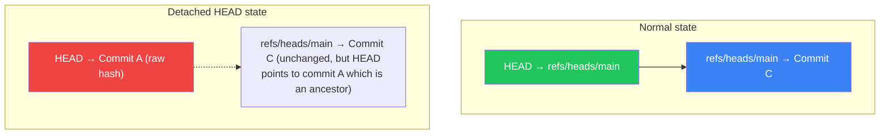
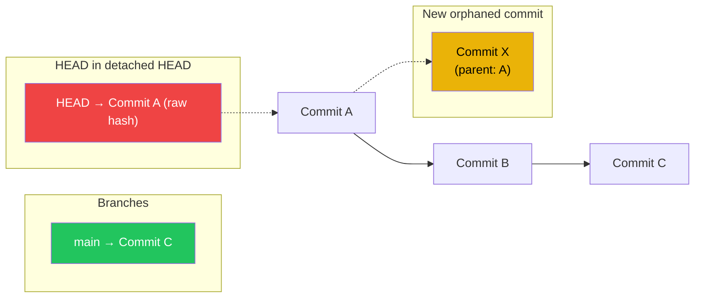

# Ch 02: Branches Are Just Pointers 🟢

> **What you'll learn:**
> - A branch is **not** a container of commits — it is a text file containing a single SHA-1 hash
> - How `HEAD` works: it points to a branch, which points to a commit, which points to a tree
> - What "detached HEAD" really means — and why it's not dangerous at all
> - Annotated tags vs. lightweight tags: when to use each, and why Git stores them differently

---

## The Misconception: Branches Contain Commits

Most developers visualize branches like this:

```
main:    ├─── A ─── B ─── C ─── D
feature: ├─── A ─── B ─── E ─── F ─── G
```

They imagine that the `feature` branch "contains" commits E, F, and G, and that these commits are somehow physically stored in a different place from commits A, B, C, D.

**This is wrong.** All commits live in the same flat object store (`.git/objects/`). A branch doesn't *contain* commits. A branch **points to** exactly one commit — the most recent one.

## The Reality: Branches Are 41-Byte Text Files

A branch is literally a text file in `.git/refs/heads/` that contains exactly 40 hexadecimal characters (a SHA-1 hash) followed by a newline.

```bash
$ cat .git/refs/heads/main
a1b2c3d4e5f6a7b8c9d0e1f2a3b4c5d6e7f8a9b0
```

That's it. That's the entire branch. The file `main` contains one hash. Git reads that hash, looks up the commit object in the object store, and follows that commit's `parent` pointer to find the previous commit, and so on.

**The entire "branch" is reconstructed by following parent pointers backward from the tip commit that the branch file points to.**

```mermaid
graph LR
    subgraph ".git/refs/heads/"
        B1["main ──→ a1b2c3d4..."]
        B2["feature ──→ e5f6a7b8..."]
    end

    subgraph "Commits (following parent pointers)"
        C1["A (root)\nparent: none"]
        C2["B\nparent: A"]
        C3["C (main tip)\nparent: B"]
        C4["D (feature tip)\nparent: B"]
    end

    B1 -->|"hash a1b2| C1
    B2 -->|"hash e5f6| C4

    C1 --> C2
    C2 --> C3
    B -->|"parent B| C1
    C4 --> C2

    style B1 fill:#3b82f6,color:#fff
    style B2 fill:#f59e0b,color:#000
    style C1 fill:#e0e0e0,color:#000
    style C2 fill:#e0e0e0,color:#000
    style C3 fill:#3b82f6,color:#fff
    style C4 fill:#f59e0b,color:#000
```

## Git's Object Model: Commits Form a Linked List

```mermaid
graph LR
    subgraph "main branch file"
        REF["refs/heads/main"]
    end

    subgraph "HEAD reference"
        HEAD["HEAD ──→ refs/heads/main"]
    end

    subgraph "Commit chain (linked list)"
        C3["Commit C\n(hash: a1b2c3d4)\nparent: B"]
        C2["Commit B\n(hash: 5e6f7a8b)\nparent: A"]
        C1["Commit A\n(hash: 9c0d1e2f)\nparent: (root)"]
    end

    HEAD --> REF
    REF -->|"points to tip| C3
    C3 -->|"parent | C2
    C2 -->|"parent | C1

    style HEAD fill:#dc2626,color:#fff
    style REF fill:#3b82f6,color:#fff
    style C3 fill:#9ca3af,color:#fff
    style C2 fill:#9ca3af,color:#fff
    style C1 fill:#9ca3af,color:#fff
```

Git follows the chain *backward*: `main` → Commit C → Commit B → Commit A → root. It never stores "forward" pointers. The child knows its parent, but the parent does not know its children. This is why `git log` can only show you history *before* the current commit, not *after*.

## What Is HEAD?

`HEAD` is the pointer to your current working context. It lives in `.git/HEAD` and is almost always a **symbolic reference** (a symbolic ref) — meaning it points to another ref, not directly to a commit hash.

```bash
$ cat .git/HEAD
ref: refs/heads/main
```

This means: "The current working branch is `main`, which itself points to Commit C." The chain is: `HEAD` → `refs/heads/main` → `a1b2c3d4`.

When you create a new commit while `HEAD` points to `refs/heads/main`, Git:
1. Creates a new commit object with the parent set to whatever `main` currently points to
2. Updates `refs/heads/main` to point to this new commit
3. `HEAD` still points to `refs/heads/main` — it doesn't need to change

### The Panic Way vs. The Sorcerer Way

**The Panic Way:** "Detached HEAD! Git is broken! I need to re-clone!"

**The Sorcerer Way:** Knows that `HEAD` just changed from pointing to a branch name to pointing directly to a commit hash — and that it's easy to fix.

```bash
# 💥 HAZARD: Checking out a commit hash directly puts you in detached HEAD state.
# Any new commits you make will not belong to any branch and will be
# garbage-collected after ~14-90 days unless you create a branch for them.
$ git checkout a1b2c3d4
Note: switchinging to 'a1b2c3d4'.
You are in 'detached HEAD' state.

# ✅ FIX: If you need to work from here, create a branch:
$ git checkout -b recovery-branch
# Or, if you want to go back to your branch:

$ git checkout main
```

## Detached HEAD: Demystified

Detached HEAD happens whenever `HEAD` points directly to a commit hash instead of a branch name. This is **not an error** — it's a perfectly valid state. In fact, CI/CD pipelines run in detached HEAD state all the time (they check out a specific commit to test it).

```bash
$ git checkout main
$ git checkout HEAD~2  # Detached HEAD: HEAD now points to commit A
$ git status
HEAD detached at a1b2c3d
nothing to commit

# What HEAD looks like now:
$ cat .git/HEAD
a1b2c3d4e5f6a7b8c9d0e1f2a3b4c5d6e7f8a9b0
```

Notice the difference? `.git/HEAD` went from `ref: refs/heads/main` to a raw hash. Git can no longer advance a branch pointer when you make a new commit. Your new commit will be orphaned once you check out something else.



### Making Commits in Detached HEAD

You *can* make commits in detached HEAD state. The commit is created normally. It just isn't reachable from any branch name.

```bash
$ git commit -m "Work done in detached HEAD"
[detached HEAD abc1234] Work done in detached HEAD

# This commit exists. It will survive for weeks in the object
# store — even if you check out something else and never
# reference it again. You can recover it via the reflog (see
# Chapter 8).
```



**The fix is trivial:** Create a branch pointing to the orphaned commit, or check out your old branch and the orphaned commit remains recoverable via the reflog.

## Tags: Static Pointers vs. Annotated Pointers

Git has two types of tags: lightweight and annotated. They look the same from the user's perspective, but they're stored very differently.

| Tag Type | What It Is | Stored As | Use Case |
|---|---|---|---|
| **Lightweight tag** | A direct pointer to a commit (just like a branch, but immutable) | `.git/refs/tags/v1.0` (contains a commit hash) | Temporary bookmarks; local release markers |
| **Annotated tag** | A full Git object with its own metadata (tagger, date, message, GPG signature) | `.git/refs/tags/v1.0` contains a *tag object hash*, which points to a commit | Shared, signed release tags; semantic versioning |

```bash
# Lightweight tag (just a pointer)
$ git tag v1.0

# Annotated tag (a full object)
$ git tag -a v1.0 -m "Release version 1.0"

# The difference in storage:
$ cat .git/refs/tags/v1.0  # lightweight tag
a1b2c3d4e5f6a7b8c9d0e1f2a3b4c5d6e7f8a9b0    # A commit hash

$ git cat-file -t $(cat .git/refs/tags/v1.0)  # annotated tag
tag                     # A tag object (not a commit)

$ git cat-file -p $(cat .git/refs/tags/v1.0)  # inspecting the tag object
object a1b2c3d4e5f6a7b8c9d0e1f2a3b4c5d6e7f8a9b0
type commit
tag v1.0
tagger Alice <alice@example.com> 1709600000 +0530

Release version 1.0
```

The annotated tag is a full Git object with its own metadata, just like a commit. This means you can `git show v1.0` and see the full tag message, the tagger, the date, and even a GPG signature if you signed it with `git tag -s v1.0`.

**Principal engineers always use annotated tags for releases.** Lightweight tags are for temporary local use only.

## The `git symbolic-ref` Command

If `HEAD` points to a ref, what happens when you use `git symbolic-ref`?

```bash
# Show which ref HEAD points to:
$ git symbolic-ref HEAD
refs/heads/main

# Change HEAD to point to a different branch (without checking it out):
$ git symbolic-ref HEAD refs/heads/feature
# Now HEAD → refs/heads/feature — but the working tree didn't change.
# This is dangerous! Your working tree still reflects the old branch's
# file contents. Use `git checkout` instead for interactive work.
```

`git symbolic-ref` is a plumbing command that manipulates the HEAD pointer directly. It's useful in scripts, but for everyday use, `git checkout` or `git switch` is safer because they update the working tree *and* HEAD together.

## The `packed-refs` File

In small repos, every branch is a separate file in `.git/refs/heads/`. In large repos with thousands of branches, this file I/O overhead adds up. Git solves this with **packed refs**: a single `.git/packed-refs` file that contains all branch and tag hashes in a compact format.

```bash
$ cat .git/packed-refs
# pack-refs with: peeled fully-peeled sorted
a1b2c3d4e5f6a7b8c9d0e1f2a3b4c5d6e7f8a9b0 refs/heads/main
b2c3d4e5f6a7b8c9d0e1f2a3b4c5d6e7f8a9b0c1 refs/tags/v1.0
```

Git automatically packs refs when you run `git gc` or when there are enough loose refs. The `.git/refs/heads/` files are deleted, and Git reads from `.git/packed-refs` instead. This is entirely transparent to the user — reading from `.git/refs/heads/main` will fall back to `.git/packed-refs` if the loose file doesn't exist.

## Remote Tracking Branches

When you `git clone origin/main`, Git also creates `.git/refs/remotes/origin/main`. This is a **remote-tracking branch** — a *mirror* of what the remote's `main` branch pointed to the last time you ran `git fetch`.

```
.git/refs/
├── heads/
│   ├── main          # Your local main branch
├── remotes/
│   └── origin/
│       ├── main      # Last known state of origin/main
│       └── feature   # Last known state of origin/feature
└── tags/
    └── v1.0
```

When you run `git fetch origin`, Git updates `.git/refs/remotes/origin/main` to match the remote's actual `main` branch. When you run `git merge origin/main`, Git merges your `refs/heads/main` with `refs/remotes/origin/main`.

<details>
<summary><strong>🏋️ Exercise: Manually Create a Branch and Switch to It</strong> (click to expand)</summary>

### The Challenge

You are in a repo with a single `main` branch. Your task is to create a new branch called `experimental`, make one commit on it, and verify that `main`'s commit hash is completely unchanged by your work on `experimental`. You must *not* use `git checkout -b` or `git switch -c`. You must do everything manually using `.git/refs/heads/` and `.git/HEAD`.

**Requirements:**
1. Create the `experimental` branch pointing to the same commit as `main`
2. Switch HEAD to point to `experimental`
3. Create a commit on `experimental`
4. Switch back to `main` and prove that `main`'s tip commit is unchanged
5. Switch back to `experimental` and prove it has one extra commit

<details>
<summary>🔑 Solution</summary>

```bash
# 1. Find the current commit hash for main
$ MAIN_HASH=$(cat .git/refs/heads/main)
$ echo "main points to: $MAIN_HASH"
# Output: main points to: a1b2c3d4e5f6a7b8c9d0e1f2a3b4c5d6e7f8a9b0

# 2. Create the experimental branch — it's literally just a file
$ mkdir -p .git/refs/heads
$ echo "$MAIN_HASH" > .git/refs/heads/experimental
# Experimental now points to the same commit as main.

# 3. Switch HEAD to experimental
$ echo "ref: refs/heads/experimental" > .git/HEAD

# 4. Verify HEAD is correct
$ cat .git/HEAD
ref: refs/heads/experimental
$ git status
On branch experimental
nothing to commit, working tree clean

# 5. Make a commit on experimental
$ echo "# New feature" > feature.md
$ git add feature.md
$ git commit -m "Add experimental feature"
[experimental abc1234] Add experimental feature

# 6. Verify experimental moved forward but main didn't
$ EXPERIMENTAL_HASH=$(cat .git/refs/heads/experimental)
$ echo "experimental now points to: $EXPERIMENTAL_HASH"
# Output: experimental points to: abc1234

$ echo "main still points to: $MAIN_HASH"
# Output: main still points to: a1b2c3d4 (UNCHANGED)

# 7. Switch back to main — manually
$ echo "ref: refs/heads/main" > .git/HEAD
$ git status
On branch main
nothing to commit, working tree clean

# feature.md is gone from the working tree because main's tree
# doesn't include it. But the commit abc1234 exists.

# 8. Prove main's commit hash is untouched
$ echo "main still points to: $(cat .git/refs/heads/main)"
$ git log --oneline -1
a1b2c3d4 (HEAD -> main) Original commit message

# 9. Switch back to experimental and prove it has the extra commit
$ echo "ref: refs/heads/experimental" > .git/HEAD
$ git log --oneline
abc1234 (HEAD -> experimental) Add experimental feature
a1b2c3d4 (main) Original commit message

# 10. Cleanup — restore HEAD to main (the original state)
$ echo "ref: refs/heads/main" > .git/HEAD
```

**Key Insight:** You just manually performed the entire branch switching workflow that `git checkout experimental` does automatically. The porcelain command does three things: (1) updates the working tree to match the new branch's tree, (2) writes the new ref name to `.git/HEAD`, and (3) runs post-checkout hooks. You skipped step 1 and 3 — which is fine because we're learning, but it explains why `git checkout` is safer.

</details>
</details>

> **Key Takeaways**
> - A branch is a text file in `.git/refs/heads/` containing a single SHA-1 hash — it does not "contain" commits
> - `HEAD` points to a branch name; the branch name points to the tip commit; Git follows parent pointers backward
> - Detached HEAD means `HEAD` points directly to a commit hash instead of a branch name — new commits are safe but need the reflog (see Chapter 8)
> - Annotated tags are full Git objects with metadata; lightweight tags are just pointers. Always use annotated tags for releases.
> - The `packed-refs` file compresses thousands of refs into a single file for performance

> **See also:** [Chapter 3: The Power of Interactive Rebase 🟡](ch03-interactive-rebase.md) to learn how to rewrite commit history, and [Chapter 8: The Reflog (Time Travel) 🔴](ch08-reflog-time-travel.md) to recover from any state where HEAD pointed to by any branch or any commit in the reflog.