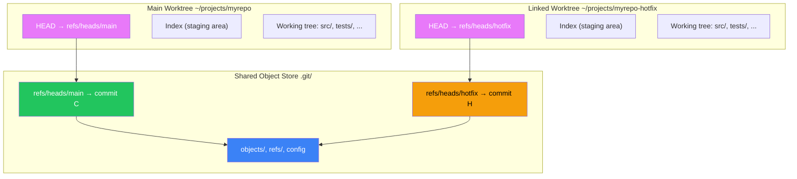

# Ch 04: Git Worktrees and Stashing 🟡

> **What you'll learn:**
> - Why `git stash` is fragile, how the stash stack is implemented under the hood, and what happens when it corrupts itself
> - How `git worktree add` lets check out multiple branches simultaneously in separate directories — no stashing, no switching, no conflicts
> - The exact tradeoffs between stashing, worktrees, and temporary branches — and when to use each
> - How to recover an abandoned stash from the reflog

---

## The Problem: Context Switching in a Single Working Directory

You're deep in the middle of a feature branch. Your working directory is dirty — you have four modified files, two of which are committed and two you're still writing tests for. Your phone rings: production is down, and you need to hotfix the `main` branch *now*.

What do you do?

**The Panic Way:** Commit everything with a "WIP" message, switch to `main`, apply the hotfix, and switch back. Now your history has a "WIP" commit polluting the branch, and you'll forget to clean it up.

**The Sorcerer Way:** Either stash the work away safely, or — better yet — use a worktree to create a second checkout of the repo in a different directory, apply the hotfix there, and never interrupt your feature work flow.

## Git Stash Under the Hood

Most developers think of `git stash` as a temporary clipboard where you "push" your working directory changes and "pop" them back later. That's what it looks like from the user's perspective. Under the hood, a stash is actually a **commit** — specifically, it's a merge commit with two parents:

```
stash commit:   M
               / \
parent 1:     A   B
```

- **Parent 1:** The commit your HEAD was pointing to when you stashed (the "base" commit)
- **Parent 2:** The index (staging area) state when you stashed
- **Parent 3:** Untracked files (if you used `git stash --include-untracked` or `git stash -u`)

```mermaid
graph LR
    subgraph "Stash Internals"
        HEAD["HEAD → main → Commit C"]
        WC["Working directory changes:\n  modified: src/main.rs\n  modified: tests/test_main.rs"]
        IDX["Index (staged):\n  modified: src/utils.rs"]
    end

    subgraph "Stash Commit (created by git stash push)"
        S["Stash Commit\nparent 1: C (base)\nparent 2: index state\n(untracked files if -u)"]
    end

    HEAD -. "base" S
    WC -. "captured in"| S
    IDX -. "captured in"| S

    style HEAD fill:#3b82f6,color:#fff
    style WC fill:#f59e0b,color:#000
    style IDX fill:#22c55e,color:#fff
    style S fill:#ef4444,color:#fff
```

### The Stash Stack Is Just a Reflog

There is no "stack" data structure. `git stash list` is literally reading the reflog of `refs/stash`.

```bash
$ git stash push -m "WIP: auth module"
Saved working directory and index state On feature: WIP: auth module

$ git stash list
stash@{0}: On feature: WIP: auth module
stash@{1}: WIP on feature: abc1234 Some old stash from last week
stash@{2}: WIP on main: def5678 Another stash from last month
```

Each stash entry is a commit reachable from `refs/stash`. The reflog records when each stash was created:

```bash
$ cat .git/refs/stash
a1b2c3d4e5f6a7b8c9d0e1f2a3b4c5d6e7f8a9b0  # The most recent stash commit

$ git log --oneline refs/stash  # Shows all stash commits
a1b2c3d On feature: WIP: auth module
b2c3d4e WIP on feature: abc1234 Some old stash
c3d4e5f WIP on main: def5678 Another stash
```

`stash@{0}` is a reflog notation — it means "the 0th entry in the refs/stash reflog." `stash@{2}` means "the 2nd entry." This means:

- Stashes are **not** deleted when you `git stash pop` — they're just removed from the reflog. The stash commit still exists in the object store until `git gc` (see Chapter 8).
- "Dropped" stashes are recoverable via the reflog — if you know how.

### `git stash pop` vs `git stash apply`

| Command | What It Does | Risk Level |
|---|---|---|
| `git stash pop` | Applies the stash to your working directory, **then drops** the stash entry (removes from the reflog) | 🔴 If you get conflicts during apply, the stash is still dropped — potentially losing your work |
| `git stash apply` | Applies the stash to your working directory, **but keeps** the stash entry | 🟢 If you get conflicts, the stash is still there — you can try again or abandon |

**Principal engineer rule: Always use `git stash apply`, never use `git stash pop`.** It adds one cleanup step (`git stash drop stash@{0}`) and guarantees you never lose your stash due to a conflict.

```bash
# 💥 HAZARD: pop drops the stash even if apply fails with conflicts!
# stash@{0} is gone. If the conflicts are complex and can't be resolved,
# the work is gone.
$ git stash pop      # 💥 HAZARD: stash dropped even if conflicts occur

# ✅ FIX: apply keeps the stash entry intact — you can resolve conflicts,
# and try again or drop it manually when you're done.
$ git stash apply    # ✅ SAFE: stash entry stays on the stack
$ git stash drop     # Only drop when you're sure everything is applied
```

### When Stash Is Brittle

`git stash` works brilliantly for simple, single-directory changes with no conflicts. It gets tricky when:

1. **The branch moved forward:** You stashed on a commit. You switched to another branch and made commits. You switch back — the branch has moved. Your stash can't apply because the base commit changed.
2. **Multiple conflicting stashes:** You stash A modifies `file.txt`. You stash B also modifies `file.txt`. You apply stash A — conflict-free. You apply stash B — **conflict in file.txt** because stash A's changes are already in the working directory.
3. **Submodules and binary files:** Stash has partial support for submodules (depends on `stash.useBuiltin` config) and can be very slow with large binary files.
4. **The stash reflog corrupts:** In rare cases (especially during interrupted operations or disk full conditions), `refs/stash` can point to a commit that no longer exists in the object store.

## Git Worktrees: Parallel Checkouts in Separate Directories

`git worktree` is Git's answer to "I want to work on two branches *at the same time* without switching back and forth." Instead of moving your working directory state from one branch to another, `git worktree` creates a **second working directory** in a separate location, each independently checked out to a different branch.

```
~/projects/myrepo/              (main worktree — on main branch)
├── .git/                       (shared repository data)
├── src/
├── tests/
└── ...

~/projects/myrepo-feature/      (linked worktree — on feature branch)
├── .git                        (tiny file pointing back to the shared .git)
├── src/
├── tests/
└── ...
```

Both directories share the same `.git/objects/`, the same commit history, and the same refs. Each has its own `HEAD`, its own index, and its own uncommitted changes.



### `git clone` vs `git worktree`

| Strategy | Disk Usage | Setup Time | Shared Objects | Separate Index | Separate HEAD | Best For |
|---|---|---|---|---|---|---|
| **`git clone` again** | Full duplicate (2x size) | Slow (re-downloads everything) | ❌ No | ✅ Yes | ✅ Yes | Sharing across machines; independent CI runners |
| **`git worktree add`** | Shared objects, separate working tree | Instant (no download) | ✅ Yes | ✅ Yes | ✅ Yes | Multi-branch development in the same repo |
| **`git stash` + `git checkout`** | Single working tree | Fast (just index changes) | ✅ Yes | ❌ No (shared, mutable) | ❌ No | Quick context switching within one directory |

### Creating a Worktree

```bash
# Main worktree: ~/projects/myrepo (on main branch)
$ git status
On branch main
nothing to commit, working tree clean

# Create a second worktree on a new branch "hotfix/critical-bug"
$ git worktree add ../myrepo-hotfix -b hotfix/critical-bug
Preparing worktree (new branch 'hotfix/critical-bug')
HEAD is now at a1b2c3d Main commit (base for hotfix)

# The new directory exists and is checked out
$ cd ../myrepo-hotfix
$ git status
On branch hotfix/critical-bug
nothing to commit, working tree clean

# Make changes, commit, push — completely independent of main
$ echo "Critical fix here" > hotfix.txt
$ git add hotfix.txt
$ git commit -m "Fix critical production bug"
[hotfix/critical-bug abc1234] Fix critical production bug

# Meanwhile, in your original worktree, nothing changed:
$ cd ../myrepo
$ git status
On branch main
nothing to commit, working tree clean
```

Both directories share the same `.git/objects/`. The second worktree is just a thin `../myrepo-hotfix/.git` file — it's a "gitfile" that contains a path back to the main repository.

```bash
$ cat ../myrepo-hotfix/.git
gitdir: /Users/you/projects/myrepo/.git/worktrees/myrepo-hotfix
```

`myrepo/.git/worktrees/myrepo-hotfix/` contains the linked worktree's HEAD, index, and per-worktree refs — all separate from the main worktree's `HEAD` and `index`.

### Listing and Removing Worktrees

```bash
# List all linked worktrees
$ git worktree list
/Users/you/projects/myrepo        a1b2c3d [main]
/Users/you/projects/myrepo-hotfix abc1234 [hotfix/critical-bug]

# Remove a worktree when the hotfix is merged
$ git worktree remove ../myrepo-hotfix

# After pruning, only the main worktree remains
$ git worktree list
/Users/you/projects/myrepo        a1b2c3d [main]
```

**Important:** `git worktree remove` does not delete the branch. It only deletes the linked working directory. The branch still exists in `.git/refs/heads/hotfix/critical-bug`.

### Common Worktree Patterns

**1. Code review while developing:** You're on `feature/new-api`. A colleague asks you to review their PR on `feature/their-pr`. Instead of interrupting your work flow, check it out in a worktree:

```bash
$ # Your main worktree — you're in the middle of editing
$ git worktree add ../review-pr feature/their-pr

# Open the review directory in your IDE, read the code, leave comments.
# Your main worktree has never been interrupted.

# Clean up:
$ rm -rf ../review-pr  # Or: git worktree remove ../review-pr
```

**2. Run tests on main while your branch is dirty:** You want to check if tests pass on `main` but your current branch has uncommitted changes and is in the middle of a rebase:

```bash
# Main worktree: mid-feature (cannot switch to main to run tests)
$ git worktree add ../tests-main main

# Second worktree: clean checkout of main, ready to run CI locally
$ cd ../tests-main
$ cargo test  # Or: npm test, pytest, etc.

# Your main worktree is untouched
```

**3. Hotfix without interrupting feature work:** The classic use case. You're deep in a feature branch with 12 modified files. Production needs a hotfix *now*. Instead of stashing, just open a second worktree:

```bash
$ git worktree add ../hotfix-hotfix
cd ../hotfix-hotfix
# Apply the hotfix, commit, push, deploy.
# Your feature branch's 12 modified files are never touched.
```

## Stash vs Worktree: Decision Matrix

| Situation | Use Stash? | Use Worktree? | Why |
|---|---:|---:|---|
| Quick 5-minute branch switch | ✅ Yes | ❌ Overkill | Stash is faster for a quick switch |
| Review a PR while developing | ❌ No | ✅ Yes | You can't review a PR "inside" your dirty working directory |
| Hotfix while feature branch is dirty | 🔶 Either | ✅ Yes | Stash works but is risky if conflicts occur. Worktree is safer. |
| Run tests on main while your branch is dirty | ❌ No | ✅ Yes | You can't switch to main to run tests — a worktree gives you a clean main |
| Two independent feature branches | ❌ No | ✅ Yes | Stashing loses both; worktrees let you work on both simultaneously |
| Stashing untracked files (`git stash -u`) | ✅ Yes | ❌ Irrelevant | `stash -u` is the only way to stash untracked files; worktrees don't capture untracked files |

## The Panic Way vs. The Sorcerer Way

**The Panic Way:**
```bash
# 💥 HAZARD: You have uncommitted changes, and stash pop creates a conflict.
# The stash is gone. Your changes are in the working directory in a half-applied state.
# If you panic and git reset --hard, you lose everything.
$ git stash push -m "WIP"
$ git checkout main
$ # ... make hotfix, push, deploy ...
$ git checkout feature
$ git stash pop         # 💥 HAZARD: Conflict with hotfix changes
CONFLICT (content): Merge conflict in shared_config.json
# Stash is dropped. Conflict is messy. You can't go back.
```

**The Sorcerer Way:**
```bash
# ✅ FIX: Use worktree instead of stash for hotfix — no apply required.
$ git worktree add ../hotfix main
$ cd ../hotfix
# Hotfix, commit, push — never touches your feature branch
$ git worktree remove ../hotfix
# Your feature branch's dirty state is untouched. No stash. No conflicts. No risk.
```

## Recovering a "Lost" Stash

If you ran `git stash pop` and got a conflict, the stash entry was removed from the reflog. But the stash *commit* still exists in the object store — it's just no longer reachable from `refs/stash`. You can find it via the reflog.

```bash
# The stash pop failed, but the stash commit still exists:
$ git fsck --no-reflogs --unreachable | grep commit | head -5
# Among these, one of them is your stash commit

$ # Better: the reflog recorded the stash create:
$ git log --oneline --all --walk-reflogs | grep "WIP: auth module"
```

A more reliable recovery method:

```bash
# 1. Find the stash commit by searching unreachable objects:
$ git fsck --unreachable --no-reflog 2>&1 | grep commit | while read type sha msg; do
    if git log --oneline -1 $sha | grep -q "WIP: auth module"; then
      echo "Found stash commit: $sha"
      # git show $sha  # Inspect it to make sure it's the right one
      # git stash apply $sha  # Apply it
    fi
  done

# 2. Apply the stash commit directly:
$ git stash apply <sha>
```

<details>
<summary><strong>🏋️ Exercise: Parallel Hotfix with Worktrees</strong> (click to expand)</summary>

### The Challenge

You are on a feature branch `feature/payment-integration` with the following state:

```bash
$ git status
On branch feature/payment-integration
Changes to be committed:
  modified:   src/payment/processor.py
  new file:   src/payment/test_processor.py
Changes not staged for commit:
  modified:   src/config/settings.py
```

A critical production security vulnerability is reported. You need to apply a hotfix to `main` branch *now* and deploy it. Your task:

1. Apply the hotfix to `main` without interrupting your feature work or stashing your changes
2. Commit the hotfix with message "Fix critical CVE-2023-12345 security vulnerability"
3. Push the hotfix to `origin/main`
4. Return to your feature branch with your uncommitted state completely intact
5. Verify that your staging area and working directory changes are untouched

**Rules:** You may NOT use `git stash`. You must use `git worktree`.

<details>
<summary>🔑 Solution</summary>

```bash
# 1. You're on feature/payment-integration with dirty state.
$ pwd
/Users/you/projects/myrepo

# 2. Create a worktree for main — completely separate directory
$ git worktree add ../myrepo-hotfix main
Preparing worktree (checking out 'main')
HEAD is now at abc1234 Last stable main commit

# 3. Verify your original worktree is still dirty — go there, make the hotfix
$ cd ../myrepo-hotfix
$ git status
On branch main
nothing to commit, working directory on main

# 4. Apply the security hotfix
$ echo "SECURITY FIX: Patch for CVE-2023-12345" > security_patch.py
# (In reality, you'd edit the affected files here)
$ git add -A
$ git commit -m "Fix critical CVE-2023-12345 security vulnerability"
[main def5678] Fix critical CVE-2023-12345 security vulnerability

# 5. Push the hotfix — it goes to origin/main
$ git push origin main
Enumerating objects: 4, done.
Writing objects: 100% (4/4), 345 bytes | 345.00 KiB/s, done.
Total 3 (delta 1), reused 0 (delta 0), pack-reused 0
remote: Resolving deltas: 100% (1/1), completed with 1 local object.
To github.com:you/myrepo.git
   abc1234..def5678  main -> main

# 6. Clean up the hotfix worktree
$ rm -rf ../myrepo-hotfix  # Or: git worktree remove ../myrepo-hotfix

# 7. Return to your original worktree
$ cd ../myrepo

# 8. Verify your feature is completely intact
$ git status
On branch feature/payment-integration
Changes to be committed:
  modified:   src/payment/processor.py
  new file:   src/payment/test_processor.py
Changes not staged for commit:
  modified:   src/config/settings.py

# Success! Your staging area and working directory are untouched.
# Zero stashes used. Zero risk of conflicts. Zero interruptions.
```

**Key Insight:** A worktree gives you a second, fully independent working directory. Your feature branch's dirty state lives entirely in the first worktree. The hotfix worktree is a clean `main`. They share the same `.git/objects/` — the hotfix commits are immediately visible to both worktrees — but they have separate `HEAD`s, separate indexes, and separate working tree files.

</details>
</details>

> **Key Takeaways**
> - `git stash` works as a merge commit with multiple parents (base commit, index state, untracked files)
> - The "stash stack" is actually just the reflog of `refs/stash` — stashes are commits, not a magic data structure
> - Always prefer `git stash apply` over `git stash pop` — apply preserves the stash entry if conflicts occur
> - `git worktree add` creates a second, fully independent working directory that shares the same `.git/objects/` with the main repo — allowing true parallel branch work
> - Worktrees are superior to stashing whenever you need to switch between branches with dirty state or review a second copy of the same repo; stashing is only appropriate for quick, single-file context switches under 5 minutes

> **See also:** [Chapter 5: Finding Bugs with Git Bisect 🟡](ch05-git-bisect.md) for automated binary search debugging, and [Chapter 3: The Power of Interactive Rebase 🟡](ch03-interactive-rebase.md) for cleaning up your feature branch before a PR.