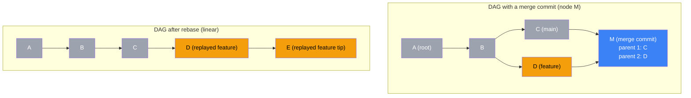

# Ch 06: Merge Strategies and the DAG 🔴

> **What you'll learn:**
> - The mathematical structure of Git's Directed Acyclic Graph (DAG) and how it models all possible histories
> - Fast-forward vs. recursive (three-way) vs. ort vs. octopus merges — when each strategy is used and why
> - The philosophical debate: linear history (rebase) vs. topological history (merge commits)
> - How `git merge --no-ff`, `git merge --squash`, and `git merge --ff-only` shape your repo's history graph

---

## Git's History Is a DAG

Git's commit history is modeled as a **Directed Acyclic Graph** (DAG). Let's unpack that:

- **Directed:** Each commit points in one direction — to its parent(s). A child commit knows its parent, but a parent doesn't know its children.
- **Acyclic:** There are no loops. A commit's parent is always an older commit. You can't have a commit that is both an ancestor and a descendant of itself.
- **Graph:** The commits are nodes, and the parent relationships are edges.

Every merge commit adds a second (or third, or fourth) edge to the graph. Every rebase removes edges and creates new ones. Understanding the DAG is understanding Git's entire history model.



## Merge Strategies: A Taxonomy

Git supports several merge strategies. You rarely choose them explicitly — Git auto-selects the right one based on the topology of your DAG. But understanding them explains *why* the history looks the way it does.

| Strategy | When Git Uses It | What It Does | Number of Parents |
|---|---|---|---|
| **Fast-forward** | The target branch (e.g., `main`) is a direct ancestor of the source branch (e.g., `feature`). No divergent changes. | Does NOT create a merge commit. Just moves the branch pointer forward to the source's tip commit. | 1 (no merge commit) |
| **Recursive (3-way merge)** | Both branches diverged from their common ancestor. | Creates a merge commit by combining the two tip trees and the common ancestor tree (three inputs). The default strategy for two-branch merges. | 2 |
| **ort** | Git 2.32+ default strategy (replacement for `recursive`). | Faster merge algorithm with improved rename detection. Behaves identically to `recursive` from the user's perspective. | 2 |
| **Octopus** | Merging 3 or more branches simultaneously. | Creates a single merge commit with multiple parents. Faster than chaining multiple recursive merges. | 3+ |
| **Resolve** | Git's legacy 3-way merge (pre-1.6). | Simpler than `recursive` — doesn't handle nested merges as well. Replaced by `recursive`. | 2 |
| **Ours** | Used to record a merge without actually combining changes. | Records a merge commit but takes the current branch's tree verbatim — ignoring the other branch's changes entirely. | 2 |
| **Subtree** | Merging a project into a subdirectory. | Shifts the incoming project's tree into a subdirectory path. | 2 |

### Visualizing Each Strategy

#### Fast-Forward (No Merge Commit)

```
Before merge:
main:    A -- B -- C
feature:       \      \
               D -- E -- F

After merge (git merge feature --ff):
main:    A -- B -- C -- D -- E -- F
                                    \
feature:                             F
```

No merge commit is created. `main`'s history is a single linear line — it looks as if `feature`'s commits were originally made directly on `main`. This is the cleanest history, but it's **only possible when `main` hasn't moved** since the feature branch was created.

#### Recursive / Ort (3-Way Merge)

```
Before merge:
main:    A -- B -- C -- G -- H
feature:       \      \
               D -- E -- F

After merge (git merge feature):
main:    A -- B -- C -- G -- H -- M (merge commit)
               \              /    \
                D -- E -- F-F       feature
```

A merge commit `M` is created. It has two parents: `H` (main's tip) and `F` (feature's tip). The content of `M` is the result of a 3-way merge between trees `C` (common ancestor), `H` (ours), and `F` (theirs).

#### Octopus Merge (3+ Branches)

```
main:    A -- B -- C -- G
feat1:        \     \
               E -- F
feat2:               D -- E
feat3:                     H -- I

After git merge feat1 feat2 feat3:
main:    A -- B -- C -- G -- M (octopus merge: 4 parents)
               \     |     \
                E -- F -- I
```

One merge commit with four parents: `G` (main), `F` (feat1), `E` (feat2), and `I` (feat3). This is the only strategy that creates commits with more than two parents.

## The Philosophy Debate: Rebase vs. Merge

This is one of the most contentious debates in the Git community. Both sides have principled arguments about what "good history" looks like.

### The Linear History Camp (Pro-Rebase)

**Argument:** "I want `git log` to read like a story — a sequence of coherent, atomic changes, one after another. Merge commits are noise. They don't introduce any changes of their own — they're just bookends. A linear history is easy to bisect, easy to `git blame`, and easy to reason about."

**Proponents:** The Linux kernel rebase their personal branches before pushing. Many Rust projects rebase PRs onto `main` before merging.

**What it looks like:**

```
main: A -- B -- C -- D -- E -- F -- G -- H -- I
```

Every commit is a meaningful change. There are no "Merge branch 'feature'" commits. The history is linear and can be bisect directly.

### The Topological History Camp (Pro-Merge)

**Argument:** "I want `git log` to reflect what actually happened — including which features were developed in parallel, which changes arrived together, and which branches were merged when. Rebasing rewrites history and destroys the record of how the code evolved. Merge commits preserve the true timeline."

**Proponents:** Git's own development workflow (Linus merge-commits all PRs). Large teams where feature branches are long-lived and merge commits serve as feature boundaries.

**What it looks like:**

```
main: A -- B -- C -- M -- N -- O -- P -- Q -- R
               \     \     \     \
                D -- FF     \     S -- TT
                             \
                              G -- HH
```

### The Middle Ground: `--no-ff` Merge + Rebasing Features

Most teams settle on a hybrid approach:

1. **Rebase feature branches onto `main` before merging** (keeps individual feature history clean).
2. **Use `git merge --no-ff` to merge the PR** (creates a merge commit even when a fast-forward is possible, preserving the feature boundary).

```
main: A -- B -- C -- M -- Q -- R
               \     \
                D -- E -- F (feature)
                 \            /
                  squash? -- (squash merge or no-ff merge)
```

The result is a history where features are clearly delineated by merge commits, but each feature branch internally is a linear, clean chain of re-based commits.

## Merge Options: Shaping the Graph

| Option | Effect on History | When to Use |
|---|---|---|
| `--ff` (default) | Fast-forward if possible; falls back to recursive merge if not. | Default behavior. Good for feature branches that are up-to-date with main. |
| `--no-ff` | Always create a merge commit, even if fast-forward is possible. | Preserves the feature boundary in history. Good for PRs that span multiple commits. |
| `--ff-only` | Only merge if fast-forward is possible; otherwise, abort. | Ideal for automated CI: ensures no merge conflicts can occur. |
| `--squash` | Combines all changes into a single commit on main; no merge commit; branch history is discarded. | Good for small PRs or when you want exactly one commit per feature. Loses individual commit granularity. |
| `--rebase` (server-side) | Rebases the source branch onto `main` before merging (GitHub squash-and-merge). | Used on GitHub/GitLab PR merges. Creates one clean commit on main. |
| `--no-commit` | Performs the merge but stops before committing, letting you manually review/edit the result. | Useful for complex merges that need manual intervention. |

### Squash Merges: The Nuclear Option

```bash
$ git checkout main
$ git merge --squash feature-branch
Updating abc1234..def5678
Fast-forward
# The changes from the entire feature branch are staged but NOT committed.

$ git commit -m "Add feature X (squashed from 47 commits)"
# Now main has exactly one commit that contains the net effect of all 47 feature commits.
```

**Tradeoff:** You get one clean commit on `main`, but you lose the ability to see the individual steps that led to the feature. You also cannot `git bisect` within the feature — the entire feature is one atomic change.

## Resolving Merge Conflicts During Merge (Not Rebase)

Rebase applies commits one at a time. Merge applies them all at once. This means merge conflicts in a merge are potentially more complex to resolve, because you're reconciling the *entire* branch, not a single commit's worth of changes.

```bash
$ git merge feature
CONFLICT (content): Merge conflict in src/config.py
CONFLICT (content): Merge conflict in src/database.py
CONFLICT (content): Merge conflict in src/api/handlers.py

# Three conflicts! All at once. Resolve them, stage, commit.
$ vim src/config.py src/database.py src/api/handlers.py
$ git add -A
$ git commit  # git auto-creates the merge commit message
```

**The Panic Way:** "Three conflicts? Let me abort and rebase first."

```bash
$ git merge --abort
# Now you're back to pre-merge state. You can rebase and try again.
# But aborting doesn't fix the conflicts — it just delays them.
```

**The Sorcerer Way:** Resolve the conflicts. Git's merge resolution is the same regardless of whether you're merging or rebasing — it's a 3-way merge between ours, theirs, and the common ancestor. If rerere is enabled (see Chapter 7), Git will remember your resolution if this conflict recurs.

## The `git rerere` Interaction with Merges

If you have `git config rerere.enabled true`, Git will remember how you resolved any merge or rebase conflict. The next time the same conflict appears — even in a different branch, different merge, or different rebase — Git resolves it automatically.

Rerere works for merges and rebases equally. See **Chapter 7** for the detailed explanation.

<details>
<summary><strong>🏋️ Exercise: Shape the DAG with Merge Strategies</strong> (click to expand)</summary>

### The Challenge

You have a repository with the following state:

```bash
$ git log --oneline --graph --all
* f8e9a0b (feature/notifications) Add notification preferences API
* d7c6b5a Store notification settings in database
* c5b4a39 Create notification schema migration
| * 1a2b3c4 (main) Update README with deployment instructions
| * 0z9y8x7 Fix typo in CI pipeline config
|/
* b3a2c1d (origin/main) Initial project setup
```

Your team lead gave you the following policy:
1. Feature branches must be rebased onto the latest `main` before merging.
2. Feature PRs must be merged with `--no-ff` to preserve the feature boundary.
3. After merging, the feature branch must be deleted.

Your task: Perform the entire workflow to merge `feature/notifications` into `main` per the team policy.

<details>
<summary>🔑 Solution</summary>

```bash
# Step 1: Update main to latest (fetch from remote)
$ git checkout main
$ git pull origin main
Updating b3a2c1d..1a2b3c4
Fast-forward

# Verify main is up to date
$ git log --oneline -3
1a2b3c4 (HEAD -> main, origin/main) Update README with deployment instructions
0z9y8x7 Fix typo in CI pipeline config
b3a2c1d Initial project setup

# Step 2: Rebase the feature branch onto the updated main
$ git checkout feature/notifications
Switched to branch 'feature/notifications'

$ git rebase main
Successfully rebased and updated refs/heads/feature/notifications.

# After rebase, the feature branch is on top of main's latest commits
$ git log --oneline --graph --all
* f8e9a0b (HEAD -> feature/notifications) Add notification preferences API
* d7c6b5a Store notification settings in database
* c5b4a39 Create notification schema migration
* 1a2b3c4 (main, origin/main) Update README with deployment instructions
* 0z9y8x7 Fix typo in CI pipeline config
| * (old feature commits — abandoned by rebase, recoverable via reflog)
|/
* b3a2c1d (origin/main) Initial project setup

# Step 3: Switch to main and merge with --no-ff
$ git checkout main
$ git merge --no-ff feature/notifications -m "Merge feature/notifications: Add notification system"
Merge made by the 'ort' strategy.

# After merge, there's a merge commit preserving the feature boundary
$ git log --oneline --graph
*   abc1234 (HEAD -> main) Merge feature/notifications: Add notification system
|\
| * f8e9a0b (feature/notifications) Add notification preferences API
| * d7c6b5a Store notification settings in database
| * c5b4a39 Create notification schema migration
|/
* 1a2b3c4 Update README with deployment instructions
* 0z9y8x7 Fix typo in CI pipeline config
* b3a2c1d Initial project setup

# Step 4: Delete the feature branch
$ git branch -d feature/notifications
Deleted branch feature/notifications (was f8e9a0b).

# Step 5: Push to remote
$ git push origin main
Enumerating objects: 15, done.
Writing objects: 100% (15/15), 1.23 KiB | 1.23 MiB/s, done.
Total 12 (delta 8), reused 3 (delta 0), pack-reused 0
To github.com:you/project.git
   1a2b3c4..abc1234  main -> main

# Result: A clean merge commit on main, the individual feature commits
# are visible via git log --graph, and the feature boundary is preserved.
```

**Key Insight:** The `--no-ff` flag forces a merge commit even when a fast-forward is possible (which it is here after the rebase). This creates a visible "branch" in the graph that marks where the feature started and ended. This is invaluable when reviewing history six months later: you can see exactly which commits comprised the "notification" feature.

</details>
</details>

> **Key Takeaways**
> - Git models history as a Directed Acyclic Graph (DAG) where each commit points to its parents — merge commits add multiple edges, rebases rewire edges
> - Fast-forward merges just move the branch pointer (no merge commit); recursive/ort merges create a new commit with two parent edges
> - The rebase-vs-merge debate is about readability: linear history (rebase) is easy to bisect; topological history (merge) preserves the true timeline of parallel work
> - `--no-ff` preserves the feature boundary; `--squash` collapses an entire branch into one commit; `--ff-only` ensures no surprises
> - The hybrid approach (rebase feature onto main, then `--no-ff` merge) gives you clean individual commits AND preserved feature boundaries

> **See also:** [Chapter 7: Rerere (Reuse Recorded Resolution) 🔴](ch07-rerere.md) to automate conflict resolution for recurring merges, and [Chapter 8: The Reflog (Time Travel) 🔴](ch08-reflog-time-travel.md) to recover commits abandoned during destructive operations.