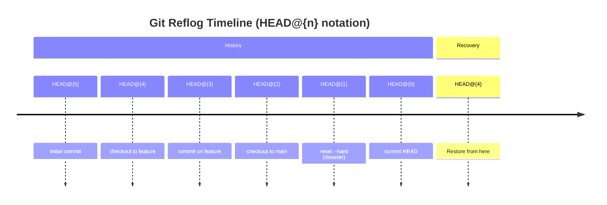

# Ch 08: The Reflog (Time Travel) 🔴

> **What you'll learn:**
> - What the reflog is: a local, append-only log of every HEAD movement in your repository
> - How to recover "deleted" branches, undo `git reset --hard`, and resurrect lost commits
> - The difference between the branch reflog and the per-branch reflogs
> - How `git gc` eventually destroys unreachable objects — and why you have weeks of grace period

---

## The Golden Rule Revisited

> **Almost nothing in Git is permanently deleted.**

When you run `git reset --hard`, `git commit --amend`, or even drop a stash, the objects (commits, trees, blobs) **don't go away**. They become *unreachable* — no branch or tag points to them — but they still live in `.git/objects/`. The garbage collector (`git gc`) only permanently deletes unreachable objects after a configurable grace period: **30 days for reflog entries, 90 days for unreachable commits, 14 days for new unreachable objects**.

The reflog is your proof. It's Git's safety net. And it's the most powerful disaster recovery tool you have.

## What Is the Reflog?

The reflog (reference log) is an append-only log that records every time a ref (branch, HEAD, stash, remote-tracking branch) changes. It's stored in `.git/logs/` as plain text files.

```bash
$ git reflog
a1b2c3d HEAD@{0}: commit: Fix production database migration
e5f6a7b HEAD@{1}: reset: moving to HEAD~1
b3c4d5e HEAD@{2}: commit: Add user authentication module
f7a8b9c HEAD@{3}: checkout: moving from main to feature/auth
c5d6e7f HEAD@{4}: commit: Merge branch 'feature/api' into main
...
```

Each line records:
1. **The new commit hash** the ref was set to
2. **The reflog selector** (`HEAD@{0}`, `HEAD@{1}`, etc.)
3. **The action** that caused the ref to change (`commit`, `reset`, `checkout`, `merge`, `rebase`, etc.)

`HEAD@{0}` means "the current HEAD position." `HEAD@{1}` means "where HEAD was before the most recent change." `HEAD@{2}` means "two changes ago." The numbers go backward — `HEAD@{100}` is the 100th previous HEAD position.



## When the Reflog Saves You

### Scenario 1: Accidental `git reset --hard`

You ran `git reset --hard HEAD~3` to undo your last three commits. Now they're gone. Or so you think.

```bash
# Before the disaster:
$ git log --oneline
f8e9d0c (HEAD -> main) Commit 3: Fix API endpoint
d7c8b9a Commit 2: Add validation logic
c6b7a8f Commit 1: Initial API module
b5a6f7e Commit 0: Project setup

# The panic command:
$ git reset --hard HEAD~3
HEAD is now at b5a6f7e Project setup

# After: your three commits are "gone"
$ git log --oneline
b5a6f7e (HEAD -> main) Project setup

# The Sorcerer's recovery:
$ git reflog
f8e9d0c HEAD@{0}: reset: moving to HEAD~3
d7c8b9a HEAD@{1}: commit: Fix API endpoint
c6b7a8f HEAD@{2}: commit: Add validation logic
f8e9d0c HEAD@{3}: commit: Initial API module
b5a6f7e HEAD@{4}: commit: Project setup

# The commits are still there! Just find the hash before the reset:
$ git reset --hard f8e9d0c
HEAD is now at f8e9d0c Commit 3: Fix API endpoint

# All three commits are restored. The reflog saved you.
```

### Scenario 2: Deleted Branch

You ran `git branch -D feature/auth` to delete a branch. Now you need it back.

```bash
# Before deletion:
$ git branch
  main
* feature/auth

# The destructive command:
$ git checkout main
$ git branch -D feature/auth
Deleted branch feature/auth (was a1b2c3d).

# Recovery:
$ git reflog
a1b2c3d HEAD@{0}: checkout: moving from feature/auth to main
b2c3d4e HEAD@{1}: commit: Add JWT token refresh logic
c3d4e5f HEAD@{2}: commit: Implement user registration flow
a1b2c3d HEAD@{3}: commit: Initial auth module

# The branch tip was a1b2c3d — recreate it:
$ git branch feature/auth a1b2c3d
# Or, if you want ALL the commits the branch had, use the oldest reflog entry
# reachable from that branch. The branch reflog is still available at:
# .git/logs/refs/heads/feature/auth (until git gc deletes it)

$ git checkout feature/auth
# Branch recovered! All commits intact.
```

### Scenario 3: `git commit --amend` Regret

You amended a commit to fix the message, but you realize you forgot to include a file. Now the original commit is "gone."

```bash
$ git commit -m "Add API endpoint"
$ # Oops — forgot to include tests.py
$ git add tests.py
$ git commit --amend -m "Add API endpoint with tests"

# The original commit (without tests.py) is unreachable.
# But it's in the reflog:

$ git reflog
d1e2f3a HEAD@{0}: commit (amend): Add API endpoint with tests
c2d3e4f HEAD@{1}: commit: Add API endpoint
b3c4d5e HEAD@{2}: commit: Previous commit

$ git show c2d3e4f  # Inspect the pre-amend commit
$ git cherry-pick c2d3e4f  # Or reset back to it if needed
```

## The Reflog Is Local

The reflog is **not** pushed to remotes. It lives entirely in `.git/logs/`. Your collaborators have their *own* reflogs that record *their* HEAD movements. This means:

- If you `git push --force` and destroy commits on the remote, *your local reflog* might still have them.
- If someone else deletes a branch and force-pushes, *your local reflog* still has the pre-delete commits.
- If you clone a fresh repo, you get no reflog from the source — only from the point of clone onward.

## Branch-Specific Reflogs

Every branch has its own reflog, stored at `.git/logs/refs/heads/<branch-name>`. You can view it with:

```bash
$ git reflog show main
a1b2c3d main@{0}: commit: Latest main commit
b2c3d4e main@{1}: commit: Previous main commit
...

$ git reflog show feature/auth
c3d4e5f feature/auth@{0}: commit: Add JWT token refresh
d4e5f6a feature/auth@{1}: commit: Implement registration
...
```

The branch reflog is independent of HEAD's reflog. When you delete a branch, its reflog file stays in `.git/logs/refs/heads/` for the grace period (30 days by default). This means you can recover a deleted branch even if `HEAD` never pointed to it directly.

## Grace Periods and Garbage Collection

`git gc` (garbage collection) is what permanently deletes unreachable objects. It runs automatically (every ~2 weeks, or after many loose objects accumulate). It prunes (deletes) objects based on these rules:

| Object Type | Grace Period | When Pruned |
|---|---|---|
| **Reflog entries** | `gc.reflogExpire` (default: 90 days) | After 90 days of inactivity |
| **Unreachable commits reachable from reflog** | `gc.reflogExpireUnreachable` (default: 30 days) | After 30 days if no ref points to them |
| **Orphaned objects (no reflog entry)** | `gc.pruneExpire` (default: 14 days) | After 14 days, unreachable |
| **Loose objects** | Packaged by `git gc` during routine maintenance | When they're older than 2 weeks |

**You have at least 14 days and often 30-90 days to recover lost objects.** This is not a race. If you realize you lost a commit *today*, it's still there *today*.

```bash
# Force garbage collection NOW (don't do this unless you want to clean the repo):
$ git gc --prune=now
# This prunes ALL unreachable objects immediately. Don't run this after a mistake
# — you'll lose the very objects you need to recover.

# Check what's about to be pruned:
$ git fsck --unreachable --no-reflogs
# Lists all unreachable objects. These are candidates for garbage collection.
```

## The Panic Way vs. The Sorcerer Way

**The Panic Way:**
```bash
# 💥 HAZARD: Running gc right after a mistake
$ git reset --hard HEAD~3  # Lost three commits
$ git gc --prune=now       # 💥 DESTROYS the unreachable commits
# Gone forever. You would have had 30 days to recover, but you
# manually truncated the safety net.
```

**The Sorcerer Way:**
```bash
# ✅ FIX: Never run gc after a disaster — the reflog is your friend.
$ git reset --hard HEAD~3  # Lost three commits
$ git reflog                # Find the commit hash before the reset
$ git reset --hard HEAD@{2} # Reset back to it — fully recovered
# No gc needed. No objects destroyed.
```

## Finding Orphaned Commits with `git fsck`

If the reflog doesn't help (e.g., it expired, or you ran `git gc`), your last resort is `git fsck` — the filesystem check utility that scans `.git/objects/` for dangling commits.

```bash
$ git fsck --lost-found
Checking object directories: 100% (256/256), done.
dangling commit a1b2c3d4e5f6a7b8c9d0e1f2a3b4c5d6e7f8a9b0
dangling commit b2c3d4e5f6a7b8c9d0e1f2a3b4c5d6e7f8a9b0c1
dangling blob c3d4e5f6a7b8c9d0e1f2a3b4c5d6e7f8a9b0c1d2

# These "dangling" commits are unreachable — no branch points to them.
# But they exist in the object store. You can inspect them:

$ git show a1b2c3d4e5f6a7b8c9d0e1f2a3b4c5d6e7f8a9b0
# If this is the commit you lost, create a branch pointing to it:
$ git branch recovered-branch a1b2c3d4e5f6a7b8c9d0e1f2a3b4c5d6e7f8a9b0
```

`git fsck --lost-found` also creates `.git/lost-found/` with symlinks to all dangling objects, making them reachable from the reflog again. This resets the grace period — the objects are now "touched" and won't be pruned for another 14 days.

## Time-Travel Syntax: `HEAD@{N}` and `@{date}`

The reflog supports two notations for time travel:

```bash
# Move HEAD to where it was 5 changes ago
$ git reset --hard HEAD@{5}

# Move HEAD to where it was at 9 AM this morning
$ git reset --hard HEAD@{2023-06-15 09:00:00}

# Move HEAD to where main was at yesterday 8:00 AM
$ git reset --hard main@{yesterday 08:00}

# Move HEAD to where it was 2 hours ago
$ git reset --hard HEAD@{2.hours.ago}
```

These are **reflog selectors** — they resolve to the commit hash at that reflog position. They're more human-readable than raw hashes.

<details>
<summary><strong>🏋️ Exercise: Recover a Deleted Branch and Undo a Hard Reset</strong> (click to expand)</summary>

### The Challenge

You have a repository with the following state:

```bash
$ git log --oneline --all --graph
* f8e9d0c (HEAD -> main) Fix typo in README
* d7c8b9a Update dependencies
* c6b7a8f Add CI pipeline config
* b5a6f7e feature/auth (branch created 2 days ago)
* a4b5c6d Add login page component
* f3e4d5c Initial auth module
* e2f3d4c Project setup
```

A junior developer accidentally ran these commands:
```bash
$ git checkout main
$ git branch -D feature/auth
Deleted branch feature/auth (was b5a6f7e).
$ git reset --hard HEAD~2
HEAD is now at c6b7a8f Add CI pipeline config
```

Now:
1. The `feature/auth` branch is deleted
2. The `main` branch lost its last two commits (`f8e9d0c` and `d7c8b9a`)
3. You need to recover BOTH the deleted branch AND the lost main commits

**Your task:** Use the reflog to restore both `feature/auth` and `main` to their pre-disaster state. Do NOT use `git fsck`.

<details>
<summary>🔑 Solution</summary>

```bash
# 1. Check the current state — everything looks wrong
$ git log --oneline -3
c6b7a8f (HEAD -> main) Add CI pipeline config
e2f3d4c Project setup

$ git branch
* main
# feature/auth is gone

# 2. Check the reflog — it records all the movements
$ git reflog
c6b7a8f HEAD@{0}: reset: moving to HEAD~2
f8e9d0c HEAD@{1}: commit: Fix typo in README
d7c8b9a HEAD@{2}: commit: Update dependencies
c6b7a8f HEAD@{3}: commit: Add CI pipeline config
e2f3d4c HEAD@{4}: commit: Project setup
b5a6f7e HEAD@{5}: checkout: moving from feature/auth to main
a4b5c6d HEAD@{6}: commit: Add login page component
f3e4d5c HEAD@{7}: commit: Initial auth module
```

The reflog shows the entire history. Here's what happened:
- `HEAD@{5}`: The dev checked out `main` from `feature/auth`
- `HEAD@{4}`: They deleted `feature/auth` (the reflog entry still shows `b5a6f7e`)
- `HEAD@{0}`: They ran `reset --hard HEAD~2`, moving `main` back two commits

# 3. Recover the deleted branch
$ git branch feature/auth b5a6f7e
# The branch tip was b5a6f7e — that's all we need to recreate it

# 4. Recover main's lost commits
$ git checkout main
$ git reset --hard HEAD@{1}
# HEAD@{1} was f8e9d0c — the commit BEFORE the reset
# This undoes the reset, restoring both lost commits

# 5. Verify both are recovered
$ git log --oneline --all --graph
* f8e9d0c (HEAD -> main) Fix typo in README
* d7c8b9a Update dependencies
* c6b7a8f Add CI pipeline config
| * b5a6f7e (feature/auth) feature/auth tip
| * a4b5c6d Add login page component
| * f3e4d5c Initial auth module
|/
* e2f3d4c Project setup

# SUCCESS! Both feature/auth and main are fully restored.
# The reflog contained every movement — we just needed to find the right
# positions to reset the branches back to.
```

**Key Insight:** The reflog is append-only — it records every ref change, including deletions. When a branch is deleted, its reflog file may still exist in `.git/logs/refs/heads/<branch>`. Even if that file is gone, the `HEAD` reflog still records the checkout that *preceded* the deletion. The branch tip commit is recorded in that checkout entry. You just need the commit hash — and `git branch <name> <hash>` recreates the pointer.

</details>
</details>

> **Key Takeaways**
> - The reflog records every HEAD and ref movement — it's append-only and local to your machine
> - `HEAD@{n}` means "where HEAD was n changes ago" — use it for time-travel recovery
> - Deleted branches are recoverable via the reflog for 30-90 days before `git gc` prunes them
> - `git reset --hard` only moves pointers — it never destroys objects; the old commits are still in `.git/objects/`
> - Never run `git gc --prune=now` immediately after a mistake — you'll destroy the very objects you need to recover
> - `git fsck --lost-found` is your last resort when the reflog has expired

> **See also:** [Chapter 9: Capstone: The Forensic Repo Rescue 🔴](ch09-capstone-forensic-rescue.md) to apply everything you've learned in a full disaster recovery scenario, and [Chapter 3: The Power of Interactive Rebase 🟡](ch03-interactive-rebase.md) to understand how rebasing creates new commits and abandons old ones (all recoverable via the reflog).