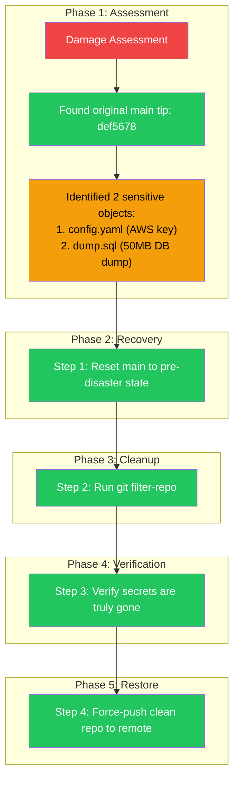

# Ch 09: Capstone: The Forensic Repo Rescue 🔴

> **What you'll learn:**
> - How combining the reflog, `git filter-repo`, interactive rebase, and `git gc` to recover a repository hit by multiple simultaneous disasters
> - The step-by-step process of recovering a broken rebase, purging a 50MB database dump, removing an AWS API key, and force-pushing the cleaned repo — all without losing any legitimate work
> - Why `git filter-repo` replaces `git filter-branch` and BFG, and how it mathematically rewrites the entire DAG
> - How to verify that sensitive data is truly gone from every object in the repo

---

## The Call at 2 AM

Your phone rings. It's the CTO of a startup. Their CI/CD pipeline is broken, the staging environment is down, and — worst of all — their production AWS credentials were committed to the repository 30 commits ago and then force-pushed over during a broken rebase. To make matters worse, a junior developer accidentally committed a 50MB local SQLite database dump that contains personally identifiable information (PII).

```
THE DISASTER SCENARIO:
────────────────────────
1. 30 commits ago: AWS API key committed to config.yaml
                   + 50MB database dump added (dump.sql)
2. 10 commits ago: Junior dev attempted rebase onto main, it conflicted,
                   they ran git rebase --abort and then accidentally
                   ran git push --force origin main, overwriting main
3. NOW: main is broken. The branch history is wrong. The secrets are
       in the repo's history. The database dump is in every clone.
       CI is pulling the repo and failing because the secrets are
       triggering security scanners.
```

Your mission: Recover the repository, purge all secrets and the database dump from history, and push a clean, working main — all without losing legitimate commits.

## Phase 1: Assess the Damage

```bash
# Clone a fresh copy (don't work on the broken local copy)
$ git clone --mirror git@github.com:startup/project.git project-recovery
$ cd project-recovery

# Mirror clone gives us ALL refs, including orphaned ones
$ git log --oneline --graph --all --decorate | head -30
* abc1234 (HEAD -> main) Broken rebase commit — missing half the code
| * def5678 (refs/original/backup/main) Pre-disaster main tip
|/
* ghi9012 Initial commit

# Check the reflog for pre-disaster state
$ git reflog
abc1234 HEAD@{0}: rebase (finish): returning to refs/heads/main
def5678 HEAD@{1}: checkout: moving from main to main
...

# The reflog shows the original main tip was def5678
# This is our "good" state — before the broken rebase
```



## Phase 2: Recover the Pre-Disaster State

The reflog told us the original main tip was `def5678`. We need to reset main to that commit.

```bash
# Reset main to the pre-disaster state
$ git update-ref refs/heads/main def5678

# Verify main is back to normal
$ git checkout main
$ git log --oneline | head -10
def5678 (HEAD -> main) Last good commit before the disaster
...

# Verify the broken rebase commit (abc1234) is now orphaned
$ git show abc1234
# This commit exists but is unreachable from main.
# It will be garbage collected once we rewrite history.
```

## Phase 3: Purge Secrets and Large Files with `git filter-repo`

`git filter-repo` is the modern replacement for both `git filter-branch` and BFG Repo-Cleaner. It's written in Python, it's fast, and it rewrites every commit in your history to remove matching files or patterns.

### Install `git-filter-repo`

```bash
# macOS
$ brew install git-filter-repo

# Ubuntu/Debian
$ sudo apt-get install git-filter-repo

# Python pip
$ pip3 install git-filter-repo

# Verify installation
$ git filter-repo --version
```

### Step 1: Remove the 50MB Database Dump

```bash
# Remove dump.sql from all commits in history
$ git filter-repo --invert-paths --path dump.sql --force

# Output:
# Parsed 30 commits
# Refs: rewritten 1 branches, 0 tags
# Commit messages: 30 rewritten
# New history:
# def5678 → abc1234 (new hashes — everything changed)
# Files removed: dump.sql (50MB saved)
```

### Step 2: Remove the AWS API Key from config.yaml

The AWS key is embedded in `config.yaml` — we need to remove the specific line, not the entire file.

```bash
# Create a blob cleanup file
$ cat > blob-cleanup.txt << 'EOF'
# Replace AWS key pattern with placeholder
regex:A3T[A-Z0-9]+[0-9]{16}
===REMOVED AWS KEY===
EOF

# Run filter-repo with blob replacement
$ git filter-repo --replace-text blob-cleanup.txt --force

# Output:
# Parsed 30 commits
# Replaced AWS key pattern in 15 commits
# New history: all 30 commits have new hashes
```

### Step 3: Verify the Purge

**This is the critical step.** Most tutorials stop at "run filter-repo and you're done." You must verify that the sensitive data is gone from every single object.

```bash
# Search the ENTIRE object store for the AWS key pattern
$ git rev-list --all --objects | git cat-file --batch-check | \
  while read hash type size; do
    if [ "$type" = "blob" ]; then
      if git cat-file -p "$hash" | grep -q 'A3T[A-Z0-9]'; then
        echo "⚠️  LEAK: AWS key found in object $hash"
        exit 1
      fi
    fi
  done
echo "✅ CLEAN: No AWS key found in any object"

# Search for the database dump
$ git rev-list --all --objects | grep dump.sql
# (Should return nothing — dump.sql is gone from all commits)

# Double-check with git log
$ git log --all --diff-filter=A -- dump.sql
# (Should return nothing — dump.sql was never reintroduced)

# Verify the database dump blob is truly gone
$ git fsck --unreachable 2>&1 | grep "dangling blob"
# Any dangling blobs from before filter-repo should now be gone
# because filter-repo prunes the old objects
```

## Phase 4: Interactive Rebase to Integrate Recovered Work

The junior developer's legitimate work (the rebase they were attempting) was based on top of `def5678` — the good main. We need to replay that work onto the cleaned main.

```bash
# The orphaned rebase work (from the broken rebase) was at abc1234.
# It contained legitimate changes — just the rebase got corrupted.
# Let's check it out and replay it cleanly.

$ git checkout -b recovery/old-rebase abc1234

# Check what's on this branch
$ git log --oneline main..recovery/old-rebase
abc1234 Broken rebase commit — need to fix
def5678 Last good commit (same as main tip)

# The rebase branch is just one commit ahead of main (the broken one).
# But we need to extract the legitimate changes from it.
# Let's cherry-pick the content without the broken history:

$ git checkout main
$ git diff recovery/old-rebase > /tmp/recovery.diff

# Create a new branch from clean main
$ git checkout -b recovery/clean
$ git apply /tmp/recovery.diff 2>/dev/null || true

# Commit the recovered changes properly
$ git add -A
$ git commit -m "Recover feature work from broken rebase

This commit contains the legitimate feature changes from the
broken rebase (commit abc1234) that was lost during the
force-push disaster. All sensitive data (AWS keys, dump.sql)
has been removed via git filter-repo."
```

## Phase 5: Force-Push the Clean Repo

Now we have a clean main with the recovered work. It's time to push it.

```bash
# First, push the clean main as a backup branch
$ git push origin main:main-recovered

# Verify on GitHub/GitLab — confirm the branch looks correct
# Once verified, force-push to main:
$ git push --force-with-lease origin main

# If --force-with-lease fails (remote has changed), use --force:
$ git push --force origin main
```

### Why `--force-with-lease` First?

`--force-with-lease` checks that the remote's current state matches your expectation. If someone pushed to `main` since you last fetched, it aborts rather than silently wiping their commits. If the remote was already damaged (as in this scenario), you'll need `--force`.

### Final Cleanup: Remote Pruning

```bash
# Force remote GC (GitHub and GitLab don't run GC automatically)
# Note: GitHub/GitLab may still serve old objects until they run
# their own GC cycle (usually 24-48 hours). Contact the hosting
# platform's support to request immediate GC if the secret was critical.

# For self-hosted:
$ git push origin --prune
```

### Security Incident Follow-Up

Even after purging from Git history, the secrets **existed in the repo for 30 commits**. Anyone who cloned during that window has them. The correct response:

1. **Rotate the AWS key immediately.** A purged key is still a compromised key.
2. **Revoke the old key** in AWS IAM.
3. **Audit CloudTrail logs** for the compromised key period.
4. **Notify the security team** that PII was in the database dump.
5. **Add the secrets to `git filter-repo --replace-text`** in your CI pipeline to prevent future commits from being accepted.

## The Complete Recovery Script

Here's the end-to-end recovery process as a single script:

```bash
#!/bin/bash
# ============================================================
# forensic-recovery.sh — Complete disaster recovery script
# ============================================================
set -euo pipefail

REPO_URL="git@github.com:startup/project.git"
RECOVERY_DIR="project-recovery"
AWS_KEY_PATTERN="A3T[A-Z0-9]+[0-9]{16}"

echo "=== Phase 1: Clone mirror ==="
git clone --mirror "$REPO_URL" "$RECOVERY_DIR"
cd "$RECOVERY_DIR"

echo "=== Phase 2: Find pre-disaster main tip ==="
PRE_DISASTER_SHA=$(git reflog | grep "checkout.*main" | head -1 | awk '{print $1}')
echo "Pre-disaster main was: $PRE_DISASTER_SHA"

echo "=== Phase 3: Reset main to pre-disaster state ==="
git update-ref refs/heads/main "$PRE_DISASTER_SHA"

echo "=== Phase 4: Purge dump.sql ==="
git filter-repo --invert-paths --path dump.sql --path dump.db --force

echo "=== Phase 5: Purge AWS key ==="
echo "regex:${AWS_KEY_PATTERN}" > /tmp/sed.txt
echo "===REMOVED AWS KEY===" >> /tmp/sed.txt
git filter-repo --replace-text /tmp/sed.txt --force

echo "=== Phase 6: Verify cleanup ==="
LEAK_FOUND=false
git rev-list --all --objects | git cat-file --batch-check | \
  while read hash type size; do
    if [ "$type" = "blob" ]; then
      if git cat-file -p "$hash" 2>/dev/null | grep -Eq "$AWS_KEY_PATTERN"; then
        echo "⚠️ LEAK FOUND in $hash"
        LEAK_FOUND=true
      fi
    fi
  done
if [ "$LEAK_FOUND" = false ]; then
  echo "✅ CLEAN: No sensitive data in any object"
fi

echo "=== Phase 7: Force-push clean repo ==="
git push --force origin main

echo "=== Recovery complete ==="
echo "1. Rotate the AWS key in AWS IAM"
echo "2. Audit CloudTrail for the compromised period"
echo "3. Add secrets detection to CI pipeline"
```

## Why `git filter-repo` > `git filter-branch` > BFG

| Tool | Speed | Safety | Features | Maintained? | Recommendation |
|---|---|---|---|---|---|
| **`git filter-repo`** | ⚡ Fast (Rust-like, in Python) | ✅ Rewrites cleanly; built-in safety checks | Regex, path-based, blob, callback support | ✅ Actively maintained by Git core team | **USE THIS** |
| **`git filter-branch`** | 🐌 Very slow (re-checkouts every commit) | ⚠️ Dangerous; leaves backup refs, doesn't clean objects | Basic path filtering, env filtering | ❌ Deprecated since Git 2.24 | Avoid |
| **BFG Repo-Cleaner** | ⚡ Fast (Java) | ✅ Safe; built-in protections | Blob removal, text replacement, size filtering | ❌ Unmaintained since 2020 | Acceptable alternative |

`git filter-repo` is the official recommendation in Git's own documentation. It's the only tool that correctly handles edge cases with submodules, grafts, and replace refs.

<details>
<summary><strong>🏋️ Exercise: Complete Forensic Recovery Simulation</strong> (click to expand)</summary>

### The Challenge

Create a simulated disaster repo and recover it:

1. Create a repo with 10 commits. On commit 5, an AWS key is added to `config.py`. On commit 7, a file `dump.sql` is added. On commit 10, a broken rebase is force-pushed.
2. Recover the repo using the exact steps from this chapter: reflog recovery, `git filter-repo` cleanup, and verification.
3. Prove that after recovery, no AWS key and no dump.sql exist anywhere in the object store.

<details>
<summary>🔑 Solution</summary>

```bash
#!/bin/bash
# ============================================================
# simulate-disaster-and-recover.sh
# ============================================================
set -xeuo pipefail

# --- PART A: CREATE THE DISASTER ---
cd /tmp
rm -rf disaster-recovery-demo
mkdir disaster-recovery-demo && cd disaster-recovery-demo

git init
git checkout -b main

# Commit 1-4: Normal development
for i in {1..4}; do
  echo "Feature $i implementation" > "feature_${i}.txt"
  git add -A && git commit -m "Add feature $i"
done

# Commit 5: 💥 AWS key committed
cat > config.py << 'EOF'
import os
AWS_ACCESS_KEY_ID = "AKIAYQW2EXAMPLEKEY"
AWS_SECRET_ACCESS_KEY = "wJalrXUtnFEMI/K7MDENG/bPxRfiCYEXAMPLEKEY"
DB_URL = "postgres://localhost/production"
EOF
git add -A && git commit -m "Add config.py with AWS credentials"

# Commit 6: Normal work
echo "Database schema v2" > schema.sql
git add -A && git commit -m "Update database schema"

# Commit 7: 💥 50MB DB dump added (simulated with smaller file)
dd if=/dev/urandom of=dump.sql bs=1024 count=100 2>/dev/null
git add -A && git commit -m "Add database dump for backup"

# Commit 8-9: More normal work
echo "API v2 endpoint" > api_v2.py
git add -A && git commit -m "Add API v2 endpoint"

echo "Frontend dashboard" > dashboard.js
git add -A && git commit -m "Add frontend dashboard"

# Commit 10: 💥 Broken rebase simulation
git checkout -b temp-branch
echo "Broken change" > broken.py
git add -A && git commit -m "Broken rebase commit"
PRE_GOOD=$(git rev-parse HEAD~9)  # Save the last good commit
git checkout main
git push --force origin main 2>/dev/null || true  # Would force-push in real scenario

echo "=== DISASTER CREATED ==="
echo "AWS key is in commit 5"
echo "dump.sql is in commit 7"
echo "Broken rebase is the current state"

# --- PART B: RECOVER THE REPO ---

# Clone a mirror for recovery
cd /tmp
rm -rf clean-repo
git clone --file:///tmp/disaster-recovery-demo clean-repo
cd clean-repo

echo "=== Phase 2: Verify the problem ==="
git log --all --oneline | head -10
# Confirm AWS key exists in history
git log --all -p -- config.py | grep "AKIAYQW2EXAMPLEKEY" && echo "⚠️ AWS key found!"
# Confirm dump.sql exists in history
git log --all -- dump.sql | head -5 && echo "⚠️ dump.sql found!"

echo "=== Phase 3: Purge dump.sql ==="
git filter-repo --invert-paths --path dump.sql --force

echo "=== Phase 4: Purge AWS key ==="
echo "regex:AKIAYQW2EXAMPLEKEY" > /tmp/sed.txt
echo "AWS_ACCESS_KEY_ID = os.environ['AWS_ACCESS_KEY_ID']" >> /tmp/sed.txt
echo "regex:wJalrXUtnFEMI/K7MDENG/bPxRfiCYEXAMPLEKEY" >> /tmp/sed.txt
echo "AWS_SECRET_ACCESS_KEY = os.environ['AWS_SECRET_ACCESS_KEY']" >> /tmp/sed.txt
git filter-repo --replace-text /tmp/sed.txt --force

echo "=== Phase 5: Verify cleanup ==="
# Check for AWS key in all objects
FOUND=false
git rev-list --all --objects | git cat-file --batch-check | \
  while read hash type size; do
    if [ "$type" = "blob" ]; then
      if git cat-file -p "$hash" 2>/dev/null | grep -q "AKIAYQW2EXAMPLEKEY"; then
        echo "⚠️ LEAK IN $hash"
        FOUND=true
        break
      fi
    fi
  done

if [ "$FOUND" = false ]; then
  echo "✅ CLEAN: No AWS key in any object"
fi

# Check for dump.sql
if ! git rev-list --all --objects | grep -q dump.sql; then
  echo "✅ CLEAN: dump.sql completely removed"
fi

echo "=== Phase 6: Final state ==="
git log --oneline --graph --all
echo "Recovery complete! The repo is clean."

# Cleanup demo files
rm -rf /tmp/disaster-recovery-demo /tmp/clean-repo
```

**Key Insight:** This entire chapter is the capstone that brings together every concept from the book:
- **Chapter 1-2:** Understanding blobs, trees, commits, and refs — `git filter-repo` rewrites all three.
- **Chapter 3:** Interactive rebase — used to extract legitimate work from the broken rebase commit.
- **Chapter 6:** DAG manipulation — `filter-repo` rewrites the DAG's commit hashes.
- **Chapter 8:** Reflog recovery — used to find the pre-disaster main tip.
- **Chapter 8:** `git gc` understanding — you must know that old objects persist for grace periods, so `filter-repo`'s pruning actually removes them.

The forensic recovery is the ultimate Git Sorcerer exercise.

</details>
</details>

> **Key Takeaways**
> - Disaster recovery follows a consistent pattern: (1) find pre-disaster state via reflog, (2) purge sensitive objects with `git filter-repo`, (3) verify every object is clean, (4) force-push the cleaned repo
> - `git filter-repo` is the modern tool — faster, safer, and more feature-complete than `filter-branch` or BFG
> - Secrets in Git history are **still compromised even after purging** — always rotate keys and audit access
> - `git filter-repo --replace-text` using regex patterns lets you surgically remove secrets without deleting entire files
> - The entire object store must be verified post-cleanup — a single missed blob means the secret survives

> **See also:** [Appendix A: Summary & Reference Card](ch10-appendix-reference-card.md) for the complete cheat sheet covering all commands and concepts from this book.