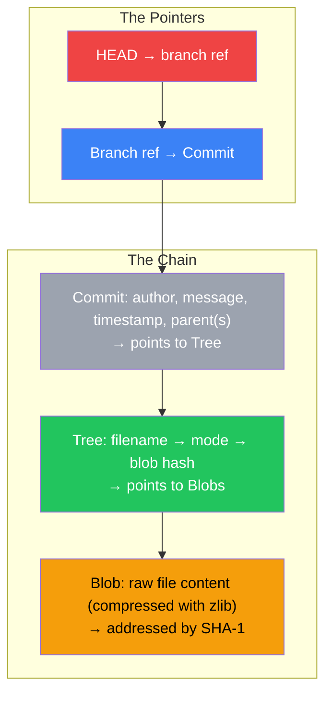
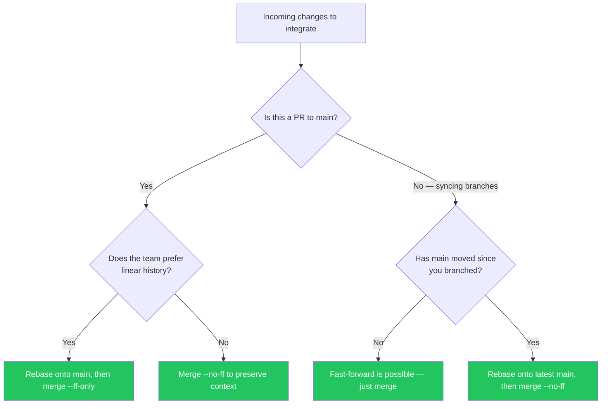
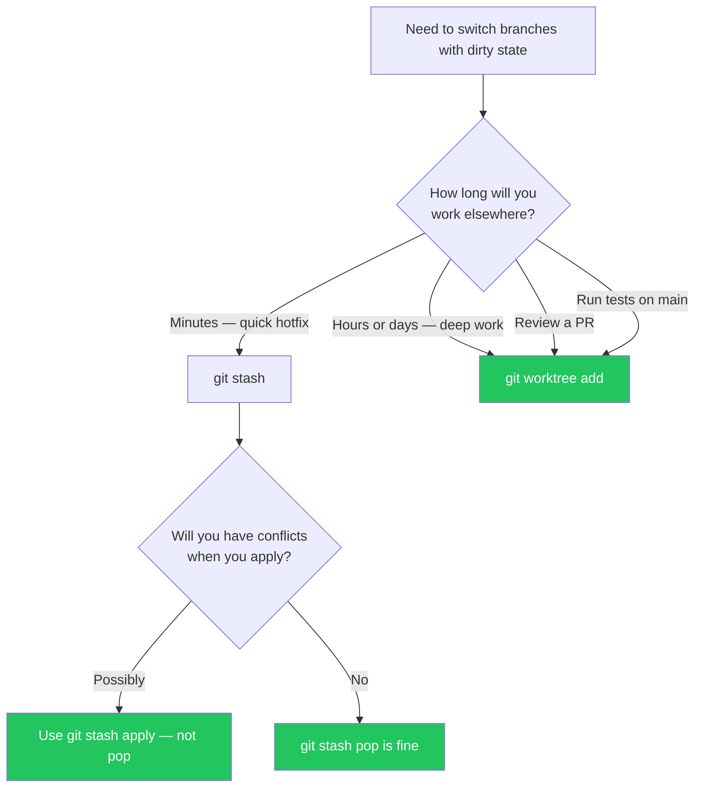

# Appendix A: Summary & Reference Card

> **What you'll find here:**
> - Complete command cheat sheet organized by task
> - `git reset --soft` vs `--mixed` vs `--hard` comparison
> - Essential `.gitconfig` aliases used by principal engineers
> - Quick reference for reflog syntax, SHA-1 selectors, and time-travel commands
> - The complete `rerere`, `bisect`, and `filter-repo` reference

---

## The Git Reset Modes

The single most misunderstood command in Git. Here's the definitive reference.

| Mode | Changes Working Directory? | Changes Index (Staging)? | Moves HEAD? | Destroys Commits? | Use Case |
|---|---|---|---|---|---|
| **`--soft`** | ❌ No | ❌ No | ✅ Yes | ❌ No (commits become unreachable) | Undo the commit but keep everything staged. You want to re-commit with a different message or add more files. |
| **`--mixed`** (default) | ❌ No | ✅ Yes (unstages everything) | ✅ Yes | ❌ No (commits become unreachable) | Undo the commit AND unstage everything. You want to re-stage selectively before re-committing. |
| **`--hard`** | ✅ Yes (destroys uncommitted changes) | ✅ Yes (clears index) | ✅ Yes | ❌ No (commits become unreachable, but recoverable via reflog for 30 days) | **💥 HAZARD:** Destroy everything since the last commit — working tree, index, and commits. Only use when you're 100% sure you want to throw away all local work. |
| **`--keep`** | ❌ No (aborts if uncommitted changes conflict) | ✅ Yes | ✅ Yes | ❌ No | Safer alternative to `--hard`: only resets if there are no local modifications that would conflict with the reset target. |

```mermaid
graph TD
    subgraph "Current state: 3 commits ahead"
        C1["Commit A (safe anchor)"] --> C2["Commit B"] --> C3["Commit C"]
        C3 --> C4["Commit D (HEAD)"]
        WT["Working tree: modified files"]
        IDX["Index: staged changes"]
    end

    subgraph "After git reset --soft A"
        S1["HEAD → Commit A"]
        S2["Index: B+C+D changes all staged"]
        S3["Working tree: unchanged"]
    end

    subgraph "After git reset --mixed A"
        M1["HEAD → Commit A"]
        M2["Index: clean (nothing staged)"]
        M3["Working tree: B+C+D changes present"]
    end

    subgraph "After git reset --hard A"
        H1["HEAD → Commit A"]
        H2["Index: clean"]
        H3["Working tree: EXACTLY matches Commit A 💥"]
    end

    C4 -. "| HEAD| S1
    C4 -. "|| IDX| M2
    C4 -. "| WT| H3

    style C4 fill:#ef4444,color:#fff
    style H3 fill:#ef4444,color:#fff
    style S3 fill:#22c55e,color:#fff
    style M3 fill:#f59e0b,color:#000
```

## Essential `.gitconfig` Aliases

Principal engineers don't type `git log --oneline --graph --decorate --all` every time. They alias it. Here's a battle-tested `.gitconfig` with aliases used by engineering teams at scale.

```ini
# ~/.gitconfig
[user]
    name = Your Name
    email = your.email@example.com

[core]
    editor = vim
    autocrlf = input
    pager = delta  # or: less -R

[rerere]
    enabled = true
    gc = 60

[gc]
    auto = 256
    reflogExpire = 90
    reflogExpireUnreachable = 30

[diff]
    algorithm = histogram  # Better diff for code
    renames = copies

[push]
    default = simple
    autoSetupRemote = true

[pull]
    rebase = true  # Equivalent to git pull --rebase

[alias]
    # === LOG ALIASES ===
    lg     = log --oneline --graph --decorate --all
    lga    = log --oneline --graph --decorate --all
    lgf    = log --oneline --graph --decorate --all --name-only
    lge    = log --all --oneline --grep
    who    = log --oneline --graph --decorate --all --format='%C(auto)%h%Creset %C(blue)%an%Creset %C(green)%cd%Creset %s' --date=relative
    blame  = blame -w -M -C  # Ignore whitespace, detect moves/copies

    # === STATUS ALIASES ===
    st     = status -sb  # Short, branch info
    diff   = diff --stat
    diffs  = diff --stat --ignore-space-change
    dic    = diff --cached

    # === BRANCH ALIASES ===
    br     = branch -vv
    brr    = branch -vvr
    co     = checkout
    cob    = checkout -b
    sw     = switch
    swc    = switch -c

    # === MERGE/REBASE ALIASES ===
    mg     = merge --no-ff
    mff    = merge --ff-only
    mgq    = merge --no-ff --quiet
    rb     = rebase
    rbi    = rebase -i
    rbm    = rebase main
    rbo    = rebase --onto

    # === REFLOG ALIASES ===
    rl     = reflog
    rlg    = reflog show
    rlh    = reflog --all

    # === CLEANUP AND MAINTENANCE ===
    clean-branch = !git branch --merged | grep -v '\\*' | grep -v 'main" | xargs -n 1 git branch -d
    prune  = remote prune origin
    gcagc  = gc --aggressive --auto
    count  = count-objects -vH

    # === RECOVERY ALIASES ===
    unstage = reset HEAD --
    undo    = reset --soft HEAD~1
    undo2   = reset --soft HEAD~2
    undo3   = reset --soft HEAD~3
    wipe    = !git add -A && git commit -qm 'WIPE SAVEPOINT' && git reset --hard HEAD~1
    reclaim = !git fsck --lost-found 2>&1 | grep "dangling commit" | awk '{print $3}' | xargs git log --oneline
    rescue  = !git reflog | head -20

    # === WORKTREE ALIASES ===
    wta    = !f() { git worktree add ../$(basename $(pwd))-$1 -b $1; }; f
    wtl    = worktree list
    wtrm   = worktree remove

    # === STASH ALIASES ===
    sl     = stash list
    sp     = stash push
    spa    = stash apply
    spd    = stash drop
    spu    = stash push -u  # Include untracked files
    spk    = !git stash push -m "$@" && git stash list | head -1
```

## Reflog Quick Reference

### Time-Travel Selectors

| Syntax | Meaning | Example |
|---|---|---|
| `HEAD@{0}` | Current HEAD position | `git show HEAD@{0}` |
| `HEAD@{1}` | Previous HEAD position | `git diff HEAD@{1} HEAD@{0}` |
| `HEAD@{n}` | n positions ago | `git reset --hard HEAD@{5}` |
| `main@{yesterday}` | Where `main` was yesterday | `git diff main@{yesterday} main@{0}` |
| `HEAD@{2023-06-15 09:00}` | Where HEAD was at a specific time | `git show HEAD@{2023-06-15 09:00}` |
| `HEAD@{1.day.ago}` | Where HEAD was 1 day ago | `git log HEAD@{1.day.ago}..HEAD` |
| `HEAD@{2.months.ago}` | Where HEAD was 2 months ago | `git reflog show HEAD@{2.months.ago}` |

### Common Reflog Recovery Patterns

```bash
# "I just ran git reset --hard and lost my commits"
$ git reflog                    # Find the commit before the reset
$ git reset --hard HEAD@{1}     # Undo the reset

# "I deleted a branch and need it back"
$ git reflog                    # Find the last commit of that branch
$ git branch -b recovered-branch <commit-hash>

# "I ran git commit --amend and lost my original commit"
$ git reflog
$ git branch -b pre-amend HEAD@{1}

# "I want to see what main looked like last Friday"
$ git checkout main@{last.friday}
$ git log --oneline -5

# "I need to find the SHA of my branch before someone force-pushed"
$ git reflog show origin/main   # Your local reflog has the pre-push state
```

## `git bisect` Command Reference

| Command | Purpose |
|---|---|
| `git bisect start` | Begin a bisect session |
| `git bisect bad [<commit>]` | Mark the current (or given) commit as bad |
| `git bisect good [<commit>]` | Mark the given commit as good |
| `git bisect run <cmd>` | Automate bisect with a test script (exit 0 = good, 1 = bad, 125 = skip) |
| `git bisect skip` | Skip the current commit (can't be tested) |
| `git bisect reset` | End the bisect session and return to the original branch |
| `git bisect log` | Show the bisect session log (can be saved and replayed) |
| `git bisect replay <file>` | Replay a saved bisect log |
| `git bisect visualize` | Show the current bisect state with gitk or the configured tool |

## `git filter-repo` Command Reference

| Command | Purpose |
|---|---|
| `git filter-repo --path <path> --invert-paths` | Remove a file/directory from all of history |
| `git filter-repo --replace-text <file>` | Replace text patterns across all commits (format: `literal:old` → `new` or `regex:pattern` → `replacement`) |
| `git filter-repo --path-rename <old>=<new>` | Rename a file/directory across all commits |
| `git filter-repo --strip-blobs-bigger-than 50M` | Remove all blobs larger than 50MB |
| `git filter-repo --blob-callback 'if blob.size > 1000000: blob.skip()'` | Python callback for custom filtering |
| `git filter-repo --commit-callback 'if commit.author_name == "bot": commit.skip()'` | Skip commits by author |
| `git filter-repo --force` | Override the safety check that requires a fresh clone (required for non-fresh repos) |

### replace-text File Format

```text
literal:OLD_STRING==>NEW_STRING
regex:PATTERN==>REPLACEMENT
glob:filename
# Each line is a replacement rule
# Use literal for exact matches, regex for patterns
```

## Essential `.gitignore` Patterns

```gitignore
# === Common ignores for all projects ===
# OS files
.DS_Store
Thumbs.db
Desktop.ini

# IDE files
.vscode/
.idea/
*.swp
*.swo
*~

# Build artifacts
dist/
build/
target/
*.o
*.pyc
__pycache__/
node_modules/

# Secrets (ALWAYS gitignore these)
.env
.env.local
.env.*.local
*.pem
*.key
id_rsa
secrets/
config.local.*

# Large files (accidental commits)
*.sql
*.sqlite
*.sqlite3
*.dump
*.zip
*.tar.gz
*.iso
*.dmg
```

## The `git gc` Grace Period Reference

| Object | Grace Period | Config | Default |
|---|---|---|---|
| Reflog entries (reachable) | `gc.reflogExpire` | 90 days |
| Reflog entries (unreachable) | `gc.reflogExpireUnreachable` | 30 days |
| Unreachable commits | `gc.pruneExpire` | 14 days |
| New loose objects | Automatically packed | After 2 weeks |

**Rule of thumb:** You have **at least 14 days** to recover any lost object. In practice, you have **30 days** for commits (they show up in fsck) and **90 days** for any object reachable from the reflog.

## Conflict Marker Anatomy

```python
<<<<<<< HEAD (ours)
DB_URL = "postgresql://localhost/production"
=======
DB_URL = "postgresql://localhost:5432/staging"
>>>>>>> feature/upcoming
```

- `<<<<<<< HEAD` marks the beginning of **your** version (the branch you're merging *into*)
- `=======` is the separator
- `>>>>>>> feature/upcoming` marks the end of **their** version (the branch you're merging *from*)

To resolve: delete all three marker lines and replace the content between them with the correct code. Then `git add <file>` to mark the conflict resolved.

## Git Object Model Summary



| Pointer | What It Points To | Stored At |
|---|---|---|
| `HEAD` | A branch ref (or a raw commit hash in detached HEAD state) | `.git/HEAD` |
| Branch ref (e.g., `refs/heads/main`) | A commit object SHA-1 | `.git/refs/heads/main` |
| Tag ref (e.g., `refs/tags/v1.0`) | A commit (lightweight) or a tag object (annotated) | `.git/refs/tags/v1.0` |
| Remote-tracking ref (e.g., `refs/remotes/origin/main`) | A commit (last known state of the remote) | `.git/refs/remotes/origin/main` |
| Stash ref (e.g., `refs/stash`) | A stash commit with 2-3 parents | `.git/refs/stash` |

## Quick Decision Trees

### "Should I Merge or Rebase?"



### "Which `git reset` Do I Need?"

```mermaid
flowchart TD
    A[Undo something] --> B{"Is your working directory dirty?"}
    B -->|Yes — you have uncommitted work| C{"Do you want to keep the uncommitted work?"}
    C -->|Yes| D[git reset --soft or --mixed]
    C -->|No — throw everything away| E[git reset --hard 💥]
    B -->|No — working tree is clean| F{"Do you want to keep the commits in the reflog (undoable)?"}
    F -->|Yes| G[git reset --soft HEAD~n (keeps all changes staged)]
    F -->|No — permanently undo commits| H[git reset --hard HEAD~n 💥]

    style D fill:#22c55e,color:#fff
    style E fill:#ef4444,color:#fff
    style G fill:#22c55e,color:#fff
    style H fill:#ef4444,color:#fff
```

### "Stash or Worktree?"



## Glossary of Essential Terms

| Term | Definition |
|---|---|
| **Blob** | A Git object storing raw file content (compressed with zlib, addressed by SHA-1) |
| **Tree** | A Git object storing a directory listing (filename → mode → blob hash) |
| **Commit** | A Git object storing a tree hash, parent commits, author, committer, and message |
| **Ref** | A named pointer to a commit (branch, tag, remote-tracking branch) |
| **HEAD** | The current working context pointer; usually points to a branch ref |
| **DAG** | Directed Acyclic Graph — the mathematical structure of Git's commit history |
| **Reflog** | Append-only local log of every ref movement; your safety net for 30-90 days |
| **Plumbing** | Low-level Git commands (`hash-object`, `write-tree`) that manipulate objects directly |
| **Porcelain** | High-level Git commands (`commit`, `merge`) that wrap plumbing for human use |
| **Rerere** | Reuse Recorded Resolution — automatically resolves recurring merge conflicts |
| **Bisect** | Binary search through commit history to find the first bad commit |
| **filter-repo** | Modern tool for rewriting Git history — removes files, text patterns, or commits from `.git/objects/` |

---

> **Key Takeaways**
> - `git reset --soft` undoes commits but keeps everything staged; `--mixed` unstages too; `--hard` destroys everything
> - The reflog (`HEAD@{n}`) is your time machine — use relative selectors like `HEAD@{2.hours.ago}` for human-friendly recovery
> - Principal engineers alias everything — `lg` for `log --oneline --graph --decorate --all`, `rbm` for `rebase main`, `undo` for `reset --soft HEAD~1`
> - Always use `--force-with-lease` instead of `--force` when pushing rewritten history
> - `git filter-repo` is the modern replacement for `filter-branch` and BFG — use it for history rewriting
> - `rerere.enabled = true` is the single most impactful Git configuration you can set

---

*End of "The Git Sorcerer's Handbook: Internals, Workflows, and Disaster Recovery."*

> **See also:** If you made it here, you're a Git Sorcerer. Go forth and rebase with confidence.