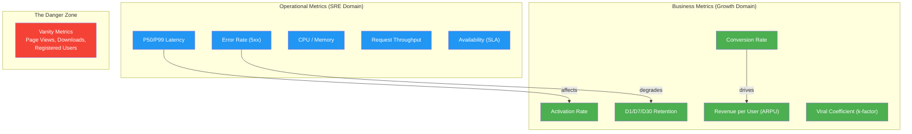

# Event-Driven Analytics 🟢

> **What you'll learn:**
> - Why page views and click counts are insufficient for growth engineering, and how to design an **event-driven tracking architecture** that captures user intent.
> - How to build a **strongly-typed event schema** using Rust's type system to eliminate an entire class of analytics bugs at compile time.
> - The critical distinction between **Operational Metrics** (latency, error rates, CPU) and **Business Metrics** (activation, retention, revenue) — and why confusing them is the #1 mistake growth teams make.
> - How to implement an **event naming convention** that scales across 50+ product teams without devolving into chaos.

---

## The Cost of Flying Blind

Every feature you ship without proper telemetry is a bet placed with house money — except the house is your user base, and you can't see the cards.

Consider two teams at the same company:

| Metric | Team A (No Telemetry) | Team B (Event-Driven) |
|--------|----------------------|----------------------|
| Features shipped/quarter | 12 | 10 |
| Features that improved target metric | Unknown | 7 (70%) |
| Features that *hurt* a metric | Unknown | 2 (rolled back in < 1 hour) |
| Revenue impact attributable to engineering | "We think it helped" | +$2.4M ARR (measured) |

Team B ships fewer features but can *prove* their impact. They also catch regressions before users churn. This is the difference between engineering and guessing.

---

## Beyond Page Views: The Event-Driven Model

Traditional analytics tools (Google Analytics, basic Segment setups) track **page views** and **clicks**. This is the web of 2005. Modern growth engineering requires tracking **user actions with business context**.

### The Page View Model vs. The Event Model

| Aspect | Page View Model | Event-Driven Model |
|--------|----------------|-------------------|
| What's tracked | URL changes | Meaningful user actions |
| Schema | Unstructured (URL + referrer) | Strongly typed (action + properties) |
| Business context | None | Rich (plan type, cohort, experiment arm) |
| Querying | "How many visited /pricing?" | "How many Trial users on iOS viewed the Pro paywall and started checkout?" |
| Funnel analysis | Approximate (URL matching) | Exact (event sequences with timestamps) |
| Cost of bad data | Misleading dashboards | Compile-time errors (in Rust) |

### The Anatomy of a Business Event

Every event in a well-designed system has four components:

```
┌─────────────────────────────────────────────────────┐
│                    Business Event                    │
├─────────────────────────────────────────────────────┤
│  WHO    │  user_id, anonymous_id, device_id         │
│  WHAT   │  event_name (Object_Action pattern)       │
│  WHERE  │  platform, screen, component              │
│  WHEN   │  client_timestamp, server_timestamp       │
│  WHY    │  experiment_arm, feature_flag_state        │
│  CONTEXT│  plan_type, cohort, session_id             │
└─────────────────────────────────────────────────────┘
```

The **WHY** layer is what separates growth engineering from basic analytics. Every event must carry the experiment and feature flag context that was active when it fired.

---

## Designing a Strongly-Typed Event Schema

Untyped analytics is the root cause of most data quality disasters. When events are just strings with arbitrary JSON blobs, you get:

- Misspelled event names (`checkout_started` vs `checkoutStarted` vs `Checkout_Start`)
- Missing required properties discovered weeks later
- Schema drift across teams that makes cross-team analysis impossible

### The Blind Way (Shipping and Praying)

```rust
// 💥 ANALYTICS HAZARD: Untyped events — no compile-time guarantees

fn track_event(name: &str, properties: serde_json::Value) {
    // Anyone can pass anything. No schema validation.
    // Misspelled event names? Runtime surprise.
    // Missing required fields? Silent data loss.
    analytics_client.track(name, properties);
}

// Usage — spot the bugs:
track_event("checkout_Started", json!({        // 💥 Inconsistent casing
    "plan": "pro",                              // 💥 Should be "plan_type"
    // 💥 Missing: currency, price_cents, experiment_arm
}));

track_event("checkout_started", json!({
    "plan_type": "pro",
    "price": 9.99,                              // 💥 Float currency = rounding errors
}));
```

### The Data-Driven Way

```rust
use chrono::{DateTime, Utc};
use serde::Serialize;
use uuid::Uuid;

// ✅ FIX: Strongly-typed event schema — errors caught at compile time

/// Every event carries identity and context.
#[derive(Debug, Serialize)]
pub struct EventEnvelope<T: Serialize> {
    pub event_id: Uuid,
    pub event_name: &'static str,
    pub user_id: Option<String>,
    pub anonymous_id: String,
    pub client_timestamp: DateTime<Utc>,
    pub platform: Platform,
    pub session_id: Uuid,
    pub active_experiments: Vec<ExperimentContext>,
    pub active_flags: Vec<FlagContext>,
    pub payload: T,
}

#[derive(Debug, Serialize)]
pub enum Platform {
    Web,
    #[serde(rename = "ios")]
    Ios,
    #[serde(rename = "android")]
    Android,
}

/// Experiment context attached to every event automatically.
#[derive(Debug, Serialize)]
pub struct ExperimentContext {
    pub experiment_id: String,
    pub variant: String,
}

/// Feature flag context attached to every event automatically.
#[derive(Debug, Serialize)]
pub struct FlagContext {
    pub flag_key: String,
    pub flag_value: serde_json::Value,
}

// ✅ Each event type is its own struct with required fields.

#[derive(Debug, Serialize)]
pub struct CheckoutStarted {
    pub plan_type: PlanType,
    pub price_cents: u64,           // ✅ Integer cents — no floating point
    pub currency: Currency,
    pub billing_interval: BillingInterval,
    pub paywall_variant: String,    // ✅ Ties to the experiment
}

#[derive(Debug, Serialize)]
pub enum PlanType { Free, Pro, Enterprise }

#[derive(Debug, Serialize)]
pub enum Currency { USD, EUR, GBP }

#[derive(Debug, Serialize)]
pub enum BillingInterval { Monthly, Annual }
```

Now the compiler enforces your tracking plan:

```rust
// This won't compile — missing required fields
let event = CheckoutStarted {
    plan_type: PlanType::Pro,
    price_cents: 999,
    // ❌ error[E0063]: missing fields `currency`, `billing_interval`, `paywall_variant`
};
```

**The tracking plan is the type system. The type system is the tracking plan.**

---

## Operational Metrics vs. Business Metrics

This is the distinction that separates SRE thinking from growth thinking. Both are critical. Confusing them is dangerous.



### The Metrics Hierarchy

| Layer | Metric Type | Example | Who Owns It | Alerting Threshold |
|-------|------------|---------|-------------|-------------------|
| L0 — Availability | Operational | Service uptime | SRE/Platform | < 99.9% = page |
| L1 — Performance | Operational | P99 latency | SRE/Platform | > 500ms = warning |
| L2 — Engagement | Business | DAU/MAU ratio | Product/Growth | < 0.25 = investigate |
| L3 — Activation | Business | % completing onboarding | Growth | < 60% = experiment |
| L4 — Monetization | Business | Trial → Paid conversion | Growth | < 3% = redesign |
| L5 — Retention | Business | 30-day retention | Growth/Product | < 40% = crisis |

**Critical insight:** Operational metrics are *necessary but not sufficient*. A service with 99.99% uptime and 10ms P99 latency can still have a 2% activation rate. The server is healthy; the product is dying.

### The Growth Funnel as Code

```rust
/// The canonical growth funnel — every stage must be instrumented.
#[derive(Debug, Serialize)]
pub enum FunnelStage {
    /// User lands on the product (from ad, referral, organic).
    Acquisition,
    /// User completes the core "aha moment" action.
    Activation,
    /// User returns after their first session (D1, D7, D30).
    Retention,
    /// User generates revenue (subscription, purchase, upgrade).
    Revenue,
    /// User refers others (share, invite, viral loop).
    Referral,
}

/// AARRR — the pirate metrics framework.
/// Each stage has a primary metric and a set of supporting events.
pub struct FunnelStageConfig {
    pub stage: FunnelStage,
    pub primary_metric: &'static str,
    pub supporting_events: &'static [&'static str],
}

pub const FUNNEL: &[FunnelStageConfig] = &[
    FunnelStageConfig {
        stage: FunnelStage::Acquisition,
        primary_metric: "unique_signups_per_day",
        supporting_events: &[
            "Landing_Page_Viewed",
            "Signup_Form_Started",
            "Signup_Completed",
        ],
    },
    FunnelStageConfig {
        stage: FunnelStage::Activation,
        primary_metric: "pct_completing_onboarding",
        supporting_events: &[
            "Onboarding_Started",
            "Onboarding_Step_Completed",
            "Core_Action_First_Time",
        ],
    },
    FunnelStageConfig {
        stage: FunnelStage::Revenue,
        primary_metric: "trial_to_paid_conversion_rate",
        supporting_events: &[
            "Paywall_Viewed",
            "Checkout_Started",
            "Subscription_Completed",
        ],
    },
];
```

---

## Event Naming Conventions That Scale

When 50 engineers across 10 teams are all emitting events, naming chaos is inevitable — unless you enforce a convention at the type level.

### The Object_Action Convention

Every event name follows the pattern: **`Object_Action`** in PascalCase.

| ✅ Correct | ❌ Wrong | Why it's wrong |
|-----------|---------|---------------|
| `Checkout_Started` | `startCheckout` | camelCase, verb first |
| `Paywall_Viewed` | `user_saw_paywall` | snake_case, passive subject |
| `Subscription_Completed` | `purchase` | Too vague, no object |
| `Onboarding_Step_Completed` | `onboarding_step_3` | Magic number, not an action |
| `Invite_Sent` | `viral_share_click` | Multiple concepts collapsed |

### Enforcing the Convention in Rust

```rust
/// Macro that enforces Object_Action naming at compile time.
macro_rules! define_event {
    ($name:ident, $event_name:expr, { $($field:ident : $type:ty),* $(,)? }) => {
        #[derive(Debug, serde::Serialize)]
        pub struct $name {
            $(pub $field: $type),*
        }

        impl $name {
            pub const EVENT_NAME: &'static str = $event_name;
        }

        // Compile-time check: event name must contain exactly one underscore
        // separating Object from Action, both PascalCase segments.
        const _: () = {
            let bytes = $event_name.as_bytes();
            let mut underscore_count = 0u32;
            let mut i = 0;
            while i < bytes.len() {
                if bytes[i] == b'_' { underscore_count += 1; }
                i += 1;
            }
            assert!(
                underscore_count >= 1,
                "Event name must follow Object_Action pattern"
            );
        };
    };
}

// ✅ These compile:
define_event!(PaywallViewed, "Paywall_Viewed", {
    paywall_variant: String,
    plan_shown: PlanType,
});

define_event!(CheckoutStarted, "Checkout_Started", {
    plan_type: PlanType,
    price_cents: u64,
    currency: Currency,
    billing_interval: BillingInterval,
    paywall_variant: String,
});

define_event!(SubscriptionCompleted, "Subscription_Completed", {
    plan_type: PlanType,
    price_cents: u64,
    currency: Currency,
    billing_interval: BillingInterval,
    payment_method: PaymentMethod,
    trial_days_used: u32,
});

// ❌ This fails at compile time:
// define_event!(BadEvent, "startCheckout", { });
// Error: Event name must follow Object_Action pattern
```

---

## The Event Tracker: Putting It All Together

```rust
use std::sync::Arc;
use tokio::sync::mpsc;

/// The core event tracking interface.
/// All events flow through this single entry point.
pub struct EventTracker {
    sender: mpsc::UnboundedSender<Vec<u8>>,
    context_provider: Arc<dyn ContextProvider + Send + Sync>,
}

/// Provides ambient context (user, experiments, flags) for every event.
pub trait ContextProvider: Send + Sync {
    fn user_id(&self) -> Option<String>;
    fn anonymous_id(&self) -> String;
    fn session_id(&self) -> uuid::Uuid;
    fn platform(&self) -> Platform;
    fn active_experiments(&self) -> Vec<ExperimentContext>;
    fn active_flags(&self) -> Vec<FlagContext>;
}

impl EventTracker {
    /// Track a strongly-typed event. Context is automatically attached.
    pub fn track<E: Serialize>(&self, event_name: &'static str, payload: E) {
        let ctx = &self.context_provider;
        let envelope = EventEnvelope {
            event_id: uuid::Uuid::new_v4(),
            event_name,
            user_id: ctx.user_id(),
            anonymous_id: ctx.anonymous_id(),
            client_timestamp: chrono::Utc::now(),
            platform: ctx.platform(),
            session_id: ctx.session_id(),
            active_experiments: ctx.active_experiments(),
            active_flags: ctx.active_flags(),
            payload,
        };

        // Serialize and send to the internal buffer.
        // The buffer is drained by the pipeline (Chapter 2).
        if let Ok(bytes) = serde_json::to_vec(&envelope) {
            let _ = self.sender.send(bytes);
        }
    }
}
```

---

<details>
<summary><strong>🏋️ Exercise: Design a Tracking Plan for a SaaS Onboarding Flow</strong> (click to expand)</summary>

### The Challenge

You're the growth engineer for a B2B SaaS product. The onboarding flow has 5 steps:

1. **Sign Up** — Email + password
2. **Verify Email** — Click the link
3. **Create Workspace** — Name their workspace
4. **Invite Team** — Invite at least one colleague (optional but critical for retention)
5. **Core Action** — Create their first project

Your activation metric is: **% of signups that complete Step 5 within 48 hours**.

**Design the complete event schema** — define all event types, their properties, and the funnel tracking structure. You must be able to answer:

- What is the drop-off rate at each step?
- Does inviting a team member (Step 4) correlate with completing Step 5?
- Which signup source (organic, paid, referral) has the best activation rate?

<details>
<summary>🔑 Solution</summary>

```rust
use chrono::{DateTime, Utc};
use serde::Serialize;
use uuid::Uuid;

// ✅ Enum for signup sources — no free-form strings
#[derive(Debug, Serialize, Clone)]
pub enum SignupSource {
    Organic,
    PaidGoogle,
    PaidFacebook,
    Referral { referrer_user_id: String },
    ProductHunt,
}

// ✅ Each onboarding step is a distinct, typed event

define_event!(Signup_Completed, "Signup_Completed", {
    signup_source: SignupSource,
    has_sso: bool,
});

define_event!(Email_Verified, "Email_Verified", {
    seconds_since_signup: u64,    // ✅ Time-to-verify is a key health metric
    verification_method: VerificationMethod,
});

#[derive(Debug, Serialize)]
pub enum VerificationMethod { EmailLink, MagicCode }

define_event!(Workspace_Created, "Workspace_Created", {
    workspace_name_length: u32,   // ✅ Don't store PII, store metadata
    template_used: Option<String>,
});

define_event!(TeamMember_Invited, "TeamMember_Invited", {
    invite_count: u32,            // ✅ How many invited at once
    invite_method: InviteMethod,
});

#[derive(Debug, Serialize)]
pub enum InviteMethod { Email, Link, Slack }

define_event!(CoreAction_Completed, "CoreAction_Completed", {
    seconds_since_signup: u64,    // ✅ Time-to-activate
    project_template_used: bool,
    team_size_at_activation: u32, // ✅ Correlation analysis with Step 4
});

// ✅ Funnel definition for automated analysis
pub const ONBOARDING_FUNNEL: &[&str] = &[
    "Signup_Completed",
    "Email_Verified",
    "Workspace_Created",
    "TeamMember_Invited",      // Optional — tracked but not required for activation
    "CoreAction_Completed",    // This is the activation event
];

// ✅ Key analysis queries this schema enables:
//
// 1. DROP-OFF RATE:
//    SELECT step, COUNT(DISTINCT user_id) as users
//    FROM events WHERE event_name IN (ONBOARDING_FUNNEL)
//    GROUP BY step ORDER BY step;
//
// 2. TEAM INVITE ↔ ACTIVATION CORRELATION:
//    SELECT
//      invited_team = (team_size_at_activation > 1),
//      COUNT(*) as activated_users,
//      AVG(seconds_since_signup) as avg_time_to_activate
//    FROM events WHERE event_name = 'CoreAction_Completed'
//    GROUP BY invited_team;
//
// 3. ACTIVATION BY SOURCE:
//    WITH signups AS (
//      SELECT user_id, signup_source FROM events
//      WHERE event_name = 'Signup_Completed'
//    ),
//    activated AS (
//      SELECT user_id FROM events
//      WHERE event_name = 'CoreAction_Completed'
//        AND seconds_since_signup <= 172800  -- 48 hours
//    )
//    SELECT signup_source,
//           COUNT(DISTINCT s.user_id) as signups,
//           COUNT(DISTINCT a.user_id) as activated,
//           COUNT(DISTINCT a.user_id)::float / COUNT(DISTINCT s.user_id) as rate
//    FROM signups s LEFT JOIN activated a ON s.user_id = a.user_id
//    GROUP BY signup_source ORDER BY rate DESC;
```

**Key design decisions:**

- **No PII in events** — we track `workspace_name_length`, not the name itself. This is GDPR-safe by default.
- **`seconds_since_signup`** on the activation event lets us compute time-to-activate without joining tables.
- **`team_size_at_activation`** is denormalized onto the activation event so we can correlate team invites with activation in a single query.
- **`SignupSource`** is an enum, not a string — no `"google"` vs `"Google"` vs `"adwords"` drift.

</details>
</details>

---

> **Key Takeaways**
>
> 1. **Page views are insufficient.** Modern growth engineering requires tracking *business actions* with rich context — who did what, when, why, and under which experiment conditions.
> 2. **Type your events.** Rust's type system can enforce your tracking plan at compile time. A misspelled event name should be a compiler error, not a data quality incident discovered three weeks later.
> 3. **Separate Operational from Business metrics.** Your service can have 99.99% uptime and still have a 2% activation rate. Monitor both layers independently.
> 4. **Use Object_Action naming** with PascalCase and enforce it with macros. This scales across teams and makes warehouse querying predictable.
> 5. **Every event carries experiment context.** If you can't tell which A/B test variant produced an event, the event is useless for experimentation.

---

> **See also:**
> - [Chapter 2: The Data Pipeline](ch02-the-data-pipeline.md) — Where these events go after they're emitted.
> - [Chapter 5: A/B Testing Infrastructure](ch05-ab-testing-infrastructure.md) — Why the `active_experiments` field is mission-critical.
> - [Appendix A: Reference Card](appendix-a-reference-card.md) — Quick-reference for event naming conventions.
