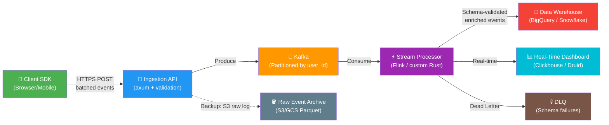
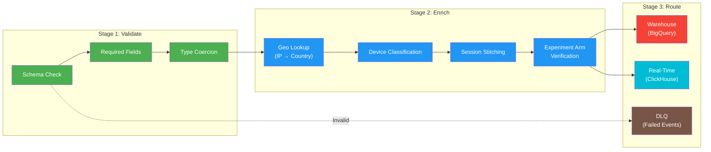

# The Data Pipeline 🟡

> **What you'll learn:**
> - How events travel from the client (browser/mobile) through your ingestion layer, message queue, stream processor, and into the **Data Warehouse** — and where data gets lost at every stage.
> - Strategies for surviving **ad-blockers and tracking prevention** (ITP, ETP) without resorting to fingerprinting or other dark patterns.
> - The difference between **at-most-once**, **at-least-once**, and **exactly-once** processing semantics — and why exactly-once is harder than it sounds.
> - How to build a **data quality validation layer** that catches schema violations before corrupt data reaches your analysts.

---

## The End-to-End Event Journey

Most engineers think of analytics as "fire an HTTP request to some endpoint." That endpoint is the tip of an iceberg. Here's what actually happens when a user taps "Start Checkout":



**Every arrow is a place where data can be lost.** The job of a growth engineer is to ensure end-to-end delivery with audit trails at each hop.

---

## Layer 1: The Client SDK

The client SDK is the most hostile environment in your pipeline. It runs on user devices where:

- The network is unreliable (subway, airplane mode, poor cellular)
- Ad-blockers intercept requests to known analytics domains
- Browser tracking prevention (Safari ITP, Firefox ETP) restricts cookies and storage
- The app can be killed at any moment (low memory, user force-quit)

### The Blind Way (Fire and Forget)

```rust
// 💥 ANALYTICS HAZARD: Fire-and-forget tracking loses events silently

async fn track_event_naive(event: &[u8]) {
    // 💥 No retry on failure
    // 💥 No local buffering
    // 💥 No batching (one HTTP request per event = performance disaster)
    // 💥 If the user closes the app, in-flight events are lost
    let _ = reqwest::Client::new()
        .post("https://analytics.example.com/v1/track")
        .body(event.to_vec())
        .send()
        .await;
    // 💥 Result is silently discarded. You'll never know this failed.
}
```

### The Data-Driven Way

```rust
use std::collections::VecDeque;
use std::time::{Duration, Instant};
use tokio::sync::Mutex;
use tokio::time::interval;

// ✅ FIX: Local persistent queuing and batch flushing

/// Client-side event buffer with persistence and batched flushing.
pub struct EventBuffer {
    /// In-memory queue for fast writes.
    queue: Mutex<VecDeque<Vec<u8>>>,
    /// Persistent storage for crash resilience.
    persistent_store: Box<dyn PersistentStore + Send + Sync>,
    /// Configuration for batching behavior.
    config: BufferConfig,
}

pub struct BufferConfig {
    /// Maximum events to accumulate before flushing.
    pub max_batch_size: usize,
    /// Maximum time to wait before flushing, even if batch isn't full.
    pub max_flush_interval: Duration,
    /// Maximum retries before sending to dead letter queue.
    pub max_retries: u32,
    /// Base URL for the ingestion API.
    pub ingestion_url: String,
}

/// Abstraction over platform-specific persistence.
/// On web: IndexedDB. On mobile: SQLite. On server: filesystem.
pub trait PersistentStore: Send + Sync {
    fn enqueue(&self, event: &[u8]) -> Result<(), Box<dyn std::error::Error>>;
    fn peek_batch(&self, max: usize) -> Vec<Vec<u8>>;
    fn acknowledge(&self, count: usize);
}

impl EventBuffer {
    pub fn new(
        persistent_store: Box<dyn PersistentStore + Send + Sync>,
        config: BufferConfig,
    ) -> Self {
        Self {
            queue: Mutex::new(VecDeque::new()),
            persistent_store,
            config,
        }
    }

    /// Enqueue an event. This NEVER blocks and NEVER fails from the
    /// caller's perspective. Events are buffered locally.
    pub async fn enqueue(&self, event: Vec<u8>) {
        // ✅ Write to persistent store first (crash-safe)
        let _ = self.persistent_store.enqueue(&event);
        self.queue.lock().await.push_back(event);
    }

    /// Background flush loop. Call this once at startup.
    pub async fn run_flush_loop(&self, client: reqwest::Client) {
        let mut ticker = interval(self.config.max_flush_interval);
        loop {
            ticker.tick().await;
            self.flush(&client).await;
        }
    }

    async fn flush(&self, client: &reqwest::Client) {
        let batch = self.persistent_store.peek_batch(self.config.max_batch_size);
        if batch.is_empty() {
            return;
        }

        // ✅ Send as a single batched request (reduces HTTP overhead)
        let payload = serde_json::json!({
            "batch": batch.iter()
                .filter_map(|b| serde_json::from_slice::<serde_json::Value>(b).ok())
                .collect::<Vec<_>>(),
            "sent_at": chrono::Utc::now().to_rfc3339(),
        });

        match client
            .post(&self.config.ingestion_url)
            .json(&payload)
            .timeout(Duration::from_secs(10))
            .send()
            .await
        {
            Ok(resp) if resp.status().is_success() => {
                // ✅ Only acknowledge after confirmed delivery
                self.persistent_store.acknowledge(batch.len());
                let mut q = self.queue.lock().await;
                for _ in 0..batch.len().min(q.len()) {
                    q.pop_front();
                }
            }
            Ok(resp) if resp.status().is_server_error() => {
                // ✅ Server error: retry on next tick (events stay in queue)
                tracing::warn!("Ingestion server error: {}", resp.status());
            }
            Ok(resp) => {
                // ✅ Client error (400): events are malformed, send to DLQ
                tracing::error!("Ingestion client error: {}", resp.status());
                self.persistent_store.acknowledge(batch.len());
            }
            Err(e) => {
                // ✅ Network error: retry on next tick (events stay in queue)
                tracing::warn!("Ingestion network error: {}", e);
            }
        }
    }
}
```

### Client-Side vs. Server-Side Tracking

| Aspect | Client-Side | Server-Side | Hybrid (Recommended) |
|--------|------------|-------------|---------------------|
| Captures UI interactions | ✅ Yes | ❌ No | ✅ Yes |
| Survives ad-blockers | ❌ No | ✅ Yes | ✅ Partially |
| Captures backend events | ❌ No | ✅ Yes | ✅ Yes |
| Data accuracy | Lower (hostile env) | Higher (controlled) | Highest |
| Implementation cost | Low | Medium | Higher |
| Example events | `Button_Clicked`, `Page_Viewed` | `Subscription_Completed`, `Invoice_Paid` | All events |

**The rule:** Track *intent* on the client, track *outcomes* on the server. `Checkout_Started` fires client-side (user clicked). `Subscription_Completed` fires server-side (Stripe webhook confirmed payment).

---

## Layer 2: The Ingestion API

The ingestion API is your first line of defense against bad data. It must:

1. Validate the event schema before accepting it
2. Produce to Kafka with proper partitioning
3. Return a response fast (< 50ms P99 — never block the client)
4. Write a raw backup to object storage (your "insurance policy")

```rust
use axum::{extract::Json, http::StatusCode, response::IntoResponse};
use rdkafka::producer::{FutureProducer, FutureRecord};
use serde::Deserialize;
use std::time::Duration;

#[derive(Deserialize)]
pub struct EventBatch {
    pub batch: Vec<serde_json::Value>,
    pub sent_at: String,
}

/// Ingestion endpoint — validates and produces to Kafka.
pub async fn ingest_events(
    Json(batch): Json<EventBatch>,
    producer: axum::extract::Extension<FutureProducer>,
) -> impl IntoResponse {
    let mut accepted = 0u32;
    let mut rejected = 0u32;

    for event in &batch.batch {
        // ✅ Schema validation at the gate
        match validate_event_schema(event) {
            Ok(validated) => {
                // ✅ Partition by user_id for ordered processing per user
                let partition_key = validated
                    .get("user_id")
                    .or_else(|| validated.get("anonymous_id"))
                    .and_then(|v| v.as_str())
                    .unwrap_or("unknown");

                let payload = serde_json::to_string(&validated)
                    .unwrap_or_default();

                let record = FutureRecord::to("events-raw")
                    .key(partition_key)
                    .payload(&payload);

                // ✅ Async produce — don't block on broker acknowledgment
                //    for the HTTP response (fire-and-check-later)
                let _ = producer.send(record, Duration::from_millis(100)).await;
                accepted += 1;
            }
            Err(reason) => {
                tracing::warn!("Rejected event: {}", reason);
                rejected += 1;
            }
        }
    }

    // ✅ Return acceptance count so the client knows what was persisted.
    (
        StatusCode::OK,
        Json(serde_json::json!({
            "accepted": accepted,
            "rejected": rejected,
        })),
    )
}

fn validate_event_schema(event: &serde_json::Value) -> Result<&serde_json::Value, String> {
    // ✅ Required fields check
    let required = ["event_id", "event_name", "anonymous_id", "client_timestamp"];
    for field in required {
        if event.get(field).is_none() {
            return Err(format!("Missing required field: {}", field));
        }
    }

    // ✅ Event name format check (Object_Action)
    if let Some(name) = event.get("event_name").and_then(|v| v.as_str()) {
        if !name.contains('_') || name.len() > 100 {
            return Err(format!("Invalid event name format: {}", name));
        }
    }

    Ok(event)
}
```

---

## Layer 3: Kafka — The Durable Backbone

Kafka is the central nervous system of your event pipeline. It provides:

- **Durability** — Events are persisted to disk with configurable replication.
- **Ordering** — Events from the same user arrive in order (same partition key).
- **Decoupling** — Producers and consumers evolve independently.
- **Replay** — You can re-process historical events (e.g., backfill a new column).

### Kafka Topic Design for Growth Engineering

| Topic | Partition Key | Retention | Purpose |
|-------|--------------|-----------|---------|
| `events-raw` | `user_id` | 30 days | Raw events from ingestion, pre-validation |
| `events-validated` | `user_id` | 30 days | Schema-validated, enriched events |
| `events-dlq` | `event_id` | 90 days | Failed validation — for debugging |
| `experiment-assignments` | `user_id` | 90 days | A/B test assignment log (audit trail) |
| `flag-evaluations` | `user_id` | 7 days | Feature flag evaluation log |

### Partitioning Strategy

```
User ID: "user_abc123"
    ↓
Hash: murmur3("user_abc123") = 0x7A3F...
    ↓
Partition: 0x7A3F... % 64 = partition 27
    ↓
All events from user_abc123 land in partition 27
    ↓
Single consumer processes partition 27
    ↓
Events for this user are processed IN ORDER
```

**Why this matters:** If a user's `Checkout_Started` event is processed before their `Paywall_Viewed` event (out of order), your funnel analysis will show impossible transitions.

---

## Layer 4: Stream Processing — Validation, Enrichment, Routing

The stream processor sits between raw Kafka events and the data warehouse. It performs three critical functions:

### The Three-Stage Processing Pipeline



```rust
use serde::{Deserialize, Serialize};

/// A validated, enriched event ready for the warehouse.
#[derive(Debug, Serialize, Deserialize)]
pub struct EnrichedEvent {
    // Original fields
    pub event_id: String,
    pub event_name: String,
    pub user_id: Option<String>,
    pub anonymous_id: String,
    pub client_timestamp: String,

    // ✅ Enriched fields (added by stream processor)
    pub server_timestamp: String,
    pub country_code: Option<String>,
    pub region: Option<String>,
    pub device_type: DeviceType,
    pub session_sequence_number: u64,

    // ✅ Experiment verification
    pub verified_experiments: Vec<VerifiedExperiment>,

    // Original payload (preserved)
    pub payload: serde_json::Value,
}

#[derive(Debug, Serialize, Deserialize)]
pub enum DeviceType { Desktop, Mobile, Tablet, Unknown }

#[derive(Debug, Serialize, Deserialize)]
pub struct VerifiedExperiment {
    pub experiment_id: String,
    pub variant: String,
    /// Was the experiment actually running when this event was emitted?
    pub was_active: bool,
    /// Does the client-reported variant match the server-side assignment?
    pub variant_matches_assignment: bool,
}

/// Core enrichment logic for a single event.
pub fn enrich_event(
    raw: &serde_json::Value,
    geo_db: &dyn GeoLookup,
    experiment_store: &dyn ExperimentStore,
) -> Result<EnrichedEvent, EnrichmentError> {
    let event_name = raw.get("event_name")
        .and_then(|v| v.as_str())
        .ok_or(EnrichmentError::MissingField("event_name"))?;

    // Stage 1: Validate
    validate_required_fields(raw)?;

    // Stage 2: Enrich
    let ip = raw.get("ip_address").and_then(|v| v.as_str());
    let geo = ip.and_then(|ip| geo_db.lookup(ip));

    let client_experiments = raw.get("active_experiments")
        .and_then(|v| serde_json::from_value::<Vec<ExperimentContext>>(v.clone()).ok())
        .unwrap_or_default();

    // ✅ CRITICAL: Verify that client-reported experiment arms match
    //    server-side assignment records. This catches:
    //    - Client SDK bugs that report wrong variants
    //    - Users manipulating their experiment assignment client-side
    let verified = client_experiments.iter().map(|exp| {
        let server_record = experiment_store.get_assignment(
            raw.get("user_id").and_then(|v| v.as_str()).unwrap_or(""),
            &exp.experiment_id,
        );
        VerifiedExperiment {
            experiment_id: exp.experiment_id.clone(),
            variant: exp.variant.clone(),
            was_active: server_record.as_ref().map_or(false, |r| r.is_active),
            variant_matches_assignment: server_record
                .as_ref()
                .map_or(false, |r| r.variant == exp.variant),
        }
    }).collect();

    Ok(EnrichedEvent {
        event_id: raw.get("event_id").and_then(|v| v.as_str()).unwrap_or("").to_string(),
        event_name: event_name.to_string(),
        user_id: raw.get("user_id").and_then(|v| v.as_str()).map(String::from),
        anonymous_id: raw.get("anonymous_id").and_then(|v| v.as_str()).unwrap_or("").to_string(),
        client_timestamp: raw.get("client_timestamp").and_then(|v| v.as_str()).unwrap_or("").to_string(),
        server_timestamp: chrono::Utc::now().to_rfc3339(),
        country_code: geo.as_ref().map(|g| g.country_code.clone()),
        region: geo.as_ref().map(|g| g.region.clone()),
        device_type: classify_device(raw),
        session_sequence_number: 0, // Computed by session stitching
        verified_experiments: verified,
        payload: raw.get("payload").cloned().unwrap_or(serde_json::Value::Null),
    })
}

pub trait GeoLookup: Send + Sync {
    fn lookup(&self, ip: &str) -> Option<GeoResult>;
}

pub struct GeoResult {
    pub country_code: String,
    pub region: String,
}

pub trait ExperimentStore: Send + Sync {
    fn get_assignment(&self, user_id: &str, experiment_id: &str) -> Option<AssignmentRecord>;
}

pub struct AssignmentRecord {
    pub variant: String,
    pub is_active: bool,
}

fn validate_required_fields(event: &serde_json::Value) -> Result<(), EnrichmentError> {
    for field in &["event_id", "event_name", "anonymous_id", "client_timestamp"] {
        if event.get(*field).is_none() {
            return Err(EnrichmentError::MissingField(field));
        }
    }
    Ok(())
}

fn classify_device(event: &serde_json::Value) -> DeviceType {
    match event.get("platform").and_then(|v| v.as_str()) {
        Some("ios" | "android") => DeviceType::Mobile,
        Some("web") => DeviceType::Desktop, // Simplified; real impl checks user-agent
        _ => DeviceType::Unknown,
    }
}

#[derive(Debug)]
pub enum EnrichmentError {
    MissingField(&'static str),
    InvalidSchema(String),
}
```

---

## Surviving Ad-Blockers and Tracking Prevention

This is the elephant in the room. Between ad-blockers (uBlock Origin, Brave) and browser tracking prevention (Safari ITP, Firefox ETP), **up to 30-40% of client-side events can be silently dropped** if you use a third-party analytics domain.

### Strategies That Work (Without Being Evil)

| Strategy | Effectiveness | Ethical? | Implementation Cost |
|----------|-------------|----------|-------------------|
| **First-party subdomain** (`events.yourapp.com`) | High (bypasses most blockers) | ✅ Yes | Low — DNS CNAME record |
| **Server-side tracking** for critical events | Very High | ✅ Yes | Medium |
| **Beacon API** (`navigator.sendBeacon`) | Medium (works on page unload) | ✅ Yes | Low |
| **Proxy through your own API** | High | ✅ Yes | Medium |
| Fingerprinting | High | ❌ No — privacy violation | N/A |
| CNAME cloaking of third-party trackers | Medium | ⚠️ Gray area | N/A |

### The First-Party Proxy Pattern

```
Before (blocked by ad-blockers):
  Browser → analytics.segment.com ← BLOCKED

After (first-party proxy):
  Browser → events.yourapp.com → Your Ingestion API → Kafka
                ↑
     This is YOUR domain. Ad-blockers don't block it.
     You control the data. No third-party cookies needed.
```

**This is not circumventing user consent.** You're tracking events for *your own product* on *your own domain*. The user has a relationship with you, not with a third-party data broker.

---

## Delivery Guarantees: The Exactly-Once Myth

| Guarantee | What It Means | Risk | Use Case |
|-----------|-------------|------|----------|
| **At-most-once** | Fire and forget. Events may be lost. | Data loss | Debugging logs |
| **At-least-once** | Retry until acknowledged. May duplicate. | Duplicates | Most analytics |
| **Exactly-once** | Each event processed exactly once. | Complex, expensive | Financial transactions |

### Why Exactly-Once Is Hard

True exactly-once requires coordination between *every* component:

1. The client must detect and suppress duplicate sends (needs a persistent event ID).
2. The ingestion API must be idempotent (reject duplicate event IDs).
3. Kafka must use idempotent producers + transactions.
4. The stream processor must use checkpointing with exactly-once semantics.
5. The warehouse load must be idempotent (upsert on event_id).

**In practice, most growth engineering pipelines use at-least-once with deduplication.** This is simpler and gives you 99.99%+ accuracy, which is sufficient for A/B test analysis.

### Deduplication in Practice

```rust
use std::collections::HashSet;

/// Simple deduplication using a rolling window of seen event IDs.
/// In production, use Redis or a Bloom filter for distributed dedup.
pub struct EventDeduplicator {
    seen: HashSet<String>,
    max_size: usize,
}

impl EventDeduplicator {
    pub fn new(max_size: usize) -> Self {
        Self {
            seen: HashSet::new(),
            max_size,
        }
    }

    /// Returns true if this event is new (not a duplicate).
    pub fn check_and_insert(&mut self, event_id: &str) -> bool {
        if self.seen.contains(event_id) {
            return false; // ✅ Duplicate detected — skip
        }

        // ✅ Evict oldest entries if at capacity
        //    (In production, use a time-windowed Bloom filter)
        if self.seen.len() >= self.max_size {
            // Simple eviction — in production, use LRU or time-based expiry
            self.seen.clear();
        }

        self.seen.insert(event_id.to_string());
        true
    }
}
```

---

## Data Quality Monitoring

Your pipeline is only as trustworthy as your monitoring of it. You need three layers of data quality checks:

### Layer 1: Real-Time Alerting

| Check | Alert If | Severity |
|-------|----------|----------|
| Event volume | Drops > 20% vs. same hour last week | P1 — Pipeline may be down |
| Schema violations | > 1% of events fail validation | P2 — SDK bug |
| Duplicate rate | > 5% of events are duplicates | P2 — Client retry storm |
| Latency (client → warehouse) | P99 > 5 minutes | P3 — Processing backlog |
| Null rate on required fields | Any required field > 0.1% null | P2 — SDK regression |

### Layer 2: Daily Data Quality Report

```sql
-- Daily data quality scorecard
SELECT
    DATE(server_timestamp) as date,
    COUNT(*) as total_events,
    COUNT(DISTINCT user_id) as unique_users,
    
    -- Schema health
    SUM(CASE WHEN event_name IS NULL THEN 1 ELSE 0 END) as null_event_names,
    SUM(CASE WHEN user_id IS NULL AND anonymous_id IS NULL THEN 1 ELSE 0 END) as orphan_events,
    
    -- Experiment integrity
    SUM(CASE WHEN verified_experiments_variant_matches = false THEN 1 ELSE 0 END) 
        as mismatched_experiment_arms,
    
    -- Timeliness
    AVG(TIMESTAMP_DIFF(server_timestamp, client_timestamp, SECOND)) as avg_latency_seconds,
    APPROX_QUANTILES(TIMESTAMP_DIFF(server_timestamp, client_timestamp, SECOND), 100)[OFFSET(99)] 
        as p99_latency_seconds
        
FROM `analytics.events_validated`
WHERE DATE(server_timestamp) = CURRENT_DATE() - 1
GROUP BY date;
```

---

<details>
<summary><strong>🏋️ Exercise: Build a Dead Letter Queue Recovery System</strong> (click to expand)</summary>

### The Challenge

Your pipeline's dead letter queue (`events-dlq` Kafka topic) has been accumulating failed events. Analysis shows that 80% of failures are due to a bug in the iOS SDK v3.2.1 that sends `client_timestamp` as a Unix epoch integer instead of an ISO 8601 string.

Design and implement a DLQ recovery consumer that:

1. Reads events from the DLQ topic.
2. Identifies the root cause pattern (integer timestamp).
3. Fixes the events (converts epoch to ISO 8601).
4. Re-validates and re-publishes to the `events-validated` topic.
5. Logs a recovery report (how many fixed, how many still broken).

<details>
<summary>🔑 Solution</summary>

```rust
use chrono::{DateTime, TimeZone, Utc};

/// DLQ Recovery Consumer
/// Reads from the dead letter queue, applies known fixes,
/// and re-publishes recovered events.
pub struct DlqRecoveryConsumer {
    /// Known fix strategies, applied in order.
    fixers: Vec<Box<dyn EventFixer>>,
}

pub trait EventFixer: Send + Sync {
    /// Name of this fixer for logging.
    fn name(&self) -> &str;
    /// Returns true if this fixer can handle the given event.
    fn can_fix(&self, event: &serde_json::Value) -> bool;
    /// Attempts to fix the event in place. Returns Ok(()) if fixed.
    fn fix(&self, event: &mut serde_json::Value) -> Result<(), String>;
}

/// Fixes the iOS SDK v3.2.1 timestamp bug.
/// Converts integer epoch timestamps to ISO 8601 strings.
pub struct EpochTimestampFixer;

impl EventFixer for EpochTimestampFixer {
    fn name(&self) -> &str {
        "EpochTimestampFixer (iOS SDK v3.2.1)"
    }

    fn can_fix(&self, event: &serde_json::Value) -> bool {
        // ✅ Detect the pattern: client_timestamp is a number, not a string
        event.get("client_timestamp")
            .map_or(false, |v| v.is_number())
    }

    fn fix(&self, event: &mut serde_json::Value) -> Result<(), String> {
        let epoch = event.get("client_timestamp")
            .and_then(|v| v.as_i64())
            .ok_or("client_timestamp is not an integer")?;

        // ✅ Determine if epoch is seconds or milliseconds
        let dt: DateTime<Utc> = if epoch > 1_000_000_000_000 {
            // Milliseconds (13+ digits)
            Utc.timestamp_millis_opt(epoch)
                .single()
                .ok_or("Invalid millisecond epoch")?
        } else {
            // Seconds (10 digits)
            Utc.timestamp_opt(epoch, 0)
                .single()
                .ok_or("Invalid second epoch")?
        };

        // ✅ Replace with ISO 8601 string
        event["client_timestamp"] = serde_json::Value::String(dt.to_rfc3339());
        Ok(())
    }
}

/// Recovery report for a DLQ processing run.
#[derive(Debug, Default)]
pub struct RecoveryReport {
    pub total_processed: u64,
    pub recovered: u64,
    pub still_broken: u64,
    pub fixes_applied: std::collections::HashMap<String, u64>,
}

impl DlqRecoveryConsumer {
    pub fn new() -> Self {
        Self {
            fixers: vec![
                Box::new(EpochTimestampFixer),
                // Add more fixers as new DLQ patterns are identified
            ],
        }
    }

    /// Process a single DLQ event. Returns the fixed event or an error.
    pub fn process_event(
        &self,
        event: &mut serde_json::Value,
        report: &mut RecoveryReport,
    ) -> Result<(), String> {
        report.total_processed += 1;

        // ✅ Try each fixer in order
        let mut fixed = false;
        for fixer in &self.fixers {
            if fixer.can_fix(event) {
                match fixer.fix(event) {
                    Ok(()) => {
                        *report.fixes_applied
                            .entry(fixer.name().to_string())
                            .or_insert(0) += 1;
                        fixed = true;
                        tracing::info!(
                            fixer = fixer.name(),
                            event_id = event.get("event_id")
                                .and_then(|v| v.as_str())
                                .unwrap_or("unknown"),
                            "Event recovered"
                        );
                    }
                    Err(e) => {
                        tracing::warn!(
                            fixer = fixer.name(),
                            error = %e,
                            "Fixer matched but failed"
                        );
                    }
                }
            }
        }

        // ✅ Re-validate the fixed event
        if fixed {
            match validate_event_schema(event) {
                Ok(_) => {
                    report.recovered += 1;
                    Ok(())
                }
                Err(e) => {
                    report.still_broken += 1;
                    Err(format!("Event fixed but still invalid: {}", e))
                }
            }
        } else {
            report.still_broken += 1;
            Err("No fixer could handle this event".into())
        }
    }
}

// ✅ Example recovery run output:
//
// RecoveryReport {
//     total_processed: 142_857,
//     recovered: 138_400,         ← 96.9% recovery rate
//     still_broken: 4_457,        ← Need new fixers for these patterns
//     fixes_applied: {
//         "EpochTimestampFixer (iOS SDK v3.2.1)": 138_400,
//     },
// }
```

**Key design decisions:**

- **Pluggable fixers** — new DLQ patterns are discovered all the time. Each fix is a self-contained unit.
- **Re-validation after fix** — a fixer might successfully transform one field but the event could still be invalid for other reasons.
- **Detailed reporting** — you need to know *which* fixers are doing the heavy lifting to prioritize SDK fixes upstream.
- **Idempotent** — running the recovery consumer twice on the same events produces the same result (deduplication handles re-published events).

</details>
</details>

---

> **Key Takeaways**
>
> 1. **The pipeline has five layers** — Client SDK, Ingestion API, Kafka, Stream Processor, Data Warehouse. Data can be lost at *every single transition*. Design for failure at each hop.
> 2. **Never fire-and-forget.** Client SDKs must buffer events locally (IndexedDB, SQLite) and flush in batches with retry logic. A dropped event is a data point you can never recover.
> 3. **Use first-party domains** for event ingestion. This isn't about circumventing consent—it's about ensuring your *own* analytics data reaches *your own* servers.
> 4. **Exactly-once is a spectrum, not a boolean.** At-least-once with deduplication is the practical sweet spot for growth analytics. Save exactly-once semantics for financial transactions.
> 5. **Monitor the pipeline, not just the product.** If your event volume drops 20% and nobody notices for a week, every experiment running during that period is compromised.

---

> **See also:**
> - [Chapter 1: Event-Driven Analytics](ch01-event-driven-analytics.md) — The schema design that feeds this pipeline.
> - [Chapter 5: A/B Testing Infrastructure](ch05-ab-testing-infrastructure.md) — How experiment assignment data flows through this pipeline.
> - [Appendix A: Reference Card](appendix-a-reference-card.md) — Kafka topic naming conventions and delivery guarantee comparison.
