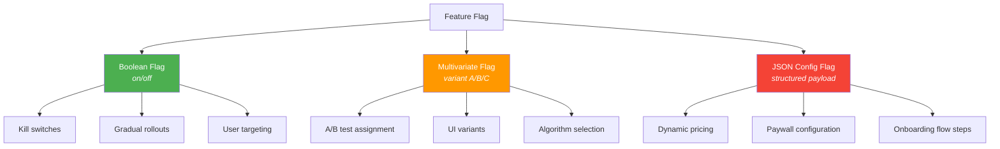
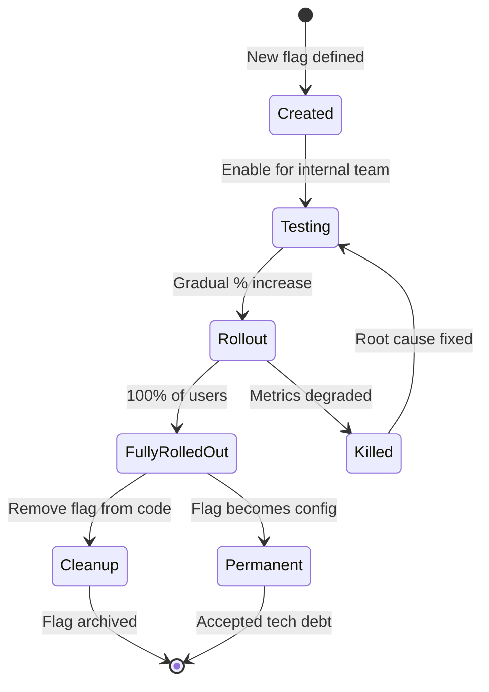

# Feature Flags Architecture 🟡

> **What you'll learn:**
> - Why **decoupling deployment from release** is the single most important operational pattern for growth teams — and how feature flags make it possible.
> - How to design a **low-latency feature flag evaluation engine** that resolves flags in < 1ms without network calls on the hot path.
> - The taxonomy of feature flags — **Boolean, Multivariate, and JSON Config** — and when to use each kind.
> - How to use **evaluation context** (User ID, Location, Device, Plan) to target specific cohorts without redeploying.

---

## The Deployment ≠ Release Principle

This is the most important mental model shift in modern software delivery:

| Concept | Traditional | Feature-Flagged |
|---------|-------------|----------------|
| **Deploy** | Ship code + activate it | Ship code (dormant) |
| **Release** | Same as deploy | Flip a flag (separate from deploy) |
| **Rollback** | Redeploy previous version | Flip the flag off (instant) |
| **Who controls release** | Engineering (deploy pipeline) | Product/Growth (flag dashboard) |
| **Time to rollback** | 5–30 minutes | < 1 second |
| **Blast radius of bugs** | 100% of users | 0.1% → 1% → 10% → 100% (gradual) |

**The consequence:** When deployment equals release, you're flying without a net. Every deploy is an all-or-nothing bet. Feature flags let you separate the "will it compile and run" question (deployment) from the "should users see this" question (release).

---

## Feature Flag Taxonomy

Not all flags are created equal. Using the wrong type of flag for the job leads to technical debt and analytics corruption.



### Comparison Table

| Aspect | Boolean Flag | Multivariate Flag | JSON Config Flag |
|--------|-------------|-------------------|------------------|
| Return type | `bool` | `String` (variant key) | `serde_json::Value` |
| Typical use | Kill switch, on/off rollout | A/B/C experiment variants | Complex configuration payloads |
| Complexity | Low | Medium | High |
| Analytics impact | Binary: feature on/off | Each variant is a test arm | Must log the entire config |
| Stale flag risk | Low (easy to clean up) | Medium | High (becomes implicit config) |
| Example | `show_new_checkout: true` | `paywall_variant: "B"` | `{ "price": 999, "trial_days": 14 }` |

---

## Designing the Evaluation Engine

The flag evaluation engine is the hottest path in your growth infrastructure. It's called on every request, often multiple times. It must be:

1. **Fast** — < 1ms evaluation, no network calls on the hot path
2. **Consistent** — The same user always gets the same flag value (until you change the rule)
3. **Observable** — Every evaluation is logged for debugging and analytics

### Architecture: Local Evaluation with Background Sync

```
┌─────────────────────────────────────────────────┐
│                  Your Application                │
│                                                  │
│   request → evaluate_flag("paywall_variant",     │
│              user_context)                        │
│                  │                                │
│                  ▼                                │
│   ┌─────────────────────────┐                    │
│   │  In-Memory Flag Store   │ ← < 1ms lookup     │
│   │  (RwLock<HashMap>)      │                    │
│   └─────────┬───────────────┘                    │
│             │ Background sync every 30s          │
│             ▼                                    │
│   ┌─────────────────────────┐                    │
│   │  Flag Config Service    │ ← HTTP/gRPC        │
│   │  (or SSE stream)        │                    │
│   └─────────────────────────┘                    │
└─────────────────────────────────────────────────┘
```

### The Flag Store Implementation

```rust
use std::collections::HashMap;
use std::sync::Arc;
use tokio::sync::RwLock;
use serde::{Deserialize, Serialize};

/// The in-memory flag store. Flags are evaluated locally — no network on the hot path.
#[derive(Clone)]
pub struct FlagStore {
    flags: Arc<RwLock<HashMap<String, FlagDefinition>>>,
}

/// A single feature flag definition.
#[derive(Debug, Clone, Serialize, Deserialize)]
pub struct FlagDefinition {
    pub key: String,
    pub flag_type: FlagType,
    /// Default value when no rules match.
    pub default_value: FlagValue,
    /// Ordered list of targeting rules. First match wins.
    pub rules: Vec<TargetingRule>,
    /// If true, the flag is completely disabled (returns default).
    pub killed: bool,
    /// Percentage rollout (0.0 to 1.0). Applied after rules pass.
    pub rollout_percentage: f64,
    /// Salt for deterministic hashing (unique per flag).
    pub salt: String,
}

#[derive(Debug, Clone, Serialize, Deserialize)]
pub enum FlagType {
    Boolean,
    Multivariate,
    JsonConfig,
}

#[derive(Debug, Clone, Serialize, Deserialize)]
#[serde(untagged)]
pub enum FlagValue {
    Boolean(bool),
    String(String),
    Json(serde_json::Value),
}

/// A targeting rule that matches users based on context attributes.
#[derive(Debug, Clone, Serialize, Deserialize)]
pub struct TargetingRule {
    /// Human-readable description (e.g., "Beta testers in US").
    pub description: String,
    /// All conditions must match (AND logic).
    pub conditions: Vec<Condition>,
    /// Value to serve if all conditions match.
    pub value: FlagValue,
}

#[derive(Debug, Clone, Serialize, Deserialize)]
pub struct Condition {
    pub attribute: String,
    pub operator: Operator,
    pub values: Vec<serde_json::Value>,
}

#[derive(Debug, Clone, Serialize, Deserialize)]
pub enum Operator {
    #[serde(rename = "in")]
    In,
    #[serde(rename = "not_in")]
    NotIn,
    #[serde(rename = "eq")]
    Equals,
    #[serde(rename = "gte")]
    GreaterThanOrEqual,
    #[serde(rename = "lt")]
    LessThan,
    #[serde(rename = "contains")]
    Contains,
    #[serde(rename = "semver_gte")]
    SemverGte,
}

/// The evaluation context — everything we know about the current request.
#[derive(Debug, Clone, Serialize)]
pub struct EvaluationContext {
    pub user_id: String,
    pub anonymous_id: Option<String>,
    pub email: Option<String>,
    pub country: Option<String>,
    pub platform: Option<String>,
    pub app_version: Option<String>,
    pub plan_type: Option<String>,
    pub custom: HashMap<String, serde_json::Value>,
}

/// The result of evaluating a flag — includes the value and metadata for logging.
#[derive(Debug, Clone, Serialize)]
pub struct EvaluationResult {
    pub flag_key: String,
    pub value: FlagValue,
    pub reason: EvaluationReason,
    pub rule_index: Option<usize>,
}

#[derive(Debug, Clone, Serialize)]
pub enum EvaluationReason {
    /// Flag is killed — returning default.
    Killed,
    /// User matched a specific targeting rule.
    RuleMatch,
    /// User passed rules but fell outside rollout percentage.
    RolloutExcluded,
    /// User passed rules and rollout.
    RolloutIncluded,
    /// No rules matched — returning default.
    Default,
}

impl FlagStore {
    pub fn new() -> Self {
        Self {
            flags: Arc::new(RwLock::new(HashMap::new())),
        }
    }

    /// Evaluate a flag for a given user context.
    /// This is the HOT PATH — no allocations, no network, no async.
    pub async fn evaluate(
        &self,
        flag_key: &str,
        context: &EvaluationContext,
    ) -> EvaluationResult {
        let flags = self.flags.read().await;

        let Some(flag) = flags.get(flag_key) else {
            return EvaluationResult {
                flag_key: flag_key.to_string(),
                value: FlagValue::Boolean(false),
                reason: EvaluationReason::Default,
                rule_index: None,
            };
        };

        // ✅ Kill switch — instant override
        if flag.killed {
            return EvaluationResult {
                flag_key: flag_key.to_string(),
                value: flag.default_value.clone(),
                reason: EvaluationReason::Killed,
                rule_index: None,
            };
        }

        // ✅ Evaluate targeting rules (first match wins)
        for (idx, rule) in flag.rules.iter().enumerate() {
            if evaluate_rule(rule, context) {
                // ✅ Check rollout percentage using deterministic hash
                if is_in_rollout(&flag.salt, &context.user_id, flag.rollout_percentage) {
                    return EvaluationResult {
                        flag_key: flag_key.to_string(),
                        value: rule.value.clone(),
                        reason: EvaluationReason::RuleMatch,
                        rule_index: Some(idx),
                    };
                } else {
                    return EvaluationResult {
                        flag_key: flag_key.to_string(),
                        value: flag.default_value.clone(),
                        reason: EvaluationReason::RolloutExcluded,
                        rule_index: Some(idx),
                    };
                }
            }
        }

        // ✅ No rules matched — check rollout on default
        if is_in_rollout(&flag.salt, &context.user_id, flag.rollout_percentage) {
            EvaluationResult {
                flag_key: flag_key.to_string(),
                value: flag.default_value.clone(),
                reason: EvaluationReason::RolloutIncluded,
                rule_index: None,
            }
        } else {
            EvaluationResult {
                flag_key: flag_key.to_string(),
                value: flag.default_value.clone(),
                reason: EvaluationReason::Default,
                rule_index: None,
            }
        }
    }

    /// Replace all flag definitions (called by the background sync task).
    pub async fn update_flags(&self, new_flags: Vec<FlagDefinition>) {
        let mut flags = self.flags.write().await;
        flags.clear();
        for flag in new_flags {
            flags.insert(flag.key.clone(), flag);
        }
    }
}

/// Evaluate a single targeting rule against the context.
fn evaluate_rule(rule: &TargetingRule, context: &EvaluationContext) -> bool {
    rule.conditions.iter().all(|cond| evaluate_condition(cond, context))
}

/// Evaluate a single condition against the context.
fn evaluate_condition(condition: &Condition, context: &EvaluationContext) -> bool {
    let attribute_value = match condition.attribute.as_str() {
        "user_id" => Some(serde_json::Value::String(context.user_id.clone())),
        "email" => context.email.as_ref().map(|v| serde_json::Value::String(v.clone())),
        "country" => context.country.as_ref().map(|v| serde_json::Value::String(v.clone())),
        "platform" => context.platform.as_ref().map(|v| serde_json::Value::String(v.clone())),
        "plan_type" => context.plan_type.as_ref().map(|v| serde_json::Value::String(v.clone())),
        other => context.custom.get(other).cloned(),
    };

    let Some(attr_val) = attribute_value else {
        return false; // Attribute not present — condition fails
    };

    match &condition.operator {
        Operator::In => condition.values.contains(&attr_val),
        Operator::NotIn => !condition.values.contains(&attr_val),
        Operator::Equals => condition.values.first().map_or(false, |v| v == &attr_val),
        Operator::Contains => {
            if let (Some(haystack), Some(needle)) = (
                attr_val.as_str(),
                condition.values.first().and_then(|v| v.as_str()),
            ) {
                haystack.contains(needle)
            } else {
                false
            }
        }
        _ => false, // Other operators omitted for brevity
    }
}

/// Deterministic rollout check using a hash of (salt + user_id).
/// Returns true if the user falls within the rollout percentage.
fn is_in_rollout(salt: &str, user_id: &str, percentage: f64) -> bool {
    use std::hash::{Hash, Hasher};
    use std::collections::hash_map::DefaultHasher;

    let mut hasher = DefaultHasher::new();
    salt.hash(&mut hasher);
    user_id.hash(&mut hasher);
    let hash = hasher.finish();

    // Map hash to [0.0, 1.0) range
    let bucket = (hash % 10_000) as f64 / 10_000.0;
    bucket < percentage
}
```

---

## Context-Based Targeting

Feature flags become powerful when you can target specific cohorts without redeploying. Here are real-world targeting examples:

### Targeting Rule Examples

```json
{
  "key": "new_checkout_flow",
  "flag_type": "Boolean",
  "default_value": false,
  "rules": [
    {
      "description": "Internal employees always see new features",
      "conditions": [
        { "attribute": "email", "operator": "contains", "values": ["@yourcompany.com"] }
      ],
      "value": true
    },
    {
      "description": "Pro users in the US on iOS",
      "conditions": [
        { "attribute": "plan_type", "operator": "eq", "values": ["pro"] },
        { "attribute": "country", "operator": "in", "values": ["US", "CA"] },
        { "attribute": "platform", "operator": "eq", "values": ["ios"] }
      ],
      "value": true
    }
  ],
  "rollout_percentage": 0.25,
  "salt": "new_checkout_flow_v1"
}
```

**This flag says:** "Show the new checkout flow to all internal employees, and to 25% of Pro users in the US/Canada on iOS."

No redeploy. No code change. Adjust the rollout percentage from 25% to 50% in the dashboard and it takes effect on the next sync (< 30 seconds).

---

## The Blind Way vs. The Data-Driven Way: Flag Evaluation Logging

```rust
// 💥 ANALYTICS HAZARD: Evaluating flags without logging

fn get_feature(flag_key: &str, user_id: &str) -> bool {
    // 💥 No record of which users saw which variant
    // 💥 Impossible to correlate flag state with business outcomes
    // 💥 When a bug appears, you can't answer "which flag state caused this?"
    flag_store.evaluate(flag_key, user_id)
}
```

```rust
// ✅ FIX: Every flag evaluation is logged as a telemetry event

pub async fn get_feature_logged(
    flag_store: &FlagStore,
    tracker: &EventTracker,
    flag_key: &str,
    context: &EvaluationContext,
) -> FlagValue {
    let result = flag_store.evaluate(flag_key, context).await;

    // ✅ Log the evaluation as a telemetry event
    tracker.track("Flag_Evaluated", &FlagEvaluatedEvent {
        flag_key: result.flag_key.clone(),
        flag_value: result.value.clone(),
        reason: result.reason.clone(),
        rule_index: result.rule_index,
        user_id: context.user_id.clone(),
    });

    result.value
}

#[derive(Debug, serde::Serialize)]
struct FlagEvaluatedEvent {
    flag_key: String,
    flag_value: FlagValue,
    reason: EvaluationReason,
    rule_index: Option<usize>,
    user_id: String,
}
```

**Why this matters:** When you run an experiment (Chapter 5), you need to know *exactly* which flag variant each user saw. Without evaluation logging, your experiment analysis is built on guesses.

---

## Flag Lifecycle and Technical Debt

Feature flags are powerful, but they are also a form of technical debt if not managed. Every flag adds a conditional code path that must be maintained and tested.

### The Flag Lifecycle



### Flag Age and Health Tracking

| Flag Age | Status | Action Required |
|----------|--------|----------------|
| 0–14 days | 🟢 Active rollout | Monitor metrics |
| 14–30 days | 🟡 Should be nearing 100% | Review with product team |
| 30–60 days | 🟠 Overdue for cleanup | File cleanup ticket |
| 60+ days | 🔴 Technical debt | Mandatory cleanup sprint |

```rust
/// Flag health check — run weekly to identify stale flags.
pub fn audit_flag_health(flags: &[FlagDefinition]) -> Vec<FlagHealthReport> {
    let now = chrono::Utc::now();
    flags.iter().map(|flag| {
        // In production, flag definitions would include a created_at timestamp.
        // Here we simulate the audit logic.
        FlagHealthReport {
            key: flag.key.clone(),
            is_killed: flag.killed,
            rollout_percentage: flag.rollout_percentage,
            rule_count: flag.rules.len(),
            // ✅ Flags at 100% rollout with no rules are candidates for cleanup
            should_cleanup: flag.rollout_percentage >= 1.0 && flag.rules.is_empty(),
        }
    }).collect()
}

#[derive(Debug)]
pub struct FlagHealthReport {
    pub key: String,
    pub is_killed: bool,
    pub rollout_percentage: f64,
    pub rule_count: usize,
    pub should_cleanup: bool,
}
```

---

<details>
<summary><strong>🏋️ Exercise: Build a Multivariate Flag for a Pricing Experiment</strong> (click to expand)</summary>

### The Challenge

Your product team wants to test three different pricing page layouts:

- **Control** (current): Annual and Monthly toggle, $9.99/mo
- **Variant A**: Annual-only at $7.99/mo (billed annually), no monthly option
- **Variant B**: Three tiers (Starter/Pro/Enterprise) with a comparison table

Design the feature flag definition that:

1. Assigns 33% of users to each variant (deterministic by user ID).
2. Internal employees (`@yourcompany.com`) always see Variant B (for testing).
3. Enterprise plan users are excluded from the experiment (they always see Control).
4. The flag returns a JSON config with the pricing layout details (not just a variant name).

<details>
<summary>🔑 Solution</summary>

```json
{
  "key": "pricing_page_variant",
  "flag_type": "JsonConfig",
  "default_value": {
    "variant": "control",
    "layout": "toggle",
    "plans": [
      {
        "name": "Pro",
        "monthly_price_cents": 999,
        "annual_price_cents": 8388,
        "show_monthly": true,
        "show_annual": true
      }
    ],
    "show_comparison_table": false
  },
  "rules": [
    {
      "description": "Enterprise users excluded — always see Control",
      "conditions": [
        { "attribute": "plan_type", "operator": "eq", "values": ["enterprise"] }
      ],
      "value": {
        "variant": "control",
        "layout": "toggle",
        "plans": [
          {
            "name": "Pro",
            "monthly_price_cents": 999,
            "annual_price_cents": 8388,
            "show_monthly": true,
            "show_annual": true
          }
        ],
        "show_comparison_table": false
      }
    },
    {
      "description": "Internal employees — always see Variant B for testing",
      "conditions": [
        { "attribute": "email", "operator": "contains", "values": ["@yourcompany.com"] }
      ],
      "value": {
        "variant": "variant_b",
        "layout": "three_tier",
        "plans": [
          { "name": "Starter", "monthly_price_cents": 499, "annual_price_cents": 4188 },
          { "name": "Pro", "monthly_price_cents": 999, "annual_price_cents": 8388 },
          { "name": "Enterprise", "monthly_price_cents": null, "annual_price_cents": null }
        ],
        "show_comparison_table": true
      }
    }
  ],
  "rollout_percentage": 1.0,
  "salt": "pricing_exp_2024_q1"
}
```

```rust
// ✅ Multivariate assignment using deterministic hashing

/// For multivariate flags, we need to assign users to specific variants
/// based on their hash bucket (not just in/out like boolean flags).
pub fn evaluate_multivariate(
    salt: &str,
    user_id: &str,
    variants: &[(&str, f64)], // (variant_name, percentage)
) -> &str {
    use std::hash::{Hash, Hasher};
    use std::collections::hash_map::DefaultHasher;

    let mut hasher = DefaultHasher::new();
    salt.hash(&mut hasher);
    user_id.hash(&mut hasher);
    let hash = hasher.finish();
    let bucket = (hash % 10_000) as f64 / 10_000.0;

    // ✅ Walk the cumulative distribution
    let mut cumulative = 0.0;
    for (name, pct) in variants {
        cumulative += pct;
        if bucket < cumulative {
            return name;
        }
    }

    // ✅ Fallback to last variant (floating point edge case)
    variants.last().map(|(name, _)| *name).unwrap_or("control")
}

// Usage:
let variant = evaluate_multivariate(
    "pricing_exp_2024_q1",
    "user_abc123",
    &[
        ("control", 0.3333),
        ("variant_a", 0.3333),
        ("variant_b", 0.3334),
    ],
);
// variant is deterministic: same user_id always gets the same variant

// ✅ The evaluation is logged so we can analyze conversion by variant:
//
// SELECT
//   JSON_EXTRACT_SCALAR(flag_value, '$.variant') as pricing_variant,
//   COUNT(DISTINCT user_id) as users,
//   SUM(CASE WHEN event_name = 'Subscription_Completed' THEN 1 ELSE 0 END) as conversions,
//   SAFE_DIVIDE(
//     SUM(CASE WHEN event_name = 'Subscription_Completed' THEN 1 ELSE 0 END),
//     COUNT(DISTINCT user_id)
//   ) as conversion_rate
// FROM events
// WHERE flag_key = 'pricing_page_variant'
// GROUP BY pricing_variant;
```

**Key design decisions:**

- **Enterprise exclusion** is the FIRST rule — it takes priority over the internal employee rule. Rule order matters.
- **JSON Config** instead of just a variant string — the frontend has everything it needs to render the layout without additional API calls.
- **The `variant` field inside the JSON** makes analytics simple — you can group by variant without parsing the entire config.
- **Deterministic salt** is unique to this experiment — changing the salt would reshuffle all user assignments.

</details>
</details>

---

> **Key Takeaways**
>
> 1. **Deployment ≠ Release.** Ship code behind flags. Release by toggling. Rollback by toggling back. This reduces blast radius and gives product teams control over timing.
> 2. **Evaluate locally, sync in the background.** The flag store is an in-memory cache refreshed every 30 seconds. Never make a network call on the hot path.
> 3. **Use the right flag type.** Boolean for kill switches and simple rollouts. Multivariate for A/B experiments. JSON Config for complex payloads (pricing, onboarding flows).
> 4. **Log every evaluation.** If you can't trace which flag variant a user saw when they converted (or churned), your flag system is operationally useful but analytically blind.
> 5. **Flags are temporary.** Every flag should have a cleanup date. A 6-month-old flag at 100% rollout is dead code hiding in a conditional.

---

> **See also:**
> - [Chapter 4: The Rollout Strategy](ch04-the-rollout-strategy.md) — How to gradually increase rollout percentage with automatic safety checks.
> - [Chapter 5: A/B Testing Infrastructure](ch05-ab-testing-infrastructure.md) — How multivariate flags power the experimentation platform.
> - [Chapter 1: Event-Driven Analytics](ch01-event-driven-analytics.md) — The event schema that records flag evaluations.
