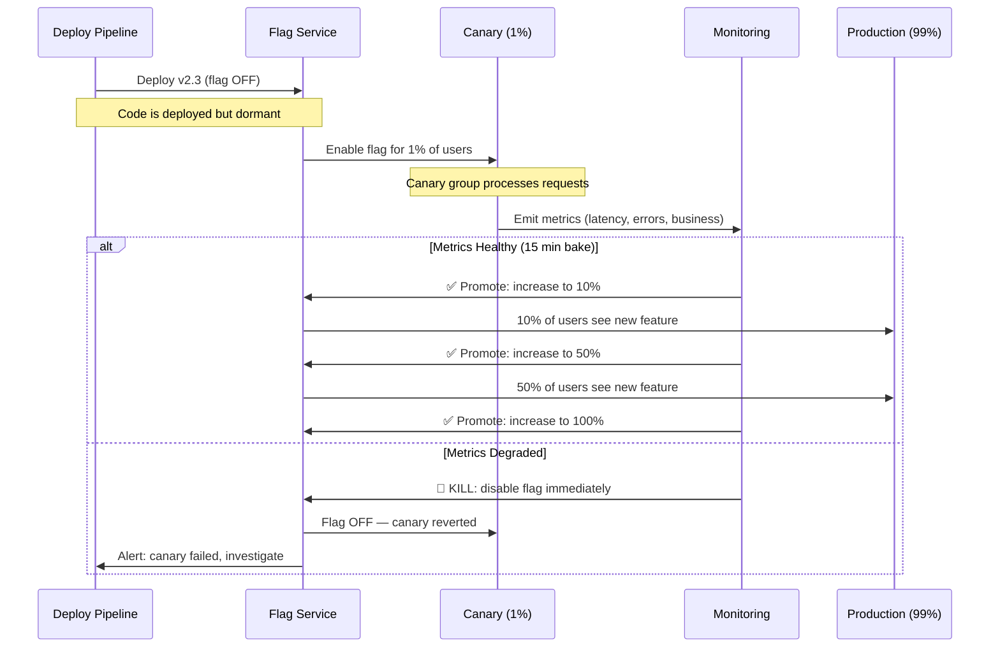
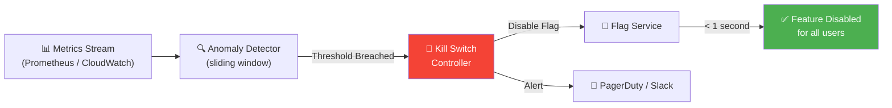

# The Rollout Strategy 🟡

> **What you'll learn:**
> - How to implement **canary releases** that expose a new feature to a tiny subset of users before anyone else — and how to automate the decision to proceed or roll back.
> - The mechanics of **dark launching** — deploying a code path that executes in shadow mode, comparing its output to the existing path without affecting users.
> - How to design **gradual percentage rollouts** that ramp from 1% → 5% → 25% → 50% → 100% with automated safety gates at each stage.
> - How to build **automatic kill switches** that disable a feature flag within seconds if operational metrics (error rates, latency, crash rates) breach predefined thresholds.

---

## The Rollout Spectrum

Not all releases are created equal. The risk profile of a feature determines which rollout strategy you use:

| Strategy | Risk Level | Speed | Use Case |
|----------|-----------|-------|----------|
| **Big Bang** (no flag) | 🔴 Maximum | Instant | Never, for growth features |
| **Boolean Flag** (on/off) | 🟡 Medium | Fast | Simple, low-risk features |
| **Canary** (1% first) | 🟢 Low | Slow | Any customer-facing change |
| **Dark Launch** (shadow mode) | 🟢 Lowest | Slowest | Backend algorithm changes |
| **Gradual Rollout** (staged %) | 🟢 Low | Moderate | Standard for all growth features |

**The rule of thumb:** If a feature touches user-facing UI, billing, or authentication — it gets a gradual rollout with automated kill switches. No exceptions.

---

## Canary Releases

A canary release exposes a new code path to a small, representative subset of users. The name comes from coal miners who brought canaries into mines — if the canary died, the miners knew the air was toxic.



### Canary Selection: Who Gets to Be the Canary?

Your canary group must be **representative** of your full user base. A canary group of only internal employees or only free-tier users will miss bugs that affect paying customers.

```rust
/// Canary group selection strategies.
#[derive(Debug, Clone)]
pub enum CanaryStrategy {
    /// Random percentage based on user_id hash.
    /// Most common. Ensures representative sample.
    RandomPercentage { percentage: f64 },
    
    /// Specific user IDs (internal employees, beta testers).
    /// Use for initial smoke testing BEFORE random canary.
    AllowList { user_ids: Vec<String> },
    
    /// Target a specific cohort for validation.
    /// Example: "Only users in region=EU to test GDPR changes."
    CohortTargeted {
        attribute: String,
        values: Vec<String>,
        percentage: f64,
    },
}

/// Staged rollout plan — each stage must pass health checks before proceeding.
#[derive(Debug, Clone)]
pub struct RolloutPlan {
    pub flag_key: String,
    pub stages: Vec<RolloutStage>,
}

#[derive(Debug, Clone)]
pub struct RolloutStage {
    pub name: String,
    pub percentage: f64,
    /// Minimum time to wait at this stage before health check.
    pub bake_time: std::time::Duration,
    /// Health checks that must pass to proceed.
    pub health_checks: Vec<HealthCheck>,
}

#[derive(Debug, Clone)]
pub struct HealthCheck {
    pub metric: String,
    pub operator: ThresholdOperator,
    pub threshold: f64,
}

#[derive(Debug, Clone)]
pub enum ThresholdOperator {
    /// Metric must be less than threshold (e.g., error rate < 1%).
    LessThan,
    /// Metric must be greater than threshold (e.g., conversion rate > 2%).
    GreaterThan,
    /// Metric's relative change must be less than threshold
    /// (e.g., latency P99 within 10% of baseline).
    RelativeChangeLessThan,
}

// ✅ Example: Standard growth feature rollout plan
pub fn standard_rollout_plan(flag_key: &str) -> RolloutPlan {
    use std::time::Duration;
    
    RolloutPlan {
        flag_key: flag_key.to_string(),
        stages: vec![
            RolloutStage {
                name: "Internal".to_string(),
                percentage: 0.0, // AllowList only
                bake_time: Duration::from_secs(3600), // 1 hour
                health_checks: vec![
                    HealthCheck {
                        metric: "error_rate_5xx".to_string(),
                        operator: ThresholdOperator::LessThan,
                        threshold: 0.01, // < 1%
                    },
                ],
            },
            RolloutStage {
                name: "Canary 1%".to_string(),
                percentage: 0.01,
                bake_time: Duration::from_secs(3600), // 1 hour
                health_checks: vec![
                    HealthCheck {
                        metric: "error_rate_5xx".to_string(),
                        operator: ThresholdOperator::LessThan,
                        threshold: 0.01,
                    },
                    HealthCheck {
                        metric: "p99_latency_ms".to_string(),
                        operator: ThresholdOperator::RelativeChangeLessThan,
                        threshold: 0.10, // Within 10% of baseline
                    },
                ],
            },
            RolloutStage {
                name: "Early Rollout 10%".to_string(),
                percentage: 0.10,
                bake_time: Duration::from_secs(7200), // 2 hours
                health_checks: vec![
                    HealthCheck {
                        metric: "error_rate_5xx".to_string(),
                        operator: ThresholdOperator::LessThan,
                        threshold: 0.005, // Tighter: < 0.5%
                    },
                    HealthCheck {
                        metric: "p99_latency_ms".to_string(),
                        operator: ThresholdOperator::RelativeChangeLessThan,
                        threshold: 0.10,
                    },
                    HealthCheck {
                        metric: "crash_rate".to_string(),
                        operator: ThresholdOperator::LessThan,
                        threshold: 0.001, // < 0.1%
                    },
                ],
            },
            RolloutStage {
                name: "Broad Rollout 50%".to_string(),
                percentage: 0.50,
                bake_time: Duration::from_secs(14400), // 4 hours
                health_checks: vec![
                    HealthCheck {
                        metric: "error_rate_5xx".to_string(),
                        operator: ThresholdOperator::LessThan,
                        threshold: 0.005,
                    },
                    HealthCheck {
                        metric: "conversion_rate".to_string(),
                        operator: ThresholdOperator::GreaterThan,
                        threshold: 0.02, // Business metric check
                    },
                ],
            },
            RolloutStage {
                name: "Full Rollout 100%".to_string(),
                percentage: 1.00,
                bake_time: Duration::from_secs(86400), // 24 hours
                health_checks: vec![
                    HealthCheck {
                        metric: "error_rate_5xx".to_string(),
                        operator: ThresholdOperator::LessThan,
                        threshold: 0.005,
                    },
                ],
            },
        ],
    }
}
```

---

## Dark Launching

Dark launching is the stealthiest rollout strategy. The new code path executes alongside the old one, but only the old path's result is returned to the user. You compare outputs offline.

### When to Dark Launch

- Backend algorithm changes (new recommendation engine, new search ranking)
- Database migration validation (read from new store, compare to old store)
- New pricing calculation logic (shadow-calculate, compare to production)

### The Shadow Execution Pattern

```rust
use std::time::Instant;
use tokio::time::timeout;
use std::time::Duration;

/// Result of a dark launch comparison.
#[derive(Debug, serde::Serialize)]
pub struct DarkLaunchResult<T: std::fmt::Debug> {
    pub control_result: T,
    pub treatment_result: Option<T>,
    pub results_match: bool,
    pub control_latency_ms: u64,
    pub treatment_latency_ms: Option<u64>,
}

/// Execute both code paths, return only the control result.
/// Log the comparison for offline analysis.
pub async fn dark_launch<T, F1, F2, Fut1, Fut2>(
    name: &str,
    control: F1,
    treatment: F2,
    tracker: &EventTracker,
) -> T
where
    T: PartialEq + std::fmt::Debug + serde::Serialize + Clone,
    F1: FnOnce() -> Fut1,
    F2: FnOnce() -> Fut2,
    Fut1: std::future::Future<Output = T>,
    Fut2: std::future::Future<Output = T>,
{
    let control_start = Instant::now();
    let control_result = control().await;
    let control_latency = control_start.elapsed().as_millis() as u64;

    // ✅ Run treatment with a timeout — never slow down the user
    let treatment_start = Instant::now();
    let treatment_result = timeout(
        Duration::from_millis(500), // Hard cap: 500ms
        treatment(),
    ).await.ok();
    let treatment_latency = treatment_result.as_ref().map(|_| {
        treatment_start.elapsed().as_millis() as u64
    });

    let results_match = treatment_result
        .as_ref()
        .map_or(false, |t| t == &control_result);

    // ✅ Log the comparison — this feeds a dashboard showing mismatch rates
    tracker.track("DarkLaunch_Compared", &DarkLaunchComparison {
        experiment_name: name.to_string(),
        results_match,
        control_latency_ms: control_latency,
        treatment_latency_ms: treatment_latency,
    });

    if !results_match {
        tracing::warn!(
            experiment = name,
            "Dark launch mismatch detected"
        );
    }

    // ✅ Always return the control result — user never sees the treatment
    control_result
}

#[derive(Debug, serde::Serialize)]
struct DarkLaunchComparison {
    experiment_name: String,
    results_match: bool,
    control_latency_ms: u64,
    treatment_latency_ms: Option<u64>,
}
```

**Usage example:**

```rust
// Dark-launching a new recommendation algorithm
let recommendations = dark_launch(
    "new_reco_engine_v2",
    || async { old_recommendation_engine.get_recommendations(user_id).await },
    || async { new_recommendation_engine.get_recommendations(user_id).await },
    &tracker,
).await;
// User always sees old results. Comparison is logged.
// After 7 days of < 2% mismatch rate, promote new engine.
```

---

## Automatic Kill Switches

The most important safety mechanism in your rollout toolbox. A kill switch monitors operational and business metrics in real-time and automatically disables a feature flag if something goes wrong.

### The Kill Switch Pipeline



### Implementation

```rust
use std::collections::VecDeque;
use std::time::{Duration, Instant};

/// Monitors a metric stream and triggers a kill switch when thresholds are breached.
pub struct KillSwitchMonitor {
    flag_key: String,
    checks: Vec<KillSwitchCheck>,
    flag_service: Arc<dyn FlagService>,
    alerter: Arc<dyn Alerter>,
}

pub struct KillSwitchCheck {
    pub metric_name: String,
    pub threshold: f64,
    pub operator: ThresholdOperator,
    /// How many consecutive breaches before triggering.
    pub breach_count_trigger: u32,
    /// Sliding window of recent values.
    window: VecDeque<(Instant, f64)>,
    /// Current consecutive breach count.
    current_breaches: u32,
}

#[async_trait::async_trait]
pub trait FlagService: Send + Sync {
    async fn kill_flag(&self, flag_key: &str, reason: &str) -> Result<(), String>;
}

#[async_trait::async_trait]
pub trait Alerter: Send + Sync {
    async fn send_alert(&self, severity: AlertSeverity, message: &str);
}

#[derive(Debug)]
pub enum AlertSeverity { Warning, Critical }

impl KillSwitchMonitor {
    /// Evaluate all checks against the latest metrics.
    /// If any check breaches its threshold, kill the flag.
    pub async fn evaluate(&mut self, metrics: &MetricsSnapshot) {
        for check in &mut self.checks {
            if let Some(value) = metrics.get(&check.metric_name) {
                let breached = match check.operator {
                    ThresholdOperator::LessThan => value >= &check.threshold,
                    ThresholdOperator::GreaterThan => value <= &check.threshold,
                    ThresholdOperator::RelativeChangeLessThan => {
                        // Compare to baseline (first value in window)
                        check.window.front()
                            .map_or(false, |(_, baseline)| {
                                let change = (value - baseline).abs() / baseline;
                                change >= check.threshold
                            })
                    }
                };

                check.window.push_back((Instant::now(), *value));
                // Keep sliding window to last 5 minutes
                while check.window.front()
                    .map_or(false, |(t, _)| t.elapsed() > Duration::from_secs(300))
                {
                    check.window.pop_front();
                }

                if breached {
                    check.current_breaches += 1;
                    if check.current_breaches >= check.breach_count_trigger {
                        // 🚨 KILL THE FLAG
                        let reason = format!(
                            "Kill switch triggered: {} {} threshold {} (current: {}). \
                             {} consecutive breaches.",
                            check.metric_name,
                            match check.operator {
                                ThresholdOperator::LessThan => ">=",
                                ThresholdOperator::GreaterThan => "<=",
                                ThresholdOperator::RelativeChangeLessThan => "relative change >=",
                            },
                            check.threshold,
                            value,
                            check.current_breaches,
                        );

                        let _ = self.flag_service
                            .kill_flag(&self.flag_key, &reason)
                            .await;

                        self.alerter
                            .send_alert(AlertSeverity::Critical, &reason)
                            .await;

                        tracing::error!(
                            flag_key = %self.flag_key,
                            reason = %reason,
                            "🚨 KILL SWITCH ACTIVATED"
                        );
                    }
                } else {
                    check.current_breaches = 0; // Reset on clean reading
                }
            }
        }
    }
}

pub struct MetricsSnapshot {
    values: std::collections::HashMap<String, f64>,
}

impl MetricsSnapshot {
    pub fn get(&self, key: &str) -> Option<&f64> {
        self.values.get(key)
    }
}
```

---

## The Rollout Automation Engine

Putting it all together — an automated rollout controller that advances through stages, checks health, and kills on failure:

```rust
/// The rollout automation engine. Drives a flag through its rollout plan.
pub async fn execute_rollout(
    plan: &RolloutPlan,
    flag_service: &dyn FlagService,
    metrics_provider: &dyn MetricsProvider,
    alerter: &dyn Alerter,
) {
    for (stage_idx, stage) in plan.stages.iter().enumerate() {
        tracing::info!(
            flag = %plan.flag_key,
            stage = %stage.name,
            percentage = stage.percentage,
            "Advancing to rollout stage"
        );

        // Update the flag percentage
        if let Err(e) = flag_service
            .kill_flag(&plan.flag_key, &format!("Advancing to {}", stage.name))
            .await
        {
            tracing::error!("Failed to update flag: {}", e);
            return;
        }

        // Bake time — wait for metrics to stabilize
        tracing::info!(
            bake_seconds = stage.bake_time.as_secs(),
            "Waiting for bake time"
        );
        tokio::time::sleep(stage.bake_time).await;

        // Health checks
        let metrics = metrics_provider.snapshot().await;
        let mut all_healthy = true;
        for check in &stage.health_checks {
            if let Some(value) = metrics.get(&check.metric) {
                let passed = match check.operator {
                    ThresholdOperator::LessThan => value < &check.threshold,
                    ThresholdOperator::GreaterThan => value > &check.threshold,
                    ThresholdOperator::RelativeChangeLessThan => true, // Simplified
                };

                if !passed {
                    tracing::error!(
                        metric = %check.metric,
                        value = value,
                        threshold = check.threshold,
                        "Health check FAILED at stage {}",
                        stage.name,
                    );
                    all_healthy = false;
                }
            }
        }

        if !all_healthy {
            // ✅ Automatic rollback
            let _ = flag_service
                .kill_flag(&plan.flag_key, "Health check failed — rolling back")
                .await;
            alerter.send_alert(
                AlertSeverity::Critical,
                &format!(
                    "Rollout of {} killed at stage {}: health checks failed",
                    plan.flag_key, stage.name
                ),
            ).await;
            return;
        }

        tracing::info!(
            flag = %plan.flag_key,
            stage = %stage.name,
            "✅ Stage passed all health checks"
        );
    }

    tracing::info!(
        flag = %plan.flag_key,
        "🎉 Rollout complete — flag at 100%"
    );
}

#[async_trait::async_trait]
pub trait MetricsProvider: Send + Sync {
    async fn snapshot(&self) -> MetricsSnapshot;
}
```

---

<details>
<summary><strong>🏋️ Exercise: Design a Rollout Plan for a New Payment Provider</strong> (click to expand)</summary>

### The Challenge

Your company is migrating from Stripe to a new payment provider (Adyen) for European users. This is high-risk because:

1. Payment failures directly impact revenue.
2. The new provider has different error codes and retry semantics.
3. EU regulatory requirements (PSD2/SCA) must be validated.

Design a complete rollout plan that:

- Uses dark launching to validate Adyen responses against Stripe for 7 days.
- Canaries to 0.5% of EU users with the strictest health checks.
- Includes business metric checks (not just operational).
- Has an automatic kill switch with a 3-minute response time.
- Defines the specific metrics and thresholds at each stage.

<details>
<summary>🔑 Solution</summary>

```rust
use std::time::Duration;

pub fn payment_migration_rollout() -> RolloutPlan {
    RolloutPlan {
        flag_key: "payment_provider_adyen_eu".to_string(),
        stages: vec![
            // ── Stage 0: Dark Launch (7 days) ──
            // Both providers execute. Only Stripe result is used.
            // Compare success rates, amounts, and latencies.
            RolloutStage {
                name: "Dark Launch — Shadow Mode".to_string(),
                percentage: 0.0, // No real traffic to Adyen
                bake_time: Duration::from_secs(7 * 24 * 3600), // 7 days
                health_checks: vec![
                    // Dark launch mismatch rate should be < 2%
                    HealthCheck {
                        metric: "dark_launch.adyen_v_stripe.mismatch_rate".to_string(),
                        operator: ThresholdOperator::LessThan,
                        threshold: 0.02,
                    },
                    // Adyen shadow latency should be within 20% of Stripe
                    HealthCheck {
                        metric: "dark_launch.adyen_v_stripe.latency_ratio".to_string(),
                        operator: ThresholdOperator::LessThan,
                        threshold: 1.20,
                    },
                ],
            },

            // ── Stage 1: Internal Only ──
            // Process real payments through Adyen for internal test accounts.
            RolloutStage {
                name: "Internal Accounts Only".to_string(),
                percentage: 0.0, // AllowList targeting
                bake_time: Duration::from_secs(24 * 3600), // 24 hours
                health_checks: vec![
                    HealthCheck {
                        metric: "adyen.payment_success_rate".to_string(),
                        operator: ThresholdOperator::GreaterThan,
                        threshold: 0.95, // > 95% success
                    },
                    HealthCheck {
                        metric: "adyen.sca_challenge_rate".to_string(),
                        operator: ThresholdOperator::LessThan,
                        threshold: 0.30, // SCA challenges < 30%
                    },
                ],
            },

            // ── Stage 2: Canary 0.5% EU ──
            // Tiny slice of real EU users.
            RolloutStage {
                name: "Canary 0.5% EU".to_string(),
                percentage: 0.005,
                bake_time: Duration::from_secs(4 * 3600), // 4 hours
                health_checks: vec![
                    // OPERATIONAL
                    HealthCheck {
                        metric: "adyen.error_rate_5xx".to_string(),
                        operator: ThresholdOperator::LessThan,
                        threshold: 0.005, // < 0.5%
                    },
                    HealthCheck {
                        metric: "adyen.p99_latency_ms".to_string(),
                        operator: ThresholdOperator::LessThan,
                        threshold: 3000.0, // < 3 seconds
                    },
                    // BUSINESS — the most important checks
                    HealthCheck {
                        metric: "adyen.payment_success_rate".to_string(),
                        operator: ThresholdOperator::GreaterThan,
                        threshold: 0.92, // > 92% (Stripe baseline ~94%)
                    },
                    HealthCheck {
                        metric: "adyen.checkout_completion_rate".to_string(),
                        operator: ThresholdOperator::GreaterThan,
                        threshold: 0.80, // > 80% of checkouts complete
                    },
                ],
            },

            // ── Stage 3: Early Rollout 5% EU ──
            RolloutStage {
                name: "Early Rollout 5% EU".to_string(),
                percentage: 0.05,
                bake_time: Duration::from_secs(12 * 3600), // 12 hours
                health_checks: vec![
                    HealthCheck {
                        metric: "adyen.payment_success_rate".to_string(),
                        operator: ThresholdOperator::GreaterThan,
                        threshold: 0.93,
                    },
                    HealthCheck {
                        metric: "adyen.refund_success_rate".to_string(),
                        operator: ThresholdOperator::GreaterThan,
                        threshold: 0.99, // Refunds must ALWAYS work
                    },
                    HealthCheck {
                        metric: "adyen.revenue_per_checkout_cents".to_string(),
                        operator: ThresholdOperator::GreaterThan,
                        threshold: 800.0, // Revenue not collapsing
                    },
                ],
            },

            // ── Stage 4: Broad Rollout 25% EU ──
            RolloutStage {
                name: "Broad Rollout 25% EU".to_string(),
                percentage: 0.25,
                bake_time: Duration::from_secs(24 * 3600), // 24 hours
                health_checks: vec![
                    HealthCheck {
                        metric: "adyen.payment_success_rate".to_string(),
                        operator: ThresholdOperator::GreaterThan,
                        threshold: 0.935, // Tightening toward Stripe parity
                    },
                    HealthCheck {
                        metric: "adyen.dispute_rate".to_string(),
                        operator: ThresholdOperator::LessThan,
                        threshold: 0.01, // < 1% dispute rate
                    },
                ],
            },

            // ── Stage 5: Full EU Rollout ──
            RolloutStage {
                name: "Full Rollout 100% EU".to_string(),
                percentage: 1.00,
                bake_time: Duration::from_secs(7 * 24 * 3600), // 7 day soak
                health_checks: vec![
                    HealthCheck {
                        metric: "adyen.payment_success_rate".to_string(),
                        operator: ThresholdOperator::GreaterThan,
                        threshold: 0.94, // Stripe parity
                    },
                ],
            },
        ],
    }
}

// ✅ Kill switch configuration for the payment migration
//
// Metric: adyen.payment_success_rate
// Threshold: < 85% (critical failure)
// Breach count: 2 consecutive readings (3-minute window)
// Action: Kill flag immediately, page on-call, revert to Stripe
//
// Metric: adyen.error_rate_5xx  
// Threshold: > 5%
// Breach count: 3 consecutive readings
// Action: Kill flag, alert team
//
// Total time from breach to flag kill: < 3 minutes
// Total time from flag kill to user impact: < 1 second
//   (flag evaluation reads from in-memory store, synced every 30s,
//    but kill signals use a push channel for immediate propagation)
```

**Critical design decisions:**

1. **Dark launch comes FIRST** — 7 full days of shadow comparison before any real user payment touches Adyen. This catches API response format differences, timeout behavior, and edge cases.
2. **Business metrics at every stage** — `payment_success_rate`, `checkout_completion_rate`, and `revenue_per_checkout_cents` are more important than latency for a payment migration.
3. **Refund success rate** is checked separately — a payment provider that can charge but can't refund is a compliance nightmare.
4. **3-minute kill switch** — uses a push channel for immediate flag propagation rather than waiting for the 30-second sync interval.
5. **7-day soak at 100%** — even after full rollout, keep monitoring for delayed issues (chargebacks, dispute rates, monthly reconciliation).

</details>
</details>

---

> **Key Takeaways**
>
> 1. **Every customer-facing feature gets a gradual rollout.** The only question is how many stages and how long to bake at each one.
> 2. **Dark launching eliminates risk for backend changes.** Run both code paths, compare outputs, commit to the new one only when mismatch rates are negligible.
> 3. **Kill switches must be automatic.** If a human has to notice a problem, diagnose it, and manually kill a flag, you've already lost 15–30 minutes. Automated kill switches respond in under 3 minutes.
> 4. **Monitor business metrics, not just operational ones.** A feature can have zero errors and still destroy your conversion rate. The kill switch must watch both layers.
> 5. **The canary group must be representative.** If your canary is only internal employees, you'll miss bugs that affect real user environments, devices, and data patterns.

---

> **See also:**
> - [Chapter 3: Feature Flags Architecture](ch03-feature-flags-architecture.md) — The flag evaluation engine that powers these rollout strategies.
> - [Chapter 5: A/B Testing Infrastructure](ch05-ab-testing-infrastructure.md) — How canary rollouts evolve into full A/B experiments.
> - [Chapter 7: Capstone](ch07-capstone-dynamic-paywall-engine.md) — Applying gradual rollout to a monetization experiment.
