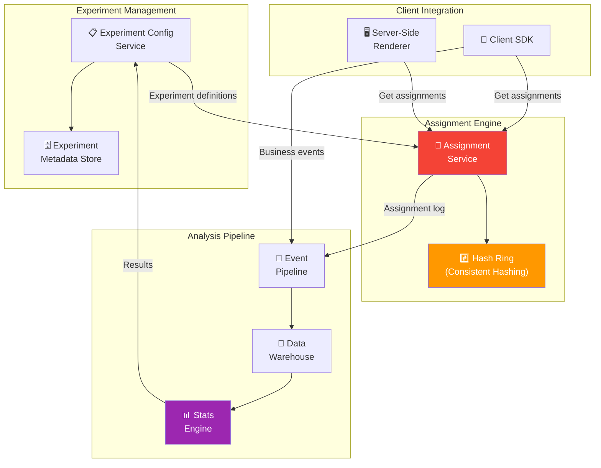
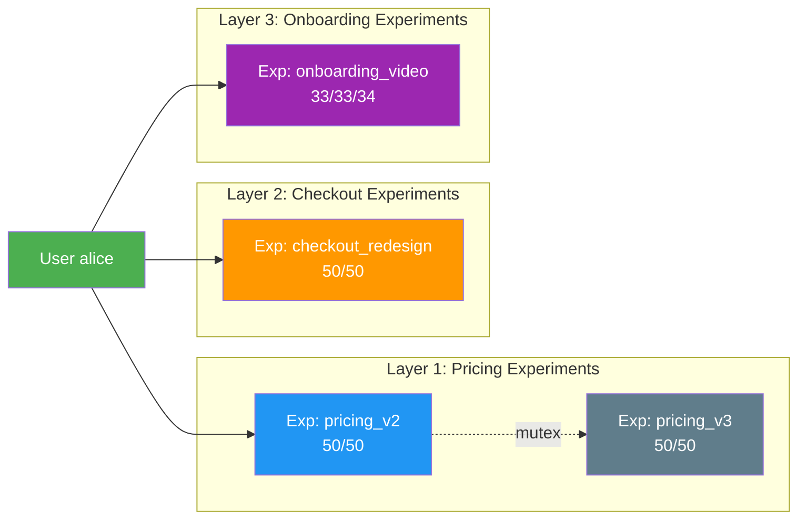

# A/B Testing Infrastructure 🔴

> **What you'll learn:**
> - How to build a complete **experimentation platform** from scratch — the system that manages experiment lifecycle, user assignment, and result analysis.
> - Why **consistent hashing** is essential for deterministic user-to-variant assignment, and how to implement it so the same user always sees the same variant across sessions and devices.
> - How to eliminate the **"Flicker Effect"** — the visible UI flash that occurs when a user is assigned to a variant after the page has already rendered the default.
> - The full **experiment lifecycle**: design → assignment → exposure → analysis → decision → cleanup.

---

## Why Build vs. Buy?

Before writing a single line of code, you need to answer: should you build an experimentation platform or buy one (LaunchDarkly, Statsig, Eppo, Optimizely)?

| Factor | Build | Buy |
|--------|-------|------|
| Cost (< 50 engineers) | Higher (engineering time) | Lower ($50K–$200K/yr) |
| Cost (500+ engineers) | Lower (amortized) | Higher ($500K+/yr at scale) |
| Customization | Unlimited | Limited to vendor capabilities |
| Data ownership | Full (your warehouse) | Vendor holds assignment data |
| Integration with internal tools | Seamless | Requires adapters |
| Time to first experiment | 2–4 months | 1–2 weeks |
| Statistical rigor | You own it (risk + reward) | Vendor provides methodology |

**The growth engineer's answer:** Start with a vendor for speed. Build when you outgrow it — typically when you're running 100+ concurrent experiments, need custom statistical methods, or the vendor becomes your largest non-headcount line item.

This chapter teaches you how to build it, because understanding the internals makes you a better *user* of any vendor platform.

---

## The Experimentation Platform Architecture



---

## Consistent Hashing for User Assignment

The most critical component of any A/B testing system is **deterministic assignment**: the same user must see the same variant every time, across sessions, devices, and server instances.

### Why Not Just Use `random()`?

| Approach | Deterministic? | Consistent Across Sessions? | Consistent Across Servers? |
|----------|---------------|---------------------------|---------------------------|
| `random()` | ❌ No | ❌ No | ❌ No |
| `random()` + DB lookup | ✅ Yes (stored) | ✅ Yes | ✅ Yes |
| `hash(user_id + salt)` | ✅ Yes (computed) | ✅ Yes | ✅ Yes |

The DB lookup approach works but adds latency and a point of failure. Hashing is **stateless** — any server can compute the assignment independently and get the same answer.

### The Assignment Hash Ring

```
Experiment: "pricing_page_v2"
Salt: "pricing_page_v2_2024"
Variants: Control (50%), Treatment (50%)

Hash Ring [0 ──────────────────── 9999]:

  0          2500         5000         7500        9999
  │──────────│────────────│────────────│───────────│
  │       Control         │        Treatment       │
  │        (50%)          │          (50%)         │

User "alice" → hash("pricing_page_v2_2024:alice") % 10000 = 3142 → Control
User "bob"   → hash("pricing_page_v2_2024:bob")   % 10000 = 7891 → Treatment
User "carol" → hash("pricing_page_v2_2024:carol") % 10000 = 1203 → Control
```

### Implementation

```rust
use sha2::{Sha256, Digest};

/// Deterministic A/B test assignment using consistent hashing.
/// Same inputs ALWAYS produce the same output.
pub struct ExperimentAssigner;

impl ExperimentAssigner {
    /// Assign a user to an experiment variant.
    ///
    /// - `experiment_salt`: Unique per experiment. Changing it reshuffles ALL users.
    /// - `user_id`: Stable user identifier.
    /// - `variants`: Ordered list of (variant_name, traffic_percentage).
    ///   Percentages must sum to 1.0.
    ///
    /// Returns the variant name the user is assigned to.
    pub fn assign(
        experiment_salt: &str,
        user_id: &str,
        variants: &[(&str, f64)],
    ) -> String {
        // ✅ Use SHA-256 for uniform distribution (not DefaultHasher)
        let mut hasher = Sha256::new();
        hasher.update(experiment_salt.as_bytes());
        hasher.update(b":");
        hasher.update(user_id.as_bytes());
        let hash = hasher.finalize();

        // Take first 8 bytes as u64 for bucket calculation
        let hash_value = u64::from_be_bytes(hash[..8].try_into().unwrap());
        let bucket = (hash_value % 10_000) as f64 / 10_000.0;

        // Walk the cumulative distribution
        let mut cumulative = 0.0;
        for (name, percentage) in variants {
            cumulative += percentage;
            if bucket < cumulative {
                return name.to_string();
            }
        }

        // Fallback (floating-point edge case)
        variants.last()
            .map(|(name, _)| name.to_string())
            .unwrap_or_else(|| "control".to_string())
    }

    /// Verify assignment is deterministic — same inputs, same output.
    /// Call this in your test suite.
    pub fn verify_determinism(
        salt: &str,
        user_id: &str,
        variants: &[(&str, f64)],
        iterations: usize,
    ) -> bool {
        let first = Self::assign(salt, user_id, variants);
        (1..iterations).all(|_| Self::assign(salt, user_id, variants) == first)
    }

    /// Compute the actual traffic split for a set of user IDs.
    /// Used for validating that the hash function produces uniform distribution.
    pub fn measure_distribution(
        salt: &str,
        user_ids: &[&str],
        variants: &[(&str, f64)],
    ) -> std::collections::HashMap<String, usize> {
        let mut counts = std::collections::HashMap::new();
        for user_id in user_ids {
            let variant = Self::assign(salt, user_id, variants);
            *counts.entry(variant).or_insert(0) += 1;
        }
        counts
    }
}

#[cfg(test)]
mod tests {
    use super::*;

    #[test]
    fn assignment_is_deterministic() {
        assert!(ExperimentAssigner::verify_determinism(
            "test_exp_salt",
            "user_123",
            &[("control", 0.5), ("treatment", 0.5)],
            1000,
        ));
    }

    #[test]
    fn distribution_is_approximately_uniform() {
        // Generate 100K synthetic user IDs
        let user_ids: Vec<String> = (0..100_000)
            .map(|i| format!("user_{}", i))
            .collect();
        let user_refs: Vec<&str> = user_ids.iter().map(|s| s.as_str()).collect();

        let distribution = ExperimentAssigner::measure_distribution(
            "uniformity_test",
            &user_refs,
            &[("control", 0.5), ("treatment", 0.5)],
        );

        let control = *distribution.get("control").unwrap_or(&0) as f64;
        let treatment = *distribution.get("treatment").unwrap_or(&0) as f64;
        let total = control + treatment;

        // Each variant should be within 1% of expected 50%
        assert!((control / total - 0.5).abs() < 0.01);
        assert!((treatment / total - 0.5).abs() < 0.01);
    }
}
```

---

## The Experiment Lifecycle

Every experiment progresses through a defined lifecycle. Skipping stages leads to invalid results.

### The Six Stages

| Stage | Duration | Who | What Happens |
|-------|----------|-----|-------------|
| 1. Design | 1–3 days | Growth + Data Science | Define hypothesis, primary metric, MDE, sample size |
| 2. Implement | 2–5 days | Engineering | Build treatment behind feature flag |
| 3. QA + Internal | 1–2 days | Engineering + QA | Validate on internal accounts, check assignment logging |
| 4. Run | 7–30 days | Automated | Collect data, monitor guardrail metrics |
| 5. Analyze | 1–2 days | Data Science | Calculate statistical significance (Chapter 6) |
| 6. Decide + Cleanup | 1–3 days | Product + Engineering | Ship winner or revert; remove flag |

### The Experiment Definition

```rust
use chrono::{DateTime, Utc};
use serde::{Deserialize, Serialize};

#[derive(Debug, Clone, Serialize, Deserialize)]
pub struct ExperimentDefinition {
    /// Unique identifier (e.g., "pricing_page_v2_2024q1").
    pub id: String,
    /// Human-readable name.
    pub name: String,
    /// The hypothesis being tested.
    pub hypothesis: String,
    /// Primary metric to evaluate (e.g., "checkout_conversion_rate").
    pub primary_metric: String,
    /// Secondary metrics to monitor (e.g., "revenue_per_user", "page_load_time").
    pub secondary_metrics: Vec<String>,
    /// Guardrail metrics that trigger automatic stop if degraded.
    pub guardrail_metrics: Vec<GuardrailMetric>,
    /// Variant definitions with traffic allocation.
    pub variants: Vec<VariantDefinition>,
    /// Minimum sample size per variant (calculated from MDE and power).
    pub min_sample_size: u64,
    /// Expected run duration.
    pub planned_duration_days: u32,
    /// Current lifecycle stage.
    pub status: ExperimentStatus,
    /// Targeting: who is eligible for this experiment?
    pub targeting: ExperimentTargeting,
    /// Salt for consistent hashing (auto-generated from experiment ID).
    pub salt: String,
    pub created_at: DateTime<Utc>,
    pub started_at: Option<DateTime<Utc>>,
    pub ended_at: Option<DateTime<Utc>>,
}

#[derive(Debug, Clone, Serialize, Deserialize)]
pub struct VariantDefinition {
    pub key: String,          // "control", "treatment_a", "treatment_b"
    pub name: String,         // "Current Pricing Page", "Annual-Only Flow"
    pub percentage: f64,      // 0.5 for 50%
    pub is_control: bool,     // True for the baseline variant
}

#[derive(Debug, Clone, Serialize, Deserialize)]
pub struct GuardrailMetric {
    pub metric: String,
    pub direction: GuardrailDirection,
    /// Maximum acceptable degradation (e.g., 0.05 = 5% worse than control).
    pub max_degradation: f64,
}

#[derive(Debug, Clone, Serialize, Deserialize)]
pub enum GuardrailDirection {
    /// Higher is better (e.g., conversion rate).
    HigherIsBetter,
    /// Lower is better (e.g., error rate, latency).
    LowerIsBetter,
}

#[derive(Debug, Clone, Serialize, Deserialize)]
pub enum ExperimentStatus {
    Draft,
    Approved,
    Running,
    Paused,
    Completed { winner: Option<String> },
    Killed { reason: String },
}

#[derive(Debug, Clone, Serialize, Deserialize)]
pub struct ExperimentTargeting {
    /// Only users matching these conditions are eligible.
    pub conditions: Vec<TargetingCondition>,
    /// Exclude users already in these other experiments
    /// (to avoid interaction effects).
    pub mutex_experiments: Vec<String>,
}

#[derive(Debug, Clone, Serialize, Deserialize)]
pub struct TargetingCondition {
    pub attribute: String,
    pub operator: String,
    pub values: Vec<serde_json::Value>,
}
```

---

## Eliminating the Flicker Effect

The "Flicker Effect" is the #1 UX complaint about client-side A/B testing. It happens when:

1. The page renders with the default (control) UI ← User sees this
2. The A/B test SDK loads and assigns the user to the treatment
3. The page re-renders with the treatment UI ← User sees the "flicker"

This destroys the experiment's validity because users are primed by seeing the control before the treatment.

### The Blind Way (Client-Side Assignment After Render)

```javascript
// 💥 ANALYTICS HAZARD: Assignment happens AFTER the page renders

// Page renders with default pricing ($9.99/mo) ← User sees this!

window.addEventListener('load', async () => {
    // 💥 Network call to get assignment AFTER page is visible
    const variant = await fetch('/api/experiment/pricing_v2').then(r => r.json());
    
    if (variant === 'treatment') {
        // 💥 FLICKER: UI jumps from $9.99 to $7.99 after user has already seen $9.99
        document.getElementById('price').innerText = '$7.99/mo';
    }
});
```

### The Data-Driven Way: Three Anti-Flicker Strategies

| Strategy | Complexity | Eliminates Flicker? | Trade-off |
|----------|-----------|-------------------|-----------|
| **Server-side rendering** | Medium | ✅ Yes | Requires SSR infrastructure |
| **Edge assignment** (CDN) | High | ✅ Yes | Requires edge compute (Cloudflare Workers) |
| **Blocking inline script** | Low | 🟡 Mostly | Adds ~50ms to first render |

### Strategy 1: Server-Side Assignment (Recommended)

```rust
use axum::{
    extract::Query,
    response::Html,
};

/// Server-side A/B test rendering — zero flicker.
/// The HTML sent to the client already contains the correct variant.
pub async fn render_pricing_page(
    user: AuthenticatedUser,
    assigner: axum::extract::Extension<ExperimentAssigner>,
    tracker: axum::extract::Extension<EventTracker>,
) -> Html<String> {
    // ✅ Assignment happens SERVER-SIDE before any HTML is sent
    let variant = ExperimentAssigner::assign(
        "pricing_page_v2_2024q1",
        &user.id,
        &[("control", 0.5), ("treatment", 0.5)],
    );

    // ✅ Log the assignment (exposure event)
    tracker.track("Experiment_Exposed", &ExperimentExposedEvent {
        experiment_id: "pricing_page_v2_2024q1".to_string(),
        variant: variant.clone(),
        user_id: user.id.clone(),
    });

    // ✅ Render the correct HTML for this variant — no client-side switching
    let html = match variant.as_str() {
        "treatment" => render_treatment_pricing(&user),
        _ => render_control_pricing(&user),
    };

    Html(html)
}

#[derive(Debug, serde::Serialize)]
struct ExperimentExposedEvent {
    experiment_id: String,
    variant: String,
    user_id: String,
}

fn render_control_pricing(user: &AuthenticatedUser) -> String {
    format!(r#"
        <div class="pricing" data-variant="control">
            <h1>Pro Plan</h1>
            <p class="price">$9.99/mo</p>
            <button>Start Free Trial</button>
        </div>
    "#)
}

fn render_treatment_pricing(user: &AuthenticatedUser) -> String {
    format!(r#"
        <div class="pricing" data-variant="treatment">
            <h1>Pro Plan — Annual</h1>
            <p class="price">$7.99/mo (billed annually)</p>
            <p class="savings">Save 20%</p>
            <button>Start Free Trial</button>
        </div>
    "#)
}
```

### Strategy 2: Edge Assignment (For SPAs)

```
┌──────────────┐    ┌───────────────────┐    ┌──────────────┐
│    User       │───→│  CDN Edge Worker   │───→│  Origin API  │
│   Browser     │    │ (Cloudflare/Vercel)│    │  (backend)   │
└──────────────┘    └───────────────────┘    └──────────────┘
                           │
                    Assignment happens
                    at the EDGE before
                    HTML is served.
                    Cookie set:
                    x-experiment-pricing=treatment
```

```rust
// Edge worker pseudocode (runs at CDN PoP, < 5ms)

fn handle_request(request: Request) -> Response {
    let user_id = get_user_id_from_cookie(&request)
        .unwrap_or_else(|| generate_anonymous_id());

    let variant = ExperimentAssigner::assign(
        "pricing_v2",
        &user_id,
        &[("control", 0.5), ("treatment", 0.5)],
    );

    // ✅ Set the assignment as a cookie BEFORE the page renders
    let mut response = fetch_origin(request).await;
    response.headers_mut().insert(
        "Set-Cookie",
        format!("x-exp-pricing={};Path=/;SameSite=Lax", variant)
            .parse().unwrap(),
    );
    response
}
```

---

## Exposure Logging: The Most Overlooked Step

**An experiment assignment is NOT an exposure.** Assignment happens when the hash is computed. Exposure happens when the user *actually sees* the variant.

Why does this matter? Consider:

- User is assigned to "treatment" for the pricing page experiment.
- User never visits the pricing page during the experiment.
- If you count this user in the analysis, you're diluting your results with non-exposed users.

### Assignment vs. Exposure

| Concept | When It Happens | Logged As | Used For |
|---------|----------------|-----------|----------|
| **Assignment** | Hash computed (any request) | `Experiment_Assigned` | Audit trail, debugging |
| **Exposure** | User actually *sees* the variant | `Experiment_Exposed` | Statistical analysis |

```rust
/// Only log exposure when the user ACTUALLY SEES the variant.
/// This is called from the rendering code path, not the assignment code path.
pub fn log_exposure_if_first_time(
    tracker: &EventTracker,
    exposure_cache: &mut std::collections::HashSet<String>,
    experiment_id: &str,
    variant: &str,
    user_id: &str,
) {
    let cache_key = format!("{}:{}:{}", experiment_id, user_id, variant);

    // ✅ Only log the FIRST exposure per user per experiment per session.
    // Multiple exposures inflate your sample size and corrupt analysis.
    if exposure_cache.insert(cache_key) {
        tracker.track("Experiment_Exposed", &ExperimentExposedEvent {
            experiment_id: experiment_id.to_string(),
            variant: variant.to_string(),
            user_id: user_id.to_string(),
        });
    }
}
```

---

## Mutual Exclusion: Experiment Interactions

When you're running 100+ experiments simultaneously, users will be in multiple experiments. If Experiment A changes the pricing page and Experiment B changes the checkout flow, their effects can interact — making it impossible to attribute conversion changes to either one.

### The Layer-Based Isolation Model



**Rules:**
- Experiments **within the same layer** are mutually exclusive (a user can be in at most one).
- Experiments **across layers** are independent (a user can be in one per layer).
- Each layer uses a **different hash salt** so assignments are uncorrelated.

```rust
/// Layer-based experiment isolation.
pub struct ExperimentLayerManager {
    layers: Vec<ExperimentLayer>,
}

pub struct ExperimentLayer {
    pub name: String,
    pub salt: String,
    pub experiments: Vec<ExperimentDefinition>,
}

impl ExperimentLayerManager {
    /// Get all assignments for a user across all layers.
    /// Returns at most one experiment per layer.
    pub fn get_assignments(
        &self,
        user_id: &str,
    ) -> Vec<(String, String)> {
        let mut assignments = Vec::new();

        for layer in &self.layers {
            // ✅ Use layer salt + user_id to pick which experiment in this layer
            let mut hasher = sha2::Sha256::new();
            hasher.update(layer.salt.as_bytes());
            hasher.update(b":");
            hasher.update(user_id.as_bytes());
            let hash = hasher.finalize();
            let bucket = u64::from_be_bytes(hash[..8].try_into().unwrap()) % 10_000;

            let mut cumulative = 0u64;
            for experiment in &layer.experiments {
                if !matches!(experiment.status, ExperimentStatus::Running) {
                    continue;
                }

                // Total percentage this experiment occupies in the layer
                let exp_bucket_size = (experiment.variants.iter()
                    .map(|v| v.percentage)
                    .sum::<f64>() * 10_000.0) as u64;

                if bucket < cumulative + exp_bucket_size {
                    // User is eligible for this experiment — now assign variant
                    let variant = ExperimentAssigner::assign(
                        &experiment.salt,
                        user_id,
                        &experiment.variants.iter()
                            .map(|v| (v.key.as_str(), v.percentage))
                            .collect::<Vec<_>>(),
                    );
                    assignments.push((experiment.id.clone(), variant));
                    break; // ✅ Only one experiment per layer
                }
                cumulative += exp_bucket_size;
            }
        }

        assignments
    }
}
```

---

<details>
<summary><strong>🏋️ Exercise: Build an Experiment Assignment Service</strong> (click to expand)</summary>

### The Challenge

Build a complete experiment assignment HTTP service that:

1. Accepts a request with `user_id` and `context` (country, platform, plan_type).
2. Returns all active experiment assignments for that user.
3. Respects mutual exclusion (layer-based isolation).
4. Logs exposure events for each assignment.
5. Returns the assignments fast enough to be called from a server-side renderer (< 5ms P99).

The service must handle these experiments simultaneously:
- **Layer "pricing"**: `pricing_annual_only` (50/50), `pricing_three_tier` (50/50) — mutually exclusive
- **Layer "onboarding"**: `onboarding_video` (33/33/34) — runs independently
- **Layer "checkout"**: `checkout_one_click` (50/50) — runs independently

<details>
<summary>🔑 Solution</summary>

```rust
use axum::{extract::Json, http::StatusCode, response::IntoResponse, routing::post, Router};
use serde::{Deserialize, Serialize};
use std::sync::Arc;

#[derive(Deserialize)]
pub struct AssignmentRequest {
    pub user_id: String,
    pub context: UserContext,
}

#[derive(Deserialize)]
pub struct UserContext {
    pub country: Option<String>,
    pub platform: Option<String>,
    pub plan_type: Option<String>,
}

#[derive(Serialize)]
pub struct AssignmentResponse {
    pub assignments: Vec<Assignment>,
    pub evaluation_time_us: u64,
}

#[derive(Serialize)]
pub struct Assignment {
    pub experiment_id: String,
    pub variant: String,
    pub layer: String,
}

pub async fn handle_assignment(
    Json(req): Json<AssignmentRequest>,
    layer_manager: axum::extract::Extension<Arc<ExperimentLayerManager>>,
    tracker: axum::extract::Extension<Arc<EventTracker>>,
) -> impl IntoResponse {
    let start = std::time::Instant::now();

    // ✅ Get all assignments (one per layer)
    let raw_assignments = layer_manager.get_assignments(&req.user_id);

    // ✅ Build response and log exposures
    let assignments: Vec<Assignment> = raw_assignments
        .into_iter()
        .map(|(exp_id, variant)| {
            // Log exposure
            tracker.track("Experiment_Exposed", &serde_json::json!({
                "experiment_id": exp_id,
                "variant": variant,
                "user_id": req.user_id,
            }));

            Assignment {
                experiment_id: exp_id,
                variant,
                layer: String::new(), // Populated from layer manager
            }
        })
        .collect();

    let elapsed_us = start.elapsed().as_micros() as u64;

    (StatusCode::OK, Json(AssignmentResponse {
        assignments,
        evaluation_time_us: elapsed_us,
    }))
}

// ✅ Server setup with all experiment layers configured
pub fn create_router(
    layer_manager: Arc<ExperimentLayerManager>,
    tracker: Arc<EventTracker>,
) -> Router {
    Router::new()
        .route("/v1/assignments", post(handle_assignment))
        .layer(axum::extract::Extension(layer_manager))
        .layer(axum::extract::Extension(tracker))
}

// ✅ Test: Verify mutual exclusion across 100K users
#[cfg(test)]
mod tests {
    use super::*;

    #[test]
    fn mutual_exclusion_within_layer() {
        let manager = build_test_layer_manager();
        let mut pricing_counts: std::collections::HashMap<String, usize> =
            std::collections::HashMap::new();

        for i in 0..100_000 {
            let user_id = format!("user_{}", i);
            let assignments = manager.get_assignments(&user_id);

            // Count how many pricing experiments this user is in
            let pricing_experiments: Vec<_> = assignments.iter()
                .filter(|(exp_id, _)| {
                    exp_id.starts_with("pricing_")
                })
                .collect();

            // ✅ AT MOST one pricing experiment per user
            assert!(
                pricing_experiments.len() <= 1,
                "User {} is in {} pricing experiments!",
                user_id,
                pricing_experiments.len()
            );

            for (exp_id, _) in &pricing_experiments {
                *pricing_counts.entry(exp_id.clone()).or_insert(0) += 1;
            }
        }

        // Verify roughly equal distribution
        println!("Pricing experiment distribution: {:?}", pricing_counts);
    }
}
```

**Performance characteristics:**

- **Assignment computation:** ~1-2μs per user per experiment (pure CPU, no I/O)
- **Total for 3 layers:** ~5-10μs
- **With exposure logging (async):** < 50μs (logging is fire-and-forget to the event buffer)
- **P99 end-to-end:** < 1ms (well within the 5ms budget for SSR integration)

**Key design decisions:**

- **All computation is in-memory** — experiment definitions are synced in the background, not fetched per-request.
- **Layer salts are independent** — a user's assignment in the pricing layer is uncorrelated with their assignment in the onboarding layer.
- **Exposure logging is async** — the `track()` call enqueues to an unbounded channel and returns immediately.

</details>
</details>

---

> **Key Takeaways**
>
> 1. **Use consistent hashing for assignment.** `SHA-256(salt + user_id) % 10000` is stateless, deterministic, and produces uniform distribution. The same user always gets the same variant.
> 2. **Eliminate the flicker effect** with server-side rendering or edge assignment. Client-side A/B testing that flickers invalidates your experiment by priming users.
> 3. **Assignment ≠ Exposure.** Only count users who *actually saw* the variant in your analysis. Non-exposed users dilute your results and reduce statistical power.
> 4. **Use layer-based isolation** for mutual exclusion. Experiments within a layer are mutually exclusive; experiments across layers are independent. Each layer has its own hash salt.
> 5. **The experiment lifecycle is non-negotiable.** Design → Implement → QA → Run → Analyze → Decide. Skipping the "Analyze" step (shipping the variant that "feels" better) is engineering malpractice.

---

> **See also:**
> - [Chapter 6: Statistical Significance and Pitfalls](ch06-statistical-significance-and-pitfalls.md) — How to analyze the data this infrastructure produces.
> - [Chapter 3: Feature Flags Architecture](ch03-feature-flags-architecture.md) — The flag system that powers variant assignment.
> - [Chapter 7: Capstone](ch07-capstone-dynamic-paywall-engine.md) — Building a complete experimentation system end-to-end.
