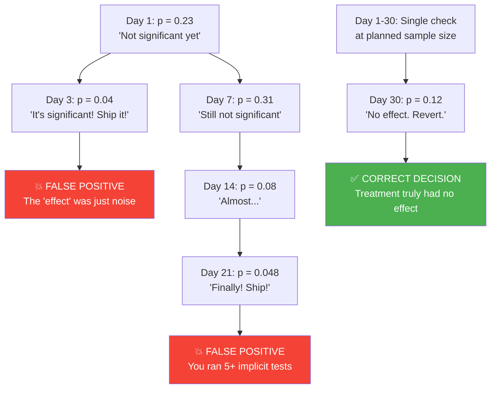
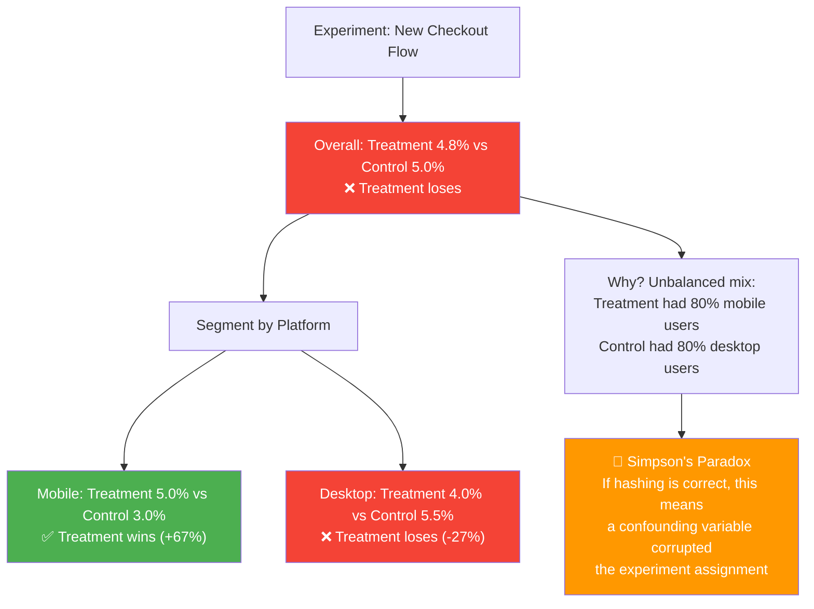

# Statistical Significance and Pitfalls 🔴

> **What you'll learn:**
> - How to correctly interpret **p-values** — what they actually mean (and what they emphatically do not mean), and why a p < 0.05 result is not a license to ship.
> - How to calculate the **Minimum Detectable Effect (MDE)** and **sample size** *before* running an experiment, so you know whether your experiment has enough statistical power to detect a real difference.
> - The **Peeking Problem**: why checking your experiment results daily and stopping early when you see p < 0.05 inflates your false positive rate to 30%+.
> - How **Simpson's Paradox** can reverse your experiment results when you fail to account for confounding variables.

---

## The Statistician's Oath for Growth Engineers

Before we write a single line of code, internalize these truths:

1. **A p-value of 0.05 means there's a 5% chance of seeing this result (or more extreme) if the treatment has NO effect.** It does NOT mean "there's a 95% chance the treatment works."
2. **You must decide the experiment duration BEFORE you start.** Deciding to stop early because you "like the numbers" is scientific fraud.
3. **An underpowered experiment is worse than no experiment.** If you don't have enough users, you'll either miss real effects or "discover" effects that don't exist.
4. **Every time you peek at results and decide to continue or stop, you're running a new statistical test.** The p-value is only valid at the pre-determined sample size.

---

## P-Values Demystified

### What a P-Value Actually Is

```
H₀ (Null Hypothesis): Treatment has NO effect on conversion rate.
H₁ (Alternative):     Treatment CHANGES the conversion rate.

p-value = P(observing data this extreme | H₀ is true)

If p < 0.05:
  → "This result would be very unlikely if the treatment had no effect."
  → We REJECT H₀.
  → We conclude the treatment likely has an effect.
  → BUT: 5% of the time, we're WRONG (Type I Error / False Positive).
```

### The Confusion Matrix of Experiment Decisions

| | Treatment Actually Works | Treatment Has No Effect |
|---|---|---|
| **We ship (reject H₀)** | ✅ True Positive | ❌ **Type I Error (False Positive)** |
| **We don't ship (fail to reject H₀)** | ❌ **Type II Error (False Negative)** | ✅ True Negative |

| Error Type | What Happened | Controlled By | Typical Threshold |
|-----------|--------------|--------------|------------------|
| Type I (α) | Shipped a feature that doesn't work | Significance level | α = 0.05 (5%) |
| Type II (β) | Killed a feature that would have worked | Statistical power (1−β) | β = 0.20 (20%), Power = 80% |

---

## Frequentist vs. Bayesian: A Pragmatic Comparison

| Aspect | Frequentist (T-Test) | Bayesian |
|--------|---------------------|----------|
| Output | p-value, confidence interval | Posterior probability, credible interval |
| Interpretation | "If null is true, this extreme is unlikely" | "There's an 87% probability treatment is better" |
| Sample size | Must be fixed before experiment | Flexible (natural stopping) |
| Peeking problem | **Severe** (inflates false positives) | **Mild** (built-in correction) |
| Computational cost | Low | Higher (MCMC or approximation) |
| Adoption in industry | Most common (Google, Meta, Airbnb) | Growing (Netflix, Spotify, Uber) |
| When to use | High-traffic experiments with clear power | Lower traffic or need for continuous monitoring |

---

## Calculating Sample Size Before You Start

**This is non-negotiable.** Starting an experiment without calculating the required sample size is like deploying without tests — you might get lucky, but you're gambling.

### The Inputs

| Parameter | Symbol | What It Means | Example Value |
|-----------|--------|---------------|---------------|
| Baseline conversion rate | p₁ | Current conversion rate (control) | 5% (0.05) |
| Minimum Detectable Effect | MDE (δ) | Smallest improvement you care about detecting | 10% relative (0.5% absolute) |
| Significance level | α | False positive rate you'll tolerate | 0.05 (5%) |
| Statistical power | 1−β | Probability of detecting a real effect | 0.80 (80%) |

### The Formula

For a two-proportion z-test (which is what most A/B tests use for conversion rates):

$$n = \frac{(Z_{\alpha/2} + Z_{\beta})^2 \cdot (p_1(1-p_1) + p_2(1-p_2))}{(p_2 - p_1)^2}$$

Where:
- $Z_{\alpha/2}$ = 1.96 (for α = 0.05, two-tailed)
- $Z_{\beta}$ = 0.84 (for β = 0.20, i.e., 80% power)
- $p_1$ = baseline conversion rate
- $p_2$ = baseline + minimum detectable effect

### Implementation

```rust
/// Sample size calculator for A/B tests on conversion rates.
pub struct SampleSizeCalculator;

impl SampleSizeCalculator {
    /// Calculate the required sample size PER VARIANT for a two-proportion z-test.
    ///
    /// # Arguments
    /// * `baseline_rate` - Current conversion rate (e.g., 0.05 for 5%)
    /// * `mde_relative` - Minimum detectable effect as relative change (e.g., 0.10 for 10%)
    /// * `alpha` - Significance level (typically 0.05)
    /// * `power` - Statistical power (typically 0.80)
    ///
    /// # Returns
    /// Required sample size per variant (multiply by number of variants for total).
    pub fn required_sample_size(
        baseline_rate: f64,
        mde_relative: f64,
        alpha: f64,
        power: f64,
    ) -> u64 {
        let p1 = baseline_rate;
        let p2 = baseline_rate * (1.0 + mde_relative);

        let z_alpha = Self::z_score(1.0 - alpha / 2.0);
        let z_beta = Self::z_score(power);

        let numerator = (z_alpha + z_beta).powi(2) * (p1 * (1.0 - p1) + p2 * (1.0 - p2));
        let denominator = (p2 - p1).powi(2);

        (numerator / denominator).ceil() as u64
    }

    /// Estimate how many days an experiment needs to run.
    ///
    /// # Arguments
    /// * `sample_size_per_variant` - From `required_sample_size()`
    /// * `num_variants` - Number of variants (typically 2 for A/B)
    /// * `eligible_users_per_day` - Daily users eligible for the experiment
    pub fn estimated_duration_days(
        sample_size_per_variant: u64,
        num_variants: u32,
        eligible_users_per_day: u64,
    ) -> u64 {
        let total_needed = sample_size_per_variant * num_variants as u64;
        (total_needed as f64 / eligible_users_per_day as f64).ceil() as u64
    }

    /// Approximate z-score using the rational approximation.
    /// For production use, prefer a proper stats library.
    fn z_score(p: f64) -> f64 {
        // Abramowitz and Stegun approximation 26.2.23
        if p <= 0.0 || p >= 1.0 {
            return 0.0;
        }
        let t = (-2.0 * p.ln()).sqrt();
        let c0 = 2.515_517;
        let c1 = 0.802_853;
        let c2 = 0.010_328;
        let d1 = 1.432_788;
        let d2 = 0.189_269;
        let d3 = 0.001_308;
        t - (c0 + c1 * t + c2 * t * t)
            / (1.0 + d1 * t + d2 * t * t + d3 * t * t * t)
    }
}

// ✅ Example calculations
#[cfg(test)]
mod tests {
    use super::*;

    #[test]
    fn test_sample_size_checkout_conversion() {
        // Scenario: Current checkout conversion is 5%.
        // We want to detect a 10% relative improvement (5% → 5.5%).
        let n = SampleSizeCalculator::required_sample_size(
            0.05,   // 5% baseline
            0.10,   // 10% relative MDE
            0.05,   // 5% significance
            0.80,   // 80% power
        );

        // Expected: ~29,000-32,000 per variant
        println!("Required sample size per variant: {}", n);
        assert!(n > 25_000 && n < 40_000);

        // Duration estimate: 10K eligible users/day, 2 variants
        let days = SampleSizeCalculator::estimated_duration_days(n, 2, 10_000);
        println!("Estimated duration: {} days", days);
    }

    #[test]
    fn test_sample_size_pricing_page() {
        // Scenario: Pricing page conversion is 3%.
        // We want to detect a 20% relative improvement (3% → 3.6%).
        let n = SampleSizeCalculator::required_sample_size(
            0.03,   // 3% baseline
            0.20,   // 20% relative MDE
            0.05,   // 5% significance
            0.80,   // 80% power
        );

        println!("Required sample size per variant: {}", n);

        // Comparison: What if we only have 5K users/day?
        let days = SampleSizeCalculator::estimated_duration_days(n, 2, 5_000);
        println!("Estimated duration at 5K/day: {} days", days);
    }
}
```

### Sample Size Rule of Thumb

| Baseline Rate | MDE (Relative) | Sample Size per Variant | With 10K users/day |
|--------------|----------------|------------------------|-------------------|
| 1% | 20% | ~130,000 | ~26 days |
| 3% | 10% | ~85,000 | ~17 days |
| 5% | 10% | ~31,000 | ~6 days |
| 10% | 5% | ~31,000 | ~6 days |
| 25% | 5% | ~9,500 | ~2 days |

**Key insight:** Lower baseline rates and smaller MDEs require dramatically more sample. If your conversion rate is 1% and you want to detect a 5% relative improvement (1% → 1.05%), you need ~2.1 million users per variant. At that point, reassess whether that MDE is worth pursuing.

---

## The Peeking Problem

This is the single most common statistical mistake in A/B testing. It has destroyed the validity of more experiments than any other error.

### What Is Peeking?

**Peeking** = checking your experiment results before the pre-determined sample size is reached, and making a ship/kill decision based on what you see.

### Why It's Dangerous



### The Math of Peeking

If you peek at your experiment results at N time points and stop at the first p < 0.05 result:

| Peeks | Actual False Positive Rate | Inflation Factor |
|-------|--------------------------|-----------------|
| 1 (correct) | 5.0% | 1.0× |
| 2 | 8.3% | 1.7× |
| 5 | 14.2% | 2.8× |
| 10 | 19.3% | 3.9× |
| 20 | 25.0% | 5.0× |
| Daily for 30 days | **30%+** | **6×+** |

**At 30 daily peeks, your "5% significance level" is actually a 30% false positive rate.** One in three "significant" results is noise.

### Solutions to the Peeking Problem

| Solution | Complexity | Trade-off |
|----------|-----------|-----------|
| **Don't peek** (fixed-horizon) | None | Requires discipline |
| **Sequential testing** (group sequential) | Medium | Requires more sample (~20-30%) |
| **Always-valid p-values** (mSPRT) | High | More sample, but can peek freely |
| **Bayesian approach** | Medium | Different framework entirely |

### Implementation: Group Sequential Test (O'Brien-Fleming Bounds)

```rust
/// Group Sequential Testing with O'Brien-Fleming spending function.
/// Allows pre-planned interim analyses without inflating false positive rate.
pub struct GroupSequentialTest {
    /// Total planned looks (including final).
    pub num_looks: u32,
    /// Significance level (typically 0.05).
    pub alpha: f64,
    /// Pre-computed z-score thresholds for each look.
    pub thresholds: Vec<f64>,
}

impl GroupSequentialTest {
    /// Create a group sequential test with O'Brien-Fleming boundaries.
    ///
    /// O'Brien-Fleming is the most common boundary: very conservative early
    /// (nearly impossible to stop at first look), lenient at the end
    /// (very close to fixed-horizon threshold).
    pub fn obrien_fleming(num_looks: u32, alpha: f64) -> Self {
        let thresholds: Vec<f64> = (1..=num_looks)
            .map(|k| {
                let information_fraction = k as f64 / num_looks as f64;
                // O'Brien-Fleming spending: z_threshold ∝ 1/√(information_fraction)
                let z_final = 1.96; // z for α=0.05 two-sided
                z_final / information_fraction.sqrt()
            })
            .collect();

        Self {
            num_looks,
            alpha,
            thresholds,
        }
    }

    /// Check if the experiment can be stopped at the current look.
    ///
    /// # Arguments
    /// * `look_number` - Which look this is (1-indexed)
    /// * `z_statistic` - The z-statistic from the current data
    ///
    /// # Returns
    /// * `Some(true)` — Stop for efficacy (treatment wins)
    /// * `Some(false)` — Stop for futility (treatment very unlikely to win)
    /// * `None` — Continue to next look
    pub fn should_stop(&self, look_number: u32, z_statistic: f64) -> Option<bool> {
        if look_number == 0 || look_number > self.num_looks {
            return None;
        }

        let threshold = self.thresholds[(look_number - 1) as usize];

        if z_statistic.abs() >= threshold {
            // ✅ Effect is large enough to declare significance at this interim look
            Some(z_statistic > 0.0)
        } else if look_number == self.num_looks {
            // ✅ Final look — standard threshold
            if z_statistic.abs() >= 1.96 {
                Some(z_statistic > 0.0)
            } else {
                Some(false) // No effect detected
            }
        } else {
            None // Continue
        }
    }
}

// ✅ Example: 4-look O'Brien-Fleming test
#[cfg(test)]
mod tests {
    use super::*;

    #[test]
    fn obrien_fleming_boundaries() {
        let gst = GroupSequentialTest::obrien_fleming(4, 0.05);

        println!("O'Brien-Fleming boundaries for 4 looks:");
        for (i, threshold) in gst.thresholds.iter().enumerate() {
            println!(
                "  Look {}: z = {:.3} (p ≈ {:.6})",
                i + 1,
                threshold,
                2.0 * (1.0 - normal_cdf(*threshold)),
            );
        }

        // Look 1 (25% data): z threshold ≈ 3.92 (p ≈ 0.00009) — nearly impossible
        // Look 2 (50% data): z threshold ≈ 2.77 (p ≈ 0.006)   — very hard
        // Look 3 (75% data): z threshold ≈ 2.26 (p ≈ 0.024)   — achievable
        // Look 4 (100% data): z threshold ≈ 1.96 (p ≈ 0.050)  — standard

        // ✅ This means peeking at 25% is almost never going to stop the test,
        //    protecting against false positives while still allowing early stopping
        //    if the effect is truly massive.
    }
}

fn normal_cdf(x: f64) -> f64 {
    0.5 * (1.0 + libm::erf(x / std::f64::consts::SQRT_2))
}
```

---

## Simpson's Paradox

This is the most intellectually treacherous trap in data analysis. A result can be true for every subgroup but FALSE in aggregate.

### The Classic Example

You're testing a new checkout flow. The overall results:

| Variant | Users | Conversions | Rate |
|---------|-------|-------------|------|
| Control | 10,000 | 500 | **5.0%** |
| Treatment | 10,000 | 480 | **4.8%** |

**Conclusion: Treatment is WORSE. Kill it.**

But wait — let's break it down by platform:

**Mobile users:**

| Variant | Users | Conversions | Rate |
|---------|-------|-------------|------|
| Control | 2,000 | 60 | 3.0% |
| Treatment | 8,000 | 400 | **5.0%** ← Better! |

**Desktop users:**

| Variant | Users | Conversions | Rate |
|---------|-------|-------------|------|
| Control | 8,000 | 440 | 5.5% |
| Treatment | 2,000 | 80 | **4.0%** ← Worse! |

Wait — Treatment is **worse** on desktop but **better** on mobile? Yet the aggregate says Treatment is worse overall. How?

**The answer:** The groups aren't balanced. Treatment had 80% mobile users (who convert at lower rates regardless of variant), while Control had 80% desktop users. The mix of users, not the treatment, drove the aggregate result.

### How It Happens in A/B Tests



### How to Prevent It

1. **Verify balance.** Before analyzing results, confirm that each variant has approximately the same distribution of key segments (platform, country, plan type).

```rust
/// Balance check: verify that user segments are evenly distributed across variants.
pub fn check_experiment_balance(
    assignments: &[(String, String, HashMap<String, String>)], // (user_id, variant, attributes)
    attributes_to_check: &[&str],
    tolerance: f64, // e.g., 0.02 for 2%
) -> Vec<BalanceIssue> {
    let mut issues = Vec::new();
    let total_by_variant: HashMap<&str, usize> = HashMap::new();

    // Group by variant → attribute → value → count
    let mut counts: HashMap<&str, HashMap<&str, HashMap<&str, usize>>> =
        HashMap::new();

    for (_, variant, attrs) in assignments {
        for attr_name in attributes_to_check {
            if let Some(attr_value) = attrs.get(*attr_name) {
                *counts
                    .entry(variant.as_str())
                    .or_default()
                    .entry(attr_name)
                    .or_default()
                    .entry(attr_value.as_str())
                    .or_default() += 1;
            }
        }
    }

    // Compare distributions across variants
    // If any segment's proportion differs by more than `tolerance`, flag it.
    // (Implementation omitted for brevity — compare proportions across
    //  all variant pairs for each attribute value.)

    issues
}

#[derive(Debug)]
pub struct BalanceIssue {
    pub attribute: String,
    pub value: String,
    pub variant_a: String,
    pub variant_a_proportion: f64,
    pub variant_b: String,
    pub variant_b_proportion: f64,
    pub difference: f64,
}
```

2. **Stratified analysis.** Always compute results for key segments, not just the aggregate.

```sql
-- ✅ Stratified conversion rate analysis
-- Always run this BEFORE looking at the aggregate result
SELECT
    variant,
    platform,
    COUNT(DISTINCT user_id) as users,
    SUM(CASE WHEN converted THEN 1 ELSE 0 END) as conversions,
    AVG(CASE WHEN converted THEN 1.0 ELSE 0.0 END) as conversion_rate,
    -- ✅ Check segment balance
    COUNT(DISTINCT user_id) * 1.0 / SUM(COUNT(DISTINCT user_id)) OVER (PARTITION BY variant)
        as platform_mix
FROM experiment_results
WHERE experiment_id = 'checkout_redesign_v2'
GROUP BY variant, platform
ORDER BY variant, platform;
```

---

## Putting It All Together: The Experiment Analysis Engine

```rust
/// Complete experiment analysis result.
#[derive(Debug, serde::Serialize)]
pub struct ExperimentAnalysis {
    pub experiment_id: String,
    pub primary_metric: MetricResult,
    pub secondary_metrics: Vec<MetricResult>,
    pub balance_check: BalanceCheckResult,
    pub recommendation: ExperimentRecommendation,
}

#[derive(Debug, serde::Serialize)]
pub struct MetricResult {
    pub metric_name: String,
    pub control_mean: f64,
    pub treatment_mean: f64,
    pub absolute_lift: f64,
    pub relative_lift: f64,
    pub p_value: f64,
    pub confidence_interval: (f64, f64),
    pub is_significant: bool,
    pub sample_size_control: u64,
    pub sample_size_treatment: u64,
}

#[derive(Debug, serde::Serialize)]
pub struct BalanceCheckResult {
    pub is_balanced: bool,
    pub issues: Vec<String>,
}

#[derive(Debug, serde::Serialize)]
pub enum ExperimentRecommendation {
    /// Ship the treatment — statistically significant improvement.
    ShipTreatment { confidence: f64 },
    /// Revert — treatment is significantly worse or no effect detected.
    Revert { reason: String },
    /// Inconclusive — need more data or investigate balance issues.
    Inconclusive { reason: String },
    /// Do NOT trust these results due to balance issues.
    Investigate { issues: Vec<String> },
}

/// Run the complete analysis pipeline for an experiment.
pub fn analyze_experiment(
    experiment: &ExperimentDefinition,
    control_data: &[f64],
    treatment_data: &[f64],
) -> ExperimentAnalysis {
    // Step 1: Compute basic statistics
    let control_mean = mean(control_data);
    let treatment_mean = mean(treatment_data);
    let absolute_lift = treatment_mean - control_mean;
    let relative_lift = if control_mean > 0.0 {
        absolute_lift / control_mean
    } else {
        0.0
    };

    // Step 2: Two-sample z-test for proportions
    let pooled_rate = (control_mean * control_data.len() as f64
        + treatment_mean * treatment_data.len() as f64)
        / (control_data.len() + treatment_data.len()) as f64;

    let se = (pooled_rate * (1.0 - pooled_rate)
        * (1.0 / control_data.len() as f64 + 1.0 / treatment_data.len() as f64))
        .sqrt();

    let z_stat = if se > 0.0 {
        absolute_lift / se
    } else {
        0.0
    };

    let p_value = 2.0 * (1.0 - normal_cdf(z_stat.abs()));
    let ci_margin = 1.96 * se;

    let primary = MetricResult {
        metric_name: experiment.primary_metric.clone(),
        control_mean,
        treatment_mean,
        absolute_lift,
        relative_lift,
        p_value,
        confidence_interval: (absolute_lift - ci_margin, absolute_lift + ci_margin),
        is_significant: p_value < 0.05,
        sample_size_control: control_data.len() as u64,
        sample_size_treatment: treatment_data.len() as u64,
    };

    // Step 3: Generate recommendation
    let recommendation = if p_value < 0.05 && relative_lift > 0.0 {
        ExperimentRecommendation::ShipTreatment {
            confidence: 1.0 - p_value,
        }
    } else if p_value < 0.05 && relative_lift < 0.0 {
        ExperimentRecommendation::Revert {
            reason: format!(
                "Treatment is significantly WORSE: {:.1}% relative lift (p={:.4})",
                relative_lift * 100.0,
                p_value,
            ),
        }
    } else {
        ExperimentRecommendation::Inconclusive {
            reason: format!(
                "No significant difference detected (p={:.4}). \
                 May need more sample or larger MDE.",
                p_value,
            ),
        }
    };

    ExperimentAnalysis {
        experiment_id: experiment.id.clone(),
        primary_metric: primary,
        secondary_metrics: vec![], // Would compute similarly for each secondary metric
        balance_check: BalanceCheckResult {
            is_balanced: true, // Would run actual balance check
            issues: vec![],
        },
        recommendation,
    }
}

fn mean(data: &[f64]) -> f64 {
    if data.is_empty() {
        return 0.0;
    }
    data.iter().sum::<f64>() / data.len() as f64
}
```

---

<details>
<summary><strong>🏋️ Exercise: Detect and Diagnose Experiment Validity Issues</strong> (click to expand)</summary>

### The Challenge

You're reviewing the results of three experiments that all show p < 0.05. Your job is to determine which results are trustworthy and which are compromised. For each experiment, identify the statistical issue and explain whether the result should be trusted.

**Experiment 1: "Onboarding Video"**
- Planned duration: 14 days, planned sample: 20K per variant.
- The PM checked results on Day 3 (3K per variant), saw p = 0.03, and shipped.

**Experiment 2: "Checkout Redesign"**
- 50K users per variant. Treatment conversion: 5.2%, Control: 5.0%. p = 0.04.
- But: Treatment had 65% mobile users, Control had 45% mobile users.

**Experiment 3: "Email Subject Line"**
- 100K users per variant. Treatment open rate: 22.3%, Control: 20.1%. p = 0.001.
- Sample size was pre-calculated to require 80K per variant. Ran for full planned duration.

<details>
<summary>🔑 Solution</summary>

**Experiment 1: "Onboarding Video" — ❌ INVALID (Peeking Problem)**

```
Issue: Classic peeking problem.
- The PM stopped the experiment at 15% of the planned sample size.
- At 3K per variant with daily checks, the actual false positive rate is ~15-20%,
  NOT the 5% the p-value suggests.
- The p = 0.03 is NOT valid because the test was not designed for interim analysis.

Action: Re-run the experiment for the full 14 days. If you need interim checks,
use a Group Sequential Test (O'Brien-Fleming) with pre-planned interim analyses.

At Day 3 with O'Brien-Fleming (4 planned looks), the z-threshold would be ~3.92
(p ≈ 0.00009), not 1.96. The observed p = 0.03 (z ≈ 2.17) would NOT cross
the boundary, and the correct action would be "continue."
```

**Experiment 2: "Checkout Redesign" — ❌ SUSPECT (Simpson's Paradox Risk)**

```
Issue: Severe segment imbalance.
- Treatment: 65% mobile, 35% desktop
- Control: 45% mobile, 55% desktop
- This 20-percentage-point imbalance in platform mix is a red flag.

Diagnosis: Mobile users convert at different rates than desktop users.
If mobile converts at 4% and desktop at 6%:
  Treatment expected: 0.65*4% + 0.35*6% = 4.7% (predicted by mix alone)
  Control expected:   0.45*4% + 0.55*6% = 5.1% (predicted by mix alone)

The "improvement" could be entirely explained by platform mix, not the treatment.

Action:
1. Investigate WHY the mix is imbalanced. This should not happen with proper
   consistent hashing. If it does, there's a bug in the assignment or exposure
   logging.
2. Run stratified analysis: compute conversion rate within each platform.
3. If stratified results conflict with aggregate, this is Simpson's Paradox.
4. Re-run with proper assignment verification.
```

**Experiment 3: "Email Subject Line" — ✅ VALID (Trustworthy)**

```
Assessment:
- ✅ Sample size exceeds pre-calculated requirement (100K > 80K per variant)
- ✅ p = 0.001 is highly significant (well below 0.05)
- ✅ Experiment ran for full planned duration (no early stopping)
- ✅ 2.2 percentage point lift on a 20% baseline = 11% relative improvement
     (a substantial, practical effect size)
- ✅ No mention of segment imbalance

Action: Ship the winning subject line. Also:
1. Verify segment balance as a sanity check.
2. Confirm the improvement on secondary metrics (click-through rate, unsubscribe rate).
3. Monitor the new subject line's performance for 2 weeks post-ship to confirm
   the effect persists (novelty effects can inflate initial results).
```

The key lessons:
1. **Timing matters.** The same data, analyzed at the wrong time, gives the wrong answer.
2. **Balance matters.** Unequal segment distribution invalidates the comparison.
3. **Pre-registration matters.** Deciding sample size and analysis plan before starting is what separates science from data shopping.

</details>
</details>

---

> **Key Takeaways**
>
> 1. **Calculate sample size BEFORE you start.** The formula requires baseline rate, MDE, significance level, and power. If you can't fill in these four numbers, you're not ready to run the experiment.
> 2. **Never peek and stop early.** Checking results daily at α=0.05 and stopping at the first significant result gives you a 30%+ false positive rate. Use sequential testing if you need interim looks.
> 3. **Always check for Simpson's Paradox.** Run stratified analysis by key segments (platform, country, plan type) *before* looking at aggregate results. If subgroup results contradict the aggregate, investigate the mix.
> 4. **P < 0.05 is necessary but not sufficient.** You also need practical significance (is the effect big enough to matter?), balance verification, and segment consistency.
> 5. **Bayesian methods handle peeking more gracefully** but require a different analytical framework. You don't get to claim frequentist p-values are valid while using Bayesian stopping rules.

---

> **See also:**
> - [Chapter 5: A/B Testing Infrastructure](ch05-ab-testing-infrastructure.md) — The platform that produces the data analyzed here.
> - [Chapter 7: Capstone](ch07-capstone-dynamic-paywall-engine.md) — Applying statistical analysis to a real monetization experiment.
> - [Appendix A: Reference Card](appendix-a-reference-card.md) — Quick-reference for statistical formulas and decision rules.
