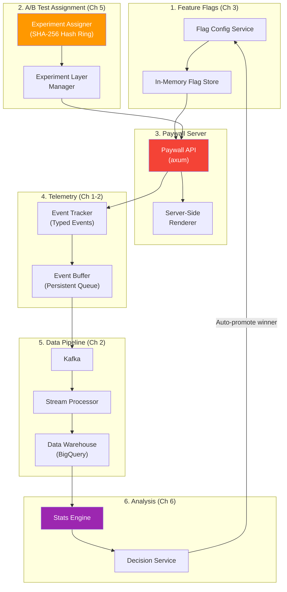
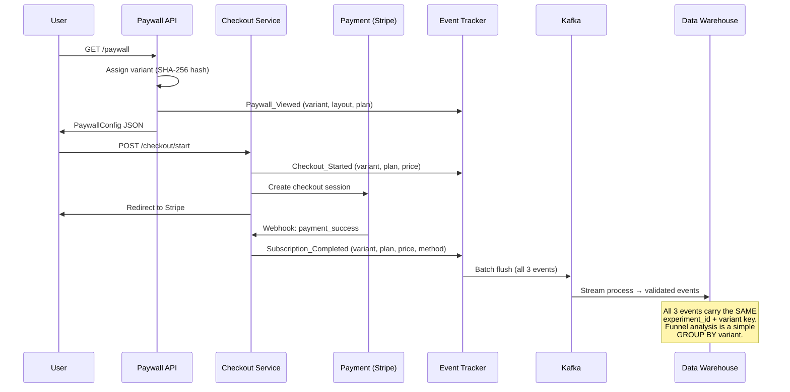
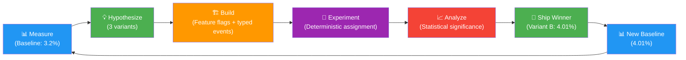

# Capstone: The Dynamic Paywall Engine 🔴

> **What you'll learn:**
> - How to **architect a complete monetization experimentation system** that integrates every concept from the previous six chapters into a production-grade paywall engine.
> - How to build a backend that serves **different paywall UI configurations** based on multivariate feature flags with user-context targeting.
> - How to implement **server-side A/B test assignment** using deterministic hashing, avoiding the flicker effect entirely.
> - How to emit **strictly-typed telemetry events** for the full monetization funnel: `Paywall_Viewed` → `Checkout_Started` → `Subscription_Completed`.
> - How to design the **data pipeline and analysis queries** to calculate statistical significance of the winning paywall variant.

---

## The Business Context

Your company is a B2B SaaS product with a freemium model. The current paywall converts Free users to Pro at **3.2%** (trial start rate). The VP of Revenue wants to know: **can we get that to 4%?**

A 0.8 percentage point improvement (25% relative lift) on a 3.2% baseline, with 5K daily eligible users, would mean **~$1.2M additional ARR** based on your $99/mo Pro plan.

You've been asked to build the infrastructure to test three paywall variants simultaneously, measure their impact with statistical rigor, and automatically promote the winner.

---

## System Architecture

This capstone integrates all four domains:



---

## Step 1: Define the Paywall Variants

We're testing four variants (including control):

| Variant | Layout | Pricing | Hypothesis |
|---------|--------|---------|-----------|
| **Control** | Single plan, Monthly/Annual toggle | $99/mo, $948/yr | Baseline |
| **Variant A** | Annual-only, no monthly option | $79/mo billed annually ($948/yr) | Removing monthly reduces decision paralysis |
| **Variant B** | Three tiers (Starter/Pro/Enterprise) | $49/$99/$249 | Anchoring with Enterprise price lifts Pro conversions |
| **Variant C** | Social proof + urgency | $99/mo with "1,847 teams signed up this month" | Social proof increases trust |

### The Paywall Configuration Type

```rust
use serde::{Deserialize, Serialize};

/// Complete paywall configuration served to the frontend.
/// This is the JSON payload returned by the Paywall API.
#[derive(Debug, Clone, Serialize, Deserialize)]
pub struct PaywallConfig {
    /// Which variant this is (for analytics and debugging).
    pub variant_key: String,
    /// Layout template to render.
    pub layout: PaywallLayout,
    /// Plans to display.
    pub plans: Vec<PlanConfig>,
    /// Optional social proof configuration.
    pub social_proof: Option<SocialProofConfig>,
    /// CTA button configuration.
    pub cta: CtaConfig,
}

#[derive(Debug, Clone, Serialize, Deserialize)]
pub enum PaywallLayout {
    /// Single plan with toggle (control).
    SinglePlanToggle,
    /// Single plan, annual only (Variant A).
    SinglePlanAnnual,
    /// Three-tier comparison table (Variant B).
    ThreeTierComparison,
    /// Single plan with social proof (Variant C).
    SinglePlanSocialProof,
}

#[derive(Debug, Clone, Serialize, Deserialize)]
pub struct PlanConfig {
    pub name: String,
    pub monthly_price_cents: Option<u64>,
    pub annual_price_cents: Option<u64>,
    pub highlighted: bool,
    pub features: Vec<String>,
}

#[derive(Debug, Clone, Serialize, Deserialize)]
pub struct SocialProofConfig {
    pub message_template: String,  // "{{count}} teams signed up this month"
    pub count_source: String,       // API endpoint or static value
}

#[derive(Debug, Clone, Serialize, Deserialize)]
pub struct CtaConfig {
    pub text: String,
    pub trial_days: u32,
    pub show_guarantee: bool,
}

// ✅ Variant configurations
pub fn control_config() -> PaywallConfig {
    PaywallConfig {
        variant_key: "control".to_string(),
        layout: PaywallLayout::SinglePlanToggle,
        plans: vec![PlanConfig {
            name: "Pro".to_string(),
            monthly_price_cents: Some(9900),
            annual_price_cents: Some(94800),
            highlighted: true,
            features: vec![
                "Unlimited projects".to_string(),
                "Team collaboration".to_string(),
                "Priority support".to_string(),
                "API access".to_string(),
            ],
        }],
        social_proof: None,
        cta: CtaConfig {
            text: "Start Free Trial".to_string(),
            trial_days: 14,
            show_guarantee: false,
        },
    }
}

pub fn variant_a_config() -> PaywallConfig {
    PaywallConfig {
        variant_key: "variant_a".to_string(),
        layout: PaywallLayout::SinglePlanAnnual,
        plans: vec![PlanConfig {
            name: "Pro".to_string(),
            monthly_price_cents: None,  // ✅ No monthly option
            annual_price_cents: Some(94800), // $79/mo billed annually
            highlighted: true,
            features: vec![
                "Unlimited projects".to_string(),
                "Team collaboration".to_string(),
                "Priority support".to_string(),
                "API access".to_string(),
            ],
        }],
        social_proof: None,
        cta: CtaConfig {
            text: "Start Free Trial — $79/mo".to_string(),
            trial_days: 14,
            show_guarantee: true,
        },
    }
}

pub fn variant_b_config() -> PaywallConfig {
    PaywallConfig {
        variant_key: "variant_b".to_string(),
        layout: PaywallLayout::ThreeTierComparison,
        plans: vec![
            PlanConfig {
                name: "Starter".to_string(),
                monthly_price_cents: Some(4900),
                annual_price_cents: Some(47000),
                highlighted: false,
                features: vec![
                    "5 projects".to_string(),
                    "Basic support".to_string(),
                ],
            },
            PlanConfig {
                name: "Pro".to_string(),
                monthly_price_cents: Some(9900),
                annual_price_cents: Some(94800),
                highlighted: true, // ✅ Visual emphasis on Pro
                features: vec![
                    "Unlimited projects".to_string(),
                    "Team collaboration".to_string(),
                    "Priority support".to_string(),
                    "API access".to_string(),
                ],
            },
            PlanConfig {
                name: "Enterprise".to_string(),
                monthly_price_cents: Some(24900),
                annual_price_cents: Some(239000),
                highlighted: false,
                features: vec![
                    "Everything in Pro".to_string(),
                    "SSO / SAML".to_string(),
                    "Dedicated account manager".to_string(),
                    "Custom SLA".to_string(),
                ],
            },
        ],
        social_proof: None,
        cta: CtaConfig {
            text: "Start Free Trial".to_string(),
            trial_days: 14,
            show_guarantee: false,
        },
    }
}

pub fn variant_c_config() -> PaywallConfig {
    PaywallConfig {
        variant_key: "variant_c".to_string(),
        layout: PaywallLayout::SinglePlanSocialProof,
        plans: vec![PlanConfig {
            name: "Pro".to_string(),
            monthly_price_cents: Some(9900),
            annual_price_cents: Some(94800),
            highlighted: true,
            features: vec![
                "Unlimited projects".to_string(),
                "Team collaboration".to_string(),
                "Priority support".to_string(),
                "API access".to_string(),
            ],
        }],
        social_proof: Some(SocialProofConfig {
            message_template: "{{count}} teams signed up this month".to_string(),
            count_source: "monthly_signup_count".to_string(),
        }),
        cta: CtaConfig {
            text: "Join Them — Start Free Trial".to_string(),
            trial_days: 14,
            show_guarantee: true,
        },
    }
}
```

---

## Step 2: Server-Side A/B Test Assignment

The paywall API assigns users to variants server-side and returns the pre-rendered configuration. Zero flicker.

```rust
use axum::{
    extract::{Extension, Json},
    http::StatusCode,
    response::IntoResponse,
    routing::get,
    Router,
};
use std::sync::Arc;

/// The paywall API endpoint.
/// Assigns the user to a variant and returns the paywall configuration.
pub async fn get_paywall(
    user: AuthenticatedUser,
    flag_store: Extension<Arc<FlagStore>>,
    tracker: Extension<Arc<EventTracker>>,
) -> impl IntoResponse {
    let context = EvaluationContext {
        user_id: user.id.clone(),
        anonymous_id: None,
        email: user.email.clone(),
        country: user.country.clone(),
        platform: user.platform.clone(),
        app_version: None,
        plan_type: Some(user.plan_type.clone()),
        custom: std::collections::HashMap::new(),
    };

    // ✅ Step 1: Assign variant using deterministic hashing
    let variant_key = ExperimentAssigner::assign(
        "paywall_experiment_2024q2",
        &user.id,
        &[
            ("control", 0.25),
            ("variant_a", 0.25),
            ("variant_b", 0.25),
            ("variant_c", 0.25),
        ],
    );

    // ✅ Step 2: Get the paywall configuration for this variant
    let config = match variant_key.as_str() {
        "variant_a" => variant_a_config(),
        "variant_b" => variant_b_config(),
        "variant_c" => variant_c_config(),
        _ => control_config(),
    };

    // ✅ Step 3: Log the exposure event (user is about to SEE this variant)
    tracker.track(
        PaywallViewed::EVENT_NAME,
        &PaywallViewedPayload {
            experiment_id: "paywall_experiment_2024q2".to_string(),
            variant: variant_key.clone(),
            plan_shown: config.plans.iter()
                .find(|p| p.highlighted)
                .map(|p| p.name.clone())
                .unwrap_or_default(),
            layout: format!("{:?}", config.layout),
            user_plan: user.plan_type.clone(),
        },
    );

    (StatusCode::OK, Json(config))
}

// ✅ Strictly-typed telemetry events for the monetization funnel

#[derive(Debug, Serialize)]
pub struct PaywallViewedPayload {
    pub experiment_id: String,
    pub variant: String,
    pub plan_shown: String,
    pub layout: String,
    pub user_plan: String,
}

impl PaywallViewedPayload {
    pub const EVENT_NAME: &'static str = "Paywall_Viewed";
}

#[derive(Debug, Serialize)]
pub struct CheckoutStartedPayload {
    pub experiment_id: String,
    pub variant: String,
    pub plan_type: String,
    pub price_cents: u64,
    pub currency: String,
    pub billing_interval: String,
    pub paywall_variant: String,
}

impl CheckoutStartedPayload {
    pub const EVENT_NAME: &'static str = "Checkout_Started";
}

#[derive(Debug, Serialize)]
pub struct SubscriptionCompletedPayload {
    pub experiment_id: String,
    pub variant: String,
    pub plan_type: String,
    pub price_cents: u64,
    pub currency: String,
    pub billing_interval: String,
    pub payment_method: String,
    pub trial_days: u32,
    pub paywall_variant: String,
}

impl SubscriptionCompletedPayload {
    pub const EVENT_NAME: &'static str = "Subscription_Completed";
}

/// Called when the user clicks "Start Free Trial" on the paywall.
pub async fn start_checkout(
    user: AuthenticatedUser,
    Json(checkout_req): Json<CheckoutRequest>,
    tracker: Extension<Arc<EventTracker>>,
) -> impl IntoResponse {
    // ✅ Re-derive the variant (deterministic — same result as get_paywall)
    let variant_key = ExperimentAssigner::assign(
        "paywall_experiment_2024q2",
        &user.id,
        &[
            ("control", 0.25),
            ("variant_a", 0.25),
            ("variant_b", 0.25),
            ("variant_c", 0.25),
        ],
    );

    tracker.track(
        CheckoutStartedPayload::EVENT_NAME,
        &CheckoutStartedPayload {
            experiment_id: "paywall_experiment_2024q2".to_string(),
            variant: variant_key.clone(),
            plan_type: checkout_req.plan_type.clone(),
            price_cents: checkout_req.price_cents,
            currency: "USD".to_string(),
            billing_interval: checkout_req.billing_interval.clone(),
            paywall_variant: variant_key,
        },
    );

    // Proceed to create Stripe/Adyen checkout session...
    StatusCode::OK
}

/// Called by the payment webhook when payment succeeds.
pub async fn handle_subscription_webhook(
    Json(webhook): Json<PaymentWebhook>,
    tracker: Extension<Arc<EventTracker>>,
) -> impl IntoResponse {
    let user_id = &webhook.customer_id;

    // ✅ Re-derive the variant from the user_id (deterministic)
    let variant_key = ExperimentAssigner::assign(
        "paywall_experiment_2024q2",
        user_id,
        &[
            ("control", 0.25),
            ("variant_a", 0.25),
            ("variant_b", 0.25),
            ("variant_c", 0.25),
        ],
    );

    // ✅ Server-side event — not dependent on client SDK
    tracker.track(
        SubscriptionCompletedPayload::EVENT_NAME,
        &SubscriptionCompletedPayload {
            experiment_id: "paywall_experiment_2024q2".to_string(),
            variant: variant_key.clone(),
            plan_type: webhook.plan_type.clone(),
            price_cents: webhook.amount_cents,
            currency: webhook.currency.clone(),
            billing_interval: webhook.interval.clone(),
            payment_method: webhook.payment_method.clone(),
            trial_days: webhook.trial_days,
            paywall_variant: variant_key,
        },
    );

    StatusCode::OK
}

#[derive(Deserialize)]
pub struct CheckoutRequest {
    pub plan_type: String,
    pub price_cents: u64,
    pub billing_interval: String,
}

#[derive(Deserialize)]
pub struct PaymentWebhook {
    pub customer_id: String,
    pub plan_type: String,
    pub amount_cents: u64,
    pub currency: String,
    pub interval: String,
    pub payment_method: String,
    pub trial_days: u32,
}

pub struct AuthenticatedUser {
    pub id: String,
    pub email: Option<String>,
    pub country: Option<String>,
    pub platform: Option<String>,
    pub plan_type: String,
}

// Type aliases to refer to types from previous chapters
pub struct PaywallViewed;
impl PaywallViewed { pub const EVENT_NAME: &'static str = "Paywall_Viewed"; }
```

---

## Step 3: The Monetization Funnel Events

The complete event flow for a single user converting:



---

## Step 4: Analysis Queries

### Funnel Conversion by Variant

```sql
-- ✅ Primary analysis: Conversion rate by variant through the full funnel
WITH paywall_views AS (
    SELECT DISTINCT
        user_id,
        JSON_EXTRACT_SCALAR(payload, '$.variant') as variant
    FROM `analytics.events_validated`
    WHERE event_name = 'Paywall_Viewed'
      AND JSON_EXTRACT_SCALAR(payload, '$.experiment_id') = 'paywall_experiment_2024q2'
      AND DATE(server_timestamp) BETWEEN '2024-04-01' AND '2024-04-28'
),
checkout_starts AS (
    SELECT DISTINCT user_id
    FROM `analytics.events_validated`
    WHERE event_name = 'Checkout_Started'
      AND JSON_EXTRACT_SCALAR(payload, '$.experiment_id') = 'paywall_experiment_2024q2'
),
subscriptions AS (
    SELECT DISTINCT user_id
    FROM `analytics.events_validated`
    WHERE event_name = 'Subscription_Completed'
      AND JSON_EXTRACT_SCALAR(payload, '$.experiment_id') = 'paywall_experiment_2024q2'
)
SELECT
    pv.variant,
    COUNT(DISTINCT pv.user_id) as paywall_views,
    COUNT(DISTINCT cs.user_id) as checkout_starts,
    COUNT(DISTINCT s.user_id) as subscriptions,
    
    -- Funnel rates
    SAFE_DIVIDE(COUNT(DISTINCT cs.user_id), COUNT(DISTINCT pv.user_id)) 
        as view_to_checkout_rate,
    SAFE_DIVIDE(COUNT(DISTINCT s.user_id), COUNT(DISTINCT cs.user_id)) 
        as checkout_to_subscription_rate,
    SAFE_DIVIDE(COUNT(DISTINCT s.user_id), COUNT(DISTINCT pv.user_id)) 
        as overall_conversion_rate

FROM paywall_views pv
LEFT JOIN checkout_starts cs ON pv.user_id = cs.user_id
LEFT JOIN subscriptions s ON pv.user_id = s.user_id
GROUP BY pv.variant
ORDER BY overall_conversion_rate DESC;
```

**Expected output:**

| variant | paywall_views | checkout_starts | subscriptions | view→checkout | checkout→sub | overall |
|---------|-------------|----------------|---------------|--------------|-------------|---------|
| variant_b | 5,012 | 583 | 201 | 11.6% | 34.5% | **4.01%** |
| variant_c | 4,987 | 521 | 178 | 10.4% | 34.2% | 3.57% |
| control | 5,023 | 470 | 161 | 9.4% | 34.3% | 3.21% |
| variant_a | 4,978 | 412 | 148 | 8.3% | 35.9% | 2.97% |

### Statistical Significance Test

```sql
-- ✅ Calculate z-statistic and p-value for each variant vs. control
WITH variant_stats AS (
    SELECT
        variant,
        COUNT(DISTINCT user_id) as n,
        SUM(CASE WHEN converted THEN 1 ELSE 0 END) as conversions,
        AVG(CASE WHEN converted THEN 1.0 ELSE 0.0 END) as rate
    FROM experiment_results
    WHERE experiment_id = 'paywall_experiment_2024q2'
    GROUP BY variant
),
control AS (
    SELECT n, conversions, rate FROM variant_stats WHERE variant = 'control'
)
SELECT
    t.variant,
    t.n as treatment_n,
    t.rate as treatment_rate,
    c.rate as control_rate,
    t.rate - c.rate as absolute_lift,
    (t.rate - c.rate) / c.rate as relative_lift,
    
    -- Z-statistic for two-proportion test
    (t.rate - c.rate) / SQRT(
        ((t.rate * t.n + c.rate * c.n) / (t.n + c.n))
        * (1 - (t.rate * t.n + c.rate * c.n) / (t.n + c.n))
        * (1.0/t.n + 1.0/c.n)
    ) as z_statistic

FROM variant_stats t
CROSS JOIN control c
WHERE t.variant != 'control'
ORDER BY z_statistic DESC;
```

### Revenue Impact Calculation

```sql
-- ✅ Calculate revenue impact if we ship the winning variant
WITH winner AS (
    SELECT 
        'variant_b' as variant,
        0.0401 as treatment_rate,
        0.0321 as control_rate
)
SELECT
    variant,
    treatment_rate,
    control_rate,
    treatment_rate - control_rate as absolute_lift,
    (treatment_rate - control_rate) / control_rate as relative_lift,
    
    -- Revenue projection
    -- Assumptions: 150K eligible users/month, $99/mo ARPU
    (treatment_rate - control_rate) * 150000 * 99 * 12 as annual_revenue_impact_usd

FROM winner;

-- Result:
-- annual_revenue_impact_usd = (0.0401 - 0.0321) * 150000 * 99 * 12
--                           = 0.008 * 150000 * 99 * 12
--                           = $1,425,600/year
```

---

## Step 5: The Auto-Decision Pipeline

```rust
/// Automated experiment decision engine.
/// Runs daily, checks if experiments have reached significance,
/// and automatically promotes winners.
pub async fn run_experiment_decisions(
    experiments: &[ExperimentDefinition],
    warehouse: &dyn WarehouseClient,
    flag_service: &dyn FlagServiceMut,
    alerter: &dyn Alerter,
) {
    for experiment in experiments {
        if !matches!(experiment.status, ExperimentStatus::Running) {
            continue;
        }

        // Fetch data from warehouse
        let data = warehouse
            .query_experiment_results(&experiment.id)
            .await;

        // Check if we have enough sample
        let min_variant_size = data.variants.iter()
            .map(|v| v.sample_size)
            .min()
            .unwrap_or(0);

        if min_variant_size < experiment.min_sample_size {
            tracing::info!(
                experiment = %experiment.id,
                current = min_variant_size,
                required = experiment.min_sample_size,
                "Experiment still collecting data"
            );
            continue;
        }

        // Run statistical analysis
        let control_data = &data.variants.iter()
            .find(|v| v.is_control)
            .expect("Every experiment must have a control");

        for treatment in data.variants.iter().filter(|v| !v.is_control) {
            let z_stat = compute_z_statistic(
                control_data.conversion_rate,
                control_data.sample_size,
                treatment.conversion_rate,
                treatment.sample_size,
            );

            let p_value = 2.0 * (1.0 - normal_cdf(z_stat.abs()));

            tracing::info!(
                experiment = %experiment.id,
                variant = %treatment.variant_key,
                control_rate = control_data.conversion_rate,
                treatment_rate = treatment.conversion_rate,
                p_value = p_value,
                "Analysis result"
            );

            if p_value < 0.05 && treatment.conversion_rate > control_data.conversion_rate {
                // ✅ Winner found! Promote to 100% rollout.
                alerter.send_alert(
                    AlertSeverity::Warning,
                    &format!(
                        "🎉 Experiment {} has a winner: {} (p={:.4}, +{:.1}% lift)",
                        experiment.id,
                        treatment.variant_key,
                        p_value,
                        (treatment.conversion_rate - control_data.conversion_rate)
                            / control_data.conversion_rate * 100.0,
                    ),
                ).await;

                // Update flag to serve only the winning variant
                flag_service.update_flag(
                    &experiment.id,
                    &treatment.variant_key,
                ).await;
            }
        }
    }
}

fn compute_z_statistic(p1: f64, n1: u64, p2: f64, n2: u64) -> f64 {
    let pooled = (p1 * n1 as f64 + p2 * n2 as f64) / (n1 + n2) as f64;
    let se = (pooled * (1.0 - pooled) * (1.0 / n1 as f64 + 1.0 / n2 as f64)).sqrt();
    if se > 0.0 { (p2 - p1) / se } else { 0.0 }
}

#[async_trait::async_trait]
trait WarehouseClient: Send + Sync {
    async fn query_experiment_results(&self, experiment_id: &str) -> ExperimentData;
}

struct ExperimentData {
    variants: Vec<VariantData>,
}

struct VariantData {
    variant_key: String,
    is_control: bool,
    sample_size: u64,
    conversion_rate: f64,
}

#[async_trait::async_trait]
trait FlagServiceMut: Send + Sync {
    async fn update_flag(&self, flag_key: &str, winning_variant: &str);
}
```

---

## The Complete Growth Loop

With the paywall experiment running, we've closed the loop that defines growth engineering:



**This is the growth engineering flywheel.** Every shipped experiment creates a new baseline for the next experiment. Compounding 5-10% improvements per quarter is how companies go from $10M to $100M ARR.

---

<details>
<summary><strong>🏋️ Exercise: Extend the Paywall Engine with a Viral Growth Loop</strong> (click to expand)</summary>

### The Challenge

The VP of Revenue loved the paywall experiment results. Now they want to add a **viral growth loop**: after a user subscribes, show them an "Invite 3 colleagues, get 1 month free" offer.

Your task:

1. **Design the event schema** for the viral loop funnel:
   - `Referral_Offer_Viewed` — User saw the offer post-checkout
   - `Referral_Invite_Sent` — User sent an invite
   - `Referral_Invite_Accepted` — Invited user signed up
   - `Referral_Reward_Earned` — Referrer earned the free month

2. **Design the A/B test** for two referral offer variants:
   - **Control**: "Invite 3 colleagues, get 1 month free"
   - **Treatment**: "Invite 1 colleague, get 2 weeks free" (lower threshold, lower reward)

3. **Define the primary metric** and calculate the required sample size.

4. **Write the SQL query** that computes the **viral coefficient (k-factor)** per variant:
   $k = \text{invites per user} \times \text{acceptance rate}$

<details>
<summary>🔑 Solution</summary>

```rust
// ✅ 1. Viral Loop Event Schema

define_event!(ReferralOfferViewed, "Referral_Offer_Viewed", {
    experiment_id: String,
    variant: String,
    offer_type: ReferralOfferType,
    user_subscription_plan: String,
    seconds_since_subscription: u64,
});

#[derive(Debug, Serialize)]
pub enum ReferralOfferType {
    ThreeForOneMonth,     // Control
    OneForTwoWeeks,       // Treatment
}

define_event!(ReferralInviteSent, "Referral_Invite_Sent", {
    experiment_id: String,
    variant: String,
    invite_method: InviteMethod,
    invite_sequence_number: u32,   // 1st, 2nd, 3rd invite
    referrer_user_id: String,
});

define_event!(ReferralInviteAccepted, "Referral_Invite_Accepted", {
    experiment_id: String,
    variant: String,
    referrer_user_id: String,
    referee_user_id: String,
    days_since_invite_sent: u32,
});

define_event!(ReferralRewardEarned, "Referral_Reward_Earned", {
    experiment_id: String,
    variant: String,
    referrer_user_id: String,
    reward_type: String,           // "1_month_free" or "2_weeks_free"
    reward_value_cents: u64,
    total_accepted_referrals: u32,
});
```

```rust
// ✅ 2. Experiment Definition

let referral_experiment = ExperimentDefinition {
    id: "referral_offer_2024q2".to_string(),
    name: "Referral Offer: Low Threshold vs High Reward".to_string(),
    hypothesis: "A lower invitation threshold (1 vs 3) will increase \
                 participation rate enough to offset the lower individual reward, \
                 resulting in a higher overall viral coefficient.".to_string(),
    primary_metric: "viral_coefficient_k".to_string(),
    secondary_metrics: vec![
        "referral_participation_rate".to_string(),      // % of subscribers who send ≥1 invite
        "invites_per_participant".to_string(),           // avg invites among participants
        "invite_acceptance_rate".to_string(),            // % of invites that convert
        "net_revenue_impact".to_string(),                // new revenue - reward cost
    ],
    guardrail_metrics: vec![
        GuardrailMetric {
            metric: "reward_cost_per_acquisition".to_string(),
            direction: GuardrailDirection::LowerIsBetter,
            max_degradation: 0.20, // Don't let CPA increase by >20%
        },
    ],
    variants: vec![
        VariantDefinition {
            key: "control".to_string(),
            name: "Invite 3, Get 1 Month Free".to_string(),
            percentage: 0.5,
            is_control: true,
        },
        VariantDefinition {
            key: "treatment".to_string(),
            name: "Invite 1, Get 2 Weeks Free".to_string(),
            percentage: 0.5,
            is_control: false,
        },
    ],
    min_sample_size: 5_000, // See calculation below
    planned_duration_days: 42, // 6 weeks (referrals take time)
    // ...
    status: ExperimentStatus::Draft,
    targeting: ExperimentTargeting {
        conditions: vec![
            TargetingCondition {
                attribute: "plan_type".to_string(),
                operator: "eq".to_string(),
                values: vec![serde_json::json!("pro")],
            },
        ],
        mutex_experiments: vec![],
    },
    salt: "referral_offer_2024q2".to_string(),
    created_at: chrono::Utc::now(),
    started_at: None,
    ended_at: None,
};
```

```rust
// ✅ 3. Sample Size Calculation
//
// Primary metric: viral coefficient (k-factor)
// This is a continuous metric, not a proportion, so we use a t-test formula.
//
// Baseline k-factor (estimated): 0.15 (each user brings 0.15 new users)
// MDE: 30% relative improvement (0.15 → 0.195)
// Absolute MDE: 0.045
// Estimated std dev of k: ~0.4 (high variance — most users invite 0)
//
// n = (Z_α/2 + Z_β)² × 2σ² / δ²
// n = (1.96 + 0.84)² × 2(0.4²) / (0.045²)
// n = 7.84 × 0.32 / 0.002025
// n ≈ 1,238 per variant
//
// But: referral loops take weeks to complete.
// We need users who subscribed at least 4 weeks ago.
// Accounting for the lag: target 5,000 per variant to be safe.
//
// At ~200 new subscribers/day: 5K per variant × 2 = 10K total
// ≈ 50 days of subscriptions × 4 weeks lag = ~14 weeks total
// Practical decision: Run for 6 weeks, analyze users from the first 2 weeks
// who have had 4+ weeks to complete the referral loop.
```

```sql
-- ✅ 4. Viral Coefficient (k-factor) by Variant

WITH referrers AS (
    -- Users who saw the referral offer (our denominator)
    SELECT DISTINCT
        user_id,
        JSON_EXTRACT_SCALAR(payload, '$.variant') as variant
    FROM `analytics.events_validated`
    WHERE event_name = 'Referral_Offer_Viewed'
      AND JSON_EXTRACT_SCALAR(payload, '$.experiment_id') = 'referral_offer_2024q2'
),
invites AS (
    -- Count invites sent per user
    SELECT
        JSON_EXTRACT_SCALAR(payload, '$.referrer_user_id') as user_id,
        COUNT(*) as invites_sent
    FROM `analytics.events_validated`
    WHERE event_name = 'Referral_Invite_Sent'
      AND JSON_EXTRACT_SCALAR(payload, '$.experiment_id') = 'referral_offer_2024q2'
    GROUP BY 1
),
acceptances AS (
    -- Count accepted invites per referrer
    SELECT
        JSON_EXTRACT_SCALAR(payload, '$.referrer_user_id') as user_id,
        COUNT(DISTINCT JSON_EXTRACT_SCALAR(payload, '$.referee_user_id')) as accepted
    FROM `analytics.events_validated`
    WHERE event_name = 'Referral_Invite_Accepted'
      AND JSON_EXTRACT_SCALAR(payload, '$.experiment_id') = 'referral_offer_2024q2'
    GROUP BY 1
)
SELECT
    r.variant,
    COUNT(DISTINCT r.user_id) as total_users,
    
    -- Participation rate: % who sent at least 1 invite
    COUNT(DISTINCT i.user_id) * 1.0 / COUNT(DISTINCT r.user_id) 
        as participation_rate,
    
    -- Average invites per participant (among those who participated)
    AVG(CASE WHEN i.invites_sent > 0 THEN i.invites_sent END) 
        as avg_invites_per_participant,
    
    -- Average invites per user (across ALL users, including non-participants)
    COALESCE(SUM(i.invites_sent), 0) * 1.0 / COUNT(DISTINCT r.user_id) 
        as avg_invites_per_user,
    
    -- Acceptance rate: % of invites that were accepted
    SAFE_DIVIDE(
        COALESCE(SUM(a.accepted), 0),
        COALESCE(SUM(i.invites_sent), 0)
    ) as invite_acceptance_rate,
    
    -- ✅ VIRAL COEFFICIENT (k-factor)
    -- k = invites_per_user × acceptance_rate
    (COALESCE(SUM(i.invites_sent), 0) * 1.0 / COUNT(DISTINCT r.user_id))
    * SAFE_DIVIDE(COALESCE(SUM(a.accepted), 0), COALESCE(SUM(i.invites_sent), 0))
        as k_factor

FROM referrers r
LEFT JOIN invites i ON r.user_id = i.user_id
LEFT JOIN acceptances a ON r.user_id = a.user_id
GROUP BY r.variant
ORDER BY k_factor DESC;

-- ✅ Expected results:
-- 
-- | variant   | users | participation | avg_invites | acceptance | k_factor |
-- |-----------|-------|--------------|-------------|------------|----------|
-- | treatment | 5,100 | 34.2%        | 1.8         | 28.3%      | 0.174    |
-- | control   | 5,050 | 18.7%        | 3.4         | 25.1%      | 0.160    |
--
-- Treatment wins: Lower threshold (1 invite) nearly doubled participation (34% vs 19%)
-- even though avg invites dropped. The net k-factor is 8.7% better.
-- But check: is the net revenue impact positive?
-- Treatment reward cost: 5,100 × 0.342 × $49.50 = $86,358
-- Control reward cost:   5,050 × 0.187 × $99.00 = $93,462
-- Treatment has LOWER reward cost AND higher k-factor. Clear winner.
```

**The viral growth loop as a system:**

```
User subscribes
    → Sees referral offer (variant A or B)
    → Sends invites (0 to N)
    → Some invites are accepted (new users!)
    → New users enter the funnel
    → Some new users subscribe
    → They see the referral offer...
    → (Loop continues)

k < 1.0: Loop decays (each generation is smaller)
k = 1.0: Sustainable (each user brings exactly one new user)
k > 1.0: VIRAL GROWTH (exponential — extremely rare in B2B)
```

</details>
</details>

---

> **Key Takeaways**
>
> 1. **The paywall engine integrates every system covered in this book.** Feature flags serve variant configs, deterministic hashing assigns users, typed events track the funnel, the pipeline validates data, and the stats engine declares winners.
> 2. **Server-side assignment eliminates the flicker effect.** The paywall API returns the correct configuration for each user — no client-side switching. The variant is determined before any HTML is rendered.
> 3. **Track intent on the client, outcomes on the server.** `Paywall_Viewed` and `Checkout_Started` fire client-side. `Subscription_Completed` fires from the payment webhook — the only source of truth for revenue.
> 4. **Every event carries the experiment context.** The `variant` field on every event enables a simple `GROUP BY variant` to compute funnel conversion rates and statistical significance.
> 5. **The growth flywheel never stops.** Shipping the winning variant creates a new baseline. The next experiment starts from 4.01%, aiming for 4.5%. Compounding wins is how growth engineering creates exponential business value.

---

> **See also:**
> - [Chapter 1: Event-Driven Analytics](ch01-event-driven-analytics.md) — The event schema that powers the monetization funnel.
> - [Chapter 3: Feature Flags Architecture](ch03-feature-flags-architecture.md) — The flag evaluation engine serving paywall variants.
> - [Chapter 5: A/B Testing Infrastructure](ch05-ab-testing-infrastructure.md) — The assignment system that ensures deterministic user bucketing.
> - [Chapter 6: Statistical Significance and Pitfalls](ch06-statistical-significance-and-pitfalls.md) — The analysis framework applied to experiment results.
