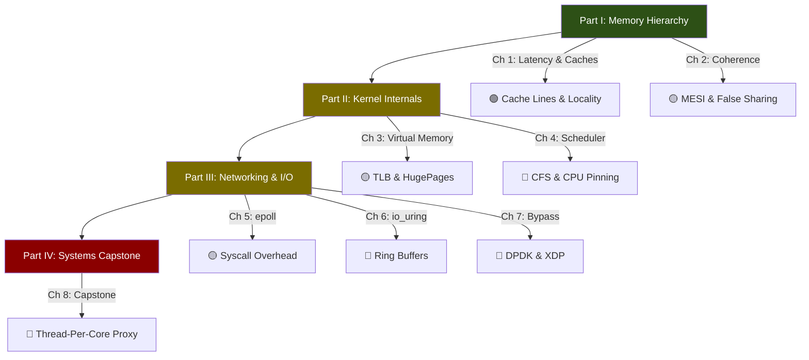

# Hardcore Hardware Sympathy: OS Internals and Silicon-Aware Engineering

## Speaker Intro

I've spent two decades at the boundary where software meets silicon — contributing patches to the Linux kernel scheduler, building matching engines for electronic exchanges where a microsecond of regression costs millions, and designing database storage engines that must sustain millions of IOPS on commodity hardware. I've measured cache-line bouncing in production at 3 AM, traced TLB shootdowns that doubled tail latency, and rewritten hot paths in assembly when the compiler couldn't see what I could.

This book distills those lessons. It is the guide I wish someone had handed me on day one: a systematic, measurement-driven walkthrough of the hardware and OS internals that sit between your code and the transistors that execute it.

## Who This Is For

- **Senior / Staff engineers** who have exhausted algorithmic improvements and need to understand *why* their code is memory-bound, not compute-bound.
- **Systems programmers** writing databases, proxies, game engines, or trading systems where every microsecond matters.
- **Performance engineers** who use `perf stat` and flamegraphs but want deeper mental models of what the hardware is actually doing.
- **Rust developers** who want to leverage Rust's zero-cost abstractions *and* hardware-level control (cache-line alignment, NUMA-aware allocation, `io_uring` integration) to write code that is not just safe, but *fast*.

This is **not** a beginner's programming course. You should already be comfortable writing multithreaded code in C, C++, or Rust and have a basic understanding of how a CPU executes instructions.

## Prerequisites

| Concept | Where to Learn |
|---|---|
| Systems programming in C/C++ or Rust | [Rust for C/C++ Programmers](../c-cpp-book/src/SUMMARY.md) |
| Multithreading (mutexes, atomics) | [Concurrency in Rust](../concurrency-book/src/SUMMARY.md) |
| Basic computer architecture (registers, RAM, instructions) | Patterson & Hennessy: *Computer Organization and Design* |
| Linux command line (`perf`, `strace`, `taskset`) | [Rust Ecosystem, Tooling & Profiling](../tooling-profiling-book/src/SUMMARY.md) |
| Async I/O fundamentals | [Async Rust](../async-book/src/SUMMARY.md) |

## How to Use This Book

| Emoji | Meaning |
|-------|---------|
| 🟢 | **Systems Foundational** — Core mental models everyone needs |
| 🟡 | **Kernel Applied** — OS internals that affect real workloads |
| 🔴 | **Hardware / Silicon-Level** — Deep internals, kernel bypass, capstone design |

Read sequentially for the full experience. Each chapter builds on the previous one. If you're in a hurry:

- **Cache crash course:** Chapters 1–2
- **Kernel internals sprint:** Chapters 3–4
- **I/O deep dive:** Chapters 5–7
- **Full capstone:** Chapter 8 (requires all prior chapters)

## Pacing Guide

| Chapters | Topic | Time | Checkpoint |
|---|---|---|---|
| Introduction | Orientation & goals | 30 min | Understand the latency hierarchy |
| Ch 1–2 | Memory hierarchy, caches, false sharing | 6–8 hours | Can explain MESI and pad a struct to avoid false sharing |
| Ch 3–4 | Virtual memory, TLB, scheduler, CPU pinning | 6–8 hours | Can use `perf stat` to measure TLB misses and context switches |
| Ch 5–6 | `epoll` limitations, `io_uring` architecture | 6–8 hours | Can write an `io_uring` echo server in Rust |
| Ch 7 | Kernel bypass (DPDK, XDP) | 4–6 hours | Understand when and why to bypass the kernel |
| Ch 8 | Capstone: thread-per-core proxy | 8–10 hours | Can architect a shared-nothing proxy on a whiteboard |
| Appendix | Reference card | — | Quick-reference for interviews and production tuning |

**Total: ~35–45 hours** of focused study.

## Table of Contents

### Part I: The Memory Hierarchy (Feeding the Beast)

1. **Latency Numbers and CPU Caches 🟢** — Why main memory is 200× slower than L1. Cache lines, spatial locality, temporal locality, and the numbers every systems programmer should know by heart.
2. **Cache Coherence and False Sharing 🟡** — The MESI protocol that keeps caches consistent across cores. How two threads touching *different* variables can destroy throughput by sharing a cache line, and how to fix it with alignment.

### Part II: Linux Kernel Internals

3. **Virtual Memory and the TLB 🟡** — Page tables, page faults (minor vs. major), and the Translation Lookaside Buffer. How Transparent HugePages reduce TLB pressure for large-memory workloads.
4. **The Scheduler and Context Switching 🔴** — What CFS actually does with your threads. The true cost of a context switch (register save/restore, TLB flush, cache pollution). How to pin threads and isolate CPUs for deterministic latency.

### Part III: High-Performance Networking & I/O

5. **The Limits of `epoll` and Socket Buffers 🟡** — The hidden copy overhead of the POSIX socket API. Why `epoll` is a syscall-per-event model that breaks down at millions of connections.
6. **Asynchronous I/O with `io_uring` 🔴** — Shared-memory ring buffers that eliminate syscalls. Submission Queue / Completion Queue architecture. Zero-copy reads and writes.
7. **Kernel Bypass — DPDK and XDP 🔴** — When even `io_uring` is too slow. Polling the NIC directly from user-space. eBPF / XDP for programmable packet processing without leaving the kernel.

### Part IV: The Systems Capstone

8. **Capstone: Architect a Thread-Per-Core Proxy 🔴** — Design a shared-nothing, NUMA-aware, `io_uring`-driven network proxy. A Staff-level system design exercise from blank whiteboard to production architecture.

### Appendices

A. **Summary & Reference Card** — Latency numbers cheat sheet, `perf` / `strace` commands, CPU cache tuning parameters, interview quick-reference.

## Companion Guides

This book is part of the **Hardcore** series. Together they form a complete systems engineering curriculum:

| Book | Focus |
|------|-------|
| **This book** | CPU caches, OS kernel, I/O subsystems |
| [Hardcore Algorithms & Concurrency](../algorithms-concurrency-book/src/SUMMARY.md) | Lock-free data structures, atomics, memory ordering |
| [Hardcore Distributed Systems](../distributed-systems-book/src/SUMMARY.md) | Consensus, replication, transactions at hyper-scale |
| [Hardcore Cloud Native](../cloud-native-book/src/SUMMARY.md) | Kubernetes internals, eBPF, Cilium, multi-region |
| [Hardcore Quantitative Finance](../quant-finance-book/src/SUMMARY.md) | HFT architecture, kernel bypass, NUMA, FPGA |

For Rust-specific deep dives referenced throughout:

- [Rust Memory Management](../memory-management-book/src/SUMMARY.md) — ownership and borrowing
- [Zero-Copy Architecture](../zero-copy-book/src/SUMMARY.md) — `io_uring` and `rkyv` in Rust
- [Tokio Internals](../tokio-internals-book/src/SUMMARY.md) — async runtime under the hood
- [Compiler Optimizations](../compiler-optimizations-book/src/SUMMARY.md) — LLVM, SIMD, PGO
