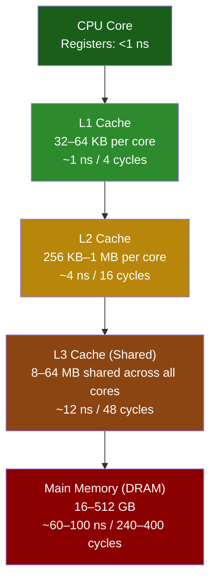

# Chapter 1: Latency Numbers and CPU Caches 🟢

> **What you'll learn:**
> - Why the CPU is *starving* for data — the fundamental speed mismatch between processors and memory.
> - The L1 / L2 / L3 cache hierarchy: sizes, latencies, and sharing topology.
> - Cache lines (64 bytes) and why spatial and temporal locality are the two most important concepts in high-performance computing.
> - The concrete latency numbers every systems programmer should memorize.

---

## First Principles: The Speed of Light Problem

Before we discuss cache hierarchies, we need to understand *why* they exist. It comes down to physics.

An electrical signal travels through copper at roughly **two-thirds the speed of light** — about 20 cm per nanosecond. A modern CPU running at 4 GHz executes one clock cycle every **0.25 ns**. In that time, a signal can travel about **5 cm**.

The problem: main memory (DRAM) sits on a separate chip, centimeters away from the CPU die. Even at the speed of light, a round-trip to DRAM takes time. But it's worse than that — DRAM access isn't just limited by signal propagation. The DRAM controller must:

1. Decode the row/column address.
2. Charge the sense amplifiers.
3. Transfer the data across the memory bus.

Total: **~60–100 ns** for a single random access. At 4 GHz, that's **240–400 wasted clock cycles** where the CPU sits idle, doing *nothing*, waiting for data.

**The cache hierarchy exists to hide this catastrophic latency.**

## The Numbers Every Programmer Should Know

These numbers are approximate for a modern x86-64 server (circa 2024), but the *ratios* have been remarkably stable for decades:

| Operation | Latency | Relative | Cycles @ 4 GHz |
|---|---|---|---|
| **L1 cache hit** | ~1 ns | 1× | 4 |
| **L2 cache hit** | ~4 ns | 4× | 16 |
| **L3 cache hit** | ~12 ns | 12× | 48 |
| **DRAM access** | ~60–100 ns | 60–100× | 240–400 |
| **NVMe SSD random read** | ~10 μs | 10,000× | 40,000 |
| **Network round-trip (same DC)** | ~500 μs | 500,000× | 2,000,000 |
| **HDD seek** | ~5 ms | 5,000,000× | 20,000,000 |

> **The mantra:** An L1 cache hit is **100× faster** than a DRAM access. Every algorithm, every data structure, every layout decision you make should be evaluated through this lens.

## The Cache Hierarchy

Modern CPUs use a three-level cache hierarchy. Each level trades off size for speed:



### L1: The Crown Jewel

- **Size:** 32–64 KB per core (split into L1d for data and L1i for instructions).
- **Latency:** ~1 ns (4 cycles).
- **Per-core, private.** No sharing — no contention.
- **Typical hit rate in well-optimized code:** 95–99%.

L1 is built from **SRAM** (Static RAM) — six transistors per bit, extremely fast, extremely expensive per byte. At 64 KB, L1 is small enough to sit physically adjacent to the execution units on the die.

### L2: The Safety Net

- **Size:** 256 KB–1 MB per core.
- **Latency:** ~4 ns (16 cycles).
- **Per-core, private** (on most modern architectures; some share L2 between a pair of cores).

L2 catches the ~5% of accesses that miss L1. It's still SRAM, just with larger capacity and slightly longer access paths.

### L3: The Last Line of Defense

- **Size:** 8–64 MB, **shared across all cores** on the socket.
- **Latency:** ~12 ns (48 cycles).
- Often organized as a **ring bus** or **mesh interconnect** on the die.

L3 is critical for multi-threaded workloads. When Core 0 writes data that Core 3 needs, the data can be served from L3 instead of round-tripping to DRAM. But L3 is a *shared* resource — contention from other cores can increase effective latency.

### Beyond L3: DRAM

When all three cache levels miss, the request goes to the memory controller, across the memory bus, to the DRAM chips. **60–100 ns.** On a NUMA system (multi-socket), accessing memory on the *remote* socket adds another 40–80 ns.

## Cache Lines: The Unit of Transfer

Caches do not operate on individual bytes. Every transfer between cache levels (and to/from DRAM) happens in units called **cache lines**.

> **On x86-64, a cache line is 64 bytes.**

When you access a single `u64` (8 bytes) at address `0x1000`, the hardware fetches the entire 64-byte block from `0x1000` to `0x103F`. This has profound implications:

### Spatial Locality

If your data is laid out contiguously in memory, accessing one element prefetches its neighbors *for free*. This is why iterating over a `Vec<i32>` is blazing fast — each cache-line fetch brings 16 integers at once.

```rust
// ✅ FAST: Sequential access — perfect spatial locality
fn sum_vec(data: &[i32]) -> i64 {
    let mut total: i64 = 0;
    for &val in data {
        total += val as i64;
    }
    total
}
```

Compare with a linked list, where each node can be *anywhere* in the heap:

```rust
// 💥 SLOW: Pointer chasing — each node may be on a different cache line,
// or worse, a different page. Every access is potentially a full DRAM round-trip.
struct Node {
    value: i32,
    next: Option<Box<Node>>,
}

fn sum_list(head: &Option<Box<Node>>) -> i64 {
    let mut total: i64 = 0;
    let mut current = head;
    while let Some(node) = current {
        total += node.value as i64;
        current = &node.next;
    }
    total
}
```

### Temporal Locality

If you access the same data repeatedly in a short time window, it stays in cache. This is why loop tiling (blocking) transforms exist — they restructure loops to re-use data while it's still hot in L1.

```rust
// 💥 SLOW: Column-major traversal of a row-major matrix.
// Each access in the inner loop jumps `cols` elements forward,
// potentially evicting the cache line before we revisit it.
fn sum_column_major(matrix: &[Vec<f64>]) -> f64 {
    let rows = matrix.len();
    let cols = matrix[0].len();
    let mut sum = 0.0;
    for col in 0..cols {
        for row in 0..rows {
            sum += matrix[row][col]; // 💥 stride = cols * 8 bytes
        }
    }
    sum
}

// ✅ FAST: Row-major traversal. Each row is contiguous in memory.
// After fetching one cache line, we consume all 8 f64 values in it
// before moving to the next line. Perfect spatial + temporal locality.
fn sum_row_major(matrix: &[Vec<f64>]) -> f64 {
    let mut sum = 0.0;
    for row in matrix {
        for &val in row {
            sum += val; // ✅ sequential access
        }
    }
    sum
}
```

## Measuring Cache Behavior: `perf stat`

Theory is nice. **Measurement is everything.** The Linux `perf` tool gives you direct access to hardware performance counters:

```bash
# Count L1 data cache loads and misses for your binary
perf stat -e L1-dcache-loads,L1-dcache-load-misses,LLC-loads,LLC-load-misses ./my_program
```

Example output:

```
 1,200,000,000      L1-dcache-loads
     3,600,000      L1-dcache-load-misses    #    0.30% of all L1-dcache loads
       900,000      LLC-loads
        12,000      LLC-load-misses          #    1.33% of all LLC loads
```

An L1 miss rate of **0.30%** is excellent. If you see L1 miss rates above **5%**, your data layout needs work. If LLC (Last Level Cache, i.e., L3) miss rates are high, you're probably memory-bandwidth-bound.

## The Cache Line in Practice: Structure Layout

Consider a struct that tracks connection state:

```rust
// 💥 PERFORMANCE HAZARD: This struct is 80 bytes — it straddles two cache lines.
// Every access to `last_active` may trigger a second cache-line fetch.
struct ConnectionState {
    id: u64,              // 8 bytes  (offset 0)
    bytes_sent: u64,      // 8 bytes  (offset 8)
    bytes_recv: u64,      // 8 bytes  (offset 16)
    flags: u32,           // 4 bytes  (offset 24)
    padding1: u32,        // 4 bytes  (offset 28) — compiler-inserted
    peer_addr: [u8; 16],  // 16 bytes (offset 32)
    local_addr: [u8; 16], // 16 bytes (offset 48)
    // --- cache line boundary at offset 64 ---
    last_active: u64,     // 8 bytes  (offset 64) 💥 on a SECOND cache line
    timeout_ms: u32,      // 4 bytes  (offset 72)
    _pad: u32,            // 4 bytes  (offset 76)
}
```

```rust
// ✅ FIX: Reorder fields so hot fields cluster within the first 64 bytes.
// Fields accessed together on the hot path come first.
#[repr(C)]
struct ConnectionState {
    // --- Hot fields (checked on every packet) ---
    id: u64,              // 8  (offset 0)
    flags: u32,           // 4  (offset 8)
    timeout_ms: u32,      // 4  (offset 12)
    last_active: u64,     // 8  (offset 16)  ✅ now on the SAME cache line
    bytes_sent: u64,      // 8  (offset 24)
    bytes_recv: u64,      // 8  (offset 32)
    // --- Cold fields (only on connection setup/teardown) ---
    peer_addr: [u8; 16],  // 16 (offset 40)
    local_addr: [u8; 16], // 16 (offset 56)
    // Total: 72 bytes — hot path fits in 1 cache line
}
```

## The Hardware Prefetcher

Modern CPUs have a **hardware prefetcher** that detects sequential and strided access patterns and fetches cache lines *before you ask for them*. This is why `Vec` iteration is so fast — the prefetcher recognizes the pattern and stays ahead of your loop.

**The prefetcher works best with:**
- Sequential access (stride = 1 element).
- Small, predictable strides (e.g., iterating struct fields in an array-of-structs).

**The prefetcher gives up on:**
- Random access (hash tables, pointer chasing).
- Large, irregular strides.
- Code paths that frequently branch to different memory regions.

---

<details>
<summary><strong>🏋️ Exercise: Measure the Cache Hierarchy</strong> (click to expand)</summary>

**Challenge:** Write a Rust program that empirically measures L1, L2, and L3 cache latencies by performing pointer-chasing through arrays of increasing sizes. Use `std::time::Instant` for timing.

**Steps:**
1. Allocate a `Vec<usize>` of size N, where each element contains the index of the next element to visit (a random permutation to defeat the prefetcher).
2. Chase pointers through the array for millions of iterations and measure the average time per access.
3. Run with N = 4 KB, 32 KB, 256 KB, 4 MB, 32 MB, 256 MB.
4. Plot the results — you should see clear latency plateaus corresponding to L1, L2, L3, and DRAM.

<details>
<summary>🔑 Solution</summary>

```rust
use std::time::Instant;

/// Generate a random permutation so each element points to a unique next index.
/// This creates a single cycle through all elements, defeating the prefetcher.
fn generate_chase_array(n: usize) -> Vec<usize> {
    let mut arr: Vec<usize> = (0..n).collect();
    // Fisher–Yates shuffle to create a random cycle
    // We build a cycle: arr[i] = next element to visit
    let mut indices: Vec<usize> = (0..n).collect();
    // Simple LCG for deterministic "randomness"
    let mut rng_state: u64 = 0xDEAD_BEEF_CAFE_BABE;
    for i in (1..n).rev() {
        rng_state = rng_state.wrapping_mul(6364136223846793005).wrapping_add(1);
        let j = (rng_state >> 33) as usize % (i + 1);
        indices.swap(i, j);
    }
    // Build pointer chain: arr[indices[i]] = indices[i+1]
    for i in 0..n {
        arr[indices[i]] = indices[(i + 1) % n];
    }
    arr
}

fn measure_latency(size_bytes: usize) -> f64 {
    let n = size_bytes / std::mem::size_of::<usize>(); // elements
    let arr = generate_chase_array(n);

    let iterations = 10_000_000usize.max(n * 4);
    let mut idx = 0usize;

    // Warm up
    for _ in 0..n {
        idx = arr[idx];
    }

    // Measure
    let start = Instant::now();
    for _ in 0..iterations {
        idx = arr[idx]; // single dependent load — cannot be pipelined
    }
    let elapsed = start.elapsed();

    // Prevent the compiler from optimizing away the loop
    std::hint::black_box(idx);

    elapsed.as_nanos() as f64 / iterations as f64
}

fn main() {
    let sizes = [
        ("4 KB", 4 * 1024),
        ("32 KB", 32 * 1024),
        ("256 KB", 256 * 1024),
        ("1 MB", 1024 * 1024),
        ("4 MB", 4 * 1024 * 1024),
        ("32 MB", 32 * 1024 * 1024),
        ("256 MB", 256 * 1024 * 1024),
    ];

    println!("{:<12} {:>12} {:>8}", "Array Size", "Latency (ns)", "Level");
    println!("{}", "-".repeat(36));

    for (label, bytes) in &sizes {
        let ns = measure_latency(*bytes);
        let level = if ns < 2.0 {
            "L1"
        } else if ns < 6.0 {
            "L2"
        } else if ns < 20.0 {
            "L3"
        } else {
            "DRAM"
        };
        println!("{:<12} {:>10.1} ns {:>8}", label, ns, level);
    }
}
```

**Expected output (varies by hardware):**

```
Array Size    Latency (ns)    Level
------------------------------------
4 KB               1.2 ns       L1
32 KB              1.3 ns       L1
256 KB             4.1 ns       L2
1 MB               4.5 ns       L2
4 MB              11.8 ns       L3
32 MB             12.5 ns       L3
256 MB            68.3 ns     DRAM
```

The key insight: **you can see the cache hierarchy in your measurements.** The sharp jumps in latency at ~32 KB (L1→L2), ~256 KB–1 MB (L2→L3), and ~32 MB+ (L3→DRAM) directly correspond to your CPU's cache sizes. Check yours with:

```bash
lscpu | grep -i cache
# Or:
cat /sys/devices/system/cpu/cpu0/cache/index*/size
```

</details>
</details>

---

> **Key Takeaways**
> - The CPU is **100–400× faster** than main memory. Caches exist to bridge this gap.
> - All data moves through the cache hierarchy in **64-byte cache lines**. Layout your data accordingly.
> - **Spatial locality** (contiguous access) and **temporal locality** (repeated access) are the two pillars of cache-friendly code.
> - Always **measure** with `perf stat` before optimizing. Know your L1/L2/L3 miss rates.
> - Prefer arrays and `Vec` over linked structures. Prefer struct-of-arrays over array-of-structs when fields are accessed independently.

> **See also:**
> - [Chapter 2: Cache Coherence and False Sharing](ch02-cache-coherence-and-false-sharing.md) — what happens when *multiple cores* share caches.
> - [Rust Memory Management](../memory-management-book/src/SUMMARY.md) — ownership, borrowing, and how Rust's move semantics interact with memory layout.
> - [Compiler Optimizations](../compiler-optimizations-book/src/SUMMARY.md) — how LLVM's auto-vectorizer and loop unroller exploit cache-line-sized data.
