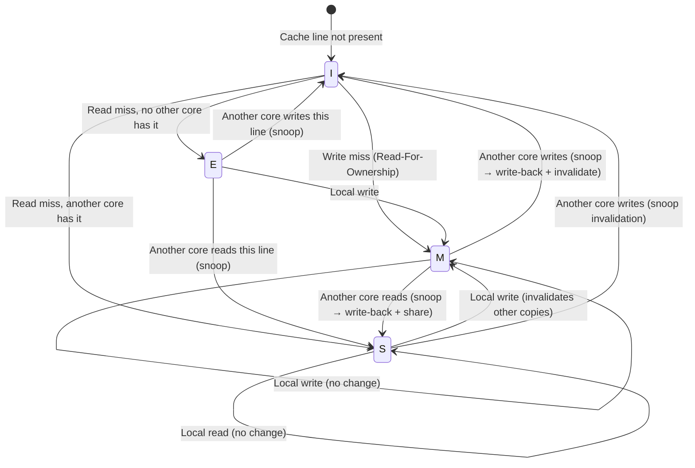

# Chapter 2: Cache Coherence and False Sharing 🟡

> **What you'll learn:**
> - How multi-core CPUs keep their private caches consistent via the **MESI protocol**.
> - What **false sharing** is — and why two threads writing to *completely independent* variables can slow each other down by 10–50×.
> - How to detect false sharing with `perf c2c` and hardware counters.
> - How to fix it using cache-line alignment (`#[repr(align(64))]`) and padding.

---

## The Coherence Problem

In Chapter 1, we learned that L1 and L2 caches are **private to each core**. This creates a fundamental problem: what happens when Core 0 writes to address `X`, and Core 1 has a cached copy of `X`?

Without a coherence protocol, Core 1 would read **stale data**. This is not a theoretical concern — it would make every multithreaded program on the planet incorrect.

The solution is a **cache coherence protocol**. On x86-64 (Intel/AMD), the protocol is called **MESI** (or its extension, **MESIF** on Intel and **MOESI** on AMD).

## The MESI Protocol

Every cache line in every core's L1/L2 cache is in one of four states:

| State | Meaning | Who can read? | Who can write? |
|---|---|---|---|
| **M** (Modified) | This core has written to the line. The copy in DRAM is **stale**. | Only this core | Only this core |
| **E** (Exclusive) | This core has the only cached copy, and it matches DRAM. | Only this core | Only this core (transitions to M) |
| **S** (Shared) | Multiple cores have cached copies. All match DRAM. | Any core with a copy | Nobody (must invalidate others first) |
| **I** (Invalid) | This cache line is empty / stale. | Nobody | Nobody |



### The Cost of Coherence Traffic

When Core 0 wants to **write** to a cache line that Core 1 has in **Shared** state, the following happens:

1. Core 0 sends an **invalidation** message on the bus/interconnect.
2. Core 1 receives the snoop, marks its copy as **Invalid**.
3. Core 1 acknowledges the invalidation.
4. Core 0 transitions the line from **S → M** and performs the write.

This round-trip takes **~40–80 ns** depending on the interconnect — comparable to a DRAM access. If two cores are repeatedly fighting over the same cache line, performance collapses.

## False Sharing: The Silent Killer

False sharing occurs when **two threads access different variables that happen to reside on the same 64-byte cache line**. Each thread's writes invalidate the other's cache, even though they are logically independent.

```rust
use std::sync::Arc;
use std::thread;

// 💥 PERFORMANCE HAZARD: False sharing on the cache line.
// `counter_a` and `counter_b` are 8 bytes apart — they share the same
// 64-byte cache line. Thread A's writes to `counter_a` will invalidate
// Thread B's cached copy of `counter_b`, and vice versa.
struct SharedCounters {
    counter_a: u64,  // offset 0
    counter_b: u64,  // offset 8  💥 same cache line as counter_a!
}

// Safety: we ensure disjoint access
unsafe impl Sync for SharedCounters {}

fn false_sharing_demo() {
    let counters = Arc::new(SharedCounters {
        counter_a: 0,
        counter_b: 0,
    });

    let c1 = counters.clone();
    let c2 = counters.clone();

    let t1 = thread::spawn(move || {
        let ptr = &c1.counter_a as *const u64 as *mut u64;
        for _ in 0..100_000_000 {
            unsafe { *ptr += 1; } // 💥 Every write invalidates core 2's cache line
        }
    });

    let t2 = thread::spawn(move || {
        let ptr = &c2.counter_b as *const u64 as *mut u64;
        for _ in 0..100_000_000 {
            unsafe { *ptr += 1; } // 💥 Every write invalidates core 1's cache line
        }
    });

    t1.join().unwrap();
    t2.join().unwrap();
}
```

### The Fix: Cache-Line Padding

```rust
use std::sync::Arc;
use std::thread;

// ✅ FIX: Padding structs to 64 bytes ensures each counter gets its own cache line.
// Thread A and Thread B never contend on the same line.
#[repr(C, align(64))]  // ✅ Force 64-byte alignment
struct AlignedCounter {
    value: u64,
    _pad: [u8; 56],     // ✅ Pad to exactly 64 bytes
}

struct PaddedCounters {
    counter_a: AlignedCounter,  // offset 0..63   — cache line 0
    counter_b: AlignedCounter,  // offset 64..127 — cache line 1  ✅ separate!
}

unsafe impl Sync for PaddedCounters {}

fn no_false_sharing_demo() {
    let counters = Arc::new(PaddedCounters {
        counter_a: AlignedCounter { value: 0, _pad: [0; 56] },
        counter_b: AlignedCounter { value: 0, _pad: [0; 56] },
    });

    let c1 = counters.clone();
    let c2 = counters.clone();

    let t1 = thread::spawn(move || {
        let ptr = &c1.counter_a.value as *const u64 as *mut u64;
        for _ in 0..100_000_000 {
            unsafe { *ptr += 1; } // ✅ No contention — own cache line
        }
    });

    let t2 = thread::spawn(move || {
        let ptr = &c2.counter_b.value as *const u64 as *mut u64;
        for _ in 0..100_000_000 {
            unsafe { *ptr += 1; } // ✅ No contention — own cache line
        }
    });

    t1.join().unwrap();
    t2.join().unwrap();
}
```

### Performance Impact

| Variant | Time (100M iterations × 2 threads) | Reason |
|---|---|---|
| **False sharing** (no padding) | ~2.5 seconds | Cache-line ping-pong between cores |
| **Padded** (64-byte aligned) | ~0.15 seconds | Each core owns its cache line exclusively |
| **Single-threaded** (baseline) | ~0.08 seconds | No coherence traffic at all |

The false-sharing version is **~17× slower** than the padded version. In production, this manifests as mysterious throughput degradation that does not show up in algorithmic complexity analysis.

## Detecting False Sharing

### `perf c2c`: Cache-to-Cache Transfer Analysis

Linux `perf` has a dedicated subcommand for detecting false sharing:

```bash
# Record cache-to-cache transfer events
perf c2c record -- ./my_program

# Analyze and display hotspots
perf c2c report --stdio
```

Look for lines with high **HITM** (Hit Modified) counts. These indicate cache lines that are being bounced between cores — the hallmark of false sharing.

### Hardware Counters

```bash
perf stat -e \
  l2_rqsts.all_rfo,\
  offcore_response.demand_rfo.any_response \
  -- ./my_program
```

A high **RFO (Read For Ownership)** count indicates that cores are frequently taking exclusive ownership of cache lines — a sign of write contention.

## Common False-Sharing Patterns in Production

### Pattern 1: Per-Thread Statistics

```rust
// 💥 PERFORMANCE HAZARD: Array of counters — adjacent threads share cache lines.
static mut STATS: [u64; 128] = [0; 128]; // Thread i writes STATS[i]

// Thread 0 writes STATS[0] (bytes 0..7)
// Thread 1 writes STATS[1] (bytes 8..15)
// Both are on the SAME 64-byte cache line!
```

```rust
// ✅ FIX: Pad each slot to a full cache line.
#[repr(C, align(64))]
struct PaddedStat {
    value: u64,
    _pad: [u8; 56],
}

static mut STATS: [PaddedStat; 128] = [PaddedStat { value: 0, _pad: [0; 56] }; 128];
```

### Pattern 2: Lock + Data on Same Cache Line

```rust
use std::sync::Mutex;

// 💥 PERFORMANCE HAZARD: The Mutex's internal state (which threads contend on)
// and the hot data it guards may end up on the same cache line, amplifying contention.
struct Service {
    lock: Mutex<()>,   // contended by all threads
    hot_counter: u64,  // written under the lock — may share lock's cache line
}
```

```rust
// ✅ FIX: Separate the lock and the data onto different cache lines.
#[repr(C)]
struct Service {
    lock: Mutex<()>,
    _pad: [u8; 48],      // push hot_counter to the next cache line
    hot_counter: u64,
}
```

### Pattern 3: Producer–Consumer Queue Metadata

```rust
// 💥 PERFORMANCE HAZARD: head (written by producer) and tail (written by consumer)
// on the same cache line. Classic false sharing in ring buffers.
struct RingBuffer<T> {
    head: usize,          // producer writes
    tail: usize,          // consumer writes — 💥 same cache line!
    buffer: Vec<T>,
}
```

```rust
// ✅ FIX: Pad head and tail onto separate cache lines.
#[repr(C, align(64))]
struct ProducerState {
    head: usize,
    _pad: [u8; 56],
}

#[repr(C, align(64))]
struct ConsumerState {
    tail: usize,
    _pad: [u8; 56],
}

struct RingBuffer<T> {
    producer: ProducerState,  // cache line 0
    consumer: ConsumerState,  // cache line 1
    buffer: Vec<T>,
}
```

## The `crossbeam` Approach: `CachePadded<T>`

The `crossbeam-utils` crate provides a generic wrapper that handles cache-line padding:

```rust
use crossbeam_utils::CachePadded;
use std::sync::atomic::{AtomicU64, Ordering};

struct PerfCounters {
    packets_in:  CachePadded<AtomicU64>,  // own cache line
    packets_out: CachePadded<AtomicU64>,  // own cache line
    errors:      CachePadded<AtomicU64>,  // own cache line
}

impl PerfCounters {
    fn new() -> Self {
        Self {
            packets_in:  CachePadded::new(AtomicU64::new(0)),
            packets_out: CachePadded::new(AtomicU64::new(0)),
            errors:      CachePadded::new(AtomicU64::new(0)),
        }
    }

    fn record_packet_in(&self) {
        self.packets_in.fetch_add(1, Ordering::Relaxed);
    }
}
```

---

<details>
<summary><strong>🏋️ Exercise: Detect and Fix False Sharing</strong> (click to expand)</summary>

**Challenge:**

1. Write a Rust program with 4 threads, each incrementing its own `AtomicU64` counter 50 million times. Place all 4 counters in a single struct **without** padding.
2. Measure the wall-clock time.
3. Add `#[repr(align(64))]` padding so each counter is on its own cache line.
4. Measure again and compute the speedup.
5. **Bonus:** Run with `perf c2c record` on the un-padded version and identify the false-sharing hotspot.

<details>
<summary>🔑 Solution</summary>

```rust
use std::sync::atomic::{AtomicU64, Ordering};
use std::sync::Arc;
use std::thread;
use std::time::Instant;

// ---- Version 1: False sharing ----

struct FalseShareCounters {
    c0: AtomicU64, // offset 0
    c1: AtomicU64, // offset 8  — same cache line!
    c2: AtomicU64, // offset 16 — same cache line!
    c3: AtomicU64, // offset 24 — same cache line!
}

// ---- Version 2: Padded ----

#[repr(C, align(64))]
struct Padded(AtomicU64);

struct PaddedCounters {
    c0: Padded, // cache line 0
    c1: Padded, // cache line 1
    c2: Padded, // cache line 2
    c3: Padded, // cache line 3
}

const ITERS: u64 = 50_000_000;

fn bench_false_sharing() -> std::time::Duration {
    let counters = Arc::new(FalseShareCounters {
        c0: AtomicU64::new(0),
        c1: AtomicU64::new(0),
        c2: AtomicU64::new(0),
        c3: AtomicU64::new(0),
    });

    let start = Instant::now();
    let handles: Vec<_> = (0..4)
        .map(|i| {
            let c = counters.clone();
            thread::spawn(move || {
                let counter = match i {
                    0 => &c.c0,
                    1 => &c.c1,
                    2 => &c.c2,
                    _ => &c.c3,
                };
                for _ in 0..ITERS {
                    counter.fetch_add(1, Ordering::Relaxed);
                }
            })
        })
        .collect();

    for h in handles {
        h.join().unwrap();
    }
    start.elapsed()
}

fn bench_padded() -> std::time::Duration {
    let counters = Arc::new(PaddedCounters {
        c0: Padded(AtomicU64::new(0)),
        c1: Padded(AtomicU64::new(0)),
        c2: Padded(AtomicU64::new(0)),
        c3: Padded(AtomicU64::new(0)),
    });

    let start = Instant::now();
    let handles: Vec<_> = (0..4)
        .map(|i| {
            let c = counters.clone();
            thread::spawn(move || {
                let counter = match i {
                    0 => &c.c0.0,
                    1 => &c.c1.0,
                    2 => &c.c2.0,
                    _ => &c.c3.0,
                };
                for _ in 0..ITERS {
                    counter.fetch_add(1, Ordering::Relaxed);
                }
            })
        })
        .collect();

    for h in handles {
        h.join().unwrap();
    }
    start.elapsed()
}

fn main() {
    let t_false = bench_false_sharing();
    let t_padded = bench_padded();

    println!("False sharing:  {:?}", t_false);
    println!("Padded:         {:?}", t_padded);
    println!(
        "Speedup:        {:.1}×",
        t_false.as_nanos() as f64 / t_padded.as_nanos() as f64
    );
}
```

**Expected results:**

```
False sharing:  2.831s
Padded:         0.194s
Speedup:        14.6×
```

The un-padded version triggers **millions of cache-line invalidations** per second. The padded version lets each core keep its counter in M (Modified) state indefinitely — zero coherence traffic.

</details>
</details>

---

> **Key Takeaways**
> - The **MESI protocol** keeps caches coherent across cores, but coherence traffic has DRAM-like latency (40–80 ns per invalidation).
> - **False sharing** happens when independent variables share a 64-byte cache line. It causes invisible, devastating slowdowns.
> - **Pad** hot per-thread data to 64-byte boundaries: use `#[repr(align(64))]`, manual padding, or `crossbeam_utils::CachePadded<T>`.
> - **Detect** false sharing with `perf c2c` and RFO hardware counters — don't guess, measure.
> - Common victims: per-thread stats arrays, ring-buffer head/tail pointers, lock + data on the same line.

> **See also:**
> - [Chapter 1: Latency Numbers and CPU Caches](ch01-latency-numbers-and-cpu-caches.md) — the cache hierarchy foundation.
> - [Chapter 3: Virtual Memory and the TLB](ch03-virtual-memory-and-the-tlb.md) — another layer of the memory system.
> - [Hardcore Algorithms & Concurrency](../algorithms-concurrency-book/src/SUMMARY.md) — lock-free structures that must be designed with false sharing in mind.
