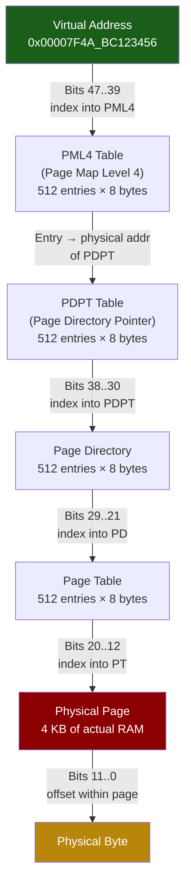

# Chapter 3: Virtual Memory and the TLB 🟡

> **What you'll learn:**
> - How the OS creates the illusion of a flat, private address space for every process via **virtual memory**.
> - The four-level **page table** structure on x86-64 and how virtual addresses are translated to physical addresses.
> - What the **Translation Lookaside Buffer (TLB)** is, why TLB misses are expensive, and what causes **TLB shootdowns**.
> - How to reduce TLB pressure using **HugePages** (2 MB and 1 GB) and **Transparent HugePages (THP)**.

---

## Why Virtual Memory Exists

Every process on a modern OS believes it has a private, contiguous address space from `0x0000_0000_0000_0000` to `0x0000_7FFF_FFFF_FFFF` (the user-space portion of x86-64's canonical 48-bit address space). This is an illusion maintained by the **Memory Management Unit (MMU)** — a hardware unit on the CPU die.

Virtual memory provides three critical properties:

1. **Isolation:** Process A cannot access Process B's physical memory, even by accident.
2. **Abstraction:** Programs don't need to know which physical RAM addresses are free.
3. **Overcommit:** The OS can map more virtual memory than physically exists, using swap or lazy allocation.

## The Page Table: Virtual → Physical Translation

The basic unit of virtual memory is a **page** — a 4 KB (4,096 byte) block on x86-64. The hardware translates virtual addresses to physical addresses using a hierarchical **page table** stored in DRAM.

On x86-64 with 4-level paging, a 48-bit virtual address is broken into five fields:

```
Virtual Address (48 bits):
┌──────────┬──────────┬──────────┬──────────┬──────────┐
│ PML4 (9) │ PDPT (9) │  PD (9)  │  PT (9)  │ Offset   │
│ bits     │ bits     │ bits     │ bits     │ (12 bits)│
│ 47..39   │ 38..30   │ 29..21   │ 20..12   │ 11..0    │
└──────────┴──────────┴──────────┴──────────┴──────────┘
```



**Each level** of the page table is a 4 KB page containing 512 entries (512 × 8 bytes = 4,096 bytes). Each entry contains:
- The **physical address** of the next-level table (or the final physical page).
- **Permission flags:** read, write, execute, user/supervisor, present.
- **Accessed (A) and Dirty (D) bits** — used by the OS for page replacement.

### The Cost of a Page Walk

A full page-table walk requires **four sequential DRAM accesses** (one per level). At ~100 ns per access, that's **~400 ns** — a catastrophic penalty on every memory access.

This is where the TLB comes in.

## The Translation Lookaside Buffer (TLB)

The **TLB** is a small, fully-associative hardware cache that stores recent virtual-to-physical page translations. When the CPU accesses a virtual address:

1. **TLB hit:** The MMU finds the translation in the TLB → physical address delivered in **~1 ns** (essentially free — overlapped with L1 cache access).
2. **TLB miss:** The MMU must perform a full page-table walk → **~10–40 ns** on modern hardware (page-walk caches help, but it's still 10× slower than a TLB hit).

### TLB Sizes (Typical Modern x86-64)

| TLB Level | Entries (4 KB pages) | Entries (2 MB pages) | Coverage (4 KB) | Coverage (2 MB) |
|---|---|---|---|---|
| **L1 dTLB** | 64 | 32 | 256 KB | 64 MB |
| **L2 sTLB** | 1,536 | 1,536 | 6 MB | 3 GB |

With **4 KB pages**, the entire TLB can cover at most **~6 MB** of address space. A database or trading engine with a 100 GB working set would suffer constant TLB misses.

With **2 MB huge pages**, the same TLB entries cover **~3 GB** — a 500× improvement in coverage.

## Page Faults: Minor vs. Major

When a process accesses a virtual address that has a page-table entry but the physical page isn't ready, a **page fault** occurs:

| Fault Type | Cause | Latency | Example |
|---|---|---|---|
| **Minor** | Page is in RAM but not yet mapped (e.g., first access after `mmap`) | ~1–10 μs | Growing the heap, first touch of `mmap`'d region |
| **Major** | Page must be read from **disk** (swap or file-backed `mmap`) | ~1–10 ms | Swapped-out page, cold `mmap`'d file |

Major page faults are **1,000–10,000× slower** than minor faults. In latency-sensitive systems, you must **pre-fault** all memory at startup:

```rust
use std::alloc::{alloc_zeroed, Layout};

/// Pre-fault a memory region by touching every page.
/// This ensures all pages are physically allocated and TLB-warm.
unsafe fn prefault_region(ptr: *mut u8, len: usize) {
    let page_size = 4096;
    let mut offset = 0;
    while offset < len {
        // Read one byte per page to trigger a minor page fault NOW,
        // rather than on the critical path later.
        std::ptr::read_volatile(ptr.add(offset));
        offset += page_size;
    }
}

fn allocate_prefaulted(size: usize) -> *mut u8 {
    let layout = Layout::from_size_align(size, 4096).unwrap();
    unsafe {
        let ptr = alloc_zeroed(layout);
        if ptr.is_null() {
            panic!("allocation failed");
        }
        prefault_region(ptr, size);
        ptr
    }
}
```

## TLB Shootdowns: The Multi-Core Tax

When the OS modifies a page-table entry (e.g., unmapping a page, changing permissions), it must also invalidate the corresponding TLB entry on **every core** that might have it cached. This is called a **TLB shootdown**.

The mechanism on x86-64:

1. The initiating core sends an **Inter-Processor Interrupt (IPI)** to all other cores.
2. Each receiving core handles the interrupt, invokes `INVLPG` to invalidate the specific TLB entry, and acknowledges.
3. The initiating core waits for all acknowledgments before proceeding.

**Cost: 1–10 μs per shootdown**, depending on the number of cores.

> **Why TLB shootdowns matter for performance:** Operations that trigger them include `munmap()`, `mprotect()`, `mremap()`, and even transparent huge page compaction. In a database that frequently maps/unmaps file regions, TLB shootdowns can dominate tail latency.

### Measuring TLB Events

```bash
# Count TLB misses and page walks
perf stat -e dTLB-load-misses,dTLB-store-misses,iTLB-load-misses \
  -- ./my_program

# Count TLB shootdown IPIs
perf stat -e 'irq_vectors:tlb_flush' -a -- sleep 10
```

## HugePages: The TLB Multiplier

The fix for TLB pressure is conceptually simple: use **bigger pages** so each TLB entry covers more address space.

| Page Size | TLB Entries Needed for 1 GB | Coverage per L2 TLB (1,536 entries) |
|---|---|---|
| **4 KB** (standard) | 262,144 | ~6 MB |
| **2 MB** (huge) | 512 | ~3 GB |
| **1 GB** (gigantic) | 1 | ~1.5 TB |

### Explicit HugePages (`mmap` with `MAP_HUGETLB`)

```rust
use std::ptr;

/// Allocate a region backed by 2 MB huge pages.
/// Requires: `echo 1024 > /proc/sys/vm/nr_hugepages` (as root)
fn alloc_huge_pages(size: usize) -> *mut u8 {
    let addr = unsafe {
        libc::mmap(
            ptr::null_mut(),
            size,
            libc::PROT_READ | libc::PROT_WRITE,
            libc::MAP_PRIVATE | libc::MAP_ANONYMOUS | libc::MAP_HUGETLB,
            -1,
            0,
        )
    };
    if addr == libc::MAP_FAILED {
        panic!(
            "mmap with MAP_HUGETLB failed. \
             Ensure huge pages are reserved: \
             echo 1024 > /proc/sys/vm/nr_hugepages"
        );
    }
    addr as *mut u8
}
```

### Transparent HugePages (THP)

Linux can **automatically** promote contiguous 4 KB pages into 2 MB huge pages without application changes. This is called **Transparent HugePages**.

```bash
# Check THP status
cat /sys/kernel/mm/transparent_hugepage/enabled
# [always] madvise never

# Set to "madvise" for opt-in (recommended for latency-sensitive apps)
echo madvise > /sys/kernel/mm/transparent_hugepage/enabled
```

With `madvise` mode, applications opt in via `madvise(addr, len, MADV_HUGEPAGE)`:

```rust
/// Advise the kernel to use huge pages for this region.
unsafe fn advise_huge_pages(ptr: *mut u8, len: usize) {
    let ret = libc::madvise(ptr as *mut libc::c_void, len, libc::MADV_HUGEPAGE);
    if ret != 0 {
        eprintln!("madvise(MADV_HUGEPAGE) failed: {}", std::io::Error::last_os_error());
    }
}
```

> **Warning:** THP in `always` mode can cause latency spikes due to background compaction (the `khugepaged` kernel thread). For latency-sensitive workloads, use `madvise` mode and explicitly opt in for large, long-lived allocations (memory pools, database buffers).

### THP vs. Explicit HugePages

| Feature | Explicit HugePages | Transparent HugePages |
|---|---|---|
| **Setup** | Reserve at boot (`nr_hugepages`) | Automatic (kernel promotes) |
| **Fragmentation** | Pre-reserved, guaranteed | May fail if RAM is fragmented |
| **Latency spikes** | None (pre-allocated) | `khugepaged` compaction can stall |
| **Application changes** | Requires `MAP_HUGETLB` | None (or `madvise`) |
| **Best for** | Databases, JVM heaps | General-purpose servers |

## Real-World Impact: Database Buffer Pool

A database with a 128 GB buffer pool using 4 KB pages needs **33 million page-table entries** and overwhelms the TLB. Switching to 2 MB huge pages reduces this to **65,536 entries** — well within TLB capacity.

Measured impact on a B-tree lookup benchmark:

| Configuration | TLB Misses per Query | P99 Latency |
|---|---|---|
| 4 KB pages | ~12,000 | 450 μs |
| 2 MB THP | ~80 | 120 μs |
| 2 MB explicit | ~60 | 105 μs |
| 1 GB pages | ~2 | 85 μs |

---

<details>
<summary><strong>🏋️ Exercise: Measure TLB Impact with HugePages</strong> (click to expand)</summary>

**Challenge:**

1. Write a Rust program that allocates a 512 MB buffer and performs random 8-byte reads across it (similar to a hash-table probe or B-tree traversal).
2. Measure throughput (reads/second) with standard 4 KB pages.
3. Repeat with `MADV_HUGEPAGE` advisory.
4. Use `perf stat -e dTLB-load-misses` to compare TLB miss rates.

<details>
<summary>🔑 Solution</summary>

```rust
use std::time::Instant;

const BUFFER_SIZE: usize = 512 * 1024 * 1024; // 512 MB
const NUM_READS: usize = 50_000_000;

fn random_reads(buffer: &[u8], use_huge: bool) -> std::time::Duration {
    if use_huge {
        unsafe {
            libc::madvise(
                buffer.as_ptr() as *mut libc::c_void,
                buffer.len(),
                libc::MADV_HUGEPAGE,
            );
        }
    }

    // Pre-fault: touch every page
    for i in (0..buffer.len()).step_by(4096) {
        std::hint::black_box(buffer[i]);
    }

    // Generate pseudo-random offsets (LCG, deterministic)
    let mut rng: u64 = 0xCAFE_BABE_DEAD_BEEF;
    let mask = (BUFFER_SIZE - 1) as u64; // power-of-2

    let start = Instant::now();
    let mut checksum: u64 = 0;
    for _ in 0..NUM_READS {
        rng = rng.wrapping_mul(6364136223846793005).wrapping_add(1);
        let offset = (rng & mask) as usize & !7; // 8-byte aligned
        let val = unsafe { *(buffer.as_ptr().add(offset) as *const u64) };
        checksum = checksum.wrapping_add(val);
    }
    std::hint::black_box(checksum);
    start.elapsed()
}

fn main() {
    // Allocate with mmap for control over huge page advisory
    let buffer = unsafe {
        let ptr = libc::mmap(
            std::ptr::null_mut(),
            BUFFER_SIZE,
            libc::PROT_READ | libc::PROT_WRITE,
            libc::MAP_PRIVATE | libc::MAP_ANONYMOUS,
            -1,
            0,
        );
        assert_ne!(ptr, libc::MAP_FAILED);
        std::slice::from_raw_parts(ptr as *const u8, BUFFER_SIZE)
    };

    // Run without huge pages
    println!("Running with 4 KB pages...");
    let t_normal = random_reads(buffer, false);
    let rps_normal = NUM_READS as f64 / t_normal.as_secs_f64();

    // Re-do with MADV_HUGEPAGE
    println!("Running with THP (2 MB pages)...");
    let t_huge = random_reads(buffer, true);
    let rps_huge = NUM_READS as f64 / t_huge.as_secs_f64();

    println!("\nResults ({NUM_READS} random reads over 512 MB):");
    println!("  4 KB pages: {:.2?}  ({:.1}M reads/sec)", t_normal, rps_normal / 1e6);
    println!("  2 MB THP:   {:.2?}  ({:.1}M reads/sec)", t_huge, rps_huge / 1e6);
    println!("  Speedup:    {:.1}×", rps_huge / rps_normal);
}
```

**Expected output (varies by hardware and THP availability):**

```
Results (50000000 random reads over 512 MB):
  4 KB pages: 4.21s  (11.9M reads/sec)
  2 MB THP:   3.02s  (16.6M reads/sec)
  Speedup:    1.4×
```

Verify with `perf stat`:

```bash
perf stat -e dTLB-load-misses,dTLB-loads -- ./target/release/tlb_bench
```

You should see a significant reduction in `dTLB-load-misses` with THP enabled.

</details>
</details>

---

> **Key Takeaways**
> - Virtual memory translation requires a **4-level page walk** (x86-64), costing ~10–40 ns on a TLB miss.
> - The **TLB** is a tiny cache (~1,536 entries) that makes translations essentially free on a hit. A miss triggers a page walk.
> - With 4 KB pages, the TLB can only cover **~6 MB**. Large working sets (databases, caches) suffer constant TLB misses.
> - **HugePages** (2 MB / 1 GB) multiply TLB coverage by 500× / 250,000× — a transformative optimization for memory-intensive workloads.
> - **TLB shootdowns** (caused by `munmap`, `mprotect`, THP compaction) send IPIs to all cores and cost 1–10 μs each. Minimize page-table mutations on the hot path.
> - **Pre-fault** all memory at startup to avoid page faults on the critical path.

> **See also:**
> - [Chapter 1: Latency Numbers and CPU Caches](ch01-latency-numbers-and-cpu-caches.md) — the cache hierarchy that sits above the TLB.
> - [Chapter 4: The Scheduler and Context Switching](ch04-scheduler-and-context-switching.md) — context switches flush the TLB.
> - [Rust Memory Management](../memory-management-book/src/SUMMARY.md) — how Rust's allocator interacts with the OS memory system.
