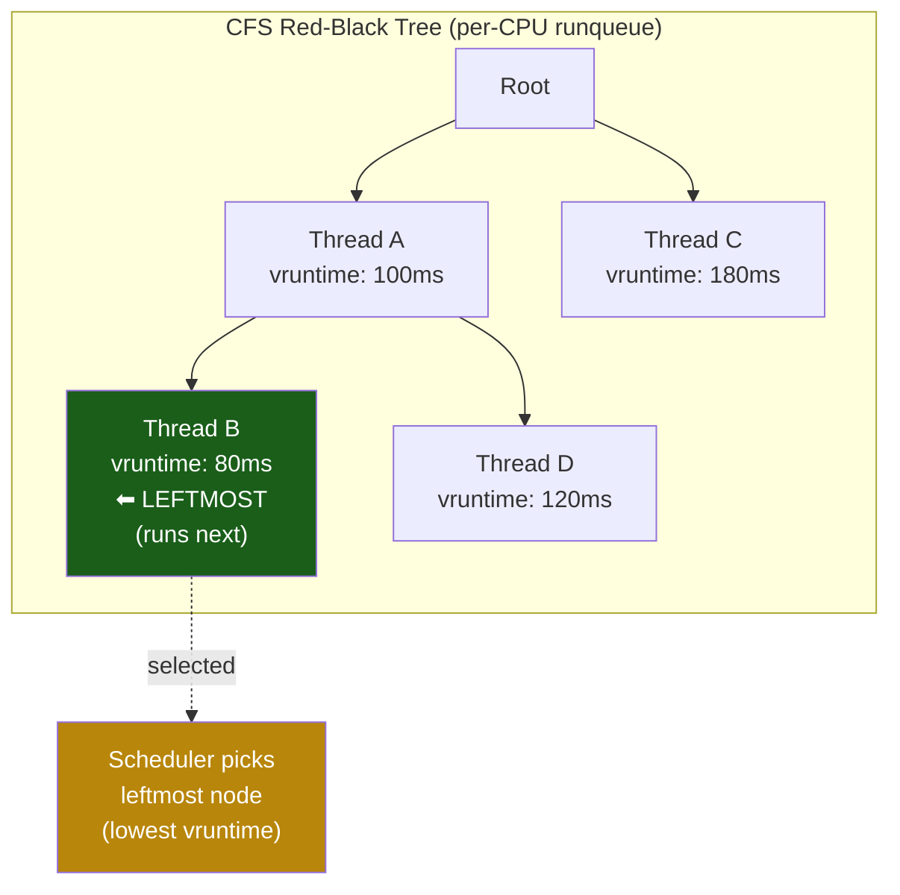
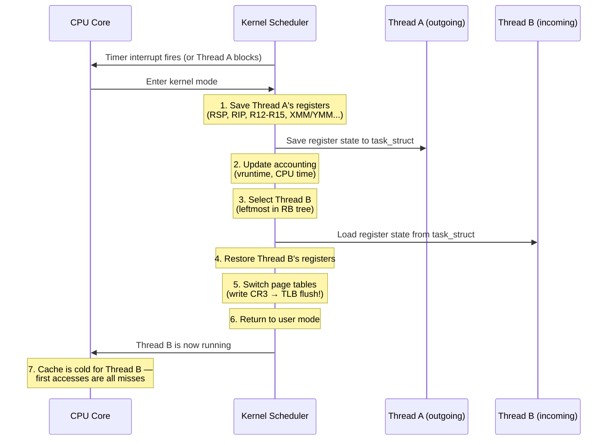

# Chapter 4: The Scheduler and Context Switching 🔴

> **What you'll learn:**
> - How the Linux **Completely Fair Scheduler (CFS)** decides which thread runs on which core, and for how long.
> - What physically happens during a **context switch** — register save/restore, TLB flush, and cache pollution.
> - How to **pin threads** to specific cores with `sched_setaffinity` and `isolcpus` to prevent the OS from interfering with your latency-critical workloads.
> - The difference between **voluntary** and **involuntary** context switches, and how to measure them.

---

## What the Scheduler Does

The Linux scheduler is the kernel subsystem that decides, every few microseconds, which of the hundreds or thousands of runnable threads on the system gets to execute on each CPU core. Its goals:

1. **Fairness:** Every thread gets its "fair share" of CPU time.
2. **Low latency:** Interactive tasks (UI, network handlers) should be scheduled quickly.
3. **Throughput:** Batch workloads should make progress without excessive overhead.

These goals are inherently in tension with the requirements of high-performance computing, where we want **one specific thread** to run on **one specific core** with **zero interruptions**.

## The Completely Fair Scheduler (CFS)

CFS (the default scheduler class for `SCHED_NORMAL`/`SCHED_OTHER` tasks) uses a **red-black tree** keyed on **virtual runtime (vruntime)** — a measure of how much CPU time a thread has consumed, weighted by its nice value.



**How CFS works:**

1. Each runnable thread has a `vruntime` that monotonically increases as it runs.
2. The scheduler always picks the thread with the **lowest `vruntime`** (the leftmost node in the red-black tree).
3. The selected thread runs for a **time slice** (typically 1–8 ms, depending on the number of runnable threads).
4. After the time slice expires (or the thread blocks on I/O), the scheduler re-evaluates.

The `nice` value (−20 to +19) adjusts the rate at which `vruntime` accumulates. A thread with nice −20 accumulates `vruntime` slowly (gets more CPU time); a thread with nice +19 accumulates quickly (gets less).

### CFS Parameters

```bash
# Check CFS scheduling parameters (in μs)
cat /proc/sys/kernel/sched_min_granularity_ns   # Min time slice (~3 ms)
cat /proc/sys/kernel/sched_latency_ns           # Scheduling period (~24 ms)
cat /proc/sys/kernel/sched_wakeup_granularity_ns # Wakeup preemption threshold
```

### Real-Time Scheduling Classes

For latency-critical threads, CFS may not be sufficient. Linux provides real-time scheduling policies:

| Policy | Priority | Behavior |
|---|---|---|
| `SCHED_OTHER` (CFS) | nice −20..+19 | Fair sharing, preemptive |
| `SCHED_FIFO` | 1–99 | Run until you block or yield, no time slicing |
| `SCHED_RR` | 1–99 | Like FIFO but with round-robin time slicing |
| `SCHED_DEADLINE` | — | Earliest deadline first (EDF), guaranteed bandwidth |

```rust
/// Set the current thread to SCHED_FIFO with the given priority (1–99).
/// Requires CAP_SYS_NICE or root.
fn set_realtime_priority(priority: i32) {
    let param = libc::sched_param {
        sched_priority: priority,
    };
    let ret = unsafe { libc::sched_setscheduler(0, libc::SCHED_FIFO, &param) };
    if ret != 0 {
        panic!(
            "sched_setscheduler failed: {}",
            std::io::Error::last_os_error()
        );
    }
}
```

> **Warning:** A `SCHED_FIFO` thread at high priority that never blocks will **starve** all lower-priority threads, including the SSH daemon. Use with extreme care and always have a watchdog.

## Anatomy of a Context Switch

When the scheduler decides to switch from Thread A to Thread B on a core, the following happens:



### The Hidden Costs

| Cost Component | Latency | What Happens |
|---|---|---|
| **Register save/restore** | ~0.5 μs | Save/load ~30 general registers + FPU/SSE/AVX state (up to 2 KB with AVX-512) |
| **TLB flush** | ~0.5–2 μs | Writing CR3 (page table base register) invalidates the entire TLB. Thread B starts with a cold TLB. |
| **Cache pollution** | ~5–50 μs (amortized) | Thread B's working set evicts Thread A's hot data from L1/L2/L3. Thread A will pay cache misses when it runs again. |
| **Scheduler overhead** | ~0.5 μs | Walking the RB tree, updating vruntime, load balancing |
| **Total direct cost** | **~1–5 μs** | Hardware registers + kernel bookkeeping |
| **Total indirect cost** | **~5–50 μs** | Cache/TLB warm-up after the switch |

> **The real cost of a context switch is not the switch itself — it's the cache/TLB pollution that follows.** A thread that was running with a 99% L1 hit rate may drop to 50% for thousands of accesses after being rescheduled.

### Measuring Context Switches

```bash
# Count context switches for a specific PID
cat /proc/<PID>/status | grep ctxt

# Output:
# voluntary_ctxt_switches:    12345
# nonvoluntary_ctxt_switches: 678

# System-wide context switch rate
vmstat 1

# Per-thread with perf
perf stat -e context-switches,cpu-migrations -- ./my_program
```

| Metric | Meaning | Good | Bad |
|---|---|---|---|
| `voluntary_ctxt_switches` | Thread called `sleep()`, blocked on I/O, or yielded | Expected | — |
| `nonvoluntary_ctxt_switches` | **Scheduler preempted the thread** (time slice expired) | < 100/sec | > 1,000/sec |
| `cpu-migrations` | Thread moved to a different core | ~0 | > 100/sec |

## Thread Pinning: `sched_setaffinity`

Thread pinning (CPU affinity) restricts a thread to run on specific cores. This prevents the scheduler from migrating the thread, which avoids:

1. **Cache pollution** from running on a core whose caches contain another thread's data.
2. **TLB flushes** from migration.
3. **NUMA penalties** from running on a core far from the thread's memory allocation.

```rust
/// Pin the current thread to a specific CPU core.
fn pin_to_core(core_id: usize) {
    let mut cpuset: libc::cpu_set_t = unsafe { std::mem::zeroed() };
    unsafe {
        libc::CPU_ZERO(&mut cpuset);
        libc::CPU_SET(core_id, &mut cpuset);
        let ret = libc::sched_setaffinity(0, std::mem::size_of::<libc::cpu_set_t>(), &cpuset);
        if ret != 0 {
            panic!(
                "sched_setaffinity({core_id}) failed: {}",
                std::io::Error::last_os_error()
            );
        }
    }
}

/// Example: Pin worker threads to specific cores
fn spawn_pinned_workers(num_workers: usize) -> Vec<std::thread::JoinHandle<()>> {
    (0..num_workers)
        .map(|i| {
            std::thread::Builder::new()
                .name(format!("worker-{i}"))
                .spawn(move || {
                    pin_to_core(i);
                    // This thread now runs exclusively on core `i`
                    worker_loop();
                })
                .expect("failed to spawn thread")
        })
        .collect()
}

fn worker_loop() {
    loop {
        // ... process work items ...
        # break; // placeholder
    }
}
```

### `isolcpus` and `nohz_full`: Isolating Cores from the Scheduler

Thread pinning is necessary but not sufficient. Even a pinned thread can be **preempted** by kernel threads (kworkers, interrupts, RCU callbacks). To fully isolate a core:

```bash
# Kernel boot parameters (in GRUB):
# isolcpus=4-7         → Cores 4-7 will NOT run any CFS tasks by default
# nohz_full=4-7        → Disable the timer tick on these cores (no preemption!)
# rcu_nocbs=4-7        → Offload RCU callbacks to other cores
# irqaffinity=0-3      → Route all hardware interrupts to cores 0-3

GRUB_CMDLINE_LINUX="isolcpus=4-7 nohz_full=4-7 rcu_nocbs=4-7 irqaffinity=0-3"
```

With this configuration:
- Cores 0–3: Run the OS, kernel threads, admin tasks, interrupt handlers.
- Cores 4–7: **Dedicated** to your application. No timer ticks, no kernel preemption, no interrupt handlers.

```bash
# Verify isolation
cat /sys/devices/system/cpu/isolated
# Output: 4-7

# Route IRQs away from isolated cores
for irq in /proc/irq/*/smp_affinity_list; do
    echo 0-3 > "$irq" 2>/dev/null
done
```

## NUMA: Non-Uniform Memory Access

On multi-socket servers, each CPU socket has its own **DRAM controller**. Memory attached to the local socket is "local memory"; memory on the other socket is "remote memory."

| Access Type | Latency | Bandwidth |
|---|---|---|
| **Local DRAM** | ~80 ns | ~50 GB/s |
| **Remote DRAM** (cross-socket) | ~140 ns | ~25 GB/s |

```bash
# Show NUMA topology
numactl --hardware

# Output (2-socket system):
# node 0 cpus: 0 1 2 3 4 5 6 7
# node 0 size: 128 GB
# node 1 cpus: 8 9 10 11 12 13 14 15
# node 1 size: 128 GB
# node distances:
#   node  0  1
#     0: 10 21    ← remote is 2.1× slower
#     1: 21 10
```

For NUMA-aware applications, bind both the **thread** and its **memory allocation** to the same NUMA node:

```rust
/// Set the NUMA memory policy to allocate only from the local node.
fn bind_memory_to_node(node: i32) {
    let mut mask: u64 = 1 << node;
    let ret = unsafe {
        libc::syscall(
            libc::SYS_set_mempolicy,
            libc::MPOL_BIND,
            &mut mask as *mut u64,
            64u64, // max nodes
        )
    };
    if ret != 0 {
        panic!(
            "set_mempolicy failed: {}",
            std::io::Error::last_os_error()
        );
    }
}
```

---

<details>
<summary><strong>🏋️ Exercise: Measure Context Switch Cost</strong> (click to expand)</summary>

**Challenge:**

1. Write a Rust program that spawns two threads communicating via a pair of channels. Each thread sends a token to the other and waits — this forces a context switch on every round-trip.
2. Measure the round-trip time for 1,000,000 exchanges.
3. Compare the results with and without thread pinning (pin to adjacent cores vs. same core vs. cross-NUMA).

<details>
<summary>🔑 Solution</summary>

```rust
use std::sync::mpsc;
use std::thread;
use std::time::Instant;

fn pin_to_core(core: usize) {
    let mut cpuset: libc::cpu_set_t = unsafe { std::mem::zeroed() };
    unsafe {
        libc::CPU_ZERO(&mut cpuset);
        libc::CPU_SET(core, &mut cpuset);
        libc::sched_setaffinity(0, std::mem::size_of::<libc::cpu_set_t>(), &cpuset);
    }
}

fn measure_context_switch(core_a: Option<usize>, core_b: Option<usize>) -> f64 {
    let iterations = 1_000_000u64;

    // Two pairs of channels for ping-pong
    let (tx_a, rx_a) = mpsc::sync_channel::<()>(0); // rendezvous channel
    let (tx_b, rx_b) = mpsc::sync_channel::<()>(0);

    let t1 = thread::spawn(move || {
        if let Some(core) = core_a {
            pin_to_core(core);
        }
        for _ in 0..iterations {
            tx_a.send(()).unwrap(); // send token
            rx_b.recv().unwrap();   // wait for token back
        }
    });

    let t2 = thread::spawn(move || {
        if let Some(core) = core_b {
            pin_to_core(core);
        }
        for _ in 0..iterations {
            rx_a.recv().unwrap();   // wait for token
            tx_b.send(()).unwrap(); // send token back
        }
    });

    let start = Instant::now();
    // Threads are already running — we measure from here
    // Actually, let's restructure: start timing inside the threads
    // For simplicity, we use wall clock around join:
    t1.join().unwrap();
    t2.join().unwrap();
    let elapsed = start.elapsed();

    // Each iteration is one full round-trip (2 context switches)
    elapsed.as_nanos() as f64 / iterations as f64
}

fn main() {
    println!("Measuring context switch latency (1M round-trips each)...\n");

    let ns_unpinned = measure_context_switch(None, None);
    println!("Unpinned:             {:.0} ns/round-trip", ns_unpinned);

    let ns_same_core = measure_context_switch(Some(0), Some(0));
    println!("Same core (0, 0):     {:.0} ns/round-trip", ns_same_core);

    let ns_sibling = measure_context_switch(Some(0), Some(1));
    println!("Adjacent cores (0,1): {:.0} ns/round-trip", ns_sibling);

    // If you have a 2-socket system, try cross-NUMA:
    // let ns_cross = measure_context_switch(Some(0), Some(8));
    // println!("Cross-NUMA (0, 8):    {:.0} ns/round-trip", ns_cross);
}
```

**Expected results:**

```
Unpinned:             ~3,500 ns/round-trip
Same core (0, 0):     ~2,800 ns/round-trip
Adjacent cores (0,1): ~3,200 ns/round-trip
```

Key observations:
- Same-core is fastest because there's no cache migration — Thread B inherits Thread A's warm cache.
- Adjacent cores are slightly slower due to L1/L2 cache misses.
- Cross-NUMA would be significantly slower due to remote memory access.
- Unpinned is unpredictable — the scheduler may migrate threads between context switches.

</details>
</details>

---

> **Key Takeaways**
> - The Linux **CFS** scheduler is designed for fairness, not for latency. It will preempt your critical thread if its time slice expires.
> - A context switch costs **~1–5 μs directly** (registers, kernel) but **~5–50 μs indirectly** (cache/TLB warm-up).
> - **Pin threads** to specific cores with `sched_setaffinity()` to prevent migration and cache pollution.
> - **Isolate cores** with `isolcpus`, `nohz_full`, and `rcu_nocbs` kernel parameters to eliminate *all* OS interference.
> - On **NUMA** systems, bind threads and their memory to the same socket. Cross-socket DRAM access is 1.5–2× slower.
> - Use **`SCHED_FIFO`** for latency-critical threads, but with extreme care — a misbehaving RT thread can hang the system.
> - Always measure: `perf stat -e context-switches,cpu-migrations` is your first tool.

> **See also:**
> - [Chapter 3: Virtual Memory and the TLB](ch03-virtual-memory-and-the-tlb.md) — context switches flush the TLB, compounding their cost.
> - [Chapter 8: Capstone — Thread-Per-Core Proxy](ch08-capstone-thread-per-core-proxy.md) — applying CPU pinning and NUMA awareness in a complete system design.
> - [Hardcore Quantitative Finance](../quant-finance-book/src/SUMMARY.md) — extreme scheduler tuning for HFT systems.
