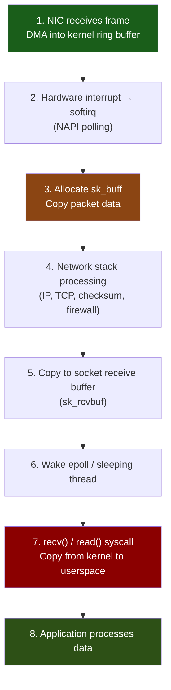
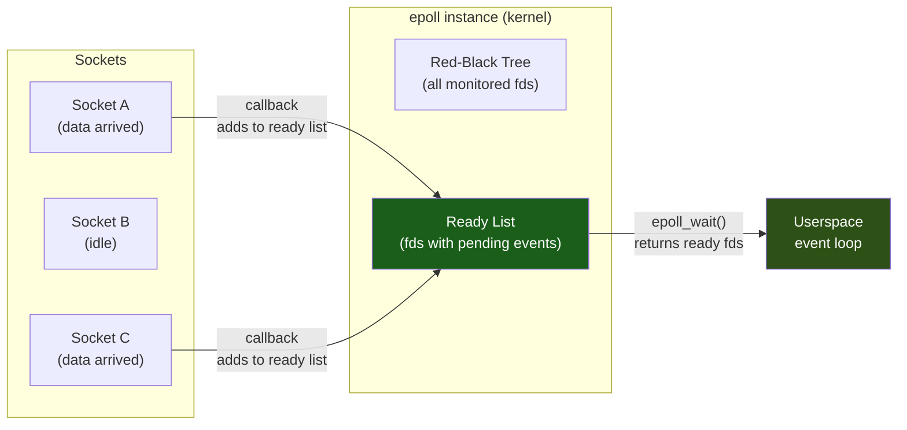

# Chapter 5: The Limits of `epoll` and Socket Buffers 🟡

> **What you'll learn:**
> - How the Linux networking stack processes packets — from NIC to `recv()`.
> - The hidden memory copies in the standard POSIX socket API (`sk_buff` chain).
> - How `epoll` works internally: the ready list, `epoll_wait`, and why it's still a syscall-per-event model.
> - Why `epoll` becomes a bottleneck at millions of concurrent connections and what comes next.

---

## The Linux Networking Stack: From Wire to Userspace

When a packet arrives at the Network Interface Card (NIC), it passes through a surprisingly deep pipeline before your application's `recv()` call returns:



### The Copy Tax

Count the memory copies in a standard TCP receive path:

| Stage | Copy | Who Pays |
|---|---|---|
| NIC → kernel ring buffer | **Copy 1:** DMA from NIC to RAM | Hardware (DMA engine) |
| Ring buffer → `sk_buff` | **Copy 2:** Kernel allocates `sk_buff`, copies header + data | CPU (softirq context) |
| `sk_buff` → socket buffer | Often a pointer move (no copy) | — |
| Socket buffer → userspace | **Copy 3:** `recv()` / `read()` copies data to user buffer | CPU (syscall context) |

That's **2–3 copies** per packet on the receive path. On the send path, add another 2–3 copies (`send()` → `sk_buff` → NIC). At 10 Gbit/s (~14.8M packets/sec for min-size frames), these copies consume significant CPU and memory bandwidth.

## `sk_buff`: The Kernel's Packet Representation

Every in-flight packet in the Linux networking stack is represented by a `struct sk_buff` — a complex, 240-byte metadata structure that points to the actual packet data:

```
struct sk_buff (simplified):
┌─────────────────────────────────────────────┐
│ head ──→ [headroom | data | tailroom]       │
│ data ──→ start of packet payload            │
│ tail ──→ end of payload                     │
│ end  ──→ end of allocated buffer            │
│ len     → total data length                 │
│ protocol, priority, mark, ...               │
│ next / prev → linked list pointers          │
│ destructor_arg → cleanup callback           │
└─────────────────────────────────────────────┘
```

Each `sk_buff` allocation requires:
- **Slab allocation** from the kernel's memory pool (~240 bytes for the struct).
- **Page allocation** for the data buffer (typically 2 KB MTU + headroom).
- **Cache-line footprint**: The `sk_buff` struct alone spans ~4 cache lines.

At high packet rates, the constant allocation and deallocation of `sk_buff` objects becomes a significant CPU overhead.

## How `epoll` Works

`epoll` is Linux's scalable I/O event notification mechanism, replacing the older `select()` and `poll()`. It is the backbone of most async runtimes (Tokio, Go's netpoller, NGINX, etc.).

### The Three Syscalls

```rust
// 1. Create an epoll instance (returns a file descriptor)
let epfd = unsafe { libc::epoll_create1(0) };

// 2. Register interest in a socket's readability
let mut event = libc::epoll_event {
    events: (libc::EPOLLIN | libc::EPOLLET) as u32, // Edge-triggered
    u64: socket_fd as u64,
};
unsafe { libc::epoll_ctl(epfd, libc::EPOLL_CTL_ADD, socket_fd, &mut event) };

// 3. Wait for events (blocks until at least one fd is ready)
let mut events = [libc::epoll_event { events: 0, u64: 0 }; 1024];
let n = unsafe { libc::epoll_wait(epfd, events.as_mut_ptr(), 1024, -1) };

// Process the n ready events
for i in 0..n as usize {
    let fd = events[i].u64 as i32;
    // handle_ready(fd);
}
```

### Inside the Kernel: The Ready List



When a socket receives data, the kernel's TCP stack invokes a **callback** registered by `epoll` that adds the socket to the **ready list**. When userspace calls `epoll_wait()`, the kernel simply drains the ready list — no scanning of all fds (unlike `poll()`).

This is O(ready_events), not O(total_fds), which is why `epoll` scales to millions of connections where `poll()` and `select()` collapse.

### Edge-Triggered vs. Level-Triggered

| Mode | Behavior | Use Case |
|---|---|---|
| **Level-triggered** (default) | `epoll_wait` returns as long as the fd is readable/writable | Simpler; re-reports if you don't drain the buffer |
| **Edge-triggered** (`EPOLLET`) | `epoll_wait` returns *once* when the state changes | Higher performance; you MUST drain the fd fully |

Most high-performance servers use **edge-triggered** mode to minimize redundant wake-ups.

## Where `epoll` Falls Short

`epoll` is the best the POSIX model offers, but it has fundamental limitations:

### 1. Syscall-Per-Batch Overhead

Every call to `epoll_wait()` is a **syscall**: user → kernel mode transition, which costs ~200–500 ns. For a server handling 1 million events/sec:

```
1,000,000 events/sec ÷ 128 events/batch = ~7,800 epoll_wait() calls/sec
7,800 × 300 ns = ~2.3 ms/sec of pure syscall overhead
```

At 10 million events/sec, this becomes 20+ ms/sec — a significant fraction of a single core's capacity.

### 2. Data Copies on Every `recv()` / `send()`

Each `recv()` call copies data from the kernel socket buffer to a userspace buffer:

```rust
// 💥 Hidden copy: kernel copies sk_buff data → user buffer
let mut buf = [0u8; 4096];
let n = unsafe { libc::recv(fd, buf.as_mut_ptr() as *mut libc::c_void, 4096, 0) };
```

This copy is performed by the CPU in syscall context. For a proxy that reads data from one socket and writes it to another, the data is copied **four times**:

```
NIC → kernel (DMA) → userspace (recv) → kernel (send) → NIC (DMA)
```

### 3. Head-of-Line Blocking in the Event Loop

A typical `epoll`-based server processes events sequentially:

```rust
// Simplified epoll event loop
loop {
    let n = epoll_wait(epfd, &mut events, -1);
    for i in 0..n {
        match events[i].fd {
            listen_fd => accept_connection(),
            client_fd => {
                // 💥 If this read + process takes 1ms, ALL other
                // ready connections are blocked behind it
                let data = read_all(client_fd);
                process_and_respond(client_fd, &data);
            }
        }
    }
}
```

### 4. No Native File I/O Support

`epoll` works with sockets, pipes, and eventfds — but **not with regular files**. Disk I/O is always blocking on Linux (even with `O_NONBLOCK`). This forces applications to use thread pools for disk operations:

```
                  ┌── epoll thread ──→ handles sockets
Application ──→ ─┤
                  └── thread pool ──→ handles disk I/O (blocking)
```

This bifurcation complicates architectures and introduces thread-pool contention.

## `epoll` vs. What Comes Next: A Preview

| Feature | `epoll` | `io_uring` |
|---|---|---|
| **Syscall model** | One `epoll_wait()` per batch | Zero syscalls (shared memory rings) |
| **Data copies** | `recv()` / `send()` copy data | Zero-copy with fixed buffers |
| **File I/O** | Not supported (must use threads) | Native async file I/O |
| **Batching** | Manual (batch events in one `epoll_wait`) | Built-in (queue many ops, submit once) |
| **Kernel overhead** | Context switch per `epoll_wait` | Kernel polls ring in background |
| **Maturity** | 20+ years, battle-tested | Stable since Linux 5.1+ |

---

<details>
<summary><strong>🏋️ Exercise: Profile an epoll Echo Server</strong> (click to expand)</summary>

**Challenge:**

1. Write a minimal TCP echo server in Rust using raw `epoll` (no async runtime). Accept connections, read data, echo it back.
2. Benchmark it with a tool like `wrk` or a custom client that opens 10,000 connections and sends 1 KB messages.
3. Use `perf stat` to count:
   - Total syscalls (`perf stat -e raw_syscalls:sys_enter`)
   - Context switches
   - L1 cache misses
4. Record the baseline throughput (requests/sec) and syscall count. You'll compare this to `io_uring` in Chapter 6.

<details>
<summary>🔑 Solution</summary>

```rust
use std::collections::HashMap;
use std::io;
use std::net::TcpListener;
use std::os::unix::io::{AsRawFd, RawFd};

const MAX_EVENTS: usize = 1024;
const BUF_SIZE: usize = 4096;

fn set_nonblocking(fd: RawFd) {
    unsafe {
        let flags = libc::fcntl(fd, libc::F_GETFL);
        libc::fcntl(fd, libc::F_SETFL, flags | libc::O_NONBLOCK);
    }
}

fn epoll_add(epfd: RawFd, fd: RawFd, events: u32) {
    let mut ev = libc::epoll_event {
        events,
        u64: fd as u64,
    };
    unsafe {
        libc::epoll_ctl(epfd, libc::EPOLL_CTL_ADD, fd, &mut ev);
    }
}

fn main() -> io::Result<()> {
    let listener = TcpListener::bind("0.0.0.0:8080")?;
    let listen_fd = listener.as_raw_fd();
    set_nonblocking(listen_fd);

    let epfd = unsafe { libc::epoll_create1(0) };
    epoll_add(epfd, listen_fd, libc::EPOLLIN as u32 | libc::EPOLLET as u32);

    let mut events = vec![libc::epoll_event { events: 0, u64: 0 }; MAX_EVENTS];
    let mut buffers: HashMap<RawFd, Vec<u8>> = HashMap::new();

    println!("Echo server listening on :8080 (epoll, edge-triggered)");

    loop {
        let n = unsafe {
            libc::epoll_wait(epfd, events.as_mut_ptr(), MAX_EVENTS as i32, -1)
        };
        if n < 0 {
            break;
        }

        for i in 0..n as usize {
            let fd = events[i].u64 as RawFd;

            if fd == listen_fd {
                // Accept all pending connections (edge-triggered)
                loop {
                    let client_fd = unsafe {
                        libc::accept4(
                            listen_fd,
                            std::ptr::null_mut(),
                            std::ptr::null_mut(),
                            libc::SOCK_NONBLOCK,
                        )
                    };
                    if client_fd < 0 {
                        break; // EAGAIN — no more pending
                    }
                    epoll_add(
                        epfd,
                        client_fd,
                        (libc::EPOLLIN | libc::EPOLLET) as u32,
                    );
                    buffers.insert(client_fd, Vec::with_capacity(BUF_SIZE));
                }
            } else {
                // Read and echo (edge-triggered: drain fully)
                let buf = buffers.entry(fd).or_insert_with(|| Vec::with_capacity(BUF_SIZE));
                buf.resize(BUF_SIZE, 0);

                loop {
                    let n = unsafe {
                        libc::recv(
                            fd,
                            buf.as_mut_ptr() as *mut libc::c_void,
                            BUF_SIZE,
                            0,
                        )
                    };
                    if n <= 0 {
                        if n == 0 {
                            // Connection closed
                            unsafe { libc::close(fd); }
                            buffers.remove(&fd);
                        }
                        break; // EAGAIN or error
                    }
                    // Echo back
                    let mut sent = 0;
                    while sent < n as usize {
                        let w = unsafe {
                            libc::send(
                                fd,
                                buf[sent..].as_ptr() as *const libc::c_void,
                                (n as usize) - sent,
                                libc::MSG_NOSIGNAL,
                            )
                        };
                        if w <= 0 {
                            break;
                        }
                        sent += w as usize;
                    }
                }
            }
        }
    }

    Ok(())
}
```

**Profiling:**

```bash
# Build release
cargo build --release

# Run the server
./target/release/echo_server &

# Benchmark (from another terminal)
# Using a simple netcat loop or wrk:
# wrk -t4 -c10000 -d10s http://localhost:8080  (if HTTP)
# Or use a custom TCP load generator

# Profile the server (while load test runs)
perf stat -e syscalls:sys_enter_epoll_wait,\
syscalls:sys_enter_recvfrom,\
syscalls:sys_enter_sendto,\
context-switches \
-p $(pgrep echo_server)
```

**Expected observations:**

1. Syscall count scales linearly with throughput — each recv/send is a syscall.
2. At 100K connections, `epoll_wait` returns batches of ~100 events, amortizing its cost.
3. Context switches should be low (single-threaded event loop).
4. The total CPU time is dominated by `recv()` and `send()` syscalls + data copying.

In Chapter 6, we'll replace all of this with `io_uring` and eliminate the per-operation syscalls entirely.

</details>
</details>

---

> **Key Takeaways**
> - The standard Linux networking stack copies packet data **2–3 times** between NIC and application.
> - `epoll` is efficient (O(ready_events)), but every `epoll_wait()` is still a **syscall** (~200–500 ns).
> - Each `recv()` and `send()` is an additional syscall with a kernel→userspace copy.
> - `epoll` cannot handle **regular file I/O** — you need a separate thread pool for disk operations.
> - At millions of events/sec, syscall overhead and data copies become the dominant bottleneck, not your application logic.
> - Edge-triggered mode reduces redundant wake-ups but requires careful "drain fully" semantics.

> **See also:**
> - [Chapter 6: Asynchronous I/O with io_uring](ch06-asynchronous-io-with-io-uring.md) — replacing `epoll` + `recv`/`send` with shared-memory ring buffers.
> - [Tokio Internals](../tokio-internals-book/src/SUMMARY.md) — how Tokio's reactor uses `epoll` (and increasingly `io_uring`) under the hood.
> - [Chapter 1: Latency Numbers](ch01-latency-numbers-and-cpu-caches.md) — the memory copies in the socket path hit the cache hierarchy.
