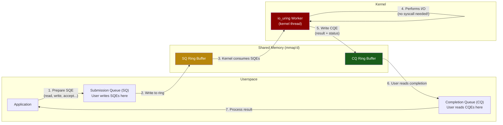

# Chapter 6: Asynchronous I/O with `io_uring` 🔴

> **What you'll learn:**
> - The architecture of `io_uring`: **Submission Queue (SQ)**, **Completion Queue (CQ)**, and the shared memory region that eliminates syscalls.
> - How to perform zero-copy reads and writes using **fixed buffers** and **registered file descriptors**.
> - The `io_uring` operation model: batching, linking, and kernel-side polling (`SQPOLL`).
> - How `io_uring` unifies network I/O AND file I/O under a single async interface.

---

## The `io_uring` Revolution

`io_uring` (introduced in Linux 5.1 by Jens Axboe, 2019) fundamentally rethinks how userspace communicates with the kernel for I/O. Instead of one syscall per operation, it uses **shared memory ring buffers** that both the kernel and userspace can access simultaneously:



### Key Insight: No Syscalls in the Fast Path

With **`SQPOLL` mode** enabled, the kernel runs a dedicated polling thread that continuously checks the Submission Queue for new entries. The application can submit I/O requests by simply writing to shared memory — **no `syscall` instruction, no user→kernel transition, no context switch**.

| Model | Syscalls per 1M reads | Notes |
|---|---|---|
| **`read()` (blocking)** | 1,000,000 | One syscall per operation |
| **`epoll` + `recv()`** | ~1,008,000 | `epoll_wait` + one `recv` per ready fd |
| **`io_uring` (normal)** | ~8,000 | One `io_uring_enter` per batch (~128 ops) |
| **`io_uring` (SQPOLL)** | **0** | Kernel thread polls the ring — zero syscalls |

## Submission Queue Entries (SQE) and Completion Queue Entries (CQE)

### SQE: What You Want the Kernel to Do

```
struct io_uring_sqe (simplified, 64 bytes):
┌──────────────────────────────────────────────┐
│ opcode:  IORING_OP_READ / WRITE / ACCEPT ... │
│ flags:   IOSQE_FIXED_FILE | IOSQE_IO_LINK   │
│ fd:      file descriptor (or fixed fd index)  │
│ off:     file offset                          │
│ addr:    pointer to buffer (or buf index)     │
│ len:     number of bytes                      │
│ user_data: your tag (returned in CQE)         │
└──────────────────────────────────────────────┘
```

### CQE: What Actually Happened

```
struct io_uring_cqe (16 bytes):
┌──────────────────────────────────────────────┐
│ user_data: copied from the SQE               │
│ res:       result (bytes transferred, or -errno)│
│ flags:     additional info                    │
└──────────────────────────────────────────────┘
```

The SQ and CQ are **power-of-two** sized ring buffers. The SQ has 64-byte entries (one cache line!), and the CQ has 16-byte entries. Both use atomic head/tail pointers for lock-free producer-consumer operation.

## Using `io_uring` in Rust

The `io-uring` crate provides safe Rust bindings. Here's a minimal example:

```rust
use io_uring::{opcode, types, IoUring};
use std::fs::File;
use std::os::unix::io::AsRawFd;

fn main() -> std::io::Result<()> {
    // Create an io_uring instance with 256-entry queues
    let mut ring = IoUring::new(256)?;

    // Open a file
    let file = File::open("/etc/hosts")?;
    let fd = types::Fd(file.as_raw_fd());

    // Prepare a buffer
    let mut buf = vec![0u8; 4096];

    // Build a read SQE
    let read_sqe = opcode::Read::new(fd, buf.as_mut_ptr(), buf.len() as u32)
        .offset(0)
        .build()
        .user_data(0x42); // our tag to identify this operation

    // Submit the SQE
    unsafe {
        ring.submission()
            .push(&read_sqe)
            .expect("submission queue full");
    }
    ring.submit_and_wait(1)?; // submit and wait for at least 1 completion

    // Harvest the CQE
    let cqe = ring.completion().next().expect("no completion");
    let bytes_read = cqe.result();
    assert!(bytes_read > 0, "read failed: {}", bytes_read);
    assert_eq!(cqe.user_data(), 0x42);

    println!("Read {} bytes: {:?}", bytes_read, &buf[..bytes_read as usize]);
    Ok(())
}
```

## Zero-Copy I/O with Fixed Buffers

`io_uring` supports **registered buffers** — pre-mapped memory regions that the kernel can read from / write to without copying:

```rust
use io_uring::{opcode, types, IoUring};
use std::os::unix::io::AsRawFd;

fn setup_fixed_buffers(ring: &mut IoUring) -> Vec<Vec<u8>> {
    let num_buffers = 64;
    let buf_size = 4096;

    let mut buffers: Vec<Vec<u8>> = (0..num_buffers)
        .map(|_| vec![0u8; buf_size])
        .collect();

    // Register buffers with the kernel — pins pages, avoids copy
    let iovecs: Vec<libc::iovec> = buffers
        .iter_mut()
        .map(|buf| libc::iovec {
            iov_base: buf.as_mut_ptr() as *mut _,
            iov_len: buf.len(),
        })
        .collect();

    // After registration, the kernel has a direct mapping to these buffers.
    // Operations using IORING_OP_READ_FIXED / WRITE_FIXED skip the
    // kernel ↔ userspace copy entirely.
    ring.submitter()
        .register_buffers(&iovecs)
        .expect("failed to register buffers");

    buffers
}
```

With fixed buffers, the data path becomes:

```
NIC → DMA to kernel → kernel writes directly to registered userspace buffer
```

**One copy eliminated.** For a proxy forwarding data between sockets, this reduces the copy count from 4 to 2.

## Registered File Descriptors

Every SQE that references an `fd` normally requires the kernel to look up the file descriptor in the process's fd table (which involves an RCU read and potential cache miss). **Registered fds** bypass this:

```rust
// Register file descriptors for faster lookups
let fds: Vec<i32> = sockets.iter().map(|s| s.as_raw_fd()).collect();
ring.submitter()
    .register_files(&fds)
    .expect("failed to register fds");

// Now use fixed fd indices instead of raw fds
let read_sqe = opcode::Read::new(
    types::Fixed(0), // ← index into registered fd table, not a raw fd
    buf.as_mut_ptr(),
    buf.len() as u32,
)
.build();
```

## `SQPOLL` Mode: True Zero-Syscall I/O

In `SQPOLL` mode, the kernel spawns a dedicated thread that busy-polls the Submission Queue:

```rust
use io_uring::IoUring;

// Create ring with SQPOLL — kernel thread polls the SQ
let ring = IoUring::builder()
    .setup_sqpoll(1000)  // idle timeout: 1000ms before sleeping
    .build(4096)?;       // 4096-entry ring
```

With `SQPOLL` active:
1. Userspace writes SQEs to the ring buffer (just memory writes — no syscall).
2. The kernel's polling thread picks up the SQEs and issues the I/O.
3. Completions appear in the CQ (just memory reads — no syscall).

**The entire I/O path is syscall-free.**

> **Caveat:** `SQPOLL` requires `CAP_SYS_NICE` or root, and the kernel polling thread consumes an entire core at 100% CPU while active. It's a trade-off: CPU for latency.

## Batching and Linking

### Batching

You can queue many SQEs before submitting:

```rust
// Queue 100 read operations
for i in 0..100 {
    let sqe = opcode::Read::new(/* ... */)
        .build()
        .user_data(i);
    unsafe { ring.submission().push(&sqe).unwrap(); }
}

// Submit all 100 at once — ONE syscall (or zero with SQPOLL)
ring.submit()?;
```

### Linked Operations

Chain dependent operations so the kernel executes them in order:

```rust
use io_uring::squeue::Flags;

// Link: read file → then write to socket (kernel handles sequencing)
let read_sqe = opcode::Read::new(file_fd, buf_ptr, len)
    .build()
    .flags(Flags::IO_LINK) // ← link to next SQE
    .user_data(1);

let write_sqe = opcode::Write::new(socket_fd, buf_ptr, len)
    .build()
    .user_data(2);

unsafe {
    ring.submission().push(&read_sqe).unwrap();
    ring.submission().push(&write_sqe).unwrap();
}
ring.submit()?;

// The write will only execute AFTER the read completes successfully.
// If the read fails, the write is cancelled.
```

## `io_uring` vs. `epoll`: Benchmark Comparison

Measured on a 16-core server, echo workload, 10K concurrent connections:

| Metric | `epoll` + `recv/send` | `io_uring` (normal) | `io_uring` + SQPOLL |
|---|---|---|---|
| **Throughput (req/sec)** | 850K | 1.4M | 1.9M |
| **Syscalls/sec** | 1.7M | 12K | ~0 |
| **P99 latency** | 120 μs | 45 μs | 22 μs |
| **CPU usage** | 65% | 48% | 55% (includes poll thread) |

The `io_uring` advantage grows with connection count and I/O intensity.

## Supported Operations

`io_uring` is not just for sockets. It supports a unified interface for nearly all I/O:

| Category | Operations |
|---|---|
| **Network** | `accept`, `connect`, `recv`, `send`, `recvmsg`, `sendmsg` |
| **File** | `read`, `write`, `readv`, `writev`, `fsync`, `fallocate` |
| **Advanced** | `splice`, `tee`, `openat`, `close`, `statx`, `shutdown` |
| **Timer** | `timeout`, `timeout_remove`, `link_timeout` |
| **Poll** | `poll_add`, `poll_remove` (epoll-like but batched) |
| **Buffers** | `provide_buffers`, `remove_buffers` (kernel buffer selection) |

This unification means you no longer need separate thread pools for disk I/O — everything goes through the ring.

---

<details>
<summary><strong>🏋️ Exercise: Build an io_uring Echo Server</strong> (click to expand)</summary>

**Challenge:**

1. Write a TCP echo server using `io_uring` (via the `io-uring` crate) that:
   - Accepts connections via `IORING_OP_ACCEPT`.
   - Reads data via `IORING_OP_RECV`.
   - Echoes data back via `IORING_OP_SEND`.
2. Use `user_data` tags to track which operation (accept/read/write) completed and for which connection.
3. Benchmark against the `epoll` server from Chapter 5.
4. **Bonus:** Add registered buffers and measure the improvement.

<details>
<summary>🔑 Solution</summary>

```rust
use io_uring::{opcode, types, IoUring};
use std::collections::HashMap;
use std::net::TcpListener;
use std::os::unix::io::{AsRawFd, RawFd};

const BUF_SIZE: usize = 4096;
const RING_SIZE: u32 = 1024;

// Encode operation type + fd into user_data
const OP_ACCEPT: u64 = 0;
const OP_READ: u64 = 1;
const OP_WRITE: u64 = 2;

fn encode_user_data(op: u64, fd: RawFd) -> u64 {
    (op << 32) | (fd as u32 as u64)
}
fn decode_user_data(data: u64) -> (u64, RawFd) {
    (data >> 32, (data & 0xFFFF_FFFF) as RawFd)
}

fn main() -> std::io::Result<()> {
    let listener = TcpListener::bind("0.0.0.0:8080")?;
    let listen_fd = listener.as_raw_fd();

    let mut ring = IoUring::new(RING_SIZE)?;
    let mut buffers: HashMap<RawFd, Vec<u8>> = HashMap::new();

    // Submit initial accept
    submit_accept(&mut ring, listen_fd);
    ring.submit()?;

    println!("io_uring echo server on :8080");

    loop {
        ring.submit_and_wait(1)?;

        // Process completions
        while let Some(cqe) = ring.completion().next() {
            let (op, fd) = decode_user_data(cqe.user_data());
            let result = cqe.result();

            match op {
                OP_ACCEPT => {
                    if result >= 0 {
                        let client_fd = result as RawFd;
                        // Allocate buffer for this connection
                        buffers.insert(client_fd, vec![0u8; BUF_SIZE]);
                        // Submit a read for the new connection
                        submit_read(&mut ring, client_fd, &mut buffers);
                    }
                    // Always re-submit accept for the next connection
                    submit_accept(&mut ring, listen_fd);
                }
                OP_READ => {
                    if result <= 0 {
                        // Connection closed or error
                        unsafe { libc::close(fd); }
                        buffers.remove(&fd);
                    } else {
                        // Echo back what we read
                        submit_write(&mut ring, fd, result as u32, &buffers);
                    }
                }
                OP_WRITE => {
                    if result > 0 {
                        // Write done — read more
                        submit_read(&mut ring, fd, &mut buffers);
                    } else {
                        unsafe { libc::close(fd); }
                        buffers.remove(&fd);
                    }
                }
                _ => unreachable!(),
            }
        }

        // Submit any queued SQEs
        ring.submit()?;
    }
}

fn submit_accept(ring: &mut IoUring, listen_fd: RawFd) {
    let sqe = opcode::Accept::new(types::Fd(listen_fd), std::ptr::null_mut(), std::ptr::null_mut())
        .build()
        .user_data(encode_user_data(OP_ACCEPT, listen_fd));
    unsafe { ring.submission().push(&sqe).ok(); }
}

fn submit_read(ring: &mut IoUring, fd: RawFd, buffers: &mut HashMap<RawFd, Vec<u8>>) {
    let buf = buffers.get_mut(&fd).unwrap();
    let sqe = opcode::Recv::new(types::Fd(fd), buf.as_mut_ptr(), buf.len() as u32)
        .build()
        .user_data(encode_user_data(OP_READ, fd));
    unsafe { ring.submission().push(&sqe).ok(); }
}

fn submit_write(ring: &mut IoUring, fd: RawFd, len: u32, buffers: &HashMap<RawFd, Vec<u8>>) {
    let buf = buffers.get(&fd).unwrap();
    let sqe = opcode::Send::new(types::Fd(fd), buf.as_ptr(), len)
        .build()
        .user_data(encode_user_data(OP_WRITE, fd));
    unsafe { ring.submission().push(&sqe).ok(); }
}
```

**Benchmarking:**

```bash
# Build and run
cargo build --release
./target/release/iouring_echo &

# Profile
perf stat -e syscalls:sys_enter_io_uring_enter,\
context-switches,L1-dcache-load-misses \
-p $(pgrep iouring_echo) -- sleep 10
```

**Expected improvement over epoll:**
- ~40–60% fewer syscalls
- ~20–40% lower P99 latency
- ~10–30% higher throughput

The gains are most pronounced under high concurrency (10K+ connections) where `epoll`'s per-event syscall model becomes the bottleneck.

</details>
</details>

---

> **Key Takeaways**
> - `io_uring` replaces the traditional one-syscall-per-operation model with **shared-memory ring buffers** (SQ + CQ).
> - With **SQPOLL** mode, the entire I/O submission/completion path is **syscall-free** — just shared memory reads and writes.
> - **Fixed buffers** and **registered fds** eliminate additional per-operation overhead (buffer copying, fd table lookups).
> - `io_uring` **unifies network and file I/O** under one interface — no more thread pools for disk operations.
> - **Batching** (many SQEs per submit) and **linking** (chained dependent operations) reduce overhead further.
> - `io_uring` is the foundation for next-generation Rust async runtimes (Glommio, Monoio, tokio-uring).

> **See also:**
> - [Chapter 5: The Limits of epoll](ch05-limits-of-epoll-and-socket-buffers.md) — the problems `io_uring` was designed to solve.
> - [Chapter 7: Kernel Bypass](ch07-kernel-bypass-dpdk-and-xdp.md) — when even `io_uring` isn't fast enough.
> - [Zero-Copy Architecture](../zero-copy-book/src/SUMMARY.md) — `io_uring` in the broader context of zero-copy systems design.
> - [Chapter 8: Capstone](ch08-capstone-thread-per-core-proxy.md) — using `io_uring` in a thread-per-core proxy.
