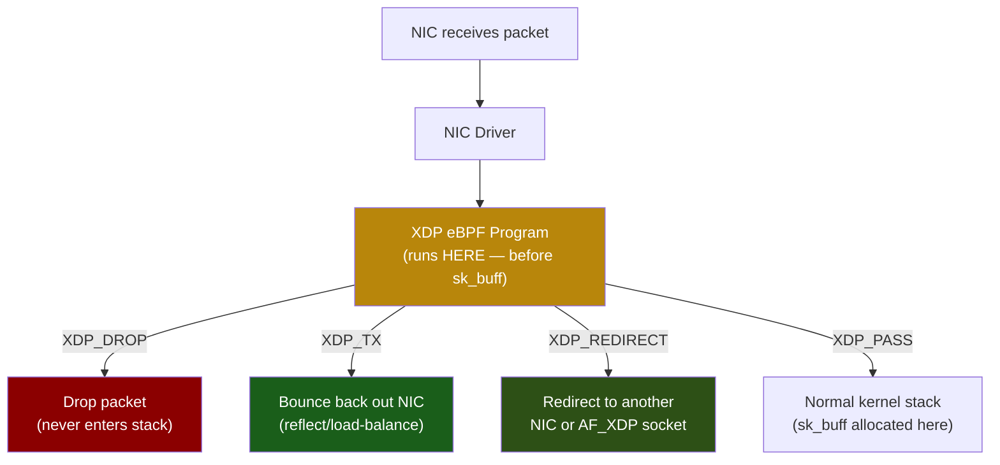

# Chapter 7: Kernel Bypass — DPDK and XDP 🔴

> **What you'll learn:**
> - Why even `io_uring` still traverses the kernel networking stack, and when that becomes the bottleneck.
> - How **DPDK** (Data Plane Development Kit) bypasses the kernel entirely by mapping NIC hardware directly into userspace.
> - How **XDP** (eXpress Data Path) and **eBPF** process packets at the NIC driver level without ever entering the networking stack.
> - The trade-offs, operational complexity, and use cases for each approach.

---

## The Final Frontier: Why Bypass the Kernel?

Even with `io_uring` in SQPOLL mode with registered buffers, every packet still flows through the **Linux networking stack**:

```
NIC → DMA → driver (softirq) → sk_buff → TCP/IP stack → socket buffer → io_uring CQE
```

This stack provides critical features — TCP reassembly, congestion control, firewall rules, `iptables`, cgroups, monitoring — but it adds:

- **~2–5 μs per packet** of processing overhead.
- **Memory allocation** for `sk_buff` objects per packet.
- **Interrupt overhead** (NAPI softirq processing).
- **Lock contention** on socket buffers and routing tables.

For most applications, this overhead is acceptable. But in three domains, it is not:

| Domain | Required Latency | Packet Rate | Why Kernel is Too Slow |
|---|---|---|---|
| **High-Frequency Trading** | < 1 μs wire-to-wire | ~10M pkt/sec | Every μs costs money |
| **Network Functions (NFV)** | < 10 μs | 100M+ pkt/sec | Must process at line rate |
| **Telco / 5G** | < 1 ms (guaranteed) | Millions+ pkt/sec | Jitter budget is microseconds |

## DPDK: Full Kernel Bypass

**DPDK** (originally by Intel, now Linux Foundation) gives your application direct access to the NIC hardware, bypassing the Linux kernel entirely:

```mermaid
graph TD
    subgraph "Traditional Path (via Kernel)"
        NIC1["NIC"] --> DRV["Kernel Driver<br/>(softirq)"]
        DRV --> TCP["TCP/IP Stack"]
        TCP --> SOCK["Socket Buffer"]
        SOCK --> RECV["recv() syscall"]
        RECV --> APP1["Application"]
    end

    subgraph "DPDK Path (Kernel Bypass)"
        NIC2["NIC"] -->|"DMA directly to<br/>userspace memory"| HUGEPG["HugePage-backed<br/>Packet Buffers<br/>(userspace)"]
        HUGEPG -->|"Poll-mode driver<br/>(no interrupts!)"| PMD["PMD (Poll-Mode Driver)<br/>in userspace"]
        PMD --> APP2["Application"]
    end

    style NIC1 fill:#8b0000,color:#fff
    style TCP fill:#8b4513,color:#fff
    style NIC2 fill:#1a5e1a,color:#fff
    style PMD fill:#1a5e1a,color:#fff
    style APP2 fill:#2d5016,color:#fff
```



### How DPDK Works

1. **Unbind the NIC** from the Linux kernel driver (`igb`, `ixgbe`, `i40e`, etc.).
2. **Bind it to a DPDK-compatible driver** (`vfio-pci` or `uio_pci_generic`) that maps the NIC's registers and DMA buffers into userspace.
3. **Allocate packet buffers** from HugePage-backed memory pools (avoids TLB misses on the data path).
4. **Poll the NIC** in a tight loop — no interrupts, no context switches. The CPU core dedicated to DPDK spins at 100%:

```c
// DPDK pseudo-code (C) — the hot loop
while (1) {
    // Poll the NIC's RX ring for new packets — no syscalls, no interrupts
    uint16_t nb_rx = rte_eth_rx_burst(port_id, queue_id, rx_pkts, MAX_BURST);

    for (int i = 0; i < nb_rx; i++) {
        struct rte_mbuf *pkt = rx_pkts[i];
        // Process packet directly — headers are in userspace memory
        process_packet(pkt);
    }

    // Send processed packets back out
    uint16_t nb_tx = rte_eth_tx_burst(port_id, queue_id, tx_pkts, nb_tx_ready);
}
```

### DPDK Latency Numbers

| Metric | Kernel Stack | `io_uring` | DPDK |
|---|---|---|---|
| **Wire-to-app latency** | ~15–50 μs | ~5–15 μs | ~1–3 μs |
| **Packets/sec (single core)** | ~1–2M | ~3–5M | **~14.8M** (line-rate 10G) |
| **Jitter (P99–P50)** | ~100 μs | ~20 μs | < 1 μs |
| **CPU usage model** | Interrupt-driven | Ring-poll + syscall | 100% busy-poll |

### DPDK Trade-offs

| Advantage | Disadvantage |
|---|---|
| Lowest possible latency | NIC is invisible to the kernel (`ifconfig` won't show it) |
| Deterministic (no interrupts/jitter) | Must re-implement TCP/IP (or use `f-stack`, `mTCP`) |
| Scales to line-rate on 100G NICs | Requires HugePages, dedicated cores, `vfio-pci` |
| Battle-tested in telco / finance | Application complexity: you own the full network stack |
| Multi-queue RSS for parallelism | Debugging is harder (no `tcpdump` by default) |

### DPDK in Rust

While DPDK's API is C, Rust bindings exist:

```rust
// Conceptual Rust wrapper around DPDK (simplified)
// Real implementations: `capsule`, `dpdk-rs`, or custom bindgen

/// Receive a burst of packets from the NIC (poll-mode, no syscall)
fn rx_burst(port: u16, queue: u16, max_pkts: usize) -> Vec<PacketBuffer> {
    let mut mbufs: Vec<*mut dpdk_sys::rte_mbuf> = vec![std::ptr::null_mut(); max_pkts];
    let nb_rx = unsafe {
        dpdk_sys::rte_eth_rx_burst(port, queue, mbufs.as_mut_ptr(), max_pkts as u16)
    };
    mbufs.truncate(nb_rx as usize);
    mbufs.into_iter().map(PacketBuffer::from_raw).collect()
}

/// Process packets in zero-copy fashion
fn process_packets(packets: &mut [PacketBuffer]) {
    for pkt in packets {
        let eth_header = pkt.eth_header();  // Direct pointer into DMA buffer
        let ip_header = pkt.ip_header();    // No copies — just pointer arithmetic

        match ip_header.protocol() {
            Protocol::TCP => handle_tcp(pkt),
            Protocol::UDP => handle_udp(pkt),
            _ => pkt.drop(),
        }
    }
}
```

## XDP: Programmable Packet Processing at the Driver Level

**XDP** (eXpress Data Path) takes a different approach than DPDK. Instead of bypassing the kernel entirely, XDP lets you inject **eBPF programs** that run at the earliest point in the kernel's packet receive path — *before* any `sk_buff` allocation:



### XDP Actions

| Action | Meaning | Use Case |
|---|---|---|
| `XDP_DROP` | Silently drop the packet | DDoS mitigation, firewall |
| `XDP_TX` | Send packet back out the same NIC | Load balancer, SYN cookie responder |
| `XDP_REDIRECT` | Forward to another NIC or AF_XDP socket | Forwarding, userspace processing |
| `XDP_PASS` | Continue to normal kernel stack | Default — packet processed as usual |

### AF_XDP: XDP's Userspace Fast Path

**AF_XDP** sockets give userspace access to XDP-redirected packets via shared memory (similar to `io_uring`'s ring buffers):

```
NIC → driver → XDP program (XDP_REDIRECT) → AF_XDP socket → userspace ring buffer
```

No `sk_buff` allocation, no TCP/IP stack traversal, no syscalls for receiving:

```c
// AF_XDP: Userspace receives raw frames via shared memory ring
struct xsk_ring_cons rx_ring;
struct xsk_ring_prod fill_ring;

// Poll for received packets
while (1) {
    uint32_t idx;
    unsigned int rcvd = xsk_ring_cons__peek(&rx_ring, BATCH_SIZE, &idx);

    for (int i = 0; i < rcvd; i++) {
        const struct xdp_desc *desc = xsk_ring_cons__rx_desc(&rx_ring, idx + i);
        uint8_t *pkt = xsk_umem__get_data(umem_area, desc->addr);
        process_raw_frame(pkt, desc->len);
    }

    xsk_ring_cons__release(&rx_ring, rcvd);
    // Refill the fill ring for the kernel to use
}
```

### XDP vs. DPDK

| Feature | DPDK | XDP/AF_XDP |
|---|---|---|
| **Kernel involvement** | None — full bypass | Minimal — eBPF at driver level |
| **NIC visibility to OS** | Invisible (`ifconfig` can't see it) | Visible — normal NIC management |
| **TCP/IP stack** | Must implement yourself | Available (XDP_PASS) |
| **Monitoring** | Custom tooling | Standard Linux tools work |
| **Raw performance** | Slightly faster | Within 10% of DPDK |
| **Deployment** | Complex (DPDK libraries, HugePages) | Simpler (just load eBPF program) |
| **Packet manipulation** | Full flexibility (C/C++/Rust) | Limited by eBPF verifier |
| **Use case** | Highest-performance data planes | Smart NICs, firewalls, load balancers |

### XDP in Rust with Aya

The **Aya** framework lets you write eBPF/XDP programs in Rust:

```rust
// XDP program (runs in kernel, compiled to eBPF)
// This example drops all UDP packets on port 9999
#![no_std]
#![no_main]

use aya_ebpf::{bindings::xdp_action, macros::xdp, programs::XdpContext};
use core::mem;

#[xdp]
pub fn xdp_drop_udp(ctx: XdpContext) -> u32 {
    match try_xdp_drop_udp(&ctx) {
        Ok(action) => action,
        Err(_) => xdp_action::XDP_PASS, // On error, pass to kernel
    }
}

fn try_xdp_drop_udp(ctx: &XdpContext) -> Result<u32, ()> {
    let eth_hdr = unsafe { ptr_at::<EthHeader>(ctx, 0)? };

    // Only process IPv4
    if eth_hdr.ether_type != ETH_P_IP.to_be() {
        return Ok(xdp_action::XDP_PASS);
    }

    let ip_hdr = unsafe { ptr_at::<IpHeader>(ctx, mem::size_of::<EthHeader>())? };

    // Only process UDP
    if ip_hdr.protocol != IPPROTO_UDP {
        return Ok(xdp_action::XDP_PASS);
    }

    let udp_hdr = unsafe {
        ptr_at::<UdpHeader>(ctx, mem::size_of::<EthHeader>() + (ip_hdr.ihl() as usize * 4))?
    };

    // Drop UDP packets to port 9999
    if udp_hdr.dest_port == 9999u16.to_be() {
        return Ok(xdp_action::XDP_DROP);
    }

    Ok(xdp_action::XDP_PASS)
}

# // Helper types and ptr_at omitted for brevity
```

## Choosing Your I/O Strategy

```
┌──────────────────────────────────────────────────────────────┐
│                    Decision Framework                        │
├──────────┬───────────────────┬───────────────────────────────┤
│ Latency  │ Approach          │ When to Use                   │
│ Budget   │                   │                               │
├──────────┼───────────────────┼───────────────────────────────┤
│ > 1 ms   │ epoll + threads   │ Web servers, APIs, databases  │
│ 100–1000 │ io_uring          │ Proxies, storage engines      │
│ μs       │                   │                               │
│ 10–100   │ io_uring + SQPOLL │ CDN edges, caching proxies    │
│ μs       │ + fixed bufs      │                               │
│ 1–10 μs  │ XDP / AF_XDP      │ Load balancers, firewalls,    │
│          │                   │ network functions              │
│ < 1 μs   │ DPDK              │ HFT, telco, packet processing │
└──────────┴───────────────────┴───────────────────────────────┘
```

---

<details>
<summary><strong>🏋️ Exercise: Write an XDP Packet Counter</strong> (click to expand)</summary>

**Challenge:**

1. Using the Aya framework (or pseudo-code), write an XDP program that counts packets per protocol (TCP, UDP, ICMP, Other) using eBPF maps.
2. Write the userspace loader that attaches the program to a network interface and periodically reads the counters.
3. **Bonus:** Extend the program to drop packets exceeding a rate limit (e.g., > 100K UDP packets/sec).

<details>
<summary>🔑 Solution</summary>

**eBPF/XDP program (kernel side):**

```rust
#![no_std]
#![no_main]

use aya_ebpf::{
    bindings::xdp_action,
    macros::{map, xdp},
    maps::PerCpuArray,
    programs::XdpContext,
};
use core::mem;

// Per-CPU array map: index 0=TCP, 1=UDP, 2=ICMP, 3=Other
#[map]
static PACKET_COUNTS: PerCpuArray<u64> = PerCpuArray::with_max_entries(4, 0);

const IDX_TCP: u32 = 0;
const IDX_UDP: u32 = 1;
const IDX_ICMP: u32 = 2;
const IDX_OTHER: u32 = 3;

#[xdp]
pub fn xdp_counter(ctx: XdpContext) -> u32 {
    let protocol_idx = match parse_protocol(&ctx) {
        Ok(6) => IDX_TCP,    // IPPROTO_TCP
        Ok(17) => IDX_UDP,   // IPPROTO_UDP
        Ok(1) => IDX_ICMP,   // IPPROTO_ICMP
        _ => IDX_OTHER,
    };

    // Increment the per-CPU counter (no locking needed!)
    if let Some(counter) = PACKET_COUNTS.get_ptr_mut(protocol_idx) {
        unsafe { *counter += 1; }
    }

    xdp_action::XDP_PASS // Pass all packets to the kernel
}

fn parse_protocol(ctx: &XdpContext) -> Result<u8, ()> {
    let eth_hdr: *const EthHeader = unsafe {
        let start = ctx.data();
        let end = ctx.data_end();
        let hdr = start as *const EthHeader;
        if start + mem::size_of::<EthHeader>() > end {
            return Err(());
        }
        hdr
    };

    // Only handle IPv4
    if unsafe { (*eth_hdr).ether_type } != 0x0008u16 {  // ETH_P_IP in network order
        return Err(());
    }

    let ip_hdr: *const IpHeader = unsafe {
        let offset = ctx.data() + mem::size_of::<EthHeader>();
        if offset + mem::size_of::<IpHeader>() > ctx.data_end() {
            return Err(());
        }
        offset as *const IpHeader
    };

    Ok(unsafe { (*ip_hdr).protocol })
}

# // EthHeader and IpHeader struct definitions omitted for brevity
```

**Userspace loader:**

```rust
use aya::{programs::Xdp, Ebpf};
use aya::maps::PerCpuArray;
use std::{thread, time::Duration};

fn main() -> anyhow::Result<()> {
    let mut bpf = Ebpf::load(include_bytes_aligned!(
        "path/to/xdp_counter_ebpf"
    ))?;

    // Attach XDP program to eth0
    let program: &mut Xdp = bpf.program_mut("xdp_counter")?.try_into()?;
    program.load()?;
    program.attach("eth0", aya::programs::XdpFlags::default())?;

    println!("XDP counter attached to eth0. Ctrl-C to stop.\n");

    // Periodically read counters
    loop {
        thread::sleep(Duration::from_secs(1));

        let counts: PerCpuArray<_, u64> =
            PerCpuArray::try_from(bpf.map("PACKET_COUNTS").unwrap())?;

        let proto_names = ["TCP", "UDP", "ICMP", "Other"];
        for (i, name) in proto_names.iter().enumerate() {
            let per_cpu_values = counts.get(&(i as u32), 0)?;
            let total: u64 = per_cpu_values.iter().sum();
            println!("{:>6}: {:>12} packets", name, total);
        }
        println!("---");
    }
}
```

**Expected output:**

```
   TCP:       123456 packets
   UDP:        78901 packets
  ICMP:          234 packets
 Other:           56 packets
---
```

Key insights:
- `PerCpuArray` avoids atomic contention — each CPU core has its own counter.
- Reading requires summing across all CPUs from userspace.
- The XDP program adds < 50 ns of overhead per packet.

</details>
</details>

---

> **Key Takeaways**
> - Even `io_uring` passes packets through the full Linux networking stack (~2–5 μs per packet).
> - **DPDK** bypasses the kernel entirely: the NIC DMAs packets into userspace HugePage buffers, polled by a busy-spinning thread. Wire-to-app latency: ~1–3 μs.
> - **XDP/eBPF** processes packets at the driver level *before* `sk_buff` allocation. It's simpler to deploy than DPDK and keeps the NIC visible to the OS.
> - **AF_XDP** sockets give userspace high-performance access to XDP-redirected packets via shared memory rings.
> - **DPDK** is the right choice when you need absolute minimum latency (< 1 μs) and can afford a dedicated core. **XDP** is the right choice for network functions that need to coexist with the normal kernel stack.
> - Writing XDP programs in **Rust** (via Aya) gives you memory safety guarantees even for eBPF code.

> **See also:**
> - [Chapter 6: io_uring](ch06-asynchronous-io-with-io-uring.md) — the step before kernel bypass.
> - [Chapter 8: Capstone](ch08-capstone-thread-per-core-proxy.md) — combining `io_uring` (or DPDK) with thread-per-core architecture.
> - [Hardcore Quantitative Finance](../quant-finance-book/src/SUMMARY.md) — DPDK in HFT matching engines.
> - [Hardcore Cloud Native](../cloud-native-book/src/SUMMARY.md) — eBPF/XDP in Kubernetes and Cilium.
