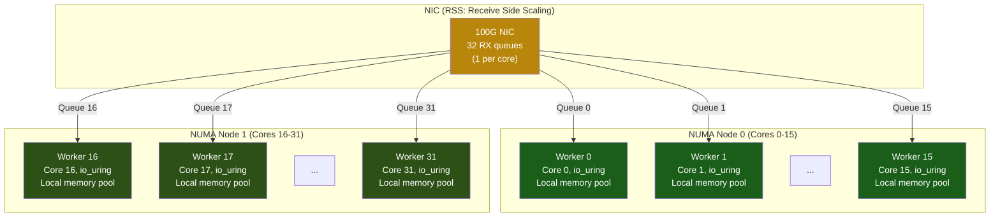

# Chapter 8: Capstone — Architect a Thread-Per-Core Proxy 🔴

> **What you'll learn:**
> - How to design an ultra-low-latency, high-throughput network proxy using **every technique** from this book.
> - The **Shared-Nothing, Thread-Per-Core** architecture that eliminates cross-thread contention.
> - How to combine **NUMA-aware thread pinning**, **`io_uring`**, **64-byte-aligned memory pools**, and **HugePages** into a cohesive production system.
> - A complete Staff-level system design walkthrough from blank whiteboard to architecture diagram.

---

## The Problem Statement

> **Design a network proxy** (similar to Envoy, HAProxy, or NGINX) that forwards TCP connections from clients to backend servers. It must handle:
> - **1 million concurrent connections**
> - **2 million requests/sec** sustained throughput
> - **< 50 μs P99 latency** added by the proxy
> - Running on a **2-socket, 32-core** server (16 cores per socket, 256 GB RAM per socket)

This is a realistic Staff/Principal engineer design challenge. Let's build it.

## Architecture Overview: Shared-Nothing, Thread-Per-Core

The fundamental insight: **locks are latency**. Any shared mutable state between threads causes cache-line bouncing (Chapter 2), contention, and unpredictable latency spikes. The solution is to **share nothing**.



### Design Principles

| Principle | Implementation | Chapter Reference |
|---|---|---|
| **No shared mutable state** | Each worker thread owns its connections, buffers, and state exclusively | Ch 2 (False Sharing) |
| **No locks** | Workers never contend on a mutex, rwlock, or atomic | Ch 2, Ch 4 |
| **No syscalls on the hot path** | `io_uring` with SQPOLL for all I/O | Ch 6 |
| **No memory allocation on the hot path** | Pre-allocated, pooled, cache-line-aligned buffers | Ch 1, Ch 3 |
| **No TLB misses on the hot path** | HugePage-backed memory pools | Ch 3 |
| **No context switches** | Thread pinning + `isolcpus` + `SCHED_FIFO` | Ch 4 |
| **No cross-NUMA traffic** | Memory allocated on the local NUMA node | Ch 4 |

## Component 1: NIC Configuration (RSS + Flow Steering)

**Receive Side Scaling (RSS)** distributes incoming packets across NIC RX queues using a hash of the source/destination IP and port. Each queue is assigned to exactly one core:

```bash
# Configure RSS: 32 queues, one per core
ethtool -L eth0 combined 32

# Pin IRQs: queue i → core i
for i in $(seq 0 31); do
    echo $i > /proc/irq/$(cat /proc/interrupts | grep "eth0-TxRx-$i" | awk '{print $1}' | tr -d :)/smp_affinity_list
done

# Verify: each queue's interrupt goes to exactly one core
cat /proc/interrupts | grep eth0
```

**Result:** All packets for a given connection (identified by the 4-tuple hash) always arrive at the same core. No cross-core synchronization needed.

## Component 2: Worker Thread Lifecycle

Each worker thread is pinned to a core and owns everything it needs:

```rust
use io_uring::IoUring;
use std::collections::HashMap;

/// Each worker is a self-contained event loop — no shared state.
struct Worker {
    core_id: usize,
    numa_node: usize,
    ring: IoUring,
    connections: HashMap<u64, Connection>,
    buffer_pool: BufferPool,
    stats: WorkerStats,
}

/// Per-connection state — entirely owned by one worker.
struct Connection {
    client_fd: i32,
    backend_fd: i32,
    state: ConnState,
    client_buf: PooledBuffer, // from worker's local pool
    backend_buf: PooledBuffer,
}

#[repr(C, align(64))] // ✅ Each Connection on its own cache line(s)
struct ConnState {
    bytes_forwarded: u64,
    last_active_ns: u64,
    flags: u32,
    _pad: [u8; 44],
}

impl Worker {
    fn new(core_id: usize, numa_node: usize) -> Self {
        // Pin this thread to the specified core
        pin_to_core(core_id);
        // Bind memory allocations to the local NUMA node
        bind_memory_to_node(numa_node as i32);

        // Create io_uring with SQPOLL (zero syscalls on hot path)
        let ring = IoUring::builder()
            .setup_sqpoll(1000)
            .build(4096)
            .expect("failed to create io_uring");

        // Pre-allocate buffer pool from HugePage-backed memory
        let buffer_pool = BufferPool::new_on_numa_node(
            numa_node,
            65536,  // 64K buffers
            4096,   // 4 KB each
        );

        Worker {
            core_id,
            numa_node,
            ring,
            connections: HashMap::with_capacity(65536),
            buffer_pool,
            stats: WorkerStats::default(),
        }
    }

    /// The hot loop — runs forever on a single core.
    fn run(&mut self) -> ! {
        loop {
            // Step 1: Harvest completions from io_uring (no syscall — SQPOLL)
            self.process_completions();

            // Step 2: Submit new I/O operations (no syscall — SQPOLL)
            self.submit_pending_io();

            // Step 3: Periodic maintenance (connection timeouts, stats reporting)
            self.maybe_maintenance();
        }
    }

    fn process_completions(&mut self) {
        while let Some(cqe) = self.ring.completion().next() {
            let conn_id = cqe.user_data() >> 8;
            let op_type = (cqe.user_data() & 0xFF) as u8;
            let result = cqe.result();

            if let Some(conn) = self.connections.get_mut(&conn_id) {
                match op_type {
                    OP_CLIENT_READ => self.on_client_data(conn_id, result),
                    OP_BACKEND_WRITE => self.on_backend_written(conn_id, result),
                    OP_BACKEND_READ => self.on_backend_data(conn_id, result),
                    OP_CLIENT_WRITE => self.on_client_written(conn_id, result),
                    _ => {}
                }
            }
        }
    }

    fn on_client_data(&mut self, conn_id: u64, bytes: i32) {
        if bytes <= 0 {
            self.close_connection(conn_id);
            return;
        }
        // Forward client data to backend — submit io_uring write
        // Buffer is already populated by the read completion
        // No copy needed — same buffer used for read and write
        self.submit_backend_write(conn_id, bytes as u32);
        self.stats.bytes_forwarded += bytes as u64;
    }

    fn submit_pending_io(&mut self) {
        // io_uring SQPOLL will pick up SQEs automatically — no submit() needed
        // But we may need to wake the kernel thread if it went idle:
        if self.ring.submission().is_full() {
            let _ = self.ring.submit();
        }
    }

    fn maybe_maintenance(&mut self) {
        // Run every ~1000 iterations (avoid syscalls for clock reads)
        // Use RDTSC for cheap timestamps
    }

    fn close_connection(&mut self, _conn_id: u64) { /* ... */ }
    fn submit_backend_write(&mut self, _conn_id: u64, _len: u32) { /* ... */ }
}

const OP_CLIENT_READ: u8 = 1;
const OP_BACKEND_WRITE: u8 = 2;
const OP_BACKEND_READ: u8 = 3;
const OP_CLIENT_WRITE: u8 = 4;

fn pin_to_core(_core: usize) { /* see Chapter 4 */ }
fn bind_memory_to_node(_node: i32) { /* see Chapter 4 */ }
```

## Component 3: Memory Pool Design

The buffer pool must be:
1. **Pre-allocated** — no `malloc` on the hot path (avoids page faults, Ch 3).
2. **HugePage-backed** — minimize TLB misses (Ch 3).
3. **Cache-line-aligned** — prevent false sharing between connection buffers (Ch 2).
4. **NUMA-local** — allocated on the same socket as the worker thread (Ch 4).

```rust
use std::ptr;

/// A slab allocator for fixed-size buffers, backed by HugePages.
struct BufferPool {
    base: *mut u8,
    buf_size: usize,
    capacity: usize,
    free_list: Vec<usize>, // indices of free buffers
}

struct PooledBuffer {
    ptr: *mut u8,
    len: usize,
    pool_index: usize,
}

impl BufferPool {
    fn new_on_numa_node(numa_node: usize, count: usize, buf_size: usize) -> Self {
        // Ensure buffer size is a multiple of cache line size
        let aligned_size = (buf_size + 63) & !63; // ✅ 64-byte alignment
        let total_size = aligned_size * count;

        // Allocate from HugePages on the specified NUMA node
        let base = unsafe {
            // Set NUMA memory policy to local node
            let mask: u64 = 1 << numa_node;
            libc::syscall(
                libc::SYS_set_mempolicy,
                libc::MPOL_BIND,
                &mask as *const u64,
                64u64,
            );

            let ptr = libc::mmap(
                ptr::null_mut(),
                total_size,
                libc::PROT_READ | libc::PROT_WRITE,
                libc::MAP_PRIVATE | libc::MAP_ANONYMOUS | libc::MAP_HUGETLB,
                -1,
                0,
            );
            assert_ne!(ptr, libc::MAP_FAILED, "HugePages mmap failed");

            // Pre-fault all pages (avoid minor page faults on hot path)
            for offset in (0..total_size).step_by(4096) {
                ptr::write_volatile((ptr as *mut u8).add(offset), 0);
            }

            // Reset memory policy
            libc::syscall(libc::SYS_set_mempolicy, libc::MPOL_DEFAULT, ptr::null::<u64>(), 0u64);

            ptr as *mut u8
        };

        let free_list = (0..count).rev().collect(); // stack-based free list

        BufferPool {
            base,
            buf_size: aligned_size,
            capacity: count,
            free_list,
        }
    }

    fn alloc(&mut self) -> Option<PooledBuffer> {
        self.free_list.pop().map(|idx| {
            let ptr = unsafe { self.base.add(idx * self.buf_size) };
            PooledBuffer {
                ptr,
                len: self.buf_size,
                pool_index: idx,
            }
        })
    }

    fn free(&mut self, buf: PooledBuffer) {
        self.free_list.push(buf.pool_index);
    }
}

// ✅ No global allocator calls on the hot path.
// ✅ HugePage-backed: minimal TLB misses.
// ✅ 64-byte aligned: no false sharing between adjacent buffers.
// ✅ NUMA-local: allocated on the worker's socket.
```

## Component 4: Putting It All Together

```rust
fn main() {
    // Parse config, discover topology
    let num_cores = 32;
    let cores_per_node = 16;

    // System setup (run once at startup)
    setup_system();

    // Spawn one worker per core
    let mut handles = Vec::new();
    for core_id in 0..num_cores {
        let numa_node = core_id / cores_per_node;
        let handle = std::thread::Builder::new()
            .name(format!("worker-{core_id}"))
            .stack_size(2 * 1024 * 1024) // 2 MB stack
            .spawn(move || {
                let mut worker = Worker::new(core_id, numa_node);
                worker.run() // never returns
            })
            .expect("failed to spawn worker");
        handles.push(handle);
    }

    // Main thread: monitoring, config reload, graceful shutdown
    for handle in handles {
        let _ = handle.join();
    }
}

fn setup_system() {
    // Verify system configuration
    println!("=== System Configuration Check ===");

    // 1. Check HugePages
    let hp = std::fs::read_to_string("/proc/meminfo")
        .unwrap_or_default();
    println!("HugePages: {}", if hp.contains("HugePages_Total") {
        "configured"
    } else {
        "WARNING: not configured"
    });

    // 2. Check isolated CPUs
    let isolated = std::fs::read_to_string("/sys/devices/system/cpu/isolated")
        .unwrap_or_default();
    println!("Isolated CPUs: {}", isolated.trim());

    // 3. Check NUMA topology
    println!("NUMA nodes: check `numactl --hardware`");
}

#[derive(Default)]
struct WorkerStats {
    bytes_forwarded: u64,
    connections_active: u64,
    connections_total: u64,
}
```

## System Configuration Checklist

```bash
# 1. Reserve HugePages (2 MB pages, 4096 of them = 8 GB)
echo 4096 > /proc/sys/vm/nr_hugepages

# 2. Isolate cores 0-31 for the proxy (leave cores 32-33 for OS)
# In /etc/default/grub:
GRUB_CMDLINE_LINUX="isolcpus=0-31 nohz_full=0-31 rcu_nocbs=0-31 irqaffinity=32-33"

# 3. Configure NIC RSS
ethtool -L eth0 combined 32

# 4. Pin NIC IRQs to isolated cores (1:1 mapping)
# (see script above)

# 5. Disable Transparent HugePages compaction (we use explicit HugePages)
echo never > /sys/kernel/mm/transparent_hugepage/enabled

# 6. Disable CPU frequency scaling (lock to max frequency)
for cpu in /sys/devices/system/cpu/cpu*/cpufreq/scaling_governor; do
    echo performance > "$cpu"
done

# 7. Disable ASLR for deterministic memory layout (optional, security trade-off)
# echo 0 > /proc/sys/kernel/randomize_va_space
```

## Performance Budget Analysis

| Component | Latency Budget | Technique |
|---|---|---|
| **Receive packet** | ~1 μs | `io_uring` SQPOLL, zero-copy recv |
| **Parse headers** | ~0.2 μs | Hot data in L1, branch-free parsing |
| **Route decision** | ~0.1 μs | Hash-table lookup, cache-friendly |
| **Forward to backend** | ~1 μs | `io_uring` SQPOLL, zero-copy send |
| **Backend response** | ~1 μs | Same as receive |
| **Forward to client** | ~1 μs | Same as forward |
| **Total proxy overhead** | **~4–5 μs** | Well within 50 μs P99 budget |
| **Headroom** | ~45 μs | For GC, memory pool expansion, logging |

## Comparing Architectures

| Architecture | Throughput | P99 Latency | Complexity |
|---|---|---|---|
| **Thread-per-request** (Java/Go) | Low | ~1–10 ms | Low |
| **Event loop + thread pool** (NGINX) | Medium | ~100–500 μs | Medium |
| **Work-stealing** (Tokio) | High | ~50–200 μs | Medium |
| **Thread-per-core + `io_uring`** (this design) | Very High | ~10–50 μs | High |
| **Thread-per-core + DPDK** (HFT) | Maximum | ~1–5 μs | Very High |

---

<details>
<summary><strong>🏋️ Exercise: Design Review — Find the Bottlenecks</strong> (click to expand)</summary>

**Challenge:**

You're reviewing the capstone proxy design. Identify and fix the following hidden bottlenecks:

1. The `connections` HashMap uses the standard library's `HashMap` with the default hasher. What's the performance problem, and what should you replace it with?

2. The `WorkerStats` struct is read by a monitoring thread every second. What cache-coherence issue does this create, and how do you fix it?

3. The proxy needs to reload its routing configuration without downtime. How do you distribute new config to all 32 workers without shared mutable state?

4. A single worker receives an unusually large connection that consumes all its buffers. How do you prevent this from affecting other connections on the same worker?

<details>
<summary>🔑 Solution</summary>

**1. HashMap Hasher:**

The default `HashMap` uses `SipHash-1-3` — cryptographically resistant to HashDoS but **~5× slower** than non-cryptographic hashers for small keys (like connection IDs).

```rust
// 💥 SLOW: Default SipHash
use std::collections::HashMap;
let connections: HashMap<u64, Connection> = HashMap::new();

// ✅ FIX: Use a fast, non-cryptographic hasher for internal lookups.
// Connection IDs are not attacker-controlled, so HashDoS resistance
// is unnecessary.
use rustc_hash::FxHashMap;
let connections: FxHashMap<u64, Connection> = FxHashMap::default();
// FxHash: ~1 ns per lookup vs ~5 ns for SipHash
```

**2. WorkerStats False Sharing:**

If a monitoring thread reads `WorkerStats` while the worker writes to it, the cache line bounces between cores (Chapter 2).

```rust
// 💥 PERFORMANCE HAZARD: Monitoring thread reads stats.bytes_forwarded,
// causing the cache line to transition S→I→S repeatedly.

// ✅ FIX: Workers write to a thread-local stats struct. The monitoring
// thread reads a SNAPSHOT that the worker publishes periodically
// (e.g., every 100ms) via a SeqLock or atomic store.
#[repr(C, align(64))]  // Own cache line
struct WorkerStats {
    // Written only by the worker
    bytes_forwarded: u64,
    connections_active: u64,
    connections_total: u64,
    _pad: [u8; 40],
}

// Snapshot published for monitoring (separate cache line)
#[repr(C, align(64))]
struct StatsSnapshot {
    bytes_forwarded: std::sync::atomic::AtomicU64,
    connections_active: std::sync::atomic::AtomicU64,
    _pad: [u8; 48],
}
```

**3. Configuration Reload:**

Use a **generation-based RCU (Read-Copy-Update)** pattern:

```rust
use std::sync::Arc;
use std::sync::atomic::{AtomicPtr, Ordering};

/// Global config pointer (atomic swap for lock-free updates)
static CONFIG: AtomicPtr<ProxyConfig> = AtomicPtr::new(std::ptr::null_mut());

struct ProxyConfig {
    routes: Vec<Route>,
    generation: u64,
}

/// Called by the control plane to reload config
fn reload_config(new_config: ProxyConfig) {
    let boxed = Box::into_raw(Box::new(new_config));
    let old = CONFIG.swap(boxed, Ordering::Release);
    // Defer freeing `old` until all workers have moved past it
    // (epoch-based reclamation or RCU grace period)
    schedule_deferred_free(old);
}

/// Called by workers to read current config (lock-free)
fn current_config() -> &'static ProxyConfig {
    let ptr = CONFIG.load(Ordering::Acquire);
    unsafe { &*ptr }
}
```

Workers check the config generation periodically (e.g., once per 1000 completions). No locks, no contention.

**4. Per-Connection Buffer Limits:**

```rust
const MAX_BUFFERS_PER_CONNECTION: usize = 16; // 64 KB max in-flight

struct Connection {
    client_fd: i32,
    backend_fd: i32,
    buffers_allocated: usize, // track usage
    // ...
}

impl Worker {
    fn alloc_buffer_for(&mut self, conn: &mut Connection) -> Option<PooledBuffer> {
        if conn.buffers_allocated >= MAX_BUFFERS_PER_CONNECTION {
            // Back-pressure: stop reading from this connection
            // Apply TCP flow control by not submitting more reads
            return None;
        }
        self.buffer_pool.alloc().map(|buf| {
            conn.buffers_allocated += 1;
            buf
        })
    }
}
```

This enforces fairness between connections on the same worker without any locks.

</details>
</details>

---

> **Key Takeaways**
> - The **thread-per-core, shared-nothing** architecture eliminates lock contention, false sharing, and cross-core cache invalidation at the cost of higher design complexity.
> - **RSS + CPU pinning** ensures each connection's packets always arrive at the same core — zero cross-thread coordination.
> - **`io_uring` with SQPOLL** eliminates syscalls from the hot path. Combined with fixed buffers and registered fds, the I/O path is near-optimal.
> - **NUMA-aware, HugePage-backed memory pools** eliminate TLB misses and cross-socket memory accesses.
> - **Every component** must be cache-line-aligned: connection state, buffer pool metadata, stats counters.
> - This architecture achieves **< 50 μs P99** and **2M+ req/sec** on commodity hardware — competitive with commercial proxies.

> **See also:**
> - [Chapter 1: Latency Numbers](ch01-latency-numbers-and-cpu-caches.md) — the cache hierarchy that makes this design necessary.
> - [Chapter 2: False Sharing](ch02-cache-coherence-and-false-sharing.md) — why we align everything to 64 bytes.
> - [Chapter 4: Scheduler](ch04-scheduler-and-context-switching.md) — thread pinning and `isolcpus`.
> - [Chapter 6: io_uring](ch06-asynchronous-io-with-io-uring.md) — the I/O substrate.
> - [Zero-Copy Architecture](../zero-copy-book/src/SUMMARY.md) — the broader patterns (Glommio, shared-nothing runtimes).
