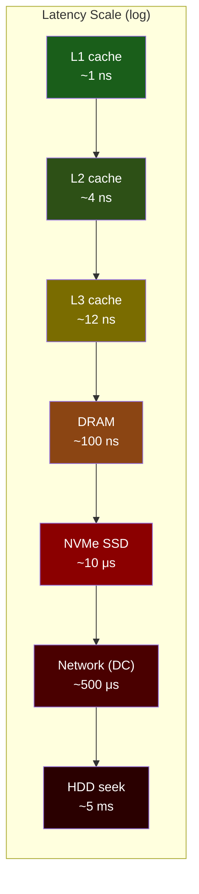

# Appendix A: Summary & Reference Card

> A quick-reference for latency numbers, Linux performance commands, CPU cache tuning parameters, and the key decisions from each chapter. Print this out, tape it to your monitor, and bring it to system design interviews.

---

## Latency Numbers Every Programmer Should Know



| Operation | Latency | Cycles @ 4 GHz | Notes |
|---|---|---|---|
| L1 cache hit | **~1 ns** | 4 | 32–64 KB per core |
| Branch mispredict | ~3 ns | 12 | Pipeline flush |
| L2 cache hit | **~4 ns** | 16 | 256 KB–1 MB per core |
| L3 cache hit | **~12 ns** | 48 | 8–64 MB shared |
| MESI invalidation (cross-core) | ~40–80 ns | 160–320 | False sharing penalty |
| **DRAM access** | **~60–100 ns** | 240–400 | The memory wall |
| Remote NUMA DRAM | ~140 ns | 560 | Cross-socket |
| TLB miss + page walk | ~10–40 ns | 40–160 | 4-level walk |
| Context switch (direct) | ~1–5 μs | 4K–20K | Registers + TLB flush |
| Context switch (indirect) | ~5–50 μs | 20K–200K | Cache warm-up |
| `epoll_wait` syscall | ~200–500 ns | 800–2K | User→kernel transition |
| `recv()` syscall | ~300–800 ns | 1.2K–3.2K | + data copy |
| `io_uring` submit (normal) | ~100–300 ns | 400–1.2K | Ring write + `io_uring_enter` |
| `io_uring` submit (SQPOLL) | **~10–30 ns** | 40–120 | Just ring write |
| NVMe SSD read (4 KB) | ~10 μs | 40K | Queue depth matters |
| Network RTT (same DC) | ~500 μs | 2M | 1 rack ≈ 200 μs |
| SSD sequential read (1 MB) | ~100 μs | 400K | ~10 GB/s |
| HDD random seek | ~5 ms | 20M | Mechanical latency |
| TCP handshake (same DC) | ~1.5 ms | 6M | 3 RTTs |

## Linux `perf` Command Reference

### Cache & Memory

```bash
# L1/L2/L3 cache miss rates
perf stat -e L1-dcache-loads,L1-dcache-load-misses,\
LLC-loads,LLC-load-misses -- ./program

# TLB misses
perf stat -e dTLB-load-misses,dTLB-store-misses,\
iTLB-load-misses -- ./program

# Memory bandwidth (Intel)
perf stat -e offcore_response.all_data_rd.any_response -- ./program

# False sharing detection
perf c2c record -- ./program
perf c2c report --stdio
```

### Scheduling & Context Switches

```bash
# Context switches and CPU migrations
perf stat -e context-switches,cpu-migrations -- ./program

# Per-thread context switch counts
cat /proc/<PID>/status | grep ctxt

# System-wide context switch rate
vmstat 1
```

### Syscall Overhead

```bash
# Count syscalls
perf stat -e raw_syscalls:sys_enter -- ./program

# Specific syscall counts
perf stat -e syscalls:sys_enter_epoll_wait,\
syscalls:sys_enter_recvfrom,\
syscalls:sys_enter_sendto -- ./program

# Trace syscall latency
strace -c -f -- ./program
```

### Profiling & Flamegraphs

```bash
# Record CPU profile (sampling)
perf record -g -F 99 -- ./program
perf report

# Generate flamegraph
perf record -g -F 99 -- ./program
perf script | stackcollapse-perf.pl | flamegraph.pl > flamegraph.svg
```

## CPU Cache Tuning Cheat Sheet

| Technique | When to Use | How |
|---|---|---|
| **Cache-line alignment** | Any shared mutable data between threads | `#[repr(align(64))]` or `crossbeam::CachePadded<T>` |
| **Struct field reordering** | Hot/cold field split | Put frequently-accessed fields first in `#[repr(C)]` |
| **Array-of-Structs → Struct-of-Arrays** | When iterating over one field across many items | Split struct into separate `Vec`s per field |
| **Prefetching** | Predictable access patterns with known strides | `_mm_prefetch` intrinsic or trust the HW prefetcher |
| **Loop tiling / blocking** | Matrix operations, stencil computations | Process data in cache-sized blocks |
| **Avoid pointer chasing** | Hash tables, trees, linked structures | Use arena allocation, indices instead of pointers |

## Memory & TLB Tuning Cheat Sheet

| Technique | When to Use | How |
|---|---|---|
| **HugePages (2 MB)** | Working set > 6 MB (TLB coverage) | `mmap(MAP_HUGETLB)` or `echo N > /proc/sys/vm/nr_hugepages` |
| **HugePages (1 GB)** | Working set > 3 GB | Boot-time reservation, `mmap` with `MAP_HUGE_1GB` |
| **THP (madvise)** | General large allocations | `echo madvise > /sys/.../transparent_hugepage/enabled` |
| **Pre-fault pages** | Latency-sensitive hot path | Touch every page at startup |
| **NUMA-local allocation** | Multi-socket servers | `numactl --cpunodebind=N --membind=N` or `set_mempolicy` |
| **Avoid `munmap`** | Reduce TLB shootdowns | Use memory pools; recycle, don't deallocate |
| **mlockall** | Prevent swapping | `libc::mlockall(MCL_CURRENT \| MCL_FUTURE)` |

## Scheduler & Thread Tuning Cheat Sheet

| Technique | When to Use | How |
|---|---|---|
| **Thread pinning** | Latency-critical workers | `sched_setaffinity(core_id)` |
| **Core isolation** | Eliminate OS interference | Kernel param: `isolcpus=N-M` |
| **Timer tick disable** | Prevent preemption on isolated cores | Kernel param: `nohz_full=N-M` |
| **RCU offload** | Prevent RCU callbacks on hot cores | Kernel param: `rcu_nocbs=N-M` |
| **IRQ affinity** | Route interrupts away from hot cores | Kernel param: `irqaffinity=0-K` |
| **`SCHED_FIFO`** | Priority over CFS threads | `sched_setscheduler(SCHED_FIFO, priority)` |
| **CPU governor** | Lock frequency to max | `echo performance > .../scaling_governor` |

## I/O Strategy Decision Matrix

| Latency Budget | Connections | Approach | Syscalls/op |
|---|---|---|---|
| > 1 ms | < 10K | `epoll` + blocking thread pool | ~2 |
| 100 μs–1 ms | 10K–100K | `epoll` edge-triggered | ~1 |
| 10–100 μs | 100K–1M | `io_uring` (normal mode) | ~0.01 |
| 1–10 μs | 100K–1M | `io_uring` + SQPOLL + fixed buffers | **0** |
| < 1 μs | Any | DPDK (full kernel bypass) | **0** |
| < 10 μs (filtering) | Any | XDP/eBPF | N/A (in-kernel) |

## Key Formulas

**Cache line utilization:**
$$
\text{Utilization} = \frac{\text{Useful bytes accessed}}{\text{Cache lines fetched} \times 64}
$$

**TLB coverage:**
$$
\text{TLB coverage} = \text{TLB entries} \times \text{Page size}
$$
- 4 KB pages, 1536 entries: $1536 \times 4\text{KB} = 6\text{MB}$
- 2 MB pages, 1536 entries: $1536 \times 2\text{MB} = 3\text{GB}$

**False sharing probability** (N threads, random variables in M cache lines):
$$
P(\text{sharing}) = 1 - \left(\frac{M-1}{M}\right)^{N-1}
$$

**io_uring throughput** (batch size B, submit latency S):
$$
\text{Ops/sec} = \frac{B}{S}
$$

## Chapter Quick Reference

| Chapter | Key Insight | Action Item |
|---|---|---|
| **1. Latency Numbers** | DRAM is 100× slower than L1 | Measure with `perf stat`; design for L1 hits |
| **2. False Sharing** | Same cache line = shared fate | Pad to 64 bytes; use `perf c2c` |
| **3. Virtual Memory** | TLB covers only 6 MB with 4 KB pages | Use HugePages; pre-fault; avoid `munmap` |
| **4. Scheduler** | Context switches pollute caches | Pin threads; `isolcpus`; `SCHED_FIFO` |
| **5. epoll Limits** | Each `recv()`/`send()` is a syscall + copy | Batch aggressively; measure syscall rate |
| **6. io_uring** | Shared-memory rings eliminate syscalls | Use SQPOLL + fixed buffers + registered fds |
| **7. Kernel Bypass** | The kernel stack adds 2–5 μs/pkt | DPDK for < 1 μs; XDP for programmable fast path |
| **8. Capstone** | Shared-nothing + thread-per-core | No locks, no sharing, pin everything, measure everything |

---

> **Final word:** Hardware sympathy is not about memorizing numbers — it's about building accurate mental models of what the hardware is doing underneath your code. The numbers change with every CPU generation. The *principles* — locality, alignment, avoiding contention, eliminating copies — are eternal. **Always measure. Never guess.**
