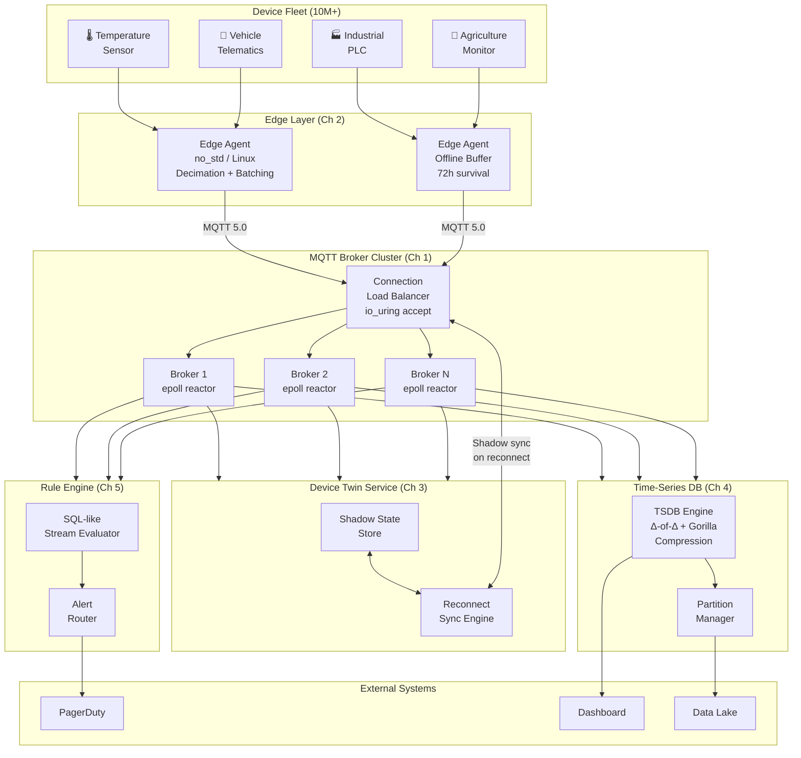

# System Design: The Global IoT Telemetry Gateway

## Speaker Intro

This handbook is written from the perspective of a **Principal IoT Architect** who has designed, deployed, and operated telemetry platforms ingesting billions of data points per day from fleets of physical devices—industrial sensors, connected vehicles, agricultural monitors, and smart-city infrastructure. The content draws from first-hand experience at the intersection of embedded systems programming, high-throughput message brokering, edge computing, and time-series analytics across cellular, satellite, and LPWAN networks.

## Who This Is For

- **Embedded and systems engineers** who ship firmware to physical devices and want to understand what happens to sensor data *after* it leaves the MCU's UART.
- **Backend engineers** who have built REST APIs but need to design a platform that handles 10 million persistent TCP connections from devices that speak MQTT, not HTTP.
- **IoT platform architects** evaluating Rust for the data plane—replacing C/C++ on the edge and Java/Go in the cloud broker tier—and who need proof that one language can span the entire stack.
- **Anyone who has *used* AWS IoT Core, Azure IoT Hub, or EMQX** and wants to understand the internal mechanics—connection multiplexing, device twins, rule engines, and time-series compression—by building one from scratch.

## Prerequisites

| Concept | Where to Learn |
|---|---|
| Intermediate Rust (ownership, traits, `async`) | [Async Rust](../async-book/src/SUMMARY.md) |
| TCP networking and socket programming | [Tokio Internals](../tokio-internals-book/src/SUMMARY.md) |
| MQTT protocol basics (publish, subscribe, QoS) | [MQTT v5 Specification](https://docs.oasis-open.org/mqtt/mqtt/v5.0/mqtt-v5.0.html) |
| Familiarity with `no_std` and embedded Rust | [Rust for C/C++ Programmers](../c-cpp-book/src/SUMMARY.md) |
| Linux syscalls (`epoll`, `io_uring`, `sendfile`) | [Hardware Sympathy](../hardware-sympathy-book/src/SUMMARY.md) |

## How to Use This Book

| Emoji | Meaning |
|---|---|
| 🟢 | **Architecture** — foundational design decisions, protocol trade-offs, system topology |
| 🟡 | **Protocol / Edge** — embedded agents, offline-first patterns, device-to-cloud synchronization |
| 🔴 | **Time-Series DB** — custom storage engines, compression algorithms, streaming rule evaluation |

Each chapter solves **one specific bottleneck or failure mode** in the telemetry pipeline. Read them in order—later chapters assume the broker, edge agent, and device twin from earlier chapters exist.

## The Problem We Are Solving

> Design a **global IoT telemetry gateway** capable of ingesting sensor data from **10 million concurrently connected devices**, surviving intermittent connectivity, synchronizing device state bidirectionally, storing **billions of time-series data points** with sub-second compression, and routing events in real-time to alerting systems—all on commodity hardware with a minimal memory footprint.

The system we will build has these non-negotiable requirements:

| Requirement | Target |
|---|---|
| Concurrent MQTT connections | ≥ 10 M persistent TCP sessions |
| Message ingestion rate | ≥ 2 M msgs/sec (128-byte average payload) |
| Edge offline survival | 72 hours of local buffering on a 64 MB RAM device |
| Device twin sync latency | < 500 ms from reconnect to full state convergence |
| TSDB compression ratio | ≥ 12:1 for typical sensor streams |
| Rule evaluation throughput | ≥ 500 K events/sec per rule engine instance |
| Alert latency (event → PagerDuty) | < 2 seconds end-to-end |

## Pacing Guide

| Chapter | Topic | Time | Checkpoint |
|---|---|---|---|
| Ch 0 | Introduction & Problem Statement | 30 min | Understand the design canvas |
| Ch 1 | MQTT Broker and the C10M Problem | 8–10 hours | Working MQTT broker accepting 1 M connections |
| Ch 2 | Edge Computing and Data Decimation | 6–8 hours | `no_std` edge agent with offline-first batching |
| Ch 3 | The Device Twin (Shadow State) | 5–7 hours | Bidirectional state sync with version vectors |
| Ch 4 | The Time-Series Database (TSDB) | 8–10 hours | Custom TSDB with delta-of-delta + Gorilla compression |
| Ch 5 | Rule Engines and Event Routing | 6–8 hours | SQL-like streaming rule engine triggering alerts |

**Total: ~34–44 hours** of focused study.

## Table of Contents

### Part I: Ingestion at Scale
- **Chapter 1 — The MQTT Broker and the C10M Problem 🟢** — Why HTTP is too heavy for embedded sensors. Architecting a highly concurrent MQTT broker in Rust using `epoll`/`io_uring`. Handling 10 million concurrent persistent TCP connections on a minimal hardware footprint.

### Part II: The Intelligent Edge
- **Chapter 2 — Edge Computing and Data Decimation 🟡** — Not all data belongs in the cloud. Designing an embedded Rust agent (`no_std` or lightweight Linux) that sits on the physical device. Implementing local data decimation and batching to survive cellular network dropouts (offline-first).
- **Chapter 3 — The Device Twin (Shadow State) 🟡** — How to send a command to a device that is currently offline. Architecting the "Device Twin" pattern—a cloud-side JSON representation of the device's state that synchronizes the moment the device reconnects.

### Part III: Storage and Intelligence
- **Chapter 4 — The Time-Series Database (TSDB) 🔴** — Storing billions of temperature/speed data points. Why relational databases fail here. Architecting a custom time-series engine using delta-of-delta encoding to compress timestamps and Gorilla compression for floating-point values.
- **Chapter 5 — Rule Engines and Event Routing 🔴** — Evaluating streaming data in real-time. Building an in-memory rule engine that evaluates SQL-like syntax (e.g., `SELECT * WHERE engine_temp > 100`) against the incoming MQTT stream to trigger PagerDuty alerts instantly.

## Architecture Overview

## Companion Guides

This handbook builds on concepts from several other books in the Rust Training curriculum:

| Companion | Relevant Chapters |
|---|---|
| [Async Rust](../async-book/src/SUMMARY.md) | Tokio runtime, futures, cancellation safety |
| [Tokio Internals](../tokio-internals-book/src/SUMMARY.md) | `epoll` reactor, work-stealing scheduler |
| [Hardware Sympathy](../hardware-sympathy-book/src/SUMMARY.md) | CPU caches, io_uring, DPDK, zero-copy I/O |
| [Zero-Copy Architecture](../zero-copy-book/src/SUMMARY.md) | io_uring, rkyv, shared-nothing design |
| [Rust for C/C++ Programmers](../c-cpp-book/src/SUMMARY.md) | `no_std`, embedded Rust, FFI |
| [System Design: Message Broker](../system-design-book/src/SUMMARY.md) | Append-only log, Raft consensus, backpressure |
| [Embedded Rust](../embedded-book/src/SUMMARY.md) | HAL, PAC, RTIC, bare-metal Rust |
