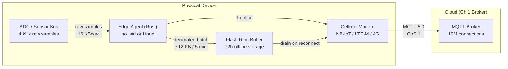
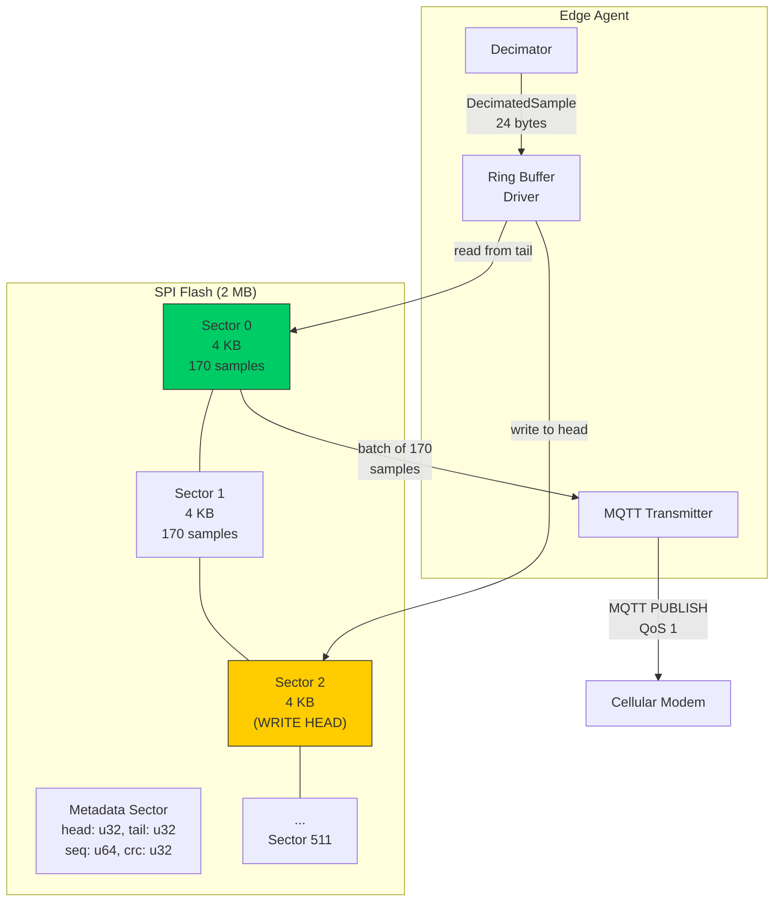
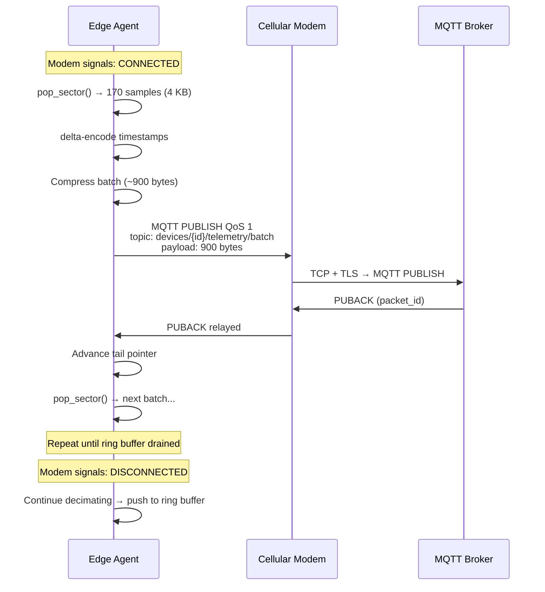

# 2. Edge Computing and Data Decimation 🟡

> **The Problem:** A vibration sensor on an industrial motor samples at 4 kHz, producing 4,000 × 4 bytes = 16 KB/sec of raw data. Over a $0.50/MB cellular link, that's $691/month *per sensor*. Worse, cellular connections drop for minutes or hours in rural deployments (farms, mines, offshore rigs). Sending every raw sample to the cloud is economically ruinous and physically impossible during outages. We need an **embedded Rust agent** running on the device itself that performs local data decimation, batches transmissions, and survives 72 hours of network blackout—all within 64 MB of RAM and a 200 MHz ARM Cortex-M4 (or a lightweight Linux gateway).

---

## The Data Funnel: Why Not Send Everything?

| Stage | Data Rate | Cost at $0.50/MB | Notes |
|---|---|---|---|
| Raw ADC samples (4 kHz, 32-bit) | 16 KB/sec | $691/mo | Impossible over NB-IoT |
| After decimation (1 Hz summary) | 40 bytes/sec | $1.73/mo | 400× reduction |
| After batching (5-min windows) | ~12 KB every 5 min | $0.35/mo with compression | Amortizes TCP/TLS overhead |
| With offline buffering | Same, delayed | $0.35/mo | No data loss during outages |

The edge agent sits between the physical sensor and the network, acting as a **local intelligent filter**:



---

## Architecture: Two Target Platforms

The edge agent must run on two classes of hardware:

| Property | `no_std` (Bare-Metal) | Lightweight Linux (Gateway) |
|---|---|---|
| Target | ARM Cortex-M4, RISC-V | Raspberry Pi, industrial gateways |
| RAM | 64 KB – 512 KB | 64 MB – 512 MB |
| Storage | 2 MB SPI flash | 4 GB eMMC / SD |
| OS | RTIC / Embassy | Linux (musl, static binary) |
| Networking | AT-command modem (UART) | TCP/IP via OS stack |
| Allocator | `static` buffers or `alloc` with bump allocator | System allocator |
| MQTT library | Custom minimal, `no_std` | `rumqttc` or custom |
| Offline buffer | Flash ring buffer | File-backed ring buffer |

We design the core decimation and batching logic as a **platform-agnostic `no_std` crate** with feature flags:

```rust,ignore
// edge-agent-core/Cargo.toml
// [features]
// default = []
// std = []                  # Enables file I/O for Linux targets
// alloc = []                # Enables Vec/String for gateway targets
// embassy = ["dep:embassy-time"]  # Bare-metal async runtime

#![cfg_attr(not(feature = "std"), no_std)]

#[cfg(feature = "alloc")]
extern crate alloc;
```

---

## Data Decimation: From 4 kHz to 1 Hz

Decimation means reducing data volume while preserving **statistically meaningful summaries**. For each 1-second window of 4,000 raw samples, we compute:

```
┌─────────────────────────────────────────────────────────┐
│  Decimated Sample (1 Hz output):                        │
│                                                         │
│  timestamp : u32   — Unix epoch seconds                 │
│  min       : f32   — Minimum value in window            │
│  max       : f32   — Maximum value in window            │
│  mean      : f32   — Arithmetic mean                    │
│  rms       : f32   — Root Mean Square (vibration power) │
│  count     : u16   — Samples in window (for validation) │
│  flags     : u8    — Clipping, saturation, gap detect   │
│  _pad      : u8    — Alignment                          │
│                                                         │
│  Total: 24 bytes per decimated sample                   │
│  Compression ratio: 16,000 bytes → 24 bytes = 667×      │
└─────────────────────────────────────────────────────────┘
```

### The Streaming Accumulator: Zero Allocation

The decimator processes one raw sample at a time with O(1) memory — no `Vec`, no heap:

```rust,ignore
#![cfg_attr(not(feature = "std"), no_std)]

/// A single decimated 1-second summary — 24 bytes, repr(C) for
/// deterministic layout when serialized to flash or wire.
#[repr(C)]
#[derive(Clone, Copy, Debug)]
pub struct DecimatedSample {
    pub timestamp: u32,
    pub min: f32,
    pub max: f32,
    pub mean: f32,
    pub rms: f32,
    pub count: u16,
    pub flags: u8,
    pub _pad: u8,
}

/// Streaming accumulator — computes min/max/mean/RMS over a window
/// of raw samples without any allocation. Welford's online algorithm
/// for numerically stable mean computation.
pub struct Decimator {
    window_start: u32,         // Unix epoch second for current window
    window_samples: u16,       // Number of raw samples ingested
    sum: f64,                  // Running sum for mean
    sum_sq: f64,               // Running sum of squares for RMS
    min: f32,
    max: f32,
    flags: u8,
    samples_per_window: u16,   // Expected count (e.g., 4000 for 4 kHz)
}

const FLAG_CLIPPING: u8   = 0x01;
const FLAG_SATURATION: u8 = 0x02;
const FLAG_GAP: u8        = 0x04;

impl Decimator {
    /// Create a new decimator for the given sample rate.
    pub const fn new(samples_per_window: u16) -> Self {
        Self {
            window_start: 0,
            window_samples: 0,
            sum: 0.0,
            sum_sq: 0.0,
            min: f32::MAX,
            max: f32::MIN,
            flags: 0,
            samples_per_window,
        }
    }

    /// Start a new window at the given timestamp.
    pub fn begin_window(&mut self, timestamp: u32) {
        self.window_start = timestamp;
        self.window_samples = 0;
        self.sum = 0.0;
        self.sum_sq = 0.0;
        self.min = f32::MAX;
        self.max = f32::MIN;
        self.flags = 0;
    }

    /// Ingest a single raw ADC sample. O(1) time and memory.
    pub fn push(&mut self, value: f32) {
        self.window_samples += 1;
        let v64 = value as f64;
        self.sum += v64;
        self.sum_sq += v64 * v64;

        if value < self.min {
            self.min = value;
        }
        if value > self.max {
            self.max = value;
        }

        // Detect anomalies.
        if value >= f32::MAX * 0.99 || value <= f32::MIN * 0.99 {
            self.flags |= FLAG_SATURATION;
        }
    }

    /// Finalize the window and emit a decimated sample.
    /// Returns `None` if no samples were pushed.
    pub fn finalize(&self) -> Option<DecimatedSample> {
        if self.window_samples == 0 {
            return None;
        }

        let count = self.window_samples as f64;
        let mean = (self.sum / count) as f32;
        let rms = libm::sqrt(self.sum_sq / count) as f32;

        let mut flags = self.flags;
        if self.window_samples < self.samples_per_window {
            flags |= FLAG_GAP; // Missing samples — network or ADC glitch
        }

        Some(DecimatedSample {
            timestamp: self.window_start,
            min: self.min,
            max: self.max,
            mean,
            rms,
            count: self.window_samples,
            flags,
            _pad: 0,
        })
    }
}
```

> **Why `libm::sqrt` instead of `f64::sqrt()`?** On `no_std` targets without hardware FPU, the standard library's `sqrt` is unavailable. The `libm` crate provides a pure-Rust software implementation.

---

## Offline-First: The Flash Ring Buffer

When the cellular modem reports no signal, the edge agent must store decimated samples locally and drain them when connectivity returns. We implement a **ring buffer on SPI flash** (bare-metal) or a **file-backed ring buffer** (Linux):



### Ring Buffer Implementation

```rust,ignore
/// Platform-agnostic ring buffer over a sector-based storage medium.
/// Works with SPI flash (bare-metal) or files (Linux).
///
/// Layout:
///   Sector 0: Metadata (head, tail, sequence number, CRC)
///   Sector 1..N: Data sectors, each holding `SECTOR_SIZE / 24` samples
pub struct RingBuffer<S: SectorStorage> {
    storage: S,
    head: u32,         // Next sector to write
    tail: u32,         // Next sector to read (drain)
    seq: u64,          // Monotonic sequence number
    sector_count: u32, // Total data sectors (excluding metadata)
    write_buf: [u8; SECTOR_SIZE], // Accumulates samples before flush
    write_pos: usize,  // Current position in write_buf
}

const SECTOR_SIZE: usize = 4096;
const SAMPLE_SIZE: usize = 24; // size_of::<DecimatedSample>()
const SAMPLES_PER_SECTOR: usize = SECTOR_SIZE / SAMPLE_SIZE; // 170

/// Trait abstracting over SPI flash (bare-metal) or file I/O (Linux).
pub trait SectorStorage {
    type Error;

    /// Erase a sector (required before write on NOR flash).
    fn erase_sector(&mut self, sector: u32) -> Result<(), Self::Error>;

    /// Write exactly `SECTOR_SIZE` bytes to a sector.
    fn write_sector(&mut self, sector: u32, data: &[u8; SECTOR_SIZE])
        -> Result<(), Self::Error>;

    /// Read exactly `SECTOR_SIZE` bytes from a sector.
    fn read_sector(&mut self, sector: u32, buf: &mut [u8; SECTOR_SIZE])
        -> Result<(), Self::Error>;
}

impl<S: SectorStorage> RingBuffer<S> {
    /// Append a decimated sample to the ring buffer.
    /// Flushes to storage when the write buffer is full.
    pub fn push(&mut self, sample: &DecimatedSample) -> Result<(), S::Error> {
        let bytes: &[u8; SAMPLE_SIZE] = unsafe {
            &*(sample as *const DecimatedSample as *const [u8; SAMPLE_SIZE])
        };

        self.write_buf[self.write_pos..self.write_pos + SAMPLE_SIZE]
            .copy_from_slice(bytes);
        self.write_pos += SAMPLE_SIZE;

        if self.write_pos + SAMPLE_SIZE > SECTOR_SIZE {
            self.flush_sector()?;
        }

        Ok(())
    }

    /// Flush the current write buffer to the next sector.
    fn flush_sector(&mut self) -> Result<(), S::Error> {
        let target = self.head + 1; // +1 because sector 0 is metadata
        self.storage.erase_sector(target)?;
        self.storage.write_sector(target, &self.write_buf)?;

        self.head = (self.head + 1) % self.sector_count;
        self.seq += 1;
        self.write_pos = 0;
        self.write_buf = [0xFF; SECTOR_SIZE];

        // If head catches tail, advance tail (oldest data lost).
        if self.head == self.tail {
            self.tail = (self.tail + 1) % self.sector_count;
        }

        self.persist_metadata()?;
        Ok(())
    }

    /// Read the oldest unread sector for transmission.
    /// Returns `None` if the buffer is empty.
    pub fn pop_sector(
        &mut self,
        buf: &mut [u8; SECTOR_SIZE],
    ) -> Result<Option<u32>, S::Error> {
        if self.tail == self.head {
            return Ok(None); // Empty
        }

        let source = self.tail + 1;
        self.storage.read_sector(source, buf)?;

        let count = SAMPLES_PER_SECTOR as u32;
        self.tail = (self.tail + 1) % self.sector_count;
        self.persist_metadata()?;

        Ok(Some(count))
    }

    fn persist_metadata(&mut self) -> Result<(), S::Error> {
        let mut meta = [0xFF_u8; SECTOR_SIZE];
        meta[0..4].copy_from_slice(&self.head.to_le_bytes());
        meta[4..8].copy_from_slice(&self.tail.to_le_bytes());
        meta[8..16].copy_from_slice(&self.seq.to_le_bytes());

        // CRC32 of head + tail + seq for crash recovery.
        let crc = crc32_of(&meta[0..16]);
        meta[16..20].copy_from_slice(&crc.to_le_bytes());

        self.storage.erase_sector(0)?;
        self.storage.write_sector(0, &meta)?;
        Ok(())
    }
}

fn crc32_of(data: &[u8]) -> u32 {
    // CRC32 lookup-table implementation (no_std compatible).
    let mut crc: u32 = 0xFFFF_FFFF;
    for &byte in data {
        let idx = ((crc ^ byte as u32) & 0xFF) as usize;
        crc = CRC32_TABLE[idx] ^ (crc >> 8);
    }
    !crc
}

/// Precomputed CRC32 table (IEEE polynomial).
static CRC32_TABLE: [u32; 256] = {
    let mut table = [0u32; 256];
    let mut i = 0;
    while i < 256 {
        let mut crc = i as u32;
        let mut j = 0;
        while j < 8 {
            if crc & 1 != 0 {
                crc = (crc >> 1) ^ 0xEDB8_8320;
            } else {
                crc >>= 1;
            }
            j += 1;
        }
        table[i] = crc;
        i += 1;
    }
    table
};
```

### Offline Capacity Calculation

| Flash Size | Sectors (4 KB each) | Samples (24 bytes each) | Duration at 1 Hz | Duration at 0.2 Hz (5-sec) |
|---|---|---|---|---|
| 512 KB | 128 | 21,760 | ~6 hours | ~30 hours |
| 2 MB | 512 | 87,040 | ~24 hours | ~5 days |
| 8 MB | 2,048 | 348,160 | ~4 days | ~20 days |

With 2 MB of SPI flash and 1 Hz decimated output, the device survives **24 hours offline**. At the more typical 5-second reporting interval (0.2 Hz), that extends to **5 days** — well beyond our 72-hour requirement.

---

## Batching and Compression for Transmission

When the modem signals connectivity, we don't send one sample at a time (each MQTT PUBLISH has ~5 bytes overhead + topic). Instead, we batch an entire sector (170 samples) into one PUBLISH:



### Delta Encoding for Timestamps

Consecutive 1-second timestamps are perfectly correlated. Instead of sending absolute `u32` values, we send the **first timestamp** and then **deltas** (almost always `1`):

```rust,ignore
/// Delta-encode an array of timestamps in-place.
/// First element stays absolute; subsequent elements become deltas.
/// Returns the number of bytes needed for the delta-encoded representation.
pub fn delta_encode_timestamps(samples: &mut [DecimatedSample]) -> usize {
    if samples.len() <= 1 {
        return samples.len() * 4;
    }

    // Work backwards to avoid overwriting values we still need.
    for i in (1..samples.len()).rev() {
        let delta = samples[i].timestamp.wrapping_sub(samples[i - 1].timestamp);
        samples[i].timestamp = delta;
    }

    // First timestamp: 4 bytes (absolute).
    // Remaining: most deltas are 1, encodable in 1 byte with varint.
    4 + (samples.len() - 1) // Best case: 173 bytes for 170 timestamps
}
```

### Batch Compression Results

| Encoding | Size for 170 Samples | Compression vs Raw |
|---|---|---|
| Raw `DecimatedSample` × 170 | 4,080 bytes | 1× |
| Delta timestamps + raw values | ~3,500 bytes | 1.17× |
| Delta timestamps + zstd level 1 | ~900 bytes | 4.5× |
| Delta timestamps + zstd level 3 | ~780 bytes | 5.2× |

At 900 bytes per batch of 170 samples (2.8 minutes of data at 1 Hz), the cellular cost drops to **$0.08/month** per sensor.

---

## The Connection Manager: Resilient MQTT Client

The edge agent's MQTT client must handle the hostile reality of cellular networks — connections that drop without TCP FIN, DNS failures, TLS handshake timeouts, and broker-initiated disconnects:

```rust,ignore
/// Connection states for the edge MQTT client.
/// Transitions are driven by modem events and MQTT responses.
#[derive(Clone, Copy, Debug, PartialEq)]
pub enum ConnState {
    /// No network. Samples accumulate in ring buffer.
    Offline,
    /// Modem has IP connectivity. Attempting TCP + TLS + MQTT CONNECT.
    Connecting { attempt: u8 },
    /// MQTT CONNACK received. Draining ring buffer and sending live data.
    Online,
    /// MQTT DISCONNECT or TCP reset detected. Backing off before retry.
    Backoff { until: u32 },
}

/// Exponential backoff with jitter for reconnection attempts.
pub fn backoff_delay(attempt: u8) -> u32 {
    // Base: 1 second, max: 300 seconds (5 minutes), with ±25% jitter.
    let base: u32 = 1;
    let max_delay: u32 = 300;
    let exp = base.saturating_mul(1u32 << attempt.min(8));
    let clamped = exp.min(max_delay);

    // Simple LCG-based jitter (no_std compatible, no rand crate).
    // Jitter range: [75%, 125%] of computed delay.
    let jitter_factor = 75 + (clamped % 51); // 75..125
    clamped * jitter_factor / 100
}

/// Main connection state machine. Called from the agent's main loop.
pub fn drive_connection(
    state: &mut ConnState,
    now: u32,
    modem_online: bool,
    mqtt_connected: bool,
) -> Action {
    match *state {
        ConnState::Offline => {
            if modem_online {
                *state = ConnState::Connecting { attempt: 0 };
                Action::StartMqttConnect
            } else {
                Action::Sleep(5) // Check modem every 5 seconds
            }
        }
        ConnState::Connecting { attempt } => {
            if mqtt_connected {
                *state = ConnState::Online;
                Action::DrainRingBuffer
            } else if attempt >= 10 {
                *state = ConnState::Backoff {
                    until: now + backoff_delay(attempt),
                };
                Action::Sleep(backoff_delay(attempt))
            } else {
                *state = ConnState::Connecting {
                    attempt: attempt + 1,
                };
                Action::StartMqttConnect
            }
        }
        ConnState::Online => {
            if !mqtt_connected || !modem_online {
                *state = ConnState::Backoff {
                    until: now + backoff_delay(0),
                };
                Action::Sleep(backoff_delay(0))
            } else {
                Action::SendLiveData
            }
        }
        ConnState::Backoff { until } => {
            if now >= until {
                if modem_online {
                    *state = ConnState::Connecting { attempt: 0 };
                    Action::StartMqttConnect
                } else {
                    *state = ConnState::Offline;
                    Action::Sleep(5)
                }
            } else {
                Action::Sleep(until - now)
            }
        }
    }
}

#[derive(Debug)]
pub enum Action {
    Sleep(u32),
    StartMqttConnect,
    DrainRingBuffer,
    SendLiveData,
}
```

---

## Power Management: Sleep-First Design

On battery-powered devices, the cellular modem consumes 100–500 mW continuously. The edge agent controls the modem's power state:

| Mode | Modem State | CPU State | Power | Duration |
|---|---|---|---|---|
| **Deep Sleep** | OFF | Stop mode | ~10 µW | Between sampling windows |
| **Sampling** | OFF | Active (decimation) | ~5 mW | 1 second per window |
| **Transmit** | ON (connected) | Active (batching + MQTT) | ~500 mW | 2–10 sec per batch |
| **Idle Connected** | PSM (Power Save Mode) | Light sleep | ~50 µW | Between transmissions |

### Duty Cycle Example

For a sensor reporting every 5 seconds, transmitting every 5 minutes:

```
  0s          5s         10s     ...    300s
  │           │           │              │
  ┌─┐         ┌─┐         ┌─┐            ┌────────────┐
  │S│ sleep   │S│ sleep   │S│  ...  sleep│S │ TX batch │
  └─┘         └─┘         └─┘            └────────────┘
  5mW         5mW         5mW            500mW for ~3s
  1ms         1ms         1ms

  Average power:
    Sampling:  60 windows × 1ms × 5mW    = 0.30 mJ
    Transmit:  1 batch × 3s × 500mW      = 1500 mJ
    Sleep:     297s × 10µW                = 2.97 mJ
    ─────────────────────────────────────────────
    Total per 5-min cycle:                ≈ 1503 mJ
    Average power:                        ≈ 5.0 mW
    On a 3000 mAh @ 3.7V (39,960 J) battery: ~92 days
```

---

> **Key Takeaways**
>
> 1. **Data decimation at the edge reduces bandwidth by 400–667×** compared to sending raw samples, cutting cellular costs from hundreds of dollars to cents per month.
> 2. **The streaming accumulator pattern** (push one sample at a time, finalize per window) uses O(1) memory and works on `no_std` targets with no heap allocation.
> 3. **Flash ring buffers** provide crash-safe offline storage. With 2 MB of SPI flash, a device survives 5+ days of cellular blackout at typical reporting rates.
> 4. **Batch transmission with delta encoding and compression** further reduces per-message overhead by 4–5× on top of decimation, making even NB-IoT (20 KB/s) viable for dense sensor fleets.
> 5. **The connection state machine** must handle the reality of cellular networks: silent drops, DNS failures, and broker-initiated disconnects, with exponential backoff and jitter.
> 6. **Sleep-first power management** keeps the modem off for 98%+ of the time, extending battery life from days to months on a single charge.
