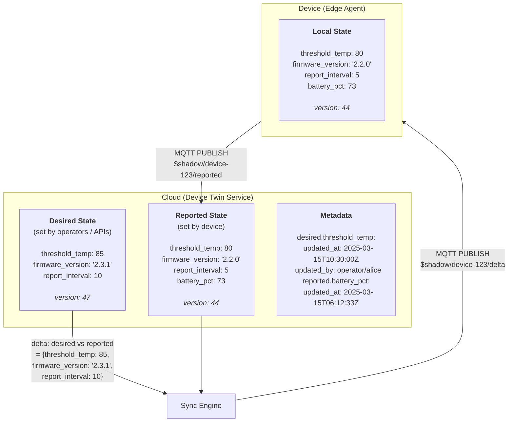
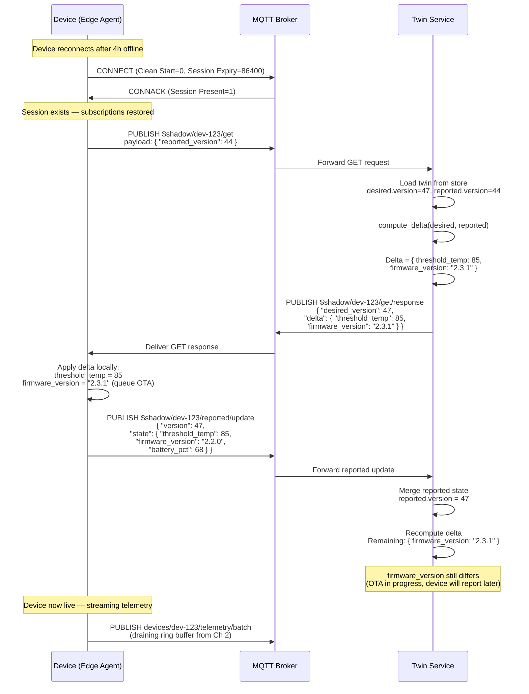
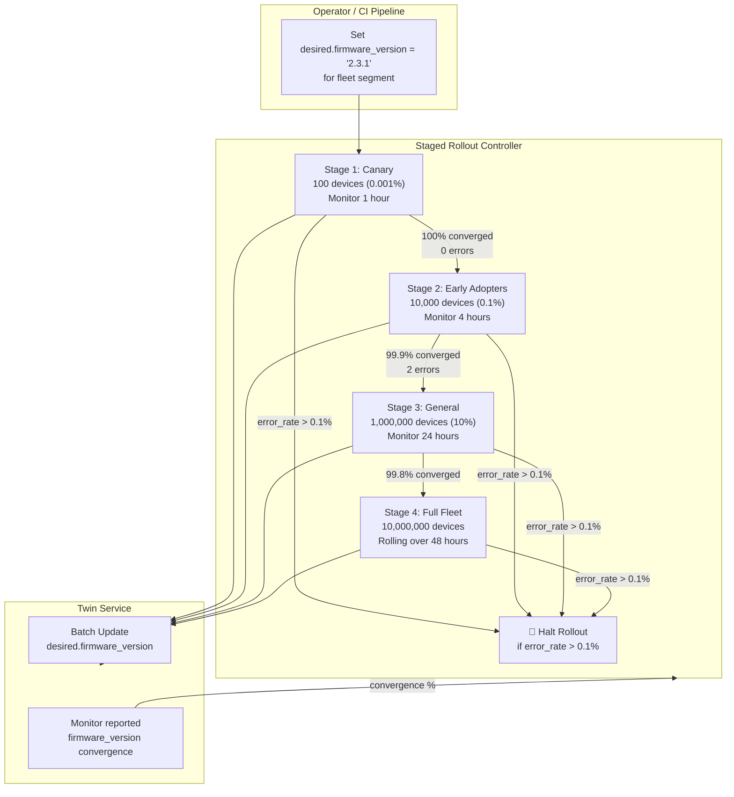

# 3. The Device Twin (Shadow State) 🟡

> **The Problem:** You need to set a new temperature threshold on a sensor deployed in a remote mine. The device is currently offline — it lost cellular signal 4 hours ago and won't reconnect for another 2 hours. With a naive command-response pattern, your command is simply lost. You can't queue it because you don't know *when* the device will come back, and the device doesn't know what it missed. We need a **Device Twin** — a cloud-side JSON shadow of the device's last-known state and desired configuration. The moment the device reconnects, the twin computes a **delta** and synchronizes the device to the cloud's desired state, while the device uploads its actual state to the cloud. This bidirectional sync must be conflict-free, even when both sides change the same field while disconnected.

---

## The Device Twin Mental Model

The twin is split into three documents:



| Document | Written By | Purpose |
|---|---|---|
| **Desired** | Cloud operators, APIs, rule engine | What the device *should* look like |
| **Reported** | Device (edge agent) | What the device *actually* looks like |
| **Metadata** | System (auto-generated) | Timestamps and attribution for each field change |

### Why Three Documents?

A single "state" document creates an **ownership conflict**: who wins when the operator sets `threshold_temp: 85` while the device simultaneously reports `threshold_temp: 80` (because it hasn't received the command yet)?

By splitting desired vs. reported, both sides can write independently. The **delta** (desired - reported) tells the device exactly what to change, and the absence of a delta means the device is converged.

---

## Data Model and Versioning

```rust,ignore
use std::collections::HashMap;
use serde::{Deserialize, Serialize};

/// The complete Device Twin, stored per device in the twin service.
#[derive(Debug, Clone, Serialize, Deserialize)]
pub struct DeviceTwin {
    pub device_id: String,
    pub desired: TwinDocument,
    pub reported: TwinDocument,
    pub metadata: TwinMetadata,
}

/// A versioned JSON document with arbitrary nested key-value pairs.
#[derive(Debug, Clone, Serialize, Deserialize)]
pub struct TwinDocument {
    /// Monotonically increasing version number.
    /// Incremented on every update (desired or reported independently).
    pub version: u64,
    /// The actual state — nested JSON object.
    pub properties: serde_json::Value,
}

/// Per-field metadata tracking who changed what and when.
#[derive(Debug, Clone, Serialize, Deserialize)]
pub struct TwinMetadata {
    pub desired: HashMap<String, FieldMeta>,
    pub reported: HashMap<String, FieldMeta>,
}

#[derive(Debug, Clone, Serialize, Deserialize)]
pub struct FieldMeta {
    pub updated_at: u64,    // Unix millis
    pub updated_by: String, // "operator/alice" or "device/self"
}
```

### Version Vectors for Conflict-Free Merges

Simple version counters don't handle **concurrent offline changes** on both sides. Consider:

1. Operator sets `desired.report_interval = 10` (desired version 47).
2. Device (offline) changes its local `report_interval = 15` (for power saving).
3. Device reconnects. Who wins?

We use a **version vector** — a pair `(desired_version, reported_version)` — to detect and resolve conflicts:

```rust,ignore
/// A version vector tracking both sides of the twin.
#[derive(Debug, Clone, Copy, PartialEq, Eq, Serialize, Deserialize)]
pub struct VersionVector {
    pub desired: u64,
    pub reported: u64,
}

/// Result of comparing two version vectors.
#[derive(Debug, PartialEq)]
pub enum VersionOrder {
    /// a dominates b (a is strictly newer).
    Dominates,
    /// b dominates a (b is strictly newer).
    DominatedBy,
    /// Concurrent changes — needs merge policy.
    Concurrent,
    /// Identical versions.
    Equal,
}

impl VersionVector {
    pub fn compare(&self, other: &VersionVector) -> VersionOrder {
        let d = self.desired.cmp(&other.desired);
        let r = self.reported.cmp(&other.reported);

        use std::cmp::Ordering::*;
        match (d, r) {
            (Equal, Equal) => VersionOrder::Equal,
            (Greater | Equal, Greater | Equal) => VersionOrder::Dominates,
            (Less | Equal, Less | Equal) => VersionOrder::DominatedBy,
            _ => VersionOrder::Concurrent,
        }
    }
}
```

**Merge policy for concurrent conflicts:** Desired always wins. The operator's intent takes precedence — if they set a value while the device was offline, the device must converge to it. The device's reported value is preserved in the `reported` document for auditing but the operational state is overwritten.

---

## Delta Computation: What Changed?

When a device reconnects, we compute the **delta** between `desired` and `reported` to produce the minimal set of changes:

```rust,ignore
use serde_json::Value;

/// Compute the delta: fields present in `desired` that differ from
/// or are absent in `reported`. Returns `None` if they're identical.
pub fn compute_delta(desired: &Value, reported: &Value) -> Option<Value> {
    match (desired, reported) {
        (Value::Object(d), Value::Object(r)) => {
            let mut delta = serde_json::Map::new();

            for (key, desired_val) in d {
                match r.get(key) {
                    Some(reported_val) => {
                        // Both sides have this key — recurse for nested objects.
                        if let Some(nested_delta) =
                            compute_delta(desired_val, reported_val)
                        {
                            delta.insert(key.clone(), nested_delta);
                        }
                    }
                    None => {
                        // Key exists in desired but not reported — include it.
                        delta.insert(key.clone(), desired_val.clone());
                    }
                }
            }

            if delta.is_empty() {
                None // Fully converged
            } else {
                Some(Value::Object(delta))
            }
        }
        _ => {
            // Leaf values: include in delta if different.
            if desired != reported {
                Some(desired.clone())
            } else {
                None
            }
        }
    }
}

#[cfg(test)]
mod tests {
    use super::*;
    use serde_json::json;

    #[test]
    fn test_delta_detects_changed_fields() {
        let desired = json!({
            "threshold_temp": 85,
            "firmware_version": "2.3.1",
            "report_interval": 10
        });

        let reported = json!({
            "threshold_temp": 80,
            "firmware_version": "2.2.0",
            "report_interval": 10,
            "battery_pct": 73
        });

        let delta = compute_delta(&desired, &reported).unwrap();

        // Only changed fields appear in the delta.
        assert_eq!(delta, json!({
            "threshold_temp": 85,
            "firmware_version": "2.3.1"
        }));
    }

    #[test]
    fn test_converged_twin_returns_none() {
        let state = json!({"threshold_temp": 85});
        assert!(compute_delta(&state, &state).is_none());
    }
}
```

---

## The Sync Protocol: MQTT Topics and Message Flow

The device twin communicates over a set of well-known MQTT topics per device:

| Topic | Direction | Purpose |
|---|---|---|
| `$shadow/{id}/desired/update` | Cloud → Broker → Device | Operator changes desired state |
| `$shadow/{id}/reported/update` | Device → Broker → Cloud | Device reports actual state |
| `$shadow/{id}/delta` | Cloud → Device | Computed delta on reconnect |
| `$shadow/{id}/get` | Device → Cloud | Device requests full twin (initial sync) |
| `$shadow/{id}/get/response` | Cloud → Device | Full twin document response |

### Reconnection Sync Sequence



---

## The Twin Store: Choosing the Right Backend

The twin service needs to store and query 10 million twin documents with:
- **Single-key reads** (by device ID) — for delta computation on reconnect.
- **Range queries** — "all devices where `reported.firmware_version` < '2.3.0'" for fleet-wide OTA.
- **Atomic read-modify-write** — for safe concurrent updates from operator API and device.

| Backend | Single-Key Read | Range Query | Atomic RMW | 10M Documents |
|---|---|---|---|---|
| **Redis (JSON)** | ~0.1 ms | Limited | Lua scripts | ~30 GB RAM |
| **PostgreSQL (JSONB)** | ~1 ms (indexed) | GIN index | `FOR UPDATE` | Works, but JSONB writes are slow |
| **DynamoDB** | ~5 ms | GSI on version | Conditional writes | Scales infinitely |
| **RocksDB (embedded)** | ~0.05 ms | Prefix scan | Single-writer | Lowest latency, most control |

For our architecture (co-located with the broker), **RocksDB** offers the lowest latency and avoids external dependencies:

```rust,ignore
use serde::{Deserialize, Serialize};

/// Twin store backed by RocksDB with JSON serialization.
pub struct TwinStore {
    db: rocksdb::DB,
}

impl TwinStore {
    pub fn open(path: &str) -> Result<Self, rocksdb::Error> {
        let mut opts = rocksdb::Options::default();
        opts.create_if_missing(true);
        opts.set_compression_type(rocksdb::DBCompressionType::Zstd);

        // Optimize for point lookups (bloom filter on full key).
        let mut block_opts = rocksdb::BlockBasedOptions::default();
        block_opts.set_bloom_filter(10.0, false);
        opts.set_block_based_table_factory(&block_opts);

        let db = rocksdb::DB::open(&opts, path)?;
        Ok(Self { db })
    }

    /// Get a device twin by ID. Returns `None` if not found.
    pub fn get(&self, device_id: &str) -> Result<Option<DeviceTwin>, StoreError> {
        let key = format!("twin:{device_id}");
        match self.db.get(key.as_bytes())? {
            Some(bytes) => {
                let twin: DeviceTwin = serde_json::from_slice(&bytes)?;
                Ok(Some(twin))
            }
            None => Ok(None),
        }
    }

    /// Atomic read-modify-write using RocksDB merge operator.
    /// Applies an update function to the twin under a lock-free CAS loop.
    pub fn update<F>(
        &self,
        device_id: &str,
        updater: F,
    ) -> Result<DeviceTwin, StoreError>
    where
        F: FnOnce(&mut DeviceTwin),
    {
        let key = format!("twin:{device_id}");

        // Read current state.
        let mut twin = match self.db.get(key.as_bytes())? {
            Some(bytes) => serde_json::from_slice::<DeviceTwin>(&bytes)?,
            None => DeviceTwin::new(device_id.to_string()),
        };

        // Apply mutation.
        updater(&mut twin);

        // Write back.
        let serialized = serde_json::to_vec(&twin)?;
        self.db.put(key.as_bytes(), &serialized)?;

        Ok(twin)
    }

    /// Find all devices where a reported property matches a condition.
    /// Used for fleet-wide queries (e.g., OTA targeting).
    pub fn scan_reported_property(
        &self,
        property: &str,
        predicate: impl Fn(&serde_json::Value) -> bool,
    ) -> Result<Vec<String>, StoreError> {
        let mut matching = Vec::new();
        let iter = self.db.prefix_iterator(b"twin:");

        for item in iter {
            let (_, value) = item?;
            let twin: DeviceTwin = serde_json::from_slice(&value)?;
            if let Some(val) = twin.reported.properties.get(property) {
                if predicate(val) {
                    matching.push(twin.device_id);
                }
            }
        }

        Ok(matching)
    }
}

#[derive(Debug)]
pub enum StoreError {
    Db(rocksdb::Error),
    Json(serde_json::Error),
}

impl From<rocksdb::Error> for StoreError {
    fn from(e: rocksdb::Error) -> Self {
        StoreError::Db(e)
    }
}

impl From<serde_json::Error> for StoreError {
    fn from(e: serde_json::Error) -> Self {
        StoreError::Json(e)
    }
}

impl DeviceTwin {
    fn new(device_id: String) -> Self {
        Self {
            device_id,
            desired: TwinDocument {
                version: 0,
                properties: serde_json::Value::Object(Default::default()),
            },
            reported: TwinDocument {
                version: 0,
                properties: serde_json::Value::Object(Default::default()),
            },
            metadata: TwinMetadata {
                desired: HashMap::new(),
                reported: HashMap::new(),
            },
        }
    }
}
```

---

## Fleet-Wide Operations: Desired State at Scale

Setting a desired property on one device is straightforward. But updating firmware across 10 million devices requires **staged rollout** with safety guards:



### Batch Update Implementation

```rust,ignore
/// Represents a staged fleet-wide desired state update.
pub struct FleetRollout {
    pub property: String,
    pub value: serde_json::Value,
    pub stages: Vec<RolloutStage>,
    pub halt_threshold: f64, // Error rate that triggers halt (e.g., 0.001)
}

pub struct RolloutStage {
    pub name: String,
    pub device_count: usize,
    pub soak_duration_secs: u64,
}

/// Execute a rollout stage: update desired state for a batch of devices.
pub fn execute_stage(
    store: &TwinStore,
    device_ids: &[String],
    property: &str,
    value: &serde_json::Value,
    updated_by: &str,
) -> Result<StageResult, StoreError> {
    let mut updated = 0u64;
    let mut errors = 0u64;

    for device_id in device_ids {
        match store.update(device_id, |twin| {
            if let Some(obj) = twin.desired.properties.as_object_mut() {
                obj.insert(property.to_string(), value.clone());
            }
            twin.desired.version += 1;
            twin.metadata.desired.insert(
                property.to_string(),
                FieldMeta {
                    updated_at: now_millis(),
                    updated_by: updated_by.to_string(),
                },
            );
        }) {
            Ok(_) => updated += 1,
            Err(_) => errors += 1,
        }
    }

    Ok(StageResult { updated, errors })
}

pub struct StageResult {
    pub updated: u64,
    pub errors: u64,
}

fn now_millis() -> u64 {
    std::time::SystemTime::now()
        .duration_since(std::time::UNIX_EPOCH)
        .unwrap_or_default()
        .as_millis() as u64
}
```

---

## Device-Side Twin Client

The edge agent (from Chapter 2) integrates the twin sync into its connection state machine:

```rust,ignore
/// Device-side twin state, stored in flash alongside the ring buffer.
pub struct LocalTwin {
    pub reported_version: u64,
    pub desired_version: u64,
    pub state: DeviceState,
}

/// The device's operational state — maps 1:1 with the twin properties.
pub struct DeviceState {
    pub threshold_temp: f32,
    pub report_interval: u16,
    pub firmware_version: [u8; 16], // Fixed-size for no_std
}

/// Handle a delta message from the cloud twin service.
/// Returns the list of fields that were applied.
pub fn apply_delta(
    local: &mut LocalTwin,
    delta: &serde_json::Value,
    desired_version: u64,
) -> Vec<&'static str> {
    let mut applied = Vec::new();

    if let Some(obj) = delta.as_object() {
        if let Some(threshold) = obj.get("threshold_temp").and_then(|v| v.as_f64())
        {
            local.state.threshold_temp = threshold as f32;
            applied.push("threshold_temp");
        }

        if let Some(interval) =
            obj.get("report_interval").and_then(|v| v.as_u64())
        {
            local.state.report_interval = interval as u16;
            applied.push("report_interval");
        }

        if let Some(fw) = obj.get("firmware_version").and_then(|v| v.as_str()) {
            // Don't apply immediately — queue OTA download.
            // The reported state will update after OTA completes.
            queue_ota_update(fw);
            applied.push("firmware_version");
        }
    }

    local.desired_version = desired_version;
    applied
}

fn queue_ota_update(_version: &str) {
    // Trigger firmware download in background.
}
```

---

## Comparison with Industry Solutions

| Feature | AWS IoT Shadow | Azure IoT Hub Twin | Our Design |
|---|---|---|---|
| State split | Desired / Reported / Delta | Desired / Reported / Tags | Desired / Reported / Metadata |
| Versioning | Integer per document | `$version` etag | Version vector (desired + reported) |
| Conflict resolution | Last-writer-wins | Conditional `If-Match` | Desired-wins merge policy |
| Offline sync | Delta on reconnect | Delta on reconnect | Delta on reconnect + batch drain |
| Storage backend | DynamoDB | Cosmos DB | RocksDB (embedded, lowest latency) |
| Fleet query | Fleet Indexing service | IoT Hub query language | Prefix scan + predicate |
| Max twin size | 8 KB (desired) + 8 KB (reported) | 32 KB total | Configurable (default 64 KB) |
| Protocol | MQTT `$aws/things/{id}/shadow/...` | MQTT `$iothub/twin/...` | MQTT `$shadow/{id}/...` |

---

> **Key Takeaways**
>
> 1. **The Device Twin pattern decouples command delivery from device connectivity.** Operators set desired state; devices converge when they reconnect. No polling, no lost commands.
> 2. **Splitting desired and reported eliminates write conflicts.** Each side owns its document. The delta is a pure function of `desired - reported`.
> 3. **Version vectors detect concurrent offline changes** and the "desired-wins" merge policy ensures operator intent always takes precedence over stale device state.
> 4. **RocksDB provides sub-millisecond point lookups** for the twin store, avoiding the latency and operational overhead of an external database while supporting prefix-scan fleet queries.
> 5. **Fleet-wide rollouts use staged desired-state updates** with automatic halt on error rate thresholds, preventing a bad firmware from bricking the entire fleet.
> 6. **The twin protocol runs over the same MQTT connection** as telemetry — no additional ports, no additional TLS handshakes, no additional connection state.
