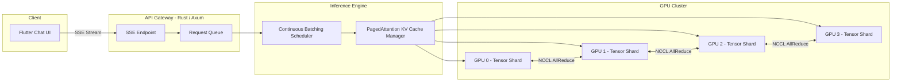

# System Design: The Distributed LLM Inference Engine

## Speaker Intro

I am a **Principal AI Infrastructure Architect** who has spent a decade designing inference serving systems — from single-GPU prototype endpoints to globally distributed clusters running 70-billion-parameter language models at sub-200ms time-to-first-token. My day-to-day involves understanding GPU memory hierarchies, building custom schedulers, and making Rust and CUDA cooperate at the microsecond level.

This handbook distills the exact engineering decisions required to take a raw model checkpoint and turn it into a production inference service that can handle thousands of concurrent chat sessions.

---

## Who This Is For

- **Backend engineers** who are asked to "just deploy this LLM" and discover the hard way that GPU memory is not infinite.
- **Systems programmers** curious about how vLLM, TensorRT-LLM, and similar engines achieve 5–24× throughput improvements.
- **Rust engineers** who want to build the API gateway, scheduler, and memory manager surrounding a CUDA inference kernel.
- **Flutter developers** who need to build a streaming chat interface that renders tokens at 60fps.
- **Staff/Principal engineers** preparing for system design interviews involving ML inference infrastructure.

---

## Prerequisites

| Concept | Where to Learn |
|---|---|
| Rust ownership, `async`/`await`, Tokio basics | [Async Rust](../async-book/src/SUMMARY.md) |
| GPU architecture (warps, SMs, VRAM) | NVIDIA CUDA Programming Guide |
| Transformer self-attention mechanism | "Attention Is All You Need" (Vaswani et al., 2017) |
| Basic distributed systems concepts | [Distributed Systems](../distributed-systems-book/src/SUMMARY.md) |
| Flutter widget lifecycle and state management | [Flutter Omni-Platform](../flutter-omni-book/src/SUMMARY.md) |

---

## How to Use This Book

| Emoji | Meaning |
|---|---|
| 🟢 | **Architecture** — high-level system design and Rust API gateway |
| 🟡 | **CUDA/GPU Memory** — intermediate GPU scheduling and memory concepts |
| 🔴 | **Distributed Inference** — multi-GPU parallelism and advanced VRAM management |

Each chapter follows a consistent structure:

1. **The Problem** — the real-world constraint that forces the design.
2. **Naive vs. Production** — side-by-side code showing the wrong way and the right way.
3. **Architecture Diagram** — at least one `mermaid` diagram per chapter.
4. **Key Takeaways** — bullet-point summary of the engineering lessons.

---

## Pacing Guide

| Chapter | Topic | Time | Checkpoint |
|---|---|---|---|
| 0 | Introduction & Overview | 30 min | Understand the full system architecture |
| 1 | Compute vs. Memory Bandwidth 🟢 | 2–3 hours | Build a Rust SSE gateway that streams tokens |
| 2 | Continuous Batching 🟡 | 3–4 hours | Implement an iteration-level dynamic scheduler |
| 3 | PagedAttention & VRAM 🔴 | 4–6 hours | Build a virtual memory manager for GPU KV cache |
| 4 | Tensor Parallelism 🔴 | 4–6 hours | Shard a 70B model across 4 GPUs with NCCL |
| 5 | Flutter Streaming UI 🟡 | 2–3 hours | SSE-powered chat UI rendering at 60fps |

**Total estimated study time: 16–22 hours.**

---

## Table of Contents

### Part I: The GPU Inference Bottleneck
- **Chapter 1 — The Bottleneck: Compute vs. Memory Bandwidth 🟢**
  Explains why LLM inference is memory-bandwidth-bound, not compute-bound. Covers the Prefill Phase (compute-heavy, parallel) vs. the Decode Phase (memory-heavy, sequential). Designs a Rust-based API gateway with Server-Sent Events (SSE) streaming.

### Part II: Dynamic Scheduling & Memory Management
- **Chapter 2 — Continuous Batching 🟡**
  Demonstrates why static batching wastes GPU cycles. Implements a continuous batching scheduler that dynamically swaps requests in and out of the GPU execution queue at the iteration level. Compares throughput of static vs. continuous batching.

- **Chapter 3 — PagedAttention and VRAM Management 🔴**
  Solves the Key-Value (KV) Cache memory fragmentation problem. Builds an OS-like virtual memory manager for GPU VRAM, splitting the KV cache into non-contiguous pages (blocks). Shows how this approach increases batch sizes by 5×.

### Part III: Distributed Multi-GPU Inference
- **Chapter 4 — Tensor Parallelism across Multi-GPU 🔴**
  Handles models that don't fit on a single GPU (e.g., Llama 3 70B on A100-80GB). Uses NVIDIA NCCL with Rust bindings to split matrix multiplications across 4–8 GPUs via NVLink. Covers AllReduce patterns, pipeline vs. tensor parallelism, and load balancing.

### Part IV: The Client Experience
- **Chapter 5 — The Flutter Client: Streaming Chat UI 🟡**
  Architects the frontend. Consumes Server-Sent Events (SSE) in Flutter. Uses `CustomPaint` and optimized `ListView` to render incoming markdown tokens at 60fps without massive widget tree rebuilds.

---

## End-to-End Architecture

---

## Companion Guides

| Book | Why It Helps |
|---|---|
| [Async Rust](../async-book/src/SUMMARY.md) | Tokio runtime powering the API gateway |
| [Zero-Copy Architecture](../zero-copy-book/src/SUMMARY.md) | io_uring and zero-copy I/O for high-throughput serving |
| [Distributed Systems](../distributed-systems-book/src/SUMMARY.md) | Consensus, replication, and failure handling |
| [Hardware Sympathy](../hardware-sympathy-book/src/SUMMARY.md) | CPU caches, NUMA, memory hierarchies |
| [Flutter Omni-Platform](../flutter-omni-book/src/SUMMARY.md) | Full Flutter architecture reference |
| [Tokio Internals](../tokio-internals-book/src/SUMMARY.md) | Work-stealing runtime that powers the gateway |
