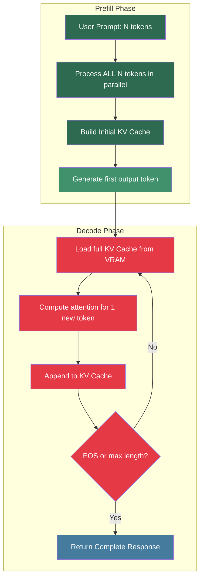
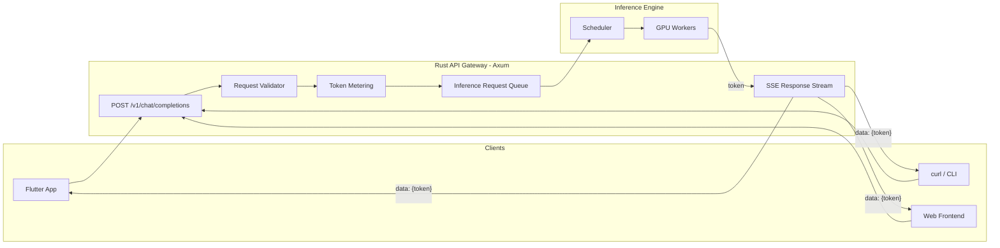
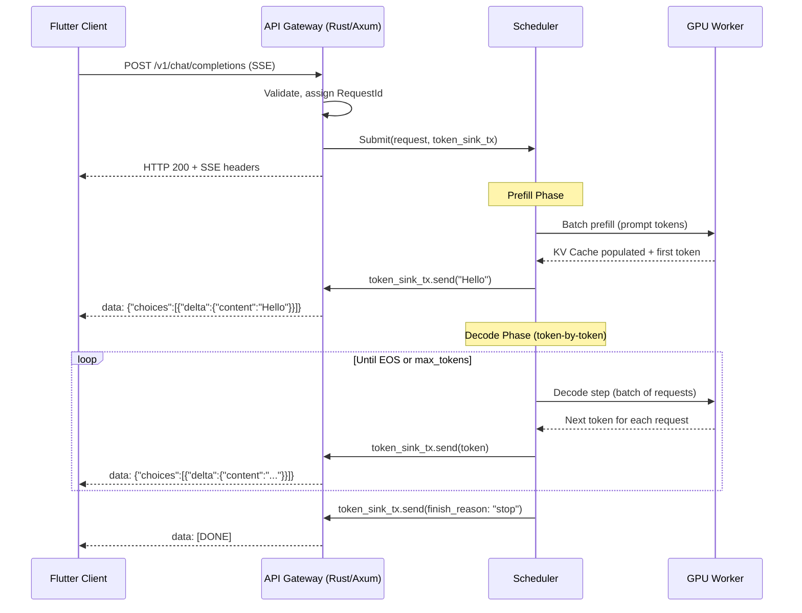

# The Bottleneck: Compute vs. Memory Bandwidth 🟢

> **The Problem:** Every team deploying their first LLM expects inference to be *compute-bound* — "we just need more FLOPS." In reality, autoregressive token generation is **memory-bandwidth-bound**. The GPU's tensor cores sit idle, starving for data, while the memory bus struggles to shuttle hundreds of gigabytes of model weights per second. Until you internalize this, every optimization you attempt will miss the actual bottleneck.

---

## 1.1 The Arithmetic Intensity Illusion

Most deep learning *training* workloads are compute-bound. A single forward-backward pass on a large batch performs enough floating-point operations per byte loaded from memory (high *arithmetic intensity*) to keep GPU tensor cores saturated. Engineers carry this intuition into inference — and it fails spectacularly.

### Arithmetic Intensity Defined

$$
\text{Arithmetic Intensity} = \frac{\text{FLOPs}}{\text{Bytes Transferred}}
$$

| Workload | Arithmetic Intensity | Bound By |
|---|---|---|
| Matrix × Matrix (training, large batch) | ~100–300 FLOP/byte | **Compute** |
| Matrix × Vector (decode, batch=1) | ~1–2 FLOP/byte | **Memory Bandwidth** |
| Attention (prefill, long sequence) | ~50–150 FLOP/byte | **Compute** |
| Attention (decode, per-token) | ~1 FLOP/byte | **Memory Bandwidth** |

The decode phase degenerates from a matrix-matrix multiplication into a **matrix-vector** multiplication (one new token at a time). This collapses arithmetic intensity by two orders of magnitude.

---

## 1.2 The Two Phases of LLM Inference

Every LLM inference request has two distinct phases with radically different computational profiles:



### Prefill Phase (Compute-Bound)

- Processes the entire user prompt in **one parallel forward pass**.
- Arithmetic intensity is high — large matrix-matrix multiplications.
- Produces the **KV Cache** (keys and values for all attention layers).
- Latency metric: **Time to First Token (TTFT)**.

### Decode Phase (Memory-Bandwidth-Bound)

- Generates tokens **one at a time**, autoregressively.
- Each step loads the *entire* model weights + the growing KV Cache from HBM.
- Arithmetic intensity is ~1 FLOP/byte — tensor cores are 95%+ idle.
- Latency metric: **Inter-Token Latency (ITL)** and **Time Per Output Token (TPOT)**.

### The Numbers: A100-80GB

| Resource | A100-80GB SXM |
|---|---|
| FP16 Tensor Core FLOPS | 312 TFLOPS |
| HBM2e Bandwidth | 2.0 TB/s |
| VRAM | 80 GB |
| **Compute : Bandwidth ratio** | **156 FLOP/byte** |

For the A100 to be compute-bound, every byte loaded from HBM must trigger at least 156 FP16 operations. During decode, each parameter (2 bytes in FP16) participates in exactly **2 FLOPs** (multiply + accumulate). That's:

$$
\frac{2 \text{ FLOPs}}{2 \text{ bytes}} = 1 \text{ FLOP/byte}
$$

The GPU is operating at **< 1%** of its theoretical compute capability during decode. The bottleneck is entirely the memory bus.

---

## 1.3 Implications for System Design

This memory-bandwidth bottleneck dictates every major design decision in this book:

| Design Decision | Driven By |
|---|---|
| **Continuous Batching** (Ch. 2) | Amortize weight-loading cost across many requests |
| **PagedAttention** (Ch. 3) | Maximize batch size by eliminating KV Cache fragmentation |
| **Tensor Parallelism** (Ch. 4) | Aggregate memory bandwidth from multiple GPUs |
| **Quantization** (INT8/INT4) | Reduce bytes per parameter → more tokens/sec |
| **Speculative Decoding** | Convert some decode steps to compute-bound prefill steps |

> The single most impactful optimization is **increasing the batch size** during decode. Every additional request in the batch shares the same weight-loading cost, converting wasted bandwidth into useful throughput.

---

## 1.4 Designing the Rust API Gateway

Before diving into GPU internals, we need the **entry point**: a Rust-based API gateway that accepts chat completion requests and streams tokens back via Server-Sent Events (SSE). This gateway is the bridge between HTTP clients and the inference engine.

### Architecture



### Naive Implementation (No Streaming — OOM Under Load)

This is what most teams build first. It buffers the entire response before sending:

```rust
// ❌ Naive: Buffer entire response, then send
// Problems: High TTFT, OOM with many concurrent requests, no backpressure
async fn chat_completions_naive(
    Json(req): Json<ChatRequest>,
) -> Json<ChatResponse> {
    // Block until ALL tokens are generated
    let full_response = inference_engine.generate_all(req.messages).await;

    // Client waits 5-30 seconds seeing nothing, then gets a wall of text
    Json(ChatResponse {
        choices: vec![Choice {
            message: Message {
                role: "assistant".into(),
                content: full_response,  // entire response buffered in RAM
            },
        }],
    })
}
```

### Production Implementation (SSE Streaming with Backpressure)

```rust
// ✅ Production: Stream tokens via SSE as they're generated
use axum::{
    extract::Json,
    response::sse::{Event, Sse},
    routing::post,
    Router,
};
use futures::stream::Stream;
use std::convert::Infallible;
use tokio::sync::mpsc;

/// POST /v1/chat/completions
async fn chat_completions(
    Json(req): Json<ChatRequest>,
) -> Sse<impl Stream<Item = Result<Event, Infallible>>> {
    // Validate and sanitize input
    let messages = validate_messages(&req.messages)
        .expect("invalid messages");

    // Create a bounded channel — this is our backpressure mechanism.
    // If the client can't consume tokens fast enough, the channel fills up
    // and the inference engine naturally slows down.
    let (tx, rx) = mpsc::channel::<TokenEvent>(32);

    // Submit to the inference scheduler (non-blocking)
    let request_id = RequestId::new();
    inference_scheduler::submit(SchedulerRequest {
        id: request_id,
        messages,
        max_tokens: req.max_tokens.unwrap_or(2048),
        temperature: req.temperature.unwrap_or(0.7),
        token_sink: tx,
    })
    .await;

    // Convert the mpsc receiver into an SSE event stream
    let stream = tokio_stream::wrappers::ReceiverStream::new(rx).map(
        |token_event| {
            let data = serde_json::to_string(&StreamChunk {
                id: request_id.to_string(),
                object: "chat.completion.chunk",
                choices: vec![StreamChoice {
                    delta: Delta {
                        content: Some(token_event.text),
                    },
                    finish_reason: token_event.finish_reason,
                }],
            })
            .unwrap();
            Ok(Event::default().data(data))
        },
    );

    Sse::new(stream).keep_alive(
        axum::response::sse::KeepAlive::new()
            .interval(std::time::Duration::from_secs(15))
            .text("keep-alive"),
    )
}

/// Wire up the router
fn app() -> Router {
    Router::new()
        .route("/v1/chat/completions", post(chat_completions))
        .layer(tower_http::cors::CorsLayer::permissive())
        .layer(tower_http::trace::TraceLayer::new_for_http())
}
```

### Key Design Decisions in the Gateway

| Decision | Rationale |
|---|---|
| **Bounded `mpsc` channel (32)** | Backpressure: prevents OOM if client is slow |
| **SSE over WebSocket** | Simpler protocol, works through CDNs/proxies, sufficient for server-push |
| **`keep_alive` every 15s** | Prevents intermediate proxies from closing idle connections |
| **Request ID propagation** | Trace a single request through gateway → scheduler → GPU → response |
| **Axum + Tower middleware** | Composable layers for auth, rate limiting, tracing |

---

## 1.5 The Request Lifecycle

Let's trace a single chat request through the system:



---

## 1.6 Data Structures for the Gateway

```rust
use serde::{Deserialize, Serialize};
use uuid::Uuid;

/// Incoming chat completion request (OpenAI-compatible)
#[derive(Debug, Deserialize)]
pub struct ChatRequest {
    pub model: String,
    pub messages: Vec<Message>,
    pub max_tokens: Option<usize>,
    pub temperature: Option<f32>,
    pub stream: Option<bool>,
}

#[derive(Debug, Deserialize, Serialize, Clone)]
pub struct Message {
    pub role: String,
    pub content: String,
}

/// Unique request identifier for tracing
#[derive(Debug, Clone, Copy)]
pub struct RequestId(Uuid);

impl RequestId {
    pub fn new() -> Self {
        Self(Uuid::new_v4())
    }
}

impl std::fmt::Display for RequestId {
    fn fmt(&self, f: &mut std::fmt::Formatter<'_>) -> std::fmt::Result {
        self.0.fmt(f)
    }
}

/// Token produced by the inference engine
pub struct TokenEvent {
    pub text: String,
    pub finish_reason: Option<String>, // "stop", "length", or None
    pub usage: Option<UsageDelta>,
}

/// Incremental usage tracking
pub struct UsageDelta {
    pub prompt_tokens: usize,
    pub completion_tokens: usize,
}

/// SSE chunk format (OpenAI-compatible)
#[derive(Serialize)]
pub struct StreamChunk {
    pub id: String,
    pub object: &'static str,
    pub choices: Vec<StreamChoice>,
}

#[derive(Serialize)]
pub struct StreamChoice {
    pub delta: Delta,
    pub finish_reason: Option<String>,
}

#[derive(Serialize)]
pub struct Delta {
    pub content: Option<String>,
}
```

---

## 1.7 Bandwidth Math: Why Batching Matters

Let's do the math for a Llama 3 70B model in FP16 on a single A100-80GB:

| Parameter | Value |
|---|---|
| Model size (FP16) | 140 GB |
| A100 HBM bandwidth | 2.0 TB/s |
| Time to load weights once | 140 / 2000 = **70 ms** |
| FLOPs for 1 token (batch=1) | ~140 GFLOP |
| FLOPs for 1 token (batch=64) | ~140 GFLOP × 64 = 8.96 TFLOP |

With **batch=1**: we load 140 GB to generate 1 token → 70 ms/token → **14.3 tokens/sec**.

With **batch=64**: we load 140 GB once and generate 64 tokens → 70 ms per batch step → **914 tokens/sec** aggregate.

$$
\text{Throughput} \propto \text{batch size} \quad \text{(until compute-bound)}
$$

The batch size at which we transition from memory-bound to compute-bound is called the **critical batch size**:

$$
B_{\text{critical}} = \frac{\text{FP16 FLOPS}}{\text{Bandwidth} \times 2 \times \text{FLOP/param}} = \frac{312 \times 10^{12}}{2.0 \times 10^{12} \times 2} \approx 78
$$

Below batch 78, the A100 is memory-bound. Above it, we finally saturate the tensor cores.

> This is why **Continuous Batching** (Chapter 2) and **PagedAttention** (Chapter 3) are the two most impactful optimizations in LLM inference: they maximize the number of requests sharing each weight-loading pass.

---

## 1.8 Quantization: Reducing Bytes Per Parameter

Another way to attack the memory-bandwidth bottleneck is to reduce the number of bytes per parameter:

| Precision | Bytes/Param | 70B Model Size | Bandwidth to Load | Tokens/sec (batch=1) |
|---|---|---|---|---|
| FP16 | 2 | 140 GB | 70 ms | 14.3 |
| INT8 (W8A16) | 1 | 70 GB | 35 ms | 28.6 |
| INT4 (GPTQ/AWQ) | 0.5 | 35 GB | 17.5 ms | 57.1 |

INT4 quantization delivers a **4× throughput boost** at batch=1, purely by cutting memory traffic in half twice. This is not free — there's a quality trade-off — but modern quantization methods (AWQ, GPTQ, SqueezeLLM) keep perplexity impact minimal for most tasks.

---

## 1.9 Profiling: Proving the Bottleneck

Never take theory on faith. Use NVIDIA's profiling tools to confirm:

```bash
# Profile a single decode step
nsys profile --stats=true \
    --trace=cuda,nvtx \
    --output=decode_profile \
    python -c "from engine import decode_step; decode_step(batch_size=1)"

# Key metrics to examine in Nsight Systems:
# 1. SM Occupancy  → will be very low during decode (~5-10%)
# 2. DRAM Throughput → will be near HBM bandwidth limit (~1.8-2.0 TB/s)
# 3. Compute Throughput → will be <5% of peak FLOPS

# For quick bandwidth measurement:
ncu --metrics dram__throughput.avg.pct_of_peak_sustained_elapsed \
    python -c "from engine import decode_step; decode_step(batch_size=1)"
```

If `dram__throughput` is >80% of peak and `sm__throughput` is <10%, your decode is memory-bound. QED.

---

> **Key Takeaways**
>
> 1. **LLM inference decode is memory-bandwidth-bound**, not compute-bound. The GPU spends most of its time loading weights, not multiplying them.
> 2. **Prefill is compute-bound; Decode is memory-bound.** The two phases have fundamentally different optimization strategies.
> 3. **Batch size is the #1 lever** for throughput. Every additional request amortizes the weight-loading cost.
> 4. **The Rust SSE gateway** provides backpressure (bounded channels), streaming (SSE events), and observability (request ID tracing) — the three pillars of a production inference API.
> 5. **Quantization** (INT8/INT4) is the simplest way to double or quadruple single-request throughput by halving memory traffic.
> 6. **Always profile.** Use `nsys` and `ncu` to confirm your bottleneck before optimizing.
