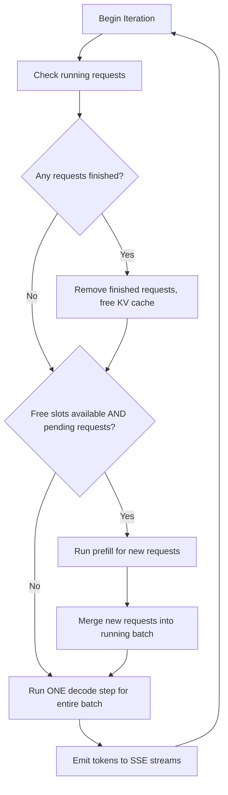

# Continuous Batching 🟡

> **The Problem:** Standard "static batching" groups a fixed set of requests and runs them together until the *longest* request finishes. Every shorter request pads its sequence with wasted computation, and no new request can enter the batch until the entire group completes. On a 70B model where single-request decode already saturates HBM bandwidth, this means the GPU sits partially idle for 60–80% of the batch duration. **Continuous batching** solves this by operating at the *iteration* level: every single decode step, finished requests leave and waiting requests enter.

---

## 2.1 Static Batching: The Waste

In static (or "naive") batching, the serving system collects requests into a fixed-size batch and runs them to completion:

```mermaid
gantt
    title Static Batching — GPU Utilization Over Time
    dateFormat X
    axisFormat %s

    section Batch 1
    Request A (50 tokens)   :a, 0, 50
    Request B (120 tokens)  :b, 0, 120
    Request C (30 tokens)   :c, 0, 120
    Padding C (wasted)      :crit, c_pad, 30, 120

    section Batch 2 (waits for Batch 1)
    Request D (80 tokens)   :d, 120, 200
    Request E (45 tokens)   :e, 120, 200
    Padding E (wasted)      :crit, e_pad, 165, 200
```



**Problems with static batching:**

| Issue | Impact |
|---|---|
| **Tail-latency padding** | Short requests wait for the longest request to finish |
| **No mid-batch admission** | New requests queue behind the entire batch |
| **Low GPU utilization** | As requests finish, batch shrinks but GPU processes padding tokens |
| **Head-of-line blocking** | One 4096-token response blocks all other requests |

### A Static Batch Scheduler (The Wrong Way)

```rust
// ❌ Static Batching: collects N requests, runs them all to completion
struct StaticBatchScheduler {
    batch_size: usize,
    pending: Vec<InferenceRequest>,
}

impl StaticBatchScheduler {
    async fn run(&mut self, engine: &InferenceEngine) {
        loop {
            // Wait until we have a full batch (or timeout)
            while self.pending.len() < self.batch_size {
                if let Some(req) = self.recv_timeout(Duration::from_millis(50)).await {
                    self.pending.push(req);
                } else {
                    break; // timeout — run with partial batch
                }
            }

            let batch: Vec<_> = self.pending.drain(..).collect();
            let max_tokens = batch.iter().map(|r| r.max_tokens).max().unwrap_or(1);

            // Run ALL requests for max_tokens steps, even if some finish early
            for step in 0..max_tokens {
                let tokens = engine.decode_step(&batch).await;

                for (i, token) in tokens.iter().enumerate() {
                    // Request already finished? Too bad — still in the batch.
                    if !batch[i].is_finished() {
                        batch[i].emit_token(token);
                    }
                    // ← GPU still processes this slot! Wasted cycles.
                }
            }
            // Only NOW can new requests enter. Requests D, E waited
            // for all of Batch 1 to complete.
        }
    }
}
```

---

## 2.2 Continuous Batching: Iteration-Level Scheduling

Continuous batching (also called "inflight batching" or "iteration-level scheduling") makes scheduling decisions at every **decode iteration**, not at the batch level:

```mermaid
gantt
    title Continuous Batching — GPU Utilization Over Time
    dateFormat X
    axisFormat %s

    section GPU Batch Slots
    Request A (50 tokens)    :a, 0, 50
    Request D (fills A slot) :d, 50, 130
    Request C (30 tokens)    :c, 0, 30
    Request E (fills C slot) :e, 30, 75
    Request F (fills E slot) :f, 75, 140
    Request B (120 tokens)   :b, 0, 120
    Request G (fills B slot) :g, 120, 160
```



Notice: **no padding, no gaps, no idle slots.** As soon as Request C finishes at step 30, Request E immediately takes its slot. The GPU is always running at maximum batch capacity.

### How It Works: The Iteration Loop



---

## 2.3 Implementing a Continuous Batching Scheduler in Rust

```rust
// ✅ Continuous Batching Scheduler
use std::collections::VecDeque;
use tokio::sync::mpsc;

/// A single request being processed
struct RunningRequest {
    id: RequestId,
    /// Channel to send tokens back to the SSE stream
    token_sink: mpsc::Sender<TokenEvent>,
    /// Current number of generated tokens
    generated_tokens: usize,
    /// Maximum tokens to generate
    max_tokens: usize,
    /// Slot index in the KV cache
    kv_slot: usize,
}

/// The continuous batching scheduler
struct ContinuousBatchScheduler {
    /// Requests currently running on the GPU
    running: Vec<RunningRequest>,
    /// Requests waiting to enter the batch
    waiting: VecDeque<InferenceRequest>,
    /// Maximum concurrent requests (limited by GPU VRAM for KV cache)
    max_batch_size: usize,
    /// Receiver for new incoming requests
    request_rx: mpsc::Receiver<InferenceRequest>,
    /// Reference to the inference engine
    engine: InferenceEngine,
    /// KV cache slot allocator
    kv_allocator: KvSlotAllocator,
}

impl ContinuousBatchScheduler {
    /// The main scheduling loop — runs one iteration at a time
    async fn run(&mut self) {
        loop {
            // ── Step 1: Drain new requests into the waiting queue ──
            while let Ok(req) = self.request_rx.try_recv() {
                self.waiting.push_back(req);
            }

            // ── Step 2: Evict finished requests ──
            self.running.retain(|req| {
                if req.generated_tokens >= req.max_tokens {
                    // Notify client that generation is complete
                    let _ = req.token_sink.try_send(TokenEvent {
                        text: String::new(),
                        finish_reason: Some("length".into()),
                        usage: None,
                    });
                    // Free the KV cache slot
                    self.kv_allocator.free(req.kv_slot);
                    false // remove from running
                } else {
                    true // keep running
                }
            });

            // ── Step 3: Admit new requests into free slots ──
            while self.running.len() < self.max_batch_size {
                if let Some(pending) = self.waiting.pop_front() {
                    // Allocate a KV cache slot
                    let kv_slot = match self.kv_allocator.allocate() {
                        Some(slot) => slot,
                        None => {
                            // No VRAM available — put it back and stop admitting
                            self.waiting.push_front(pending);
                            break;
                        }
                    };

                    // Run prefill for this request
                    self.engine
                        .prefill(&pending.messages, kv_slot)
                        .await;

                    self.running.push(RunningRequest {
                        id: pending.id,
                        token_sink: pending.token_sink,
                        generated_tokens: 0,
                        max_tokens: pending.max_tokens,
                        kv_slot,
                    });
                } else {
                    break; // no more waiting requests
                }
            }

            // ── Step 4: Run one decode step for the entire batch ──
            if self.running.is_empty() {
                // No work — sleep briefly to avoid busy-spinning
                tokio::time::sleep(Duration::from_millis(1)).await;
                continue;
            }

            let kv_slots: Vec<usize> =
                self.running.iter().map(|r| r.kv_slot).collect();
            let output_tokens = self.engine.decode_step(&kv_slots).await;

            // ── Step 5: Emit tokens to SSE streams ──
            for (req, token) in
                self.running.iter_mut().zip(output_tokens.iter())
            {
                req.generated_tokens += 1;

                let finish_reason = if token.is_eos()
                    || req.generated_tokens >= req.max_tokens
                {
                    Some("stop".into())
                } else {
                    None
                };

                let _ = req.token_sink.try_send(TokenEvent {
                    text: token.text.clone(),
                    finish_reason,
                    usage: None,
                });
            }
        }
    }
}
```

---

## 2.4 Static vs. Continuous Batching: Throughput Comparison

| Metric | Static Batching | Continuous Batching |
|---|---|---|
| **Scheduling granularity** | Per-batch (N requests) | Per-iteration (1 decode step) |
| **Mid-batch admission** | ❌ No | ✅ Yes |
| **Padding waste** | 60–80% of GPU-seconds | ~0% |
| **Latency (P50)** | High (blocked by longest request) | Low (independent of other requests) |
| **Throughput (tokens/sec)** | 1× baseline | **2–5× baseline** |
| **GPU utilization** | 20–40% | **85–95%** |
| **Complexity** | Simple | Moderate (KV cache management) |

### Throughput Graph (Conceptual)

```
Throughput (tokens/sec)
│
│                          ┌──── Continuous Batching
│                     ╱────┘
│                ╱───╱
│           ╱───╱
│      ╱───╱
│ ╱───╱
│╱───╱
│──╱─────────────────────── Static Batching
│╱
└────────────────────────────── Concurrent Requests
  1    8    16   32   64  128
```

---

## 2.5 Handling Prefill + Decode Contention

A subtle problem: when a new request enters, it needs a **prefill** pass (compute-heavy), while existing requests need **decode** passes (memory-heavy). These two workloads have different computational profiles and can interfere.

### Strategy 1: Chunked Prefill

Split long prompts into chunks and interleave prefill chunks with decode iterations:

```rust
/// Chunked prefill — interleave with decode to avoid stalling
const PREFILL_CHUNK_SIZE: usize = 512; // tokens per chunk

async fn admit_with_chunked_prefill(
    &mut self,
    request: &InferenceRequest,
    kv_slot: usize,
) {
    let prompt_tokens = &request.tokenized_prompt;
    let total_len = prompt_tokens.len();

    for chunk_start in (0..total_len).step_by(PREFILL_CHUNK_SIZE) {
        let chunk_end = (chunk_start + PREFILL_CHUNK_SIZE).min(total_len);
        let chunk = &prompt_tokens[chunk_start..chunk_end];

        // Prefill this chunk
        self.engine.prefill_chunk(chunk, kv_slot, chunk_start).await;

        // Run a decode step for existing requests (so they don't stall)
        if !self.running.is_empty() {
            let kv_slots: Vec<usize> =
                self.running.iter().map(|r| r.kv_slot).collect();
            let tokens = self.engine.decode_step(&kv_slots).await;
            self.emit_tokens(&tokens);
        }
    }
}
```

### Strategy 2: Separate Prefill and Decode Executors

Run prefill on a dedicated GPU or GPU partition (using MPS / MIG) and only send the KV Cache to the decode GPU once prefill is complete. This is the approach used by Splitwise and DistServe.


---

## 2.6 Priority and Fairness

Not all requests are equal. A production scheduler needs priority classes and fairness guarantees:

```rust
use std::collections::BinaryHeap;
use std::cmp::Ordering;

#[derive(Debug, Clone, Copy, PartialEq, Eq)]
enum Priority {
    /// Premium tier — lowest latency
    High = 0,
    /// Standard tier
    Normal = 1,
    /// Batch/offline processing
    Low = 2,
}

#[derive(Debug)]
struct PrioritizedRequest {
    priority: Priority,
    arrival_time: Instant,
    request: InferenceRequest,
}

impl Ord for PrioritizedRequest {
    fn cmp(&self, other: &Self) -> Ordering {
        // Higher priority first, then FIFO within same priority
        (self.priority as u8)
            .cmp(&(other.priority as u8))
            .then_with(|| other.arrival_time.cmp(&self.arrival_time))
    }
}

impl PartialOrd for PrioritizedRequest {
    fn partial_cmp(&self, other: &Self) -> Option<Ordering> {
        Some(self.cmp(other))
    }
}

impl Eq for PrioritizedRequest {}
impl PartialEq for PrioritizedRequest {
    fn eq(&self, other: &Self) -> bool {
        self.priority == other.priority
            && self.arrival_time == other.arrival_time
    }
}

/// Priority queue for waiting requests
struct PriorityWaitQueue {
    heap: BinaryHeap<PrioritizedRequest>,
}

impl PriorityWaitQueue {
    fn push(&mut self, req: InferenceRequest, priority: Priority) {
        self.heap.push(PrioritizedRequest {
            priority,
            arrival_time: Instant::now(),
            request: req,
        });
    }

    fn pop(&mut self) -> Option<InferenceRequest> {
        self.heap.pop().map(|p| p.request)
    }
}
```

---

## 2.7 Metrics and Observability

Every production scheduler must export these metrics:

```rust
use metrics::{counter, gauge, histogram};

fn record_scheduler_metrics(scheduler: &ContinuousBatchScheduler) {
    // Current batch size (how many requests are running right now)
    gauge!("scheduler.running_requests").set(scheduler.running.len() as f64);

    // Queue depth (how many requests are waiting)
    gauge!("scheduler.waiting_requests").set(scheduler.waiting.len() as f64);

    // Iteration latency (how long each decode step takes)
    // Recorded inside the decode_step call:
    // histogram!("scheduler.iteration_latency_ms").record(elapsed_ms);

    // Tokens generated per second (aggregate throughput)
    counter!("scheduler.tokens_generated_total").increment(
        scheduler.running.len() as u64
    );
}

// Key alerts:
// - waiting_requests > 100 for > 30s → need more GPU capacity
// - iteration_latency_ms P99 > 100ms → batch too large or GPU contention
// - running_requests consistently < max_batch_size while waiting > 0
//   → KV cache fragmentation (see Chapter 3)
```

---

## 2.8 Benchmarking: The Impact

Real-world numbers from published benchmarks (vLLM paper, 2023):

| System | Max Throughput (tokens/sec) | Relative |
|---|---|---|
| HuggingFace TGI (static batch) | ~800 | 1.0× |
| vLLM (continuous batch + PagedAttention) | ~3,900 | **4.9×** |
| TensorRT-LLM (continuous batch + optimized CUDA) | ~5,200 | **6.5×** |

> Continuous batching alone accounts for roughly **2–3×** of this improvement. The remaining gains come from PagedAttention (Chapter 3), which unlocks larger batch sizes by eliminating KV cache fragmentation.

---

> **Key Takeaways**
>
> 1. **Static batching wastes 60–80% of GPU cycles** through padding and head-of-line blocking.
> 2. **Continuous batching schedules at the iteration level** — every decode step, finished requests leave and new ones enter.
> 3. **Prefill/Decode contention** is a real problem. Use chunked prefill or separate executors to avoid stalling decode for existing requests.
> 4. **The scheduler is the brain of the inference engine.** It controls throughput, latency, fairness, and GPU utilization.
> 5. **Observable by default:** export running count, queue depth, iteration latency, and tokens/sec from day one.
> 6. Continuous batching is necessary but not sufficient — the batch size is still limited by **KV cache memory.** This is the problem Chapter 3 solves.
