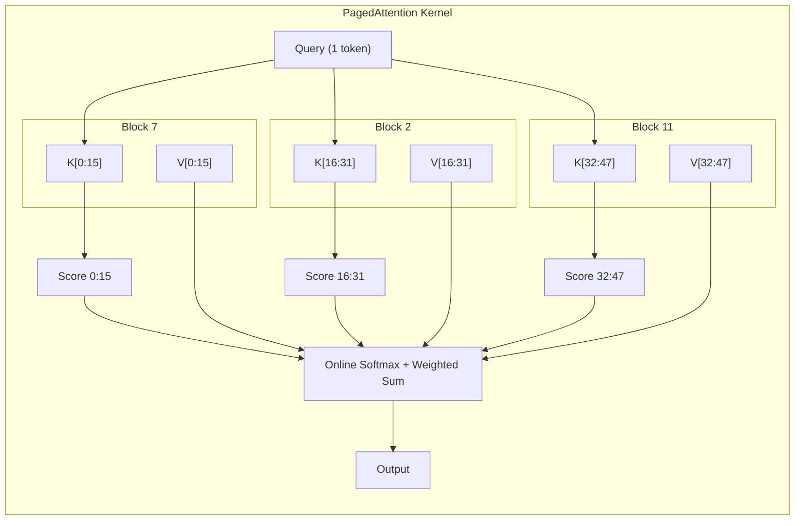

# PagedAttention and VRAM Management 🔴

> **The Problem:** Continuous batching (Chapter 2) wants to maximize batch size — more requests sharing each weight-loading pass means more tokens per second. But every request needs a **Key-Value (KV) Cache** that grows with sequence length. With naive contiguous allocation, 60–80% of GPU VRAM is wasted on *internal fragmentation* (reserved but unused memory) and *external fragmentation* (gaps between allocated blocks). The result: you can fit 10 requests when you should be able to fit 50. **PagedAttention** applies the virtual memory concept from operating systems to GPU VRAM, splitting the KV cache into fixed-size, non-contiguous pages — and it increases throughput by up to **5×**.

---

## 3.1 The KV Cache: Why It Exists and Why It's Huge

In the Transformer attention mechanism, for each layer and each attention head, we compute:

$$
\text{Attention}(Q, K, V) = \text{softmax}\left(\frac{QK^T}{\sqrt{d_k}}\right) V
$$

During autoregressive decode, the query $Q$ is a single new token, but $K$ and $V$ contain **all previous tokens**. Re-computing $K$ and $V$ for every token would be $O(n^2)$ per token — instead, we cache them.

### KV Cache Size Formula

$$
\text{KV Cache (bytes)} = 2 \times L \times H \times D \times S \times P
$$

Where:
- $2$ = Keys + Values
- $L$ = Number of layers
- $H$ = Number of KV heads (may differ from query heads in GQA)
- $D$ = Head dimension
- $S$ = Sequence length
- $P$ = Bytes per element (2 for FP16)

### KV Cache Size for Common Models

| Model | Layers | KV Heads | Head Dim | KV/Token | KV at 4K tokens |
|---|---|---|---|---|---|
| Llama 3 8B | 32 | 8 (GQA) | 128 | 128 KB | **512 MB** |
| Llama 3 70B | 80 | 8 (GQA) | 128 | 320 KB | **1.28 GB** |
| Llama 3 405B | 126 | 8 (GQA) | 128 | 504 KB | **2.02 GB** |
| GPT-4 class (~MoE) | ~120 | ~16 | ~128 | ~960 KB | **~3.8 GB** |

For Llama 3 70B with a max sequence length of 8,192 tokens:
- **One request's KV cache = 2.56 GB**
- A100-80GB with 140GB model → 80 - 70 (INT8 model) = **10 GB for KV cache**
- Naive allocation: 10 / 2.56 = **3 concurrent requests** maximum

But most requests don't use all 8,192 tokens! Average output is 200–500 tokens. We're reserving 2.56 GB per request when most need only 160–400 MB.

---

## 3.2 The Fragmentation Problem

### Naive Contiguous Allocation


**Legend:** Green/Blue/Red = used KV cache. Orange = reserved but unused (*internal fragmentation*). Gray = free.

In this example:
- **Internal fragmentation:** 7 blocks reserved but unused (58% waste within allocations)
- **External fragmentation:** 4 free blocks, but they may not be contiguous enough for a new request that needs 4 contiguous blocks
- **Effective utilization:** 6 used / 16 total = **37.5%**

### The Result

```
// ❌ Naive allocation: pre-allocate max_seq_len for every request
fn allocate_kv_cache_naive(
    max_seq_len: usize,   // e.g., 8192
    num_layers: usize,     // e.g., 80
    kv_heads: usize,       // e.g., 8
    head_dim: usize,       // e.g., 128
) -> *mut f16 {
    let bytes_per_token = 2 * num_layers * kv_heads * head_dim * 2; // 320 KB
    let total_bytes = bytes_per_token * max_seq_len;                // 2.56 GB!

    // Every request pre-allocates 2.56 GB, even if it only generates 50 tokens.
    unsafe { cuda_malloc(total_bytes) }
}
```

---

## 3.3 PagedAttention: Virtual Memory for VRAM

PagedAttention (Kwon et al., vLLM 2023) applies the operating system's **virtual memory + paging** concept to the KV cache:

| OS Concept | PagedAttention Analog |
|---|---|
| Virtual address space | Logical KV cache (per request) |
| Physical page frames | Fixed-size GPU memory blocks |
| Page table | Block table (maps logical → physical blocks) |
| Page fault | Allocate new block on demand |
| Swap to disk | Swap KV blocks to CPU RAM or NVMe |

### The Key Idea

Instead of allocating one contiguous chunk per request, allocate the KV cache in **fixed-size blocks** (e.g., 16 tokens per block). Each request gets a **block table** that maps logical sequence positions to physical block locations. Blocks are allocated on demand and can be **anywhere** in VRAM.

```mermaid
graph TD
    subgraph "Logical KV Cache (Request A)"
        L0["Tokens 0-15 → Block 7"]
        L1["Tokens 16-31 → Block 2"]
        L2["Tokens 32-47 → Block 11"]
        L3["Tokens 48-55 → Block 5 (partial)"]
    end

    subgraph "Logical KV Cache (Request B)"
        M0["Tokens 0-15 → Block 0"]
        M1["Tokens 16-31 → Block 9"]
        M2["Tokens 32-40 → Block 3 (partial)"]
    end

    subgraph "Physical VRAM Blocks"
        P0["Block 0 (B)"]
        P1["Block 1 (free)"]
        P2["Block 2 (A)"]
        P3["Block 3 (B)"]
        P4["Block 4 (free)"]
        P5["Block 5 (A)"]
        P6["Block 6 (free)"]
        P7["Block 7 (A)"]
        P8["Block 8 (free)"]
        P9["Block 9 (B)"]
        P10["Block 10 (free)"]
        P11["Block 11 (A)"]
    end

    L0 --> P7
    L1 --> P2
    L2 --> P11
    L3 --> P5
    M0 --> P0
    M1 --> P9
    M2 --> P3

    style P0 fill:#264653,color:#fff
    style P2 fill:#2d6a4f,color:#fff
    style P3 fill:#264653,color:#fff
    style P5 fill:#2d6a4f,color:#fff
    style P7 fill:#2d6a4f,color:#fff
    style P9 fill:#264653,color:#fff
    style P11 fill:#2d6a4f,color:#fff
    style P1 fill:#606060,color:#fff
    style P4 fill:#606060,color:#fff
    style P6 fill:#606060,color:#fff
    style P8 fill:#606060,color:#fff
    style P10 fill:#606060,color:#fff
```



**Result:** Zero internal fragmentation (last block wastes at most `block_size - 1` tokens). Zero external fragmentation (blocks don't need to be contiguous).

---

## 3.4 Implementing the Block Manager in Rust

```rust
// ✅ PagedAttention Block Manager
use std::collections::{HashMap, VecDeque};

/// Physical block of GPU memory holding KV cache for `block_size` tokens
#[derive(Debug, Clone, Copy, PartialEq, Eq, Hash)]
struct PhysicalBlockId(u32);

/// Configuration for the block manager
struct BlockManagerConfig {
    /// Number of tokens each block can hold
    block_size: usize,           // e.g., 16
    /// Total number of physical blocks in GPU VRAM
    num_gpu_blocks: usize,       // e.g., 2048
    /// Number of physical blocks in CPU RAM (for swapping)
    num_cpu_blocks: usize,       // e.g., 4096
    /// Number of layers in the model
    num_layers: usize,
    /// Number of KV heads
    num_kv_heads: usize,
    /// Dimension per head
    head_dim: usize,
}

/// The block table for a single request: maps logical block index → physical block
struct RequestBlockTable {
    /// Ordered list of physical block IDs for this request
    gpu_blocks: Vec<PhysicalBlockId>,
    /// Number of tokens filled in the last block
    last_block_fill: usize,
}

/// The block manager: an OS-like virtual memory manager for GPU VRAM
struct BlockManager {
    config: BlockManagerConfig,
    /// Free physical blocks on GPU
    gpu_free_blocks: VecDeque<PhysicalBlockId>,
    /// Free physical blocks on CPU (for swapping)
    cpu_free_blocks: VecDeque<PhysicalBlockId>,
    /// Block tables for each active request
    block_tables: HashMap<RequestId, RequestBlockTable>,
}

impl BlockManager {
    fn new(config: BlockManagerConfig) -> Self {
        let gpu_free_blocks = (0..config.num_gpu_blocks)
            .map(|i| PhysicalBlockId(i as u32))
            .collect();
        let cpu_free_blocks = (0..config.num_cpu_blocks)
            .map(|i| PhysicalBlockId(i as u32))
            .collect();

        Self {
            config,
            gpu_free_blocks,
            cpu_free_blocks,
            block_tables: HashMap::new(),
        }
    }

    /// Can we allocate `num_blocks` more blocks on GPU?
    fn can_allocate(&self, num_blocks: usize) -> bool {
        self.gpu_free_blocks.len() >= num_blocks
    }

    /// Allocate initial blocks for a new request's prompt
    fn allocate_prompt(
        &mut self,
        request_id: RequestId,
        prompt_len: usize,
    ) -> Result<(), AllocationError> {
        let num_blocks_needed =
            (prompt_len + self.config.block_size - 1) / self.config.block_size;

        if !self.can_allocate(num_blocks_needed) {
            return Err(AllocationError::OutOfBlocks);
        }

        let mut gpu_blocks = Vec::with_capacity(num_blocks_needed);
        for _ in 0..num_blocks_needed {
            let block = self
                .gpu_free_blocks
                .pop_front()
                .ok_or(AllocationError::OutOfBlocks)?;
            gpu_blocks.push(block);
        }

        let last_block_fill = prompt_len % self.config.block_size;
        let last_block_fill = if last_block_fill == 0 {
            self.config.block_size
        } else {
            last_block_fill
        };

        self.block_tables.insert(
            request_id,
            RequestBlockTable {
                gpu_blocks,
                last_block_fill,
            },
        );

        Ok(())
    }

    /// Append a single decoded token — may need a new block
    fn append_token(
        &mut self,
        request_id: RequestId,
    ) -> Result<(), AllocationError> {
        let table = self
            .block_tables
            .get_mut(&request_id)
            .ok_or(AllocationError::RequestNotFound)?;

        if table.last_block_fill == self.config.block_size {
            // Current block is full — allocate a new one
            let new_block = self
                .gpu_free_blocks
                .pop_front()
                .ok_or(AllocationError::OutOfBlocks)?;
            table.gpu_blocks.push(new_block);
            table.last_block_fill = 1;
        } else {
            table.last_block_fill += 1;
        }

        Ok(())
    }

    /// Free all blocks for a completed request
    fn free_request(&mut self, request_id: &RequestId) {
        if let Some(table) = self.block_tables.remove(request_id) {
            for block in table.gpu_blocks {
                self.gpu_free_blocks.push_back(block);
            }
        }
    }

    /// Get the physical block table for the CUDA kernel
    fn get_block_table(
        &self,
        request_id: &RequestId,
    ) -> Option<&[PhysicalBlockId]> {
        self.block_tables
            .get(request_id)
            .map(|t| t.gpu_blocks.as_slice())
    }

    /// Current memory utilization
    fn utilization(&self) -> f64 {
        let total = self.config.num_gpu_blocks;
        let used = total - self.gpu_free_blocks.len();
        used as f64 / total as f64
    }
}

#[derive(Debug)]
enum AllocationError {
    OutOfBlocks,
    RequestNotFound,
}
```

---

## 3.5 The PagedAttention CUDA Kernel (Conceptual)

Standard attention reads KV from contiguous memory. PagedAttention reads KV from scattered blocks using the block table as an indirection layer:

```
// Standard attention (contiguous KV)
for pos in 0..seq_len {
    k = kv_cache[layer][pos]      // Simple pointer arithmetic
}

// PagedAttention (non-contiguous KV via block table)
for pos in 0..seq_len {
    block_idx = pos / BLOCK_SIZE
    block_off = pos % BLOCK_SIZE
    physical_block = block_table[request_id][block_idx]
    k = kv_cache[physical_block][block_off]   // One indirection
}
```

The CUDA kernel iterates over physical blocks, computing partial attention scores per block and reducing:



The kernel uses **online softmax** (Milakov & Gimelshein, 2018) to compute softmax across blocks without materializing the full score vector — critical for memory efficiency.

---

## 3.6 Swapping: CPU Offload for Preemption

When GPU VRAM is full and a higher-priority request arrives, we can **swap** a lower-priority request's KV blocks to CPU RAM — just like an OS swapping pages to disk:

```rust
impl BlockManager {
    /// Swap a request's KV cache from GPU to CPU
    fn swap_out(
        &mut self,
        request_id: &RequestId,
    ) -> Result<Vec<(PhysicalBlockId, PhysicalBlockId)>, AllocationError> {
        let table = self
            .block_tables
            .get_mut(request_id)
            .ok_or(AllocationError::RequestNotFound)?;

        let mut swap_map = Vec::new();

        for gpu_block in &mut table.gpu_blocks {
            let cpu_block = self
                .cpu_free_blocks
                .pop_front()
                .ok_or(AllocationError::OutOfBlocks)?;

            swap_map.push((*gpu_block, cpu_block));

            // Return GPU block to free pool
            self.gpu_free_blocks.push_back(*gpu_block);
            // Record that this block is now on CPU
            *gpu_block = cpu_block;
        }

        // The caller uses swap_map to issue cudaMemcpyAsync(GPU → CPU)
        Ok(swap_map)
    }

    /// Swap a request's KV cache from CPU back to GPU
    fn swap_in(
        &mut self,
        request_id: &RequestId,
    ) -> Result<Vec<(PhysicalBlockId, PhysicalBlockId)>, AllocationError> {
        let table = self
            .block_tables
            .get_mut(request_id)
            .ok_or(AllocationError::RequestNotFound)?;

        let mut swap_map = Vec::new();

        for cpu_block in &mut table.gpu_blocks {
            let gpu_block = self
                .gpu_free_blocks
                .pop_front()
                .ok_or(AllocationError::OutOfBlocks)?;

            swap_map.push((*cpu_block, gpu_block));

            self.cpu_free_blocks.push_back(*cpu_block);
            *cpu_block = gpu_block;
        }

        Ok(swap_map)
    }
}
```

### Swap Cost

| Transfer | Bandwidth | 1 GB KV Cache |
|---|---|---|
| GPU HBM ↔ GPU HBM | 2.0 TB/s | 0.5 ms |
| GPU ↔ CPU (PCIe 4.0 x16) | 32 GB/s | 31 ms |
| GPU ↔ CPU (PCIe 5.0 x16) | 64 GB/s | 16 ms |
| GPU ↔ NVMe SSD | 7 GB/s | 143 ms |

PCIe swap is 30–60× slower than GPU memory access — use it sparingly and only for preemption, not as steady-state memory expansion.

---

## 3.7 Copy-on-Write for Shared Prefixes

Many requests share common system prompts or few-shot examples. With PagedAttention, we can share physical blocks via **reference counting** and copy-on-write:

```rust
/// Reference-counted physical block
struct ManagedBlock {
    id: PhysicalBlockId,
    ref_count: u32,
}

impl BlockManager {
    /// Share the KV cache prefix between two requests (e.g., same system prompt)
    fn fork_prefix(
        &mut self,
        source_id: &RequestId,
        dest_id: RequestId,
        shared_prefix_blocks: usize,
    ) -> Result<(), AllocationError> {
        let source_table = self
            .block_tables
            .get(source_id)
            .ok_or(AllocationError::RequestNotFound)?;

        // Share the first N blocks (bump ref count instead of copying)
        let shared: Vec<PhysicalBlockId> = source_table
            .gpu_blocks[..shared_prefix_blocks]
            .to_vec();

        // Each shared block gets ref_count incremented
        // (managed externally via a ref_count map)

        self.block_tables.insert(
            dest_id,
            RequestBlockTable {
                gpu_blocks: shared,
                last_block_fill: self.config.block_size,
            },
        );

        Ok(())
    }
}
```

This is critical for:
- **Parallel sampling** (beam search, best-of-N): all candidates share the prompt KV cache.
- **System prompts**: 100 requests with the same system prompt share those blocks in VRAM.
- **Memory savings**: 30–50% for typical chat workloads with long system prompts.

---

## 3.8 Contiguous vs. Paged: Memory Utilization Comparison

| Metric | Contiguous Allocation | PagedAttention |
|---|---|---|
| **Internal fragmentation** | 50–80% (reserved max_seq_len) | < 4% (last block only) |
| **External fragmentation** | High (gaps between freed blocks) | **0%** (blocks are unit-sized) |
| **Max batch size (Llama 70B, 80GB)** | 3–5 requests | **20–50 requests** |
| **Effective VRAM utilization** | 20–40% | **> 95%** |
| **Throughput improvement** | 1× baseline | **2–5× baseline** |
| **Prefix sharing** | ❌ Full copy | ✅ Copy-on-write |
| **Preemption support** | ❌ Kill and restart | ✅ Swap to CPU |

---

## 3.9 Integration with the Continuous Batching Scheduler

The PagedAttention block manager plugs directly into the scheduler from Chapter 2:

```rust
impl ContinuousBatchScheduler {
    /// Modified admission: use block manager instead of fixed KV slots
    async fn admit_request(
        &mut self,
        request: InferenceRequest,
    ) -> Result<(), AllocationError> {
        let prompt_len = request.tokenized_prompt.len();
        let blocks_needed =
            (prompt_len + self.block_manager.config.block_size - 1)
                / self.block_manager.config.block_size;

        // Check if we have enough blocks
        if !self.block_manager.can_allocate(blocks_needed) {
            // Try swapping out lowest-priority running request
            if let Some(victim) = self.select_preemption_victim() {
                let swap_map = self.block_manager.swap_out(&victim.id)?;
                self.execute_swap(swap_map).await;
                self.suspended.push(victim);
            } else {
                // No victim available — queue the request
                self.waiting.push_back(request);
                return Ok(());
            }
        }

        // Allocate blocks and run prefill
        self.block_manager
            .allocate_prompt(request.id, prompt_len)?;
        self.engine
            .prefill_paged(
                &request.tokenized_prompt,
                self.block_manager.get_block_table(&request.id).unwrap(),
            )
            .await;

        // Add to running batch
        self.running.push(RunningRequest {
            id: request.id,
            token_sink: request.token_sink,
            generated_tokens: 0,
            max_tokens: request.max_tokens,
        });

        Ok(())
    }

    /// Each decode iteration: append token, possibly allocate new block
    async fn decode_iteration(&mut self) {
        let block_tables: Vec<_> = self
            .running
            .iter()
            .filter_map(|r| {
                self.block_manager
                    .get_block_table(&r.id)
                    .map(|bt| (r.id, bt.to_vec()))
            })
            .collect();

        // Run paged attention decode
        let tokens = self.engine.decode_step_paged(&block_tables).await;

        for (req, token) in self.running.iter_mut().zip(tokens.iter()) {
            // Append token to KV cache (may allocate new block)
            if let Err(_) = self.block_manager.append_token(req.id) {
                // Out of blocks — preempt or queue
                // (simplified error handling)
            }
            req.generated_tokens += 1;
            let _ = req.token_sink.try_send(TokenEvent {
                text: token.text.clone(),
                finish_reason: if token.is_eos() {
                    Some("stop".into())
                } else {
                    None
                },
                usage: None,
            });
        }
    }
}
```

---

## 3.10 VRAM Budget Calculator

Use this formula to plan your deployment's block allocation:

```rust
/// Calculate the optimal block configuration for a given model and GPU
fn calculate_vram_budget(
    gpu_vram_bytes: usize,       // e.g., 80 GB for A100
    model_size_bytes: usize,     // e.g., 70 GB for Llama 70B INT8
    num_layers: usize,           // e.g., 80
    num_kv_heads: usize,         // e.g., 8
    head_dim: usize,             // e.g., 128
    block_size: usize,           // e.g., 16 tokens
    activation_overhead: f64,    // e.g., 0.1 (10% for activations)
) -> VramBudget {
    let available_for_kv =
        ((gpu_vram_bytes - model_size_bytes) as f64 * (1.0 - activation_overhead))
            as usize;

    // KV cache per block:
    // 2 (K+V) × layers × kv_heads × head_dim × block_size × 2 (FP16 bytes)
    let bytes_per_block =
        2 * num_layers * num_kv_heads * head_dim * block_size * 2;

    let num_blocks = available_for_kv / bytes_per_block;

    // Tokens per block = block_size, so total KV cache capacity:
    let total_tokens = num_blocks * block_size;

    VramBudget {
        available_bytes: available_for_kv,
        bytes_per_block,
        num_blocks,
        total_tokens,
        // Conservative: assume avg 512 tokens per request
        estimated_max_batch: total_tokens / 512,
    }
}

struct VramBudget {
    available_bytes: usize,
    bytes_per_block: usize,
    num_blocks: usize,
    total_tokens: usize,
    estimated_max_batch: usize,
}
```

**Example: Llama 3 70B (INT8) on A100-80GB:**
- Available for KV: (80 - 70) × 0.9 = **9 GB**
- Bytes per block (16 tokens): 2 × 80 × 8 × 128 × 16 × 2 = **5.24 MB**
- Number of blocks: 9,000 / 5.24 ≈ **1,717 blocks**
- Total token capacity: 1,717 × 16 = **27,472 tokens**
- At avg 512 tokens/request: **~53 concurrent requests**

Compare with contiguous allocation: 9,000 / 2,560 (max 8K seq) = **3 requests**. That's a **17× improvement** in concurrency just from paging.

---

> **Key Takeaways**
>
> 1. **The KV cache is the primary VRAM consumer** in LLM inference — often larger than the model weights themselves for long sequences.
> 2. **Contiguous allocation wastes 60–80% of VRAM** through internal and external fragmentation because requests rarely use their maximum sequence length.
> 3. **PagedAttention splits the KV cache into fixed-size blocks**, eliminating both types of fragmentation. Blocks are allocated on demand and can be anywhere in VRAM.
> 4. **The block manager is an OS-like virtual memory system** with page tables, on-demand allocation, swapping (GPU ↔ CPU), and copy-on-write for shared prefixes.
> 5. **The throughput impact is dramatic:** 5× or more, because higher VRAM utilization → larger batch sizes → more requests sharing each weight-loading pass.
> 6. **Plan your VRAM budget** using the block count formula. Know your bytes-per-block and expected tokens-per-request to size your cluster.
