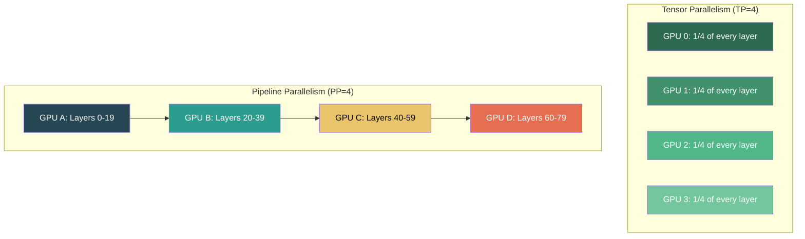
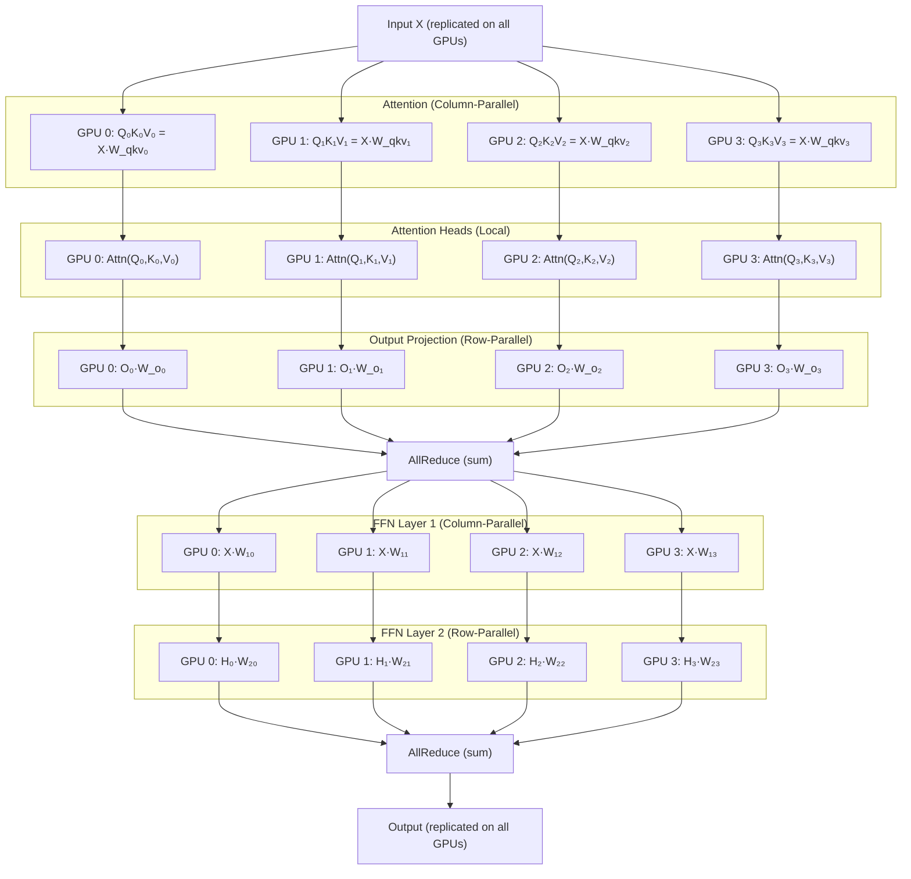
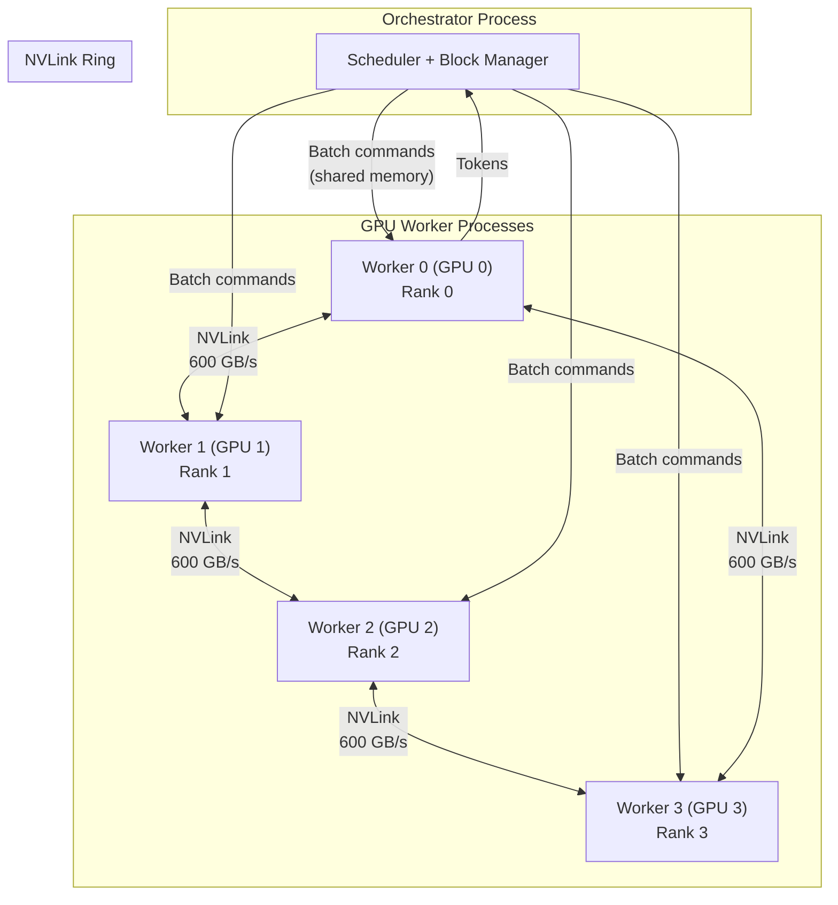
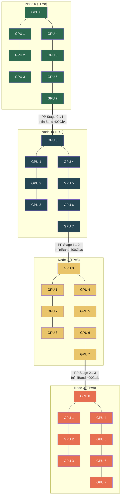

# Tensor Parallelism across Multi-GPU 🔴

> **The Problem:** A Llama 3 70B model in FP16 requires 140 GB of VRAM just for the weights. An A100-80GB GPU has… 80 GB. The model literally doesn't fit. Even in INT8 (70 GB), there's almost no room left for KV cache, activations, or batching. The solution is **Tensor Parallelism (TP)**: split every matrix multiplication across multiple GPUs so each GPU holds only $1/N$ of the parameters and contributes $1/N$ of the computation. This requires high-speed interconnects (NVLink) and collective communication primitives (NCCL AllReduce). Done right, 4× A100s serve a 70B model with near-linear throughput scaling. Done wrong, communication overhead eats all the gains.

---

## 4.1 Parallelism Taxonomy

Before diving into tensor parallelism, let's place it in context:

| Strategy | What is Split | Across What | Communication | Best For |
|---|---|---|---|---|
| **Data Parallelism** | Batches | N replicas of full model | AllReduce on gradients | Training |
| **Tensor Parallelism (TP)** | Matrices (within each layer) | N GPUs | AllReduce every layer | Single-node inference |
| **Pipeline Parallelism (PP)** | Layers (groups of layers) | N GPUs | Point-to-point activations | Multi-node inference |
| **Expert Parallelism (EP)** | MoE experts | N GPUs | All-to-All routing | MoE models (Mixtral) |

For single-node LLM inference (2–8 GPUs connected via NVLink), **Tensor Parallelism** is the dominant strategy. Pipeline Parallelism adds latency (each stage waits for the previous one) and is mostly used for multi-node deployments.



---

## 4.2 How Tensor Parallelism Works

The core insight: in a Transformer layer, the two largest operations are the **attention projection** and the **feed-forward network (FFN)**. Both are large matrix multiplications that can be split along specific dimensions.

### Column-Parallel Linear Layer

For a weight matrix $W \in \mathbb{R}^{d \times h}$, split it **by columns** across $N$ GPUs:

$$
W = [W_0 | W_1 | \ldots | W_{N-1}]
$$

Each GPU $i$ computes:

$$
Y_i = XW_i
$$

The outputs $Y_i$ are **independent** — no communication needed yet. This is used for the first linear layer of the FFN and the QKV projection.

### Row-Parallel Linear Layer

For the second matrix $V \in \mathbb{R}^{h \times d}$, split it **by rows**:

$$
V = \begin{bmatrix} V_0 \\ V_1 \\ \vdots \\ V_{N-1} \end{bmatrix}
$$

Each GPU $i$ computes $Z_i = Y_i V_i$, then the final output requires an **AllReduce** (sum):

$$
Z = \sum_{i=0}^{N-1} Z_i = \text{AllReduce}(Z_0, Z_1, \ldots, Z_{N-1})
$$

### Full Transformer Layer with TP=4



**Key observation:** There are exactly **2 AllReduce operations per Transformer layer** — one after the attention output projection and one after the FFN. This is the communication cost of tensor parallelism.

---

## 4.3 NCCL and AllReduce

**NCCL** (NVIDIA Collective Communications Library) implements high-performance collective operations over NVLink, NVSwitch, and PCIe.

### AllReduce Under the Hood

For $N$ GPUs each holding a vector of size $D$:

1. **Ring AllReduce:** Each GPU sends $D/N$ elements to the next GPU in a ring, $2(N-1)$ steps total.
2. **Bandwidth cost:** $\frac{2(N-1)}{N} \times D$ bytes ≈ $2D$ bytes for large $N$.
3. **For 4 GPUs over NVLink (900 GB/s bidirectional):** AllReduce of 16 MB takes ~18 μs.

### NVLink vs. PCIe: The Communication Cliff

| Interconnect | Bandwidth (per direction) | AllReduce 16 MB | Impact on Inference |
|---|---|---|---|
| NVLink 4.0 (A100) | 300 GB/s per link × 12 = 600 GB/s | ~18 μs | ✅ Negligible overhead |
| NVLink 5.0 (H100) | 450 GB/s per link × 18 = 900 GB/s | ~12 μs | ✅ Negligible overhead |
| PCIe 4.0 x16 | 32 GB/s | ~500 μs | ⚠️ 25× slower |
| PCIe 5.0 x16 | 64 GB/s | ~250 μs | ⚠️ 12× slower |

> **Rule of thumb:** Tensor parallelism within a node (NVLink) — excellent. Tensor parallelism across nodes (PCIe/InfiniBand) — use Pipeline Parallelism instead.

---

## 4.4 Rust Bindings for NCCL

Using `nccl-rs` or raw FFI bindings to the NCCL C library:

```rust
// ✅ NCCL AllReduce in Rust via FFI
use std::ffi::c_void;
use std::ptr;

// NCCL FFI bindings (simplified)
#[repr(C)]
pub struct NcclComm {
    _private: [u8; 0],
}

extern "C" {
    fn ncclCommInitRank(
        comm: *mut *mut NcclComm,
        nranks: i32,
        comm_id: NcclUniqueId,
        rank: i32,
    ) -> NcclResult;

    fn ncclAllReduce(
        sendbuff: *const c_void,
        recvbuff: *mut c_void,
        count: usize,
        datatype: NcclDataType,
        op: NcclRedOp,
        comm: *mut NcclComm,
        stream: CudaStream,
    ) -> NcclResult;
}

/// Safe Rust wrapper for NCCL communicator
pub struct NcclCommunicator {
    comm: *mut NcclComm,
    rank: i32,
    world_size: i32,
}

impl NcclCommunicator {
    /// Initialize NCCL communicator for a specific GPU rank
    pub fn new(world_size: i32, rank: i32, unique_id: NcclUniqueId) -> Self {
        let mut comm = ptr::null_mut();
        unsafe {
            let result =
                ncclCommInitRank(&mut comm, world_size, unique_id, rank);
            assert_eq!(result, NcclResult::Success, "NCCL init failed");
        }
        Self {
            comm,
            rank,
            world_size,
        }
    }

    /// Perform AllReduce (sum) on a GPU buffer
    ///
    /// # Safety
    /// `send_buf` and `recv_buf` must point to valid GPU memory of
    /// at least `count` elements.
    pub unsafe fn all_reduce_sum_f16(
        &self,
        send_buf: *const c_void,
        recv_buf: *mut c_void,
        count: usize,
        stream: CudaStream,
    ) {
        let result = ncclAllReduce(
            send_buf,
            recv_buf,
            count,
            NcclDataType::Float16,
            NcclRedOp::Sum,
            self.comm,
            stream,
        );
        assert_eq!(result, NcclResult::Success, "NCCL AllReduce failed");
    }
}

impl Drop for NcclCommunicator {
    fn drop(&mut self) {
        // ncclCommDestroy(self.comm);
    }
}
```

---

## 4.5 Weight Sharding: Loading a 70B Model on 4 GPUs

```rust
/// Shard model weights across GPUs for tensor parallelism
struct TensorParallelWeightLoader {
    world_size: usize,
    rank: usize,
}

impl TensorParallelWeightLoader {
    /// Load a column-parallel linear layer (split by output dimension)
    fn load_column_parallel(
        &self,
        full_weight: &Tensor, // Shape: [in_features, out_features]
    ) -> Tensor {
        let out_features = full_weight.shape()[1];
        let shard_size = out_features / self.world_size;
        let start = self.rank * shard_size;
        let end = start + shard_size;

        // Each GPU gets columns [start..end]
        full_weight.slice(/*dim=*/ 1, start, end)
    }

    /// Load a row-parallel linear layer (split by input dimension)
    fn load_row_parallel(
        &self,
        full_weight: &Tensor, // Shape: [in_features, out_features]
    ) -> Tensor {
        let in_features = full_weight.shape()[0];
        let shard_size = in_features / self.world_size;
        let start = self.rank * shard_size;
        let end = start + shard_size;

        // Each GPU gets rows [start..end]
        full_weight.slice(/*dim=*/ 0, start, end)
    }

    /// Load attention heads distributed across GPUs
    fn load_attention_heads(
        &self,
        qkv_weight: &Tensor,  // Shape: [hidden_dim, (num_q_heads + 2*num_kv_heads) * head_dim]
        num_q_heads: usize,
        num_kv_heads: usize,
        head_dim: usize,
    ) -> (Tensor, Tensor, Tensor) {
        // For GQA: Q heads are split evenly, KV heads may be replicated
        let q_heads_per_gpu = num_q_heads / self.world_size;
        let kv_heads_per_gpu = num_kv_heads / self.world_size;

        // Split Q: each GPU gets q_heads_per_gpu heads
        let q_start = self.rank * q_heads_per_gpu * head_dim;
        let q_end = q_start + q_heads_per_gpu * head_dim;

        // Split K and V similarly
        let k_offset = num_q_heads * head_dim;
        let k_start = k_offset + self.rank * kv_heads_per_gpu * head_dim;
        let k_end = k_start + kv_heads_per_gpu * head_dim;

        let v_offset = k_offset + num_kv_heads * head_dim;
        let v_start = v_offset + self.rank * kv_heads_per_gpu * head_dim;
        let v_end = v_start + kv_heads_per_gpu * head_dim;

        (
            qkv_weight.slice(1, q_start, q_end),
            qkv_weight.slice(1, k_start, k_end),
            qkv_weight.slice(1, v_start, v_end),
        )
    }
}
```

### Memory Per GPU (Llama 3 70B, TP=4)

| Component | Total | Per GPU (TP=4) |
|---|---|---|
| Model weights (FP16) | 140 GB | **35 GB** |
| Model weights (INT8) | 70 GB | **17.5 GB** |
| KV Cache (PagedAttention) | Dynamic | Proportional |
| Activations | ~2 GB | **~2 GB** (replicated) |
| NCCL buffers | ~1 GB | **~1 GB** |
| **Total (INT8)** | | **~21.5 GB + KV** |
| **Free for KV (A100-80GB)** | | **~58.5 GB** |

With TP=4, each A100 has **58.5 GB** for KV cache instead of ~10 GB — a **5.8× increase** in memory for batching.

---

## 4.6 The Forward Pass with Tensor Parallelism

```rust
/// A single Transformer layer with Tensor Parallelism
struct TensorParallelTransformerLayer {
    /// Column-parallel: QKV projection (split output dimension)
    qkv_proj: ColumnParallelLinear,
    /// Row-parallel: attention output projection
    attn_out_proj: RowParallelLinear,
    /// Column-parallel: FFN gate and up projections
    ffn_gate_up: ColumnParallelLinear,
    /// Row-parallel: FFN down projection
    ffn_down: RowParallelLinear,
    /// RMSNorm (replicated on all GPUs — small)
    attn_norm: RMSNorm,
    ffn_norm: RMSNorm,
    /// NCCL communicator
    nccl: NcclCommunicator,
}

impl TensorParallelTransformerLayer {
    async fn forward(
        &self,
        hidden_states: &mut GpuTensor,
        kv_cache: &mut PagedKvCache,
        block_table: &[PhysicalBlockId],
        stream: CudaStream,
    ) {
        // ── Attention Block ──

        // 1. RMSNorm (local, replicated)
        let normed = self.attn_norm.forward(hidden_states);

        // 2. QKV projection (column-parallel, no communication)
        let qkv = self.qkv_proj.forward(&normed); // Each GPU: partial Q, K, V

        // 3. Attention (local per GPU — each has its own heads)
        let attn_output =
            paged_attention(&qkv, kv_cache, block_table, stream);

        // 4. Output projection (row-parallel)
        let projected = self.attn_out_proj.forward(&attn_output);

        // 5. ★ AllReduce: sum partial results across all GPUs ★
        unsafe {
            self.nccl.all_reduce_sum_f16(
                projected.as_ptr(),
                projected.as_mut_ptr(),
                projected.numel(),
                stream,
            );
        }

        // 6. Residual connection
        hidden_states.add_inplace(&projected);

        // ── FFN Block ──

        // 7. RMSNorm (local, replicated)
        let normed = self.ffn_norm.forward(hidden_states);

        // 8. Gate + Up projection (column-parallel, no communication)
        let gate_up = self.ffn_gate_up.forward(&normed);

        // 9. SiLU activation + element-wise multiply (local)
        let activated = silu_and_mul(&gate_up);

        // 10. Down projection (row-parallel)
        let ffn_output = self.ffn_down.forward(&activated);

        // 11. ★ AllReduce: sum partial results across all GPUs ★
        unsafe {
            self.nccl.all_reduce_sum_f16(
                ffn_output.as_ptr(),
                ffn_output.as_mut_ptr(),
                ffn_output.numel(),
                stream,
            );
        }

        // 12. Residual connection
        hidden_states.add_inplace(&ffn_output);
    }
}
```

---

## 4.7 Multi-GPU Process Architecture in Rust

Each GPU is managed by a separate OS process (or thread with pinned CUDA context). Rust's type system helps prevent cross-GPU footguns:



```rust
use std::sync::Arc;
use tokio::sync::broadcast;

/// Launch tensor-parallel workers
async fn launch_tp_workers(
    world_size: usize,
    model_path: &str,
) -> Vec<tokio::task::JoinHandle<()>> {
    // Generate a unique NCCL ID (shared across all ranks)
    let nccl_id = nccl_get_unique_id();

    // Broadcast channel for batch commands from scheduler
    let (batch_tx, _) = broadcast::channel::<BatchCommand>(64);

    let mut handles = Vec::new();
    for rank in 0..world_size {
        let nccl_id = nccl_id.clone();
        let batch_rx = batch_tx.subscribe();
        let model_path = model_path.to_string();

        let handle = tokio::task::spawn_blocking(move || {
            // Pin to specific GPU
            cuda_set_device(rank);

            // Initialize NCCL communicator
            let nccl = NcclCommunicator::new(
                world_size as i32,
                rank as i32,
                nccl_id,
            );

            // Load sharded weights
            let loader = TensorParallelWeightLoader {
                world_size,
                rank,
            };
            let model = load_sharded_model(&model_path, &loader);

            // Worker loop: receive batch commands, execute, return tokens
            worker_loop(rank, model, nccl, batch_rx);
        });

        handles.push(handle);
    }

    handles
}
```

---

## 4.8 Tensor Parallelism vs. Pipeline Parallelism: Decision Matrix

| Factor | Tensor Parallelism (TP) | Pipeline Parallelism (PP) |
|---|---|---|
| **Communication pattern** | AllReduce (all-to-all) | Point-to-point (stage → stage) |
| **Communication volume** | $2 \times D$ per layer | $B \times D$ per layer boundary |
| **Latency impact** | Small (parallel compute) | Linear with pipeline depth |
| **Requires NVLink?** | Strongly recommended | Works over PCIe/InfiniBand |
| **GPU utilization** | High (all GPUs active) | Pipeline bubbles at start/end |
| **Ideal topology** | Within a single DGX node | Across nodes |
| **Typical degree** | TP=2, 4, or 8 | PP=2, 4, or 8 |

### Hybrid Parallelism (TP + PP)

For very large deployments (e.g., 405B model on 32 GPUs across 4 nodes):



- **Intra-node:** TP=8 over NVLink (high bandwidth, low latency)
- **Inter-node:** PP=4 over InfiniBand (lower bandwidth, higher latency, but only point-to-point)

---

## 4.9 Communication-Computation Overlap

The critical optimization for tensor parallelism: overlap the AllReduce communication with computation so that communication is "free":

```rust
/// Overlapped forward pass: start AllReduce while computing the next operation
async fn forward_with_overlap(
    &self,
    hidden_states: &mut GpuTensor,
    stream_compute: CudaStream,
    stream_comm: CudaStream,
) {
    // 1. Attention computation (on compute stream)
    let attn_output =
        self.attention_forward(hidden_states, stream_compute);

    // 2. Start AllReduce on communication stream
    //    (overlaps with step 3's computation)
    cuda_event_record(stream_compute); // sync point
    cuda_stream_wait_event(stream_comm); // comm waits for compute

    unsafe {
        self.nccl.all_reduce_sum_f16(
            attn_output.as_ptr(),
            attn_output.as_mut_ptr(),
            attn_output.numel(),
            stream_comm, // runs on separate CUDA stream
        );
    }

    // 3. Meanwhile, compute RMSNorm for FFN on compute stream
    //    (this overlaps with the AllReduce above)
    let normed = self.ffn_norm.forward(hidden_states, stream_compute);

    // 4. Wait for AllReduce to finish before using the result
    cuda_event_record(stream_comm);
    cuda_stream_wait_event(stream_compute);

    // 5. Continue with FFN...
    hidden_states.add_inplace(&attn_output); // residual
}
```

---

## 4.10 Scaling Efficiency

Real-world TP scaling on Llama 3 70B (A100-80GB SXM):

| TP Degree | GPUs | Tokens/sec (decode, batch=32) | Scaling Efficiency |
|---|---|---|---|
| TP=1 | 1 (INT4 only) | ~450 | 1.0× (baseline) |
| TP=2 | 2 | ~870 | 96.7% |
| TP=4 | 4 | ~1,680 | 93.3% |
| TP=8 | 8 | ~3,100 | 86.1% |

Scaling is near-linear for TP≤4 over NVLink. At TP=8, the AllReduce volume increases and starts to matter. Beyond TP=8, diminishing returns are significant — switch to Pipeline Parallelism for the next scaling step.

### Communication Overhead Formula

$$
t_{\text{AllReduce}} = \frac{2(N-1)}{N} \times \frac{D \times \text{bytes\_per\_elem}}{\text{NVLink BW}}
$$

For TP=4, hidden dim $D$ = 8192 (Llama 70B), FP16:

$$
t_{\text{AllReduce}} = \frac{6}{4} \times \frac{8192 \times 2}{600 \times 10^9} \approx 41 \text{ ns per AllReduce}
$$

With 2 AllReduces per layer and 80 layers: $41 \times 2 \times 80 = 6.6$ μs total. Against a ~35 ms decode step, that's **0.02% overhead**. TP over NVLink is essentially free.

---

> **Key Takeaways**
>
> 1. **Tensor Parallelism splits every matrix multiplication** across GPUs. Column-parallel for the first linear layer, row-parallel + AllReduce for the second.
> 2. **Exactly 2 AllReduce operations per Transformer layer** — this is the only communication cost.
> 3. **NVLink is mandatory** for efficient TP. Over PCIe, communication overhead grows 12–25× and kills throughput.
> 4. **Hybrid TP+PP** is the standard for multi-node deployments: TP within a node (NVLink), PP across nodes (InfiniBand).
> 5. **Weight sharding** distributes $1/N$ of parameters to each GPU — Rust's type system can enforce correct shard loading.
> 6. **Communication-computation overlap** makes AllReduce effectively free by running it on a separate CUDA stream.
> 7. **Scaling is near-linear** for TP ≤ 4. Beyond TP=8, diminishing returns favor pipeline parallelism.
