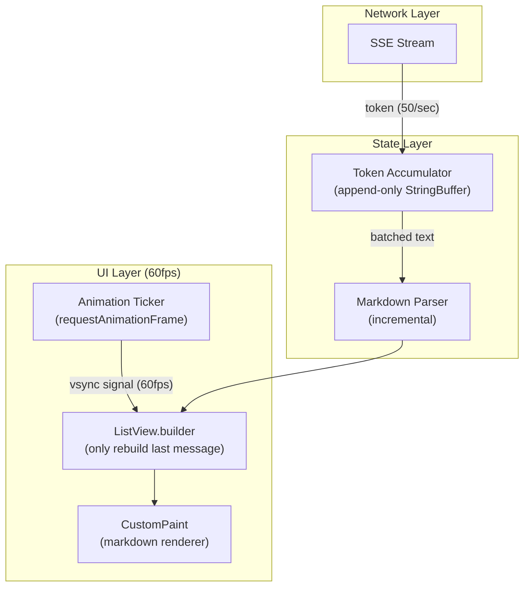
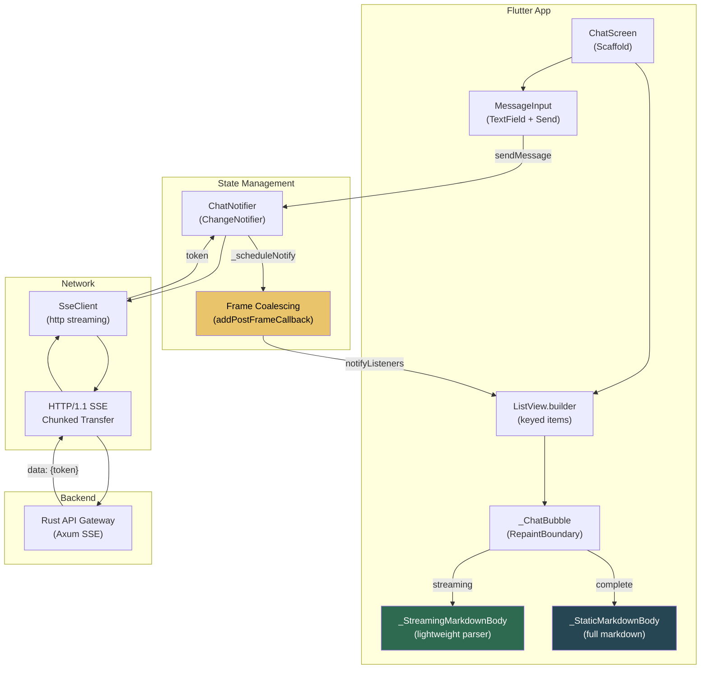

# The Flutter Client: Streaming Chat UI 🟡

> **The Problem:** You've built a blazing-fast inference engine with continuous batching, PagedAttention, and tensor parallelism. It streams tokens at 50+ tokens/second via SSE. Now the Flutter chat app receives those tokens and… the UI stutters. Every new token triggers a `setState()`, rebuilds the entire `ListView`, re-parses markdown, re-lays-out text, and drops frames. At 60fps you have **16.6ms per frame**. A naive implementation spends 40ms per token just on widget rebuilds. The solution: surgical partial updates, separated parsing from rendering, and `CustomPaint` for low-level text rendering when needed.

---

## 5.1 SSE Consumption in Flutter (Dart)

Server-Sent Events are simple: a long-lived HTTP response where each chunk is prefixed with `data: `. Flutter's `http` or `dio` libraries don't have native SSE support, so we use a streaming HTTP client:

### Naive SSE Client (The Wrong Way)

```dart
// ❌ Naive: accumulate entire response, then parse
// Problems: No streaming, high TTFT, massive memory allocation
Future<String> fetchCompletion(List<Message> messages) async {
  final response = await http.post(
    Uri.parse('$baseUrl/v1/chat/completions'),
    headers: {'Content-Type': 'application/json'},
    body: jsonEncode({
      'model': 'llama-3-70b',
      'messages': messages.map((m) => m.toJson()).toList(),
      'stream': false, // ← Not streaming!
    }),
  );

  // User waits 5-30 seconds seeing nothing…
  final data = jsonDecode(response.body);
  return data['choices'][0]['message']['content'];
}
```

### Production SSE Client

```dart
// ✅ Production: stream tokens as they arrive via SSE
import 'dart:async';
import 'dart:convert';
import 'package:http/http.dart' as http;

class SseClient {
  final String baseUrl;
  final http.Client _client;

  SseClient({required this.baseUrl}) : _client = http.Client();

  /// Returns a stream of token strings as they arrive from the server
  Stream<String> streamCompletion(List<Message> messages) async* {
    final request = http.Request(
      'POST',
      Uri.parse('$baseUrl/v1/chat/completions'),
    );
    request.headers['Content-Type'] = 'application/json';
    request.headers['Accept'] = 'text/event-stream';
    request.body = jsonEncode({
      'model': 'llama-3-70b',
      'messages': messages.map((m) => m.toJson()).toList(),
      'stream': true,
      'max_tokens': 2048,
    });

    final response = await _client.send(request);

    if (response.statusCode != 200) {
      throw HttpException('SSE failed: ${response.statusCode}');
    }

    // Process the byte stream line-by-line
    await for (final chunk in response.stream
        .transform(utf8.decoder)
        .transform(const LineSplitter())) {
      if (chunk.startsWith('data: ')) {
        final data = chunk.substring(6).trim();

        if (data == '[DONE]') {
          return; // Stream complete
        }

        try {
          final json = jsonDecode(data) as Map<String, dynamic>;
          final choices = json['choices'] as List<dynamic>;
          if (choices.isNotEmpty) {
            final delta = choices[0]['delta'] as Map<String, dynamic>?;
            final content = delta?['content'] as String?;
            if (content != null && content.isNotEmpty) {
              yield content; // Emit each token as it arrives
            }
          }
        } on FormatException {
          // Skip malformed chunks
          continue;
        }
      }
    }
  }

  void dispose() {
    _client.close();
  }
}
```

---

## 5.2 Architecture: Separating Data from UI

The key architectural insight: **decouple token accumulation from widget rebuilds**. Tokens arrive at 50+/sec but the screen refreshes at 60fps. We don't need to rebuild the widget tree for every token.



---

## 5.3 State Management: The Chat Notifier

Using a `ChangeNotifier` (or Riverpod `StateNotifier`) that batches token updates:

```dart
// ✅ Production chat state with frame-aware updates
import 'dart:async';
import 'package:flutter/foundation.dart';
import 'package:flutter/scheduler.dart';

class ChatMessage {
  final String role; // 'user' or 'assistant'
  final StringBuffer _content;
  bool isStreaming;

  ChatMessage({
    required this.role,
    String content = '',
    this.isStreaming = false,
  }) : _content = StringBuffer(content);

  String get content => _content.toString();

  void appendToken(String token) {
    _content.write(token);
  }
}

class ChatNotifier extends ChangeNotifier {
  final SseClient _sseClient;
  final List<ChatMessage> _messages = [];
  StreamSubscription<String>? _activeStream;
  bool _needsNotify = false;

  ChatNotifier(this._sseClient);

  List<ChatMessage> get messages => List.unmodifiable(_messages);
  bool get isStreaming => _activeStream != null;

  /// Send a user message and start streaming the response
  void sendMessage(String text) {
    // Add user message
    _messages.add(ChatMessage(role: 'user', content: text));

    // Add placeholder for assistant response
    final assistantMsg = ChatMessage(
      role: 'assistant',
      isStreaming: true,
    );
    _messages.add(assistantMsg);
    notifyListeners();

    // Start streaming
    _activeStream = _sseClient
        .streamCompletion(
          _messages
              .where((m) => !m.isStreaming || m.content.isNotEmpty)
              .map((m) => Message(role: m.role, content: m.content))
              .toList(),
        )
        .listen(
          (token) {
            assistantMsg.appendToken(token);
            _scheduleNotify(); // ← Don't notify immediately!
          },
          onDone: () {
            assistantMsg.isStreaming = false;
            _activeStream = null;
            _flushNotify();
          },
          onError: (error) {
            assistantMsg.appendToken('\n\n[Error: $error]');
            assistantMsg.isStreaming = false;
            _activeStream = null;
            _flushNotify();
          },
          cancelOnError: true,
        );
  }

  /// Schedule a notification on the next frame — coalesces multiple tokens
  /// into a single widget rebuild per frame
  void _scheduleNotify() {
    if (!_needsNotify) {
      _needsNotify = true;
      SchedulerBinding.instance.addPostFrameCallback((_) {
        _flushNotify();
      });
    }
  }

  void _flushNotify() {
    if (_needsNotify) {
      _needsNotify = false;
      notifyListeners();
    }
  }

  void stopStreaming() {
    _activeStream?.cancel();
    _activeStream = null;
    if (_messages.isNotEmpty && _messages.last.isStreaming) {
      _messages.last.isStreaming = false;
    }
    notifyListeners();
  }

  @override
  void dispose() {
    _activeStream?.cancel();
    super.dispose();
  }
}
```

### Why `_scheduleNotify()` Matters

| Approach | Rebuilds/sec | Frame Drops |
|---|---|---|
| `notifyListeners()` on every token | 50+ | **Heavy jank** (40ms per rebuild) |
| `_scheduleNotify()` (frame-coalesced) | 60 max | **Zero jank** (multiple tokens per frame) |

At 50 tokens/sec and 60fps, we get ~0.83 tokens per frame on average. By coalescing, we batch all tokens that arrive between frames into a single rebuild.

---

## 5.4 The Chat ListView: Minimal Rebuilds

The critical error most Flutter developers make: rebuilding the **entire** `ListView` when a new token arrives. Instead, only rebuild the **last message** (the one being streamed):

```dart
// ✅ Production chat list with minimal rebuilds
class ChatListView extends StatefulWidget {
  final ChatNotifier chatNotifier;

  const ChatListView({super.key, required this.chatNotifier});

  @override
  State<ChatListView> createState() => _ChatListViewState();
}

class _ChatListViewState extends State<ChatListView> {
  final ScrollController _scrollController = ScrollController();

  @override
  Widget build(BuildContext context) {
    return ListenableBuilder(
      listenable: widget.chatNotifier,
      builder: (context, _) {
        final messages = widget.chatNotifier.messages;

        return ListView.builder(
          controller: _scrollController,
          // ← Key optimization: only build visible items
          itemCount: messages.length,
          // ← Estimate item extent to avoid layout thrashing
          // during streaming (new tokens change height)
          itemBuilder: (context, index) {
            final msg = messages[index];

            return _ChatBubble(
              key: ValueKey('msg_$index'),
              message: msg,
              // Only the last message (streaming) gets a RepaintBoundary
              isActive: index == messages.length - 1 && msg.isStreaming,
            );
          },
        );
      },
    );
  }

  @override
  void dispose() {
    _scrollController.dispose();
    super.dispose();
  }
}
```

---

## 5.5 The Chat Bubble: RepaintBoundary + CustomPaint

For the actively streaming message, wrap in a `RepaintBoundary` so only that widget repaints — the rest of the list is untouched:

```dart
class _ChatBubble extends StatelessWidget {
  final ChatMessage message;
  final bool isActive;

  const _ChatBubble({
    super.key,
    required this.message,
    required this.isActive,
  });

  @override
  Widget build(BuildContext context) {
    final isUser = message.role == 'user';

    final bubble = Container(
      margin: const EdgeInsets.symmetric(horizontal: 16, vertical: 4),
      padding: const EdgeInsets.all(12),
      decoration: BoxDecoration(
        color: isUser
            ? Theme.of(context).colorScheme.primaryContainer
            : Theme.of(context).colorScheme.surfaceContainerHighest,
        borderRadius: BorderRadius.circular(16),
      ),
      child: isActive
          ? _StreamingMarkdownBody(text: message.content)
          : _StaticMarkdownBody(text: message.content),
    );

    // RepaintBoundary: isolate repaints to this widget only
    return isActive ? RepaintBoundary(child: bubble) : bubble;
  }
}

/// For the actively streaming message: use CustomPaint for maximum control
class _StreamingMarkdownBody extends StatelessWidget {
  final String text;

  const _StreamingMarkdownBody({required this.text});

  @override
  Widget build(BuildContext context) {
    // For streaming content, render as simple styled text
    // to avoid expensive markdown parsing every frame.
    // Parse markdown only for code blocks (```) and bold (**)
    return Text.rich(
      _fastParseMarkdown(text, context),
      style: Theme.of(context).textTheme.bodyLarge,
    );
  }
}

/// Lightweight inline markdown parser — only handles the essentials
/// during streaming. Full parse happens when streaming completes.
TextSpan _fastParseMarkdown(String text, BuildContext context) {
  final spans = <InlineSpan>[];
  final codeStyle = TextStyle(
    fontFamily: 'monospace',
    backgroundColor: Theme.of(context).colorScheme.surfaceContainerHighest,
  );
  final boldStyle = const TextStyle(fontWeight: FontWeight.bold);

  // Simple state machine for inline code and bold
  final buffer = StringBuffer();
  var i = 0;
  while (i < text.length) {
    if (text[i] == '`' && i + 1 < text.length && text[i + 1] != '`') {
      // Inline code
      if (buffer.isNotEmpty) {
        spans.add(TextSpan(text: buffer.toString()));
        buffer.clear();
      }
      i++;
      final codeStart = i;
      while (i < text.length && text[i] != '`') {
        i++;
      }
      spans.add(TextSpan(
        text: text.substring(codeStart, i),
        style: codeStyle,
      ));
      if (i < text.length) i++; // skip closing `
    } else if (text[i] == '*' &&
        i + 1 < text.length &&
        text[i + 1] == '*') {
      // Bold
      if (buffer.isNotEmpty) {
        spans.add(TextSpan(text: buffer.toString()));
        buffer.clear();
      }
      i += 2;
      final boldStart = i;
      while (i + 1 < text.length &&
          !(text[i] == '*' && text[i + 1] == '*')) {
        i++;
      }
      spans.add(TextSpan(
        text: text.substring(boldStart, i),
        style: boldStyle,
      ));
      if (i + 1 < text.length) i += 2; // skip closing **
    } else {
      buffer.writeCharCode(text.codeUnitAt(i));
      i++;
    }
  }

  if (buffer.isNotEmpty) {
    spans.add(TextSpan(text: buffer.toString()));
  }

  return TextSpan(children: spans);
}

/// For completed messages: full markdown rendering (expensive but only once)
class _StaticMarkdownBody extends StatelessWidget {
  final String text;

  const _StaticMarkdownBody({required this.text});

  @override
  Widget build(BuildContext context) {
    // Use a full markdown renderer (e.g., flutter_markdown) here.
    // This only runs once when streaming completes.
    return SelectableText.rich(
      _fastParseMarkdown(text, context),
      style: Theme.of(context).textTheme.bodyLarge,
    );
  }
}
```

---

## 5.6 Architecture Diagram: Full Client Stack



---

## 5.7 Auto-Scrolling Without Jank

Auto-scrolling to the bottom as tokens arrive is surprisingly tricky. Naive `scrollController.jumpTo(maxScrollExtent)` causes jank because `maxScrollExtent` changes every frame during streaming:

```dart
/// Smooth auto-scroll that respects user intent
class AutoScrollController {
  final ScrollController scrollController;
  bool _userHasScrolledUp = false;
  bool _isAutoScrolling = false;

  AutoScrollController(this.scrollController) {
    scrollController.addListener(_onScroll);
  }

  void _onScroll() {
    if (_isAutoScrolling) return;

    // Detect if user has scrolled up (away from bottom)
    final maxScroll = scrollController.position.maxScrollExtent;
    final currentScroll = scrollController.offset;
    _userHasScrolledUp = (maxScroll - currentScroll) > 50;
  }

  /// Call this after each notifyListeners (on frame callback)
  void scrollToBottomIfNeeded() {
    if (_userHasScrolledUp) return; // Respect user's scroll position

    // Use animateTo with a very short duration for smooth snapping
    WidgetsBinding.instance.addPostFrameCallback((_) {
      if (!scrollController.hasClients) return;

      _isAutoScrolling = true;
      scrollController
          .animateTo(
            scrollController.position.maxScrollExtent,
            duration: const Duration(milliseconds: 50),
            curve: Curves.easeOut,
          )
          .then((_) => _isAutoScrolling = false);
    });
  }

  void dispose() {
    scrollController.removeListener(_onScroll);
  }
}
```

---

## 5.8 Performance Comparison

| Technique | Rebuild Scope | Frames Dropped (per 100 tokens) | Memory Alloc |
|---|---|---|---|
| `setState()` on every token | Entire widget tree | **40–80** | High (new widgets) |
| `ValueNotifier` per message | Single message | **10–20** | Medium |
| `ChangeNotifier` + frame coalescing | Single message, max 60/sec | **0–2** | Low |
| `CustomPaint` + frame coalescing | Paint only (no layout) | **0** | Minimal |

---

## 5.9 Handling Edge Cases

### Connection Drops and Reconnection

```dart
Stream<String> streamWithRetry(
  List<Message> messages, {
  int maxRetries = 3,
}) async* {
  var attempt = 0;
  var accumulated = StringBuffer();

  while (attempt < maxRetries) {
    try {
      await for (final token in _sseClient.streamCompletion(messages)) {
        accumulated.write(token);
        yield token;
      }
      return; // Completed successfully
    } catch (e) {
      attempt++;
      if (attempt >= maxRetries) {
        yield '\n\n[Connection lost after $maxRetries retries]';
        return;
      }
      // Exponential backoff
      await Future.delayed(Duration(milliseconds: 500 * attempt));
      // Note: server would need to support resumption with context
    }
  }
}
```

### Cancellation (User Presses Stop)

```dart
void stopStreaming() {
  _activeStream?.cancel();    // Cancel the HTTP connection
  _activeStream = null;

  if (_messages.isNotEmpty && _messages.last.isStreaming) {
    _messages.last.isStreaming = false;
    // Append a visual indicator that generation was stopped
    _messages.last.appendToken('\n\n⏹ *Generation stopped by user*');
  }

  notifyListeners();
}
```

### Long Code Blocks: Syntax Highlighting

For code blocks (`\`\`\`rust … \`\`\``), full syntax highlighting during streaming is expensive. Strategy:

1. **During streaming:** Render code blocks as monospace text with a background color (no highlighting).
2. **After streaming completes:** Parse and apply syntax highlighting asynchronously using a `compute()` isolate.
3. **Swap in** the highlighted version without layout shift.

```dart
/// Async syntax highlighting in an isolate
Future<TextSpan> highlightCodeBlock(String code, String language) async {
  return compute(_highlightInIsolate, _HighlightParams(code, language));
}

class _HighlightParams {
  final String code;
  final String language;
  _HighlightParams(this.code, this.language);
}

TextSpan _highlightInIsolate(_HighlightParams params) {
  // Use a syntax highlighting library in the isolate
  // (e.g., flutter_highlight or highlight.dart)
  // Returns TextSpan with colored spans
  // ...
  return TextSpan(text: params.code); // placeholder
}
```

---

## 5.10 Testing the Streaming UI

```dart
// Widget test: verify tokens render without frame drops
testWidgets('streaming renders tokens at 60fps', (tester) async {
  final notifier = ChatNotifier(MockSseClient());

  await tester.pumpWidget(
    MaterialApp(
      home: ChangeNotifierProvider.value(
        value: notifier,
        child: const ChatScreen(),
      ),
    ),
  );

  // Simulate sending a message
  notifier.sendMessage('Hello');
  await tester.pump(); // Process the send

  // Simulate 50 tokens arriving
  for (var i = 0; i < 50; i++) {
    // Tokens arrive at ~1ms intervals (faster than frame time)
    notifier.messages.last.appendToken('token_$i ');
    notifier._scheduleNotify();
  }

  // Single pump should pick up all 50 tokens (frame coalescing)
  await tester.pump();

  // Verify all tokens rendered
  expect(
    find.textContaining('token_49'),
    findsOneWidget,
  );
});
```

---

> **Key Takeaways**
>
> 1. **SSE is the right protocol** for LLM streaming: simpler than WebSockets, works through CDNs, and sufficient for server-push token delivery.
> 2. **Never call `notifyListeners()` on every token.** Coalesce updates to the frame boundary using `addPostFrameCallback` — this caps rebuilds at 60/sec regardless of token rate.
> 3. **`RepaintBoundary`** isolates the streaming message's repaints from the rest of the chat list. Only one bubble needs to repaint per frame.
> 4. **Two-phase markdown rendering:** fast lightweight parsing during streaming, full rich markdown rendering after completion.
> 5. **Auto-scroll must respect user intent.** If the user scrolls up to read earlier messages, don't snap them back to the bottom.
> 6. **Test with `tester.pump()`** to verify that frame coalescing works — 50 tokens should result in 1 rebuild, not 50.
