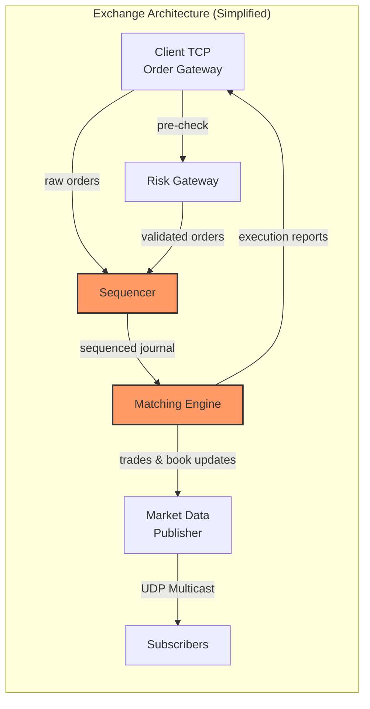

# System Design: The Ultra-Low Latency Matching Engine

> *"Every exchange is just an opinion about who gets filled first. The matching engine is the machine that enforces that opinion — deterministically, in microseconds, with zero tolerance for ambiguity."*

---

## About This Guide

This is a principal-level system design handbook for building the single most critical piece of infrastructure in all of electronic finance: **the matching engine**. It is the beating heart of every stock exchange, derivatives venue, and crypto spot market on the planet. When NASDAQ processes 30 billion messages per day, when the CME matches 6 billion contracts per year, when Binance handles 100,000 orders per second — the matching engine is the component that decides who trades with whom, at what price, and in what order.

This book does not teach you how to trade. It teaches you how to build the machine that makes trading possible.

We approach the problem from first principles. Every chapter begins with a naive architecture — often database-backed — and systematically eliminates every source of latency and non-determinism until we arrive at the design that actually runs in production at tier-one exchanges: a single-threaded, event-sourced, lock-free state machine that processes orders in under 10 microseconds, replicated across redundant instances via a sequenced journal, broadcasting price updates to the world via UDP multicast.

The design space is brutally constrained:

| Constraint | Why It Matters |
|---|---|
| **Determinism** | Two replicas processing the same journal must produce *bit-identical* state. One floating-point rounding difference = split-brain. |
| **Fairness** | FIFO ordering is a *regulatory requirement*. The sequencer's monotonic ID is the legal record of who was first. |
| **Latency** | Every microsecond of matching delay is a microsecond a faster venue steals your liquidity. |
| **Availability** | A 5-second outage during a market crash can cause billions in losses and regulatory penalties. |

---

## Speaker Intro

This material is written from the perspective of a **Principal Financial Systems Architect** with deep experience building exchange-grade matching infrastructure:

- **Matching Engine Core** — designed and shipped engines processing 500,000+ orders/second with p99 match latency < 8µs, zero heap allocations on the hot path, deterministic replay from journal.
- **Event Sourcing & Journaling** — memory-mapped append-only journals with `O_DIRECT` + `fallocate` pre-allocation, achieving 2M+ writes/second with guaranteed durability via battery-backed write cache.
- **State Machine Replication** — active-passive replication where the standby engine processes the identical sequenced stream and can assume primary role within 50µs of failure detection (heartbeat gap).
- **Market Data Distribution** — UDP multicast publishers streaming full-depth order book snapshots and incremental updates to 10,000+ subscribers with zero per-client overhead.
- **Risk Gating** — pre-trade risk gateways performing margin validation, position limit checks, and fat-finger guards in < 2µs per order, integrated inline before the sequencer.
- **Regulatory Compliance** — SEC Rule 613 (Consolidated Audit Trail), MiFID II tick-level timestamping, and exchange self-regulatory surveillance feeds — all derived from the same deterministic journal.

---

## Who This Is For

- **Senior engineers designing exchange or trading infrastructure** — at exchanges (NASDAQ, CME, ICE), dark pools, crypto venues, or internal crossing engines at broker-dealers.
- **Backend engineers transitioning from web-scale to finance** — you've built million-RPS services, but have never dealt with deterministic single-threaded state machines or regulatory fairness constraints.
- **System design interview candidates at fintech firms** — preparing for staff+ interviews at firms building order management, execution, or settlement systems.
- **Rust developers building high-performance stateful services** — the matching engine is the purest expression of the event-sourced, single-writer, zero-allocation architecture pattern.

### What This Guide Is NOT

- It is not a trading strategy guide. We do not cover alpha, signals, or market making.
- It is not a networking deep-dive. We cover UDP multicast architecture but not kernel bypass (see [Quantitative Finance](../quant-finance-book/src/SUMMARY.md) for DPDK/ef_vi).
- It is not exchange-specific. We design a *generic* price-time priority matching engine; exchange-specific protocols (FIX, ITCH, OUCH) are out of scope.

---

## Prerequisites

| Concept | Required Level | Where to Learn |
|---|---|---|
| Rust ownership, borrowing, lifetimes | Fluent | [Rust Memory Management](../memory-management-book/src/SUMMARY.md) |
| Data structures (trees, linked lists, hash maps) | Strong | [Algorithms & Concurrency](../algorithms-concurrency-book/src/SUMMARY.md) |
| Systems programming (mmap, file I/O, memory layout) | Intermediate | [Rust for C/C++ Programmers](../c-cpp-book/src/SUMMARY.md) |
| Concurrency primitives (atomics, CAS, memory ordering) | Working knowledge | [Concurrency in Rust](../concurrency-book/src/SUMMARY.md) |
| Basic financial markets (bid, ask, order types) | Awareness | Chapter 0 of this book covers the essentials |

---

## How to Use This Book

| Indicator | Meaning |
|---|---|
| 🟢 **Architecture** | System-level design, data flow, and component boundaries |
| 🟡 **Memory / Data Structures** | In-memory data structure design, fixed-point arithmetic, cache-aware layout |
| 🔴 **Hardware / Determinism** | Single-threaded constraints, replication, multicast, nanosecond-level concerns |

### Pacing Guide

| Chapters | Topic | Estimated Time | Checkpoint |
|---|---|---|---|
| Ch 0 | Introduction & Financial Primer | 1–2 hours | Can explain price-time priority matching, order types, and fairness constraints |
| Ch 1 | Ingress Sequencer & Event Sourcing | 4–6 hours | Can design a memory-mapped journal with monotonic sequencing |
| Ch 2 | The Limit Order Book | 6–8 hours | Can implement an LOB with O(1) insert/cancel/execute using Red-Black Trees + intrusive lists |
| Ch 3 | Determinism & State Machine Replication | 6–8 hours | Can explain why single-threaded + fixed-point + deterministic replay = zero-downtime failover |
| Ch 4 | UDP Multicast Market Data | 4–6 hours | Can design a multicast publisher with snapshot + incremental updates and gap detection |
| Ch 5 | The Risk Gateway | 4–6 hours | Can build an in-memory pre-trade risk check with margin validation and balance locking |

**Fast Track (Interview Prep):** Chapters 1, 2, 3 — covers the core matching engine design that staff-level interviewers care about.

**Full Track (Mastery):** All chapters sequentially. Budget 2 weeks of focused study.

---

## Table of Contents

### Part I: Order Ingress and Journaling

| Chapter | Description |
|---|---|
| **1. The Ingress Sequencer & Event Sourcing** 🟢 | Why the matching engine never talks to a database. TCP order reception, monotonic sequence IDs, memory-mapped journals, and the event-sourcing pattern that makes the engine deterministically replayable. |

### Part II: The Core Matching Engine

| Chapter | Description |
|---|---|
| **2. The Limit Order Book (LOB)** 🟡 | The data structure at the center of every exchange. Red-Black Trees for price levels, intrusive doubly-linked lists for order queues, arena allocation for zero-GC operation. $O(1)$ insert, cancel, and match. |
| **3. Determinism and State Machine Replication** 🔴 | Why matching engines are single-threaded. Fixed-point integer arithmetic for currency. Bit-identical replay. Active-passive replication via journal forwarding. Microsecond failover. |

### Part III: Market Data Distribution

| Chapter | Description |
|---|---|
| **4. UDP Multicast Market Data** 🔴 | Broadcasting the order book to the world. Why TCP fails for price feeds. UDP multicast architecture, IGMP, snapshot + incremental update protocol, sequence-based gap detection. |

### Part IV: Risk and Gatekeeping

| Chapter | Description |
|---|---|
| **5. The Risk Gateway** 🟡 | Preventing catastrophic losses before orders reach the engine. In-memory margin checks, balance locking, fat-finger guards, and the architectural trade-off of latency vs. safety. |

### Appendices

| Section | Description |
|---|---|
| **Appendix A: Summary & Reference Card** | Latency budget breakdown, data structure cheat sheet, journal format specification, and interview question bank. |

---

## The Financial Primer: How Matching Actually Works

Before we build the engine, let us understand what it does.

### The Order Book

An exchange maintains an **order book** for each tradable instrument (e.g., AAPL, BTC-USD). The book contains two sides:

- **Bids** — buy orders, sorted highest price first (the buyer willing to pay the most is at the top).
- **Asks** (offers) — sell orders, sorted lowest price first (the seller willing to accept the least is at the top).

The **best bid** and **best ask** (also called the *top of book* or *inside market*) define the **spread** — the gap between the highest buyer and the lowest seller.

### Price-Time Priority

When a new order arrives that can trade (e.g., a buy at \$150.10 when the best ask is \$150.10), the engine must decide *which* resting order gets filled. The universal rule at regulated exchanges is **price-time priority**:

1. **Price priority** — the order at the best price always fills first.
2. **Time priority** — among orders at the same price, the order that arrived *first* fills first.

This is why the **sequencer** in Chapter 1 is so critical — its monotonic sequence number is the authoritative timestamp that determines fairness.

### Order Types (Simplified)

| Order Type | Behavior |
|---|---|
| **Limit Order** | "Buy 100 shares at ≤ \$150.10." Rests on the book if no match is available. |
| **Market Order** | "Buy 100 shares at *any* price." Matches immediately against the best available ask(s). |
| **Cancel** | Remove a previously placed limit order from the book. |

In production, there are dozens of order types (IOC, FOK, stop-limit, iceberg, etc.), but these three capture the core matching logic.

### A Matching Example

```
Book State:
  ASKS:  $150.12 × 200  |  $150.11 × 100  |  $150.10 × 300
  BIDS:  $150.08 × 500  |  $150.07 × 150  |  $150.06 × 400

Incoming: BUY 250 shares @ MARKET

Step 1: Match 100 @ $150.10 (fills the entire 150.10 level)
Step 2: Match 100 @ $150.11 (fills the entire 150.11 level)
Step 3: Match  50 @ $150.12 (partially fills the 150.12 level)

Result: Buyer gets 250 shares, average price $150.108
        Ask side: $150.12 × 150 remains
```

This entire sequence — receive, sequence, match, publish — must complete in **single-digit microseconds**.



---

## Companion Guides

| Guide | Relevance |
|---|---|
| [Quantitative Finance: Low-Latency Systems](../quant-finance-book/src/SUMMARY.md) | Kernel bypass networking, NUMA, FPGA — the hardware layer *beneath* this book |
| [Algorithms & Concurrency](../algorithms-concurrency-book/src/SUMMARY.md) | Lock-free data structures, SPSC ring buffers, skip lists |
| [Distributed Systems](../distributed-systems-book/src/SUMMARY.md) | Consensus, replication, exactly-once semantics |
| [Zero-Copy Architecture](../zero-copy-book/src/SUMMARY.md) | io_uring, memory-mapped I/O, rkyv serialization |
| [Hardware Sympathy](../hardware-sympathy-book/src/SUMMARY.md) | CPU caches, MESI protocol, TLB, thread-per-core |
